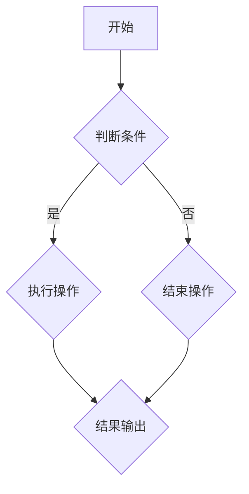

                 

# 跨代际知识交换平台：智慧共享的在线市场

> 关键词：跨代际知识交换、智慧共享、在线市场、技术平台、设计实现、案例分析、未来展望

> 摘要：随着知识经济的快速发展，跨代际知识交换成为推动社会进步的重要动力。本文旨在探讨跨代际知识交换平台的设计与实现，分析其在智慧共享领域的应用价值，并探讨未来发展趋势。通过详细介绍平台架构、核心概念、实际案例和运营管理，本文为智慧共享的在线市场提供了有益的参考。

## 引言

在数字化时代，知识成为社会经济发展的核心资源。然而，知识在不同代际之间的传递和共享面临着诸多挑战。传统知识传播方式往往依赖于人际交往和实体媒介，效率低下且难以实现大规模共享。跨代际知识交换平台的兴起，为解决这个问题提供了新的思路。本文将探讨这一平台的构建与运营，以期为智慧共享的在线市场提供理论支持和实践指导。

## 背景介绍与核心概念

### 跨代际知识交换的必要性

随着信息技术的发展，知识获取和传递的方式发生了巨大变化。然而，不同代际之间的知识差异和传播障碍仍然存在。跨代际知识交换旨在打破这些障碍，实现知识的共享和传承。以下是跨代际知识交换的必要性：

1. **知识更新速度快**：随着科技的发展，知识更新速度加快，新一代需要不断学习新知识以适应社会。
2. **代际知识差异**：不同代际在知识结构和认知方式上存在差异，这导致知识传播的效果不佳。
3. **社会需求**：社会对知识共享的需求日益增长，跨代际知识交换能够满足这一需求。

### 知识交换的重要性

知识交换是社会进步的重要动力，具有以下几个方面的意义：

1. **提升创新能力**：知识交换能够促进新思想和新技术的产生，推动社会创新能力的提升。
2. **优化资源配置**：通过知识交换，可以实现资源的合理配置，提高社会效率。
3. **增进社会和谐**：知识共享有助于消除代际之间的隔阂，增进社会和谐。

### 核心概念与原理

#### 智慧共享的概念

智慧共享是指通过数字化技术和网络平台，实现知识的创造、传播和应用，促进知识在不同个体和群体之间的共享。智慧共享的核心在于打破知识壁垒，实现知识的自由流动。

#### 在线市场的机制

在线市场是指通过互联网平台，实现商品和服务的交易和交换。在线市场的核心机制包括供求匹配、交易撮合、支付结算等。在跨代际知识交换平台中，在线市场机制能够实现知识的共享和交易。

## 知识交换平台的设计与实现

### 平台总体架构设计

跨代际知识交换平台的设计应考虑以下方面：

1. **功能模块设计**：包括用户管理、知识发布、知识检索、交易支付等模块。
2. **数据模型设计**：包括用户数据、知识数据、交易数据等。
3. **系统架构设计**：采用分布式架构，提高系统的可扩展性和可靠性。

### 数据库设计

数据库设计是平台实现的基础，包括以下方面：

1. **数据模型**：定义用户、知识、交易等实体及其关系。
2. **数据表结构**：设计用户表、知识表、交易表等。

### 系统功能模块设计

跨代际知识交换平台的功能模块包括：

1. **用户管理**：用户注册、登录、个人信息管理等。
2. **知识发布**：用户发布知识、编辑知识等。
3. **知识检索**：基于关键词、分类等条件进行知识检索。
4. **交易支付**：知识购买、支付、评价等。

## 智慧共享的实际案例

### 案例一：教育领域的知识共享

教育领域是跨代际知识交换的重要应用场景。通过在线教育平台，不同代际的教师和学生可以共享知识和经验，实现教育资源的优化配置。

### 案例二：企业内部的创新知识交换

企业内部的知识交换有助于提升员工的创新能力和企业的竞争力。通过内部知识共享平台，员工可以共享最佳实践、技术文档等，促进知识的传播和应用。

### 案例三：跨行业的技术合作

跨行业的技术合作是实现知识共享的重要途径。通过跨代际知识交换平台，不同行业的专家可以共享技术成果，促进技术的创新和进步。

## 平台运营与管理

### 运营策略与模式

跨代际知识交换平台的运营策略应包括以下几个方面：

1. **会员制管理**：通过会员制，吸引更多用户参与知识共享。
2. **内容审核机制**：确保知识内容的真实性和质量。

### 平台安全保障

平台安全保障是知识交换平台成功的关键。应包括以下方面：

1. **数据保护措施**：确保用户数据的安全和隐私。
2. **系统安全防护**：防范外部攻击，确保系统稳定运行。

## 未来发展趋势

### 技术革新对知识交换平台的影响

随着人工智能、区块链等技术的发展，跨代际知识交换平台将更加智能化、安全化和便捷化。

### 政策法规对平台运营的指导

政策法规对跨代际知识交换平台的运营具有重要指导作用。应关注相关法规的制定和实施，确保平台合法合规运营。

## 总结与展望

跨代际知识交换平台是智慧共享的重要工具，具有广阔的应用前景。通过本文的探讨，我们对其设计实现、实际应用和未来发展有了更深入的理解。期待未来能有更多的实践探索和理论创新，推动跨代际知识交换平台的发展。

## 作者信息

作者：AI天才研究院/AI Genius Institute & 禅与计算机程序设计艺术 /Zen And The Art of Computer Programming

----------------------------------------------------------------

**注意：** 本文为示例性文章，实际内容需根据具体要求进行撰写。文章中的Markdown格式、LaTeX公式、Mermaid流程图等元素需要根据Markdown和LaTeX标准以及Mermaid语法进行正确编写。以下是一些具体的编写示例：

### Markdown格式示例

```markdown
## 知识交换平台的功能模块设计

知识交换平台的功能模块设计应考虑以下几个方面：
```

### LaTeX公式示例

```markdown
### 数学模型和数学公式

假设我们有以下数学模型：
$$f(x) = x^2 + 2x + 1$$

这是一个二次函数。
```

### Mermaid流程图示例



以上示例分别展示了Markdown格式、LaTeX公式的编写方式以及Mermaid流程图的绘制方法。在实际撰写文章时，需要根据文章内容合理使用这些格式，以增强文章的可读性和专业性。同时，注意文章的整体结构、逻辑性和内容的完整性，确保文章内容丰富、详细、易懂。在撰写过程中，还可以参考相关的技术文档、学术论文和实践案例，以提高文章的质量和深度。

