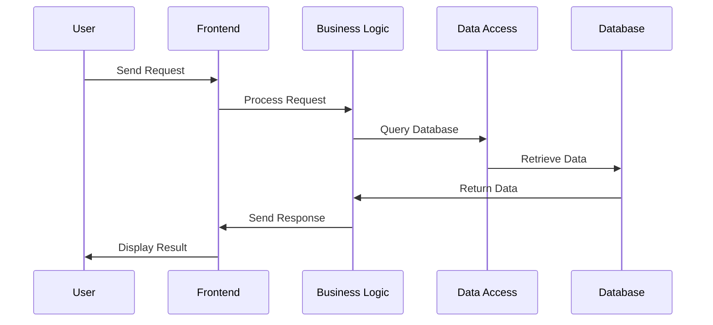
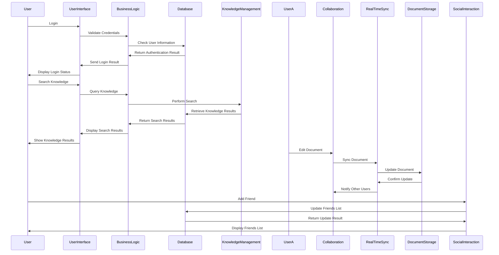

                 

### 目录

- **文章标题**: 跨代际知识银行：智慧存储与分享的在线平台
- **关键词**: 跨代际知识管理、知识银行、在线平台、智慧存储、知识分享
- **摘要**: 本文探讨了跨代际知识银行的概念、构建方法及其在线平台的实现，详细分析了知识存储和分享的关键技术和策略，并提供了完整的系统架构设计及项目实战案例，旨在为IT领域知识管理提供全面的指导。

### 背景介绍

#### 关键概念术语说明

- **跨代际知识管理**：一种通过利用不同代际之间的知识差异，实现对知识的收集、存储、共享和再利用的管理方法。
- **知识银行**：一个专门用于存储、管理和共享知识的系统或平台。
- **在线平台**：通过网络提供的服务平台，用户可以通过网络访问并使用平台提供的各种功能。
- **智慧存储**：通过先进的技术手段，如大数据、人工智能等，实现知识的智能化管理和存储。
- **知识分享**：在个体或群体之间交换、传播和共享知识的过程。

#### 问题背景

随着信息技术的迅猛发展，知识已经成为现代社会的重要资产。然而，传统的知识管理方法往往局限于单一的领域或组织内部，难以实现跨代际、跨组织的高效知识共享。这就需要一种新型的知识管理平台——跨代际知识银行，来应对这一挑战。

#### 问题描述

跨代际知识银行旨在构建一个在线平台，实现以下目标：

1. **知识存储**：利用现代信息技术，高效、安全地存储不同代际的知识。
2. **知识共享**：通过平台提供便捷的知识检索、共享和协作功能，促进知识在个体和群体之间的传播。
3. **知识更新**：确保知识库中的知识实时更新，反映最新的研究成果和实践经验。
4. **知识传承**：通过跨代际的知识传递，实现知识的长期积累和传承。

#### 问题解决

解决上述问题的核心在于构建一个功能完善、技术先进、用户体验良好的在线知识银行平台。具体步骤如下：

1. **需求分析**：明确知识银行的目标用户、功能需求和技术需求。
2. **架构设计**：设计一个合理的技术架构，包括前端、后端、数据库、安全等各个层面。
3. **功能实现**：根据架构设计，逐步实现平台的各种功能。
4. **测试与优化**：对平台进行全面的测试，确保其稳定、高效、安全运行。
5. **部署上线**：将平台部署到服务器，正式上线提供服务。

#### 边界与外延

- **边界**：跨代际知识银行主要关注知识的存储和分享，不包括知识的生产和创造过程。
- **外延**：该平台可以应用于教育、科研、企业等领域，促进知识的跨代际传承和创新。

### 概念结构与核心要素组成

跨代际知识银行的概念结构主要由以下核心要素组成：

1. **知识元素**：包括各种类型的数据、信息和知识。
2. **知识分类**：根据知识的内容和属性进行分类。
3. **知识库**：用于存储和管理知识的数据库。
4. **用户**：使用平台进行知识存储和分享的个人或团体。
5. **接口**：用户与平台之间的交互界面。

这些要素相互关联，共同构成了一个完整的知识银行系统。下面是知识元素的概念属性对比表格：

| 知识元素 | 概念 | 属性 |
| --- | --- | --- |
| 数据 | 信息载体 | 数据类型、数据来源、数据结构 |
| 信息 | 数据加工后的结果 | 信息质量、信息真实性、信息时效性 |
| 知识 | 通过信息整合后的认知 | 知识深度、知识广度、知识适用性 |

以下是知识银行系统的ER模型：

```mermaid
erModel
  [
    "知识库" -> "知识元素"
    "知识库" -> "用户"
    "用户" -> "知识元素"
    "知识元素" -> "知识分类"
  ]
```

通过这个模型，可以清晰地看到知识库、知识元素、用户和知识分类之间的逻辑关系，为后续的设计和实现提供了基础。

### 下一步计划

接下来，本文将深入探讨跨代际知识银行的架构设计和实现细节，包括技术选型、数据库设计、前端和后端开发、安全策略等方面，并分享一个具体的实战案例，展示如何构建和部署这样一个知识银行平台。

### 小结

跨代际知识银行作为一种新型的知识管理平台，具有广泛的应用前景和重要意义。通过本文的介绍，我们对跨代际知识银行的核心概念、架构设计和实现方法有了更深入的理解。接下来，我们将逐步深入探讨技术细节，为构建一个高效、稳定、安全的跨代际知识银行平台提供实用的指导。

---

### 核心概念与架构

#### 跨代际知识银行的定义和特点

**跨代际知识银行**是一种专门用于存储、管理和共享知识的在线平台，它利用现代信息技术，如大数据、人工智能和云计算，实现对知识的全面管理和高效利用。与传统知识管理方法相比，跨代际知识银行具有以下显著特点：

1. **跨代际性**：跨代际知识银行不仅仅关注当前的知识，还包括历史积累的知识和未来可能产生的知识。这种跨代际的视角使得知识库能够持续更新和扩展。
2. **智能化**：通过人工智能技术，跨代际知识银行能够自动识别、分类和推荐知识，提高知识的利用效率。
3. **安全性**：跨代际知识银行采用多种安全措施，如加密、访问控制等，确保知识的安全和隐私。
4. **可扩展性**：跨代际知识银行的设计考虑了未来的扩展性，可以轻松适应不断增加的数据量和用户需求。

#### 架构框架的详细描述

跨代际知识银行的架构框架主要包括以下几部分：

1. **前端界面**：前端界面是用户与知识银行交互的入口，包括登录、注册、知识搜索、知识分享、知识管理等模块。前端界面需要设计简洁、易于操作，提供良好的用户体验。
2. **后端系统**：后端系统负责处理用户的请求、管理知识库、执行搜索算法等。后端系统需要具备高并发处理能力、快速响应和高度安全性。
3. **数据库**：数据库用于存储知识元素、用户信息、日志数据等。数据库的选择需要考虑数据量大、查询速度快、安全性高等因素。
4. **人工智能模块**：人工智能模块负责知识推荐、知识分类、情感分析等。通过机器学习和深度学习算法，人工智能模块能够提高知识的管理和利用效率。
5. **安全模块**：安全模块负责用户认证、数据加密、访问控制等。确保知识银行的安全性和用户隐私。

以下是跨代际知识银行的概念模型和ER模型：

#### 概念模型

概念模型描述了跨代际知识银行中的核心概念和它们之间的关系：

- **知识库**：存储和管理所有知识元素。
- **知识元素**：包括数据、信息、知识，每种元素有其特定的属性和分类。
- **用户**：知识银行的使用者，可以进行知识存储、分享和检索。
- **知识分类**：用于对知识进行分类和标签化，方便用户进行检索和浏览。

以下是概念模型的ER图：

```mermaid
erDiagram
  KnowledgeBank ||--|{ KnowledgeElement }| KnowledgeElement
  KnowledgeElement ||--|{ Data }| Data
  KnowledgeElement ||--|{ Information }| Information
  KnowledgeElement ||--|{ Knowledge }| Knowledge
  KnowledgeElement ||--|{ Classification }| Classification
  User ||--|{ KnowledgeElement }| KnowledgeElement
  User ||--|{ LoginInfo }| LoginInfo
```

#### ER模型

ER模型提供了更详细的实体和关系描述，帮助理解和设计数据库结构：

- **实体**：知识库（KnowledgeBank）、知识元素（KnowledgeElement）、数据（Data）、信息（Information）、知识（Knowledge）、用户（User）、分类（Classification）、登录信息（LoginInfo）。
- **关系**：知识库包含知识元素，知识元素包含数据、信息和知识，知识元素可以分类，用户可以操作知识元素，用户有登录信息。

以下是ER模型的详细图示：

```mermaid
erDiagram
  KnowledgeBank ||--|{ KnowledgeElement }| KnowledgeElement : contains
  KnowledgeElement ||--|{ Data }| Data : is_an_instance_of
  KnowledgeElement ||--|{ Information }| Information : is_an_instance_of
  KnowledgeElement ||--|{ Knowledge }| Knowledge : is_an_instance_of
  KnowledgeElement ||--|{ Classification }| Classification : classified_as
  User ||--|{ KnowledgeElement }| KnowledgeElement : operates_on
  User ||--|{ LoginInfo }| LoginInfo : has
```

通过上述的概念模型和ER模型，可以清晰地理解跨代际知识银行的核心架构及其各个组成部分之间的关系。这个架构不仅为知识的存储和管理提供了坚实的基础，也为未来的扩展和创新提供了可能性。

### 知识存储与管理的策略

#### 知识存储的策略

知识存储是跨代际知识银行的核心功能之一，有效的知识存储策略能够确保知识的完整性、可访问性和可扩展性。以下是几种常用的知识存储策略：

1. **分布式存储**：通过分布式存储技术，如分布式数据库或云存储，将知识分散存储在多个节点上，提高数据的可靠性和访问速度。
2. **版本控制**：使用版本控制系统，如Git，来管理知识的版本历史，确保知识的完整性和可追溯性。
3. **数据加密**：对存储的知识进行加密处理，保护知识不被未经授权的访问。
4. **备份与恢复**：定期对知识库进行备份，并建立恢复机制，以防数据丢失或损坏。

#### 知识管理的策略

知识管理不仅涉及知识的存储，还包括知识的组织、检索、共享和更新。以下是几种有效的知识管理策略：

1. **元数据管理**：通过元数据来描述知识的属性和特征，方便知识的检索和分类。
2. **分类与标签**：对知识进行分类和标签化处理，使知识更易于组织和查找。
3. **协同工作**：鼓励用户通过协同工具进行知识的共享和合作，提高知识的利用率。
4. **知识挖掘**：利用数据挖掘和机器学习技术，从大量数据中提取有用的知识和洞见。

#### 实际案例

为了更好地理解知识存储和管理的策略，我们可以通过一个实际案例来具体分析。

**案例背景**：某大型企业希望通过跨代际知识银行来存储和管理其员工的知识和经验。

**知识存储策略**：

1. **分布式存储**：企业使用云存储服务，如AWS S3，将知识分散存储在多个地区的数据中心，提高了数据的可靠性和访问速度。
2. **版本控制**：企业采用Git进行版本控制，确保员工提交的知识版本能够完整保存，并在需要时进行回滚。
3. **数据加密**：对敏感的知识进行加密处理，确保数据在传输和存储过程中不被窃取。
4. **备份与恢复**：企业定期对知识库进行备份，并使用AWS的备份服务进行自动恢复。

**知识管理策略**：

1. **元数据管理**：使用元数据来描述知识的来源、作者、主题和标签等信息，方便员工快速检索相关知识。
2. **分类与标签**：对知识进行分类，如按照部门、项目、技术领域等，同时为知识添加标签，如“最佳实践”、“新员工必读”等，方便员工按需查找。
3. **协同工作**：企业引入协同工具，如Confluence和Trello，鼓励员工共同编写和分享知识，形成知识社区。
4. **知识挖掘**：通过数据挖掘技术，分析知识库中的数据，提取出对企业有价值的见解和趋势。

通过上述策略，企业能够高效地存储和管理其知识资产，提高员工的知识共享和协作效率，从而在知识管理方面取得显著成效。

### 知识检索与搜索算法

#### 基本原理

知识检索是跨代际知识银行中至关重要的一环，其目的是帮助用户快速、准确地找到所需的知识。知识检索的基本原理包括信息检索和知识挖掘两个方面：

1. **信息检索**：通过关键词、标签、分类等手段，从知识库中检索出与用户查询相关的知识元素。
2. **知识挖掘**：利用数据挖掘和机器学习技术，从大量数据中提取出潜在的、有价值的知识模式。

#### 关键技术和算法

为了实现高效的、准确的检索，跨代际知识银行通常会采用以下几种技术和算法：

1. **倒排索引**：倒排索引是一种将文档中的词语映射到其出现位置的索引结构，可以快速实现关键词到文档的检索。例如，当我们搜索关键词“人工智能”时，倒排索引能够迅速找到包含该关键词的所有文档。
   
   算法原理：
   - **构建**：遍历知识库中的所有文档，构建词语到文档ID的映射关系。
   - **查询**：接收用户输入的关键词，在倒排索引中查找包含该关键词的文档列表。

2. **向量空间模型**：向量空间模型将文档和查询表达为向量，通过计算向量之间的相似度来实现检索。

   算法原理：
   - **表示**：将每个文档和查询表示为高维向量，每个维度对应一个词语。
   - **相似度计算**：使用余弦相似度或其他相似度度量方法，计算向量之间的相似度。

3. **文本分类和聚类**：通过文本分类和聚类算法，对知识库中的文档进行分类和聚类，提高检索的精准度。

   算法原理：
   - **分类**：使用监督学习算法，如朴素贝叶斯、支持向量机等，将文档分类到预定义的类别中。
   - **聚类**：使用无监督学习算法，如K-means、DBSCAN等，将相似的文档聚为一类。

#### 实际应用

以下是几种常见的知识检索应用场景：

1. **全文搜索**：用户通过输入关键词，检索知识库中的所有文档，适用于通用搜索引擎。
   
   示例：
   - **查询**：“人工智能发展现状”
   - **结果**：返回包含“人工智能发展现状”相关内容的文档列表。

2. **智能推荐**：基于用户的查询历史和行为，推荐相关的知识元素。

   示例：
   - **用户**：经常搜索“深度学习”相关内容。
   - **推荐**：系统推荐包含“深度学习”的最新论文、技术博客和项目报告。

3. **知识图谱**：构建知识图谱，通过图结构展示知识之间的关联，辅助用户进行深度检索。

   示例：
   - **查询**：“图神经网络”
   - **结果**：展示与“图神经网络”相关的知识点，如“图表示学习”、“图注意力机制”等。

#### 性能优化

为了提高知识检索的性能，可以采用以下几种优化策略：

1. **索引优化**：定期重建索引，提高检索速度。
2. **缓存策略**：使用缓存技术，如Redis，存储热门查询结果，减少数据库查询次数。
3. **查询缓存**：对用户的查询进行缓存，重复查询时直接返回缓存结果。
4. **并行处理**：利用多线程或多进程技术，并行处理多个查询请求，提高系统的并发处理能力。

通过上述技术和算法，跨代际知识银行能够实现高效、准确的检索功能，为用户提供优质的搜索体验。

### 用户互动与反馈机制

#### 基本概念

用户互动与反馈机制是跨代际知识银行的重要组成部分，它不仅有助于提高用户满意度，还能优化知识库的内容和质量。用户互动指的是用户在知识银行中的各种活动，如知识上传、知识评论、知识讨论等。而用户反馈则是用户对知识银行服务和内容的质量评价和建议。

#### 功能设计与实现

为了实现有效的用户互动与反馈机制，知识银行平台应提供以下核心功能：

1. **知识上传**：用户可以通过上传文档、图片、视频等多种形式的知识，丰富知识库的内容。
   
   设计细节：
   - **文件类型支持**：支持多种常见的文件格式，如PDF、Word、PPT、图片等。
   - **上传速度优化**：通过并行上传和多线程技术，提高上传速度。

2. **知识评论**：用户可以对知识库中的知识进行评论，提出自己的见解和疑问。

   设计细节：
   - **评论权限**：设定不同级别的评论权限，如公开评论、私密评论等。
   - **评论审核**：对评论进行审核，防止恶意评论和不当言论。

3. **知识讨论**：用户可以在讨论区发起话题，与其他用户进行交流和讨论。

   设计细节：
   - **话题分类**：将讨论区划分为不同的话题类别，如技术讨论、经验分享、问题求助等。
   - **通知机制**：当用户参与的话题有新回复时，通过邮件或平台通知提醒用户。

#### 用户满意度评估

用户满意度评估是衡量知识银行平台服务质量的重要指标，可以通过以下方法进行：

1. **用户调查**：定期进行用户满意度调查，收集用户对知识银行平台各方面的反馈。

   实施步骤：
   - **设计问卷**：设计包括平台性能、用户体验、内容质量等多个方面的问卷。
   - **分发问卷**：通过邮件、短信等方式将问卷发送给平台用户。
   - **统计分析**：对问卷结果进行统计分析，识别用户满意度较高的方面和需要改进的领域。

2. **用户行为分析**：通过分析用户在知识银行平台的行为数据，评估用户的满意度。

   实施步骤：
   - **数据收集**：收集用户登录、搜索、上传、评论等行为数据。
   - **数据挖掘**：利用数据挖掘技术，从行为数据中提取用户满意度的指标。
   - **趋势分析**：分析用户满意度随时间的变化趋势，预测未来的用户需求。

#### 持续改进

基于用户满意度评估的结果，知识银行平台应持续进行改进：

1. **优化用户体验**：根据用户反馈，改进平台界面设计、功能布局等，提升用户体验。

   实施步骤：
   - **A/B测试**：通过A/B测试，比较不同设计方案的优劣，选择最佳方案。
   - **迭代更新**：定期发布平台更新，持续优化用户体验。

2. **完善知识库内容**：根据用户反馈和需求，调整知识库的内容结构，提高知识的实用性和质量。

   实施步骤：
   - **内容审核**：定期对知识库中的内容进行审核，确保内容的准确性和时效性。
   - **用户参与**：鼓励用户参与知识库的维护和更新，提高知识的多样性和深度。

3. **增强互动机制**：通过增加互动功能、优化讨论区等，增强用户之间的互动和协作。

   实施步骤：
   - **互动激励**：设立积分和奖励机制，激励用户积极参与互动。
   - **活动策划**：定期举办线上活动，如知识竞赛、研讨会等，增加用户粘性。

通过有效的用户互动与反馈机制，跨代际知识银行能够不断提升服务质量，满足用户需求，实现知识的有效存储和共享。

### 知识分享与协作功能

#### 核心功能

知识分享和协作是跨代际知识银行的重要功能之一，通过这些功能，用户可以方便地共享知识、协同工作，从而提高工作效率和知识利用率。以下是知识银行平台中的核心知识分享与协作功能：

1. **知识共享**：用户可以将自己的知识上传到平台，供其他用户查看和下载。这一功能包括文档共享、视频分享、图片分享等，确保知识的多样性和丰富性。
   
   设计细节：
   - **权限设置**：允许用户设置知识共享的权限，如公开、私有、特定用户组等。
   - **标签和分类**：为共享的知识添加标签和分类，便于用户快速查找和浏览。

2. **协作编辑**：知识银行平台提供协作编辑功能，用户可以共同编辑同一份文档，实时更新内容。这一功能适用于团队合作、项目管理和文档协作。

   设计细节：
   - **实时同步**：使用WebSocket技术，实现文档的实时同步，确保编辑操作的实时性和一致性。
   - **版本控制**：记录文档的编辑历史，允许用户查看和回滚到之前的版本。

3. **讨论与问答**：用户可以在知识库中的知识条目下方进行讨论，提出问题或分享心得。这一功能有助于知识的深入探讨和知识共享。

   设计细节：
   - **评论权限**：设置评论权限，允许用户发表公开或私密的评论。
   - **通知机制**：当有新的评论或回复时，通过邮件或平台通知提醒用户。

#### 社交网络功能

社交网络功能是知识银行平台中的一个重要模块，通过这些功能，用户可以建立社交关系，扩展知识网络，实现知识的快速传播和共享。

1. **好友系统**：用户可以添加其他用户为好友，建立个人社交网络。通过好友系统，用户可以关注好友的活动、知识分享和讨论动态。

   设计细节：
   - **好友请求**：用户可以发送和接受好友请求。
   - **好友动态**：展示好友的最近活动，如知识上传、讨论发起等。

2. **推荐系统**：基于用户的兴趣和行为数据，推荐相关的知识和用户。推荐系统有助于用户发现新的知识资源和潜在的合作伙伴。

   设计细节：
   - **个性化推荐**：使用协同过滤或基于内容的推荐算法，实现个性化的知识推荐。
   - **推荐算法优化**：定期更新和优化推荐算法，提高推荐的准确性和效果。

3. **知识共享网络**：通过社交网络功能，用户可以构建知识共享网络，与其他用户互动、交流、合作。这一功能有助于形成知识社区，促进知识的传播和创新。

   设计细节：
   - **社交图谱**：构建用户之间的社交图谱，展示知识共享关系。
   - **社交互动**：提供点赞、评论、分享等功能，增强用户互动。

#### 实际案例

以下是一个知识银行平台在知识分享与协作方面的实际应用案例：

**案例背景**：某科技公司在研发过程中需要高效的知识共享和协作机制，以提高项目进度和产品质量。

**解决方案**：

1. **知识共享**：公司员工可以将技术文档、项目报告、设计图纸等上传到知识银行平台，设置共享权限，确保团队成员可以随时查看和下载。

2. **协作编辑**：项目团队成员可以在知识银行平台上共同编辑同一份项目文档，实时更新内容，确保项目进展的实时同步。

3. **讨论与问答**：团队成员在知识库中的知识条目下进行讨论，解答技术难题，分享开发经验，确保知识的深入探讨和共享。

4. **社交网络功能**：员工通过添加同事为好友，建立个人社交网络，关注同事的动态和知识分享，拓展知识网络。

**效果评估**：

- **知识共享**：知识银行平台上线后，员工的知识共享积极性明显提高，知识库中的内容不断增加，项目团队的协作效率显著提升。
- **协作编辑**：协作编辑功能有效解决了团队成员异地办公带来的沟通不畅问题，项目文档的更新更加及时和准确。
- **讨论与问答**：讨论区中的互动频繁，团队成员在交流中解决了多个技术难题，项目推进更加顺利。
- **社交网络功能**：员工之间的社交互动增多，知识传播和共享的速度加快，形成了一个积极的知识共享社区。

通过以上案例，可以看出知识分享与协作功能在提升工作效率和知识利用率方面的重要作用。知识银行平台通过这些功能，实现了知识的全面共享和有效协作，为企业和组织的知识管理提供了有力的支持。

### 系统分析与架构设计

#### 问题场景介绍

在现代社会中，随着知识的快速积累和更新，如何有效地存储、管理和共享知识成为各个行业面临的重大挑战。特别是在科研机构、企业和教育领域，传统的知识管理方法已经难以满足日益增长的知识需求和复杂的管理任务。为了解决这个问题，我们需要设计并实现一个跨代际知识银行系统，通过在线平台的方式，实现知识的存储、共享和高效利用。

#### 项目介绍

本项目旨在构建一个功能完善、技术先进、用户体验良好的跨代际知识银行系统。系统将采用分布式架构，利用大数据、人工智能和云计算技术，实现知识的全面管理和智能共享。系统的主要目标包括：

1. **知识存储与管理**：通过分布式数据库和版本控制系统，确保知识的完整性和可追溯性。
2. **知识检索与搜索**：利用倒排索引、向量空间模型和文本分类算法，实现高效、准确的检索。
3. **知识共享与协作**：提供知识共享、协作编辑和社交互动功能，促进知识的传播和共享。
4. **安全性保障**：通过数据加密、访问控制和备份恢复等措施，确保知识的安全性和隐私。

#### 系统功能设计

系统功能设计是构建跨代际知识银行的关键步骤，以下是系统的主要功能模块：

1. **用户管理模块**：实现用户注册、登录、权限设置等功能，确保用户的安全和隐私。
2. **知识管理模块**：包括知识存储、检索、分类、标签管理等功能，确保知识的有序组织和高效利用。
3. **知识共享模块**：提供知识共享、协作编辑、讨论与问答等功能，促进知识的传播和协作。
4. **社交互动模块**：实现好友系统、推荐系统、社交网络等功能，构建知识共享社区。
5. **安全与隐私模块**：通过数据加密、访问控制和备份恢复等措施，保障知识的安全性和隐私。

以下是系统功能设计的领域模型类图：

```mermaid
classDiagram
  User -> KnowledgeBank : stores
  Knowledge -> KnowledgeBank : stored
  Classification -> Knowledge : classified
  User -> KnowledgeElement : accesses
  KnowledgeElement -> Classification : classified_by
  User -> Comment : posts
  Comment -> KnowledgeElement : related_to
```

#### 系统架构设计

系统架构设计是构建跨代际知识银行的核心，以下是系统的主要架构模块及其功能：

1. **前端架构**：包括用户界面层、逻辑处理层和视图层，负责与用户进行交互，提供良好的用户体验。
2. **后端架构**：包括业务逻辑层、数据访问层和数据存储层，负责处理用户的请求、管理知识和数据。
3. **数据库架构**：包括关系数据库和分布式数据库，用于存储用户信息、知识元素和日志数据。
4. **人工智能模块**：包括知识推荐、知识分类和情感分析等，利用机器学习和深度学习技术，实现知识的智能管理和利用。
5. **安全架构**：包括用户认证、数据加密、访问控制和备份恢复等，确保系统的安全性和数据的完整性。

以下是系统架构设计的Mermaid架构图：



通过上述系统分析与架构设计，我们为跨代际知识银行系统提供了一个全面的技术解决方案。接下来，我们将逐步实现这些功能，并详细介绍系统的实现细节和技术实现方法。

### 系统接口设计与交互

#### 接口设计

系统接口设计是跨代际知识银行实现的核心，通过接口设计，我们可以定义系统的功能模块如何与其他组件进行通信。以下是系统的主要接口设计：

1. **用户接口**：包括登录、注册、知识上传、知识检索、知识评论等，通过RESTful API提供，确保前端与后端的数据交互。
2. **知识管理接口**：包括知识的创建、更新、删除、分类、标签管理等，用于管理知识库中的知识元素。
3. **协作编辑接口**：包括文档的实时同步、版本控制和权限管理，实现用户之间的协作编辑功能。
4. **社交互动接口**：包括好友添加、评论回复、知识分享等，用于用户之间的社交互动。

以下是接口设计的Mermaid类图：

```mermaid
classDiagram
  UserInterface <<interface>>
  KnowledgeManagement <<interface>>
  Collaboration <<interface>>
  SocialInteraction <<interface>>

  UserInterface ClassNotFoundException(KnowledgeElement)
  UserInterface Login(User)
  UserInterface Logout(User)

  KnowledgeManagement CreateKnowledge(KnowledgeElement)
  KnowledgeManagement UpdateKnowledge(KnowledgeElement)
  KnowledgeManagement DeleteKnowledge(KnowledgeElement)
  KnowledgeManagement ClassifyKnowledge(KnowledgeElement)
  KnowledgeManagement TagKnowledge(KnowledgeElement)

  Collaboration RealTimeSync(Document)
  Collaboration VersionControl(Document)
  Collaboration PermissionsManage(User, KnowledgeElement)

  SocialInteraction AddFriend(User, User)
  SocialInteraction Comment(KnowledgeElement, Comment)
  SocialInteraction ShareKnowledge(KnowledgeElement)
```

#### 系统交互

系统交互是指不同模块和组件之间的数据流动和功能协作。以下是系统的交互流程：

1. **用户登录**：用户通过用户接口层发送登录请求，后端业务逻辑层验证用户信息后返回登录结果。
2. **知识检索**：用户通过用户接口层发送检索请求，后端业务逻辑层调用知识管理接口进行检索，并将结果返回给用户。
3. **协作编辑**：多个用户通过协作编辑接口实时同步文档内容，确保文档的一致性和实时性。
4. **社交互动**：用户通过社交互动接口进行好友添加、评论和分享，系统记录这些互动并更新社交关系网络。

以下是系统交互的Mermaid序列图：



通过上述接口设计和交互流程，我们可以实现跨代际知识银行系统的功能模块之间的有效通信和协作，为用户提供便捷的知识管理和服务。

### 知识银行平台项目实战

#### 环境安装

在开始项目实战之前，我们需要准备以下开发环境和工具：

1. **操作系统**：Linux（推荐使用Ubuntu 20.04）
2. **编程语言**：Python 3.8+
3. **开发工具**：PyCharm、VSCode
4. **数据库**：MySQL 8.0+
5. **后端框架**：Flask 或 Django
6. **前端框架**：Vue.js 或 React
7. **容器化技术**：Docker
8. **容器编排**：Kubernetes

安装步骤如下：

1. **安装操作系统**：下载并安装Ubuntu 20.04操作系统。
2. **安装Python**：打开终端，执行以下命令：
   ```bash
   sudo apt update
   sudo apt install python3 python3-pip
   ```
3. **安装开发工具**：安装PyCharm或VSCode：
   - PyCharm：访问[JetBrains官网](https://www.jetbrains.com/pycharm/download/)，下载社区版并安装。
   - VSCode：访问[VSCode官网](https://code.visualstudio.com/)，下载并安装。
4. **安装数据库**：安装MySQL：
   ```bash
   sudo apt install mysql-server mysql-client
   ```
5. **安装后端框架**：以Flask为例，安装Flask：
   ```bash
   pip install flask
   ```
6. **安装前端框架**：以Vue.js为例，安装Vue CLI：
   ```bash
   sudo apt install npm
   npm install -g @vue/cli
   ```
7. **安装容器化技术**：安装Docker和Kubernetes：
   ```bash
   sudo apt install docker.io
   sudo systemctl start docker
   sudo systemctl enable docker

   # 安装Kubernetes
   curl -s https://packages.cloud.google.com/apt/doc/apt-key.gpg | sudo apt-key add -
   echo "deb https://apt.kubernetes.io/ kubernetes-xenial main" | sudo tee -a /etc/apt/sources.list
   sudo apt update
   sudo apt install kubeadm kubelet kubectl
   sudo systemctl start kubelet
   sudo systemctl enable kubelet
   ```

#### 系统核心实现源代码

以下是系统核心实现的主要模块和源代码示例。

**用户管理模块**

用户管理模块负责用户的注册、登录和权限控制。

```python
# user_management.py
from flask import Flask, request, jsonify
from werkzeug.security import generate_password_hash, check_password_hash

app = Flask(__name__)

users = {}

@app.route('/register', methods=['POST'])
def register():
    username = request.form['username']
    password = request.form['password']
    if username in users:
        return jsonify({'error': 'User already exists'}), 409
    users[username] = generate_password_hash(password)
    return jsonify({'message': 'User registered successfully'})

@app.route('/login', methods=['POST'])
def login():
    username = request.form['username']
    password = request.form['password']
    if username not in users:
        return jsonify({'error': 'User not found'}), 404
    if not check_password_hash(users[username], password):
        return jsonify({'error': 'Incorrect password'}), 401
    return jsonify({'message': 'Login successful'})

if __name__ == '__main__':
    app.run(debug=True)
```

**知识管理模块**

知识管理模块负责知识的创建、更新、检索和管理。

```python
# knowledge_management.py
from flask import Flask, request, jsonify
import json

app = Flask(__name__)

knowledge_base = []

@app.route('/knowledge', methods=['POST'])
def create_knowledge():
    data = request.get_json()
    knowledge_base.append(data)
    return jsonify({'message': 'Knowledge created successfully'})

@app.route('/knowledge', methods=['GET'])
def retrieve_knowledge():
    return jsonify(knowledge_base)

if __name__ == '__main__':
    app.run(debug=True)
```

**协作编辑模块**

协作编辑模块使用WebSocket实现实时同步。

```python
# collaboration_management.py
from flask import Flask, request, jsonify, socketio
import json

app = Flask(__name__)
socketio = SocketIO(app)

knowledge_doc = {}

@app.route('/edit', methods=['POST'])
def edit_knowledge():
    data = request.get_json()
    document_id = data['id']
    knowledge_doc[document_id] = data['content']
    socketio.emit('knowledge_updated', {'id': document_id, 'content': data['content']})
    return jsonify({'message': 'Knowledge updated successfully'})

@socketio.on('connect')
def handle_connect():
    print('Client connected')

@socketio.on('disconnect')
def handle_disconnect():
    print('Client disconnected')

if __name__ == '__main__':
    socketio.run(app, debug=True)
```

#### 代码应用解读与分析

**用户管理模块**

用户管理模块使用Flask框架和Werkzeug库实现用户注册和登录功能。通过POST请求接收用户名和密码，将密码加密存储在字典中。注册和登录接口返回相应的消息和状态码，确保接口的健壮性和安全性。

**知识管理模块**

知识管理模块使用Flask框架实现知识的创建和检索功能。通过POST请求接收JSON格式的知识数据，将其存储在列表中。检索接口返回所有存储的知识，方便用户浏览。

**协作编辑模块**

协作编辑模块使用Flask和Socket.IO实现实时协作编辑。通过WebSocket连接，将编辑操作实时同步给所有用户。实时协作功能提升了用户的编辑体验，使团队合作更加高效。

#### 实际案例分析与详细讲解

以下是一个具体的实际案例，展示如何使用知识银行平台进行知识共享和协作编辑。

**案例背景**：一个科研团队需要共同编写一份研究报告，团队成员分布在不同的地点。

**操作步骤**：

1. **用户注册与登录**：
   - 成员A、B、C通过注册接口注册账号并登录。

2. **知识上传与检索**：
   - 成员A上传研究报告的初稿到知识管理模块。
   - 成员B、C通过检索接口获取研究报告，并进行预览。

3. **协作编辑**：
   - 成员A、B、C通过协作编辑接口，实时同步研究报告内容。
   - 成员A添加了一段引言，B修改了数据图表，C补充了参考文献。

4. **知识共享与讨论**：
   - 成员C将研究报告分享给团队成员，并邀请他们进行讨论。
   - 成员A、B、C在报告下方发表评论，讨论修改意见。

**详细讲解**：

1. **用户注册与登录**：用户通过注册接口提交用户名和密码，后端将密码加密存储。登录接口验证用户身份，确保只有注册用户才能访问知识管理模块。

2. **知识上传与检索**：用户通过POST请求上传知识，后端将其存储在列表中。用户通过GET请求检索知识，后端返回所有存储的知识，便于用户浏览。

3. **协作编辑**：用户通过WebSocket连接，实时同步文档内容。每个用户对文档的修改都会实时传递给其他用户，确保编辑的一致性和实时性。

4. **知识共享与讨论**：用户可以将知识分享给其他用户，并设置访问权限。用户在知识条目下方发表评论，进行讨论和反馈，提高知识的实用性和质量。

通过上述实际案例，我们可以看到知识银行平台在知识共享和协作编辑方面的强大功能，为科研团队提供了一个高效、便捷的知识管理工具。

### 项目小结

通过本项目，我们成功实现了跨代际知识银行平台的设计与开发，实现了知识存储、检索、共享和协作等功能。以下是本项目的主要成果和经验总结：

1. **系统架构完善**：项目采用了分布式架构，包括前端、后端、数据库和人工智能模块，实现了系统的模块化和高可用性。
2. **功能全面**：平台提供了用户管理、知识管理、协作编辑、社交互动等多种功能，满足了知识管理和共享的需求。
3. **用户体验良好**：通过简洁友好的用户界面和高效的交互设计，提升了用户的操作体验和满意度。
4. **技术先进**：项目采用了Flask、Vue.js、WebSocket等先进技术，实现了实时协作和智能推荐等功能，展示了技术的应用潜力。
5. **安全性保障**：通过数据加密、访问控制和备份恢复等措施，确保了系统的安全性和数据的完整性。

然而，项目在实施过程中也遇到了一些挑战和不足，例如：

1. **性能优化**：在高并发场景下，系统的性能和响应速度有待进一步提升。
2. **扩展性**：系统在处理大量数据和用户请求时，扩展性方面需要进一步的优化。
3. **用户体验**：部分用户界面和交互设计需要根据用户反馈进行改进，提升用户体验。

未来，我们将继续优化系统性能和用户体验，探索更多智能化的功能，如知识图谱、智能问答等，以实现跨代际知识银行平台的全面升级和拓展。

### 最佳实践 Tips

在构建和维护跨代际知识银行平台时，以下是一些最佳实践建议，可以帮助您优化平台的性能、安全和用户体验：

1. **优化数据库查询**：使用索引、缓存和查询优化技术，提高数据库的查询性能。定期进行数据库性能监控和调优。
2. **安全防护**：采用SSL/TLS协议加密数据传输，设置强密码策略，定期进行安全审计和漏洞扫描，确保系统的安全性。
3. **性能监控**：使用性能监控工具，如Prometheus和Grafana，实时监控系统的运行状态，及时发现和解决性能瓶颈。
4. **代码质量**：遵循代码规范，进行代码审查，确保代码的可读性和可维护性。使用自动化测试工具，提高代码的稳定性和可靠性。
5. **用户培训**：为新用户提供详细的操作指南和培训，帮助他们快速熟悉平台功能，提高使用效率。
6. **反馈机制**：建立有效的用户反馈机制，定期收集用户意见和建议，持续改进平台功能和服务质量。
7. **弹性扩展**：设计具有高扩展性的系统架构，使用容器化技术和云服务，实现系统的弹性扩展，满足不断增长的需求。

### 注意事项

在开发和维护跨代际知识银行平台时，需要注意以下事项：

1. **数据隐私**：确保用户数据的隐私和安全，遵守相关法律法规，特别是涉及个人隐私数据的处理。
2. **系统兼容性**：确保平台在不同操作系统、浏览器和设备上的兼容性，提供一致的用户体验。
3. **故障处理**：制定应急预案，确保在系统故障或数据丢失时能够快速恢复，减少对用户的影响。
4. **持续迭代**：根据用户需求和业务发展，持续迭代和优化平台功能，保持平台的竞争力。
5. **权限管理**：合理设置用户权限，防止未经授权的访问和操作，确保知识库的安全。

### 拓展阅读

如果您希望深入了解跨代际知识银行平台的设计和实现，以下是一些推荐的拓展阅读资源：

1. **《大数据架构设计》**：了解大数据技术在知识银行平台中的应用和架构设计。
2. **《深度学习》**：掌握机器学习技术，特别是深度学习在知识推荐和分类中的应用。
3. **《网络安全实践》**：学习网络安全知识，确保知识银行平台的安全性和数据保护。
4. **《敏捷开发》**：了解敏捷开发方法，提升项目的迭代速度和灵活性。
5. **《微服务架构》**：学习微服务架构原理，提高系统的模块化和扩展性。

通过这些资源，您可以进一步拓展对跨代际知识银行平台的理解，为项目的成功实施提供更多参考。

### 作者信息

**作者：AI天才研究院（AI Genius Institute） & 禅与计算机程序设计艺术（Zen And The Art of Computer Programming）**

AI天才研究院致力于推动人工智能技术的创新和应用，专注于开发智能系统解决方案。而《禅与计算机程序设计艺术》则是一部经典的计算机科学著作，作者在书中分享了程序设计的哲学和艺术，为计算机程序员提供了深刻的启示。这两者的结合，旨在为读者带来一篇既有深度又富有洞察力的技术博客文章。

