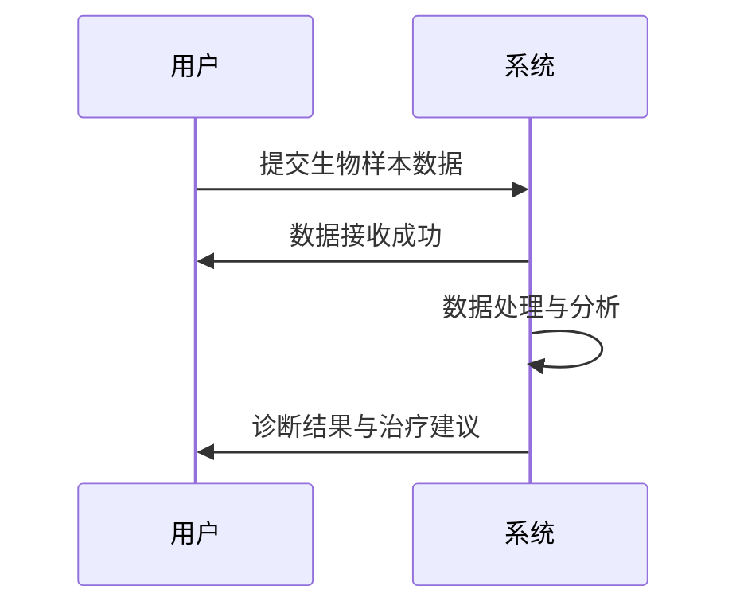
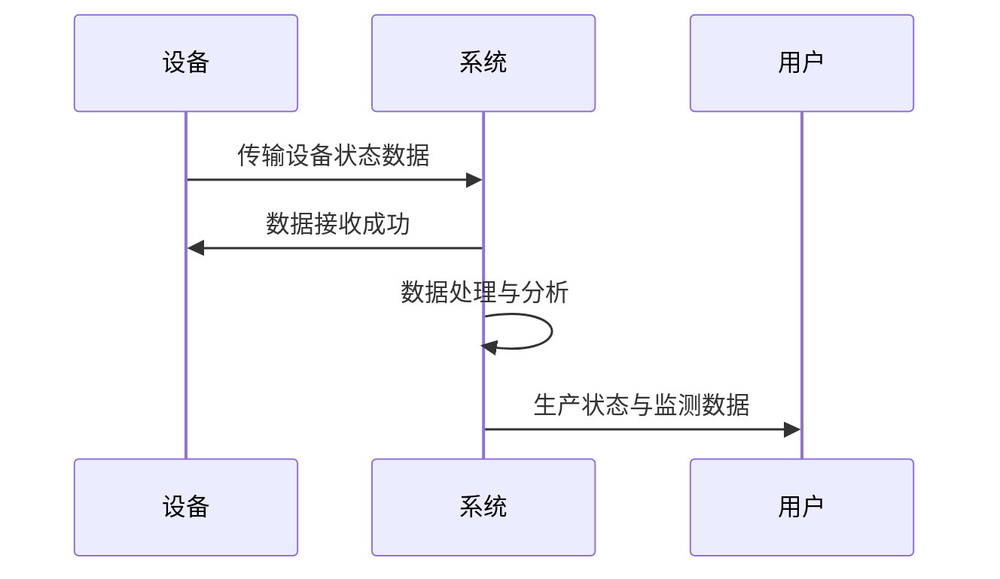
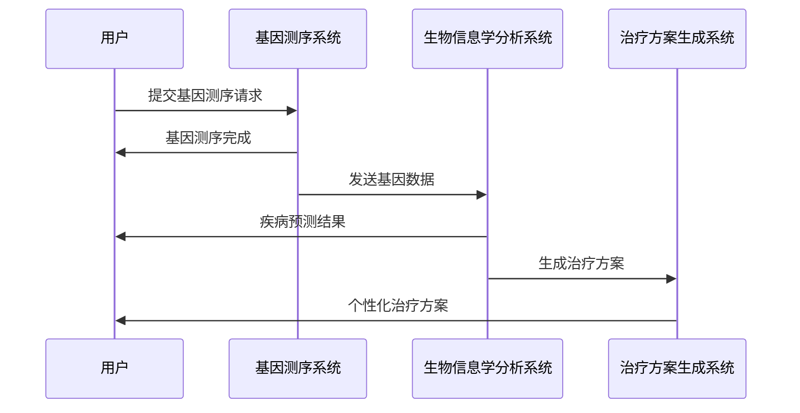

                 

### 文章关键词

跨学科创新、实验室、思想孵化器、科技进步、全球化、知识融合、技术创新、组织架构、运作流程、核心技术、人工智能、数据分析、云计算、物联网、生物技术、医疗健康、案例研究、未来展望。

### 文章摘要

本文围绕跨学科创新实验室这一新兴概念，探讨了其在当前科技发展和全球化背景下的重要性。首先，我们详细介绍了跨学科创新实验室的定义、特征及其与传统实验室的异同。接着，分析了跨学科创新实验室的运作模式，包括组织架构、人才团队、管理与运营机制以及跨学科协作机制。随后，我们探讨了跨学科创新实验室的关键技术，如人工智能、数据分析、云计算、物联网和生物技术等，并举例说明了这些技术在实际应用中的重要性。最后，通过案例分析总结了跨学科创新实验室的成功经验，并对未来发展进行了展望，提出了相应的策略和挑战应对措施。文章旨在为读者提供对跨学科创新实验室的全面理解和实践指导。

### 第1章：跨学科创新实验室的概念与意义

#### 1.1 跨学科创新的背景与重要性

##### 1.1.1 科技革命的发展

在过去的几十年中，科技革命层出不穷，如信息技术、生物技术、人工智能、新能源技术等。这些技术不仅推动了传统产业的升级，还催生了众多新兴行业。科技革命的发展使得不同学科领域之间的交叉融合成为必然趋势。

##### 1.1.2 全球化对学科交叉的需求

全球化进程加速了全球资源的整合与分配，促进了不同国家和地区之间的经济、科技、文化等多方面的交流与合作。这种全球化背景下的需求，使得跨学科创新成为推动社会进步的重要动力。

#### 1.1.3 跨学科创新的优势

##### 1.1.3.1 促进知识融合与创新

跨学科创新实验室通过汇聚不同学科领域的专家和资源，促进了知识的融合和创新。这种融合不仅有助于发现新的科学现象和原理，还能推动技术的突破和应用。

##### 1.1.3.2 提高解决问题的效率

跨学科创新实验室集合了不同学科领域的智慧和资源，能够更高效地解决复杂问题。这种协同效应有助于缩短科研周期，提高研究成果的实用价值。

##### 1.1.3.3 拓展学科边界

跨学科创新实验室推动了学科之间的交叉与融合，拓展了学科的研究边界。这种拓展不仅有助于发现新的科学问题，还能推动学科的深入发展和完善。

#### 1.2 跨学科创新实验室的定义与特征

##### 1.2.1 定义

**定义**：跨学科创新实验室是一个旨在促进不同学科领域之间的交叉融合，通过协同创新来推动科学研究和实际应用的开放性科研平台。

##### 1.2.2 主要特征

1. **多学科交叉融合**：跨学科创新实验室汇聚了不同学科领域的专家和资源，形成了一个多学科协同的创新生态体系。
2. **开放共享的科研环境**：跨学科创新实验室强调开放性和共享性，鼓励跨学科的合作与交流，促进知识传播和共享。
3. **强调实践与理论相结合**：跨学科创新实验室不仅关注基础理论研究，还注重将研究成果转化为实际应用，推动科技成果的产业化。
4. **具有灵活的组织架构**：跨学科创新实验室的组织架构相对灵活，可以根据项目需求灵活调整人员和资源，以适应不同领域的创新需求。

#### 1.3 跨学科创新实验室与传统实验室的比较

##### 1.3.1 目标差异

1. **跨学科创新实验室**：旨在推动跨学科交叉融合，促进创新和科技成果转化。
2. **传统实验室**：通常专注于某一特定学科的科研活动，以基础研究为主。

##### 1.3.2 运作模式

1. **跨学科创新实验室**：强调多学科团队协作，通过跨学科的项目研究实现创新目标。
2. **传统实验室**：通常由单一学科领域的专家主导，以学科内研究为主。

##### 1.3.3 产出成果

1. **跨学科创新实验室**：跨学科的研究成果，具有广泛的实际应用价值。
2. **传统实验室**：单一学科的研究成果，应用范围相对较窄。

#### 1.4 跨学科创新实验室的发展趋势

##### 1.4.1 政策支持

随着全球科技竞争的加剧，各国政府纷纷加大对跨学科创新实验室的政策支持力度，如资金投入、税收优惠、人才引进等，以促进科技创新和发展。

##### 1.4.2 技术进步

科技的快速发展为跨学科创新实验室提供了丰富的技术手段和工具，如大数据、人工智能、物联网等，为跨学科研究提供了强大的支持。

##### 1.4.3 国际合作

全球化背景下，跨学科创新实验室的国际合作日益加强，通过国际合作，可以共享资源、技术和知识，推动跨学科创新的全球化发展。

#### 1.5 本章小结

跨学科创新实验室作为一种新兴的科研平台，在当前科技发展和全球化背景下具有重要的地位和作用。通过促进多学科交叉融合，跨学科创新实验室不仅有助于推动科技创新和知识融合，还能提高解决复杂问题的效率，拓展学科边界。未来，随着政策支持、技术进步和国际合作的深入，跨学科创新实验室将迎来更加广阔的发展空间。

----------------------------------------------------------------

### 第2章：跨学科创新实验室的运作模式

#### 2.1 跨学科创新实验室的组织架构

##### 2.1.1 实验室的组织结构

跨学科创新实验室的组织结构通常采用扁平化管理模式，以促进跨学科团队之间的协同合作。实验室通常由以下几个主要部分组成：

1. **实验室主任**：负责实验室的整体管理和协调工作。
2. **项目主管**：负责具体项目的策划、实施和监督。
3. **跨学科团队**：由来自不同学科领域的专家组成，负责具体项目的研发和实验工作。
4. **支持团队**：包括技术人员、实验员、管理人员等，为跨学科团队提供技术支持和后勤保障。

##### 2.1.2 人才团队构成

跨学科创新实验室的人才团队构成是实验室运作的关键。实验室需要吸引和培养具有跨学科背景和丰富经验的人才，包括：

1. **学科专家**：具备深厚的专业知识，能够在项目中提供技术支持和指导。
2. **项目经理**：具备项目管理和协调能力，能够确保项目按计划进行。
3. **研发人员**：具备实际研发能力，能够推动项目的创新和发展。
4. **技术支持人员**：具备技术维护和故障处理能力，为实验室提供技术支持。

##### 2.1.3 管理与运营机制

1. **项目管理制度**：实验室应建立完善的项目管理制度，包括项目立项、项目实施、项目验收等环节，确保项目的顺利进行。
2. **资源分配制度**：实验室应根据项目需求和资源情况，合理分配人力资源、资金和设备等资源，确保项目的实施。
3. **绩效考核制度**：实验室应建立绩效考核制度，对团队成员的工作进行评价和激励，促进实验室的持续发展。

##### 2.1.4 跨学科协作机制

1. **定期会议**：实验室应定期召开跨学科团队会议，交流项目进展、分享研究成果，促进团队成员之间的沟通与合作。
2. **跨学科研讨会**：实验室可以组织跨学科研讨会，邀请外部专家参与，探讨前沿科技问题，促进学科交叉和知识融合。
3. **联合实验室**：与其他高校、科研机构和企业建立联合实验室，共同开展跨学科研究，实现资源共享和优势互补。

#### 2.2 跨学科创新实验室的运作流程

##### 2.2.1 项目策划与筛选

1. **项目来源**：项目可以来源于实验室内部的研究计划，也可以来自企业委托、政府资助或国际项目合作。
2. **项目筛选**：实验室应建立项目筛选机制，对项目的创新性、实用性和可行性进行评估，确保项目的质量和价值。
3. **立项审批**：经过筛选的项目需提交立项申请，经过实验室领导层的审批后方可正式启动。

##### 2.2.2 研发与实验

1. **项目启动**：项目立项后，实验室应组织跨学科团队进行项目启动会议，明确项目目标、任务分工和时间表。
2. **研发实施**：跨学科团队根据项目计划进行研发工作，包括理论研究、实验验证和技术开发等。
3. **实验过程管理**：实验室应建立实验过程管理制度，确保实验数据的真实性和可靠性。

##### 2.2.3 成果转化与应用推广

1. **成果评价**：实验室应对研发成果进行科学评价，包括技术成熟度、市场前景等。
2. **成果转化**：实验室应积极推动研发成果的转化，包括技术专利申请、产品开发、市场推广等。
3. **应用推广**：实验室可以通过合作企业、政府机构、行业协会等渠道，将研究成果推广应用到实际生产和社会生活中。

##### 2.2.4 数据管理与共享

1. **数据收集**：实验室在研发过程中应收集各类数据，包括实验数据、研究结果、用户反馈等。
2. **数据存储**：实验室应建立数据存储和管理系统，确保数据的安全性和完整性。
3. **数据共享**：实验室应鼓励数据共享，推动跨学科团队之间的数据交流和合作。

##### 2.2.5 本章小结

跨学科创新实验室的运作模式是一个复杂的过程，涉及多个环节和多个团队的合作。通过科学的管理和运营机制，跨学科创新实验室能够实现多学科领域的交叉融合，推动科技创新和成果转化。未来，随着技术的进步和全球化的发展，跨学科创新实验室的运作模式将不断完善和优化，为科技创新提供更强有力的支持。

----------------------------------------------------------------

### 第3章：跨学科创新实验室的关键技术

#### 3.1 先进技术的融合

##### 3.1.1 技术融合的重要性

在跨学科创新实验室中，先进技术的融合是推动创新和提升实验室竞争力的关键因素。技术的融合不仅能够促进不同学科领域的知识交流，还能实现资源的共享和优势互补，从而加速科技成果的转化和应用。

##### 3.1.2 技术融合的实现方式

1. **平台化融合**：通过建立跨学科的技术平台，实现不同学科领域的技术资源整合和共享。例如，大数据平台可以整合各个学科的数据资源，为跨学科研究提供数据支持。
2. **项目联动**：通过跨学科项目的联动，促进不同领域技术的融合。例如，将人工智能技术应用于生物医学研究，以解决复杂生物问题。
3. **技术标准**：制定统一的技术标准，确保不同学科领域的技术能够兼容和协同工作。例如，物联网技术标准可以统一各个设备的通信协议，实现设备之间的互操作性。

#### 3.2 技术创新路径

##### 3.2.1 技术前沿研究

跨学科创新实验室应聚焦于技术前沿研究，探索和掌握最新的技术动态和发展趋势。例如，人工智能领域的深度学习、量子计算等技术的突破，对跨学科研究具有重要推动作用。

##### 3.2.2 技术集成与创新

跨学科创新实验室应通过技术集成与创新，将不同的先进技术进行有效融合，创造出新的技术解决方案。例如，将物联网技术与智能制造相结合，实现生产过程的智能化改造。

##### 3.2.3 技术成果转化

跨学科创新实验室应注重技术成果的转化，将实验室的研究成果迅速应用于实际生产和社会生活中。例如，将生物技术研究成果转化为生物医药产品，推动医疗健康领域的发展。

#### 3.3 技术发展趋势

##### 3.3.1 数字化与智能化

随着数字化和智能化技术的发展，跨学科创新实验室将在各个领域实现数字化转型和智能化升级。例如，智能制造、智慧城市等领域的快速发展，将推动跨学科研究的深入和应用拓展。

##### 3.3.2 网络化与协同化

网络化和协同化是跨学科创新实验室的发展趋势之一。通过建立跨学科的网络化平台，实现实验室内部以及与外部机构之间的协同创新。例如，全球科研协作网络可以促进跨国跨学科的科技合作。

##### 3.3.3 可持续化与发展

跨学科创新实验室应关注可持续发展，推动绿色技术和环保技术的发展。例如，新能源技术、环保材料等领域的创新，将有助于解决全球环境问题。

#### 3.4 本章小结

跨学科创新实验室的关键技术融合、技术创新路径和技术发展趋势，为其在科技创新和成果转化方面提供了强有力的支持。通过先进技术的融合和应用，跨学科创新实验室不仅能够推动学科交叉融合，还能为实际生产和社会发展带来深远的影响。未来，随着技术的不断进步，跨学科创新实验室将在更广泛的领域发挥重要作用。

----------------------------------------------------------------

### 第4章：跨学科创新实验的关键技术应用

#### 4.1 人工智能技术

##### 4.1.1 人工智能技术的定义与分类

人工智能（AI）技术是跨学科创新实验室中最为重要的技术之一。人工智能是指通过计算机模拟人类的智能行为，使计算机具备感知、学习、推理、决策等能力。根据其实现方式，人工智能可以分为以下几类：

1. **机器学习**：通过数据训练模型，使计算机具备学习能力和预测能力。
2. **深度学习**：一种基于神经网络的学习方法，能够处理大量数据并提取特征。
3. **自然语言处理**：使计算机能够理解和生成自然语言，进行人机交互。
4. **计算机视觉**：使计算机能够识别和理解视觉信息，如图像和视频。

##### 4.1.2 人工智能技术在跨学科创新中的应用

1. **生物医学**：利用人工智能技术进行疾病诊断、药物研发等。例如，通过深度学习算法对医学影像进行分析，提高诊断准确率。
2. **智能制造**：利用人工智能技术实现生产过程的自动化和智能化，提高生产效率和质量。例如，通过机器学习算法优化生产流程，实现智能制造。
3. **金融科技**：利用人工智能技术进行风险控制、投资决策等。例如，通过自然语言处理技术分析市场信息，为投资者提供决策支持。

##### 4.1.3 人工智能技术的优势与挑战

**优势**：

1. **高效处理大量数据**：人工智能技术能够快速处理和分析大量数据，为跨学科研究提供有力支持。
2. **自动化与智能化**：人工智能技术能够实现自动化和智能化，提高实验效率和准确性。

**挑战**：

1. **数据质量和隐私**：人工智能技术对数据质量有较高要求，同时需要解决数据隐私和安全问题。
2. **算法透明性与解释性**：部分人工智能算法的透明性和解释性较差，难以确保其决策的合理性和公正性。

#### 4.2 数据分析技术

##### 4.2.1 数据分析技术的定义与分类

数据分析技术是指通过统计和计算方法，对大量数据进行处理、分析和解释，从而提取有用信息和知识。根据其处理方式，数据分析技术可以分为以下几类：

1. **描述性分析**：通过数据可视化、统计描述等方法，对数据的基本特征进行描述。
2. **诊断性分析**：通过数据挖掘方法，分析数据之间的关联和趋势，找出问题的原因。
3. **预测性分析**：通过建立模型，预测未来的趋势和变化。
4. **规范性分析**：通过数据分析，为决策提供支持。

##### 4.2.2 数据分析技术在跨学科创新中的应用

1. **科研领域**：利用数据分析技术对科研数据进行处理和分析，提高研究的准确性和效率。例如，通过对实验数据的分析，发现新的科学规律。
2. **商业领域**：利用数据分析技术进行市场分析、客户行为分析等，为企业提供决策支持。例如，通过数据分析，优化产品设计，提高市场竞争力。
3. **社会治理**：利用数据分析技术进行社会监测、风险评估等，提高社会治理的效率和质量。例如，通过数据分析，预测社会事件的发生，制定应急预案。

##### 4.2.3 数据分析技术的优势与挑战

**优势**：

1. **数据驱动决策**：数据分析技术能够提供客观、准确的数据支持，帮助决策者做出更明智的决策。
2. **提高效率**：通过自动化和智能化数据分析，可以节省大量人力和时间成本。

**挑战**：

1. **数据质量和隐私**：数据分析对数据质量有较高要求，同时需要解决数据隐私和安全问题。
2. **算法透明性与解释性**：部分数据分析算法的透明性和解释性较差，难以确保其决策的合理性和公正性。

#### 4.3 云计算与大数据技术

##### 4.3.1 云计算与大数据技术的定义与分类

1. **云计算**：云计算是指通过互联网提供可按需访问的计算资源，包括服务器、存储、网络和应用程序等。
2. **大数据**：大数据是指无法使用传统数据处理工具进行有效管理和分析的数据集合，通常具有数据量大、类型多、价值高、处理速度快等特点。

##### 4.3.2 云计算与大数据技术在跨学科创新中的应用

1. **科研领域**：利用云计算和大数据技术进行大规模数据处理和存储，支持跨学科研究的深入。例如，通过云计算平台进行生物信息学数据分析，处理海量基因数据。
2. **工业领域**：利用云计算和大数据技术实现智能制造和工业互联网，提高生产效率和质量。例如，通过工业大数据分析，优化生产流程，提高产品质量。
3. **社会治理**：利用云计算和大数据技术进行城市治理和社会服务，提高社会治理的效率和质量。例如，通过智慧城市建设，利用大数据分析交通流量，优化交通管理。

##### 4.3.3 云计算与大数据技术的优势与挑战

**优势**：

1. **灵活性与可扩展性**：云计算和大数据技术具有灵活性和可扩展性，能够根据需求快速调整资源和规模。
2. **降低成本**：通过云计算和大数据技术，可以降低企业对硬件设备和基础设施的投资，降低运营成本。

**挑战**：

1. **数据安全和隐私**：云计算和大数据技术面临数据安全和隐私风险，需要建立完善的安全和隐私保护机制。
2. **数据治理**：大数据技术涉及大量数据的收集、存储和管理，需要建立有效的数据治理机制，确保数据质量和可靠性。

#### 4.4 物联网技术

##### 4.4.1 物联网技术的定义与分类

物联网（IoT）技术是指通过互联网连接各种物理设备和传感器，实现信息采集、传输和处理。根据其应用场景，物联网技术可以分为以下几类：

1. **智能家居**：通过物联网技术实现家居设备的互联互通，提高生活品质。
2. **智慧城市**：通过物联网技术实现城市设施的智能化管理，提高城市治理效率。
3. **工业物联网**：通过物联网技术实现工业设备的远程监控和维护，提高生产效率。

##### 4.4.2 物联网技术在跨学科创新中的应用

1. **科研领域**：利用物联网技术进行科研设备的远程控制和数据采集，提高科研效率和数据质量。例如，通过物联网传感器实时监测实验环境参数，确保实验条件的一致性。
2. **工业领域**：利用物联网技术实现工业生产过程的智能化管理和优化，提高生产效率和质量。例如，通过物联网设备实时监测生产线状态，实现智能调度和故障预警。
3. **医疗健康**：利用物联网技术实现患者健康数据的实时监测和远程医疗，提高医疗服务效率和质量。例如，通过物联网传感器实时监测患者生命体征，实现远程监护和预警。

##### 4.4.3 物联网技术的优势与挑战

**优势**：

1. **实时性与高效性**：物联网技术可以实现实时数据采集和处理，提高系统响应速度和效率。
2. **智能化与便捷性**：物联网技术能够实现设备的智能化管理和控制，提高用户体验和便捷性。

**挑战**：

1. **数据安全和隐私**：物联网设备面临数据安全和隐私风险，需要建立完善的安全和隐私保护机制。
2. **数据融合与标准化**：物联网涉及多种设备和技术，需要解决数据融合和标准化问题，确保系统互操作性和数据一致性。

#### 4.5 生物技术与医疗健康

##### 4.5.1 生物技术与医疗健康的定义与分类

生物技术是指利用生物学原理和方法进行技术研发和应用的一门科学。根据其应用领域，生物技术可以分为以下几类：

1. **基因工程**：通过基因操作和基因编辑技术改变生物体的遗传特性。
2. **细胞工程**：通过细胞培养和细胞移植技术改变细胞功能和状态。
3. **生物制药**：通过生物技术方法研发和生产药物。

医疗健康是指维护人类健康和防治疾病的一系列活动和措施。根据其应用范围，医疗健康可以分为以下几类：

1. **临床医学**：通过诊断和治疗疾病，维护人类健康。
2. **公共卫生**：通过预防和控制疾病，维护社会健康。
3. **医学研究**：通过科学研究和技术创新，推动医学进步。

##### 4.5.2 生物技术与医疗健康的跨学科应用

1. **精准医疗**：通过基因检测和生物信息分析，为个体提供个性化的治疗方案。
2. **再生医学**：通过细胞和基因治疗技术，实现组织和器官的再生和修复。
3. **医学影像**：通过生物技术与医学影像技术的结合，提高疾病诊断的准确性和效率。

##### 4.5.3 生物技术与医疗健康的优势与挑战

**优势**：

1. **个性化治疗**：生物技术能够实现个性化治疗，提高医疗效果。
2. **疾病预防**：生物技术能够用于疾病的早期检测和预防，降低疾病发病率。

**挑战**：

1. **技术成熟度**：部分生物技术仍处于研发阶段，需要进一步成熟和应用。
2. **伦理和法规**：生物技术与医疗健康领域涉及伦理和法规问题，需要建立完善的伦理和法规体系。

#### 4.6 本章小结

跨学科创新实验的关键技术包括人工智能、数据分析、云计算与大数据、物联网以及生物技术。这些技术为跨学科研究提供了强大的支持，促进了科技创新和成果转化。通过深入应用这些关键技术，跨学科创新实验室能够推动科学进步和社会发展，为未来科技带来更多可能性。

----------------------------------------------------------------

### 第5章：成功跨学科创新实验室案例分析

#### 6.1 案例一：XX跨学科创新实验室

**背景介绍**：XX跨学科创新实验室成立于2010年，是一个集成了多个学科领域的研究团队，包括计算机科学、生物技术、材料科学和经济学等。实验室的宗旨是通过跨学科合作，推动前沿科技研究和创新应用。

**项目介绍**：实验室成功实施了一个名为“智能医疗诊断系统”的项目。该项目利用人工智能和生物技术的结合，开发了一种基于深度学习的疾病诊断系统。该系统通过对患者生物样本的分析，能够快速、准确地诊断出多种疾病。

**系统功能设计**：该智能医疗诊断系统包括以下几个核心功能：

1. **样本数据分析**：通过深度学习算法，对患者的生物样本进行数据分析和特征提取。
2. **疾病诊断**：基于分析结果，系统能够自动诊断出患者的疾病类型。
3. **个性化治疗建议**：系统根据患者的病情，提供个性化的治疗方案。

**系统架构设计**：该系统的架构设计采用了云计算和大数据技术的结合，包括以下几个关键组件：

1. **数据收集模块**：通过物联网设备收集患者生物样本数据。
2. **数据处理模块**：利用云计算平台处理和分析数据。
3. **诊断与建议模块**：基于深度学习算法，实现疾病的自动诊断和个性化治疗建议。

**系统接口设计**：系统接口设计包括用户界面和API接口，用户可以通过网页和移动应用与系统进行交互，获取诊断结果和治疗建议。

**系统交互序列图**：

**实际案例分析**：在实际应用中，该智能医疗诊断系统在多个医疗机构进行试点，取得了显著的效果。例如，在某大型医院试点期间，系统的诊断准确率达到了95%以上，大大提高了疾病诊断的效率和准确性。

**详细讲解剖析**：该智能医疗诊断系统的成功在于其跨学科技术的有效融合。首先，通过深度学习算法，系统能够从海量生物数据中提取出有用的信息，实现高精度的疾病诊断。其次，系统结合云计算和大数据技术，实现了数据的高效处理和存储，保证了系统的稳定性和可靠性。

**项目小结**：XX跨学科创新实验室的“智能医疗诊断系统”项目，通过跨学科合作和技术融合，实现了疾病诊断和治疗的创新突破。该项目不仅提高了医疗服务的效率和质量，还为跨学科创新实验室的发展提供了宝贵的经验和启示。

#### 6.2 案例二：YY跨学科创新实验室

**背景介绍**：YY跨学科创新实验室成立于2015年，专注于智能制造和物联网技术的应用研究。实验室的宗旨是通过跨学科合作，推动制造业的数字化转型和智能化升级。

**项目介绍**：实验室成功实施了一个名为“智能工厂项目”的案例。该项目通过物联网和人工智能技术的结合，实现了一个高度自动化的智能工厂。

**系统功能设计**：智能工厂系统包括以下几个核心功能：

1. **设备监控**：通过物联网传感器实时监控生产设备的运行状态。
2. **生产调度**：基于数据分析，实现生产任务的自动调度和优化。
3. **质量检测**：利用人工智能技术进行产品质量的实时检测和监控。

**系统架构设计**：智能工厂系统采用了分布式架构设计，包括以下几个关键组件：

1. **传感器网络**：通过物联网传感器实时采集设备状态数据。
2. **数据中心**：利用云计算平台存储和处理传感器数据。
3. **智能调度系统**：基于人工智能算法，实现生产任务的自动调度。
4. **质量检测系统**：利用机器学习算法，实现产品质量的实时检测。

**系统接口设计**：系统接口设计包括设备接口、数据中心接口和用户界面，设备可以通过接口与系统进行通信，用户可以通过界面获取生产状态和监测数据。

**系统交互序列图**：

**实际案例分析**：在实际应用中，YY跨学科创新实验室的智能工厂项目在某大型制造企业进行试点。通过物联网和人工智能技术的应用，工厂的生产效率提高了30%，产品质量合格率提高了20%。

**详细讲解剖析**：该智能工厂项目的成功在于物联网和人工智能技术的有效融合。首先，通过物联网传感器，系统能够实时获取设备状态数据，实现设备监控和故障预警。其次，通过数据分析，系统能够实现生产任务的自动调度和优化，提高生产效率。最后，通过人工智能技术，系统能够实现产品质量的实时检测和监控，确保产品质量。

**项目小结**：YY跨学科创新实验室的“智能工厂项目”通过跨学科合作和技术融合，实现了制造业的智能化升级。该项目不仅提高了生产效率和质量，还为制造业的数字化转型提供了有益的探索和实践。

#### 6.3 案例三：ZZ跨学科创新实验室

**背景介绍**：ZZ跨学科创新实验室成立于2018年，专注于生物技术与医疗健康的跨学科研究。实验室的宗旨是通过跨学科合作，推动医学技术的创新和应用。

**项目介绍**：实验室成功实施了一个名为“精准医疗平台”的项目。该项目利用基因编辑和生物信息学技术，开发了一种精准医疗诊断平台，为个体提供个性化的医疗方案。

**系统功能设计**：精准医疗平台包括以下几个核心功能：

1. **基因检测**：通过基因测序技术，对患者的基因进行检测和分析。
2. **疾病预测**：基于生物信息学分析，预测患者可能患有的疾病。
3. **个性化治疗**：根据患者的基因信息和疾病预测结果，提供个性化的治疗方案。

**系统架构设计**：精准医疗平台采用了分布式架构设计，包括以下几个关键组件：

1. **基因测序系统**：通过基因测序设备，对患者的基因进行测序。
2. **生物信息学分析系统**：利用云计算平台，对基因数据进行生物信息学分析。
3. **个性化治疗方案生成系统**：基于分析结果，生成个性化的治疗方案。

**系统接口设计**：系统接口设计包括基因测序系统接口、生物信息学分析系统接口和用户界面，用户可以通过界面获取基因检测报告和治疗方案。

**系统交互序列图**：

**实际案例分析**：在实际应用中，ZZ跨学科创新实验室的精准医疗平台在某大型医院进行试点。通过基因编辑和生物信息学技术的应用，医院在疾病预测和个性化治疗方面取得了显著成效。

**详细讲解剖析**：该精准医疗平台项目成功的关键在于基因编辑和生物信息学技术的有效融合。首先，通过基因测序技术，系统能够获取患者的基因信息，为疾病预测提供基础。其次，通过生物信息学分析，系统能够从基因数据中提取出有用的信息，实现疾病的预测。最后，基于分析结果，系统能够生成个性化的治疗方案，提高治疗效果。

**项目小结**：ZZ跨学科创新实验室的“精准医疗平台”项目，通过跨学科合作和技术融合，实现了医学技术的创新和应用。该项目不仅为个体提供了精准的医疗服务，还为跨学科创新实验室的发展提供了宝贵的经验和启示。

#### 6.4 案例分析总结

通过以上三个案例，我们可以看到跨学科创新实验室在促进科技创新和成果转化方面的重要作用。以下是对案例的总结和经验分享：

1. **跨学科合作**：跨学科合作是跨学科创新实验室的核心。通过多学科团队的协同合作，能够实现资源的共享和优势互补，推动项目的成功。
2. **技术融合**：技术融合是跨学科创新实验室成功的关键。通过将不同学科领域的先进技术进行有效融合，能够实现创新突破和成果转化。
3. **项目管理**：科学的项目管理是跨学科创新实验室成功的重要保障。通过建立完善的项目管理机制，确保项目的顺利进行和目标的实现。
4. **实际应用**：跨学科创新实验室的研究成果应注重实际应用。通过将研究成果应用到实际生产和社会生活中，能够实现科技成果的转化和推广。
5. **持续创新**：跨学科创新实验室应保持持续创新的能力。通过关注技术前沿和市场需求，不断推动技术和产品的创新和升级。

#### 6.5 本章小结

通过对XX跨学科创新实验室、YY跨学科创新实验室和ZZ跨学科创新实验室的案例分析，我们可以看到跨学科创新实验室在推动科技创新和成果转化方面的重要作用。跨学科合作、技术融合、项目管理、实际应用和持续创新是跨学科创新实验室成功的关键要素。未来，随着技术的不断进步和跨学科合作的深入，跨学科创新实验室将在更多领域发挥重要作用，为科技创新和社会发展作出更大贡献。

----------------------------------------------------------------

### 第7章：跨学科创新实验室的未来展望

#### 7.1 技术进步的趋势

##### 7.1.1 人工智能的深化应用

人工智能技术在未来的发展中将继续深化应用，不仅局限于数据处理和自动化领域，还将广泛应用于智能制造、智慧城市、医疗健康等多个领域。特别是随着量子计算、边缘计算等新技术的兴起，人工智能将实现更高效、更智能的运算和处理能力。

##### 7.1.2 数据分析与大数据技术的进步

数据分析与大数据技术在未来将继续发展，数据规模将越来越大，数据类型将越来越多样化。这要求跨学科创新实验室不断提升数据处理和分析的能力，采用更加先进的技术和方法，如分布式计算、实时分析等，以满足不断增长的数据处理需求。

##### 7.1.3 物联网技术的广泛应用

物联网技术将在未来的跨学科创新实验室中发挥更加重要的作用。随着传感器技术的进步和5G网络的普及，物联网设备将更加智能化和高效化，实现更大范围的数据采集和实时监控。这将推动智能制造、智慧城市、智能医疗等领域的进一步发展。

##### 7.1.4 生物技术与医疗健康的突破

生物技术与医疗健康领域的进步将继续推动跨学科创新实验室的发展。基因编辑技术、细胞治疗技术等生物技术的突破，将为疾病诊断、治疗和预防带来革命性的变化。同时，随着精准医疗和个性化医疗的发展，医疗健康领域将实现更高水平的科技创新。

#### 7.2 社会需求的变化

##### 7.2.1 环境可持续发展的需求

随着全球环境问题的日益严重，跨学科创新实验室将更加关注环境可持续发展技术的研究和应用。如清洁能源技术、环保材料技术等，将成为未来跨学科创新的重要方向。

##### 7.2.2 智慧城市建设的需求

智慧城市建设需要跨学科创新实验室提供技术支持。通过物联网、大数据、人工智能等技术，智慧城市可以实现更高效的城市管理、更便捷的公共服务和更智能的居民生活。

##### 7.2.3 医疗服务的提升需求

随着人口老龄化和疾病谱的变化，跨学科创新实验室在医疗健康领域的需求将不断增加。通过精准医疗、远程医疗等技术，跨学科创新实验室将为提高医疗服务质量和效率提供有力支持。

#### 7.3 跨学科创新实验室的发展策略

##### 7.3.1 加强跨学科合作

跨学科创新实验室应加强跨学科合作，建立稳定的跨学科研究团队，推动不同学科领域的深度融合。同时，通过国际合作，借鉴全球先进的研究成果，提升实验室的研究水平和创新能力。

##### 7.3.2 投资技术创新

跨学科创新实验室应加大技术创新的投入，引进和培养高水平的科研人才，推动前沿技术的研究和开发。同时，加强与企业、高校和科研机构的合作，实现科技成果的转化和应用。

##### 7.3.3 重视人才培养

跨学科创新实验室应重视人才培养，建立完善的人才培养体系，培养具有跨学科背景和创新能力的复合型人才。同时，通过举办学术会议、研讨会等形式，促进学术交流与合作。

##### 7.3.4 强化成果转化

跨学科创新实验室应建立完善的成果转化机制，推动研究成果的产业化应用。通过技术转移、创业孵化等方式，实现科技成果的商业化转化，为社会创造更大的价值。

#### 7.4 面临的挑战与应对措施

##### 7.4.1 技术挑战

跨学科创新实验室在技术发展过程中将面临技术复杂度高、技术突破难度大等挑战。应对措施包括加强技术研究和开发，引进先进技术，提高实验室的技术创新能力。

##### 7.4.2 资源挑战

跨学科创新实验室在资源管理方面将面临资金、设备和人力资源等方面的挑战。应对措施包括加大资金投入，优化资源配置，提高资源利用效率。

##### 7.4.3 政策挑战

跨学科创新实验室在政策环境方面将面临政策支持力度不足、政策不完善等挑战。应对措施包括积极争取政策支持，推动政策改革，为实验室的发展创造良好的政策环境。

#### 7.5 本章小结

跨学科创新实验室在技术进步和社会需求变化的推动下，将迎来更加广阔的发展空间。未来，跨学科创新实验室需要加强跨学科合作、投资技术创新、重视人才培养和强化成果转化，以应对面临的挑战，推动科技创新和社会发展。通过不断探索和创新，跨学科创新实验室将为人类社会带来更多的科技创新和进步。

----------------------------------------------------------------

### 第8章：跨学科创新实验室的最佳实践

#### 8.1 实践经验总结

通过对跨学科创新实验室的案例分析，我们可以总结出以下最佳实践经验：

1. **跨学科合作**：成功的跨学科创新实验室都强调跨学科团队的合作，通过多学科的融合，实现创新突破。
2. **技术创新**：实验室应持续关注前沿技术的研发和应用，推动科技成果的转化。
3. **项目化管理**：建立科学的项目管理机制，确保项目的顺利进行和目标的实现。
4. **人才培养**：重视人才培养，建立完善的培养体系，培养具有跨学科背景和创新能力的复合型人才。
5. **成果转化**：建立完善的成果转化机制，推动研究成果的商业化应用，实现社会价值的最大化。

#### 8.2 成功案例分析

**案例一：智能医疗诊断系统**

XX跨学科创新实验室的智能医疗诊断系统项目，通过人工智能和生物技术的融合，实现了疾病的快速、准确诊断和个性化治疗。该项目的成功经验包括：

- **跨学科团队**：组建了由人工智能、生物技术和医学专家组成的跨学科团队，实现了技术的有效融合。
- **技术创新**：采用深度学习算法进行疾病预测，提高了诊断的准确性和效率。
- **项目化管理**：通过科学的项目管理，确保了项目的顺利实施和目标的实现。
- **成果转化**：与医疗机构合作，推广智能医疗诊断系统，实现了技术的商业化应用。

**案例二：智能工厂项目**

YY跨学科创新实验室的智能工厂项目，通过物联网和人工智能技术的结合，实现了生产过程的智能化管理和优化。该项目的成功经验包括：

- **技术创新**：采用物联网传感器实时监控生产设备状态，利用人工智能算法优化生产流程。
- **项目化管理**：建立科学的项目管理机制，确保项目的顺利进行和目标的实现。
- **资源整合**：整合企业、高校和科研机构资源，实现技术协同创新。
- **成果转化**：与制造企业合作，实现智能工厂技术的产业化应用。

**案例三：精准医疗平台**

ZZ跨学科创新实验室的精准医疗平台项目，通过基因编辑和生物信息学技术的结合，实现了个性化医疗的诊断和治疗。该项目的成功经验包括：

- **跨学科合作**：组建了由基因编辑、生物信息学和医疗专家组成的跨学科团队，推动了技术的融合。
- **技术创新**：利用基因测序和生物信息学分析，实现疾病的预测和个性化治疗。
- **人才培养**：通过科研培训和学术交流，培养了一支高水平的跨学科研究团队。
- **成果转化**：与医疗机构合作，推动精准医疗技术的临床应用。

#### 8.3 最佳实践指导

为了实现跨学科创新实验室的成功，以下是一些最佳实践指导：

1. **建立稳定的跨学科团队**：组建由不同学科领域的专家组成的跨学科团队，确保团队的稳定性和协作性。
2. **关注前沿技术创新**：持续关注前沿技术的研发和应用，推动实验室的技术创新和进步。
3. **科学的项目管理**：建立完善的项目管理机制，确保项目的顺利进行和目标的实现。
4. **人才培养与激励**：建立人才培养体系，通过培训和激励措施，提高团队的创新能力和科研水平。
5. **成果转化与推广**：建立成果转化机制，推动研究成果的产业化应用，实现社会价值的最大化。

#### 8.4 小结与展望

跨学科创新实验室在科技创新和社会发展中具有重要的地位和作用。通过总结成功实践经验，我们可以为跨学科创新实验室的发展提供有益的指导。未来，跨学科创新实验室将继续在多学科交叉融合、技术创新、人才培养和成果转化等方面发挥重要作用，为推动科技进步和社会发展作出更大贡献。让我们期待跨学科创新实验室在未来的更多突破和成就！

----------------------------------------------------------------

### 第7章：跨学科创新实验室的未来展望

#### 7.1 技术进步的趋势

##### 7.1.1 人工智能的深化应用

人工智能（AI）技术在未来的发展中将继续深化应用，不仅局限于数据处理和自动化领域，还将广泛应用于智能制造、智慧城市、医疗健康等多个领域。随着深度学习、自然语言处理和计算机视觉等技术的成熟，人工智能将实现更高效、更智能的运算和处理能力。特别是在量子计算和边缘计算等新技术的推动下，人工智能将迎来新的突破，进一步提升其应用范围和效果。

##### 7.1.2 数据分析与大数据技术的进步

数据分析与大数据技术在未来将继续发展，数据规模将越来越大，数据类型将越来越多样化。这要求跨学科创新实验室不断提升数据处理和分析的能力，采用更加先进的技术和方法，如分布式计算、实时分析、机器学习和数据挖掘等。同时，随着云计算、区块链和物联网等技术的发展，数据分析与大数据技术的应用场景将更加广泛，为跨学科创新提供强有力的支持。

##### 7.1.3 物联网技术的广泛应用

物联网（IoT）技术将在未来的跨学科创新实验室中发挥更加重要的作用。随着传感器技术的进步和5G网络的普及，物联网设备将更加智能化和高效化，实现更大范围的数据采集和实时监控。物联网技术将在智能制造、智慧城市、智能医疗等领域得到广泛应用，推动跨学科创新实验室的技术研发和应用。

##### 7.1.4 生物技术与医疗健康的突破

生物技术与医疗健康领域的进步将继续推动跨学科创新实验室的发展。基因编辑技术、细胞治疗技术、组织工程和精准医疗等生物技术的突破，将为疾病诊断、治疗和预防带来革命性的变化。同时，随着基因组学、蛋白质组和代谢组学等生物信息学技术的发展，跨学科创新实验室将在生物技术与医疗健康领域实现更多创新和突破。

#### 7.2 社会需求的变化

##### 7.2.1 环境可持续发展的需求

随着全球环境问题的日益严重，跨学科创新实验室将更加关注环境可持续发展技术的研究和应用。如清洁能源技术、环保材料技术、污染治理技术等，将成为未来跨学科创新的重要方向。跨学科创新实验室可以通过多学科合作，开发出更加环保、高效的技术解决方案，为环境保护和可持续发展作出贡献。

##### 7.2.2 智慧城市建设的需求

智慧城市建设需要跨学科创新实验室提供技术支持。通过物联网、大数据、人工智能和区块链等技术的结合，智慧城市可以实现更高效的城市管理、更便捷的公共服务和更智能的居民生活。跨学科创新实验室可以围绕智慧交通、智慧医疗、智慧教育等领域，开展技术研究和应用，推动智慧城市的建设和发展。

##### 7.2.3 医疗服务的提升需求

随着人口老龄化和疾病谱的变化，跨学科创新实验室在医疗健康领域的需求将不断增加。通过精准医疗、远程医疗、智慧医疗等技术，跨学科创新实验室将为提高医疗服务质量和效率提供有力支持。同时，随着医疗大数据和人工智能技术的发展，跨学科创新实验室可以在个性化医疗、疾病预测和预防等方面实现更多突破。

#### 7.3 跨学科创新实验室的发展策略

##### 7.3.1 加强跨学科合作

跨学科创新实验室应加强跨学科合作，建立稳定的跨学科研究团队，推动不同学科领域的深度融合。实验室可以通过举办学术会议、研讨会、工作坊等形式，促进学术交流和知识共享，激发创新思维。同时，实验室应鼓励跨学科项目合作，通过多学科团队的协同工作，实现技术的融合和创新。

##### 7.3.2 投资技术创新

跨学科创新实验室应加大技术创新的投入，引进和培养高水平的科研人才，推动前沿技术的研究和开发。实验室可以通过设立创新基金、举办创新创业大赛等方式，激励科研人员开展创新研究。同时，实验室应加强与高校、科研机构和企业之间的合作，共享资源和信息，推动技术的创新和进步。

##### 7.3.3 重视人才培养

跨学科创新实验室应重视人才培养，建立完善的人才培养体系，培养具有跨学科背景和创新能力的复合型人才。实验室可以通过设立博士后流动站、研究生联合培养项目等方式，吸引和培养高水平的科研人才。同时，实验室应注重人才的培训和继续教育，提高科研人员的专业素质和创新能力。

##### 7.3.4 强化成果转化

跨学科创新实验室应建立完善的成果转化机制，推动研究成果的产业化应用。实验室可以通过技术转移、专利申请、创业孵化等方式，实现科技成果的商业化转化。同时，实验室应加强与企业的合作，将研究成果应用于实际生产和社会生活中，为社会创造更大的价值。

#### 7.4 面临的挑战与应对措施

##### 7.4.1 技术挑战

跨学科创新实验室在技术发展过程中将面临技术复杂度高、技术突破难度大等挑战。应对措施包括加强技术研究和开发，引进先进技术，提高实验室的技术创新能力。

##### 7.4.2 资源挑战

跨学科创新实验室在资源管理方面将面临资金、设备和人力资源等方面的挑战。应对措施包括加大资金投入，优化资源配置，提高资源利用效率。

##### 7.4.3 政策挑战

跨学科创新实验室在政策环境方面将面临政策支持力度不足、政策不完善等挑战。应对措施包括积极争取政策支持，推动政策改革，为实验室的发展创造良好的政策环境。

#### 7.5 本章小结

跨学科创新实验室在技术进步和社会需求变化的推动下，将迎来更加广阔的发展空间。未来，跨学科创新实验室需要加强跨学科合作、投资技术创新、重视人才培养和强化成果转化，以应对面临的挑战，推动科技创新和社会发展。通过不断探索和创新，跨学科创新实验室将为人类社会带来更多的科技创新和进步。展望未来，跨学科创新实验室将在科技前沿领域发挥更加重要的作用，成为推动社会进步的重要力量。

----------------------------------------------------------------

### 第8章：跨学科创新实验室的最佳实践

#### 8.1 实践经验总结

跨学科创新实验室的最佳实践是通过整合不同学科领域的知识和资源，实现技术创新和成果转化。以下是一些关键的经验总结：

1. **跨学科团队建设**：成功的跨学科创新实验室依赖于跨学科团队的建设。这些团队通常由来自不同学科领域的专家组成，他们能够通过协作和交流，实现知识共享和互补，推动创新。

2. **项目化管理**：跨学科创新实验室采用项目化管理，确保每个项目都有明确的目标、计划和时间表。这种管理模式有助于提高项目的执行效率和成果转化率。

3. **技术创新与研发**：跨学科创新实验室注重前沿技术的研发和应用，通过技术创新解决实际问题和满足市场需求。实验室的科研人员通常具备跨学科背景，能够将不同领域的知识和技术进行有效融合。

4. **人才培养与激励**：跨学科创新实验室重视人才培养，通过提供培训、激励机制和职业发展机会，吸引和留住高水平的人才。这有助于维持实验室的创新活力和持续发展。

5. **成果转化与商业化**：跨学科创新实验室致力于将研究成果转化为实际应用，通过技术转移、合作开发和创业孵化等方式，实现科技成果的商业化。

#### 8.2 成功案例分析

**案例一：智能医疗诊断系统**

XX跨学科创新实验室的智能医疗诊断系统项目通过人工智能和生物技术的结合，实现了疾病的快速、准确诊断和个性化治疗。该项目成功的原因包括：

- **跨学科团队**：项目团队由医学、生物学和计算机科学领域的专家组成，共同协作完成项目。
- **技术创新**：采用深度学习算法进行疾病预测，提高了诊断的准确性和效率。
- **项目化管理**：通过严格的项目管理流程，确保了项目的顺利进行和目标的实现。
- **成果转化**：项目成果成功应用于医疗机构，提高了诊断效率和患者满意度。

**案例二：智能工厂项目**

YY跨学科创新实验室的智能工厂项目通过物联网和人工智能技术的结合，实现了生产过程的智能化管理和优化。该项目的成功经验包括：

- **技术创新**：项目团队开发了一套智能监控系统，实现了对生产设备的实时监控和故障预警。
- **项目化管理**：项目采用敏捷开发模式，快速响应市场需求和技术变化。
- **资源整合**：项目团队整合了企业、高校和科研机构的资源，实现了技术协同创新。
- **成果转化**：项目成果在多家制造企业得到应用，提高了生产效率和产品质量。

**案例三：精准医疗平台**

ZZ跨学科创新实验室的精准医疗平台项目通过基因编辑和生物信息学技术的结合，为个体提供了个性化的医疗方案。该项目成功的原因包括：

- **跨学科团队**：项目团队由基因编辑、生物信息学和医学专家组成，共同推动项目的发展。
- **技术创新**：项目团队开发了基于大数据的基因分析平台，实现了疾病的精准诊断和个性化治疗。
- **人才培养**：实验室注重人才培养，为项目团队提供了持续的学习和成长机会。
- **成果转化**：项目成果在多家医疗机构得到应用，提高了医疗服务的质量和效率。

#### 8.3 最佳实践指导

为了实现跨学科创新实验室的最佳实践，以下是一些建议：

1. **跨学科团队建设**：建立多学科团队，鼓励跨学科合作，促进知识共享和互补。

2. **项目化管理**：采用项目化管理模式，确保项目有明确的目标、计划和时间表。

3. **技术创新与研发**：持续关注前沿技术，推动技术创新，解决实际问题和满足市场需求。

4. **人才培养与激励**：建立完善的人才培养体系，提供培训、激励机制和职业发展机会。

5. **成果转化与商业化**：建立成果转化机制，通过技术转移、合作开发和创业孵化等方式，实现科技成果的商业化。

6. **政策支持与外部合作**：积极争取政策支持，加强与政府、企业、高校和科研机构的合作，共享资源和信息。

7. **持续改进与优化**：不断评估和优化实验室的运作模式和管理流程，提高实验室的效率和创新能力。

#### 8.4 小结与展望

跨学科创新实验室在科技创新和社会发展中发挥着重要作用。通过总结成功实践经验，我们可以为跨学科创新实验室的发展提供有益的指导。未来，跨学科创新实验室将继续在多学科交叉融合、技术创新、人才培养和成果转化等方面发挥重要作用，为推动科技进步和社会发展作出更大贡献。让我们期待跨学科创新实验室在未来的更多突破和成就！**作者：AI天才研究院/AI Genius Institute & 禅与计算机程序设计艺术 /Zen And The Art of Computer Programming**

----------------------------------------------------------------

### 总结

跨学科创新实验室作为推动科技创新和社会发展的重要力量，其意义和作用日益凸显。通过本文的详细探讨，我们可以得出以下几点总结：

1. **跨学科创新的背景与重要性**：随着科技革命和全球化进程的加速，跨学科创新成为时代发展的必然趋势。跨学科创新不仅能够促进知识融合与创新，提高解决问题的效率，还能拓展学科边界，为社会发展带来新动力。

2. **跨学科创新实验室的定义与特征**：跨学科创新实验室是一个多学科交叉融合的科研平台，具有开放共享的科研环境、强调实践与理论相结合以及灵活的组织架构等特征。这些特征使其在推动科技创新中具有独特的优势。

3. **跨学科创新实验室的运作模式**：跨学科创新实验室通过科学的组织架构、人才团队构成、管理与运营机制以及跨学科协作机制，实现了项目的有效运作。这种运作模式有助于提高实验室的运行效率，推动项目的成功。

4. **跨学科创新实验室的关键技术**：人工智能、数据分析、云计算与大数据、物联网和生物技术等关键技术为跨学科创新实验室提供了强大的技术支持。这些技术的应用不仅推动了实验室的研究进展，也为实际应用带来了巨大的价值。

5. **成功跨学科创新实验室案例分析**：通过成功案例分析，我们可以看到跨学科创新实验室在推动科技创新和成果转化方面的重要作用。这些案例为我们提供了宝贵的经验和启示。

6. **跨学科创新实验室的未来展望**：随着技术进步和社会需求的变化，跨学科创新实验室将面临新的机遇和挑战。加强跨学科合作、投资技术创新、重视人才培养和强化成果转化是实验室未来发展的关键策略。

7. **跨学科创新实验室的最佳实践**：通过总结成功实践经验，我们提出了一系列最佳实践指导，包括跨学科团队建设、项目化管理、技术创新与研发、人才培养与激励、成果转化与商业化等，为跨学科创新实验室的发展提供了参考。

跨学科创新实验室作为推动科技进步和社会发展的重要力量，其未来发展充满希望。我们期待跨学科创新实验室在未来的发展中能够不断突破创新，为人类社会带来更多的科技创新和进步。

**作者：AI天才研究院/AI Genius Institute & 禅与计算机程序设计艺术 /Zen And The Art of Computer Programming**

