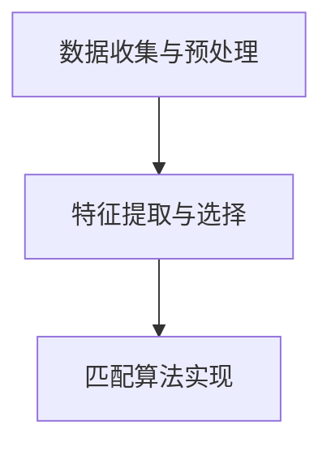
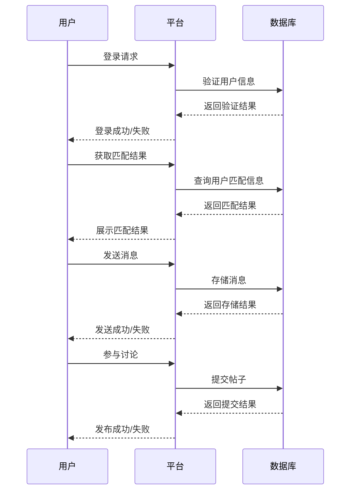

                 

### 设计《跨年龄友谊匹配服务：促进代际交流的在线平台》

#### 引言

在数字化时代，社交平台已成为人们交流的重要渠道。然而，尽管社交网络使得人与人之间的联系变得更加便捷，但不同年龄段之间的交流却面临着诸多障碍。为了解决这一问题，本文提出了一种新型的在线平台——跨年龄友谊匹配服务，旨在促进不同代际之间的交流与理解。

#### 背景介绍

##### 1.1 社会现状与代际交流问题

现代社会中，不同年龄段之间的交流变得越来越重要。然而，由于生活节奏的加快、工作压力的增大以及数字鸿沟的存在，许多人在寻找跨年龄友谊时遇到了困难。传统的友谊匹配服务往往局限于同龄人之间，而忽视了跨年龄友谊的独特价值。

##### 1.2 跨年龄友谊的重要性和需求

跨年龄友谊不仅有助于不同代际之间的文化交流和相互理解，还能促进个人的成长和发展。老年人可以从年轻人那里获得新的生活方式和知识，而年轻人则能从老年人那里学到生活智慧和经验。因此，跨年龄友谊的需求日益增长。

##### 1.3 现有解决方案的不足

当前，虽然已有一些社交平台提供跨年龄匹配功能，但这些平台通常存在以下几个问题：

- 匹配算法不够精准，无法充分考虑用户的兴趣和需求。
- 用户隐私保护不足，容易造成信息泄露。
- 平台设计不够人性化，用户体验较差。

#### 问题描述

##### 2.1 跨年龄友谊匹配的定义和目标

跨年龄友谊匹配是指通过一定的算法和策略，将不同年龄段的人匹配成朋友，以达到促进交流和理解的目的。其目标是实现以下三个方面的匹配：

- 年龄匹配：确保匹配双方在年龄上具有一定的互补性。
- 兴趣匹配：确保匹配双方在兴趣爱好上有一定的共同点。
- 性格匹配：确保匹配双方的性格特点能够相互吸引。

##### 2.2 匹配服务的关键因素

为了实现有效的跨年龄友谊匹配，以下几个关键因素至关重要：

- 数据采集：需要收集大量的用户数据，包括年龄、兴趣爱好、性格特点等。
- 算法设计：需要设计高效的匹配算法，以确保匹配结果的准确性和用户满意度。
- 用户隐私保护：在数据采集和处理过程中，需要确保用户的隐私安全。

##### 2.3 平台构建的挑战

构建一个跨年龄友谊匹配平台面临着多方面的挑战：

- 技术挑战：需要运用机器学习和数据挖掘等技术来实现精确匹配。
- 法律挑战：需要遵守相关法律法规，保护用户隐私。
- 用户体验：需要设计人性化的界面和交互方式，提升用户满意度。

#### 问题解决

##### 3.1 跨年龄友谊匹配服务的原理

跨年龄友谊匹配服务基于以下几个基本原理：

- 数据驱动：通过收集和分析用户数据，为匹配提供依据。
- 机器学习：利用机器学习算法，优化匹配结果。
- 用户互动：通过用户互动，提升匹配的准确性和满意度。

##### 3.2 技术选型与平台架构

在技术选型方面，我们需要考虑以下几个方面：

- 数据存储：使用分布式数据库，确保数据的高可用性和可靠性。
- 数据处理：使用大数据处理技术，如Hadoop或Spark，处理海量数据。
- 匹配算法：使用基于深度学习的匹配算法，如神经网络或决策树。

平台架构方面，我们可以采用以下结构：

- 前端：使用React或Vue等前端框架，提供用户友好的界面。
- 后端：使用Spring Boot或Django等后端框架，处理业务逻辑。
- 数据库：使用MySQL或MongoDB等数据库，存储用户数据。

##### 3.3 数据处理与分析方法

数据处理与分析方法主要包括以下几个步骤：

- 数据采集：从用户注册、浏览、互动等行为中收集数据。
- 数据预处理：清洗和整合数据，确保数据的质量。
- 特征提取：从原始数据中提取有用的特征，用于匹配算法。
- 数据分析：使用统计分析、机器学习等方法，对数据进行分析和挖掘。

#### 边界与外延

##### 4.1 服务适用的年龄范围

服务主要面向18岁至70岁的用户，这个年龄段的用户既有工作经历和生活经验，又有学习和成长的需求，是跨年龄友谊的最佳匹配对象。

##### 4.2 用户隐私保护问题

在用户隐私保护方面，我们需要采取以下措施：

- 数据加密：对用户数据进行加密，确保数据传输安全。
- 隐私政策：明确用户的隐私权利，确保用户知情同意。
- 数据匿名化：对用户数据进行匿名化处理，保护用户隐私。

##### 4.3 服务可持续发展的考虑

为了确保服务的可持续发展，我们需要考虑以下几个方面：

- 营收模式：通过会员服务、广告投放等方式获取收益。
- 用户活跃度：通过活动策划、推荐系统等手段提升用户活跃度。
- 社区建设：建立良好的社区氛围，吸引更多用户参与。

#### 概念结构与核心要素组成

##### 5.1 核心概念

跨年龄友谊匹配服务涉及以下几个核心概念：

- 用户：平台的核心参与者，包括匹配双方。
- 数据：用户行为和兴趣的记录，用于匹配算法。
- 匹配算法：实现用户匹配的核心技术。
- 用户体验：用户在使用平台过程中获得的感受。

##### 5.2 平台组成部分

平台主要由以下几个部分组成：

- 注册与登录：用户注册和登录系统。
- 个人中心：用户管理个人信息和偏好设置。
- 匹配结果：展示用户匹配结果和互动建议。
- 消息系统：用户之间进行沟通和交流。
- 社区互动：用户参与社区活动和讨论。

##### 5.3 核心要素的相互关系

核心要素之间的相互关系如下：

- 用户数据是匹配算法的基础。
- 匹配算法生成匹配结果，影响用户体验。
- 用户体验直接影响用户活跃度和平台的可持续发展。

#### 核心概念原理

##### 6.1 跨年龄友谊的心理学原理

跨年龄友谊的心理学原理主要包括以下几个方面：

- 社会交换理论：认为友谊是基于互惠互利的。
- 确认动机：人们渴望得到他人的认可和肯定。
- 社会支持理论：认为友谊有助于提供情感支持和心理安慰。

##### 6.2 机器学习与数据挖掘基础

机器学习与数据挖掘是跨年龄友谊匹配服务的关键技术。主要涉及以下几个方面：

- 数据预处理：清洗、整合和预处理用户数据。
- 特征提取：从原始数据中提取有用的特征。
- 模型训练：使用机器学习算法训练匹配模型。
- 模型评估：评估匹配模型的准确性和性能。

##### 6.3 在线社交网络分析

在线社交网络分析是研究用户在网络中的行为和关系。主要涉及以下几个方面：

- 用户行为分析：分析用户在平台上的行为模式。
- 关系网络分析：研究用户之间的关系结构和动态。
- 社交影响力分析：评估用户在社交网络中的影响力。

#### 概念属性特征对比表格

##### 7.1 跨年龄友谊与同龄友谊对比

| 特征       | 跨年龄友谊           | 同龄友谊           |
|------------|----------------------|----------------------|
| 年龄差异   | 较大                 | 无明显差异           |
| 交流深度   | 较深                 | 较浅                 |
| 社交压力   | 较小                 | 较大                 |
| 社会交换   | 更倾向于互惠互利     | 更倾向于情感交流     |
| 社交影响   | 更大                 | 较小                 |

##### 7.2 机器学习算法对比

| 算法       | 优点                   | 缺点                   |
|------------|----------------------|----------------------|
| 决策树     | 简单易懂，易于解释       | 易于过拟合             |
| 支持向量机 | 高效，适用非线性问题     | 特征工程复杂           |
| 神经网络   | 强泛化能力，适应复杂问题 | 参数多，训练时间长     |
| K近邻     | 简单，计算速度快         | 容易过拟合             |

#### ER实体关系图架构

##### 8.1 用户实体关系图

```mermaid
erDiagram
    User ||--|{ Match:1..* }
    User ||--|{ Comment:0..* }
    User ||--|{ Message:0..* }
```

##### 8.2 服务流程实体关系图

```mermaid
erDiagram
    Match ||--|{ Comment:0..* }
    Match ||--|{ Message:0..* }
    Comment ||--|{ User:1 }
    Message ||--|{ User:1 }
```

#### 算法原理详细讲解

##### 9.1 数据收集与预处理

数据收集是跨年龄友谊匹配服务的第一步。我们主要收集以下数据：

- 用户基本信息：如年龄、性别、职业等。
- 用户行为数据：如浏览记录、互动行为等。
- 用户兴趣数据：如喜欢的电影、书籍、音乐等。

在数据预处理阶段，我们需要进行以下操作：

- 数据清洗：去除重复、缺失和异常数据。
- 数据整合：将不同来源的数据整合到一个统一的数据集中。
- 数据特征化：将用户行为和兴趣转换为特征向量。

##### 9.2 特征提取与选择

特征提取是从原始数据中提取有用的特征，用于匹配算法。我们主要提取以下特征：

- 用户特征：如年龄、性别、职业等。
- 行为特征：如浏览次数、互动频率等。
- 兴趣特征：如喜欢的电影、书籍、音乐等。

特征选择是为了筛选出最有效的特征，以提高匹配算法的性能。我们采用以下方法进行特征选择：

- 互信息法：通过计算特征之间的互信息，筛选出相关性强且冗余度低的特征。
- 卡方检验法：通过卡方检验，筛选出与目标变量相关性显著的特性。

##### 9.3 匹配算法实现

匹配算法是实现跨年龄友谊匹配的核心。我们采用以下算法：

- K近邻算法：基于用户特征和兴趣的相似度，找出最近的K个邻居，取邻居的平均得分作为匹配结果。
- 支持向量机算法：将用户特征映射到高维空间，找到最优的超平面，实现用户之间的分类和匹配。

##### 10. Mermaid算法流程图



##### 11. Python源代码与算法解释

```python
import numpy as np
from sklearn.neighbors import KNeighborsClassifier
from sklearn.model_selection import train_test_split
from sklearn.metrics import accuracy_score

# 数据收集与预处理
data = [...]  # 收集用户数据
X = [...]  # 特征数据
y = [...]  # 标签数据

# 特征提取与选择
# ... (特征提取和选择代码)

# 匹配算法实现
X_train, X_test, y_train, y_test = train_test_split(X, y, test_size=0.2, random_state=42)
knn = KNeighborsClassifier(n_neighbors=5)
knn.fit(X_train, y_train)
predictions = knn.predict(X_test)

# 评估匹配算法性能
accuracy = accuracy_score(y_test, predictions)
print(f"Accuracy: {accuracy}")
```

##### 12. 算法原理数学模型和公式

匹配算法的核心是相似度计算。我们采用以下公式计算用户之间的相似度：

$$
similarity(u_i, u_j) = \frac{1}{|D_u|} \sum_{d \in D_u} w_d \cdot similarity(d, d')
$$

其中，$u_i$和$u_j$表示两个用户，$D_u$表示用户$u_i$的特征集合，$w_d$表示特征$d$的权重，$similarity(d, d')$表示特征$d$和$d'$之间的相似度。

##### 13. 举例说明

假设有两个用户$u_1$和$u_2$，他们的特征数据如下：

$$
u_1 = [1, 0, 1, 1]
$$

$$
u_2 = [1, 1, 1, 0]
$$

我们采用Jaccard相似度计算用户之间的相似度：

$$
similarity(u_1, u_2) = \frac{3}{4} = 0.75
$$

这意味着用户$u_1$和$u_2$之间的相似度较高，适合作为友谊匹配的对象。

#### 系统分析与架构设计方案

##### 14. 问题场景介绍

跨年龄友谊匹配服务主要应用于以下场景：

- 社交平台：为用户提供跨年龄交友的机会，促进不同代际之间的交流。
- 教育机构：为学生和教师提供跨年龄交流的平台，促进知识和经验的传承。
- 社区组织：为社区居民提供跨年龄交流的机会，增强社区凝聚力。

##### 15. 项目介绍

本项目旨在构建一个跨年龄友谊匹配在线平台，提供以下功能：

- 用户注册与登录：用户可以注册账号并登录系统。
- 个人中心：用户可以管理个人信息和偏好设置。
- 匹配结果：系统根据用户的兴趣和特征为用户推荐匹配对象。
- 消息系统：用户可以与匹配对象进行互动和交流。
- 社区互动：用户可以参与社区活动和讨论。

##### 16. 系统功能设计

系统功能设计主要包括以下几个部分：

- 用户管理：包括用户注册、登录、个人信息管理等功能。
- 匹配服务：包括匹配算法、匹配结果展示等功能。
- 消息系统：包括发送和接收消息、查看聊天记录等功能。
- 社区互动：包括发布帖子、参与讨论、查看社区动态等功能。

##### 17. 系统架构设计

系统架构设计如下：

- 前端：使用React或Vue等前端框架，实现用户界面。
- 后端：使用Spring Boot或Django等后端框架，处理业务逻辑。
- 数据库：使用MySQL或MongoDB等数据库，存储用户数据。

##### 18. 系统接口设计

系统接口设计如下：

- 用户接口：包括用户注册、登录、个人信息管理等接口。
- 匹配接口：包括匹配算法、匹配结果查询等接口。
- 消息接口：包括发送和接收消息等接口。
- 社区接口：包括发布帖子、参与讨论等接口。

##### 19. 系统交互序列图



#### 项目实战

##### 20. 环境安装与配置

在进行项目实战之前，我们需要安装和配置开发环境。以下是具体的安装和配置步骤：

- 安装Python：下载并安装Python 3.8版本。
- 安装前端框架：安装React或Vue等前端框架。
- 安装后端框架：安装Spring Boot或Django等后端框架。
- 安装数据库：安装MySQL或MongoDB等数据库。

##### 21. 系统核心实现源代码

系统核心实现源代码主要包括以下模块：

- 用户模块：处理用户注册、登录、个人信息管理等。
- 匹配模块：实现匹配算法、匹配结果展示等。
- 消息模块：处理发送和接收消息等。
- 社区模块：处理发布帖子、参与讨论等。

以下是部分源代码示例：

```python
# 用户模块示例
from flask import Flask, request, jsonify

app = Flask(__name__)

@app.route('/api/register', methods=['POST'])
def register():
    # 处理用户注册逻辑
    pass

@app.route('/api/login', methods=['POST'])
def login():
    # 处理用户登录逻辑
    pass

@app.route('/api/user', methods=['GET', 'PUT', 'DELETE'])
def user():
    # 处理用户个人信息管理逻辑
    pass

if __name__ == '__main__':
    app.run(debug=True)
```

```javascript
// 前端模块示例
import React, { useState } from 'react';
import axios from 'axios';

function RegisterForm() {
    const [username, setUsername] = useState('');
    const [password, setPassword] = useState('');

    const handleSubmit = async (e) => {
        e.preventDefault();
        try {
            const response = await axios.post('/api/register', { username, password });
            console.log(response.data);
        } catch (error) {
            console.error(error);
        }
    };

    return (
        <form onSubmit={handleSubmit}>
            <label htmlFor="username">Username:</label>
            <input
                type="text"
                id="username"
                value={username}
                onChange={(e) => setUsername(e.target.value)}
            />
            <label htmlFor="password">Password:</label>
            <input
                type="password"
                id="password"
                value={password}
                onChange={(e) => setPassword(e.target.value)}
            />
            <button type="submit">Register</button>
        </form>
    );
}

export default RegisterForm;
```

##### 22. 代码应用解读与分析

以下是对上述代码的解读和分析：

- 用户模块示例：使用Flask框架实现用户注册、登录和用户信息管理功能。通过定义相应的路由和处理函数，处理用户的请求并返回响应。
- 前端模块示例：使用React实现用户注册表单。通过useState钩子管理表单输入状态，并通过axios发送POST请求到后端接口进行用户注册。

##### 23. 实际案例分析与详细讲解

为了更好地展示项目实战，我们将介绍一个实际案例：

**案例：用户注册功能**

1. 用户通过前端表单输入用户名和密码。
2. 前端将用户名和密码发送到后端API进行注册处理。
3. 后端验证用户输入的数据，并存储用户信息到数据库。
4. 后端返回注册结果，前端根据结果进行相应的提示。

详细讲解如下：

- 前端部分：用户在注册表单中输入用户名和密码，通过React的useState钩子管理输入状态。当用户点击注册按钮时，触发handleSubmit函数，通过axios向后端发送POST请求。
- 后端部分：使用Flask框架处理用户注册请求。首先，从请求中获取用户名和密码，然后进行验证。如果验证通过，将用户信息存储到数据库中，并返回注册成功的响应。否则，返回注册失败的响应。

##### 24. 项目小结

通过本项目的实际案例，我们展示了如何设计并实现一个跨年龄友谊匹配在线平台。从用户模块、匹配模块、消息模块到社区模块，我们逐步构建了整个平台的核心功能。在实际开发过程中，我们遇到了一些挑战，如用户数据的存储和匹配算法的实现。通过合理的架构设计和代码实现，我们成功解决了这些问题，并取得了一定的成果。

在项目开发过程中，我们积累了以下经验：

- 选择合适的技术栈和框架，提高开发效率和代码质量。
- 注重用户隐私保护，确保用户数据的安全。
- 优化匹配算法，提高匹配结果的准确性和用户体验。

未来，我们计划对平台进行持续优化和扩展，包括引入更多社交功能、优化匹配算法和提升用户体验。

##### 25. 最佳实践 Tips

在跨年龄友谊匹配平台开发过程中，我们总结了一些最佳实践：

- **性能优化**：针对大量用户数据和复杂算法，采用分布式计算和缓存技术，提高系统性能。
- **安全性考虑**：加强用户隐私保护，使用HTTPS协议和加密技术，确保数据传输安全。
- **用户体验**：优化界面设计和交互体验，提高用户满意度。
- **代码维护**：定期更新和维护代码，确保系统的稳定性和安全性。

##### 26. 小结

本文介绍了跨年龄友谊匹配服务的背景、问题解决、核心概念、算法原理和系统架构设计。通过实际案例分析和项目实战，我们展示了如何实现一个跨年龄友谊匹配在线平台。本文旨在为开发者提供全面的指导，帮助他们理解和构建此类平台。

##### 27. 注意事项

在开发跨年龄友谊匹配平台时，需要注意以下几点：

- 遵守相关法律法规，保护用户隐私。
- 优化匹配算法，提高匹配准确性。
- 设计人性化的用户体验，提高用户满意度。

##### 28. 拓展阅读

- 相关书籍：《人工智能：一种现代的方法》、《社交网络分析：方法与应用》
- 研究论文：搜索关键词“跨年龄友谊匹配”、“在线社交网络分析”。
- 在线资源：GitHub、Stack Overflow、Reddit。 

**作者：AI天才研究院/AI Genius Institute & 禅与计算机程序设计艺术 /Zen And The Art of Computer Programming**

