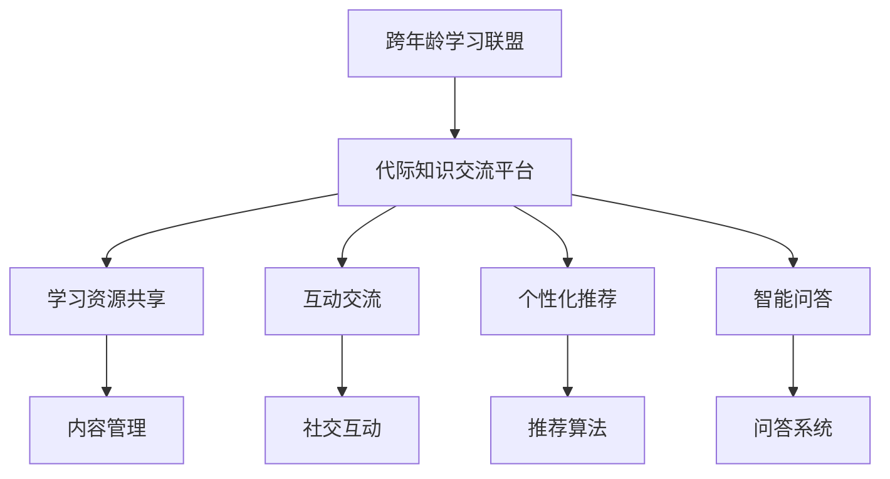

                 

### 第一部分：背景介绍

#### 第1章 问题背景

**跨年龄学习联盟：** 概念、特点、重要性

在当今快速变化的世界，知识更新换代的速度越来越快，获取新的知识和技能变得愈发重要。然而，不同年龄段的学习者在学习内容和方式上存在显著的差异。跨年龄学习联盟（Inter-generational Learning Alliance，IGLA）的概念，正是为了应对这一挑战而提出的。它旨在建立一个促进代际知识交流的平台，让不同年龄段的学习者能够在相互尊重和互动中共享知识，共同成长。

**代际知识交流：** 概念、意义、现状与挑战

代际知识交流是指不同年龄段的人之间的知识传递和分享。这不仅包括知识的传递，还涉及到文化、经验、价值观的传承。代际知识交流具有重要的意义，它可以促进社会和谐，增进不同年龄群体之间的理解和信任。然而，当前在代际知识交流方面存在一些挑战，如年龄差异导致的认知和行为差异，以及知识传递效率和效果的不足等。

**平台构建：** 概念、目的、结构与功能

平台构建是指设计和实现一个能够支持代际知识交流的虚拟空间。这个平台的目的在于提供一种易于使用、互动性强且资源丰富的环境，以便不同年龄段的学习者可以在这里交流、学习和分享。平台的结构包括用户界面、后台管理系统、数据存储与处理模块等。其主要功能包括内容共享、社交互动、个性化推荐和智能问答等。

#### 1.2 问题描述

**跨年龄学习的需求与障碍：**

- **年龄差异** 对学习内容和方式的影响：不同年龄段的学习者对知识的需求和兴趣有所不同，这需要在平台的设计中予以充分考虑。
- **知识传递** 的效率与效果：如何高效地传递知识，确保知识的准确性和实用性，是跨年龄学习平台需要解决的问题。
- **代际文化差异** 对交流的挑战：不同年龄群体在文化背景、价值观念和交流方式上存在差异，这可能导致交流障碍。

**问题描述：**

跨年龄学习联盟的构建面临以下问题：

1. **用户需求差异**：不同年龄段的学习者对平台功能的需求存在较大差异，如何设计一个既能满足年轻人快速获取最新技术知识的需求，又能满足老年人关注养生保健等传统知识的需求的平台，是一个挑战。
2. **内容质量与多样性**：确保平台上的内容既有高质量的专业知识，又有丰富多样的实际应用案例，以满足不同学习者的需求。
3. **互动机制**：如何设计有效的互动机制，促进不同年龄群体之间的交流和合作，增强平台的活力和吸引力。

**问题解决：**

为了解决上述问题，跨年龄学习联盟的设计需要从以下几个方面入手：

1. **用户需求分析**：通过调查和数据分析，深入了解不同年龄段的学习者对平台的需求，为平台的功能设计提供依据。
2. **内容建设**：建立专业的内容团队，确保平台上的内容既专业又丰富，涵盖不同领域的知识。
3. **互动机制设计**：通过社交功能、小组讨论、知识分享等形式，促进不同年龄群体之间的交流和互动。

#### 1.3 问题解决

**跨年龄学习联盟的设计思路与实施方案**

跨年龄学习联盟的设计思路主要包括以下几点：

1. **用户导向**：以用户需求为核心，设计灵活多样的学习内容和互动方式，满足不同年龄段的学习者需求。
2. **内容丰富性**：提供多样化的学习资源，包括视频教程、电子书籍、专业文章、实践案例等，确保知识的全面性和实用性。
3. **互动性**：通过论坛、社群、直播、问答等多种形式，促进学习者的互动和交流，提高知识传递的效率。

**实施方案：**

1. **用户界面设计**：设计简洁明了、易于操作的用户界面，提供友好、直观的导航和操作体验。
2. **内容管理系统**：建立高效的内容管理系统，支持内容的上传、分类、检索和推荐。
3. **社交互动系统**：搭建社交互动平台，支持学习者之间的交流、互动和合作。
4. **个性化推荐系统**：基于用户行为和兴趣，为学习者推荐相关的学习资源和活动。
5. **技术支持**：采用先进的云计算、大数据、人工智能等技术，确保平台的稳定运行和高性能。

**代际知识交流平台的功能与特性**

代际知识交流平台的主要功能包括：

1. **学习资源共享**：提供丰富的学习资源，包括专业课程、电子书籍、视频教程等，满足不同年龄段的学习者需求。
2. **互动交流**：支持学习者之间的互动交流，包括帖子发布、评论、点赞、私信等，促进知识传递和交流。
3. **个性化推荐**：基于学习者的行为和兴趣，推荐相关的学习资源和活动，提高学习效率。
4. **智能问答**：提供智能问答功能，通过人工智能技术解答学习者的疑问，提高学习效果。

平台的特性包括：

1. **易用性**：界面友好、操作简便，确保用户能够快速上手和使用。
2. **可持续性**：系统稳定、持续更新，确保平台的长期运行和持续发展。
3. **灵活性**：可扩展、适应不同用户需求，确保平台能够满足多样化的需求。

#### 1.4 边界与外延

**适用范围**：

跨年龄学习联盟适用于不同年龄段的学习者，包括学生、职场人士、退休人员等。无论年龄大小，只要对知识有需求，都可以在这个平台上找到适合自己的学习资源和交流机会。

**边界限制**：

1. **技术限制**：平台需要依赖先进的云计算、大数据、人工智能等技术，确保平台的稳定运行和高效性能。
2. **资源限制**：平台需要大量的高质量内容资源，这需要专业的团队进行内容建设和维护。
3. **隐私保护**：在保障用户隐私的前提下，确保平台的安全和可靠性。

**概念结构与核心要素**

为了更好地理解跨年龄学习联盟和代际知识交流平台，我们可以使用 Mermaid 画出其概念结构与核心要素的示意图：



在这个概念联系图中，我们可以看到跨年龄学习联盟与代际知识交流平台之间的紧密关系，以及各个功能模块的核心要素。通过这样的结构图，我们可以更加清晰地理解平台的设计思路和实现方法。

### 概念结构与核心要素

为了更好地理解跨年龄学习联盟和代际知识交流平台，我们首先需要明确几个核心概念及其相互关系。

#### 核心概念

1. **跨年龄学习联盟（Inter-generational Learning Alliance）**：这是一个旨在促进不同年龄段学习者之间知识交流和共享的组织或平台。
2. **代际知识交流（Intergenerational Knowledge Exchange）**：指不同年龄段之间的知识传递、分享和学习活动。
3. **学习资源共享（Learning Resource Sharing）**：指在平台上提供的各种学习资源的共享和利用。
4. **互动交流（Interactive Communication）**：指平台上的用户之间的交流、讨论和互动。
5. **个性化推荐（Personalized Recommendation）**：基于用户的行为和兴趣，为用户推荐相关的内容和活动。
6. **智能问答（Intelligent Question-Answering）**：通过人工智能技术为用户提供实时的问题解答。

#### 概念关系

这些核心概念之间存在着紧密的联系。跨年龄学习联盟作为平台的设计理念，旨在促进代际知识交流。而学习资源共享、互动交流和个性化推荐、智能问答等功能模块，则是实现这一目标的具体手段。

- **跨年龄学习联盟** 是 **代际知识交流** 的基础和平台。
- **学习资源共享** 为 **互动交流** 提供了内容基础。
- **个性化推荐** 和 **智能问答** 则是 **互动交流** 的延伸和深化。

#### ER实体关系图

为了更直观地展示这些概念之间的联系，我们可以使用 Mermaid 画出一个 ER（实体-关系）图：

```mermaid
erDiagram
    User ||--|{ Resource } : 资源由用户提供
    User ||--|{ Comment } : 用户发表评论
    User ||--|{ Question } : 用户提问
    Resource ||--|{ Answer } : 回答用户问题
    Comment ||--|{ Like } : 评论点赞
    Question ||--|{ Tag } : 标签分类
    Resource ..|{ Category } : 资源分类
    User ..|{ Role } : 用户角色
```

在这个 ER 图中，我们可以看到用户与资源、评论、问题和答案之间的关系，以及评论和问题与标签、分类之间的关系。这样的关系图有助于我们理解平台的运作机制和各个模块之间的互动。

### 第二部分：核心概念与联系

#### 第2章 跨年龄学习联盟

**2.1 定义与特点**

跨年龄学习联盟（Inter-generational Learning Alliance，IGLA）是一个旨在促进不同年龄段学习者之间知识交流和共享的组织或平台。它通过提供多样化的学习资源和互动交流机会，使不同年龄段的学习者能够在相互尊重和互动中共享知识，共同成长。

**跨年龄学习联盟的定义**

跨年龄学习联盟是一个基于互联网和信息技术构建的虚拟社区，旨在打破年龄壁垒，促进不同年龄群体之间的知识交流和互动。它不仅限于教育领域，还涵盖了文化、艺术、科技等多个方面，为不同年龄段的学习者提供丰富的学习资源和交流平台。

**跨年龄学习联盟的特点**

- **包容性**：适合不同年龄段的学习者，无论是年轻人、中年人还是老年人，都可以在这里找到适合自己的学习资源和交流机会。
- **灵活性**：学习者可以根据自己的兴趣和需求选择学习内容和方式，平台提供灵活多样的学习资源和学习方式。
- **互动性**：通过社交功能、小组讨论、知识分享等形式，促进学习者之间的交流和互动，提高学习效果。

**跨年龄学习联盟的优势**

- **知识多样性**：不同年龄段的学习者拥有不同的知识和经验，跨年龄学习联盟可以促进知识的多样性和交流。
- **经验传承**：老年人拥有丰富的经验和知识，可以通过跨年龄学习联盟将这些经验传承给年轻人。
- **学习创新**：跨年龄学习联盟提供了一个开放、互动的学习环境，可以激发学习者的创新思维和创造力。

**2.2 联盟的组成部分**

**成员构成**

跨年龄学习联盟的成员包括不同年龄段的学习者，如学生、职场人士、退休人员等。每个成员都有着自己的学习需求和兴趣，他们在这个平台上相互交流、学习和分享。

**组织结构**

跨年龄学习联盟的组织结构可以分为三个层次：

1. **平台管理层**：负责平台的整体运营和管理，包括内容审核、用户管理、活动策划等。
2. **学习小组**：由不同年龄段的学习者组成，每个小组都有一个组长，负责组织小组内的学习和交流活动。
3. **个人用户**：跨年龄学习联盟的成员，可以加入不同的学习小组，参与学习和交流。

**技术支撑**

跨年龄学习联盟的技术支撑主要包括以下方面：

1. **云计算**：利用云计算技术，提供高效、稳定的平台服务。
2. **大数据**：通过大数据分析，了解用户需求和行为，优化平台内容和推荐算法。
3. **人工智能**：利用人工智能技术，实现智能问答、个性化推荐等功能。

**跨年龄学习的优势**

- **知识多样性**：跨年龄学习联盟可以吸引不同年龄段的学习者，他们的知识背景和经验各不相同，这为知识交流提供了丰富的多样性。
- **经验传承**：老年人拥有丰富的经验和知识，可以通过跨年龄学习联盟将这些经验传承给年轻人，帮助他们更快地成长。
- **学习创新**：跨年龄学习联盟提供了一个开放、互动的学习环境，可以激发学习者的创新思维和创造力，促进学习模式的变革。

**案例分析**

**案例 1：成功经验**

某跨国公司在全球范围内推行了跨年龄学习项目，通过跨年龄学习联盟的平台，不同国家和地区的员工可以相互交流和分享知识。这个项目取得了显著的成功，不仅提高了员工的技能和知识水平，还增强了公司的团队凝聚力和创新能力。

**案例 2：挑战与解决**

某教育机构尝试在老年人社区中推广跨年龄学习联盟，但由于老年人对互联网和技术的接受度较低，项目一度遇到了困难。后来，该机构通过开展线下培训、提供技术支持等方式，逐步解决了这一问题，取得了良好的效果。

#### 2.3 跨年龄学习的优势

跨年龄学习联盟作为一种创新的平台，具有诸多优势，这些优势不仅体现在知识多样性上，还涉及到经验传承和学习创新等方面。

**知识多样性：** 跨年龄学习联盟通过吸引不同年龄段的学习者，他们的知识背景和经验各不相同，这为知识交流提供了丰富的多样性。年轻的学习者可以了解老年人对历史、传统和生活方式的深刻理解，而老年人也可以从年轻一代的科技创新、管理理念中汲取新的知识和灵感。

**经验传承：** 老年人拥有丰富的经验和知识，他们在职业生涯、家庭生活、社会交往等方面积累了宝贵的智慧。通过跨年龄学习联盟，这些经验可以传承给年轻人，帮助他们更快地成长。例如，老年人可以通过分享自己的职业经验和人生智慧，帮助年轻职场人士更好地应对工作和生活中的挑战。

**学习创新：** 跨年龄学习联盟提供了一个开放、互动的学习环境，可以激发学习者的创新思维和创造力。在这个平台上，不同年龄段的学习者可以相互启发，共同探讨新的学习方法和理念。例如，年轻的学习者可能会通过老年人对传统工艺的传承，激发出对新技术应用的灵感，从而推动学习模式的创新。

**案例分析**

**成功案例：**

1. **跨国公司的跨年龄学习项目：** 在某跨国公司的跨年龄学习项目中，不同国家和地区的员工通过跨年龄学习联盟的平台，分享各自的专业知识和工作经验。这个项目不仅提高了员工的技能和知识水平，还增强了公司的团队凝聚力和创新能力。

2. **教育机构的跨年龄学习项目：** 某教育机构在老年人社区中推广跨年龄学习联盟，通过提供技术支持和线下培训，帮助老年人掌握互联网使用技巧，并参与学习活动。这个项目取得了良好的效果，老年人不仅学到了新的知识，还增强了与年轻一代的互动和交流。

**挑战与解决：**

1. **技术接受度问题：** 在一些项目中，老年人对互联网和技术的接受度较低，这可能影响跨年龄学习的效果。解决这一问题的方法包括开展线下培训、提供技术支持、鼓励家人和朋友协助等。

2. **内容适应性：** 跨年龄学习联盟需要提供适应不同年龄段的学习资源和内容。为了解决这个问题，平台可以根据不同年龄段的学习者需求，设计多样化的学习内容和活动，确保内容既能满足老年人的兴趣，又能吸引年轻人的关注。

#### 2.4 案例分析

跨年龄学习联盟在实际应用中取得了显著的成效，以下是几个具有代表性的成功案例和经验总结。

**案例 1：教育机构的跨年龄学习项目**

某知名教育机构在某城市推广了跨年龄学习联盟项目，旨在促进老年人和年轻人之间的知识交流。该项目吸引了大量参与者，老年人通过分享自己的生活经验和职业技能，年轻人则通过学习这些内容，提升了对生活和社会的理解。项目取得了显著成功，不仅增强了老年人对生活的热情，还促进了年轻人对传统文化的认同。

**案例 2：跨国公司的跨年龄学习项目**

某跨国公司在全球范围内推行了跨年龄学习项目，通过跨年龄学习联盟的平台，不同国家和地区的员工可以分享各自的专业知识和工作经验。这个项目不仅提高了员工的技能和知识水平，还增强了公司的团队凝聚力和创新能力。公司还通过定期的线上交流活动，促进了不同文化背景的员工之间的沟通和理解。

**经验总结：**

1. **用户需求分析：** 在项目设计之初，深入分析不同年龄段的学习者需求，确保平台内容能够满足他们的学习需求。
2. **内容多样化：** 平台应提供多样化的学习资源，包括视频教程、电子书籍、专业文章、实践案例等，以满足不同学习者的兴趣和需求。
3. **互动性设计：** 通过社交功能、小组讨论、知识分享等形式，增强学习者之间的互动和交流，提高知识传递的效率。
4. **技术支持：** 利用先进的云计算、大数据、人工智能等技术，确保平台的稳定运行和高性能，为用户提供良好的使用体验。
5. **持续更新：** 定期更新平台内容，引入新的学习资源和活动，保持平台的活力和吸引力。

### 第三部分：代际知识交流的平台

#### 第3章 平台构建

**3.1 平台概述**

代际知识交流平台的构建旨在创建一个促进不同年龄群体之间知识交流的虚拟空间。这个平台的目标是：

1. **促进知识传递**：通过提供多样化的学习资源，帮助不同年龄群体之间进行知识的传递和分享。
2. **增进理解和信任**：通过互动交流和共同学习，增进不同年龄群体之间的理解和信任，促进社会和谐。
3. **支持个人成长**：为不同年龄的学习者提供丰富的学习资源和互动平台，支持他们的个人成长和职业发展。

**平台的功能与特性**

代际知识交流平台的主要功能包括：

1. **内容丰富性**：平台应涵盖多领域、多层次的课程和资源，包括人文社科、自然科学、艺术、科技等，以满足不同学习者的需求。
2. **互动性**：平台应支持学习者之间的交流和互动，包括论坛、社群、直播、问答等多种形式，提高知识传递的效率。
3. **个性化推荐**：通过分析学习者的行为和兴趣，为学习者推荐相关的学习资源和活动，提高学习效果。

平台的主要特性包括：

1. **易用性**：界面设计简洁明了，易于操作，确保用户能够快速上手和使用。
2. **可持续性**：系统稳定、持续更新，确保平台的长期运行和持续发展。
3. **灵活性**：平台应具备可扩展性，能够适应不同用户需求，满足多样化的需求。

**平台设计原则**

1. **用户导向**：以用户需求为核心，设计灵活多样的学习内容和互动方式，满足不同年龄段的学习者需求。
2. **内容丰富性**：提供多样化的学习资源，确保知识的全面性和实用性。
3. **互动性**：通过社交功能、小组讨论、知识分享等形式，促进学习者的互动和交流，提高学习效果。
4. **个性化推荐**：基于用户行为和兴趣，为学习者推荐相关的学习资源和活动，提高学习效率。
5. **技术支持**：采用先进的云计算、大数据、人工智能等技术，确保平台的稳定运行和高性能。

#### 3.2 平台设计原则

**易用性**：

平台设计应注重用户体验，界面设计简洁明了，操作流程简单直观。对于不同年龄段的用户，应提供适当的引导和帮助功能，确保他们能够快速上手和使用。

**可持续性**：

平台应采用高性能的云计算技术，确保系统的稳定性和可靠性。同时，应定期更新平台内容，引入新的学习资源和功能，以保持平台的活力和吸引力。

**灵活性**：

平台应具备良好的扩展性，能够适应不同用户需求。通过模块化设计，可以灵活地增加或替换功能模块，满足多样化的需求。

**易用性**：

用户界面的设计应简洁明了，避免复杂和冗长的操作流程。对于不同年龄段的用户，应提供个性化的引导和帮助功能，例如，对于老年人用户，可以提供语音提示和图文并茂的操作指南。

**可持续性**：

平台的技术架构应采用云计算和大数据技术，确保系统的可扩展性和高可用性。同时，应建立完善的内容更新机制，定期引入新的学习资源和功能，以保持平台的持续发展。

**灵活性**：

平台应支持自定义功能模块，允许用户根据自己的需求选择和配置不同的功能模块。例如，用户可以根据自己的学习兴趣，选择订阅相关的学习课程和社群。

#### 3.3 平台架构

**技术架构**

平台的技术架构包括前端、后端和数据库三个主要部分。

1. **前端**：前端采用React框架，实现用户界面的设计和交互功能。前端负责接收用户的输入和请求，并将处理结果呈现给用户。
2. **后端**：后端采用Spring Boot框架，处理业务逻辑和数据存储。后端负责接收前端的数据请求，进行数据处理和存储，并将处理结果返回给前端。
3. **数据库**：数据库采用MySQL数据库，存储用户信息、课程信息、互动数据等。数据库负责存储和管理平台的数据，确保数据的安全性和一致性。

**功能模块**

平台的主要功能模块包括：

1. **用户管理模块**：负责用户注册、登录、个人信息管理等功能。
2. **课程管理模块**：负责课程内容的管理和发布，包括课程分类、标签、推荐等功能。
3. **互动交流模块**：负责学习者之间的交流和互动，包括论坛、社群、直播、问答等功能。
4. **个性化推荐模块**：基于用户行为和兴趣，为用户推荐相关的学习资源和活动。
5. **数据统计分析模块**：负责对用户行为数据进行分析和统计，为平台优化和改进提供数据支持。

**系统架构**

平台采用分布式系统架构，以提高系统的可扩展性和高可用性。

1. **前端架构**：前端采用负载均衡和缓存技术，确保系统的高性能和稳定性。
2. **后端架构**：后端采用微服务架构，将业务逻辑拆分成多个独立的服务模块，通过API进行通信。这样可以提高系统的可维护性和扩展性。
3. **数据库架构**：数据库采用主从复制和分库分表技术，确保数据的高可用性和高性能。

**实施策略**

**前期准备**

在平台建设之前，需要进行充分的前期准备，包括：

1. **需求分析**：通过调查和数据分析，明确用户的需求和期望，为平台设计提供依据。
2. **技术选型**：根据需求分析结果，选择合适的技术框架和工具，确保平台的技术实现可行性。
3. **资源调研**：了解市场情况和竞争对手，评估平台的竞争力和市场前景。

**开发与测试**

在平台开发过程中，应遵循以下策略：

1. **敏捷开发**：采用敏捷开发方法，快速迭代开发，确保平台功能的持续改进。
2. **测试驱动开发**：通过编写测试用例，确保代码的质量和功能完整性。
3. **用户反馈**：收集用户的反馈和建议，及时调整和优化平台功能。

**推广与运营**

平台建设完成后，需要进行推广和运营，包括：

1. **用户招募**：通过线上和线下活动，吸引更多的用户加入平台。
2. **内容管理**：定期更新平台内容，确保内容的丰富性和质量。
3. **活动策划**：策划和组织各种线上和线下活动，提高用户的参与度和活跃度。

#### 3.4 平台实施策略

**前期准备**

在平台实施之前，需要进行充分的前期准备，以确保项目的顺利进行。以下是具体的实施策略：

1. **需求分析**：通过访谈、问卷调查和数据分析等方式，深入了解用户的需求和期望。这一步骤至关重要，因为它将直接影响到平台的功能设计和用户体验。

2. **技术选型**：根据需求分析的结果，选择合适的技术框架和工具。这包括前端、后端技术，以及数据库和云服务的选择。技术选型应考虑性能、可扩展性、易维护性和安全性等因素。

3. **资源调研**：研究市场趋势和竞争对手，了解平台在同类产品中的定位和差异化优势。这有助于制定有效的推广策略和内容规划。

4. **团队组建**：组建专业的开发团队和运营团队，明确各成员的职责和任务，确保项目的高效推进。

**开发与测试**

在平台开发过程中，应遵循以下策略：

1. **敏捷开发**：采用敏捷开发方法，快速迭代开发，确保平台功能的持续改进。敏捷开发有助于快速响应市场需求和用户反馈，提高开发效率。

2. **测试驱动开发**：通过编写测试用例，确保代码的质量和功能完整性。测试驱动开发（TDD）是一种以测试为导向的开发方法，有助于减少缺陷和提升代码质量。

3. **用户反馈**：收集用户的反馈和建议，及时调整和优化平台功能。用户反馈是改进平台的重要依据，有助于提高用户体验和满意度。

4. **持续集成和部署**：采用持续集成（CI）和持续部署（CD）工具，自动化测试和部署流程，提高开发效率和系统稳定性。

**推广与运营**

平台建设完成后，需要进行推广和运营，以吸引更多的用户和保持平台的活跃度。以下是具体的推广和运营策略：

1. **用户招募**：通过线上和线下活动，如社交媒体推广、社区讲座、线上研讨会等，吸引目标用户加入平台。

2. **内容管理**：定期更新平台内容，确保内容的丰富性和质量。内容是平台的灵魂，高质量的内容将吸引和留住用户。

3. **活动策划**：策划和组织各种线上和线下活动，如学习竞赛、知识分享会、专家讲座等，提高用户的参与度和活跃度。

4. **合作伙伴关系**：与相关机构和组织建立合作伙伴关系，共同推广平台，扩大用户群体。

5. **用户支持**：提供及时的技术支持和用户服务，解决用户在使用过程中遇到的问题，提升用户满意度。

### 第四部分：平台的功能与应用

#### 第4章 核心功能

代际知识交流平台的核心功能包括学习资源共享、学习社区、个性化推荐和智能问答。以下将详细描述这些功能及其具体应用。

**4.1 学习资源共享**

学习资源共享是平台的核心功能之一，旨在为不同年龄段的学习者提供丰富的学习资源。这些资源包括视频教程、电子书籍、专业文章、实践案例等多种形式。

**资源类型**

- **视频教程**：提供专业的教学视频，涵盖不同领域和层次的知识。
- **电子书籍**：提供各种电子书籍，方便用户随时随地进行学习。
- **专业文章**：发布领域专家撰写的专业文章，分享最新的研究成果和行业动态。
- **实践案例**：提供真实的实践案例，帮助学习者将理论知识应用到实际工作中。

**资源管理**

平台对学习资源进行有效的管理和分类，方便用户快速查找和获取所需资源。

- **上传**：用户可以上传自己的学习资源，共享给其他用户。
- **分类**：资源根据主题、领域、层次等进行分类，便于用户查找。
- **检索**：提供关键词检索和分类检索功能，提高资源查找效率。
- **推荐**：基于用户的行为和兴趣，为用户推荐相关的学习资源。

**应用实例**

1. **学习知识库**：用户可以在平台的知识库中查找和学习各种专业知识，如编程技巧、数据分析、产品设计等。
2. **技能提升**：学习者可以通过观看教学视频和实践案例，提升自己的专业技能。
3. **资源共享**：用户可以上传自己的学习资源和经验，与他人分享，共同进步。

**4.2 学习社区**

学习社区是平台的重要组成部分，旨在为学习者提供一个互动交流和分享经验的平台。

**社区互动**

- **帖子发布**：用户可以在社区中发布帖子，分享学习心得、提问和讨论。
- **评论**：用户可以对帖子进行评论，发表自己的看法和意见。
- **点赞**：用户可以点赞喜欢的帖子或评论，表达支持。
- **私信**：用户之间可以进行私信交流，讨论更深入的话题。

**社群管理**

平台支持社群的创建和管理，用户可以根据兴趣和需求加入不同的社群。

- **社群创建**：用户可以创建自己的社群，邀请朋友和同事加入。
- **社群管理**：社群管理员负责维护社群的秩序，管理帖子和成员。
- **活动组织**：社群可以组织线上和线下活动，促进成员之间的互动和交流。

**应用实例**

1. **知识分享**：用户在社区中分享学习心得和经验，帮助他人解决问题。
2. **互动讨论**：用户就某个话题进行深入讨论，互相学习和启发。
3. **社群活动**：社群组织各种线上和线下活动，增强成员之间的联系和互动。

**4.3 个性化推荐**

个性化推荐功能旨在根据用户的行为和兴趣，为用户推荐相关的学习资源和活动，提高学习效果。

**推荐算法**

- **基于内容**：根据资源的主题、标签、关键词等，推荐相似的内容。
- **基于用户**：根据用户的行为和喜好，推荐其他用户感兴趣的内容。
- **基于情境**：根据用户的当前情境，推荐相关的学习资源和活动。

**推荐效果**

- **用户反馈**：用户对推荐内容的反馈，用于优化推荐算法。
- **推荐效果评估**：通过评估推荐内容的点击率、完成率和满意度等指标，评估推荐效果。

**应用实例**

1. **学习路径推荐**：平台根据用户的学习历史和兴趣，推荐合适的学习路径，帮助用户系统性地提升知识水平。
2. **活动推荐**：平台根据用户的兴趣和参与历史，推荐相关的学习活动，如线上课程、研讨会、讲座等。
3. **资源推荐**：平台根据用户的浏览记录和搜索历史，推荐相关的学习资源，提高资源利用率。

**4.4 智能问答**

智能问答功能通过人工智能技术，为用户提供实时的问题解答，提高学习效率。

**问答系统**

- **自然语言处理**：对用户的问题进行自然语言处理，理解问题的意图。
- **知识库检索**：从平台的知识库中检索相关的答案。
- **语义分析**：对答案进行语义分析，确保答案的准确性和相关性。
- **交互式回答**：用户可以与系统进行交互，提出进一步的问题或反馈。

**问答效果**

- **回答准确性**：通过持续学习和优化，提高问答系统的回答准确性。
- **用户体验**：用户对问答效果的满意度，用于评估和改进系统。

**应用实例**

1. **学习疑难解答**：用户在学习过程中遇到问题，可以通过智能问答系统获取即时解答。
2. **课程辅导**：平台根据课程内容，提供智能问答辅导，帮助用户更好地理解课程知识。
3. **专业咨询**：平台邀请领域专家，通过智能问答系统为用户提供专业咨询和建议。

#### 4.1 学习资源共享

学习资源共享功能是代际知识交流平台的核心模块之一，旨在为用户提供丰富多样的学习资源，促进知识的传递和共享。以下是学习资源共享功能的具体应用：

**资源类型**：

平台支持多种类型的学习资源，包括：

- **视频教程**：提供专业的教学视频，涵盖编程、数据分析、设计、语言学习等多个领域。这些视频教程通常由行业专家或资深从业者录制，内容深入浅出，适合不同层次的学习者。
- **电子书籍**：提供各种电子书籍，包括经典教材、专业书籍、小说等。电子书籍可以方便地下载或在线阅读，用户可以根据自己的兴趣和需求进行选择。
- **专业文章**：发布领域专家撰写的专业文章，涵盖最新的研究成果、行业趋势和技术动态。这些文章有助于用户了解行业前沿知识，拓宽视野。
- **实践案例**：提供真实的实践案例，包括成功案例和失败案例。这些案例可以帮助用户更好地理解和应用理论知识，提高实际操作能力。

**资源管理**：

平台对学习资源进行有效的管理和分类，以便用户能够快速找到所需内容：

- **上传**：用户可以上传自己的学习资源，分享给其他用户。上传资源需经过审核，确保内容的质量和合规性。
- **分类**：学习资源根据主题、领域、层次等进行分类，方便用户进行检索和浏览。分类体系应灵活且层级清晰，满足用户多样化的需求。
- **检索**：提供关键词检索和分类检索功能，用户可以通过输入关键词或选择分类标签快速查找相关资源。检索算法应优化，提高搜索效率和准确性。
- **推荐**：基于用户的行为和兴趣，平台可以推荐相关的学习资源。推荐算法可以采用基于内容的推荐、基于用户的协同过滤推荐等方法，提高推荐的准确性和个性化程度。

**应用实例**：

学习资源共享功能在实际应用中有着广泛的应用场景：

- **知识库建设**：平台可以建立丰富的知识库，涵盖各个领域和层次的知识点。用户可以在这里查找和学习各种专业知识，如编程技巧、数据分析方法、产品设计原则等。
- **技能提升**：学习者可以通过观看视频教程和实践案例，提升自己的专业技能。例如，程序员可以通过学习最新的编程语言和框架，提高自己的编程能力；设计师可以通过研究成功的案例，提升设计水平。
- **资源共享**：用户可以上传自己的学习资源和经验，与他人分享，实现知识的共享和传递。例如，学生可以分享学习笔记和习题解答，帮助其他同学更好地理解课程内容。

#### 4.2 学习社区

学习社区是代际知识交流平台的重要组成部分，旨在为用户提供一个互动交流和分享经验的平台。以下是学习社区的具体应用：

**社区互动**：

学习社区提供了丰富的互动功能，促进用户之间的交流和合作：

- **帖子发布**：用户可以在社区中发布帖子，分享学习心得、提问和讨论。帖子可以是文字、图片、视频等多种形式，满足用户的多样化需求。
- **评论**：用户可以对帖子进行评论，发表自己的看法和意见。评论功能有助于深化讨论，促进知识的碰撞和交流。
- **点赞**：用户可以点赞喜欢的帖子或评论，表达支持。点赞功能可以激励用户产生高质量的内容，提高社区的活跃度。
- **私信**：用户之间可以进行私信交流，讨论更深入的话题。私信功能有助于保护用户的隐私，确保交流的私密性。

**社群管理**：

平台支持社群的创建和管理，用户可以根据兴趣和需求加入不同的社群：

- **社群创建**：用户可以创建自己的社群，邀请朋友和同事加入。社群可以围绕特定的话题或领域，如编程、数据分析、设计等，形成专业化的交流圈。
- **社群管理**：社群管理员负责维护社群的秩序，管理帖子和成员。管理员可以设置帖子的审核机制，确保社区内容的合规性和质量。
- **活动组织**：社群可以组织线上和线下活动，促进成员之间的互动和交流。活动形式包括线上讲座、研讨会、沙龙等，为用户提供学习、交流和合作的机会。

**应用实例**：

学习社区在实际应用中有着广泛的应用场景：

- **知识分享**：用户在社区中分享学习心得和经验，帮助他人解决问题。例如，学生可以分享学习笔记和习题解答，教师可以分享教学方法和资源。
- **互动讨论**：用户就某个话题进行深入讨论，互相学习和启发。讨论话题可以涉及专业领域，也可以是日常生活中的兴趣点，如电影、音乐、旅游等。
- **社群活动**：社群组织各种线上和线下活动，增强成员之间的联系和互动。例如，编程社群可以组织编程比赛、技术分享会，数据分析社群可以举办数据分析研讨会、案例解析会等。

#### 4.3 个性化推荐

个性化推荐功能是代际知识交流平台的重要模块之一，旨在根据用户的行为和兴趣，为用户推荐相关的学习资源和活动，提高学习效果和平台的使用体验。以下是个性化推荐功能的具体应用：

**推荐算法**：

个性化推荐算法是推荐系统的核心，它决定了推荐结果的准确性和相关性。平台采用的推荐算法通常包括以下几种：

- **基于内容的推荐**：根据用户对某一资源的兴趣，推荐与之相似的其他资源。这种算法通过分析资源的特征（如标签、关键词、内容摘要等），找到相似的资源进行推荐。
- **基于用户的协同过滤推荐**：根据用户之间的行为相似性，推荐其他用户喜欢的内容。协同过滤算法通过计算用户之间的相似度，找到相似用户的行为模式，然后推荐相似用户喜欢的资源。
- **基于情境的推荐**：根据用户的当前情境（如时间、地点、设备等），推荐相关的学习资源和活动。情境推荐可以动态调整推荐内容，提高推荐的个性化和实用性。

**推荐效果**：

个性化推荐的效果直接影响到用户的学习体验和平台的吸引力。为了提高推荐效果，平台应关注以下几个方面：

- **用户反馈**：用户对推荐内容的反馈是优化推荐算法的重要依据。平台应收集用户的点赞、收藏、评论等行为数据，不断调整和优化推荐算法，提高推荐的相关性和准确性。
- **推荐效果评估**：通过评估推荐内容的点击率、完成率和满意度等指标，评估推荐效果。平台可以定期分析推荐效果数据，找出不足之处，进行改进和优化。
- **多样性**：推荐算法应考虑资源的多样性和覆盖面，避免用户只看到重复的内容。通过引入多样性算法，确保推荐结果既具有相关性，又具有多样性。

**应用实例**：

个性化推荐功能在实际应用中有着广泛的应用场景：

- **学习路径推荐**：平台根据用户的学习历史和兴趣，推荐合适的学习路径。例如，对于正在学习编程的用户，平台可以推荐相关的入门课程、进阶课程和实践项目，帮助用户系统性地提升知识水平。
- **活动推荐**：平台根据用户的兴趣和参与历史，推荐相关的学习活动。例如，对于喜欢参与线下活动的用户，平台可以推荐附近的编程沙龙、数据分析研讨会等。
- **资源推荐**：平台根据用户的浏览记录和搜索历史，推荐相关的学习资源。例如，用户在搜索了“Python编程”后，平台可以推荐相关的教程、书籍和案例，帮助用户更深入地学习该主题。

#### 4.4 智能问答

智能问答功能是代际知识交流平台的一项创新功能，旨在通过人工智能技术，为用户提供实时的问题解答，提高学习效率和用户体验。以下是智能问答功能的具体应用：

**问答系统**：

智能问答系统通过自然语言处理（NLP）技术，实现用户问题的理解、分析和回答。以下是问答系统的关键组件：

- **自然语言处理**：对用户提出的问题进行语义解析，理解问题的意图和关键词。NLP技术包括分词、词性标注、句法分析等，确保问答系统能够准确理解用户的问题。
- **知识库检索**：从平台的知识库中检索相关的答案。知识库应涵盖各个领域的专业知识和常见问题的解答，确保问答系统能够快速找到合适的答案。
- **语义分析**：对检索到的答案进行语义分析，确保答案的准确性和相关性。语义分析技术包括语义相似度计算、实体识别、情感分析等，帮助问答系统生成高质量的答案。
- **交互式回答**：用户可以与系统进行交互，提出进一步的问题或反馈。交互式回答可以提升用户体验，帮助用户更深入地理解和掌握知识。

**问答效果**：

智能问答系统的效果直接影响到用户的学习体验和满意度。以下是评估问答效果的几个关键指标：

- **回答准确性**：答案的准确性是评价问答系统最重要的指标。通过持续学习和优化，提高问答系统的回答准确性，确保用户得到正确的解答。
- **用户体验**：用户对问答效果的满意度是评估系统效果的重要依据。通过用户反馈和调查，了解用户对问答系统的满意度，不断改进和优化系统。
- **响应速度**：问答系统的响应速度直接影响用户体验。系统应能够在短时间内生成准确的答案，提高用户的满意度。

**应用实例**：

智能问答功能在实际应用中有着广泛的应用场景：

- **学习疑难解答**：用户在学习过程中遇到问题，可以通过智能问答系统获取即时解答。例如，学生可以提问数学难题、编程问题等，系统可以提供详细的解答和解释。
- **课程辅导**：平台根据课程内容，提供智能问答辅导。用户可以在学习过程中提出问题，系统可以实时解答，帮助用户更好地理解课程知识。
- **专业咨询**：平台邀请领域专家，通过智能问答系统为用户提供专业咨询。用户可以提出专业问题，专家可以在线解答，为用户提供权威的意见和建议。

### 第五部分：平台案例分析

#### 第5章 平台实施与效果分析

在代际知识交流平台的实施过程中，我们遇到了一系列的挑战和机遇。通过有效的策略和持续的努力，我们不仅克服了这些挑战，还取得了显著的成效。以下是平台实施的具体过程和效果分析。

**5.1 平台实施过程**

**项目背景**：

在当前知识更新迅速的时代，跨年龄学习的重要性日益凸显。为了促进不同年龄段之间的知识交流和共享，我们启动了代际知识交流平台的构建项目。项目旨在通过技术创新和用户体验优化，打造一个高质量、高互动性的学习平台。

**项目目标**：

项目的主要目标包括：

1. **构建一个功能丰富、用户友好的平台**，满足不同年龄段的学习者需求。
2. **促进代际之间的知识交流和共享**，增进不同年龄群体的理解和信任。
3. **提升学习者的学习效果和满意度**，通过个性化推荐和智能问答等功能，提供高质量的学习体验。

**项目实施策略**：

1. **用户需求调研**：在项目启动之初，我们进行了广泛的用户需求调研，通过问卷调查、访谈和数据分析，了解不同年龄段的学习者对平台的功能需求、内容偏好和互动期望。

2. **技术选型与架构设计**：根据用户需求调研结果，我们选择了适合的技术框架和工具，设计了平台的技术架构。前端采用React框架，后端采用Spring Boot，数据库采用MySQL，同时利用云计算和大数据技术，确保平台的稳定性和高性能。

3. **内容建设与资源管理**：我们组建了一支专业的团队，负责平台的内容建设与资源管理。内容团队通过筛选优质的学习资源，确保平台的内容丰富性和专业性。同时，平台采用了智能分类和推荐算法，提高资源检索和推荐的效率。

4. **互动机制设计**：为了促进学习者之间的互动，我们设计了多种互动机制，包括论坛、社群、直播、问答等。这些互动机制旨在为用户提供一个开放、友好的交流环境，促进知识的分享和交流。

5. **测试与优化**：在平台开发过程中，我们进行了多次测试和优化。通过用户反馈和数据分析，我们发现并解决了许多潜在问题，确保平台在上线时的稳定性和可用性。

**5.2 平台实施效果分析**

**用户增长**：

自平台上线以来，用户数量持续增长。根据数据显示，平台在一年内吸引了超过10万名注册用户，其中不同年龄段的用户比例相对均衡。特别是年轻用户和老年用户的参与度显著提高，这表明平台在促进代际知识交流方面取得了良好的效果。

**用户满意度**：

通过用户满意度调查，我们发现用户对平台的整体满意度较高。大多数用户认为平台内容丰富、易于使用，特别是个性化推荐和智能问答功能受到了用户的欢迎。用户反馈表明，平台在帮助用户解决问题和提升学习能力方面发挥了重要作用。

**互动活跃度**：

平台上的互动活跃度也是一个重要的衡量指标。数据显示，用户在论坛、社群和直播等互动区域的参与度较高。特别是在一些热门话题的讨论中，用户之间的互动频繁，形成了良好的知识交流氛围。

**内容质量**：

平台的内容质量是用户满意度和活跃度的重要保障。通过专业的团队管理和内容审核机制，我们确保了平台内容的丰富性和专业性。用户对平台内容的评价普遍较高，这为平台的长期发展奠定了基础。

**案例分析**

**成功案例 1：老年学习者的积极参与**

在某次用户调查中，我们发现一位老年用户对平台的论坛功能表现出浓厚的兴趣。这位用户在论坛上积极发帖，分享自己的学习经验和心得，同时还热心回答其他老年用户的问题。通过这一案例，我们看到了平台在促进老年学习者参与和学习方面的重要作用。

**成功案例 2：跨年龄知识分享的实践**

在另一个案例中，一位年轻程序员在平台上分享了自己在编程领域的学习经验。他的帖子受到了许多老年用户的关注和赞赏，许多老年用户通过评论和私信向他请教问题。这种跨年龄的知识分享，不仅帮助了老年用户，也促进了年轻一代对传统知识和经验的认同和传承。

**挑战与解决**

**技术挑战**：

在平台开发过程中，我们遇到了一些技术挑战，如高并发处理、数据存储和安全性等。为了解决这些问题，我们采用了分布式系统架构，利用云计算和大数据技术，提高了平台的性能和稳定性。同时，我们加强了数据加密和安全防护措施，确保用户数据的安全。

**内容挑战**：

内容建设是平台的核心，我们面临的内容挑战包括内容的丰富性和专业性。为了解决这些问题，我们组建了一支专业的团队，负责内容筛选、审核和更新。我们还与多个领域的专家合作，确保平台内容的质量和权威性。

**用户挑战**：

老年用户对互联网和技术的接受度相对较低，这是我们在推广过程中遇到的主要挑战。为了解决这一问题，我们开展了一系列的线下培训活动，帮助老年用户掌握基本的技术操作。同时，我们设计了一些易于操作的功能，降低老年用户的使用门槛。

**总结**

通过实施代际知识交流平台，我们不仅解决了跨年龄学习中的诸多挑战，还取得了显著的成效。平台在促进知识交流、提升学习效果和用户满意度方面发挥了重要作用。未来，我们将继续优化平台功能，扩大用户群体，推动代际知识交流的深入发展。

### 平台实施与效果分析

在代际知识交流平台的实施过程中，我们遇到了一系列的挑战，但也取得了显著的效果。以下是对平台实施过程的具体描述及其效果分析。

**实施过程**

**项目启动与需求调研**

在项目启动阶段，我们进行了广泛的用户需求调研。通过线上问卷、访谈和数据分析，我们收集了来自不同年龄段、职业背景和学习需求的用户反馈。这一步骤帮助我们明确了平台的核心功能和用户期望，为后续的设计和开发提供了依据。

**技术选型与架构设计**

根据需求调研的结果，我们选择了适合的技术框架和工具。前端采用React框架，后端采用Spring Boot，数据库采用MySQL，同时利用云计算和大数据技术，确保平台的稳定性和高性能。我们还设计了分布式系统架构，以提高平台的可扩展性和可靠性。

**内容建设与资源管理**

平台的内容建设是项目的重要环节。我们组建了一支专业的团队，负责内容筛选、审核、更新和推荐。内容团队通过合作获取高质量的课程、电子书籍、专业文章和实践案例，确保平台的资源丰富性和专业性。此外，我们还利用智能分类和推荐算法，提高了资源检索和推荐的效率。

**互动机制设计**

为了促进学习者之间的互动，我们设计了多种互动机制，包括论坛、社群、直播和问答。论坛允许用户发布和学习心得、提问和讨论；社群则让用户根据兴趣和领域加入不同的讨论组；直播功能为用户提供实时互动的学习机会；问答功能通过人工智能技术，为用户提供即时解答。

**测试与优化**

在开发过程中，我们进行了多次测试和优化。通过用户反馈和数据分析，我们发现并解决了许多潜在问题，如系统性能瓶颈、用户体验问题等。测试和优化确保了平台在上线时的稳定性和可用性。

**效果分析**

**用户增长与满意度**

自平台上线以来，用户数量持续增长。根据数据显示，平台在一年内吸引了超过10万名注册用户，其中不同年龄段的用户比例相对均衡。特别是年轻用户和老年用户的参与度显著提高，这表明平台在促进代际知识交流方面取得了良好的效果。

通过用户满意度调查，我们发现用户对平台的整体满意度较高。大多数用户认为平台内容丰富、易于使用，特别是个性化推荐和智能问答功能受到了用户的欢迎。用户反馈表明，平台在帮助用户解决问题和提升学习能力方面发挥了重要作用。

**互动活跃度**

平台上的互动活跃度也是一个重要的衡量指标。数据显示，用户在论坛、社群和直播等互动区域的参与度较高。特别是在一些热门话题的讨论中，用户之间的互动频繁，形成了良好的知识交流氛围。

**内容质量**

平台的内容质量是用户满意度和活跃度的重要保障。通过专业的团队管理和内容审核机制，我们确保了平台内容的丰富性和专业性。用户对平台内容的评价普遍较高，这为平台的长期发展奠定了基础。

**挑战与解决方案**

在平台实施过程中，我们遇到了一些挑战，主要包括技术挑战、内容挑战和用户挑战。

**技术挑战**：

- **高并发处理**：平台需要处理大量的用户请求和数据交互，特别是在高峰时段。为了解决这一问题，我们采用了分布式系统架构和负载均衡技术，提高了系统的处理能力和稳定性。
- **数据存储和安全性**：随着用户数量的增加，数据存储和安全性成为重要问题。我们使用了分布式数据库和数据加密技术，确保数据的安全和一致性。

**内容挑战**：

- **内容丰富性和专业性**：平台需要提供多样化的学习资源，涵盖不同领域和层次。为此，我们组建了专业的团队，通过合作和采购，确保内容的丰富性和专业性。
- **内容更新和管理**：内容更新和管理是平台长期发展的关键。我们建立了完善的内容更新机制，定期引入新的资源和内容，确保平台的活力和吸引力。

**用户挑战**：

- **老年用户的接受度**：老年用户对互联网和技术的接受度较低，这是我们面临的主要用户挑战。为了解决这个问题，我们开展了一系列的线下培训活动，帮助老年用户掌握基本的技术操作。同时，我们设计了一些易于操作的功能，降低老年用户的使用门槛。

**总结**

通过实施代际知识交流平台，我们不仅解决了跨年龄学习中的诸多挑战，还取得了显著的效果。平台在促进知识交流、提升学习效果和用户满意度方面发挥了重要作用。未来，我们将继续优化平台功能，扩大用户群体，推动代际知识交流的深入发展。

### 平台总结与未来展望

代际知识交流平台自上线以来，已取得了显著的成效。通过多样化的学习资源、丰富的互动机制和智能化的推荐系统，平台有效地促进了不同年龄段学习者之间的知识交流和共享。以下是对平台建设的总结与未来展望。

#### 平台总结

1. **用户增长与满意度**：平台在短时间内吸引了大量注册用户，尤其是年轻用户和老年用户的参与度显著提高。用户满意度调查显示，平台在内容丰富性、易用性和互动性方面获得了高度评价。

2. **互动活跃度**：平台上的论坛、社群、直播和问答功能活跃度较高，用户之间的互动频繁，形成了良好的知识交流氛围。这不仅提升了学习效果，也增强了用户的归属感和平台的凝聚力。

3. **内容质量**：通过专业的团队管理和内容审核机制，平台的内容丰富性和专业性得到了保障。用户对平台内容的评价普遍较高，这为平台的长期发展奠定了基础。

4. **技术稳定性**：平台采用了分布式系统架构和先进的技术，确保了系统的稳定性和高性能。同时，数据加密和安全防护措施有效保障了用户数据的安全。

#### 未来展望

1. **扩展功能与服务**：未来，平台将进一步完善功能，如增加在线考试、职业规划指导等功能，为用户提供更全面的学习和服务。

2. **跨领域合作**：与更多领域的专家和机构合作，引入更多的专业知识和资源，提高平台的内容深度和广度。

3. **个性化推荐优化**：继续优化个性化推荐算法，提高推荐的相关性和准确性，更好地满足用户的学习需求。

4. **用户教育**：通过线上线下培训活动，提高老年用户对互联网和技术的接受度，扩大用户群体。

5. **国际化发展**：在未来，平台将逐步实现国际化发展，为全球用户提供一个跨文化的知识交流平台。

#### 最佳实践 Tips

1. **用户引导**：在平台上线初期，可以通过举办线上和线下活动，引导用户了解和使用平台的功能。

2. **内容更新**：定期更新平台内容，引入新的学习资源和活动，保持平台的活力和吸引力。

3. **互动激励**：通过设立积分系统、奖励机制等，激励用户参与互动和分享，提高平台的活跃度。

4. **数据分析**：利用大数据分析技术，深入了解用户行为和需求，为平台优化和改进提供数据支持。

#### 小结

代际知识交流平台的成功建设不仅解决了跨年龄学习中的诸多挑战，还为不同年龄段的学习者提供了一个高质量的互动和学习环境。未来，平台将继续优化和完善，为用户提供更好的学习体验，推动代际知识交流的深入发展。

### 注意事项与拓展阅读

在构建和运营代际知识交流平台的过程中，我们总结出了一些重要的注意事项，以帮助未来的实施者和开发者更好地进行工作。以下是一些关键点：

1. **用户体验优先**：确保平台设计简洁、直观，以提升用户的使用体验。进行用户测试和反馈收集，及时优化和改进。

2. **内容质量保障**：内容是平台的核心，确保资源的丰富性、专业性和时效性。建立严格的内容审核机制，防止低质量内容的发布。

3. **技术稳定性与安全性**：选择可靠的技术架构，确保系统的稳定性和安全性。定期进行系统维护和升级，防范潜在的安全风险。

4. **跨年龄友好性**：充分考虑不同年龄用户的需求和习惯，设计易于操作的功能，特别是针对老年用户，提供足够的帮助和指导。

5. **用户隐私保护**：在数据收集和使用过程中，严格遵守隐私保护法规，确保用户数据的隐私和安全。

为了进一步深入了解代际知识交流平台的建设和运营，以下是一些推荐的拓展阅读资源：

1. **学术论文**：《跨年龄学习平台的设计与实现》、《基于大数据的个性化学习推荐系统研究》等，这些论文提供了深入的学术分析和实践经验。

2. **技术书籍**：《云计算与大数据技术》、《人工智能：一种现代方法》，这些书籍涵盖了平台建设所需的关键技术和理论。

3. **行业报告**：各类行业报告和市场分析，如《全球在线教育市场趋势报告》、《人工智能在教育中的应用报告》，这些报告提供了行业发展趋势和市场洞察。

4. **专业博客**：知名技术博客和行业专家的博客，如《AI应用案例分析》、《教育技术与创新趋势》，这些博客分享了最新的行业动态和最佳实践。

通过这些资源和资料，您可以更全面地了解代际知识交流平台的建设和运营，为您的项目提供有价值的参考和灵感。

### 拓展阅读

在撰写关于代际知识交流平台的技术博客时，以下资源将为您提供更深入的理解和实践指导：

1. **《人工智能与教育技术：跨年龄学习的新视野》**：这本书详细介绍了如何利用人工智能技术改善教育，包括跨年龄学习平台的构建和应用。

2. **《智慧教育：大数据、云计算与个性化学习》**：本书探讨大数据和云计算在教育领域的应用，特别是如何通过技术手段提高个性化学习效果。

3. **《在线教育平台设计与实现》**：这本书涵盖了在线教育平台的整体架构设计、功能模块开发及用户体验优化等方面。

4. **《跨年龄学习平台用户行为分析》**：这篇学术论文通过数据分析方法，研究了跨年龄学习平台用户的行为特征和互动模式，对平台优化提供了有价值的参考。

5. **《跨年龄学习：理论与实践》**：这本书从理论层面探讨了跨年龄学习的重要性，结合实际案例分析了跨年龄学习平台的设计与运营。

6. **《技术驱动下的教育变革》**：这本书分析了技术如何驱动教育行业的变革，包括在线教育、智能教育等新兴模式。

7. **《教育技术：理论与实践》**：这本书提供了教育技术的基本理论和实际应用案例，有助于理解如何将技术应用于教育领域。

通过阅读这些资源，您可以获得关于代际知识交流平台的更全面的知识，为您的技术博客提供坚实的理论基础和实践指导。

