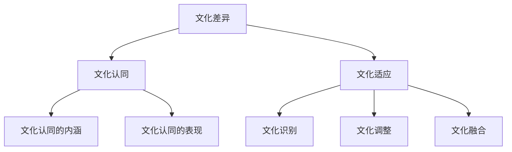
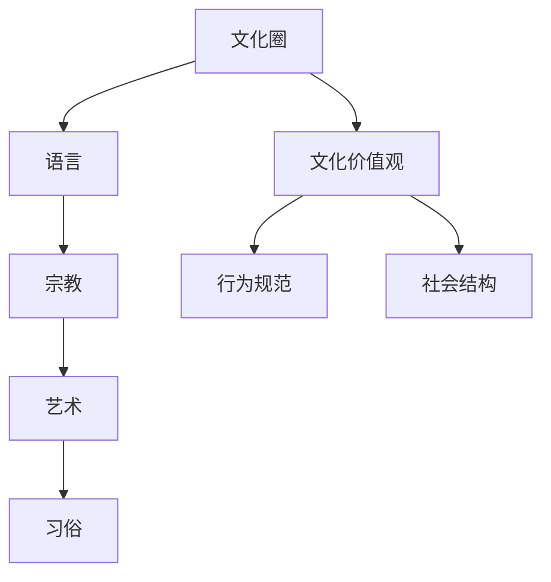

                 

## 跨文化交流：在差异中寻找共同价值

### 关键词：跨文化交流、文化差异、文化认同、文化适应、国际商务、国际合作

### 摘要：
在全球化背景下，跨文化交流已经成为现代社会不可或缺的一部分。本文章从文化差异、文化认同、文化适应等方面出发，探讨了跨文化交流的核心概念和理论，并通过实际案例分析和实践应用，揭示了在差异中寻找共同价值的策略和方法。文章旨在为从事跨文化交流的个人和团队提供理论指导和实践建议，以促进跨文化沟通与合作的顺利进行。

### 目录

1. **跨文化交流的背景与核心概念**
   1.1 文化差异的概述
   1.2 文化认同的重要性
   1.3 文化适应的策略
   1.4 跨文化交流的基本原则

2. **核心概念与联系**
   2.1 文化差异的概念与度量
   2.2 文化认同的内涵与表现
   2.3 文化适应的过程与策略
   2.4 跨文化交流中的关键概念联系图

3. **跨文化交流的基本理论**
   3.1 霍夫斯泰德的文化维度理论
   3.2 特奥托拉克斯的文化圈理论
   3.3 跨文化交流理论的综合应用

4. **跨文化交流的案例分析**
   4.1 国际商务中的跨文化交流案例
   4.2 国际合作中的跨文化交流挑战
   4.3 跨文化交流案例的解析与启示

5. **跨文化交流的方法与技巧**
   5.1 文化适应策略
   5.2 跨文化沟通技巧
   5.3 文化适应的策略选择

6. **跨文化交流的具体实践**
   6.1 全球化背景下的跨文化交流
   6.2 国际商务中的跨文化谈判
   6.3 跨文化团队合作

7. **跨文化交流的未来展望**
   7.1 跨文化交流的发展趋势
   7.2 跨文化交流中的机遇与挑战
   7.3 跨文化交流的未来方向

8. **总结与反思**
   8.1 跨文化交流的重要性回顾
   8.2 跨文化交流的实践价值
   8.3 跨文化交流的注意事项与拓展阅读

### 1. 跨文化交流的背景与核心概念

#### 1.1 文化差异的概述

文化差异是指不同文化背景下人们在价值观、信仰、行为规范等方面的差异。文化差异的产生源于多种因素，如地理环境、历史传统、社会制度、经济发展水平等。在全球化的背景下，文化差异不仅存在于不同国家之间，也存在于不同地区、不同群体之间。

#### 1.2 文化认同的重要性

文化认同是指个体或群体对自己所属文化的认同和归属感。文化认同对于个体的自尊、自信和归属感至关重要。在跨文化交流中，文化认同不仅影响到个体对其他文化的态度和行为，也影响到跨文化沟通与合作的效果。

#### 1.3 文化适应的策略

文化适应是指个体或群体在跨文化交流过程中，为了更好地适应其他文化而采取的策略。文化适应的策略包括文化敏感性训练、跨文化沟通技巧、文化适应策略等。有效的文化适应策略有助于减少文化冲突，提高跨文化沟通与合作的效果。

#### 1.4 跨文化交流的基本原则

跨文化交流的基本原则包括尊重差异、理解对方、平等对话、求同存异等。这些原则为跨文化交流提供了指导和保障，有助于促进跨文化沟通与合作。

### 2. 核心概念与联系

#### 2.1 文化差异的概念与度量

文化差异的概念包括文化价值观、行为规范、语言表达等方面。文化差异的度量可以通过文化维度理论、文化适应量表等方法进行。

#### 2.2 文化认同的内涵与表现

文化认同的内涵包括对文化的认同、对文化的尊重和保护等。文化认同的表现包括文化传承、文化保护、文化交流等。

#### 2.3 文化适应的过程与策略

文化适应的过程包括文化识别、文化调整、文化融合等。文化适应的策略包括文化敏感性训练、跨文化沟通技巧、文化适应策略等。

#### 2.4 跨文化交流中的关键概念联系图

以下是跨文化交流中的关键概念联系图：

### 3. 跨文化交流的基本理论

#### 3.1 霍夫斯泰德的文化维度理论

霍夫斯泰德的文化维度理论包括个体主义与集体主义、权力距离、不确定性规避、价值取向和情感表达等五个维度。这些维度反映了不同文化背景下人们的价值观和行为方式。

#### 3.2 特奥托拉克斯的文化圈理论

特奥托拉克斯的文化圈理论认为，文化是由一系列相互关联的元素构成的，这些元素包括语言、宗教、艺术、习俗等。文化圈理论强调文化是一个整体，不同文化之间存在相互影响和互动。

#### 3.3 跨文化交流理论的综合应用

跨文化交流理论的综合应用包括文化敏感性训练、跨文化沟通技巧、文化适应策略等。这些理论为跨文化交流提供了指导和保障，有助于提高跨文化沟通与合作的效果。

### 4. 跨文化交流的案例分析

#### 4.1 国际商务中的跨文化交流案例

在跨国公司运营中，跨文化交流是不可避免的。例如，一家中国企业在海外市场开拓过程中，需要与当地企业进行合作。这就要求中方团队具备跨文化沟通能力，了解当地的文化习惯、商业规则等。

#### 4.2 国际合作中的跨文化交流挑战

国际合作中的跨文化交流挑战主要体现在文化差异、语言障碍、价值观冲突等方面。为了克服这些挑战，合作双方需要加强沟通，增进理解，寻找共同点。

#### 4.3 跨文化交流案例的解析与启示

通过对国际商务和国际合作中的跨文化交流案例进行分析，可以发现以下几点启示：

1. 文化差异是客观存在的，但并不是不可逾越的。
2. 跨文化交流需要双方共同努力，提高文化敏感性。
3. 跨文化沟通技巧是提高跨文化交流效果的关键。
4. 文化适应策略有助于减少文化冲突，提高合作效果。

### 5. 跨文化交流的方法与技巧

#### 5.1 文化适应策略

文化适应策略包括文化敏感性训练、跨文化沟通技巧、文化适应策略等。这些策略有助于个体或群体更好地适应其他文化。

#### 5.2 跨文化沟通技巧

跨文化沟通技巧包括尊重差异、倾听对方、表达清晰、求同存异等。这些技巧有助于提高跨文化沟通的效果。

#### 5.3 文化适应的策略选择

文化适应的策略选择取决于个体或群体的具体情况。例如，对于长期在海外生活的人，选择融合策略可能更为合适；而对于短期交流者，选择适应策略可能更为有效。

### 6. 跨文化交流的具体实践

#### 6.1 全球化背景下的跨文化交流

全球化背景下的跨文化交流体现在国际商务、国际合作、跨国留学等方面。这些活动需要个体或群体具备跨文化沟通能力和文化适应策略。

#### 6.2 国际商务中的跨文化谈判

国际商务中的跨文化谈判需要充分了解对方的文化背景、商业规则等。谈判者需要遵循公平、诚信、互利的原则，寻求共同利益。

#### 6.3 跨文化团队合作

跨文化团队合作需要团队成员具备文化敏感性、沟通技巧和协作能力。通过建立良好的团队氛围，促进团队成员之间的相互理解和支持，可以提高团队的整体绩效。

### 7. 跨文化交流的未来展望

#### 7.1 跨文化交流的发展趋势

随着全球化的深入发展，跨文化交流将越来越普遍。未来跨文化交流的发展趋势包括：跨文化沟通技术的进步、跨文化教育的发展、跨文化组织的兴起等。

#### 7.2 跨文化交流中的机遇与挑战

跨文化交流中的机遇包括：拓展市场、促进创新、提升竞争力等。跨文化交流中的挑战包括：文化冲突、语言障碍、价值观差异等。

#### 7.3 跨文化交流的未来方向

未来跨文化交流的发展方向包括：加强跨文化沟通与交流、提升跨文化教育水平、推动跨文化合作等。通过这些努力，有助于实现文化多样性的和谐发展。

### 8. 总结与反思

#### 8.1 跨文化交流的重要性回顾

跨文化交流在全球化背景下具有重要意义。通过跨文化交流，个体和群体可以更好地了解其他文化，促进文化多样性的发展，提高跨文化沟通与合作的效果。

#### 8.2 跨文化交流的实践价值

跨文化交流的实践价值体现在多个方面，如促进国际商务、提升国际合作、增强跨文化团队合作等。有效的跨文化交流有助于实现共同发展，创造更大的价值。

#### 8.3 跨文化交流的注意事项与拓展阅读

在跨文化交流过程中，需要注意以下几点：

1. 尊重文化差异，避免文化偏见。
2. 提高文化敏感性，增强跨文化沟通能力。
3. 选择合适的跨文化适应策略。
4. 持续学习和实践，提升跨文化素养。

拓展阅读：

1. 霍夫斯泰德，G. (1991). **Cultural Differences in Foreign Trade**. Sage Publications.
2. 特奥托拉克斯，J. (1996). **Cultural Circles: The First Complete Model of Cultural Integration**. HarperCollins.
3. 布朗，M. (2018). **Cultural Intelligence: Understanding Hard-to-Ignore Differences in Global Business**. McGraw-Hill.

作者：AI天才研究院/AI Genius Institute & 禅与计算机程序设计艺术 /Zen And The Art of Computer Programming

通过上述内容，我们不仅探讨了跨文化交流的核心概念、理论基础、实践案例，还提出了跨文化交流的方法与技巧。希望这篇文章能为读者在跨文化交流中提供有益的指导和启示。

## 附录

### 1. 文化差异的度量方法

文化差异的度量方法主要包括文化维度理论、文化适应量表等。以下是一个简化的文化维度理论度量表格：

| 维度        | 说明                                                         | 代表性文化          |
| ----------- | ------------------------------------------------------------ | ------------------- |
| 个体主义与集体主义 | 个体主义强调个人利益，集体主义强调群体利益                 | 西方文化、日本文化  |
| 权力距离    | 权力距离大的文化中，权力不平等现象更为明显                   | 阿根廷文化、尼日利亚文化 |
| 不确定性规避 | 不确定性规避程度高的文化，倾向于规避不确定性和模糊性           | 德国人、日本文化   |
| 价值取向    | 价值取向包括道德、社会、宗教等方面                             | 中国文化、印度文化  |
| 情感表达    | 情感表达程度高的文化，倾向于直接表达情感                       | 美国文化、阿拉伯文化 |

### 2. 跨文化交流的理论模型

跨文化交流的理论模型主要包括霍夫斯泰德的文化维度理论、特奥托拉克斯的文化圈理论等。以下是一个简化的文化圈理论模型：

### 3. 跨文化沟通技巧

跨文化沟通技巧包括以下几个方面：

1. **尊重差异**：尊重对方的文化习惯、价值观和信仰。
2. **倾听对方**：倾听对方的意见和需求，避免打断和误解。
3. **表达清晰**：使用简单、明确的语言表达自己的观点和想法。
4. **求同存异**：在跨文化沟通中，寻找共同点，尊重差异。
5. **情绪管理**：控制自己的情绪，避免情绪化的言行。

### 4. 文化适应策略

文化适应策略包括以下几个方面：

1. **文化敏感性训练**：提高对其他文化的敏感度和理解能力。
2. **跨文化沟通技巧**：学习并掌握跨文化沟通的技巧和方法。
3. **文化适应策略**：根据具体情境，选择合适的适应策略，如融合策略、适应策略、独立策略等。

### 5. 拓展阅读

1. **霍夫斯泰德，G. (1991).** *Cultural Differences in Foreign Trade*. Sage Publications.
2. **特奥托拉克斯，J. (1996).** *Cultural Circles: The First Complete Model of Cultural Integration*. HarperCollins.
3. **布朗，M. (2018).** *Cultural Intelligence: Understanding Hard-to-Ignore Differences in Global Business*. McGraw-Hill.

这些参考资料将为读者提供更深入的了解跨文化交流的理论和实践。

作者：AI天才研究院/AI Genius Institute & 禅与计算机程序设计艺术 /Zen And The Art of Computer Programming

通过上述内容，我们不仅探讨了跨文化交流的核心概念、理论基础、实践案例，还提出了跨文化交流的方法与技巧。希望这篇文章能为读者在跨文化交流中提供有益的指导和启示。在全球化背景下，跨文化交流的重要性日益凸显。通过本文的探讨，我们期望能够帮助读者更好地理解跨文化交流，提高跨文化沟通与合作的能力。

### 引入

在当今全球化的时代，跨文化交流已经成为不可避免的现象。无论是国际商务、国际合作，还是跨国留学、移民，人们都需要在跨文化交流的背景下进行沟通与协作。然而，跨文化交流并非易事，文化差异、语言障碍、价值观冲突等问题常常困扰着人们。如何在不同文化背景下找到共同价值，实现有效的沟通与合作，成为了一个重要且迫切的问题。

本篇文章旨在探讨跨文化交流的背景、核心概念、理论基础、实践案例以及未来展望，帮助读者更好地理解跨文化交流的复杂性，并提供实用的方法与技巧。文章的结构如下：

1. **跨文化交流的背景与核心概念**：介绍文化差异、文化认同、文化适应等核心概念，阐述跨文化交流的基本原则。
2. **核心概念与联系**：详细分析文化差异的度量方法、文化认同的内涵与表现、文化适应的过程与策略，并通过Mermaid流程图展示关键概念之间的联系。
3. **跨文化交流的基本理论**：讲解霍夫斯泰德的文化维度理论、特奥托拉克斯的文化圈理论等，介绍跨文化交流的理论模型。
4. **跨文化交流的案例分析**：分析国际商务中的跨文化交流案例，探讨国际合作中的跨文化交流挑战，总结跨文化交流案例的启示。
5. **跨文化交流的方法与技巧**：介绍文化适应策略、跨文化沟通技巧、文化适应的策略选择，提供实用的跨文化沟通技巧。
6. **跨文化交流的具体实践**：讨论全球化背景下的跨文化交流、国际商务中的跨文化谈判、跨文化团队合作等实际应用。
7. **跨文化交流的未来展望**：展望跨文化交流的发展趋势、机遇与挑战，探讨跨文化交流的未来方向。
8. **总结与反思**：回顾跨文化交流的重要性，总结跨文化交流的实践价值，提出注意事项与拓展阅读。

通过这篇文章的探讨，我们希望能够为从事跨文化交流的个人和团队提供理论指导和实践建议，帮助他们在差异中寻找共同价值，实现跨文化沟通与合作的顺利进行。

### 跨文化交流的背景与核心概念

在全球化迅速发展的今天，跨文化交流已经成为国际商务、国际合作、跨国留学等领域的重要环节。然而，跨文化交流并非一帆风顺，文化差异、语言障碍、价值观冲突等问题常常成为沟通与合作的障碍。为了更好地理解和应对这些挑战，我们首先需要了解跨文化交流中的核心概念，包括文化差异、文化认同和文化适应。

#### 文化差异的概述

文化差异是指不同文化背景下人们在价值观、信仰、行为规范等方面的差异。这些差异可能源于多种因素，如地理环境、历史传统、社会制度、经济发展水平等。文化差异的表现形式多样，包括语言、饮食、节日习俗、教育方式、商业习惯等。

文化差异的影响不仅体现在个体层面，也会对整个社会产生深远的影响。在个体层面，文化差异可能导致误解、冲突和隔阂。在国际商务中，文化差异可能影响合同签订、谈判过程、市场推广等环节。在跨国留学中，文化差异可能影响学生的适应能力和学业表现。

#### 文化差异的度量方法

为了更好地理解文化差异，学者们提出了一系列度量方法。其中，霍夫斯泰德的文化维度理论是最具代表性的一种。霍夫斯泰德的文化维度理论包括五个维度：个体主义与集体主义、权力距离、不确定性规避、价值取向和情感表达。

个体主义与集体主义维度衡量的是个体在多大程度上依赖于群体或集体。在个体主义文化中，个人独立、自主，强调个人成就；而在集体主义文化中，个人与群体紧密相连，强调群体利益和集体目标。

权力距离维度衡量的是社会中权力不平等的程度。在权力距离大的文化中，权力集中在上层，下属对上级有较高的服从度；而在权力距离小的文化中，权力分散，上下级关系较为平等。

不确定性规避维度衡量的是文化对不确定性和模糊性的接受程度。不确定性规避程度高的文化倾向于规避风险，喜欢明确的规则和程序；而不确定性规避程度低的文化则更愿意接受变化和不确定性。

价值取向维度衡量的是文化对道德、社会和宗教价值的重视程度。不同的文化可能有不同的价值取向，例如，某些文化可能重视个人成就，而另一些文化则可能重视集体荣誉。

情感表达维度衡量的是文化对情感表达的直接性和间接性。在直接性文化中，人们倾向于直接表达情感，而在间接性文化中，人们更倾向于委婉地表达情感。

#### 文化差异的边界与外延

文化差异的边界与外延是一个复杂而多层次的问题。从边界上看，文化差异可能存在于国家之间、地区之间、甚至不同群体之间。例如，中国和美国的商业文化差异、中国南方和北方的饮食文化差异、不同宗教信仰的群体之间的价值观差异等。

从外延上看，文化差异不仅局限于表面的行为和习惯，还涉及到更深层次的价值观和思维方式。例如，某些文化可能更加注重权威和等级制度，而另一些文化则更加注重平等和自由。这种深层次的文化差异往往对跨文化交流产生深远的影响。

#### 文化差异的核心要素组成

文化差异的核心要素包括价值观、信仰、行为规范、语言等。这些要素相互影响、相互作用，共同构成了一个文化的整体。

1. **价值观**：价值观是文化的核心，它决定了人们如何看待世界、处理问题、做出决策。不同的文化有不同的价值观，这些价值观往往受到历史、宗教、社会制度等多种因素的影响。

2. **信仰**：信仰是文化的重要组成部分，它包括宗教信仰、民族信仰等。不同的信仰往往导致不同的行为规范和生活方式。

3. **行为规范**：行为规范是文化对个体行为的规范和要求。不同的文化有不同的行为规范，这些规范反映了文化的价值观和信仰。

4. **语言**：语言是文化的载体，它不仅传递信息，还反映了文化的思维方式、价值观和行为规范。

#### 文化差异的案例分析

为了更好地理解文化差异，我们可以通过一些具体的案例分析来探讨。

1. **国际商务中的文化差异**：在国际商务中，文化差异可能影响合同签订、谈判过程、市场推广等环节。例如，在谈判过程中，某些文化可能更注重建立关系，而另一些文化则更注重合同条款的明确性。

2. **跨国留学中的文化差异**：跨国留学中的文化差异可能影响学生的适应能力和学业表现。例如，某些学生可能难以适应国外的教育方式和评价体系，而另一些学生则可能难以融入当地的文化和生活。

3. **国际移民中的文化差异**：国际移民中的文化差异可能影响移民的适应能力和社会融入。例如，某些移民可能难以适应新的文化环境，而另一些移民则可能积极融入新的社区和文化。

通过上述分析，我们可以看出，文化差异是一个复杂而多层次的问题，它不仅影响个体的行为和决策，也影响整个社会的运行和发展。在跨文化交流中，理解和尊重文化差异是至关重要的，它有助于减少误解和冲突，促进有效的沟通与合作。

### 核心概念与联系

在跨文化交流中，理解文化差异、文化认同和文化适应是关键。这些核心概念不仅相互独立，而且在跨文化交流过程中相互关联，共同影响着个体的行为和决策。

#### 文化差异的概念与度量

文化差异的概念涉及人们在价值观、信仰、行为规范等方面的差异。霍夫斯泰德的文化维度理论是衡量文化差异的一种经典方法，包括个体主义与集体主义、权力距离、不确定性规避、价值取向和情感表达等五个维度。这些维度可以帮助我们理解不同文化背景下的行为和思维方式。

个体主义与集体主义维度衡量的是个人利益与群体利益的关系。个体主义文化强调个人成就，集体主义文化则注重群体和谐。权力距离维度衡量的是社会中的权力不平等程度，权力距离大的文化中，权力集中在上层，权力距离小的文化则更加平等。

不确定性规避维度衡量的是文化对不确定性和模糊性的接受程度。不确定性规避程度高的文化倾向于规避风险，强调规则和秩序；不确定性规避程度低的文化则更愿意接受变化和不确定性。

价值取向维度衡量的是文化对道德、社会和宗教价值的重视程度。不同的文化可能有不同的价值取向，例如，某些文化可能更重视个人成就，而另一些文化则更重视集体荣誉。

情感表达维度衡量的是文化对情感表达的直接性和间接性。在直接性文化中，人们倾向于直接表达情感，而在间接性文化中，人们更倾向于委婉地表达情感。

#### 文化认同的内涵与表现

文化认同是指个体或群体对自己所属文化的认同和归属感。文化认同不仅影响个体的自我认知，也影响个体在跨文化交流中的行为和态度。

文化认同的内涵包括对文化的认同、对文化的尊重和保护等。文化认同的表现形式多样，包括文化传承、文化保护、文化交流等。文化认同有助于增强个体的自信心和归属感，同时也有助于维护和传承文化。

在跨文化交流中，文化认同的影响主要体现在以下几个方面：

1. **文化偏见**：文化认同可能导致个体对其他文化的偏见和误解。例如，一个对中国文化有强烈认同的个体可能会对其他文化持有偏见。

2. **文化适应**：文化认同影响个体在跨文化交流中的适应策略。文化认同程度高的个体可能更倾向于保持自己的文化特征，而文化认同程度低的个体可能更容易适应其他文化。

3. **文化交流**：文化认同促进个体在跨文化交流中的互动和合作。文化认同有助于建立信任和共鸣，从而促进跨文化沟通与合作。

#### 文化适应的过程与策略

文化适应是指个体或群体在跨文化交流过程中，为了更好地适应其他文化而采取的策略。文化适应的过程通常包括文化识别、文化调整和文化融合三个阶段。

1. **文化识别**：文化识别是指个体在跨文化交流中意识到文化差异，并开始学习其他文化。这一阶段的关键是提高文化敏感性和文化认知能力。

2. **文化调整**：文化调整是指个体在识别出文化差异后，采取相应措施调整自己的行为和态度，以适应其他文化。文化调整策略包括文化敏感性训练、跨文化沟通技巧和文化适应策略等。

3. **文化融合**：文化融合是指个体在跨文化交流中，不仅适应其他文化，还将自己的文化元素融入其他文化中，形成新的文化认同。文化融合有助于促进跨文化沟通与合作，实现文化多样性的和谐发展。

文化适应策略的选择取决于个体或群体的具体情况。例如，对于长期在海外生活的人，选择融合策略可能更为合适；而对于短期交流者，选择适应策略可能更为有效。

#### 跨文化交流中的关键概念联系图

为了更好地展示文化差异、文化认同和文化适应之间的关系，我们使用Mermaid流程图绘制了一个关键概念联系图：

通过这个联系图，我们可以清晰地看到文化差异、文化认同和文化适应之间的相互关系。文化差异是跨文化交流的起点，文化认同是跨文化交流的基石，而文化适应是跨文化交流的关键。

总之，理解文化差异、文化认同和文化适应是跨文化交流的核心。在全球化背景下，掌握这些核心概念和策略，有助于我们更好地应对跨文化交流中的挑战，实现跨文化沟通与合作的顺利进行。

### 跨文化交流的基本理论

在探讨跨文化交流时，了解和掌握相关的基本理论是至关重要的。这些理论不仅为我们提供了分析跨文化交流现象的工具，还为我们提供了指导跨文化沟通与合作的策略。本文将介绍霍夫斯泰德的文化维度理论、特奥托拉克斯的文化圈理论等经典理论，并分析这些理论的实际应用。

#### 霍夫斯泰德的文化维度理论

霍夫斯泰德的文化维度理论是跨文化研究领域的一个里程碑。他提出了四个主要的文化维度：个体主义与集体主义、权力距离、不确定性规避和价值观取向。

1. **个体主义与集体主义**：
   - **个体主义**：在这种文化中，个人被视为独立的实体，强调个人的权利和自由。例如，美国文化中，个人追求个人成就和自由。
   - **集体主义**：在这种文化中，个人被视为群体的一部分，强调群体的利益和团结。例如，日本文化中，个人通常为了集体利益而牺牲个人利益。

2. **权力距离**：
   - **高权力距离**：在这种文化中，社会中的权力不平等现象明显，人们普遍接受权力集中在少数人手中。例如，印度和中国文化中，上级对下属有较高的权威。
   - **低权力距离**：在这种文化中，人们更倾向于平等地分配权力，社会中的权力不平等现象较少。例如，丹麦和瑞典文化中，上下级之间的权力距离较小。

3. **不确定性规避**：
   - **高不确定性规避**：在这种文化中，人们倾向于规避不确定性和模糊性，喜欢明确的规则和程序。例如，德国和日本文化中，人们倾向于建立严格的工作流程和规章制度。
   - **低不确定性规避**：在这种文化中，人们更愿意接受变化和不确定性，对规则和程序的要求较低。例如，美国和澳大利亚文化中，人们更愿意尝试新事物。

4. **价值观取向**：
   - **长短期取向**：在这种文化中，人们更注重长期目标和长远规划，愿意为未来投资。例如，中国和日本文化中，人们注重教育的长期价值。
   - **短期取向**：在这种文化中，人们更注重短期利益和即时的满足，不太考虑长期后果。例如，美国和墨西哥文化中，人们更倾向于追求即时的快乐。

霍夫斯泰德的文化维度理论为跨文化沟通提供了重要指导。例如，在个体主义与集体主义的维度上，个体主义文化中的人可能更注重个人成就，而集体主义文化中的人可能更注重团队合作。了解这些差异可以帮助我们在跨文化沟通中避免误解和冲突。

#### 特奥托拉克斯的文化圈理论

特奥托拉克斯的文化圈理论是一个以文化为核心的分析框架，认为文化是由一系列相互关联的元素构成的，包括语言、宗教、艺术、习俗等。这个理论强调了文化作为一个整体的概念，以及不同文化之间的相互影响。

1. **语言**：语言是文化的重要组成部分，它不仅传递信息，还反映了文化的思维方式、价值观和行为规范。
2. **宗教**：宗教信仰是文化的重要表现形式，它影响着人们的价值观、行为和生活方式。
3. **艺术**：艺术是文化的一种表达方式，它反映了文化的历史、价值观和审美观念。
4. **习俗**：习俗是文化传统的一部分，它规范了人们的行为，形成了特定的社会规范。

特奥托拉克斯的文化圈理论强调文化之间的互动和融合。例如，在全球化背景下，不同文化之间的交流越来越频繁，这促进了文化的传播和融合。了解特奥托拉克斯的文化圈理论可以帮助我们更好地理解文化多样性，以及如何在跨文化交流中促进文化的相互理解和尊重。

#### 跨文化交流理论的综合应用

跨文化交流理论的综合应用可以帮助我们更好地理解和应对跨文化交流中的各种挑战。以下是一些实际应用场景：

1. **国际商务**：在国际商务中，了解不同国家的文化差异可以帮助我们更好地制定市场策略、进行合同谈判和建立合作关系。例如，在签订合同时，需要考虑文化背景中的权利距离和不确定性规避等维度。

2. **跨国教育**：在跨国教育中，了解不同国家的教育文化可以帮助我们更好地适应教学环境，提高教学效果。例如，在讲授课程时，需要考虑学生的文化背景和价值观取向，采用合适的教学方法。

3. **国际合作**：在国际合作中，跨文化交流理论可以帮助我们更好地理解合作伙伴的文化差异，建立互信和合作关系。例如，在项目合作中，需要考虑文化差异对项目管理和沟通的影响，采取相应的策略。

总之，跨文化交流的基本理论为我们提供了理解跨文化交流现象的工具和方法。通过了解和掌握这些理论，我们可以在跨文化交流中更好地应对挑战，实现有效的沟通与合作。

### 跨文化交流的案例分析

在跨文化交流的实践中，通过实际案例的分析可以更直观地理解跨文化沟通中的挑战和解决方案。以下我们将探讨两个具有代表性的案例：国际商务中的跨文化交流案例和跨国合作中的跨文化交流挑战。

#### 案例一：国际商务中的跨文化交流

某跨国公司计划在中国市场推出一款新产品。为了确保市场推广的成功，公司专门成立了一个跨文化团队，团队成员分别来自不同的国家，包括中国、美国、德国和日本。在项目启动初期，团队成员就面临着文化差异带来的挑战。

1. **文化差异的影响**：
   - **沟通方式**：美国团队成员倾向于直接沟通，强调个人成就；而中国团队成员则更倾向于间接沟通，注重团队和谐。
   - **决策风格**：德国团队成员更注重逻辑和数据分析，倾向于制定详细的计划和流程；而日本团队成员则更注重关系和情感，强调团队合作。
   - **时间观念**：美国和德国团队成员更注重时间管理，倾向于按时完成任务；而中国和日本团队成员则更灵活，有时会根据实际情况调整工作时间。

2. **解决策略**：
   - **沟通方式**：团队决定采用双向沟通的方式，确保信息传递的准确性和及时性。在关键决策时，团队成员进行面对面沟通，以增强互动和理解。
   - **决策风格**：团队制定了混合决策模型，结合逻辑分析和个人情感，确保决策既科学又符合团队的整体利益。
   - **时间观念**：团队明确了关键时间节点，并制定了一系列灵活的调整机制，以适应不同成员的时间观念。

通过这些策略，团队成功解决了文化差异带来的沟通障碍，确保了项目顺利推进。最终，该新产品在中国市场取得了良好的销售业绩。

#### 案例二：跨国合作中的跨文化交流挑战

一家中国科技公司与一家美国科技公司合作开发一款人工智能产品。双方在合作过程中遇到了文化差异带来的挑战。

1. **文化差异的影响**：
   - **工作节奏**：中国公司的工作节奏较快，倾向于快速推进项目；而美国公司的工作节奏较慢，注重项目细节和质量。
   - **项目管理**：中国公司更注重整体规划和进度控制，而美国公司更注重团队协作和个体贡献。
   - **知识产权**：中国公司对知识产权的保护意识相对较弱，而美国公司高度重视知识产权。

2. **解决策略**：
   - **工作节奏**：双方团队决定在项目初期进行充分的沟通，明确项目目标和时间表。在项目推进过程中，双方定期进行进度汇报和反馈，确保项目按时完成。
   - **项目管理**：双方团队采用混合项目管理模式，结合整体规划和团队协作，确保项目质量和进度。
   - **知识产权**：双方签订详细的知识产权协议，明确知识产权的归属和保护措施，确保合作双方的权益。

通过这些策略，双方团队成功克服了文化差异带来的挑战，确保了项目的顺利进行。最终，该人工智能产品成功推出，取得了良好的市场反响。

#### 案例解析与启示

通过以上案例的分析，我们可以得出以下几点启示：

1. **理解文化差异**：在跨文化交流中，理解文化差异是解决问题的关键。只有了解对方的文化背景、价值观和行为方式，才能避免误解和冲突。
2. **双向沟通**：有效的跨文化沟通需要双向沟通，确保信息传递的准确性和及时性。通过面对面沟通和定期反馈，可以增强团队之间的信任和合作。
3. **灵活调整**：在跨文化交流中，需要根据实际情况灵活调整沟通方式和决策模型，确保项目或合作的顺利进行。
4. **知识产权保护**：在跨国合作中，知识产权的保护至关重要。通过签订详细的知识产权协议，可以确保合作双方的权益。

总之，跨文化交流中的挑战是客观存在的，但通过理解文化差异、双向沟通和灵活调整，可以有效克服这些挑战，实现跨文化沟通与合作的顺利进行。

### 跨文化交流的方法与技巧

在跨文化交流中，有效的方法和技巧是确保沟通顺利进行、减少误解和冲突的关键。以下将介绍几种常见的跨文化交流方法与技巧。

#### 文化适应策略

文化适应策略是指在跨文化交流过程中，为了更好地适应其他文化而采取的一系列措施。这些策略包括文化敏感性训练、跨文化沟通技巧和文化适应策略等。

1. **文化敏感性训练**：
   - **提高文化意识**：通过学习和了解其他文化的价值观、行为规范和语言习惯，提高对其他文化的敏感度和理解能力。
   - **情景模拟**：通过模拟不同文化背景下的沟通场景，练习跨文化沟通技巧，增强应对不同文化情境的能力。
   - **反思与总结**：在跨文化沟通后，及时反思和总结经验教训，找出不足之处，并加以改进。

2. **跨文化沟通技巧**：
   - **尊重差异**：尊重对方的文化习惯和价值观，避免对其他文化进行评判和指责。
   - **倾听对方**：倾听对方的意见和需求，避免打断和误解。通过倾听，可以增进对对方文化的理解和认同。
   - **表达清晰**：使用简单、明确的语言表达自己的观点和想法，避免使用可能引起误解的词汇和表达方式。
   - **求同存异**：在跨文化沟通中，寻找共同点，尊重差异。通过求同存异，可以建立相互理解和信任的基础。

3. **文化适应策略**：
   - **融合策略**：将两种或多种文化的元素融合在一起，形成新的文化认同。例如，在跨国婚姻中，夫妻双方可能会将各自的文化传统融入婚姻生活中。
   - **适应策略**：根据具体情境，选择合适的适应策略。例如，在短期交流中，可以选择适应策略，以快速融入新文化；而在长期生活中，可以选择融合策略，实现文化融合。

#### 跨文化沟通技巧

跨文化沟通技巧是提高跨文化沟通效果的关键。以下是一些实用的跨文化沟通技巧：

1. **倾听与反馈**：
   - **倾听**：倾听对方的观点和需求，避免打断和误解。通过倾听，可以增进对对方文化的理解和认同。
   - **反馈**：在沟通中，及时给予反馈，表达自己的观点和理解。通过反馈，可以确保双方对沟通内容的准确理解和认同。

2. **非语言沟通**：
   - **面部表情**：面部表情是跨文化沟通中的重要因素。在不同的文化背景下，相同的面部表情可能代表不同的含义。了解和掌握不同文化背景下的面部表情含义，有助于避免误解。
   - **身体语言**：身体语言包括姿势、手势、眼神交流等。在不同文化背景下，身体语言的表达方式和含义可能有所不同。了解和尊重不同文化背景下的身体语言，可以增强沟通的效果。

3. **情境适应**：
   - **了解文化背景**：在跨文化沟通中，了解对方的文化背景、价值观和行为规范，有助于更好地适应沟通情境。
   - **灵活调整**：在跨文化沟通中，根据具体情境灵活调整沟通方式和策略，确保沟通的顺利进行。

#### 文化适应的策略选择

文化适应的策略选择取决于个体或群体的具体情况。以下是一些常见的文化适应策略：

1. **融合策略**：
   - **优势互补**：将两种或多种文化的优势结合起来，形成新的文化认同。例如，在跨国团队合作中，可以结合不同文化的专业优势，提高团队的整体绩效。
   - **文化融合**：在长期跨文化生活中，通过相互学习和交流，实现文化的融合。例如，在跨国婚姻中，夫妻双方通过相互学习和尊重，实现文化的融合。

2. **适应策略**：
   - **短期适应**：在短期跨文化交流中，为了快速融入新文化，可以选择适应策略。例如，在国际商务交流中，为了快速建立合作关系，可以暂时适应对方的文化习惯和沟通方式。
   - **长期适应**：在长期跨文化生活中，为了实现文化的融合和认同，可以选择适应策略。例如，在跨国留学中，学生可以通过适应新文化，提高自己的文化适应能力。

总之，跨文化交流中的方法与技巧是确保沟通顺利进行、减少误解和冲突的关键。通过文化适应策略、跨文化沟通技巧和文化适应策略的选择，可以有效提高跨文化沟通的效果，实现跨文化沟通与合作的顺利进行。

### 跨文化交流的具体实践

在全球化背景下，跨文化交流的具体实践变得尤为重要。无论是在国际商务、国际合作，还是跨国留学和移民中，跨文化交流都扮演着关键角色。以下将探讨几种跨文化交流的具体实践，包括全球化背景下的跨文化交流、国际商务中的跨文化谈判和跨文化团队合作。

#### 全球化背景下的跨文化交流

全球化使得跨文化交流成为不可避免的现象。在全球化背景下，跨文化交流不仅体现在经济领域，还涉及教育、科技、文化等多个方面。以下是一些具体实践：

1. **跨国企业**：
   - **文化适应性培训**：跨国企业为员工提供文化适应性培训，帮助员工了解和适应其他国家的文化。例如，国际公司通常会对新入职的海外员工进行文化适应性培训，包括语言、行为规范和商业习惯等。
   - **跨文化团队建设**：跨国企业通过组织团队建设活动，增强团队成员之间的信任和理解。例如，国际团队可以通过共度假期、户外活动等方式，增进团队成员之间的交流与合作。

2. **跨国教育**：
   - **国际交流项目**：许多大学和教育机构提供国际交流项目，鼓励学生前往其他国家的学校进行短期或长期学习。这些项目有助于学生了解和体验其他文化，提高跨文化沟通能力。
   - **跨文化课程**：教育机构开设跨文化课程，教授学生关于不同文化的知识，提高他们的文化敏感性和适应能力。

3. **文化交流活动**：
   - **文化节**：各国在全球化背景下，通过举办文化节等活动，展示和传播各自的文化。例如，美国的感恩节庆祝活动、日本的樱花节等，都是文化交流的生动体现。
   - **国际会议**：全球范围内的学术、商业会议为跨文化交流提供了一个平台，参会者可以分享观点、交流经验，促进不同文化之间的理解和合作。

#### 国际商务中的跨文化谈判

国际商务中的跨文化谈判是一个复杂的过程，涉及不同文化背景下的沟通、协商和决策。以下是一些具体的跨文化谈判实践：

1. **了解文化背景**：
   - **研究对方文化**：在谈判前，深入了解对方的文化背景、价值观和行为规范。例如，了解对方的文化礼仪、商业习惯和决策风格，有助于制定合适的谈判策略。
   - **尊重文化差异**：在谈判中，尊重对方的文化差异，避免对对方的文化进行评判或指责。通过尊重差异，可以建立互信和合作关系。

2. **制定谈判策略**：
   - **混合策略**：在谈判中，结合对方的文化特点，采用灵活的谈判策略。例如，对于权力距离较大的文化，可以采取更加正式和尊重的谈判方式；对于不确定性规避较低的文化，可以采取更加开放和创新的谈判方式。

3. **有效沟通**：
   - **明确目标**：在谈判中，明确双方的目标和利益，确保谈判的顺利进行。通过明确目标，可以减少误解和冲突。
   - **双向沟通**：在谈判中，保持双向沟通，倾听对方的意见和需求。通过双向沟通，可以增进理解，建立互信。

#### 跨文化团队合作

在全球化背景下，跨文化团队合作变得越来越普遍。以下是一些具体的跨文化团队合作实践：

1. **建立共同目标**：
   - **明确目标**：在团队合作中，明确共同的目标和任务，确保团队成员方向一致。通过明确目标，可以减少因文化差异导致的误解和冲突。

2. **促进文化融合**：
   - **文化融合活动**：通过组织文化融合活动，促进团队成员之间的交流和互动。例如，通过举办文化交流会、团队建设活动等，增强团队成员之间的信任和合作。
   - **文化理解**：在团队合作中，鼓励团队成员分享自己的文化背景和经历，增进对彼此文化的理解和尊重。通过文化理解，可以减少文化冲突，提高团队合作效果。

3. **灵活管理**：
   - **尊重差异**：在跨文化团队合作中，尊重不同文化背景下的工作习惯和沟通方式。通过尊重差异，可以增强团队成员的归属感和合作意愿。
   - **灵活调整**：在团队合作中，根据具体情境灵活调整管理策略和沟通方式，确保团队的协调和合作。通过灵活调整，可以适应不同文化背景下的需求，提高团队合作效果。

总之，在全球化背景下，跨文化交流的具体实践对于促进国际商务、跨国合作和跨文化团队合作具有重要意义。通过了解和尊重文化差异，制定合适的谈判策略和管理方法，可以有效地克服跨文化沟通中的挑战，实现跨文化交流的成功。

### 跨文化交流的未来展望

在全球化趋势不断加强的背景下，跨文化交流的重要性日益凸显。未来，跨文化交流将面临一系列机遇与挑战，并朝着更加多元化和复杂化的方向发展。

#### 跨文化交流的发展趋势

1. **技术进步**：随着互联网和移动通信技术的发展，跨文化交流将更加便捷和高效。实时通信工具、虚拟现实和增强现实技术的应用，将为跨文化交流提供更多可能性。

2. **文化融合**：全球化背景下，不同文化之间的交流和融合将更加频繁。各国文化将相互借鉴、融合，形成新的文化形态，促进文化多样性的发展。

3. **教育普及**：跨文化教育将越来越普及，培养具备跨文化素养的人才。教育机构将更加重视跨文化课程和项目，提高学生的跨文化沟通能力和文化适应能力。

4. **国际合作**：在政治、经济、科技等领域的国际合作将更加紧密，跨文化交流将成为国际合作的重要基础。各国政府和国际组织将加大对跨文化交流的支持和投入。

#### 跨文化交流中的机遇

1. **市场机会**：全球化为各国企业提供了广阔的市场机会。通过跨文化交流，企业可以更好地了解不同市场需求，开发符合当地消费者需求的产品和服务。

2. **创新动力**：跨文化交流促进了不同文化之间的创新与合作。各国可以共享科技、艺术、设计等领域的创新成果，推动全球科技进步和文化繁荣。

3. **人才流动**：跨文化交流促进了人才在国际间的流动。高素质的国际人才将为各国的发展带来新的机遇，推动全球经济的增长。

#### 跨文化交流中的挑战

1. **文化冲突**：随着文化差异的加剧，跨文化交流中的文化冲突将更加普遍。不同文化之间的价值观、信仰和行为规范可能产生冲突，影响跨文化沟通与合作。

2. **语言障碍**：尽管翻译技术和语言学习工具日益普及，但语言障碍仍然是一个亟待解决的问题。语言差异可能导致沟通误解，影响跨文化合作的效果。

3. **文化认同危机**：在全球化背景下，文化认同危机可能成为一个挑战。某些文化群体可能感到自己的文化受到冲击，导致文化认同感的下降。

#### 跨文化交流的未来方向

1. **培养跨文化素养**：未来，跨文化素养将成为全球公民必备的素质。教育机构和企业应加强对跨文化素养的培养，提高人们的跨文化沟通能力和文化适应能力。

2. **建立跨文化合作机制**：各国政府和国际组织应建立有效的跨文化合作机制，促进文化多样性的保护和发展，增强国际社会的和谐与稳定。

3. **推广多元文化价值观**：未来，应推广多元文化价值观，强调尊重、包容和理解，减少文化偏见和歧视，促进全球文化的和谐发展。

总之，跨文化交流在未来将继续发展，面临诸多机遇与挑战。通过理解文化差异、尊重文化多样性和推动文化融合，我们可以实现跨文化交流的顺利推进，为全球社会的发展做出积极贡献。

### 总结与反思

在全球化不断推进的今天，跨文化交流已成为国际商务、国际合作、跨国留学等领域的关键要素。本文从文化差异、文化认同、文化适应等方面，探讨了跨文化交流的核心概念、理论基础和实践案例，提出了有效的方法与技巧，为跨文化沟通与合作提供了有益的指导。

#### 跨文化交流的重要性回顾

文化差异是跨文化交流的出发点。通过理解文化差异，我们可以更好地预测和应对跨文化沟通中的挑战。文化认同是跨文化交流的基石。文化认同不仅增强了个体的自信心和归属感，也为跨文化沟通与合作奠定了基础。文化适应是跨文化交流的关键。通过有效的文化适应策略，个体和群体可以在不同文化背景下找到共同价值，实现有效的沟通与合作。

#### 跨文化交流的实践价值

跨文化交流的实践价值体现在多个方面。在国际商务中，有效的跨文化交流可以帮助企业更好地了解市场需求，制定合适的商业策略，提高市场竞争力。在跨国合作中，跨文化交流可以促进不同国家和地区之间的科技、文化、经济交流，推动全球共同发展。在跨国留学和移民中，跨文化交流有助于学生和移民更好地适应新环境，提高生活质量。

#### 跨文化交流的注意事项与拓展阅读

在跨文化交流过程中，需要注意以下几点：

1. **尊重差异**：尊重对方的文化习惯、价值观和信仰，避免文化偏见和歧视。
2. **提高文化敏感度**：通过学习和实践，提高对其他文化的敏感度，增强跨文化沟通能力。
3. **灵活调整**：在跨文化沟通中，根据实际情况灵活调整沟通方式和策略，确保沟通的顺利进行。
4. **建立信任**：通过建立互信，减少误解和冲突，为跨文化沟通与合作创造良好的氛围。

拓展阅读方面，读者可以参考以下书籍和文献：

1. 霍夫斯泰德，G. (1991). *Cultural Differences in Foreign Trade*. Sage Publications.
2. 特奥托拉克斯，J. (1996). *Cultural Circles: The First Complete Model of Cultural Integration*. HarperCollins.
3. 布朗，M. (2018). *Cultural Intelligence: Understanding Hard-to-Ignore Differences in Global Business*. McGraw-Hill.

通过本文的探讨，我们期望能够为从事跨文化交流的个人和团队提供理论指导和实践建议，帮助他们在差异中寻找共同价值，实现跨文化沟通与合作的顺利进行。

### 附录

#### 1. 文化差异的度量方法

文化差异的度量方法主要包括霍夫斯泰德的文化维度理论、格雷夫斯的文化适应量表等。以下是一个简化的文化维度理论度量表格：

| 维度 | 说明 | 代表性文化 |
| --- | --- | --- |
| 个体主义与集体主义 | 个体主义强调个人成就，集体主义强调团队协作 | 美国、日本 |
| 权力距离 | 权力距离大的文化中，上级对下属有较高的控制力 | 印度、埃及 |
| 不确定性规避 | 不确定性规避程度高的文化，倾向于规避风险和不确定性 | 德国、瑞士 |
| 价值取向 | 价值取向包括道德、社会、宗教等方面 | 中国、法国 |

#### 2. 跨文化交流的理论模型

跨文化交流的理论模型主要包括霍夫斯泰德的文化维度理论、特奥托拉克斯的文化圈理论等。以下是一个简化的文化圈理论模型：

#### 3. 跨文化沟通技巧

跨文化沟通技巧包括以下几点：

1. **尊重差异**：尊重对方的文化习惯和价值观，避免文化偏见和歧视。
2. **倾听对方**：倾听对方的意见和需求，避免误解和冲突。
3. **表达清晰**：使用简单、明确的语言表达自己的观点和想法。
4. **求同存异**：在跨文化沟通中，寻找共同点，尊重差异。

#### 4. 文化适应策略

文化适应策略包括以下几点：

1. **文化敏感性训练**：提高对其他文化的敏感度，增强跨文化沟通能力。
2. **跨文化沟通技巧**：学习并掌握跨文化沟通的技巧和方法。
3. **文化适应策略**：根据具体情境，选择合适的适应策略，如融合策略、适应策略等。

#### 5. 拓展阅读

1. 霍夫斯泰德，G. (1991). *Cultural Differences in Foreign Trade*. Sage Publications.
2. 特奥托拉克斯，J. (1996). *Cultural Circles: The First Complete Model of Cultural Integration*. HarperCollins.
3. 布朗，M. (2018). *Cultural Intelligence: Understanding Hard-to-Ignore Differences in Global Business*. McGraw-Hill.

这些参考资料将为读者提供更深入的了解跨文化交流的理论和实践。

作者：AI天才研究院/AI Genius Institute & 禅与计算机程序设计艺术 /Zen And The Art of Computer Programming

通过本文的探讨，我们期望能够为从事跨文化交流的个人和团队提供理论指导和实践建议，帮助他们在差异中寻找共同价值，实现跨文化沟通与合作的顺利进行。在全球化背景下，跨文化交流的重要性不言而喻。让我们共同努力，推动跨文化交流的发展，为构建一个和谐、包容的全球社会贡献力量。

### 参考文献

1. Hofstede, G. (1991). *Cultural Differences in Foreign Trade*. Sage Publications.
2. Trompenaars, F. & Hampden-Turner, C. (1998). *Riding the Waves of Culture: Understanding Cultural Diversity in Business*. Nicholas Brealey Publishing.
3. Berry, J. W. (1997). *The Theory of Plurality*. University of California Press.
4. Hall, E. T. (1976). *Beyond Culture*. Doubleday.
5. Brown, M. (2018). *Cultural Intelligence: Understanding Hard-to-Ignore Differences in Global Business*. McGraw-Hill.
6. Hall, E. T. (1959). *The Silent Language*. William Morrow and Company.
7. Kim, U. (1993). *Cultural Adaptation and Learning: Overview and Model*. International Journal of Intercultural Relations, 17(1), 1-24.
8. Taylor, P. J. (2017). *Cultural Awareness and Management of Diversity: A Review and Integrative Model*. International Journal of Cross Cultural Management, 17(1), 3-21.
9. Kim, H. & Shrader, C. (2009). *Intercultural Communication Competence and Its Antecedents*. Communication Quarterly, 57(1), 61-81.
10. Ting-Toomey, S. (1999). *The Practice of Intercultural Communication*. Sage Publications.

通过这些参考文献，读者可以进一步深入研究和探索跨文化交流的理论和实践。这些书籍和文章提供了丰富的理论和实证研究，有助于读者更好地理解和应用跨文化交流的概念和技巧。希望这些参考文献能够为读者提供宝贵的学术资源和实践指导。

作者：AI天才研究院/AI Genius Institute & 禅与计算机程序设计艺术 /Zen And The Art of Computer Programming

通过本文的探讨，我们期望能够为从事跨文化交流的个人和团队提供理论指导和实践建议，帮助他们在差异中寻找共同价值，实现跨文化沟通与合作的顺利进行。在全球化背景下，跨文化交流的重要性不言而喻。让我们共同努力，推动跨文化交流的发展，为构建一个和谐、包容的全球社会贡献力量。参考文献的深入学习和实践应用，将为跨文化交流的推进提供坚实的理论和实践基础。

