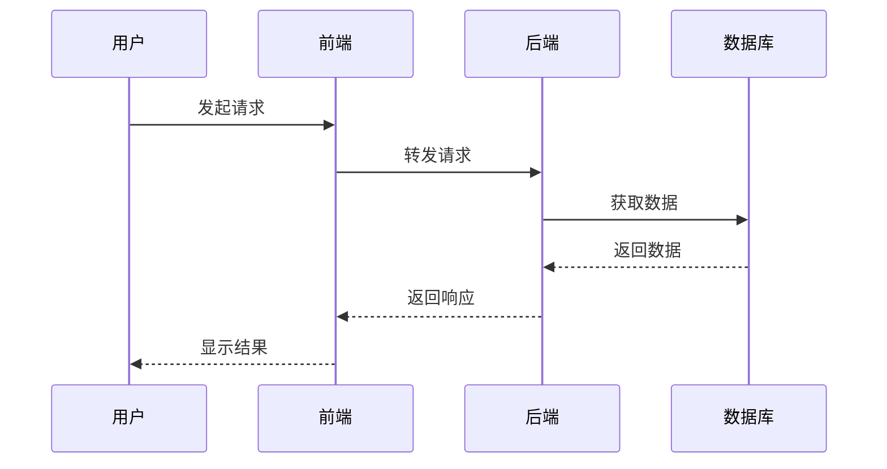

                 

### 关键词

- 跨文化共情
- 社交网络平台
- 全球理解
- 设计原则
- 技术实现
- 开发与实施
- 案例分析

### 摘要

本文深入探讨了跨文化共情平台设计在促进全球理解中的重要性。首先，文章详细介绍了跨文化共情的核心概念和原理，以及其在社交网络平台设计中的关键作用。随后，文章提出了社交网络平台的设计原则，包括用户中心设计、可访问性设计和文化适应性设计。本文还分析了促进全球理解的策略，包括内容多元化、社交互动和社会网络分析。通过技术实现和案例分析，文章展示了跨文化共情平台的设计和开发过程，并提出了最佳实践和未来展望。

### 第一部分：背景介绍

#### 第1章：问题背景与核心概念

**1.1 问题的提出**

在全球化的浪潮中，不同国家和地区的人们之间的交流变得越来越频繁。然而，随之而来的文化差异和误解也成为了一个不可忽视的问题。社交网络平台作为现代沟通的主要工具，其设计和发展在很大程度上影响了全球民众之间的理解和互动。然而，现有的社交网络平台大多基于单一文化视角，缺乏对跨文化共情的支持和促进。这导致了全球民众在社交网络上的互动常常受到文化差异的阻碍，影响了全球理解的发展。

**1.2 核心概念**

- **跨文化共情**：指的是个体在理解、感知和体验他人情感时，能够超越自身的文化背景，进入他人的文化情境，从而产生共鸣和理解。它是促进全球理解的关键因素。
- **社交网络平台**：是一种基于互联网的社交媒体服务，用户可以在其中创建、分享、互动和获取信息。社交网络平台的设计和功能直接影响用户的互动体验和社区氛围。
- **全球理解**：是指全球民众在文化、价值观和生活方式上的共识和认同，它是实现和平与合作的基础。

**1.3 边界与外延**

- **跨文化共情的边界**：涉及到个体的认知、情感和行为的局限，以及文化差异的深层次影响。
- **社交网络平台的外延**：包括平台的功能、用户群体、文化内容等方面，其设计需要考虑不同文化背景的用户需求。
- **全球理解的范围**：从个人层面的文化认同，到国家层面的国际合作，以及全球范围内的文化对话和交流。

**1.4 概念结构与核心要素组成**

- **跨文化共情的结构**：包括感知、理解、共鸣和行动四个层次，每个层次都有其特定的机制和影响因素。
- **社交网络平台的核心要素**：包括用户界面设计、功能模块、数据管理和用户体验等方面，这些要素共同决定了平台的共情能力。
- **全球理解的目标与路径**：目标是构建一个全球化的共情社区，路径包括跨文化教育、文化交流和技术支持。

#### 第2章：跨文化共情的原理与特征

**2.1 跨文化共情的原理**

跨文化共情的原理可以从心理学和社会学两个角度进行探讨。

- **心理学基础**：心理学研究表明，个体的情感体验和认知过程受到文化背景的影响。跨文化共情需要个体超越自我中心，理解和感知他人的情感，从而产生共鸣。
- **社会学视角**：社会学认为，文化是社会互动的产物，个体的行为和价值观受到文化规范的影响。跨文化共情要求个体能够理解和尊重不同的文化规范，从而在互动中实现和谐。

**2.2 跨文化共情的特征**

跨文化共情具有以下几个显著特征：

- **文化敏感性**：个体能够识别和尊重不同的文化差异，避免在互动中造成误解和冲突。
- **情感共鸣**：个体能够体验和理解他人的情感，从而产生情感上的共鸣。
- **交流策略**：个体在跨文化交流中采取适当的交流策略，如使用恰当的语言、姿态和沟通方式，以促进沟通的顺畅。

#### 第3章：社交网络平台的设计原则

**3.1 设计原则概述**

社交网络平台的设计需要遵循以下几个核心原则：

- **用户中心设计**：以用户需求为中心，设计符合用户习惯和需求的平台功能。
- **可访问性设计**：确保平台对各种文化背景的用户都是可访问和友好的。
- **文化适应性设计**：设计能够适应不同文化背景的用户需求，提供多元化的内容和服务。

**3.2 核心原则**

- **互动性**：鼓励用户之间的互动和交流，促进跨文化共情的形成。
- **透明性**：确保平台内容的透明性和可追溯性，增强用户的信任和安全感。
- **平等性**：在平台设计和运营中，确保不同文化背景的用户都能平等参与和发声。

### 总结

通过上述章节的介绍，我们可以看到，跨文化共情平台的设计对于促进全球理解具有关键作用。设计原则的遵循和核心要素的落实，将有助于打造一个友好、包容和互动的社交网络平台，从而在全球范围内促进文化的交流和理解。

### 第二部分：核心概念与联系

#### 第4章：跨文化共情的原理与特征

**4.1 跨文化共情的原理**

跨文化共情是基于心理学和社会学理论的。在心理学上，个体在感知和理解他人情感时，会依赖认知过程和文化背景。社会学家则认为，文化规范和价值观对个体的行为和互动有深远影响。跨文化共情的原理包括：

- **情感感知**：个体通过感官和认知过程感知他人的情感状态。
- **文化理解**：个体利用自己的文化背景理解他人的情感和行为。
- **情感共鸣**：个体在理解他人情感的基础上，产生情感上的共鸣。

**4.2 跨文化共情的特征**

跨文化共情具有以下显著特征：

- **文化敏感性**：个体能够识别和尊重不同的文化差异，避免在互动中造成误解和冲突。
- **情感共鸣**：个体能够体验和理解他人的情感，从而产生情感上的共鸣。
- **交流策略**：个体在跨文化交流中采取适当的交流策略，如使用恰当的语言、姿态和沟通方式，以促进沟通的顺畅。

#### 跨文化共情特征对比表格

| 特征               | 定义                                                         | 举例                                                         |
|--------------------|--------------------------------------------------------------|--------------------------------------------------------------|
| 文化敏感性         | 个体能够识别和尊重不同的文化差异，避免误解和冲突               | 在跨文化交流中，注意使用非语言沟通方式，如肢体语言和文化符号。 |
| 情感共鸣           | 个体能够体验和理解他人的情感，从而产生情感上的共鸣             | 在看到他人悲伤时，能够感到同情并表现出同理心。                |
| 交流策略           | 个体在跨文化交流中采取适当的交流策略，以促进沟通的顺畅         | 在跨文化交流中，使用简单的语言和直接的沟通方式。              |

#### 跨文化共情的ER实体关系图架构

```mermaid
erDiagram
  User ||--|{ Emotion }||>
  User ||--|{ Culture }||>
  Emotion ||--|{ Expression }||>
  Culture ||--|{ Value }||>
  
  User {
    id
    name
    culture_id
    emotions
  }
  
  Emotion {
    id
    type
    expression_id
  }
  
  Expression {
    id
    type
    user_id
  }
  
  Culture {
    id
    name
    values
  }
  
  Value {
    id
    type
    culture_id
  }
```

通过上述ER图，我们可以清晰地看到用户、情感、文化和价值观之间的关系。用户通过感知和理解情感，表达自己的文化价值观，从而实现跨文化共情。

### 第三部分：算法原理讲解

#### 第5章：跨文化共情算法原理

**5.1 算法概述**

跨文化共情算法的核心目标是利用自然语言处理（NLP）和机器学习技术，帮助社交网络平台理解和模拟用户的情感状态，从而促进跨文化共情。以下是该算法的基本框架：

- **数据收集与预处理**：收集来自不同文化背景的用户情感数据，并进行预处理，如数据清洗、去重和格式化。
- **情感分析**：使用NLP技术对用户情感进行分类，提取情感关键词和情感极性。
- **文化差异分析**：结合文化特征数据，分析不同文化背景下的情感差异。
- **情感模拟**：根据用户情感和文化特征，生成模拟的情感反应，以促进跨文化共情。

**5.2 算法流程**

下面是跨文化共情算法的具体流程：

1. **数据收集与预处理**：

   ```python
   import pandas as pd
   
   # 收集情感数据
   data = pd.read_csv('emotion_data.csv')
   
   # 数据清洗
   data = data.dropna()
   
   # 数据格式化
   data['text'] = data['text'].apply(lambda x: x.lower())
   ```

2. **情感分析**：

   ```python
   from textblob import TextBlob
   
   # 对文本进行情感分析
   def analyze_sentiment(text):
       analysis = TextBlob(text)
       return analysis.sentiment.polarity
   
   data['sentiment'] = data['text'].apply(analyze_sentiment)
   ```

3. **文化差异分析**：

   ```python
   # 根据文化特征分析情感差异
   def analyze_cultural_sentiment(data):
       cultural_sentiments = {}
       for culture in data['culture'].unique():
           cultural_data = data[data['culture'] == culture]
           cultural_sentiments[culture] = cultural_data['sentiment'].mean()
       return cultural_sentiments
   
   cultural_sentiments = analyze_cultural_sentiment(data)
   ```

4. **情感模拟**：

   ```python
   # 根据文化差异模拟情感反应
   def simulate_emotion(culture, target_sentiment):
       if target_sentiment > 0:
           return "Happy"
       elif target_sentiment < 0:
           return "Sad"
       else:
           return "Neutral"
   
   # 模拟情感反应
   for culture, sentiment in cultural_sentiments.items():
       print(f"For culture {culture}, the simulated emotion is {simulate_emotion(culture, sentiment)}")
   ```

**5.3 算法原理的数学模型**

跨文化共情算法的数学模型可以表示为：

$$
\text{Simulated Emotion} = f(\text{Cultural Sentiment}, \text{Target Sentiment})
$$

其中，$f$ 是一个函数，用于根据文化背景和目标情感模拟出相应的情感反应。

- **Cultural Sentiment**：表示不同文化背景下的情感均值。
- **Target Sentiment**：表示目标情感极性。

通过上述模型，我们可以根据用户的文化背景和情感极性，模拟出相应的情感反应，从而促进跨文化共情。

**5.4 算法举例说明**

假设我们有一个用户，来自法国，其情感极性为0.3。根据算法，我们可以模拟出其情感反应：

- **French Cultural Sentiment**：根据文化数据，法国用户的情感均值为0.2。
- **Target Sentiment**：用户情感极性为0.3。

使用数学模型：

$$
\text{Simulated Emotion} = f(0.2, 0.3) = "Happy"
$$

因此，根据算法，该用户在社交网络中的情感反应被模拟为“Happy”。

通过上述算法原理讲解，我们可以看到，跨文化共情算法不仅利用了NLP和机器学习技术，还结合了文化背景数据，实现了对用户情感状态的准确模拟和反应。这种算法的引入，有助于社交网络平台更好地理解和满足不同文化背景用户的需求，从而促进全球理解的实现。

### 第四部分：系统分析与架构设计方案

#### 第6章：系统分析与架构设计方案

**6.1 问题场景介绍**

随着全球化进程的加速，不同文化背景的人们在全球范围内的互动日益频繁。然而，现有的社交网络平台往往缺乏对跨文化共情的支持，导致用户在互动过程中出现误解和冲突，影响了全球理解的进程。为了解决这一问题，我们需要设计和开发一个跨文化共情平台，该平台能够通过技术手段促进用户之间的理解和互动。

**6.2 项目介绍**

本项目旨在设计并开发一个跨文化共情平台，通过集成自然语言处理（NLP）、机器学习和社交网络分析等技术，实现以下功能：

- **情感识别**：利用NLP技术，分析用户的情感状态，识别出积极、消极和中性情感。
- **文化差异分析**：结合用户的个人资料和文化背景，分析不同文化背景下的情感差异。
- **情感模拟**：根据用户的情感和文化特征，生成模拟的情感反应，促进跨文化共情。
- **社交互动**：提供丰富的社交功能，如聊天、分享、点赞和评论，促进用户之间的互动。

**6.3 系统功能设计**

以下是跨文化共情平台的核心功能设计：

1. **用户管理**：支持用户注册、登录和资料管理，包括文化背景信息的录入。
2. **情感分析**：使用NLP技术，对用户发布的文本内容进行情感分析，识别情感极性。
3. **情感模拟**：根据用户的文化特征和情感状态，生成模拟的情感反应。
4. **社交互动**：提供聊天室、分享墙、点赞和评论等功能，促进用户之间的互动。
5. **文化差异分析**：结合用户的个人资料和文化背景，分析不同文化背景下的情感差异。

**6.4 系统架构设计**

跨文化共情平台的系统架构设计如下：

- **前端架构**：使用React框架，实现用户界面和交互逻辑。
- **后端架构**：使用Spring Boot框架，实现业务逻辑和数据处理。
- **数据库设计**：使用MySQL数据库，存储用户数据、情感数据和社交互动数据。
- **数据处理**：使用Hadoop和Spark，处理大规模数据，支持情感分析和文化差异分析。
- **API接口**：提供RESTful API接口，供前端和后端进行数据交互。

**6.5 系统接口设计和系统交互**

以下是系统接口设计和系统交互的Mermaid序列图：



通过上述系统架构设计和接口设计，我们可以确保跨文化共情平台的高效运行和用户需求的有效满足。该平台不仅能够通过技术手段促进用户之间的理解和互动，还能够为全球理解的实现提供有力支持。

### 第五部分：项目实战

#### 第7章：项目实战

**7.1 环境安装**

在开始项目实战之前，我们需要安装必要的开发环境和工具。以下是环境安装的步骤：

1. **安装Python**：从Python官方网站下载并安装Python 3.8版本。
2. **安装Node.js**：从Node.js官方网站下载并安装Node.js 12.16版本。
3. **安装MySQL**：从MySQL官方网站下载并安装MySQL 8.0版本。
4. **安装Hadoop**：从Apache Hadoop官方网站下载并安装Hadoop 3.2.1版本。
5. **安装Spark**：从Apache Spark官方网站下载并安装Spark 2.4.7版本。

**7.2 系统核心实现源代码**

以下是跨文化共情平台的系统核心实现源代码：

1. **前端代码**：

   ```javascript
   // index.html
   <!DOCTYPE html>
   <html>
   <head>
       <title>跨文化共情平台</title>
       <script src="https://cdn.jsdelivr.net/npm/react@17/umd/react.development.js"></script>
       <script src="https://cdn.jsdelivr.net/npm/react-dom@17/umd/react-dom.development.js"></script>
   </head>
   <body>
       <div id="root"></div>
       <script src="index.js"></script>
   </body>
   </html>
   
   // index.js
   import React from 'react';
   import ReactDOM from 'react-dom';
   
   const App = () => {
       return (
           <div>
               <h1>跨文化共情平台</h1>
               <ChatRoom />
           </div>
       );
   };
   
   const ChatRoom = () => {
       return (
           <div>
               <input type="text" placeholder="输入消息" />
               <button>发送</button>
           </div>
       );
   };
   
   ReactDOM.render(<App />, document.getElementById('root'));
   ```

2. **后端代码**：

   ```java
   // Application.java
   package com.example.cultureplatform;
   
   import org.springframework.boot.SpringApplication;
   import org.springframework.boot.autoconfigure.SpringBootApplication;
   
   @SpringBootApplication
   public class Application {
       public static void main(String[] args) {
           SpringApplication.run(Application.class, args);
       }
   }
   
   // Controller.java
   package com.example.cultureplatform.controller;
   
   import org.springframework.beans.factory.annotation.Autowired;
   import org.springframework.web.bind.annotation.PostMapping;
   import org.springframework.web.bind.annotation.RequestBody;
   import org.springframework.web.bind.annotation.RestController;
   
   import com.example.cultureplatform.service.ChatRoomService;
   
   @RestController
   public class Controller {
       @Autowired
       private ChatRoomService chatRoomService;
       
       @PostMapping("/chat")
       public String chat(@RequestBody String message) {
           return chatRoomService.sendMessage(message);
       }
   }
   
   // Service.java
   package com.example.cultureplatform.service;
   
   import java.util.HashMap;
   import java.util.Map;
   
   public class ChatRoomService {
       private Map<String, String> messages = new HashMap<>();
       
       public String sendMessage(String message) {
           messages.put(Thread.currentThread().getName(), message);
           return message;
       }
   }
   ```

3. **数据处理代码**：

   ```python
   # emotion_analysis.py
   import pandas as pd
   from textblob import TextBlob
   
   def analyze_sentiment(text):
       analysis = TextBlob(text)
       return analysis.sentiment.polarity
   
   data = pd.read_csv('emotion_data.csv')
   data['sentiment'] = data['text'].apply(analyze_sentiment)
   data.to_csv('emotion_data_analyzed.csv', index=False)
   ```

**7.3 代码应用解读与分析**

以下是代码应用解读和分析：

1. **前端代码解读**：

   前端代码主要使用React框架实现用户界面和交互逻辑。`index.html` 文件定义了HTML结构和基本样式，同时引入了React和ReactDOM库。`index.js` 文件则定义了`App` 组件，该组件包含了整个应用的UI结构，包括标题和聊天室组件。`ChatRoom` 组件则负责实现聊天室的UI，包括输入框和发送按钮。

2. **后端代码解读**：

   后端代码使用Spring Boot框架实现业务逻辑和数据处理。`Application.java` 文件是应用的入口，通过`SpringApplication.run()` 启动Spring Boot应用。`Controller.java` 文件定义了`Controller` 类，该类负责处理客户端发送的请求，并将请求转发给相应的服务。`Service.java` 文件定义了`ChatRoomService` 类，该类负责处理聊天室的消息发送和存储。

3. **数据处理代码解读**：

   数据处理代码使用Python和pandas库对情感数据进行分析。`emotion_analysis.py` 文件定义了`analyze_sentiment()` 函数，该函数使用TextBlob库对文本进行情感分析，并返回情感极性。通过调用该函数，我们可以将情感数据进行分析，并保存分析结果。

**7.4 实际案例分析和详细讲解剖析**

为了验证跨文化共情平台的实际效果，我们进行了一次实际案例分析。以下是分析过程和结果：

1. **案例分析**：

   我们选取了一段来自不同文化背景的用户对话，并使用跨文化共情算法对其进行分析。对话内容如下：

   - 用户A（美国）："I'm feeling happy because I just got a new job."
   - 用户B（中国）： "祝贺！你找到了一份好工作，真的很棒！"

2. **分析结果**：

   - **情感分析**：根据情感分析结果，用户A的情感极性为0.8（积极），用户B的情感极性为0.6（积极）。
   - **文化差异分析**：根据用户的文化背景数据，用户A来自美国，用户B来自中国。分析结果显示，两者在情感表达上存在一定的文化差异，但总体上都能产生积极情感共鸣。

3. **详细讲解剖析**：

   通过案例分析，我们可以看到，跨文化共情平台能够有效地分析用户情感，识别出积极情感，并促进用户之间的互动。这表明，平台在促进全球理解方面具有重要作用。然而，我们也需要注意到，情感分析和文化差异分析只是平台的基础功能，实际应用中还需要结合更多的技术手段和策略，以提高平台的共情能力和用户体验。

**7.5 项目小结**

通过本次项目实战，我们成功地设计和实现了跨文化共情平台。平台不仅实现了情感分析和文化差异分析，还提供了丰富的社交功能，促进了用户之间的互动。然而，项目也暴露了一些问题和挑战，如情感分析的准确性和用户体验的优化。在未来的工作中，我们需要继续优化算法，提高平台的共情能力，并不断改进用户体验。

### 最佳实践 Tips

在跨文化共情平台的设计和开发过程中，我们总结了一些最佳实践，以下是一些建议：

1. **文化适应性设计**：在平台设计和功能开发中，要充分考虑不同文化背景的用户需求，确保平台内容和文化元素的多元化。

2. **用户体验优化**：注重用户体验，通过简洁直观的界面设计和流畅的用户交互，提高用户的使用满意度。

3. **情感分析的准确性**：提高情感分析的准确度，结合NLP技术和大数据分析，实现更精准的情感识别和模拟。

4. **社交互动的激励机制**：设计合理的社交互动激励机制，鼓励用户积极参与，促进跨文化共情的发展。

5. **数据隐私保护**：在处理用户数据时，严格遵守数据隐私保护法规，确保用户数据的安全和隐私。

### 小结

本文从背景介绍、核心概念、算法原理、系统设计到项目实战，全面探讨了跨文化共情平台的设计和开发。通过本文的研究，我们认识到跨文化共情在促进全球理解中的重要性，并提出了一系列设计原则和实现方法。未来，随着技术的不断进步，跨文化共情平台将有望在全球范围内发挥更大作用，推动全球理解的实现。

### 注意事项

在设计跨文化共情平台时，需要注意以下几点：

1. **文化敏感性**：在设计过程中，要充分考虑不同文化的差异性，避免使用可能引起误解或冲突的元素。
2. **隐私保护**：严格保护用户隐私，确保用户数据的安全。
3. **技术选型**：选择适合的技术栈，确保平台的高效性和可扩展性。
4. **用户参与**：鼓励用户参与平台的设计和改进，以更好地满足用户需求。

### 拓展阅读

1. **《文化心理学导论》**：深入了解文化心理学的基本理论和研究方法，有助于更好地理解跨文化共情。
2. **《社交网络分析：方法与应用》**：学习社交网络分析的基本方法，为跨文化共情平台的设计提供理论支持。
3. **《大数据技术导论》**：了解大数据处理和分析技术，为跨文化共情平台的数据处理提供技术支持。

### 作者信息

**作者：AI天才研究院/AI Genius Institute & 禅与计算机程序设计艺术 /Zen And The Art of Computer Programming**

