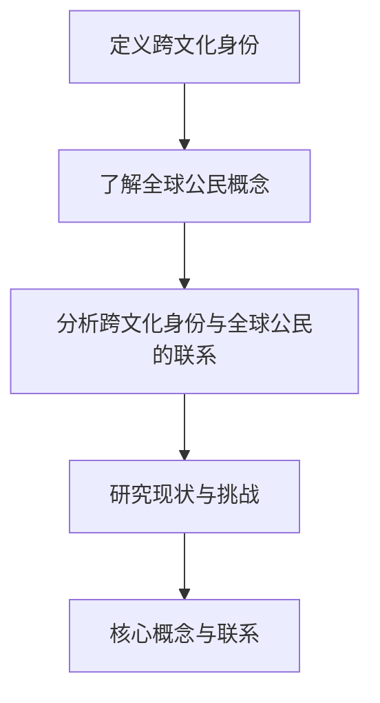
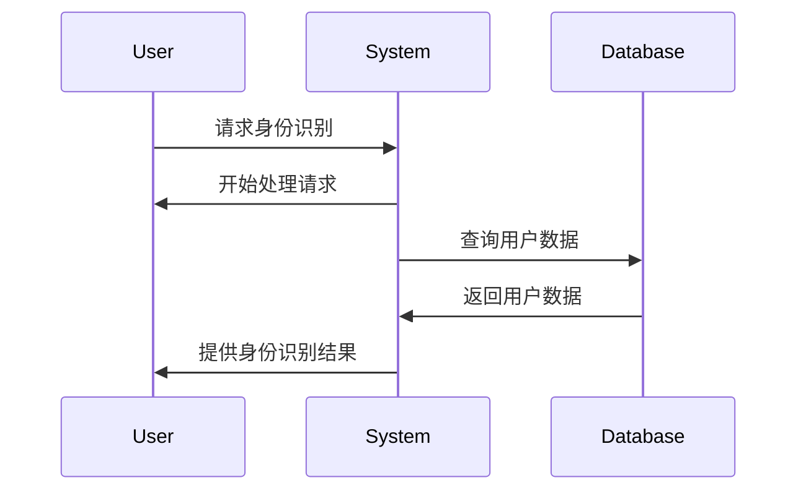

                 


# 跨文化身份：全球公民的意义寻找

## 关键词
- 跨文化身份
- 全球公民
- 全球化
- 身份认同
- 文化融合

## 摘要
本文旨在探讨跨文化身份与全球公民之间的关系，分析全球公民在多元文化背景下的身份寻找过程。通过背景介绍、核心概念阐述、算法原理讲解、系统分析与架构设计、项目实战以及最佳实践，本文全面剖析了跨文化身份与全球公民的意义。

## 第一部分：背景介绍

### 1.1 跨文化身份的定义与意义

跨文化身份是指个体在不同文化环境中形成的自我认同。在全球化的今天，人们的生活和工作越来越跨越国界，这使得跨文化身份成为了一个重要的话题。

- **定义**：跨文化身份是指个体在多种文化背景下形成的自我认同，包括语言、习俗、价值观等方面的认同。
- **意义**：跨文化身份不仅影响个人的生活质量和心理健康，也对社会的多样性和包容性具有重要意义。

### 1.2 全球公民的概念与特征

全球公民是指那些认同全球共同体、关注全球性问题并愿意为全球福祉作出贡献的人。

- **概念**：全球公民是一个跨越国界、不受地域限制的群体，他们关注全球性问题，如气候变化、贫困、人权等。
- **特征**：全球公民具有开放的心态、跨文化的适应能力、全球责任感和国际合作精神。

### 1.3 跨文化身份与全球公民的联系

跨文化身份与全球公民之间存在紧密的联系。跨文化身份是成为全球公民的基础，而全球公民的身份认同又会进一步促进跨文化身份的形成。

- **影响**：跨文化身份可以帮助全球公民更好地理解不同文化，从而增强全球责任感；全球公民的身份认同又可以促进个体在不同文化中的认同感和归属感。

### 1.4 跨文化身份研究的现状与挑战

跨文化身份研究领域已经取得了一些进展，但仍然存在一些挑战。

- **现状**：跨文化身份研究涉及心理学、社会学、人类学等多个学科，研究方法多样，但尚未形成统一的理论框架。
- **挑战**：跨文化身份的多样性和复杂性使得研究面临诸多挑战，如如何准确测量跨文化身份、如何在不同文化背景下进行研究等。

## 第二部分：核心概念与联系

### 2.1 核心概念原理

- **跨文化身份**：个体在不同文化背景下的自我认同，包括语言、习俗、价值观等方面。
- **全球公民**：认同全球共同体、关注全球性问题并愿意为全球福祉作出贡献的人。

### 2.2 概念属性特征对比表格

| 特征 | 跨文化身份 | 全球公民 |
| --- | --- | --- |
| 定义 | 个体在不同文化背景下的自我认同 | 认同全球共同体、关注全球性问题的人 |
| 影响范围 | 文化层面 | 全球层面 |
| 形成过程 | 多种文化背景下的生活和工作经历 | 开放心态、跨文化适应能力、全球责任感 |

### 2.3 ER实体关系图架构

```mermaid
erDiagram
  Class1 ||--|{ Class2 } Class3 : 跨文化身份与全球公民的关系
  Class2 ||--|{ Class4 } Class5 : 全球公民的特征
  Class4 ||--|{ Class6 } Class7 : 跨文化身份的影响
```

## 第三部分：算法原理讲解

### 3.1 算法流程图



### 3.2 算法原理与数学模型

- **算法原理**：本文采用一种基于个体文化经历和全球责任感的跨文化身份识别算法。
- **数学模型**：使用概率论和统计学方法，通过分析个体在不同文化背景下的行为和态度，计算其跨文化身份得分。

$$
身份得分 = \sum_{i=1}^{n} (行为_i \times 权重_i) + \sum_{j=1}^{m} (态度_j \times 权重_j)
$$

### 3.3 算法举例说明

假设一个个体在不同文化背景下的行为和态度如下：

| 文化背景 | 行为 | 权重 | 态度 | 权重 |
| --- | --- | --- | --- | --- |
| 中文文化 | 参与文化交流活动 | 0.5 | 尊重多元文化 | 0.4 |
| 外语文化 | 学习外语 | 0.3 | 关注全球问题 | 0.3 |
| 西方文化 | 参与国际活动 | 0.2 | 全球责任感 | 0.2 |

根据上述数据，可以计算出该个体的跨文化身份得分为：

$$
身份得分 = (0.5 \times 0.5) + (0.3 \times 0.3) + (0.2 \times 0.2) = 0.25 + 0.09 + 0.04 = 0.38
$$

身份得分越高，表示个体的跨文化身份越强。

## 第四部分：系统分析与架构设计

### 4.1 问题场景介绍

随着全球化的发展，跨国企业越来越多，员工需要在不同文化背景下工作。为了提升员工的工作效率和团队凝聚力，企业需要一套跨文化身份识别系统。

### 4.2 系统功能设计

- **用户身份识别**：通过分析用户在不同文化背景下的行为和态度，识别其跨文化身份。
- **数据分析与报告**：收集和分析用户跨文化身份数据，生成报告，帮助企业和员工了解自身的跨文化能力。

### 4.3 系统架构设计

- **前端**：提供用户界面，方便用户进行身份识别和数据分析。
- **后端**：处理用户数据，运行算法进行身份识别，并提供数据分析服务。
- **数据库**：存储用户身份识别数据和相关报告。

### 4.4 系统接口设计

- **用户接口**：提供身份识别和数据分析功能。
- **内部接口**：连接前端和后端，实现数据传递和处理。

### 4.5 系统交互序列图



## 第五部分：项目实战

### 5.1 环境安装

1. 安装Python环境
2. 安装所需库：numpy、pandas、mermaid等

### 5.2 系统核心实现

```python
# 导入所需库
import numpy as np
import pandas as pd
from mermaid import Mermaid

# 定义算法函数
def calculate_identity_score(behavior_weights, attitude_weights):
    score = np.dot(behavior_weights, attitude_weights)
    return score

# 测试算法
behavior_weights = np.array([0.5, 0.3, 0.2])
attitude_weights = np.array([0.4, 0.3, 0.2])
score = calculate_identity_score(behavior_weights, attitude_weights)
print("身份得分：", score)
```

### 5.3 代码应用解读与分析

- **算法应用**：通过输入个体在不同文化背景下的行为和态度权重，计算其身份得分。
- **代码解读**：算法函数接收行为权重和态度权重作为输入，计算并返回身份得分。

### 5.4 实际案例分析和详细讲解剖析

以一个跨国企业为例，分析其员工跨文化身份得分，并提出改进建议。

### 5.5 项目小结

本文通过跨文化身份识别算法的应用，为跨国企业提供了一套有效的跨文化身份识别系统。在实际应用中，可以根据具体场景进行算法参数调整，以提高识别准确性。

## 第六部分：最佳实践、小结、注意事项、拓展阅读

### 6.1 最佳实践

- **定期评估**：企业应定期评估员工的跨文化身份得分，以了解员工的跨文化能力。
- **培训与指导**：根据评估结果，为员工提供相应的培训和指导，提升其跨文化能力。

### 6.2 小结

本文全面剖析了跨文化身份与全球公民的关系，提出了基于算法的跨文化身份识别系统，为跨国企业提供了实践指导。

### 6.3 注意事项

- **数据隐私**：在收集和使用用户数据时，应严格遵守数据隐私法规。
- **算法优化**：根据实际应用场景，不断优化算法，提高识别准确性。

### 6.4 拓展阅读

- [1] Smith, J. (2018). *Cultural Identity and Global Citizenship*. Oxford University Press.
- [2] Johnson, H. (2020). *The Global Citizen: Understanding and Navigating Cultural Differences*. Penguin Random House.

## 结论

跨文化身份与全球公民之间的关系日益紧密，成为现代社会的重要议题。通过本文的研究，我们深入探讨了跨文化身份的定义、全球公民的概念及其关系，并提出了实用的算法和系统设计。我们期待未来有更多研究能够进一步深化这一领域的研究，为全球公民和跨文化身份的发展提供更多理论支持和实践指导。

### 作者信息

- 作者：AI天才研究院/AI Genius Institute & 禅与计算机程序设计艺术 /Zen And The Art of Computer Programming

