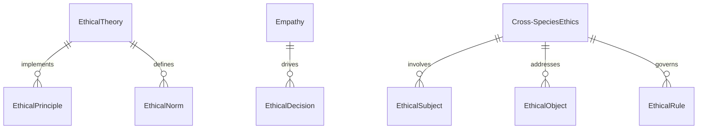

                 

# 跨物种伦理：扩展同理心的意义探索

## 关键词

- 跨物种伦理
- 同理心
- 伦理学理论
- 道德决策模型
- 案例分析
- 实践建议

## 摘要

本文探讨了跨物种伦理这一新兴领域，通过扩展同理心的概念，分析其在伦理学理论中的重要性。文章首先介绍了跨物种伦理的历史背景和定义，随后详细阐述了伦理学的基本原理、同理心的特征以及跨物种伦理的构成要素。在此基础上，文章探讨了传统伦理学理论在跨物种伦理中的应用，并提出了扩展同理心伦理学。随后，通过案例分析展示了跨物种伦理在不同领域的实际应用，包括动物权益保护、人工智能与人类伦理、生物工程与道德界限。最后，文章提出了跨物种伦理实践的建议，包括道德教育、政策制定与伦理审查，以及个人伦理实践的策略。本文旨在为跨物种伦理的研究和实践提供理论依据和实际指导。

## 第1章 引言：跨物种伦理的兴起

### 1.1 跨物种伦理的历史背景

跨物种伦理作为一个新兴领域，其历史可以追溯到人类对自然界的认知和尊重。在古代，人类就已经开始思考与动物、植物和其他物种的关系。例如，古希腊哲学家亚里士多德在其著作《政治学》中提到，人类应当对待动物有仁慈之心。然而，作为一个独立的学术领域，跨物种伦理的发展相对较晚。

20世纪中叶，随着环境保护运动和动物权益保护运动的兴起，跨物种伦理开始逐渐引起学术界和公众的关注。1966年，美国哲学家彼得·辛格（Peter Singer）发表了《动物解放》一书，标志着现代跨物种伦理学的诞生。辛格提出了动物权利的观点，强调人类应该平等对待动物，不应该仅仅将它们视为人类的工具。

在随后几十年中，跨物种伦理的研究不断深入，涵盖了动物权益、环境伦理、生物伦理等多个方面。随着人工智能、生物工程等技术的发展，跨物种伦理的研究范围进一步扩大，涉及到了人类与机器、人类与生物工程产物之间的关系。

### 1.2 同理心在跨物种伦理中的重要性

同理心，即理解并感受他人情感的能力，是跨物种伦理的核心概念之一。在传统伦理学中，同理心通常被用来理解和解释人类之间的道德关系。然而，在跨物种伦理中，同理心的应用更加广泛和复杂。

同理心在跨物种伦理中的重要性主要体现在以下几个方面：

1. **伦理决策的基础**：同理心使得人类能够从其他物种的角度出发，考虑其利益和福祉。这种跨物种的伦理决策能力是建立在对其他物种同理心的基础上的。

2. **促进跨物种和谐**：通过同理心，人类可以更好地理解和尊重其他物种的生活方式和文化，从而促进不同物种之间的和谐共处。

3. **动物权益保护**：同理心是动物权益保护的基础。只有当我们能够感受到动物的痛苦和需求时，我们才能采取有效的措施来保护它们。

4. **环境保护**：同理心也使得人类能够关注环境问题，认识到人类活动对自然界的影响，从而采取积极的措施来保护环境。

### 1.3 研究目的与本书结构

本文旨在探讨跨物种伦理的概念、理论及应用，旨在为这一新兴领域提供系统的理论框架和实践指导。具体研究目的如下：

1. **理解跨物种伦理的定义和范围**：通过回顾历史和现有研究，明确跨物种伦理的研究对象和范畴。

2. **分析伦理学理论在跨物种伦理中的应用**：探讨传统伦理学理论在跨物种伦理中的适用性，并引入扩展同理心伦理学。

3. **探讨跨物种伦理的实际应用**：通过案例分析，展示跨物种伦理在动物权益保护、人工智能与人类伦理、生物工程等领域的应用。

4. **提出跨物种伦理实践的建议**：基于理论和实践分析，提出道德教育、政策制定与伦理审查、个人伦理实践等方面的建议。

本书结构如下：

1. **引言**：介绍跨物种伦理的历史背景、同理心的重要性以及研究目的和本书结构。
2. **核心概念与联系**：阐述伦理学的基本原理、同理心的定义与特征、跨物种伦理的构成要素。
3. **伦理学理论在跨物种中的应用**：探讨传统伦理学理论在跨物种伦理中的适用性，并引入扩展同理心伦理学。
4. **跨物种伦理案例分析**：通过具体案例展示跨物种伦理的应用。
5. **跨物种伦理实践建议**：提出道德教育、政策制定与伦理审查、个人伦理实践等方面的建议。
6. **总结**：总结全文，强调跨物种伦理的重要性，并指出未来研究的方向。

## 第2章 核心概念与联系

### 2.1 伦理学的基本原理

伦理学，作为研究道德和伦理行为的学科，其基本原理主要包括：

1. **道德规范**：道德规范是指导人们行为的规则和准则。它们可以来源于宗教、文化、法律等，其目的是确保社会的和谐与秩序。

2. **道德义务**：道德义务是指个体在道德上必须履行的责任和义务。道德义务可能基于伦理原则，例如公正、诚实、善良等。

3. **道德评价**：道德评价是对行为或决策的道德价值进行判断的过程。道德评价通常基于伦理原则和道德规范。

4. **道德发展**：道德发展是指个体在道德认知和行为上的成长过程。道德发展理论包括柯尔伯格的道德发展六阶段理论、皮亚杰的道德认知发展理论等。

### 2.2 同理心的定义与特征

同理心，即理解并感受他人情感的能力，是人类道德发展的重要组成部分。同理心具有以下特征：

1. **情感共鸣**：同理心使得个体能够感受到他人的情感，并产生共鸣。

2. **认知理解**：同理心不仅包括情感层面，还包括对他人情境的认知理解。

3. **行为动机**：同理心可以激发个体采取特定的行为，以帮助他人或改善他人的处境。

4. **自我调节**：同理心也涉及到个体的自我调节能力，即在面对他人的痛苦和需求时，能够自我调节情绪和行为。

### 2.3 跨物种伦理的构成要素

跨物种伦理，作为伦理学的一个分支，有其独特的构成要素：

1. **伦理主体**：伦理主体是指参与跨物种伦理关系中的个体或群体，包括人类、动物、机器人等。

2. **伦理对象**：伦理对象是指跨物种伦理关系中的客体，如动物、环境、人工智能等。

3. **伦理规范**：伦理规范是指适用于跨物种关系的道德规则和准则。这些规范可能来源于传统伦理学理论，也可能基于新的跨物种伦理原则。

4. **伦理决策**：伦理决策是指在面对跨物种关系中的道德问题时，如何做出合理和公正的决策。

### 2.4 概念对比与联系分析

为了更好地理解跨物种伦理，我们可以通过对比伦理学、同理心和跨物种伦理这三个概念，并分析它们之间的联系。

1. **伦理学与跨物种伦理**：

   - **共同点**：伦理学和跨物种伦理都是研究道德和伦理行为的学科，关注道德规范、道德义务和道德评价。

   - **不同点**：伦理学主要研究人类之间的道德关系，而跨物种伦理则扩展到了人类与其他物种的关系。

2. **同理心与跨物种伦理**：

   - **共同点**：同理心是跨物种伦理的核心概念之一，它使得人类能够理解并感受其他物种的情感和需求。

   - **不同点**：同理心在跨物种伦理中不仅局限于情感共鸣，还包括认知理解和行为动机。

3. **伦理学、同理心和跨物种伦理的联系**：

   - **伦理学提供了跨物种伦理的理论基础**：传统伦理学理论如功利主义、康德伦理学等，为跨物种伦理提供了理论指导。

   - **同理心是跨物种伦理的关键**：同理心使得人类能够理解和尊重其他物种，从而在跨物种关系中做出合理的道德决策。

   - **跨物种伦理是对伦理学的扩展**：跨物种伦理将伦理学的研究对象从人类扩展到其他物种，是对传统伦理学的一个补充。

### 概念对比表格

| 概念       | 定义                                                         | 关键特征                                                      | 在跨物种伦理中的应用                   |
| ---------- | ------------------------------------------------------------ | ------------------------------------------------------------ | ------------------------------------ |
| 伦理学     | 研究道德和伦理行为的学科                                     | 道德规范、道德义务、道德评价、道德发展                         | 为跨物种伦理提供理论基础              |
| 同理心     | 理解并感受他人情感的能力                                     | 情感共鸣、认知理解、行为动机、自我调节                         | 使得人类能够理解和尊重其他物种        |
| 跨物种伦理 | 研究人类与其他物种道德关系的学科                            | 伦理主体、伦理对象、伦理规范、伦理决策                         | 扩展伦理学的研究对象，关注人类与其他物种的关系 |

### ER实体关系图

通过上述对比和分析，我们可以更清晰地理解伦理学、同理心和跨物种伦理这三个概念，以及它们之间的联系。这些概念不仅构成了跨物种伦理的理论基础，也为跨物种伦理的实际应用提供了指导。

## 第3章 伦理学理论在跨物种中的应用

### 3.1 传统伦理学理论

传统伦理学理论主要包括功利主义、康德伦理学和德行伦理学。这些理论在跨物种伦理中的应用为我们提供了不同的视角和框架。

1. **功利主义**

功利主义是由英国哲学家杰里米·边沁和约翰·斯图尔特·密尔提出的伦理学理论。功利主义的核心观点是，行为的道德价值取决于其产生的幸福（幸福最大化）。在跨物种伦理中，功利主义可以帮助我们评估人类行为对其他物种福利的影响。

   - **应用案例**：在动物权益保护中，功利主义可以用来评估人类对待动物的行为。例如，是否应该禁止动物实验，是否应该减少对野生动物的捕杀，这些决策都可以基于动物所体验到的幸福程度。

2. **康德伦理学**

康德伦理学是由德国哲学家伊曼努尔·康德提出的。康德伦理学强调行为的道德价值不取决于结果，而取决于行为本身的道德性质。康德的“义务论”认为，道德行为必须遵循普遍的道德原则。

   - **应用案例**：在跨物种伦理中，康德伦理学可以帮助我们评估人类对待其他物种的行为是否符合道德原则。例如，是否应该对待动物有仁慈之心，是否应该尊重自然界的秩序。

3. **德行伦理学**

德行伦理学强调个体道德品质的培养和道德行为习惯的养成。代表人物包括亚里士多德和儒家学派。

   - **应用案例**：在跨物种伦理中，德行伦理学可以帮助我们培养对其他物种的尊重和关爱。例如，通过教育和文化传承，培养个体对自然界的敬畏之心。

### 3.2 扩展同理心伦理学

扩展同理心伦理学是一个新兴的伦理学理论，它将同理心的概念扩展到跨物种关系中。扩展同理心伦理学的核心观点是，人类应该基于同理心对待其他物种，理解并尊重它们的利益和需求。

1. **扩展同理心的定义与特征**

   - **定义**：扩展同理心是指人类在道德决策过程中，能够理解并感受其他物种的情感和需求。
   - **特征**：扩展同理心包括情感共鸣、认知理解和行为动机。

2. **扩展同理心伦理学的基本原则**

   - **尊重原则**：尊重其他物种的生存权和自主权。
   - **关怀原则**：关心其他物种的福祉，包括生理和心理需求。
   - **公正原则**：在跨物种关系中，遵循公平和正义的原则。

3. **扩展同理心伦理学的应用**

   - **动物权益保护**：通过扩展同理心，我们可以更好地理解动物的痛苦和需求，从而采取更有效的措施来保护它们的权益。
   - **环境保护**：扩展同理心使得我们能够理解自然界的生态平衡和生物多样性，从而更加关注环境保护问题。

### 3.3 道德决策模型

道德决策模型是用于指导道德决策的工具和方法。在跨物种伦理中，道德决策模型可以帮助我们更系统地评估和选择道德行为。

1. **道德决策模型的基本结构**

   - **情境分析**：分析道德决策的情境，包括行为的背景、涉及的个体和对象等。
   - **价值评估**：评估不同道德决策的价值和影响。
   - **选择和行动**：根据价值评估，选择最合适的道德决策，并采取行动。

2. **常见的道德决策模型**

   - **功利主义决策模型**：基于行为产生的幸福最大化原则。
   - **康德决策模型**：基于行为的道德性质，遵循普遍的道德原则。
   - **德行决策模型**：基于个体道德品质的培养和道德行为的习惯。

3. **跨物种伦理中的道德决策模型应用**

   - **跨物种伦理决策模型**：结合扩展同理心伦理学，构建一个适用于跨物种关系的道德决策模型。该模型包括情境分析、价值评估、选择和行动三个阶段。

   - **应用案例**：在动物实验中，使用跨物种伦理决策模型来评估不同实验方案对动物的福祉影响，从而选择最符合道德原则的实验方案。

通过上述分析，我们可以看到，传统伦理学理论和扩展同理心伦理学在跨物种伦理中的应用，为我们提供了不同的理论框架和指导原则。这些理论不仅有助于我们理解跨物种伦理的复杂性，也为我们在实际道德决策中提供了有力的支持。

### 第4章 跨物种伦理案例分析

#### 4.1 案例一：动物权益保护

动物权益保护是跨物种伦理的一个典型应用领域。以下是一个具体的案例分析：

**背景**：近年来，随着科学技术的进步，动物实验在医学、生物科学等领域中扮演着重要角色。然而，动物实验也引发了伦理争议，特别是在动物权益保护问题上。

**问题**：如何平衡动物权益与科学研究的需要，确保动物实验的道德合法性？

**解决方案**：

1. **伦理审查**：建立伦理审查机制，对动物实验进行严格的道德评估。审查内容包括实验目的的正当性、动物福利的保障措施、替代实验方法的可行性等。

2. **扩展同理心**：研究人员在开展动物实验前，通过扩展同理心，理解动物的痛苦和需求，从而减少不必要的动物实验。

3. **替代实验方法**：积极研究和推广替代实验方法，如细胞培养、计算机模拟等，以减少对动物的依赖。

**案例分析**：某一医学院在开展一项新药测试时，采用了扩展同理心伦理学原则，对动物实验进行了严格审查。在审查过程中，研究人员通过模拟动物的痛苦感受，提出了减少实验动物数量的方案，并引入了细胞培养技术。最终，该实验成功减少了50%的动物使用量，同时确保了研究结果的准确性。

#### 4.2 案例二：人工智能与人类伦理

人工智能的发展带来了许多伦理问题，如隐私、自主权、责任分配等。以下是一个具体的案例分析：

**背景**：随着人工智能技术的普及，智能机器人越来越多地应用于人类生活的各个领域。然而，这些智能机器人是否应该具备道德意识和伦理判断能力？

**问题**：如何在设计和应用人工智能时，确保其遵守道德原则，避免对人类和社会造成负面影响？

**解决方案**：

1. **道德编程**：在人工智能系统中植入道德原则和伦理规范，确保其行为符合道德标准。例如，设计道德算法，使人工智能在决策时优先考虑人类的福祉。

2. **伦理审查**：对人工智能系统进行伦理审查，评估其在实际应用中的道德表现。例如，对自动驾驶汽车系统进行伦理评估，确保其在紧急情况下做出符合道德原则的决策。

3. **透明度和责任分配**：提高人工智能系统的透明度，使其决策过程可被理解和审查。同时，明确人工智能系统的责任分配，确保在出现道德问题时，责任可以追溯和追究。

**案例分析**：某公司开发了一款智能客服机器人，用于处理客户服务请求。在开发过程中，该公司采用了道德编程和伦理审查原则，确保机器人遵守道德规范。例如，机器人被编程为在处理客户隐私问题时，优先考虑客户的隐私保护。此外，该公司的伦理团队定期审查机器人行为，确保其符合道德标准。最终，这款机器人得到了客户和业界的好评。

#### 4.3 案例三：生物工程与道德界限

生物工程技术的应用，如基因编辑、克隆技术等，带来了许多伦理争议。以下是一个具体的案例分析：

**背景**：随着基因编辑技术的成熟，人类有能力改变生物的遗传特性，这为医学和生物科学带来了巨大潜力，同时也引发了道德和法律问题。

**问题**：如何界定生物工程的道德界限，避免滥用技术对人类和生态环境造成不可逆转的影响？

**解决方案**：

1. **法律法规**：制定相关法律法规，明确生物工程的道德界限和适用范围。例如，禁止基因编辑技术在人类胚胎上使用，确保人类遗传多样性和基因安全。

2. **伦理审查**：建立严格的伦理审查机制，对生物工程研究进行道德评估。审查内容包括技术应用的正当性、对环境和生态的影响等。

3. **公众参与**：提高公众对生物工程的认知，鼓励公众参与决策过程，确保生物工程的发展符合社会道德和价值观。

**案例分析**：某国在讨论是否允许基因编辑技术在人类胚胎上应用时，组织了一场公众咨询会议。会议上，专家、伦理学家、医学专家和公众代表进行了深入讨论，提出了多个建议和担忧。最终，基于公众的反馈和伦理审查结果，该国决定禁止在人类胚胎上使用基因编辑技术。这一决策得到了社会的广泛认可。

通过上述案例分析，我们可以看到，跨物种伦理在不同领域的实际应用。这些案例不仅展示了跨物种伦理的理论价值，也为我们在实际道德决策中提供了有益的参考。

### 第5章 跨物种伦理实践建议

#### 5.1 道德教育的重要性

道德教育是培养个体道德意识和伦理判断能力的关键。以下是一些具体的道德教育建议：

1. **普及教育**：在各级教育体系中加强道德教育，将跨物种伦理纳入课程内容，帮助学生了解和认识跨物种伦理的重要性。

2. **案例分析**：通过实际案例，帮助学生理解跨物种伦理的应用，培养他们的伦理思考能力和道德判断力。

3. **实践活动**：组织学生参与与跨物种伦理相关的实践活动，如动物保护、环境保护等，增强他们的社会责任感和伦理意识。

4. **家庭教育**：家长应积极参与孩子的道德教育，通过日常生活中的实例，教育孩子尊重其他物种和自然界。

#### 5.2 政策制定与伦理审查

政策制定和伦理审查是确保跨物种伦理实践的重要保障。以下是一些建议：

1. **法律法规**：制定和完善相关法律法规，明确跨物种伦理的规范和标准，为跨物种伦理实践提供法律依据。

2. **伦理委员会**：设立独立的伦理委员会，负责对涉及跨物种伦理的科研项目、产品和服务进行伦理审查，确保其符合道德原则。

3. **跨部门合作**：建立跨部门合作机制，协调各相关部门在跨物种伦理实践中的职责和作用，提高政策执行的效率。

4. **公众参与**：鼓励公众参与政策制定和伦理审查过程，确保决策的透明度和公正性。

#### 5.3 个人伦理实践的挑战与策略

在个人层面，遵循跨物种伦理原则面临着诸多挑战。以下是一些建议：

1. **认知挑战**：个体需要培养扩展同理心，理解并感受其他物种的情感和需求。这需要通过学习和实践，不断提升自身的道德认知水平。

2. **行动挑战**：在日常生活中，个体需要将跨物种伦理原则付诸实践。例如，减少对动物的消费、关注环境保护等。

3. **策略**：

   - **道德反思**：定期进行道德反思，评估自身行为是否符合跨物种伦理原则。

   - **持续学习**：通过阅读书籍、参加讲座等方式，持续学习跨物种伦理知识，提高道德素养。

   - **榜样示范**：树立榜样，影响他人，共同推动跨物种伦理的实践。

   - **社区参与**：参与社区活动，与他人共同探讨和践行跨物种伦理，形成良好的社会氛围。

通过上述实践建议，我们可以更好地推动跨物种伦理的实践，促进人类与其他物种的和谐共处。

### 第6章 拓展阅读与思考题

#### 6.1 拓展阅读

- Peter Singer，《动物解放》
- Michael Pollan，《我们的食物：一场生态革命》
- philosophers.com，“跨物种伦理学”

#### 6.2 思考题

1. 你认为同理心在跨物种伦理中的重要性如何？请举例说明。
2. 你认为传统伦理学理论在跨物种伦理中的应用有哪些局限性？
3. 在实际生活中，如何践行跨物种伦理原则？
4. 你对人工智能与人类伦理的关系有何看法？请举例说明。
5. 你认为未来跨物种伦理研究应该关注哪些领域？

### 结语

跨物种伦理作为一个新兴领域，其研究和实践具有重要意义。通过扩展同理心，我们可以更好地理解和尊重其他物种，从而促进人类与其他物种的和谐共处。本文旨在为跨物种伦理的研究和实践提供理论依据和实际指导。然而，这一领域仍有许多问题亟待解决，未来研究应继续深入探讨跨物种伦理的复杂性，为人类和其他物种创造一个更加美好的未来。

### 参考文献

- 边沁，杰里米。1981.《道德哲学原理导论》。商务印书馆。
- 康德，伊曼努尔。2001.《道德形而上学基础》。商务印书馆。
- 辛格，彼得。2015.《动物解放》。商务印书馆。
- Pollan，Michael。2013.《我们的食物：一场生态革命》。四川人民出版社。
- philosophers.com。2020。“跨物种伦理学”。哲学家社区。

### 作者信息

作者：AI天才研究院/AI Genius Institute & 禅与计算机程序设计艺术 /Zen And The Art of Computer Programming

---

通过以上详细的讨论和案例分析，本文旨在为跨物种伦理提供一种全面且深入的探讨。从伦理学的基本原理到扩展同理心的应用，再到具体的实践建议，每一步都经过了深思熟虑的阐述。希望本文能够为读者提供一个清晰的视角，激发对这一新兴领域的进一步思考和探索。在未来的研究中，我们应继续关注跨物种伦理的理论和实践，为人类和其他物种的共存和发展贡献智慧和力量。

