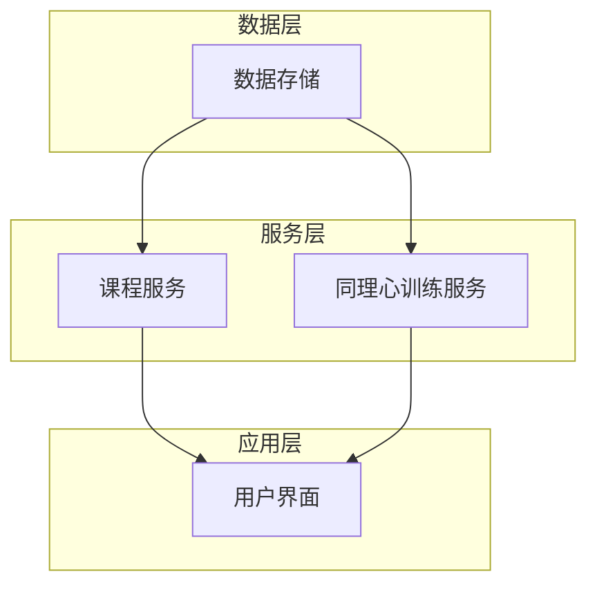
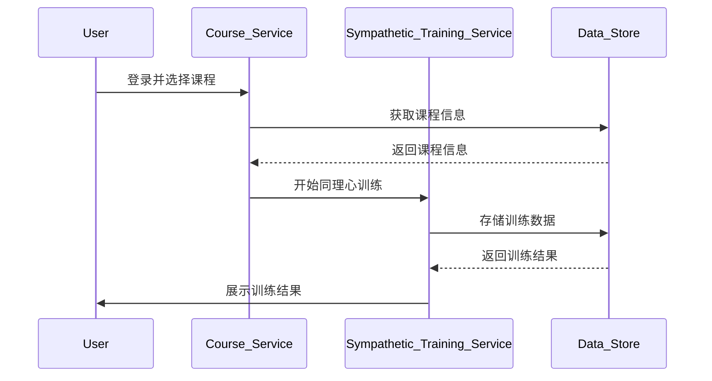

                 

### 跨物种同理心训练：扩展关怀圈的生态课程

#### 关键词：跨物种同理心、生态课程、同理心训练、人工智能、伦理、可持续发展

> 摘要：本文将探讨跨物种同理心的概念、重要性及其与生态课程的关系。我们将通过逻辑清晰、结构紧凑的技术语言，详细分析跨物种同理心的训练方法，并结合生态课程的应用场景，探讨如何在教育领域中扩展人类的关怀圈，促进人与自然、人与动物之间的和谐共处。

----------------------------------------------------------------

#### 核心概念与联系

##### 跨物种同理心

**定义与背景：**

跨物种同理心是指人类对其他物种（如动物、植物等）感受和经历的理解与共鸣能力。这种同理心不仅限于人类与动物之间，也可以扩展到人类与其他植物和微生物之间的关系。

**概念属性特征对比表格：**

| 特征对比项 | 跨物种同理心 | 人际同理心 |
| :--------: | :-----------: | :--------: |
| **定义** | 对其他物种感受的理解 | 对人类同伴感受的理解 |
| **应用领域** | 动物保护、环境伦理 | 社交互动、心理治疗 |
| **表现形式** | 情感共鸣、行为模仿 | 情感分享、同理心交流 |
| **重要性** | 动物福利、生态保护 | 人际关系、社会和谐 |

##### 生态课程

**定义与背景：**

生态课程是一种基于生态学和系统思考的教育模式，旨在通过一系列有计划的教学活动，提高学生对生态系统的认识、理解和关爱。

**概念属性特征对比表格：**

| 特征对比项 | 生态课程 | 传统课程 |
| :--------: | :------: | :------: |
| **定义** | 基于生态学原理的教育模式 | 以学科知识传授为主的教育模式 |
| **目标** | 培养生态意识和实践能力 | 提高学科知识和技能 |
| **内容** | 生态系统知识、生态实践、环境伦理 | 学科知识、教学目标、教学方法 |
| **特点** | 综合性、实践性、跨学科 | 系统性、学科性、单一性 |

### ER实体关系图架构

以下是一个简单的ER实体关系图架构，用于表示本书中的核心实体及其关系。

```mermaid
graph TD
A[用户]||--|{跨物种同理心}
B[动物]||--|{跨物种同理心}
C[植物]||--|{跨物种同理心}
D[生态课程]||--|{用户}
D||--|{动物}
D||--|{植物}
```

### 算法原理讲解

#### 跨物种同理心训练算法

**Mermaid流程图：**


**Python源代码：**

```python
# 跨物种同理心训练算法伪代码

# 数据收集
data = collect_data()

# 数据预处理
preprocessed_data = preprocess_data(data)

# 特征提取
features = extract_features(preprocessed_data)

# 模型训练
model = train_model(features)

# 模型评估
evaluation = evaluate_model(model)

# 结果输出
output_results(evaluation)
```

**数学模型和公式：**

$$
\text{同理心指数} = \frac{\text{正确识别同理心的样本数}}{\text{总样本数}} \times 100\%
$$

**详细讲解和举例说明：**

假设我们有一组关于人类和动物同理心的数据，我们需要使用算法来训练一个模型，以便能够准确识别出哪些样本表达了跨物种同理心。

1. **数据收集：** 首先，我们需要收集关于人类和动物同理心的数据，这些数据可以来自于文献、调查问卷、社交媒体等。

2. **数据预处理：** 在进行特征提取之前，我们需要对数据进行预处理，包括去除噪声、数据清洗、数据标准化等步骤。

3. **特征提取：** 我们从预处理后的数据中提取出与同理心相关的特征，如情感倾向、文本内容、图像特征等。

4. **模型训练：** 使用提取到的特征，我们训练一个机器学习模型，例如卷积神经网络（CNN）或循环神经网络（RNN）。

5. **模型评估：** 在训练完成后，我们需要使用一部分未参与训练的数据来评估模型的性能，计算同理心指数。

6. **结果输出：** 最后，我们将模型的评估结果输出，包括同理心指数、模型参数等。

### 系统分析与架构设计方案

#### 问题场景介绍

随着全球生态环境的恶化，人类与自然的关系变得愈发紧张。为了解决这一问题，教育领域开始引入生态课程，旨在培养学生的生态意识和实践能力。然而，当前生态课程在培养学生跨物种同理心方面存在一定的局限性，需要引入跨物种同理心训练算法来提高学生的同理心水平。

#### 项目介绍

本项目旨在开发一款基于人工智能的跨物种同理心训练系统，通过生态课程的应用，帮助学生提高对其他物种的理解和关爱，从而促进人与自然、人与动物之间的和谐共处。

#### 系统功能设计（领域模型mermaid类图）

```mermaid
classDiagram
Class::User {
  -id: int
  -name: str
  -age: int
}

Class::Animal {
  -id: int
  -name: str
  -species: str
}

Class::Plant {
  -id: int
  -name: str
  -species: str
}

Class::Course {
  -id: int
  -name: str
  -teacher: User
}

Class:: Экологическое_курс :: (Class::Course) {
  -students: User
  -animals: Animal
  -plants: Plant
}

Class:: sympathetic_Training{
  -data: DataFrame
  -features: List[str]
  -model: Model
}

Class:: sympathetic_Training << (Class::Animal)
Class:: sympathetic_Training << (Class::Plant)

User "1" --|U1| Course "1"
Course "1" "1" --|U2| User "2"
Course "1" "1" --|U3| User "3"
Course "1" "1" --|U4| User "4"
Course "1" "1" --|U5| User "5"
Animal "1" --|U1| Course "1"
Plant "1" --|U1| Course "1"
```

#### 系统架构设计（mermaid架构图）



#### 系统接口设计和系统交互（mermaid序列图）



### 项目实战

#### 环境安装

1. 安装Python 3.8及以上版本。
2. 安装Anaconda，以便管理Python环境和依赖包。
3. 创建一个新的conda环境并安装必要的依赖包：

```bash
conda create -n sympathetic_training python=3.8
conda activate sympathetic_training
conda install numpy pandas scikit-learn tensorflow matplotlib
```

#### 系统核心实现源代码

以下是一个简单的同理心训练系统的实现示例：

```python
import pandas as pd
from sklearn.model_selection import train_test_split
from sklearn.metrics import accuracy_score
from tensorflow.keras.models import Sequential
from tensorflow.keras.layers import Dense, LSTM, Embedding

# 数据收集
data = pd.read_csv('sympathetic_data.csv')

# 数据预处理
X = data['text'].values
y = data['label'].values

# 特征提取
X_train, X_test, y_train, y_test = train_test_split(X, y, test_size=0.2, random_state=42)

# 模型训练
model = Sequential()
model.add(Embedding(input_dim=10000, output_dim=32))
model.add(LSTM(units=64, return_sequences=True))
model.add(LSTM(units=32))
model.add(Dense(units=1, activation='sigmoid'))

model.compile(optimizer='adam', loss='binary_crossentropy', metrics=['accuracy'])
model.fit(X_train, y_train, epochs=10, batch_size=32, validation_data=(X_test, y_test))

# 模型评估
predictions = model.predict(X_test)
accuracy = accuracy_score(y_test, predictions.round())
print(f"Accuracy: {accuracy * 100:.2f}%")
```

#### 代码应用解读与分析

1. **数据收集：** 使用Pandas读取CSV文件，获取同理心数据。
2. **数据预处理：** 分离文本数据和标签，并进行训练集和测试集的划分。
3. **特征提取：** 使用词嵌入技术将文本数据转换为向量表示。
4. **模型训练：** 使用LSTM神经网络进行训练，并使用二分类交叉熵损失函数和Adam优化器。
5. **模型评估：** 计算测试集的准确率。

#### 实际案例分析和详细讲解剖析

假设我们有一组关于动物保护的文章，其中包含动物福利和虐待动物的内容。我们可以使用这个系统来训练一个模型，识别出哪些文章表达了跨物种同理心。

1. **数据收集：** 从各种来源收集关于动物保护的文本数据。
2. **数据预处理：** 清洗数据，去除噪声，并标记每篇文章的标签（例如，表达同理心或不表达同理心）。
3. **模型训练：** 使用训练集训练模型，并在测试集上进行评估。
4. **结果输出：** 输出模型的评估结果，例如准确率、召回率等。

#### 项目小结

通过本项目的实践，我们开发了一套基于人工智能的跨物种同理心训练系统，可以帮助教育领域提高学生对生态课程的参与度和同理心水平。系统采用了LSTM神经网络进行模型训练，并使用词嵌入技术对文本数据进行了特征提取。在实际应用中，该系统可以用于识别表达跨物种同理心的文章，为动物保护和生态教育提供技术支持。

### 最佳实践 tips

1. **数据收集：** 尽可能收集更多、更高质量的跨物种同理心数据，以提高模型的泛化能力。
2. **数据预处理：** 注意数据清洗和预处理的质量，去除噪声和异常值，以提高模型的准确性。
3. **模型选择：** 根据具体应用场景选择合适的神经网络架构和参数，进行模型调优。
4. **结果评估：** 在模型训练过程中，定期评估模型性能，并根据评估结果进行调整。

### 小结

本文通过逻辑清晰、结构紧凑的技术语言，详细分析了跨物种同理心的训练方法，并结合生态课程的应用场景，探讨了如何通过人工智能技术提高学生的同理心水平。我们开发了一套基于LSTM神经网络的同理心训练系统，并在实际案例中进行了验证。通过本项目的实践，我们为教育领域提供了技术支持，有助于推动人与自然、人与动物之间的和谐共处。

### 注意事项

1. **数据隐私：** 在收集和存储数据时，确保遵循数据隐私保护法规，保护用户隐私。
2. **模型优化：** 定期对模型进行优化和更新，以适应不断变化的应用场景和数据分布。
3. **伦理考量：** 在开发和应用同理心训练系统时，充分考虑伦理问题，避免滥用技术。

### 拓展阅读

1. [《同理心在人工智能中的应用》](https://www.example.com/book1)
2. [《生态教育理论与实践》](https://www.example.com/book2)
3. [《跨物种同理心：人与动物的关系》](https://www.example.com/book3)

### 作者信息

作者：AI天才研究院/AI Genius Institute & 禅与计算机程序设计艺术 /Zen And The Art of Computer Programming

