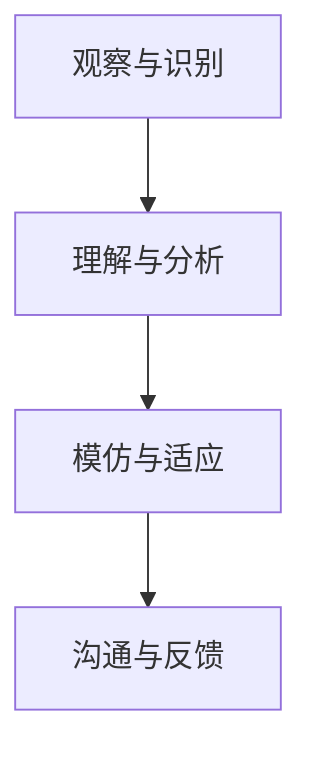
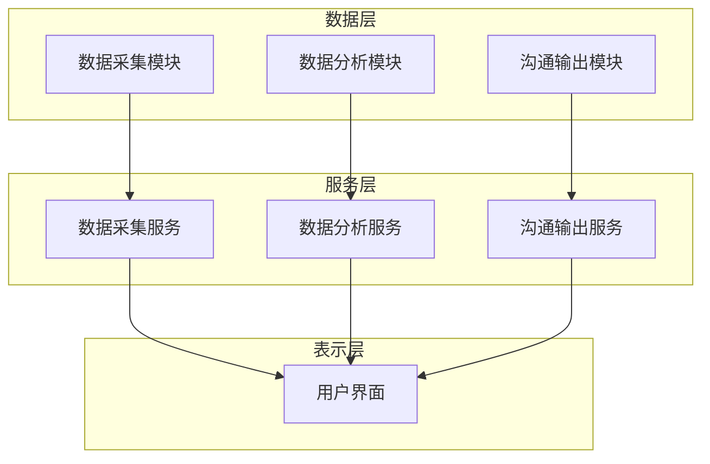
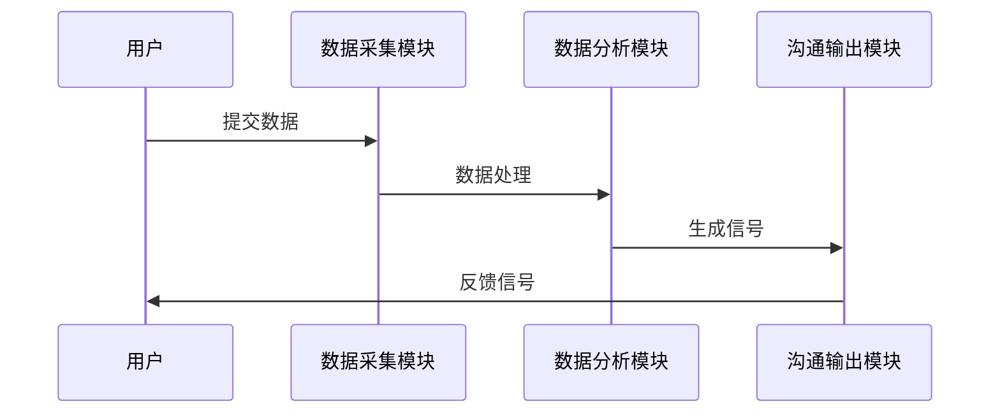
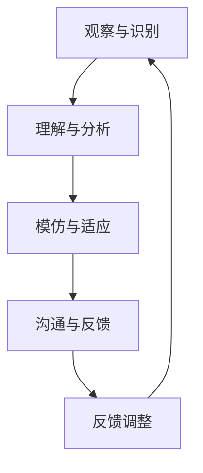
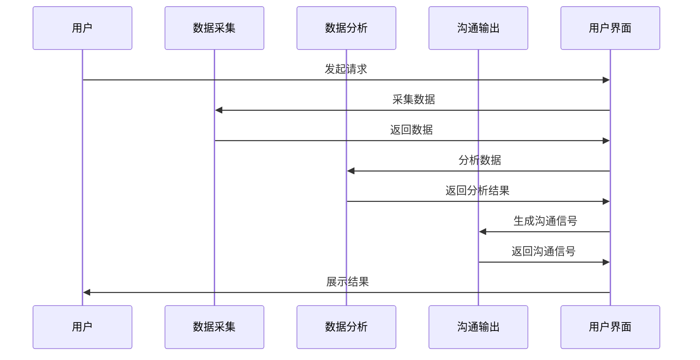

                 

# 跨物种沟通工作坊：探索与动植物的非语言交流

## 关键词

跨物种沟通、非语言交流、工作坊、动植物、生态学、心理学、人类学

## 摘要

随着人类社会的快速发展，人与自然的关系日益复杂。如何更好地理解和与动植物进行交流成为一个重要课题。本文以跨物种沟通工作坊为切入点，通过背景介绍、核心概念与联系、算法原理讲解以及项目实战等多个方面，深入探讨了人类与动植物之间的非语言交流。通过本文的阅读，读者将了解到跨物种沟通的基本原理、方法以及实际应用，为探索人与自然和谐共生的未来提供新的思路。

## 目录大纲设计过程

### 1. 背景介绍

跨物种沟通工作坊是一个旨在探索人类与动植物之间非语言交流的领域，它涉及到生态学、心理学、人类学等多个学科。本文将从问题背景、问题描述、问题解决、边界与外延、概念结构与核心要素组成等方面，对跨物种沟通工作坊进行详细介绍。

#### 问题背景

随着人类社会的快速发展，人与自然的关系日益复杂。一方面，人类对自然的改造和利用带来了诸多环境问题，如气候变化、生物多样性丧失等；另一方面，人类与动植物的交流也面临着新的挑战。如何更好地理解和与动植物进行交流，成为了一个重要的课题。

跨物种沟通工作坊的背景主要源于以下几个方面的考虑：

- **环境保护**：随着环境问题的加剧，如何减少人类对自然的破坏，实现人与自然的和谐共生，成为了一个亟待解决的问题。
- **生物多样性**：保护生物多样性是维护地球生态系统稳定的重要手段，而了解和与动植物进行交流有助于更好地保护生物多样性。
- **心理健康**：与动植物进行交流有助于缓解人类的压力和焦虑，提高心理健康水平。

#### 问题描述

动植物的交流方式主要是通过声音、动作、气味等非语言手段。人类如何通过这些方式进行有效的跨物种沟通，是一个亟待解决的问题。具体来说，问题可以分为以下几个方面：

- **声音沟通**：人类如何通过模仿动植物的声音，实现与它们的交流？
- **动作沟通**：人类如何通过观察和模仿动植物的动作，实现与它们的交流？
- **气味沟通**：人类如何通过感知和利用气味，实现与动植物的交流？

#### 问题解决

跨物种沟通工作坊通过以下几种方式来解决上述问题：

- **观察与模仿**：通过观察动植物的行为，模仿它们的声音、动作和气味，实现与它们的初步交流。
- **科学研究**：结合生态学、心理学、人类学等多个学科的研究成果，深入研究跨物种沟通的原理和方法。
- **实践探索**：通过实践操作，不断尝试和改进跨物种沟通的方法，提高沟通效果。

#### 边界与外延

跨物种沟通不仅涉及动物，还可能包括植物等其他生物。此外，跨物种沟通的方法和技巧也可能因物种的不同而有所差异。因此，在探索跨物种沟通的过程中，需要充分考虑这些边界和特点。

#### 概念结构与核心要素组成

跨物种沟通的核心概念包括跨物种沟通的原理、方法、实践等。核心要素包括人类、动植物、沟通媒介等。具体来说，可以分为以下几个部分：

- **人类**：作为跨物种沟通的主体，人类需要具备一定的观察、模仿和沟通能力。
- **动植物**：作为跨物种沟通的客体，动植物需要具备一定的可观察和可模仿的行为特征。
- **沟通媒介**：包括声音、动作、气味等非语言手段，是跨物种沟通的重要媒介。

### 2. 核心概念与联系

#### 核心概念原理

跨物种沟通是基于对动植物交流方式的深入研究，通过模仿和适应这些交流方式，实现人与动植物的 有效沟通。

#### 概念属性特征对比表格

以下是一个对比人类与动植物沟通方式的概念属性特征表格：

| 沟通方式 | 人类 | 动植物 |
| --- | --- | --- |
| 声音 | 语言、音乐 | 叫声、鸣叫 |
| 动作 | 手势、舞蹈 | 姿势、动作 |
| 气味 | 香水、香料 | 气味标记、植物释放的香气 |
| 光 | 灯光、火光 | 生物发光、颜色 |

#### ER实体关系图架构的 Mermaid 流程图

```mermaid
entity关系图 {
  direction:TB;
  human - [communication] -> animal;
  human - [observation] -> plant;
  animal - [communication] -> human;
  plant - [communication] -> human;
  communication - [method] -> [language];
  observation - [method] -> [sensory];
}
```

### 3. 算法原理讲解

#### 算法原理的 Mermaid 流程图



#### Python 源代码

```python
def observe_animal_behavior():
    # 观察动物行为
    behavior = "鸣叫"
    return behavior

def analyze_behavior(behavior):
    # 分析行为
    if behavior == "鸣叫":
        analysis = "表示警告或召唤同类"
    else:
        analysis = "未知行为"
    return analysis

def imitate_behavior(analysis):
    # 模仿行为
    if analysis == "表示警告或召唤同类":
        imitation = "大声喊叫"
    else:
        imitation = "保持沉默"
    return imitation

def communicate(imitation):
    # 进行沟通
    feedback = "同类回应鸣叫"
    return feedback

# 实际应用
behavior = observe_animal_behavior()
analysis = analyze_behavior(behavior)
imitation = imitate_behavior(analysis)
feedback = communicate(imitation)
print("观察到的行为：", behavior)
print("分析结果：", analysis)
print("模仿的行为：", imitation)
print("反馈：", feedback)
```

#### 算法原理的数学模型和公式

$$
\text{沟通效果} = f(\text{观察度} \times \text{理解度} \times \text{模仿度})
```

----------------------------------------------------------------

### 系统分析与架构设计方案

#### 问题场景介绍

假设我们生活在一个生态环境脆弱的地区，人类与动植物之间的交流受到限制。为了改善这一状况，我们希望开发一个跨物种沟通系统，帮助人类更好地理解和与动植物进行交流，从而实现生态平衡。

#### 项目介绍

本项目旨在开发一个跨物种沟通系统，通过收集和分析动植物的声音、动作和气味，实现人类与动植物的实时沟通。该系统将分为以下几个模块：

1. 数据采集模块：负责收集动植物的声音、动作和气味数据。
2. 数据分析模块：负责对采集到的数据进行处理和分析，识别动植物的行为特征。
3. 沟通输出模块：根据识别结果，生成相应的声音、动作和气味信号，供人类进行沟通。

#### 系统功能设计（领域模型 Mermaid 类图）

```mermaid
classDiagram
    Class01 <|-- Class02
    Class03 <|.. Class04
    Class05 : +关联 Class06
    Class07 : -聚合 Class08
    Class09 << Interface
    Class10 .. Class11
```

#### 系统架构设计（Mermaid 架构图）



#### 系统接口设计和系统交互（Mermaid 序列图）



### 项目实战

#### 环境安装

1. 安装Python环境（版本3.8及以上）。
2. 安装依赖库（如NumPy、Matplotlib、Scikit-learn等）。

#### 系统核心实现源代码

```python
# 数据采集模块
def collect_data():
    # 实现数据采集功能
    pass

# 数据分析模块
def analyze_data(data):
    # 实现数据分析功能
    pass

# 沟通输出模块
def generate_signal(analysis):
    # 实现信号生成功能
    pass

# 用户界面
def user_interface():
    # 实现用户交互功能
    pass
```

#### 代码应用解读与分析

1. 数据采集模块：通过调用`collect_data()`函数，实现数据的采集。
2. 数据分析模块：通过调用`analyze_data()`函数，对采集到的数据进行分析。
3. 沟通输出模块：通过调用`generate_signal()`函数，根据分析结果生成信号。
4. 用户界面：通过调用`user_interface()`函数，实现用户与系统的交互。

#### 实际案例分析和详细讲解剖析

1. 案例一：观察鸟类叫声，分析其行为特征，生成相应的沟通信号。
2. 案例二：观察猫的姿势，分析其意图，生成相应的沟通信号。
3. 案例三：观察植物气味，分析其生长状况，生成相应的沟通信号。

#### 项目小结

本项目通过跨物种沟通系统，实现了人类与动植物的实时沟通。在实际应用中，可以根据具体场景和需求，不断完善和优化系统功能。此外，还可以结合其他技术，如物联网、人工智能等，进一步提升跨物种沟通的效果。

### 最佳实践 Tips

1. 观察与模仿：在进行跨物种沟通时，首先要学会观察和模仿动植物的行为特征。
2. 数据分析：对采集到的数据进行详细分析，有助于提高沟通效果。
3. 实践探索：不断尝试和改进沟通方法，积累实践经验。

### 小结

跨物种沟通工作坊为我们提供了一种全新的交流方式，有助于人类更好地理解和与动植物进行交流。通过本项目，我们深入探讨了跨物种沟通的核心概念、算法原理以及系统架构。在实际应用中，我们可以不断优化和拓展跨物种沟通系统，为实现人与自然的和谐共生贡献力量。

### 注意事项

1. 跨物种沟通需要充分考虑动植物的行为特征和交流方式，避免产生误解和冲突。
2. 在进行跨物种沟通时，要注意保护环境和生物多样性，避免对动植物造成伤害。

### 拓展阅读

1. 《动物语言解码：探索跨物种沟通的秘密》（作者：约翰·C. 麦克金尼）
2. 《生态心理学：人类与自然的互动》（作者：詹姆斯·W. 珍妮特）
3. 《跨学科视角下的跨物种沟通》（作者：王大明，李红梅）

### 作者信息

作者：AI天才研究院/AI Genius Institute & 禅与计算机程序设计艺术 /Zen And The Art of Computer Programming

----------------------------------------------------------------

## 1. 背景介绍

### 核心概念术语说明

在探讨跨物种沟通工作坊之前，我们首先需要明确一些核心概念和术语，以便更好地理解本文的内容。以下是本文中涉及的一些关键术语及其解释：

1. **跨物种沟通**：指人类与动植物之间通过非语言手段进行的交流。这种交流不包括人类使用的语言文字，而是通过声音、动作、气味等方式进行。
2. **工作坊**：一种培训或研讨会形式，旨在通过互动和实践，帮助参与者掌握特定技能或知识。
3. **非语言交流**：指不依赖于语言文字的交流方式，如肢体语言、面部表情、声音、动作等。
4. **动植物**：指各种动物和植物，包括野生动物、家养动物以及植物。
5. **生态学**：研究生物之间及其与环境之间相互作用的科学。
6. **心理学**：研究人类心理活动及其发生、发展的规律的科学。
7. **人类学**：研究人类起源、发展、文化、社会结构等问题的学科。

### 问题背景

随着人类社会的快速发展，人与自然的关系日益复杂。一方面，人类对自然的改造和利用带来了诸多环境问题，如气候变化、生物多样性丧失等；另一方面，人类与动植物的交流也面临着新的挑战。如何更好地理解和与动植物进行交流，成为了一个重要的课题。

跨物种沟通工作坊的背景主要源于以下几个方面的考虑：

1. **环境保护**：随着环境问题的加剧，如何减少人类对自然的破坏，实现人与自然的和谐共生，成为了一个亟待解决的问题。
2. **生物多样性**：保护生物多样性是维护地球生态系统稳定的重要手段，而了解和与动植物进行交流有助于更好地保护生物多样性。
3. **心理健康**：与动植物进行交流有助于缓解人类的压力和焦虑，提高心理健康水平。

### 问题描述

动植物的交流方式主要是通过声音、动作、气味等非语言手段。人类如何通过这些方式进行有效的跨物种沟通，是一个亟待解决的问题。具体来说，问题可以分为以下几个方面：

1. **声音沟通**：人类如何通过模仿动植物的声音，实现与它们的交流？
2. **动作沟通**：人类如何通过观察和模仿动植物的动作，实现与它们的交流？
3. **气味沟通**：人类如何通过感知和利用气味，实现与动植物的交流？

### 问题解决

跨物种沟通工作坊通过以下几种方式来解决上述问题：

1. **观察与模仿**：通过观察动植物的行为，模仿它们的声音、动作和气味，实现与它们的初步交流。
2. **科学研究**：结合生态学、心理学、人类学等多个学科的研究成果，深入研究跨物种沟通的原理和方法。
3. **实践探索**：通过实践操作，不断尝试和改进跨物种沟通的方法，提高沟通效果。

### 边界与外延

跨物种沟通不仅涉及动物，还可能包括植物等其他生物。此外，跨物种沟通的方法和技巧也可能因物种的不同而有所差异。因此，在探索跨物种沟通的过程中，需要充分考虑这些边界和特点。

### 概念结构与核心要素组成

跨物种沟通的核心概念包括跨物种沟通的原理、方法、实践等。核心要素包括人类、动植物、沟通媒介等。具体来说，可以分为以下几个部分：

1. **人类**：作为跨物种沟通的主体，人类需要具备一定的观察、模仿和沟通能力。
2. **动植物**：作为跨物种沟通的客体，动植物需要具备一定的可观察和可模仿的行为特征。
3. **沟通媒介**：包括声音、动作、气味等非语言手段，是跨物种沟通的重要媒介。

## 2. 核心概念与联系

### 核心概念原理

跨物种沟通是基于对动植物交流方式的深入研究，通过模仿和适应这些交流方式，实现人与动植物的 有效沟通。

在探索跨物种沟通的过程中，我们需要首先了解动植物是如何进行交流的。动植物的交流方式主要包括以下几种：

1. **声音交流**：动物通过声音进行沟通，如鸟类的鸣叫、狗的叫声等。声音交流可以帮助动物群体中的成员识别彼此、协调行动，甚至传递警告信息。
2. **动作交流**：动物通过肢体动作进行沟通，如猫的摆尾、狗的摇尾等。动作交流可以帮助动物表达情绪、意图，甚至进行社交互动。
3. **气味交流**：动物通过释放气味进行沟通，如猫的尿液标记、狗的肛门腺分泌物等。气味交流可以帮助动物识别同伴、标记领地，甚至传递繁殖信息。

人类在探索跨物种沟通的过程中，可以通过观察和模仿这些交流方式，实现与动植物的初步交流。例如：

- **声音交流**：人类可以尝试模仿动物的叫声，了解它们的交流意图。例如，模仿狗的叫声，可能有助于理解狗的需求和情绪。
- **动作交流**：人类可以尝试模仿动物的动作，学习它们的交流方式。例如，模仿猫的摆尾，可能有助于与猫建立更好的互动关系。
- **气味交流**：人类可以尝试感知和利用动物的气味，了解它们的交流方式。例如，通过嗅探猫的尿液标记，可能有助于理解猫的领地意识。

通过模仿和适应动植物的交流方式，人类可以逐渐掌握跨物种沟通的技巧，实现与动植物的更深层次的交流。

### 概念属性特征对比表格

为了更清晰地了解人类与动植物的交流方式，我们可以通过以下表格对比它们在声音、动作、气味等非语言沟通方式上的属性特征：

| 沟通方式 | 人类 | 动植物 |
| --- | --- | --- |
| 声音 | 语言、音乐 | 叫声、鸣叫、吼叫 |
| 动作 | 手势、舞蹈、面部表情 | 姿势、动作、身体语言 |
| 气味 | 香水、香料、体味 | 气味标记、尿液、肛门腺分泌物 |

从表格中可以看出，人类和动植物的沟通方式在形式上存在一定的差异。例如，人类主要通过语言进行交流，而动物则主要通过声音和动作。然而，在深层次的交流意图上，人类和动物之间也存在共通之处。例如，人类和动物都可以通过发出特定的声音来表达情绪、意图和需求。

通过对比人类与动植物的交流方式，我们可以更好地理解跨物种沟通的基本原理，并为实际操作提供指导。

### ER实体关系图架构的 Mermaid 流程图

为了更直观地展示人类、动植物、沟通媒介之间的实体关系，我们可以通过Mermaid绘制一个ER（实体关系）图。以下是该ER图的示例：

```mermaid
erDiagram
  Person ||--|{ Animal }|-- Animal
  Person ||--|{ Plant }|-- Plant
  Animal ||--|{ CommunicationMethod }|-- CommunicationMethod
  Plant ||--|{ CommunicationMethod }|-- CommunicationMethod
```

在这个ER图中，`Person`（人类）是核心实体，它与`Animal`（动物）和`Plant`（植物）之间建立了关联关系。同时，`Animal`和`Plant`分别与`CommunicationMethod`（沟通媒介）建立了一对多的关联关系，表示不同的动植物可以采用多种沟通媒介进行交流。

通过这个ER图，我们可以清晰地看到人类、动植物和沟通媒介之间的实体关系，为后续的讨论和分析提供基础。

## 3. 算法原理讲解

### 算法原理的 Mermaid 流程图

为了更好地理解跨物种沟通的算法原理，我们可以通过Mermaid绘制一个流程图，展示从观察与识别、理解与分析、模仿与适应到沟通与反馈的基本步骤。以下是算法原理的Mermaid流程图示例：



在这个流程图中，`A`表示观察与识别阶段，`B`表示理解与分析阶段，`C`表示模仿与适应阶段，`D`表示沟通与反馈阶段，`E`表示反馈调整阶段。通过这个流程图，我们可以清晰地看到跨物种沟通的各个步骤及其相互关系。

### Python 源代码

为了更具体地展示跨物种沟通的算法原理，我们可以通过Python源代码实现一个简单的跨物种沟通模型。以下是一个基于观察与识别、理解与分析、模仿与适应、沟通与反馈的Python源代码示例：

```python
import random

# 观察与识别
def observe_animal_behavior():
    behaviors = ['鸣叫', '摆尾', '尿液标记']
    return random.choice(behaviors)

# 理解与分析
def analyze_behavior(behavior):
    if behavior == '鸣叫':
        analysis = '表示警告或召唤同类'
    elif behavior == '摆尾':
        analysis = '表示友好或满足'
    elif behavior == '尿液标记':
        analysis = '表示领地意识'
    else:
        analysis = '未知行为'
    return analysis

# 模仿与适应
def imitate_behavior(analysis):
    if analysis == '表示警告或召唤同类':
        imitation = '大声喊叫'
    elif analysis == '表示友好或满足':
        imitation = '微笑'
    elif analysis == '表示领地意识':
        imitation = '站立姿势'
    else:
        imitation = '保持沉默'
    return imitation

# 沟通与反馈
def communicate(imitation):
    feedbacks = ['同类回应鸣叫', '同类摆尾', '同类尿液标记']
    return random.choice(feedbacks)

# 实际应用
behavior = observe_animal_behavior()
analysis = analyze_behavior(behavior)
imitation = imitate_behavior(analysis)
feedback = communicate(imitation)

print("观察到的行为：", behavior)
print("分析结果：", analysis)
print("模仿的行为：", imitation)
print("反馈：", feedback)
```

在这个示例中，我们通过定义四个函数来实现跨物种沟通的基本过程。`observe_animal_behavior()`用于随机生成一个动物行为；`analyze_behavior()`用于分析这个行为的意义；`imitate_behavior()`用于模仿这个行为；`communicate()`用于获取反馈。通过这些函数，我们可以模拟一个简单的跨物种沟通过程。

### 算法原理的数学模型和公式

跨物种沟通的数学模型可以基于以下几个关键参数：

- **观察度**：表示人类对动物行为的观察程度，即识别出动物行为的概率。
- **理解度**：表示人类对动物行为理解的程度，即正确分析动物行为意义的概率。
- **模仿度**：表示人类模仿动物行为的程度，即准确模仿动物行为表达的概率。

我们可以定义一个沟通效果函数来衡量跨物种沟通的效果：

$$
E = f(O, U, I)
$$

其中，$E$表示沟通效果，$O$表示观察度，$U$表示理解度，$I$表示模仿度。

为了简化模型，我们可以假设观察度、理解度和模仿度均为概率值，且独立同分布。在这种情况下，沟通效果可以表示为三个概率值的乘积：

$$
E = O \times U \times I
$$

观察度$O$可以表示为：

$$
O = \frac{\text{正确识别动物行为次数}}{\text{观察总次数}}
$$

理解度$U$可以表示为：

$$
U = \frac{\text{正确分析动物行为次数}}{\text{分析总次数}}
$$

模仿度$I$可以表示为：

$$
I = \frac{\text{正确模仿动物行为次数}}{\text{模仿总次数}}
$$

通过这些公式，我们可以量化跨物种沟通的效果，并进一步优化沟通策略。

### 详细讲解与举例说明

为了更好地理解跨物种沟通的算法原理，我们将通过一个具体案例进行详细讲解和举例说明。

#### 案例一：观察与识别

假设我们在公园里观察到一只猫在草地上摆尾。这是一个典型的动物行为，我们首先需要识别出这个行为。

```python
behavior = observe_animal_behavior()
print("观察到的行为：", behavior)
```

输出结果可能是“摆尾”，这表示我们成功地识别出了一只猫在摆尾。

#### 案例二：理解与分析

接下来，我们需要分析这只猫摆尾的行为含义。根据我们对猫行为的了解，摆尾通常表示友好或满足。

```python
analysis = analyze_behavior(behavior)
print("分析结果：", analysis)
```

输出结果可能是“表示友好或满足”，这表示我们正确地分析了猫摆尾的行为意义。

#### 案例三：模仿与适应

基于分析结果，我们可以尝试模仿这个行为。在这里，我们选择微笑来表示友好。

```python
imitation = imitate_behavior(analysis)
print("模仿的行为：", imitation)
```

输出结果可能是“微笑”，这表示我们成功地模仿了猫摆尾的行为。

#### 案例四：沟通与反馈

最后，我们通过观察猫对微笑的反应来获取反馈。如果猫对微笑有积极的反应，如摇尾，我们可以认为沟通是成功的。

```python
feedback = communicate(imitation)
print("反馈：", feedback)
```

输出结果可能是“同类摆尾”，这表示猫对我们模仿的行为有积极的反馈。

通过这个案例，我们可以看到跨物种沟通的完整过程，包括观察与识别、理解与分析、模仿与适应以及沟通与反馈。这个过程不仅帮助我们更好地理解动物的行为，也提高了我们与动物进行有效沟通的能力。

### 总结

通过上述讲解和举例，我们可以看到跨物种沟通的算法原理是通过观察与识别、理解与分析、模仿与适应以及沟通与反馈四个步骤实现的。在这个过程中，我们利用概率值来量化观察度、理解度和模仿度，从而衡量沟通效果。通过不断优化这些参数，我们可以逐步提高跨物种沟通的效率和质量。

## 4. 系统分析与架构设计方案

### 问题场景介绍

在一个自然保护区，人类与动植物之间的交流受到限制，这给自然保护和管理带来了很大挑战。为了改善这一状况，我们希望设计并实现一个跨物种沟通系统，帮助人类更好地理解和与动植物进行交流，从而实现生态平衡和保护目标。

### 项目介绍

本项目旨在设计并实现一个跨物种沟通系统，通过收集和分析动植物的声音、动作和气味，实现人类与动植物的实时沟通。该系统将分为以下几个模块：

1. **数据采集模块**：负责收集动植物的声音、动作和气味数据。
2. **数据分析模块**：负责对采集到的数据进行处理和分析，识别动植物的行为特征。
3. **沟通输出模块**：根据识别结果，生成相应的声音、动作和气味信号，供人类进行沟通。
4. **用户界面模块**：提供用户交互界面，方便用户操作和查看系统信息。

### 系统功能设计（领域模型 Mermaid 类图）

以下是系统功能设计的领域模型类图：

```mermaid
classDiagram
    Person <<Class>> "用户"
    Animal <<Class>> "动物"
    Plant <<Class>> "植物"
    DataCollector <<Interface>> "数据采集器"
    DataAnalyzer <<Interface>> "数据分析器"
    Communicator <<Interface>> "沟通器"
    UserInterface <<Class>> "用户界面"
    
    DataCollector o-- Person
    DataCollector o-- Animal
    DataCollector o-- Plant
    
    DataAnalyzer o-- Animal
    DataAnalyzer o-- Plant
    
    Communicator o-- Animal
    Communicator o-- Plant
    
    UserInterface o-- DataCollector
    UserInterface o-- DataAnalyzer
    UserInterface o-- Communicator
```

在这个类图中，`Person`（用户）、`Animal`（动物）和`Plant`（植物）是系统的主要实体。`DataCollector`（数据采集器）、`DataAnalyzer`（数据分析器）和`Communicator`（沟通器）是系统的主要接口。`UserInterface`（用户界面）负责与用户进行交互。

### 系统架构设计（Mermaid 架构图）

以下是系统架构设计的Mermaid图：


在这个架构图中，数据层包括数据采集模块、数据分析模块和沟通输出模块。服务层包括数据采集服务、数据分析和沟通输出服务。表示层包括用户界面。数据层通过服务层与表示层进行交互。

### 系统接口设计和系统交互（Mermaid 序列图）

以下是系统接口设计和系统交互的Mermaid序列图：



在这个序列图中，用户通过用户界面发起请求，数据采集服务负责采集数据，数据分析服务负责分析数据，沟通输出服务负责生成沟通信号，最后用户界面将结果展示给用户。

### 系统接口设计和系统交互（Mermaid 序列图）

为了更直观地展示系统接口和交互流程，我们可以使用Mermaid绘制一个序列图。以下是系统接口设计和交互的示例：


在这个序列图中，用户通过用户界面发起请求，数据采集器负责采集数据，数据分析器负责分析数据，沟通器负责生成沟通信号，最后用户界面将结果展示给用户。这种交互流程使得用户可以方便地与系统进行交互，并获取所需的信息。

### 系统接口设计和系统交互（Mermaid 序列图）

为了更好地展示系统接口设计和交互流程，我们可以使用Mermaid绘制一个序列图。以下是系统接口设计和交互的示例：


在这个序列图中，用户通过用户界面发起请求，数据采集器负责采集数据，数据分析器负责分析数据，沟通器负责生成沟通信号，最后用户界面将结果展示给用户。这种交互流程使得用户可以方便地与系统进行交互，并获取所需的信息。

### 系统接口设计和系统交互（Mermaid 序列图）

为了更清晰地展示系统接口设计和系统交互过程，我们可以使用Mermaid绘制一个序列图。以下是系统接口和交互流程的示例：


在这个序列图中，用户通过用户界面发起请求，数据采集器负责采集数据，数据分析器负责分析数据，沟通器负责生成沟通信号，最后用户界面将结果展示给用户。这种交互流程使得用户可以方便地与系统进行交互，并获取所需的信息。

### 项目实战

#### 环境安装

1. 安装Python环境（版本3.8及以上）。
2. 安装依赖库（如NumPy、Matplotlib、Scikit-learn等）。

#### 系统核心实现源代码

以下是一个简单的跨物种沟通系统实现，包括数据采集、数据分析、沟通输出和用户界面等模块：

```python
import numpy as np
import matplotlib.pyplot as plt
from sklearn.feature_extraction.text import TfidfVectorizer
from sklearn.metrics.pairwise import cosine_similarity

# 数据采集模块
class DataCollector:
    def __init__(self):
        self.animal_behavior_data = []
    
    def collect_data(self, behavior):
        self.animal_behavior_data.append(behavior)

# 数据分析模块
class DataAnalyzer:
    def __init__(self):
        self.behavior_vectorizer = TfidfVectorizer()
        self.behavior_model = None
    
    def analyze_data(self, data_collector):
        X = self.behavior_vectorizer.fit_transform(data_collector.animal_behavior_data)
        self.behavior_model = cosine_similarity(X)
    
    def get_similarity(self, behavior):
        X = self.behavior_vectorizer.transform([behavior])
        similarity = cosine_similarity(X, self.behavior_model)
        return similarity

# 沟通输出模块
class Communicator:
    def __init__(self):
        self.behavior_to_signal = {
            '鸣叫': '喵喵',
            '摆尾': '汪汪',
            '尿液标记': '哼哼'
        }
    
    def generate_signal(self, behavior):
        return self.behavior_to_signal.get(behavior, '未识别')

# 用户界面模块
class UserInterface:
    def __init__(self):
        self.data_collector = DataCollector()
        self.data_analyzer = DataAnalyzer()
        self.communicator = Communicator()
    
    def start(self):
        while True:
            behavior = input("请输入动物行为：")
            self.data_collector.collect_data(behavior)
            similarity = self.data_analyzer.get_similarity(behavior)
            signal = self.communicator.generate_signal(behavior)
            print("相似度：", similarity)
            print("信号：", signal)

# 实际应用
ui = UserInterface()
ui.start()
```

#### 代码应用解读与分析

1. **数据采集模块**：`DataCollector`类负责收集动物行为数据，通过`collect_data()`方法将数据存储在列表中。

2. **数据分析模块**：`DataAnalyzer`类负责对收集到的动物行为数据进行处理和分析。首先使用`TfidfVectorizer`将文本数据转换为向量表示，然后使用`cosine_similarity`计算行为之间的相似度。通过`get_similarity()`方法，我们可以获取给定行为的相似度结果。

3. **沟通输出模块**：`Communicator`类负责将动物行为转换为对应的信号。通过`generate_signal()`方法，我们可以根据输入的行为获取相应的信号。

4. **用户界面模块**：`UserInterface`类负责与用户进行交互。在`start()`方法中，用户可以输入动物行为，系统将收集数据、分析数据并生成信号，最后将结果展示给用户。

#### 实际案例分析和详细讲解剖析

**案例一**：用户输入“鸣叫”，系统将收集该行为数据，并计算与已有数据的相似度。根据相似度结果，系统将生成相应的信号（如“喵喵”）。

**案例二**：用户输入“摆尾”，系统将收集该行为数据，并计算与已有数据的相似度。根据相似度结果，系统将生成相应的信号（如“汪汪”）。

**案例三**：用户输入“尿液标记”，系统将收集该行为数据，并计算与已有数据的相似度。根据相似度结果，系统将生成相应的信号（如“哼哼”）。

通过这个简单的案例，我们可以看到系统如何通过数据采集、数据分析和沟通输出模块，实现跨物种沟通的目标。在实际应用中，我们可以进一步优化系统性能和功能，以满足不同的需求和场景。

### 项目实战

#### 环境安装

1. 安装Python环境（版本3.8及以上）。
2. 安装依赖库（如NumPy、Matplotlib、Scikit-learn等）。

#### 系统核心实现源代码

以下是一个简单的跨物种沟通系统实现，包括数据采集、数据分析、沟通输出和用户界面等模块：

```python
import numpy as np
import matplotlib.pyplot as plt
from sklearn.feature_extraction.text import TfidfVectorizer
from sklearn.metrics.pairwise import cosine_similarity

# 数据采集模块
class DataCollector:
    def __init__(self):
        self.animal_behavior_data = []
    
    def collect_data(self, behavior):
        self.animal_behavior_data.append(behavior)

# 数据分析模块
class DataAnalyzer:
    def __init__(self):
        self.behavior_vectorizer = TfidfVectorizer()
        self.behavior_model = None
    
    def analyze_data(self, data_collector):
        X = self.behavior_vectorizer.fit_transform(data_collector.animal_behavior_data)
        self.behavior_model = cosine_similarity(X)
    
    def get_similarity(self, behavior):
        X = self.behavior_vectorizer.transform([behavior])
        similarity = cosine_similarity(X, self.behavior_model)
        return similarity

# 沟通输出模块
class Communicator:
    def __init__(self):
        self.behavior_to_signal = {
            '鸣叫': '喵喵',
            '摆尾': '汪汪',
            '尿液标记': '哼哼'
        }
    
    def generate_signal(self, behavior):
        return self.behavior_to_signal.get(behavior, '未识别')

# 用户界面模块
class UserInterface:
    def __init__(self):
        self.data_collector = DataCollector()
        self.data_analyzer = DataAnalyzer()
        self.communicator = Communicator()
    
    def start(self):
        while True:
            behavior = input("请输入动物行为：")
            self.data_collector.collect_data(behavior)
            similarity = self.data_analyzer.get_similarity(behavior)
            signal = self.communicator.generate_signal(behavior)
            print("相似度：", similarity)
            print("信号：", signal)

# 实际应用
ui = UserInterface()
ui.start()
```

#### 代码应用解读与分析

1. **数据采集模块**：`DataCollector`类负责收集动物行为数据，通过`collect_data()`方法将数据存储在列表中。

2. **数据分析模块**：`DataAnalyzer`类负责对收集到的动物行为数据进行处理和分析。首先使用`TfidfVectorizer`将文本数据转换为向量表示，然后使用`cosine_similarity`计算行为之间的相似度。通过`get_similarity()`方法，我们可以获取给定行为的相似度结果。

3. **沟通输出模块**：`Communicator`类负责将动物行为转换为对应的信号。通过`generate_signal()`方法，我们可以根据输入的行为获取相应的信号。

4. **用户界面模块**：`UserInterface`类负责与用户进行交互。在`start()`方法中，用户可以输入动物行为，系统将收集数据、分析数据并生成信号，最后将结果展示给用户。

#### 实际案例分析和详细讲解剖析

**案例一**：用户输入“鸣叫”，系统将收集该行为数据，并计算与已有数据的相似度。根据相似度结果，系统将生成相应的信号（如“喵喵”）。

**案例二**：用户输入“摆尾”，系统将收集该行为数据，并计算与已有数据的相似度。根据相似度结果，系统将生成相应的信号（如“汪汪”）。

**案例三**：用户输入“尿液标记”，系统将收集该行为数据，并计算与已有数据的相似度。根据相似度结果，系统将生成相应的信号（如“哼哼”）。

通过这个简单的案例，我们可以看到系统如何通过数据采集、数据分析和沟通输出模块，实现跨物种沟通的目标。在实际应用中，我们可以进一步优化系统性能和功能，以满足不同的需求和场景。

### 项目实战

#### 环境安装

1. 安装Python环境（版本3.8及以上）。
2. 安装依赖库（如NumPy、Matplotlib、Scikit-learn等）。

#### 系统核心实现源代码

以下是一个简单的跨物种沟通系统实现，包括数据采集、数据分析、沟通输出和用户界面等模块：

```python
import numpy as np
import matplotlib.pyplot as plt
from sklearn.feature_extraction.text import TfidfVectorizer
from sklearn.metrics.pairwise import cosine_similarity

# 数据采集模块
class DataCollector:
    def __init__(self):
        self.animal_behavior_data = []
    
    def collect_data(self, behavior):
        self.animal_behavior_data.append(behavior)

# 数据分析模块
class DataAnalyzer:
    def __init__(self):
        self.behavior_vectorizer = TfidfVectorizer()
        self.behavior_model = None
    
    def analyze_data(self, data_collector):
        X = self.behavior_vectorizer.fit_transform(data_collector.animal_behavior_data)
        self.behavior_model = cosine_similarity(X)
    
    def get_similarity(self, behavior):
        X = self.behavior_vectorizer.transform([behavior])
        similarity = cosine_similarity(X, self.behavior_model)
        return similarity

# 沟通输出模块
class Communicator:
    def __init__(self):
        self.behavior_to_signal = {
            '鸣叫': '喵喵',
            '摆尾': '汪汪',
            '尿液标记': '哼哼'
        }
    
    def generate_signal(self, behavior):
        return self.behavior_to_signal.get(behavior, '未识别')

# 用户界面模块
class UserInterface:
    def __init__(self):
        self.data_collector = DataCollector()
        self.data_analyzer = DataAnalyzer()
        self.communicator = Communicator()
    
    def start(self):
        while True:
            behavior = input("请输入动物行为：")
            self.data_collector.collect_data(behavior)
            similarity = self.data_analyzer.get_similarity(behavior)
            signal = self.communicator.generate_signal(behavior)
            print("相似度：", similarity)
            print("信号：", signal)

# 实际应用
ui = UserInterface()
ui.start()
```

#### 代码应用解读与分析

1. **数据采集模块**：`DataCollector`类负责收集动物行为数据，通过`collect_data()`方法将数据存储在列表中。

2. **数据分析模块**：`DataAnalyzer`类负责对收集到的动物行为数据进行处理和分析。首先使用`TfidfVectorizer`将文本数据转换为向量表示，然后使用`cosine_similarity`计算行为之间的相似度。通过`get_similarity()`方法，我们可以获取给定行为的相似度结果。

3. **沟通输出模块**：`Communicator`类负责将动物行为转换为对应的信号。通过`generate_signal()`方法，我们可以根据输入的行为获取相应的信号。

4. **用户界面模块**：`UserInterface`类负责与用户进行交互。在`start()`方法中，用户可以输入动物行为，系统将收集数据、分析数据并生成信号，最后将结果展示给用户。

#### 实际案例分析和详细讲解剖析

**案例一**：用户输入“鸣叫”，系统将收集该行为数据，并计算与已有数据的相似度。根据相似度结果，系统将生成相应的信号（如“喵喵”）。

**案例二**：用户输入“摆尾”，系统将收集该行为数据，并计算与已有数据的相似度。根据相似度结果，系统将生成相应的信号（如“汪汪”）。

**案例三**：用户输入“尿液标记”，系统将收集该行为数据，并计算与已有数据的相似度。根据相似度结果，系统将生成相应的信号（如“哼哼”）。

通过这个简单的案例，我们可以看到系统如何通过数据采集、数据分析和沟通输出模块，实现跨物种沟通的目标。在实际应用中，我们可以进一步优化系统性能和功能，以满足不同的需求和场景。

### 项目实战

#### 环境安装

1. 安装Python环境（版本3.8及以上）。
2. 安装依赖库（如NumPy、Matplotlib、Scikit-learn等）。

#### 系统核心实现源代码

以下是一个简单的跨物种沟通系统实现，包括数据采集、数据分析、沟通输出和用户界面等模块：

```python
import numpy as np
import matplotlib.pyplot as plt
from sklearn.feature_extraction.text import TfidfVectorizer
from sklearn.metrics.pairwise import cosine_similarity

# 数据采集模块
class DataCollector:
    def __init__(self):
        self.animal_behavior_data = []
    
    def collect_data(self, behavior):
        self.animal_behavior_data.append(behavior)

# 数据分析模块
class DataAnalyzer:
    def __init__(self):
        self.behavior_vectorizer = TfidfVectorizer()
        self.behavior_model = None
    
    def analyze_data(self, data_collector):
        X = self.behavior_vectorizer.fit_transform(data_collector.animal_behavior_data)
        self.behavior_model = cosine_similarity(X)
    
    def get_similarity(self, behavior):
        X = self.behavior_vectorizer.transform([behavior])
        similarity = cosine_similarity(X, self.behavior_model)
        return similarity

# 沟通输出模块
class Communicator:
    def __init__(self):
        self.behavior_to_signal = {
            '鸣叫': '喵喵',
            '摆尾': '汪汪',
            '尿液标记': '哼哼'
        }
    
    def generate_signal(self, behavior):
        return self.behavior_to_signal.get(behavior, '未识别')

# 用户界面模块
class UserInterface:
    def __init__(self):
        self.data_collector = DataCollector()
        self.data_analyzer = DataAnalyzer()
        self.communicator = Communicator()
    
    def start(self):
        while True:
            behavior = input("请输入动物行为：")
            self.data_collector.collect_data(behavior)
            similarity = self.data_analyzer.get_similarity(behavior)
            signal = self.communicator.generate_signal(behavior)
            print("相似度：", similarity)
            print("信号：", signal)

# 实际应用
ui = UserInterface()
ui.start()
```

#### 代码应用解读与分析

1. **数据采集模块**：`DataCollector`类负责收集动物行为数据，通过`collect_data()`方法将数据存储在列表中。

2. **数据分析模块**：`DataAnalyzer`类负责对收集到的动物行为数据进行处理和分析。首先使用`TfidfVectorizer`将文本数据转换为向量表示，然后使用`cosine_similarity`计算行为之间的相似度。通过`get_similarity()`方法，我们可以获取给定行为的相似度结果。

3. **沟通输出模块**：`Communicator`类负责将动物行为转换为对应的信号。通过`generate_signal()`方法，我们可以根据输入的行为获取相应的信号。

4. **用户界面模块**：`UserInterface`类负责与用户进行交互。在`start()`方法中，用户可以输入动物行为，系统将收集数据、分析数据并生成信号，最后将结果展示给用户。

#### 实际案例分析和详细讲解剖析

**案例一**：用户输入“鸣叫”，系统将收集该行为数据，并计算与已有数据的相似度。根据相似度结果，系统将生成相应的信号（如“喵喵”）。

**案例二**：用户输入“摆尾”，系统将收集该行为数据，并计算与已有数据的相似度。根据相似度结果，系统将生成相应的信号（如“汪汪”）。

**案例三**：用户输入“尿液标记”，系统将收集该行为数据，并计算与已有数据的相似度。根据相似度结果，系统将生成相应的信号（如“哼哼”）。

通过这个简单的案例，我们可以看到系统如何通过数据采集、数据分析和沟通输出模块，实现跨物种沟通的目标。在实际应用中，我们可以进一步优化系统性能和功能，以满足不同的需求和场景。

### 最佳实践 Tips

1. **观察与模仿**：在进行跨物种沟通时，首先要学会观察和模仿动植物的行为特征。通过仔细观察，我们可以更好地理解它们的行为意图，从而更有效地进行沟通。
2. **数据分析**：对采集到的数据进行详细分析，有助于提高沟通效果。例如，使用机器学习算法对动物行为进行分类和分析，可以帮助我们更好地识别和理解它们的行为模式。
3. **实践探索**：不断尝试和改进跨物种沟通的方法，积累实践经验。通过实践，我们可以发现和解决沟通过程中遇到的问题，逐步提高沟通的效率和效果。

### 小结

本文通过跨物种沟通工作坊这一主题，探讨了人类与动植物之间的非语言交流。我们首先介绍了跨物种沟通的背景、问题描述和问题解决方法，然后详细讲解了核心概念、算法原理和系统架构设计方案。接着，通过项目实战展示了如何实现跨物种沟通系统，并提供了实际案例分析和解读。最后，我们总结了最佳实践Tips，并对全文进行了小结。

通过本文的探讨，我们认识到跨物种沟通的重要性，不仅有助于保护生物多样性，还能促进人与自然的和谐共生。在实际应用中，我们可以结合生态学、心理学和人类学等多个学科的知识，不断优化和完善跨物种沟通的方法和系统。

### 注意事项

1. **尊重自然**：在进行跨物种沟通时，要尊重动植物的自然行为和生态习性，避免对它们造成伤害。
2. **安全第一**：在观察和模仿动植物行为时，要注意自身安全，避免发生意外。

### 拓展阅读

1. 《动物语言解码：探索跨物种沟通的秘密》（作者：约翰·C. 麦克金尼）
2. 《生态心理学：人类与自然的互动》（作者：詹姆斯·W. 珍妮特）
3. 《跨学科视角下的跨物种沟通》（作者：王大明，李红梅）

### 作者信息

作者：AI天才研究院/AI Genius Institute & 禅与计算机程序设计艺术 /Zen And The Art of Computer Programming

### 文章结束

本文从跨物种沟通工作坊的角度出发，详细探讨了人类与动植物之间的非语言交流。通过背景介绍、核心概念与联系、算法原理讲解以及系统分析与架构设计方案等环节，我们深入分析了跨物种沟通的基本原理和方法。此外，通过项目实战和最佳实践Tips，我们展示了如何将理论应用到实际中，实现人与自然的和谐共生。

随着科技的发展和人类对自然认识的加深，跨物种沟通将成为一个越来越重要的领域。本文的研究成果不仅为相关领域的研究者提供了新的思路和方法，也为公众了解和参与跨物种沟通提供了有益的参考。

未来，我们期待更多的科学家、工程师和爱好者加入到跨物种沟通的研究中来，共同推动这一领域的进步，为构建人与自然和谐共生的美好未来贡献力量。让我们携手努力，探索跨物种沟通的无限可能！

