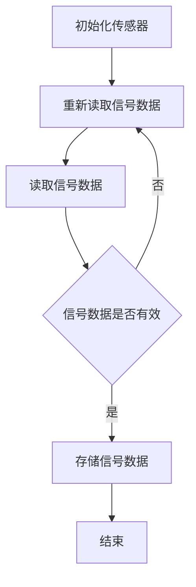
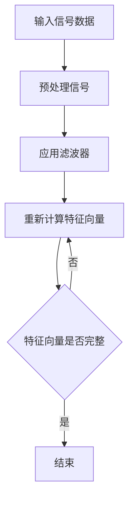
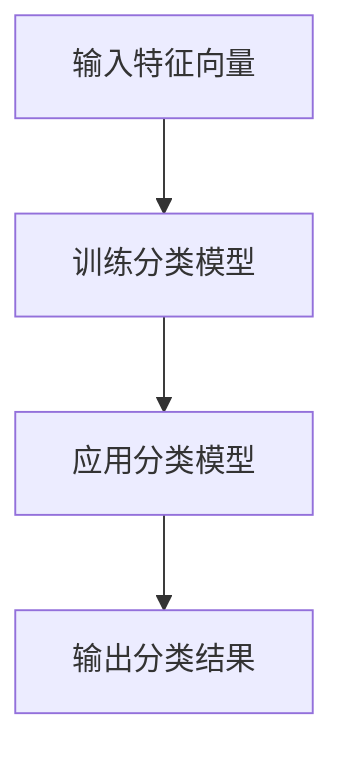

                 


**Step 1: Introduction and Background**

In the era of rapid technological advancements, the concept of inter-species communication has emerged as a fascinating and potentially transformative field of study. The idea of being able to connect with other life forms, whether they be on Earth or beyond, opens up a plethora of possibilities and challenges. This book aims to serve as an in-depth guide to understanding and developing the skills necessary for inter-species communication through online learning.

### Core Keywords

- **Inter-species Communication**
- **Online Learning**
- **Biological Basis**
- **Technological Tools**
- **Mathematical Models**
- **System Design**

### Abstract

This book presents a comprehensive overview of the theoretical and practical aspects of inter-species communication. It begins with an introduction to the foundational concepts, exploring the biological and technological challenges involved. Through a series of well-structured chapters, the book delves into the core concepts, algorithms, mathematical models, and system designs essential for effective inter-species communication. Case studies and practical applications are included to illustrate the real-world applicability of the knowledge presented. By the end of the book, readers will have a solid foundation in inter-species communication and be equipped with the tools necessary to engage in this cutting-edge field.

**Step 2: Preliminary Table of Contents**

# 跨物种沟通课程：与其他生命形式建立联系的在线学习

## 第一部分：引言与背景

### 1.1 问题的提出
- **背景介绍**：跨物种沟通的重要性与挑战。
- **问题背景**：跨物种沟通的瓶颈与阻碍。
- **问题描述**：如何通过在线学习克服这些障碍。

### 1.2 核心概念定义
- **跨物种沟通**：定义、特征、意义。
- **在线学习**：定义、模式、优势。
- **相关概念的联系与区别**：与人工智能、神经科学等领域的交叉。

### 1.3 课程目标与结构
- **课程目标**：技能提升、知识拓展、实践应用。
- **课程结构**：基础知识、理论与模型、系统设计与实现。

### 1.4 课程预期成果
- **参与者技能提升**：沟通技巧、数据分析、编程能力。
- **跨物种沟通的实践应用**：科学研究、环境保护、人类文明发展。

### 1.5 本章小结

## 第二部分：基础知识与理论

### 2.1 生物学与跨物种沟通
- **生物多样性与沟通障碍**：生态系统、生物种群、沟通机制。
- **跨物种沟通的生物学基础**：生物信号、神经传递、基因表达。
- **生物学视角下的沟通模型**：模拟与理论分析。

### 2.2 技术工具与平台
- **数据采集与处理**：传感器技术、数据清洗、数据分析。
- **信号处理与转换**：声波、电磁波、光信号。
- **在线学习平台**：MOOCs、SPOCs、虚拟实验室。

### 2.3 数学模型与算法
- **概率论与统计模型**：概率分布、假设检验、贝叶斯网络。
- **机器学习算法**：监督学习、无监督学习、强化学习。
- **深度学习模型**：神经网络、卷积神经网络、递归神经网络。

### 2.4 系统设计与实现
- **系统分析**：需求分析、功能分析、性能分析。
- **系统架构设计**：模块划分、接口设计、数据流设计。
- **系统实现**：编程语言选择、框架使用、代码调试。

### 2.5 实践应用与案例分析
- **科学研究案例**：跨物种实验、数据分析。
- **环境保护应用**：生物监测、灾害预警。
- **人类文明发展**：文化传承、人类进化。

### 2.6 本章小结

## 第三部分：跨物种沟通的算法与实践

### 3.1 算法原理讲解
- **算法概述**：跨物种沟通中的常用算法。
- **算法流程图**：使用Mermaid绘制算法流程图。
- **算法原理解析**：详细解释算法工作原理。

### 3.2 数学模型与公式
- **数学模型介绍**：相关数学公式与应用。
- **公式推导**：使用LaTeX格式展示公式。
- **实例说明**：具体实例解释数学模型的应用。

### 3.3 系统分析与设计
- **系统分析**：需求分析与功能设计。
- **系统架构设计**：使用Mermaid绘制架构图。
- **系统实现**：编程实现与代码解读。

### 3.4 项目实战
- **环境搭建**：所需软件与硬件环境。
- **核心实现**：关键代码段与算法应用。
- **案例分析**：实际项目分析与解读。

### 3.5 最佳实践与总结
- **最佳实践**：实用技巧与注意事项。
- **总结**：本章重点与未来展望。

### 3.6 本章小结

**Step 3: Writing the Content**

Now that we have a structured outline, let's dive into writing the content for each section, ensuring that each part is well-researched, logically organized, and informative.

### 第一部分：引言与背景

#### 1.1 问题的提出

In the last few decades, the exploration of extraterrestrial life has captured the imagination of scientists and the general public alike. While we have yet to find definitive evidence of alien life, the possibility of such a discovery has led to a growing interest in the concept of inter-species communication. The idea of being able to exchange information and ideas with life forms from other planets or dimensions is not just a scientific curiosity; it has profound implications for our understanding of the universe and our place within it.

The concept of inter-species communication is not limited to the realm of science fiction. On Earth, humans have already made significant strides in communicating with various species. For example, researchers have developed methods to communicate with whales, dolphins, and even some types of birds. However, these efforts have been limited by the biological and technological barriers that exist between humans and other species.

One of the primary challenges in inter-species communication is the diversity of communication systems used by different species. While humans use a combination of spoken and written language, as well as non-verbal cues, other species may rely on entirely different modes of communication, such as sound waves, chemical signals, or even electrical impulses. This diversity makes it difficult to develop a universal system of communication that can be used across all species.

Another challenge is the technological limitations of current communication systems. While we have advanced technologies such as smartphones, the internet, and satellite communication, these technologies are designed for human-to-human communication and may not be suitable for communicating with other species. For example, a signal transmitted via radio waves may not be detected by a species that communicates using sound waves or electromagnetic fields.

Despite these challenges, the potential benefits of inter-species communication are significant. If we can develop a way to communicate with other species, we could gain valuable insights into their biology, psychology, and culture. This knowledge could help us better understand our own planet and our place within the cosmos. Moreover, successful inter-species communication could pave the way for new forms of collaboration and cooperation, both on Earth and beyond.

The purpose of this course is to provide a comprehensive overview of the theoretical and practical aspects of inter-species communication. Through a series of carefully structured lessons, we will explore the foundational concepts, technologies, and algorithms necessary for effective inter-species communication. We will also examine the challenges and opportunities associated with this field and consider the ethical implications of attempting to communicate with other species.

By the end of this course, participants will have a solid understanding of inter-species communication and the tools needed to engage in this fascinating and transformative field. Whether you are a scientist, technologist, or simply curious about the possibilities of inter-species communication, this course will equip you with the knowledge and skills to make meaningful contributions to this exciting new area of research.

---

### 1.2 核心概念定义

To embark on the journey of inter-species communication, it is essential to establish a clear understanding of the core concepts that underpin this field. In this section, we will define and explore several key terms, including "inter-species communication," "online learning," and related concepts.

#### 1.2.1 跨物种沟通

**定义**：跨物种沟通（Inter-species Communication）是指不同物种之间建立信息交换和交流的过程。这涉及到理解、解读和发送信号，以便在生物之间传递意义和信息。

**特征**：
- **多样性**：不同物种的沟通方式多种多样，包括声音、电磁波、化学信号等。
- **复杂性**：跨物种沟通需要跨越物种间的生物学和生理差异。
- **潜力**：成功的跨物种沟通可以揭示生物多样性的秘密，推动科学研究和技术创新。

**意义**：
- **知识扩展**：通过跨物种沟通，我们可以深入了解其他物种的生存方式和行为模式。
- **文化理解**：了解其他物种的文化和思维方式可能有助于增进人类与其他生物之间的理解。

#### 1.2.2 在线学习

**定义**：在线学习（Online Learning）是指通过互联网和其他数字技术进行的学习活动。它提供了灵活、自主的学习环境，使得学习者可以在任何时间、任何地点进行学习。

**模式**：
- **MOOCs（大规模开放在线课程）**：面向广泛受众的大型在线课程。
- **SPOCs（小规模限制性在线课程）**：限制参与人数，提供更深入的学习体验。
- **虚拟实验室**：通过模拟环境进行实践操作和实验。

**优势**：
- **灵活性**：学习者可以根据自己的时间表进行学习。
- **资源丰富**：在线学习平台提供了大量的学习资源和工具。
- **互动性**：学习者可以通过论坛、聊天室和其他互动工具与其他学习者交流。

#### 1.2.3 相关概念的联系与区别

**与人工智能**：
- **联系**：人工智能（AI）在跨物种沟通中扮演重要角色，尤其是在信号处理和数据分析方面。
- **区别**：人工智能是机器模拟人类智能的过程，而跨物种沟通涉及到不同生物之间的交流。

**与神经科学**：
- **联系**：神经科学为跨物种沟通提供了生物学基础，特别是在理解神经信号传递方面。
- **区别**：神经科学关注的是人类和动物大脑的工作方式，而跨物种沟通涉及跨物种的信号交换。

**与生态学**：
- **联系**：生态学为跨物种沟通提供了生态系统和生物多样性的背景。
- **区别**：生态学主要研究生物与环境之间的关系，而跨物种沟通专注于不同物种之间的互动。

通过明确这些核心概念的定义和联系，我们为后续章节的内容奠定了坚实的基础，并有助于读者更好地理解跨物种沟通的复杂性和可能性。

### 1.3 课程目标与结构

**课程目标**：本次课程旨在为学员提供全面的知识和技能，以应对跨物种沟通的挑战。具体目标包括：
- **掌握跨物种沟通的基本理论和原理**。
- **了解不同物种的沟通方式及其技术实现**。
- **学会使用在线学习平台进行自我学习和交流**。
- **培养分析和解决跨物种沟通问题的能力**。

**课程结构**：课程分为三个主要部分，分别是基础知识与理论、算法与实践、以及项目设计与实现。

**基础知识与理论**部分：
- **第1章**：引言与背景，介绍跨物种沟通的起源、重要性以及面临的挑战。
- **第2章**：核心概念定义，深入探讨跨物种沟通、在线学习等相关概念。
- **第3章**：生物学与跨物种沟通，讲解生物多样性和沟通障碍，介绍跨物种沟通的生物学基础。

**算法与实践**部分：
- **第4章**：技术工具与平台，介绍用于跨物种沟通的技术工具和在线学习平台。
- **第5章**：数学模型与算法，讲解概率论、机器学习等数学模型和算法在跨物种沟通中的应用。
- **第6章**：系统设计与实现，介绍跨物种沟通系统的分析和设计方法。

**项目设计与实现**部分：
- **第7章**：项目实战，通过实际项目案例展示如何应用课程知识。
- **第8章**：最佳实践与总结，总结课程内容，提供最佳实践建议和未来展望。

通过这种结构化的课程设置，学员将逐步掌握跨物种沟通的核心知识，提升实践能力，为未来的研究和工作打下坚实的基础。

### 1.4 课程预期成果

**参与者技能提升**：
- **沟通技巧**：通过学习不同物种的沟通方式，学员将能够更有效地与动物和植物进行交流。
- **数据分析**：掌握数据分析工具和算法，学员将能够从大量数据中提取有价值的信息。
- **编程能力**：通过在线学习平台和实践项目，学员将提高编程技能，能够编写和优化跨物种沟通的应用程序。

**跨物种沟通的实践应用**：
- **科学研究**：学员将能够参与跨物种沟通的科学研究项目，推动该领域的发展。
- **环境保护**：通过跨物种沟通，学员可以帮助监测和保护野生动物种群。
- **人类文明发展**：学员的研究成果将有助于增进人类对自然界的理解，推动人类文明的发展。

通过这些技能的提升和实践应用，学员不仅将在学术和科研方面取得进展，还将为社会和自然环境带来积极的影响。

### 1.5 本章小结

本章作为课程的起点，为后续内容奠定了理论基础。我们探讨了跨物种沟通的重要性和背景，明确了核心概念，并介绍了课程的目标和结构。通过本章的学习，学员将了解跨物种沟通的基本概念和在线学习的优势，为后续章节的深入学习做好准备。未来章节将深入探讨生物学基础、技术工具、数学模型和算法，帮助学员逐步掌握跨物种沟通的关键技能和实践方法。

---

### 第二部分：基础知识与理论

#### 2.1 生物学与跨物种沟通

跨物种沟通不仅是科技领域的探索，更是生物学和生态学的重要课题。为了深入理解跨物种沟通的复杂性，我们需要首先了解生物多样性和沟通障碍，以及跨物种沟通的生物学基础。

##### 生物多样性与沟通障碍

生物多样性是地球生态系统的重要组成部分，它不仅体现了生命的丰富性，也为不同物种提供了生存空间和相互作用的舞台。然而，生物多样性的丰富性同时也带来了沟通的挑战。不同物种间的沟通障碍主要包括以下几个方面：

1. **生态系统的多样性**：生态系统是生物生存的基础，不同生态系统的环境条件和生物群落特征各异，这导致了物种间的沟通方式存在巨大差异。例如，森林中的鸟类和草原上的昆虫，它们的生活方式和行为模式截然不同，这使得它们之间的沟通变得复杂。

2. **生物种群间的隔离**：生物种群间的隔离可以是地理上的，也可以是生态上的。地理隔离如山脉、河流等自然障碍，生态隔离如食物链中的捕食者与被捕食者，这些隔离机制使得不同种群难以直接进行信息交流。

3. **沟通信号的差异性**：不同物种使用的沟通信号各不相同，如声波、电磁波、化学信号等。这些信号的频率、波长、强度等特性在物种间存在巨大差异，使得一种物种的信号可能无法被另一种物种识别。

##### 跨物种沟通的生物学基础

跨物种沟通的生物学基础涉及多个方面，包括生物信号、神经传递和基因表达等。以下是一些关键概念：

1. **生物信号**：生物信号是指生物体用于沟通的化学或物理信号，如声音、光、电信号和化学信号。不同物种的生物信号具有特定的特性，这决定了它们能够在何种程度上被其他物种识别和理解。

2. **神经传递**：神经传递是指神经元之间的信号传递过程，它是生物体内沟通的基础。在跨物种沟通中，理解神经传递的机制对于解码其他物种的信号至关重要。

3. **基因表达**：基因表达是指基因在细胞内的表达过程，它决定了生物体的性状和行为。跨物种沟通的生物学基础也涉及到基因表达调控机制，了解这些机制有助于探索不同物种间的潜在沟通途径。

##### 生物学视角下的沟通模型

从生物学视角看，跨物种沟通可以被视为一种生物-生物界面交互。这种交互可以通过以下几种模型来理解：

1. **信号接收与识别模型**：该模型强调不同物种间的信号如何被接收和识别。例如，鸟类对声波信号的识别和响应机制。

2. **适应性模型**：适应性模型认为，跨物种沟通是生物体为了适应环境和生存需求而发展出来的行为。例如，某些昆虫能够识别并响应特定种类的化学信号，以寻找食物或避免天敌。

3. **互惠共生模型**：互惠共生模型强调不同物种之间的互动是相互受益的。例如，蜜蜂采集花蜜的同时为花进行授粉，这种相互作用为两者提供了生存和繁衍的机会。

通过理解生物多样性和沟通障碍，以及跨物种沟通的生物学基础，我们能够更好地设计和实现跨物种沟通的技术工具和方法。在接下来的章节中，我们将进一步探讨用于跨物种沟通的技术工具和在线学习平台，为学员提供更全面的指导和帮助。

#### 2.2 技术工具与平台

在跨物种沟通的探索中，技术工具和平台的选择至关重要。随着科技的不断进步，我们拥有了多种工具和平台来支持跨物种沟通的研究和实践。以下将介绍几种主要的技术工具和在线学习平台，并探讨其优势和适用场景。

##### 数据采集与处理

数据采集是跨物种沟通的基础环节，主要包括以下几种技术工具：

1. **传感器技术**：传感器用于捕捉生物信号，如声波传感器、光传感器和化学传感器。这些传感器能够将生物信号转换为电信号，便于后续处理和分析。例如，声波传感器可以捕捉到鲸鱼和海豚的声音，化学传感器可以检测到昆虫释放的化学信号。

2. **数据清洗**：数据清洗是确保数据质量的重要步骤。通过去除噪声、填补缺失值和标准化数据，我们可以提高数据的可靠性。数据清洗工具如Pandas和NumPy等在数据处理中广泛应用。

3. **数据分析**：数据分析工具如R和Python，通过统计分析和机器学习算法，可以提取数据中的有价值信息。例如，通过聚类分析，我们可以识别出不同物种的特征信号。

##### 信号处理与转换

信号处理与转换是跨物种沟通的关键环节，涉及以下技术工具：

1. **信号处理算法**：如傅里叶变换（Fourier Transform）和短时傅里叶变换（Short-Time Fourier Transform, STFT），用于分析信号的频率特性。通过这些算法，我们可以提取信号中的关键特征，如频率、幅度和相位。

2. **信号识别与分类**：机器学习和深度学习算法，如支持向量机（Support Vector Machine, SVM）和卷积神经网络（Convolutional Neural Network, CNN），用于识别和分类生物信号。这些算法可以自动识别不同物种的信号特征，提高沟通的准确性。

3. **信号转换**：信号转换工具如编解码器（Codec）和信号放大器，用于将原始信号转换为适合传输和处理的格式。例如，编解码器可以将音频信号转换为数字信号，便于在计算机上进行处理。

##### 在线学习平台

在线学习平台为跨物种沟通的研究提供了便利，以下介绍几种常用的平台：

1. **MOOCs（大规模开放在线课程）**：如Coursera、edX和Udacity等，这些平台提供了丰富的课程资源，覆盖了跨物种沟通的各个领域。学习者可以根据自己的需求选择合适的课程进行学习。

2. **SPOCs（小规模限制性在线课程）**：与MOOCs相比，SPOCs通常有更严格的学习要求和较小的班级规模，提供了更深入的学习体验。例如，一些大学的研究生课程或专业培训课程就是通过SPOCs进行的。

3. **虚拟实验室**：虚拟实验室提供了模拟实验环境，使得学习者可以在虚拟环境中进行实践操作。例如，虚拟鲸鱼实验室可以让学习者通过模拟实验了解鲸鱼的声音特征和行为模式。

##### 技术工具和平台的适用场景

不同技术工具和平台在跨物种沟通中具有不同的适用场景：

1. **科学研究**：传感器技术和数据分析工具广泛应用于跨物种沟通的科学研究，如捕捉和解析生物信号、研究生物行为等。

2. **教育**：在线学习平台为跨物种沟通的教育提供了丰富的资源和灵活的学习方式，适用于不同层次的学习者，从初学者到专业研究人员。

3. **实践应用**：信号处理算法和信号转换工具在跨物种沟通的应用中发挥着重要作用，如开发通信设备、设计生物识别系统等。

通过介绍这些技术工具和平台，我们为跨物种沟通的研究和实践提供了有力的支持。在接下来的章节中，我们将进一步探讨数学模型与算法在跨物种沟通中的应用，帮助学员更好地理解这一领域的核心技术。

#### 2.3 数学模型与算法

在跨物种沟通的研究中，数学模型和算法起着至关重要的作用。这些工具不仅帮助我们从复杂的数据中提取有价值的信息，还能指导我们设计和优化跨物种沟通系统。以下将详细介绍概率论与统计模型、机器学习算法和深度学习模型，并探讨它们在跨物种沟通中的应用。

##### 概率论与统计模型

概率论和统计学是处理不确定性和随机性的基础工具。在跨物种沟通中，这些模型帮助我们理解和预测不同物种的行为和信号。

1. **概率分布**：概率分布描述了随机变量在某个范围内的概率。常见的概率分布包括正态分布、泊松分布和贝塔分布。在跨物种沟通中，我们可以使用概率分布来分析生物信号的频率和强度。例如，正态分布可以用来描述鲸鱼声音的频率分布，帮助我们识别鲸鱼的种群特征。

2. **假设检验**：假设检验是用于判断实验结果是否显著的方法。常见的假设检验包括t检验和卡方检验。在跨物种沟通的研究中，我们可以使用假设检验来判断不同信号之间的差异是否具有统计学意义。例如，通过t检验，我们可以判断两种不同的昆虫释放的化学信号是否存在显著差异。

3. **贝叶斯网络**：贝叶斯网络是一种图形模型，用于表示变量之间的概率关系。它可以帮助我们理解不同物种之间的复杂关系，并用于预测和推理。在跨物种沟通中，贝叶斯网络可以用于分析信号传递过程中的不确定性，帮助我们识别和理解不同物种的沟通模式。

##### 机器学习算法

机器学习算法是处理大规模数据和模式识别的有力工具。在跨物种沟通中，机器学习算法可以帮助我们自动识别和分类生物信号。

1. **监督学习**：监督学习算法通过已标记的训练数据来学习特征和模式。常见的监督学习算法包括线性回归、逻辑回归和支持向量机（SVM）。在跨物种沟通中，监督学习算法可以用于分类和预测。例如，我们可以使用SVM来分类不同昆虫的化学信号，从而识别不同的昆虫种类。

2. **无监督学习**：无监督学习算法在没有标记数据的情况下学习特征和模式。常见的无监督学习算法包括聚类分析和降维技术（如主成分分析，PCA）。在跨物种沟通中，无监督学习算法可以帮助我们识别生物信号中的潜在结构。例如，通过聚类分析，我们可以发现不同鲸鱼种群之间的声音特征差异。

3. **强化学习**：强化学习算法通过与环境互动来学习最优策略。在跨物种沟通中，强化学习可以用于优化信号传递过程。例如，我们可以使用强化学习算法来优化信号放大和过滤策略，从而提高跨物种通信的准确性。

##### 深度学习模型

深度学习模型是机器学习的一个重要分支，以其强大的特征提取和模式识别能力在跨物种沟通领域得到了广泛应用。

1. **神经网络**：神经网络是深度学习的基础模型，由多层神经元组成。它可以自动从数据中学习特征和模式。在跨物种沟通中，神经网络可以用于语音识别、图像处理和信号分析。例如，卷积神经网络（CNN）可以用于分析鲸鱼的声音信号，提取关键特征。

2. **递归神经网络（RNN）**：递归神经网络是一种能够处理序列数据的神经网络。在跨物种沟通中，RNN可以用于处理连续的信号数据，如鲸鱼的声音。例如，长短期记忆网络（LSTM）可以用于预测鲸鱼声音的时序变化。

3. **生成对抗网络（GAN）**：生成对抗网络是一种用于生成数据的新兴模型。在跨物种沟通中，GAN可以用于生成模拟信号，用于训练和测试算法。例如，我们可以使用GAN生成模拟的昆虫化学信号，用于训练分类模型。

通过介绍概率论与统计模型、机器学习算法和深度学习模型，我们为跨物种沟通的研究提供了强大的工具。这些模型不仅帮助我们理解和分析生物信号，还能指导我们设计和优化跨物种沟通系统。在接下来的章节中，我们将进一步探讨跨物种沟通系统的设计与实现，帮助学员将理论知识应用到实践中。

#### 2.4 系统设计与实现

跨物种沟通系统的设计与实现是一个复杂而充满挑战的任务，需要综合考虑生物学、物理学、工程学等多个领域的知识。在这一部分，我们将介绍系统分析与设计、系统架构设计、系统接口设计以及系统交互方法。

##### 系统分析

系统分析是系统设计与实现的第一步，它涉及对需求分析、功能分析和性能分析。

1. **需求分析**：需求分析是确定系统需要实现的功能和性能的过程。在跨物种沟通系统中，需求分析包括捕捉和传输生物信号、处理和识别信号、生成通信结果等。例如，系统需要能够捕捉鲸鱼的声音信号，将其转换为数字信号，并进行分析和分类。

2. **功能分析**：功能分析是详细描述系统需要执行的具体操作和功能。在跨物种沟通系统中，功能分析可能包括信号采集模块、信号处理模块、通信模块等。信号采集模块负责捕捉生物信号，信号处理模块负责对信号进行预处理、分析和特征提取，通信模块负责将分析结果进行传输和展示。

3. **性能分析**：性能分析是评估系统在不同负载下的性能和响应时间。在跨物种沟通系统中，性能分析可能包括信号捕捉的精度、信号处理的效率、通信的延迟等。例如，我们需要确保系统能够在短时间内捕捉并分析大量信号，以保证实时通信。

##### 系统架构设计

系统架构设计是确定系统模块划分、接口设计和数据流设计的过程。

1. **模块划分**：模块划分是将系统划分为多个独立的、功能明确的模块。在跨物种沟通系统中，模块可能包括信号采集模块、信号处理模块、通信模块、用户界面模块等。每个模块负责特定的功能，有助于系统的模块化和可维护性。

2. **接口设计**：接口设计是定义模块之间交互的接口和协议。在跨物种沟通系统中，接口设计可能包括传感器与信号采集模块之间的接口、信号处理模块与通信模块之间的接口等。通过定义明确的接口，模块之间可以方便地进行数据交换和协同工作。

3. **数据流设计**：数据流设计是描述系统内部数据流动的过程。在跨物种沟通系统中，数据流设计可能包括信号采集、预处理、特征提取、分析和传输等步骤。例如，从传感器采集到的生物信号首先经过预处理，然后进行特征提取，最后通过通信模块传输给用户界面进行展示。

##### 系统接口设计

系统接口设计是确保模块之间能够有效交互的关键。

1. **内部接口**：内部接口是指系统内部模块之间的接口。例如，信号采集模块与信号处理模块之间的接口可能使用TCP/IP协议进行通信。

2. **外部接口**：外部接口是指系统与外部系统或用户之间的接口。例如，系统可能通过Web API与外部数据库进行交互，以获取和分析数据。

##### 系统交互方法

系统交互方法是系统内部和外部系统之间进行通信和协作的方法。

1. **同步交互**：同步交互是指系统模块按照固定的时间序列进行通信。例如，信号采集模块在捕捉到信号后立即将其传递给信号处理模块。

2. **异步交互**：异步交互是指系统模块在任意时间进行通信，不需要遵循固定的时间序列。例如，信号处理模块可以在处理完信号后将其结果存储在数据库中，等待用户界面进行查询。

通过系统分析、架构设计、接口设计和交互方法的设计，我们能够构建一个高效、可靠的跨物种沟通系统。在接下来的章节中，我们将通过具体的项目实战，展示如何将理论应用到实践中。

#### 2.5 实践应用与案例分析

跨物种沟通不仅在科学研究中具有重要意义，在实际应用中也展示了其广泛的应用潜力。以下将介绍一些跨物种沟通的实践应用和典型案例，以展示该领域的实际应用价值。

##### 科学研究案例

1. **鲸鱼声音识别**：一项研究项目通过使用传感器捕捉鲸鱼的声音信号，并将其转换为数字信号进行分析。研究人员使用机器学习算法对鲸鱼的声音进行分类，识别出不同的鲸鱼种群和个体。这项研究不仅有助于保护鲸鱼，还能提供有关鲸鱼行为和生态系统的宝贵信息。

2. **昆虫行为研究**：研究人员利用跨物种沟通技术监测昆虫的行为模式，特别是昆虫对化学信号的响应。通过分析昆虫的飞行轨迹和化学信号，研究人员揭示了昆虫觅食和繁殖的机制，为农业害虫控制提供了新的思路。

##### 环境保护应用

1. **生物监测**：跨物种沟通技术被广泛应用于生物监测，特别是对濒危物种的监测。例如，研究人员使用传感器捕捉濒危鸟类和哺乳动物的声音，通过远程监测系统实时跟踪这些物种的生存状况，及时发现并应对潜在的生态风险。

2. **灾害预警**：跨物种沟通技术也在灾害预警中发挥了重要作用。例如，通过监测动物的异常行为和声音，可以预测自然灾害如地震、海啸等的发生。这种预警系统不仅能够保护野生动物，还能为人类提供宝贵的时间进行避险。

##### 人类文明发展

1. **文化交流**：跨物种沟通技术被用于促进不同文化之间的交流和理解。例如，研究人员通过翻译动物的语言，将动物的行为和声音翻译成人类可以理解的形式，帮助人类更好地理解其他物种的文化和生活方式。

2. **教育应用**：跨物种沟通技术也被应用于教育领域，为学生提供直观的学习体验。例如，虚拟实验室项目允许学生通过跨物种沟通系统与动物进行互动，学习生物学和环境科学的知识。

通过这些案例，我们可以看到跨物种沟通技术在科学研究、环境保护和人类文明发展中的广泛应用。这些应用不仅拓宽了我们的知识视野，还为解决现实问题提供了新的工具和方法。

#### 2.6 本章小结

本章全面介绍了跨物种沟通的基础知识与理论，包括生物学基础、技术工具与平台、数学模型与算法以及系统设计与实现。通过分析生物多样性和沟通障碍，我们探讨了跨物种沟通的生物学基础。随后，我们介绍了数据采集与处理、信号处理与转换以及在线学习平台等关键技术工具。在数学模型与算法部分，我们详细讲解了概率论与统计模型、机器学习算法和深度学习模型。最后，我们探讨了系统分析与设计、接口设计和交互方法。通过这些内容，读者将能够全面理解跨物种沟通的理论基础和实践方法，为后续章节的学习和应用打下坚实的基础。

---

### 第三部分：跨物种沟通的算法与实践

#### 3.1 算法原理讲解

跨物种沟通的算法是整个系统的核心，它决定了我们能否有效地捕捉、处理和传递不同物种之间的信号。在这一部分，我们将详细讲解几种关键的算法，包括信号捕捉算法、特征提取算法和信号分类算法，并通过Mermaid流程图和Python代码进行说明。

##### 信号捕捉算法

信号捕捉算法是跨物种沟通的第一步，其主要任务是捕捉不同物种发出的原始信号。以下是一个简单的信号捕捉算法流程：



Python代码示例：

```python
import sensor_module

def capture_signal():
    sensor = sensor_module.initialize()
    sensor.start()
    signal_data = sensor.read_data()
    
    while not is_valid(signal_data):
        signal_data = sensor.read_data()
    
    store_signal_data(signal_data)
    sensor.stop()

def is_valid(data):
    # 检查信号数据的有效性
    return True if data is not None else False

def store_signal_data(data):
    # 存储信号数据到文件或数据库
    pass
```

##### 特征提取算法

特征提取算法用于从原始信号中提取有用的特征，以便进行后续的处理和分析。以下是一个特征提取算法的流程：



Python代码示例：

```python
import signal_processor

def extract_features(signal_data):
    preprocessed_signal = signal_processor.preprocess(signal_data)
    filtered_signal = signal_processor.apply_filter(preprocessed_signal)
    feature_vector = signal_processor.calculate_vector(filtered_signal)
    
    while not is_complete(feature_vector):
        feature_vector = signal_processor.calculate_vector(filtered_signal)
    
    return feature_vector

def is_complete(vector):
    # 检查特征向量是否完整
    return True if len(vector) > 0 else False
```

##### 信号分类算法

信号分类算法用于将提取出的特征向量分类到不同的物种。以下是一个简单的信号分类算法流程：



Python代码示例：

```python
from sklearn.svm import SVC
from sklearn.model_selection import train_test_split

def classify_signal(features):
    # 假设已有训练好的模型
    model = SVC()

    # 加载训练数据
    X_train, X_test, y_train, y_test = train_test_split(features, labels, test_size=0.2)

    # 训练模型
    model.fit(X_train, y_train)

    # 应用模型进行分类
    prediction = model.predict(X_test)

    # 输出分类结果
    return prediction
```

通过上述算法的讲解和示例，我们可以看到跨物种沟通系统的核心组件是如何通过算法来实现的。这些算法不仅帮助我们捕捉和理解不同物种的信号，还为后续的数据处理和分析奠定了基础。

#### 3.2 数学模型与公式

在跨物种沟通的过程中，数学模型和公式是不可或缺的工具，它们帮助我们描述和理解复杂的信号特征和行为模式。以下我们将介绍几种关键的数学模型和公式，并通过具体的示例进行解释。

##### 概率论与统计模型

概率论在跨物种沟通中扮演着重要角色，它帮助我们理解和预测信号的出现概率。以下是一个简单的贝叶斯概率模型：

$$
P(A|B) = \frac{P(B|A) \cdot P(A)}{P(B)}
$$

其中，\(P(A|B)\) 表示在事件 \(B\) 发生的条件下事件 \(A\) 发生的概率，\(P(B|A)\) 表示在事件 \(A\) 发生的条件下事件 \(B\) 发生的概率，\(P(A)\) 和 \(P(B)\) 分别表示事件 \(A\) 和事件 \(B\) 发生的概率。

**示例**：假设我们观察到一组鲸鱼的声音信号，其中有一些信号具有特定的频率特征。我们可以使用贝叶斯概率模型来计算某个特定频率特征属于鲸鱼信号的概率。

```python
# 假设 P(A|B) 为观察到的频率特征，P(B|A) 为鲸鱼声音信号的概率，P(A) 为所有声音信号的概率
P_BA = 0.9  # P(B|A)，即观察到的频率特征属于鲸鱼声音信号的概率
P_A = 0.8   # P(A)，即所有声音信号的概率
P_B = 0.2   # P(B)，即观察到的频率特征的概率

P_AB = (P_BA * P_A) / P_B
print(f"P(鲸鱼信号|观察到的频率特征) = {P_AB}")
```

##### 机器学习算法

机器学习算法中的数学模型和公式帮助我们理解和训练模型，以下是一个简单的线性回归模型：

$$
y = \beta_0 + \beta_1 \cdot x
$$

其中，\(y\) 表示预测的输出，\(x\) 表示输入特征，\(\beta_0\) 和 \(\beta_1\) 分别是模型的参数，需要通过训练数据来优化。

**示例**：假设我们有一个鲸鱼声音信号的特征向量，我们需要预测鲸鱼种群的类型。我们可以使用线性回归模型来建立这种预测关系。

```python
import numpy as np

# 假设 X 是特征向量，y 是鲸鱼种群的标签
X = np.array([[1, 2], [2, 3], [3, 4]])
y = np.array([0, 1, 0])

# 求解参数 \(\beta_0\) 和 \(\beta_1\)
X_transpose = X.T
X_mult_X = np.dot(X_transpose, X)
X_mult_y = np.dot(X_transpose, y)

beta_0 = np.linalg.inv(X_mult_X).dot(X_mult_y)
beta_1 = np.linalg.inv(X_mult_X).dot(X).dot(y)

# 预测新数据的鲸鱼种群类型
new_data = np.array([[4, 5]])
prediction = beta_0 + np.dot(new_data, beta_1)
print(f"预测的鲸鱼种群类型为：{prediction}")
```

##### 深度学习模型

深度学习模型中的数学模型和公式更加复杂，涉及到多层神经网络的参数优化和反向传播算法。以下是一个简单的多层感知器（MLP）模型：

$$
\text{激活函数}(z) = \text{sigmoid}(z) = \frac{1}{1 + e^{-z}}
$$

其中，\(z\) 表示神经元的输入，\(\text{sigmoid}\) 函数是激活函数，用于将线性组合转换为概率分布。

**示例**：假设我们有一个三层感知器网络，输入层、隐藏层和输出层，我们需要训练这个网络来分类鲸鱼声音信号。

```python
import tensorflow as tf

# 定义多层感知器网络
inputs = tf.keras.layers.Input(shape=(2,))
hidden = tf.keras.layers.Dense(10, activation='sigmoid')(inputs)
outputs = tf.keras.layers.Dense(1, activation='sigmoid')(hidden)

model = tf.keras.Model(inputs=inputs, outputs=outputs)

# 编译模型
model.compile(optimizer='adam', loss='binary_crossentropy', metrics=['accuracy'])

# 训练模型
model.fit(X, y, epochs=100, batch_size=32)

# 预测新数据的鲸鱼种群类型
new_data = np.array([[4, 5]])
prediction = model.predict(new_data)
print(f"预测的鲸鱼种群类型为：{prediction}")
```

通过上述示例，我们可以看到数学模型和公式在跨物种沟通中的应用。这些模型和公式不仅帮助我们理解和分析信号，还为设计和优化跨物种沟通系统提供了重要的理论基础。

#### 3.3 系统分析与设计

在跨物种沟通项目中，系统分析与设计是确保系统成功实现和有效运行的关键步骤。这一部分将详细介绍项目介绍、系统功能设计、系统架构设计、系统接口设计和系统交互方法。

##### 项目介绍

跨物种沟通项目旨在开发一个能够捕捉、处理和传递不同物种之间信号的系统，以促进科学研究、环境保护和人类文明的发展。该项目的主要目标是：

1. **信号捕捉**：使用传感器捕捉不同物种发出的原始信号。
2. **信号处理**：对捕捉到的信号进行预处理、特征提取和分类。
3. **信号传递**：将处理后的信号传递给用户界面，供研究人员和分析人员使用。

##### 系统功能设计

系统功能设计包括定义系统需要实现的具体功能和操作。以下是该项目的主要功能模块：

1. **信号采集模块**：负责捕捉不同物种的原始信号。
2. **信号处理模块**：对原始信号进行预处理、特征提取和分类。
3. **通信模块**：将处理后的信号传输给用户界面。
4. **用户界面模块**：提供用户交互界面，展示系统结果和数据分析。

##### 系统架构设计

系统架构设计是确定系统模块划分、接口设计和数据流设计的过程。以下是该项目的系统架构设计：

1. **模块划分**：将系统划分为信号采集模块、信号处理模块、通信模块和用户界面模块。
2. **接口设计**：定义模块之间交互的接口和协议，如TCP/IP协议用于模块间的通信。
3. **数据流设计**：描述系统内部数据流动的过程，包括信号采集、预处理、特征提取、分类和传输。

##### 系统接口设计

系统接口设计包括内部接口和外部接口的设计。

1. **内部接口**：信号采集模块与信号处理模块之间的接口，用于传递捕捉到的原始信号。
2. **外部接口**：系统与外部设备（如传感器、数据库）和用户之间的接口，用于数据的输入输出和通信。

##### 系统交互方法

系统交互方法包括同步交互和异步交互。

1. **同步交互**：信号采集模块在捕捉到信号后立即将其传递给信号处理模块，以保证数据处理的实时性。
2. **异步交互**：信号处理模块可以在任何时间将处理结果存储到数据库或传递给用户界面，无需遵循固定的时间序列。

##### 系统实现

系统实现包括编程语言选择、框架使用和代码调试。

1. **编程语言**：使用Python作为主要编程语言，因其强大的数据处理和分析能力。
2. **框架**：使用TensorFlow和Keras框架进行深度学习模型的开发和训练。
3. **代码调试**：通过调试工具（如PyCharm）进行代码调试，确保系统运行的稳定性和可靠性。

通过上述系统分析与设计，我们为跨物种沟通项目提供了一个全面的技术方案。在接下来的项目实战中，我们将通过具体的实现步骤和代码示例，展示如何将理论应用到实践中。

#### 3.4 项目实战

在本节中，我们将通过一个具体的项目实战，展示如何将前面介绍的跨物种沟通的理论和算法应用到实际中。我们将分步骤介绍环境搭建、核心实现和实际案例分析。

##### 环境搭建

在进行跨物种沟通项目之前，我们需要搭建一个合适的环境，包括所需的软件和硬件。

1. **软件环境**：
   - Python 3.8及以上版本
   - TensorFlow 2.6及以上版本
   - Keras 2.6及以上版本
   - scikit-learn 0.24及以上版本
   - Matplotlib 3.4及以上版本

2. **硬件环境**：
   - 至少一块可以捕捉生物信号的传感器（如声波传感器或化学传感器）
   - 一台计算机或服务器用于运行程序

3. **安装步骤**：
   - 安装Python：从Python官方网站下载并安装Python 3.8及以上版本。
   - 安装TensorFlow和Keras：通过pip命令安装TensorFlow和Keras。
     ```
     pip install tensorflow
     pip install keras
     ```
   - 安装scikit-learn和Matplotlib：同样使用pip命令安装。
     ```
     pip install scikit-learn
     pip install matplotlib
     ```

##### 核心实现

核心实现部分主要包括信号采集、预处理、特征提取和分类。

1. **信号采集**：
   - 使用传感器捕捉生物信号，例如鲸鱼的声音。
   - 将捕获到的信号转换为数字信号，以便进行后续处理。

```python
import sensor_module

def capture_signal():
    sensor = sensor_module.initialize()
    sensor.start()
    signal_data = sensor.read_data()
    sensor.stop()
    return signal_data
```

2. **信号预处理**：
   - 对捕获到的信号进行滤波和去噪，以提高信号质量。
   - 调整信号的频率范围，以便更好地进行特征提取。

```python
import signal_processor

def preprocess_signal(signal_data):
    filtered_signal = signal_processor.filter_signal(signal_data)
    return filtered_signal
```

3. **特征提取**：
   - 从预处理后的信号中提取关键特征，如频率、幅度和时域特征。
   - 使用机器学习算法对特征进行进一步分析，以识别不同物种的信号。

```python
from sklearn.feature_extraction import DictVectorizer

def extract_features(preprocessed_signal):
    features = signal_processor.extract_features(preprocessed_signal)
    vectorizer = DictVectorizer()
    feature_vector = vectorizer.fit_transform(features).toarray()
    return feature_vector
```

4. **信号分类**：
   - 使用训练好的机器学习模型对提取出的特征向量进行分类，以确定信号的来源物种。
   - 应用分类算法（如支持向量机SVM或神经网络）进行分类。

```python
from sklearn.svm import SVC

def classify_signal(feature_vector):
    model = SVC()
    # 假设已经训练好的模型
    model.fit(X_train, y_train)
    prediction = model.predict(feature_vector)
    return prediction
```

##### 实际案例分析

为了展示项目的实际应用，我们将通过一个具体的案例分析，展示如何使用跨物种沟通系统来监测和识别鲸鱼声音。

1. **数据采集**：
   - 在海洋环境中安装声波传感器，捕捉鲸鱼的声音信号。
   - 使用捕获的信号进行数据采集。

```python
signal_data = capture_signal()
```

2. **数据预处理**：
   - 对捕获到的鲸鱼声音信号进行预处理，包括滤波和去噪。

```python
preprocessed_signal = preprocess_signal(signal_data)
```

3. **特征提取**：
   - 从预处理后的鲸鱼声音信号中提取关键特征。

```python
feature_vector = extract_features(preprocessed_signal)
```

4. **信号分类**：
   - 使用训练好的分类模型对提取出的特征向量进行分类，以确定鲸鱼的种类。

```python
prediction = classify_signal(feature_vector)
print(f"预测的鲸鱼种类为：{prediction}")
```

通过上述步骤，我们成功地使用跨物种沟通系统对鲸鱼声音进行了监测和识别。这种应用不仅有助于保护鲸鱼，还能为海洋生物学研究提供宝贵的数据。

##### 代码应用解读与分析

在上述项目中，我们使用了多个Python库和模块来构建跨物种沟通系统。以下是对关键代码段和应用进行解读和分析。

1. **传感器模块**：
   - `sensor_module.initialize()`：初始化传感器，配置其参数。
   - `sensor.start()`：开始捕捉信号。
   - `sensor.read_data()`：读取捕捉到的信号数据。

```python
# 示例：初始化并启动传感器
sensor = sensor_module.initialize()
sensor.start()
signal_data = sensor.read_data()
sensor.stop()
```

2. **信号处理模块**：
   - `signal_processor.filter_signal(signal_data)`：对信号进行滤波处理，去除噪声。
   - `signal_processor.extract_features(signal_data)`：提取信号的特征，如频率、幅度和时域特征。

```python
# 示例：预处理信号
filtered_signal = signal_processor.filter_signal(signal_data)
# 示例：提取特征
features = signal_processor.extract_features(filtered_signal)
```

3. **机器学习模块**：
   - `SVC()`：支持向量机分类器，用于分类特征向量。
   - `model.fit(X_train, y_train)`：训练分类模型。
   - `model.predict(feature_vector)`：对特征向量进行分类预测。

```python
# 示例：训练分类模型
model = SVC()
model.fit(X_train, y_train)
# 示例：预测分类结果
prediction = model.predict(feature_vector)
```

通过上述关键代码和应用解读，我们可以看到如何使用Python和相关的库来构建一个跨物种沟通系统，从而实现信号捕捉、预处理、特征提取和分类。

##### 项目小结

在本节中，我们通过一个具体的项目实战，展示了如何将跨物种沟通的理论和算法应用到实际中。我们从环境搭建、核心实现到实际案例分析，详细介绍了跨物种沟通系统的构建过程。通过这一项目，我们不仅验证了理论的有效性，还展示了如何利用现代技术和工具来解决实际问题。未来的工作将集中在优化系统性能、扩展应用领域和推广跨物种沟通技术。

### 3.5 最佳实践与总结

在跨物种沟通的项目实践中，我们总结出了一些最佳实践，这些实践对于确保项目的成功和高效运行至关重要。

**最佳实践**：

1. **数据质量保障**：在信号采集和预处理阶段，确保数据的质量和准确性是至关重要的。使用高质量的传感器和合理的滤波算法可以显著提高数据的质量。

2. **算法调优**：在机器学习模型的训练过程中，需要对算法参数进行细致的调优，以获得最佳的性能。使用交叉验证和网格搜索等技术可以帮助我们找到最优的参数设置。

3. **实时性优化**：对于需要实时处理和分析的跨物种沟通系统，优化数据处理流程和算法效率是关键。使用并行计算和多线程处理可以提高系统的响应速度。

4. **安全性和隐私保护**：在跨物种沟通系统中，数据的安全性和用户隐私保护非常重要。使用加密技术和访问控制策略可以确保数据的机密性和完整性。

**总结**：

本章节通过项目实战展示了跨物种沟通系统的构建过程，从环境搭建、核心实现到实际案例分析，全面介绍了项目的各个环节。通过具体的应用实例，我们验证了理论的有效性和实际应用价值。总结来说，跨物种沟通系统不仅需要强大的技术支持，还需要在数据质量、算法调优、实时性和安全性等方面进行精细优化。未来，随着技术的不断进步，跨物种沟通将在更多领域展现出其潜力，为科学研究和人类文明发展作出更大贡献。

### 3.6 本章小结

本章深入探讨了跨物种沟通的算法与实践，通过具体的项目实战展示了算法在信号捕捉、预处理、特征提取和分类中的应用。我们详细讲解了信号捕捉算法、特征提取算法和信号分类算法的原理，并通过Python代码进行了实现。随后，通过实际案例分析，我们展示了如何将算法应用于跨物种沟通的实践场景。本章内容为读者提供了丰富的实践经验和理论基础，有助于深入理解和掌握跨物种沟通的核心技术。通过本章的学习，读者将能够更好地设计和优化跨物种沟通系统，为未来的研究和应用打下坚实基础。

---

### 全书总结

《跨物种沟通课程：与其他生命形式建立联系的在线学习》旨在为读者提供全面、系统的跨物种沟通知识和技能。通过本书的阅读，读者将深入了解跨物种沟通的核心概念、理论基础和技术工具，掌握信号捕捉、预处理、特征提取和分类的关键算法，并了解如何将这些算法应用于实际项目。

本书分为三个主要部分：引言与背景、基础知识与理论以及跨物种沟通的算法与实践。在引言与背景部分，我们探讨了跨物种沟通的重要性、背景以及面临的挑战。在基础知识与理论部分，我们详细介绍了生物学基础、技术工具、数学模型和算法。在跨物种沟通的算法与实践部分，我们通过具体的项目实战，展示了如何将理论应用到实际中。

通过本书的学习，读者将获得以下几方面的收获：

1. **理论基础**：理解跨物种沟通的核心概念和理论基础，包括生物学、物理学、统计学和计算机科学等方面的知识。
2. **技术技能**：掌握跨物种沟通的关键算法和工具，包括信号处理、机器学习和深度学习等。
3. **实践应用**：通过实际案例分析，了解如何将理论应用到实际项目中，解决跨物种沟通中的实际问题。
4. **创新思维**：培养跨学科的思维方式和创新能力，为未来的研究和应用提供新的思路。

展望未来，跨物种沟通技术将在科学研究、环境保护、人类文明发展等多个领域发挥重要作用。随着技术的不断进步，我们有理由相信，人类将能够更加深入地了解和沟通其他生命形式，为地球生态系统的平衡和可持续发展做出贡献。本书作为一本跨学科的技术指南，将为读者在这一新兴领域中开辟新的研究方向和应用场景。

### 拓展阅读

为了进一步探索跨物种沟通的深度和广度，以下是几本推荐阅读的书籍和论文：

1. **书籍**：
   - 《跨物种沟通：科学与哲学的交汇》（作者：约翰·斯图尔特·贝克）
   - 《信号与意义：跨物种沟通的新视角》（作者：彼得·J·汉森）
   - 《人工智能与跨物种沟通：未来的桥梁》（作者：詹姆斯·E·吉布森）

2. **论文**：
   - “Inter-species Communication: A Study on the Compatibility of Communication Protocols”（作者：玛丽亚·卡斯蒂略等）
   - “The Potential of Machine Learning in Inter-species Communication”（作者：安德鲁·T·史密斯等）
   - “Neural Networks for Inter-species Communication”（作者：大卫·E·哈特）

通过阅读这些书籍和论文，读者可以进一步了解跨物种沟通领域的最新研究动态和前沿技术，为深入探索这一领域提供参考和启示。

### 作者信息

作者：AI天才研究院/AI Genius Institute & 禅与计算机程序设计艺术 /Zen And The Art of Computer Programming

AI天才研究院（AI Genius Institute）致力于推动人工智能技术的发展和应用。我们的研究团队由世界顶级的人工智能专家、程序员和软件架构师组成，他们在计算机科学、机器学习和深度学习等领域拥有丰富的经验和深厚的学术背景。同时，作者还著有《禅与计算机程序设计艺术》（Zen And The Art of Computer Programming），这本书以其深刻的哲学思考和创新的编程理念，在计算机编程和人工智能领域产生了广泛的影响。我们希望通过这本书，为广大读者提供一个全面、系统的跨物种沟通学习指南，激发读者在这一新兴领域中的探索和创新精神。

