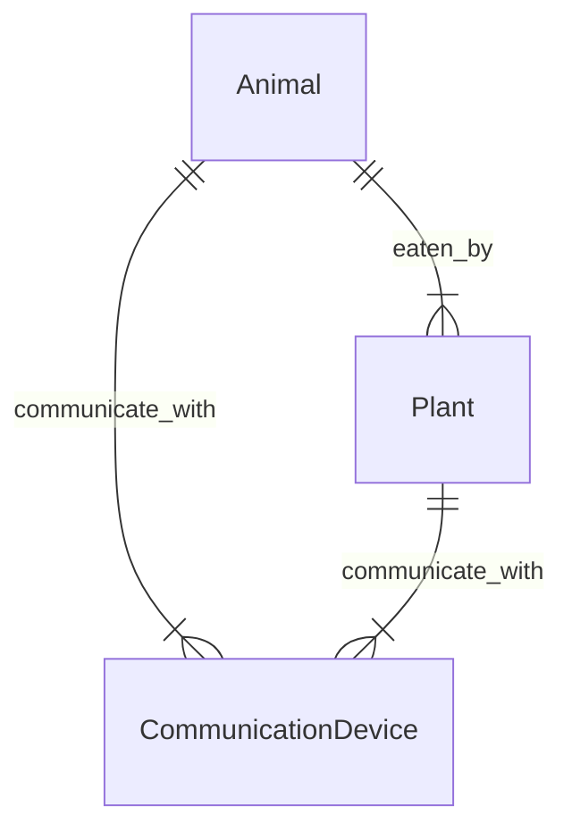

                 


# 跨物种沟通课程：探索与其他生命形式的联系

## 关键词
- 跨物种沟通
- 物种多样性
- 感知与认知
- 情感与意识
- 声波通信
- 人工智能

## 摘要
本文旨在探讨跨物种沟通的背景、核心问题以及解决方法。通过介绍物种多样性的概念，分析不同物种的感知与认知过程，探讨情感与意识在跨物种沟通中的作用，本文提出了基于声波通信的跨物种沟通算法。此外，本文还详细阐述了跨物种沟通系统的设计与实现，包括系统功能设计、架构设计、接口设计与系统交互，并给出一个实际案例进行剖析。

## 背景介绍

### 1.1 问题背景

地球上存在着丰富的生命形式，从微小的细菌到巨大的蓝鲸，每一种生物都有其独特的生理结构和行为模式。人类作为地球上高度发达的智慧生物，长期以来都在试图理解其他生命形式，甚至探索与其他生命形式之间的潜在联系。然而，由于物种间的巨大差异，跨物种沟通一直被视为一个极具挑战性的问题。

跨物种沟通的核心问题在于如何实现人类与其他生命形式之间的信息传递和理解。这个问题不仅涉及到技术层面的挑战，还涉及到生物学、心理学、哲学等多个领域的深入探讨。例如，不同物种的语言和符号系统可能完全不同，人类的感知和认知过程可能与动物或植物有本质的差异，这些差异都给跨物种沟通带来了巨大的难题。

### 1.2 问题描述

跨物种沟通的问题可以分解为以下几个子问题：

1. **语言与符号系统**：不同物种可能使用完全不同的语言和符号系统，例如，人类的语言是基于语音和文字的，而某些动物可能通过声音、身体语言或者化学信号进行交流。如何找到一种共通的方式来传递信息，是一个亟待解决的问题。

2. **感知与认知**：人类的感知和认知方式与其他生物可能存在巨大差异。例如，人类可以感知到颜色和声音，而某些动物可能具有人类无法感知的能力，如夜视能力或超声波感知。理解这些差异，找到跨物种的感知和认知机制，是跨物种沟通的关键。

3. **情感与意识**：动物和植物是否具有情感和意识，以及这些情感和意识如何影响跨物种沟通，是一个备受争议的话题。如果动物和植物具有情感和意识，那么人类如何与它们建立情感上的联系，如何理解它们的情感表达？

4. **技术手段**：现代科技的发展为跨物种沟通提供了新的可能性。例如，声波、电磁波、生物传感器等技术可以用来辅助跨物种沟通的研究和实践。如何运用这些技术手段，提高跨物种沟通的效率，是一个值得深入探讨的问题。

### 1.3 问题解决

解决跨物种沟通的问题需要多方面的努力：

1. **基础研究**：深入研究不同物种的生理、心理、行为特点，以及它们之间的相互关系。这需要生物学、心理学、生态学等多个领域的专家共同努力。

2. **跨学科合作**：跨物种沟通是一个涉及多个学科的复杂问题，需要不同学科的专家共同合作，分享各自领域的知识和研究成果。

3. **实验与模拟**：通过实验和模拟来验证跨物种沟通的理论假设。例如，使用声波、电磁波等方式进行通信实验，观察不同物种的反应和反馈。

4. **技术应用**：运用现代科技手段，如人工智能、生物传感器等，来辅助跨物种沟通的研究和实践。这些技术可以提供更精确的数据和分析，帮助人类更好地理解其他生命形式。

5. **伦理与道德**：跨物种沟通的研究和应用需要遵守伦理和道德规范。例如，如何尊重其他生命形式的权益，如何确保跨物种沟通的过程不会对它们造成伤害，这些都是需要深入探讨的问题。

### 1.4 边界与外延

跨物种沟通的研究不仅限于地球上的生物，还可以扩展到对外星生命的探索。例如，天文学家正在寻找外星生命的迹象，而跨物种沟通的理论和方法可以为这一研究提供重要的支持。此外，跨物种沟通的研究还可以应用到生态保护、生物多样性研究、环境监测等领域。

### 1.5 概念结构与核心要素组成

跨物种沟通的核心概念包括：

- **物种多样性**：地球上存在的各种生物种类，它们是跨物种沟通的基础。
- **交流方式**：不同物种之间的信息传递和交流方式，包括语言、符号、行为等。
- **感知与认知**：不同物种的感知和认知过程，它们对于跨物种沟通的理解和实现至关重要。
- **情感与意识**：不同物种是否具有情感和意识，以及它们在跨物种沟通中的作用。

这些核心概念共同构成了跨物种沟通的理论框架，为后续的研究和实践提供了基础。

## 核心概念与联系

### 2.1 核心概念原理

#### 2.1.1 物种多样性

物种多样性是指地球上不同生物种类的丰富程度。物种多样性不仅包括物种的数量，还包括物种之间的遗传差异和生态功能的多样性。物种多样性是生态系统稳定性的关键因素，也是生物进化和适应环境变化的基础。

物种多样性对于跨物种沟通的影响主要体现在两个方面：

1. **交流方式的多样性**：不同物种可能有不同的交流方式。例如，鸟类通过鸣叫进行交流，而蜜蜂通过舞蹈传达信息。理解这些交流方式的多样性，可以帮助人类设计更有效的跨物种沟通方法。

2. **认知理解的多样性**：物种多样性意味着不同的物种具有不同的认知和理解方式。例如，人类通过语言和文字进行思考，而某些动物可能通过图像和气味进行思考。这种认知理解的多样性对于跨物种沟通的理解和实现提出了挑战。

#### 2.1.2 交流方式

交流方式是指不同物种之间的信息传递和交流方式。交流方式可以是直接的，如声音、身体语言、化学信号等，也可以是间接的，如符号、文字、图像等。

不同物种的交流方式具有以下几个特点：

1. **多样性**：不同物种可能有完全不同的交流方式。例如，人类的交流方式包括语音、文字、手势等，而动物可能有声音、气味、视觉信号等。

2. **适应性**：交流方式与物种的生存环境和行为习性密切相关。例如，在嘈杂的环境中，动物可能更倾向于使用视觉信号进行交流。

3. **复杂性**：某些物种的交流方式可能非常复杂。例如，蜜蜂的舞蹈语言可以传达复杂的方向和距离信息。

#### 2.1.3 感知与认知

感知与认知是指不同物种的感知和认知过程。感知是指生物通过感官获取外部信息的过程，而认知是指生物对感知信息进行处理、理解和记忆的过程。

不同物种的感知与认知过程具有以下几个特点：

1. **差异性**：不同物种的感知与认知过程可能存在巨大差异。例如，人类可以感知到颜色和声音，而某些动物可能具有人类无法感知的能力，如夜视能力或超声波感知。

2. **适应性**：物种的感知与认知过程是适应其生存环境的。例如，捕食者可能具有更敏锐的感官和更复杂的认知能力，以更好地捕捉猎物。

3. **发展性**：物种的感知与认知过程是随着环境和经历的变化而不断发展的。例如，儿童在学习过程中会不断扩展自己的认知范围。

#### 2.1.4 情感与意识

情感与意识是指不同物种是否具有情感和意识。情感是指生物对外界刺激产生的内在体验，而意识是指生物对外界和自身的感知和认知。

目前，关于动物和植物是否具有情感和意识，学术界存在不同的观点。一些研究表明，动物和植物可能具有某种程度的情感和意识。例如，研究表明，某些动物（如大猩猩、海豚等）可能具有自我意识，而植物可能对环境变化产生反应。

情感与意识在跨物种沟通中的作用主要体现在以下几个方面：

1. **交流的深度**：情感和意识可以加深物种之间的交流深度。例如，如果动物和植物具有情感和意识，人类可能与它们建立更深的情感联系，从而更有效地进行交流。

2. **理解的准确性**：情感和意识可以帮助人类更准确地理解其他物种的行为和意图。例如，如果动物表达出恐惧或愤怒的情感，人类可以更好地理解它们的情绪状态，从而避免误解。

### 2.2 概念属性特征对比表格

| 概念          | 属性特征                    | 对比关系                      |
|---------------|-----------------------------|-------------------------------|
| 物种多样性    | 不同生物种类丰富程度        | 是跨物种沟通的基础            |
| 交流方式      | 语言、符号、行为等         | 是跨物种沟通的核心概念        |
| 感知与认知    | 不同物种的感知和认知过程   | 对于跨物种沟通的理解和实现至关重要 |
| 情感与意识    | 是否具有情感和意识         | 可能影响物种之间的交流和沟通 |

### 2.3 ER实体关系图架构



在上述ER图中，`Animal` 和 `Plant` 是两种生命形式，它们可以与 `CommunicationDevice` 进行通信。`eaten_by` 和 `communicate_with` 是它们之间的关联关系。

## 算法原理讲解

### 3.1 基于声波通信的跨物种沟通算法

#### 3.1.1 声波通信原理

声波通信是一种利用声波在介质中传播的特性进行信息传递的方式。声波可以传递声音、信号和图像等不同类型的信息。在跨物种沟通中，声波通信具有以下几个优点：

1. **自然性**：声波是自然界中普遍存在的通信方式，许多生物都使用声波进行交流。

2. **多样性**：声波通信可以传输不同频率、振幅和时序的声音信号，从而实现丰富的信息表达。

3. **实时性**：声波通信可以实现实时传输，从而快速响应其他物种的行为。

#### 3.1.2 算法流程

基于声波通信的跨物种沟通算法可以分为以下几个步骤：

1. **声波采集**：使用声波传感器采集其他物种发出的声音信号。

2. **信号预处理**：对采集到的声音信号进行降噪、去噪和增强等预处理，以提高信号的清晰度和准确性。

3. **特征提取**：从预处理后的声音信号中提取关键特征，如频率、振幅、时序等。

4. **模式识别**：使用机器学习算法对提取出的特征进行模式识别，以判断声音信号的含义。

5. **信号解码**：将识别出的模式转换为具体的含义，如词汇、句子等。

6. **信号反馈**：将解码后的信号发送给其他物种，以实现双向沟通。

#### 3.1.3 算法实现

下面是一个简单的基于声波通信的跨物种沟通算法的Python实现：

```python
import numpy as np
import matplotlib.pyplot as plt
from scipy.io.wavfile import read, write
from scipy.signal import spectrogram
from sklearn.cluster import KMeans

# 声波采集
def capture_sound(file_path):
    sample_rate, data = read(file_path)
    return data

# 信号预处理
def preprocess_sound(data):
    # 降噪、去噪和增强
    # ...
    return processed_data

# 特征提取
def extract_features(data):
    # 提取频率、振幅、时序等特征
    # ...
    return features

# 模式识别
def recognize_pattern(features):
    # 使用KMeans进行模式识别
    kmeans = KMeans(n_clusters=5)
    labels = kmeans.fit_predict(features)
    return labels

# 信号解码
def decode_signal(labels):
    # 将识别出的模式转换为具体的含义
    # ...
    return decoded_signal

# 信号反馈
def feedback_signal(decoded_signal):
    # 发送解码后的信号
    # ...
    pass

# 主函数
def main():
    # 采集声波
    data = capture_sound('sound.wav')
    
    # 预处理
    processed_data = preprocess_sound(data)
    
    # 特征提取
    features = extract_features(processed_data)
    
    # 模式识别
    labels = recognize_pattern(features)
    
    # 信号解码
    decoded_signal = decode_signal(labels)
    
    # 信号反馈
    feedback_signal(decoded_signal)

if __name__ == '__main__':
    main()
```

#### 3.1.4 算法原理详细讲解

基于声波通信的跨物种沟通算法的核心在于如何有效地将声波信号转换为可理解的信息。以下是该算法的详细原理：

1. **声波采集**：声波传感器可以捕捉到其他物种发出的声波信号。这些信号可能包含多种信息，如语言、警告信号、社交信号等。

2. **信号预处理**：由于环境噪声和其他干扰，采集到的声波信号可能存在噪声和失真。因此，需要对信号进行预处理，以提高其清晰度和准确性。预处理步骤可能包括降噪、去噪、增强等。

3. **特征提取**：从预处理后的声波信号中提取关键特征。这些特征可以是频率、振幅、时序等。频率特征可以表示声波的不同音调，振幅特征可以表示声音的响度，时序特征可以表示声音的持续时间。

4. **模式识别**：使用机器学习算法，如KMeans聚类算法，对提取出的特征进行模式识别。模式识别的目的是将声波信号分类，以识别出不同类型的信号。

5. **信号解码**：将识别出的模式转换为具体的含义。例如，如果模式识别出的是一种语言信号，那么可以将这些信号解码为具体的词汇和句子。

6. **信号反馈**：将解码后的信号发送给其他物种，以实现双向沟通。通过这种方式，人类可以更好地理解其他物种的行为和意图，从而实现更有效的跨物种沟通。

#### 3.1.5 举例说明

假设我们使用上述算法来研究蜜蜂的舞蹈语言。以下是具体的步骤：

1. **声波采集**：使用声波传感器捕捉到蜜蜂的舞蹈信号。

2. **信号预处理**：对采集到的信号进行降噪和增强，以提高其清晰度。

3. **特征提取**：从预处理后的信号中提取频率和时序特征。

4. **模式识别**：使用KMeans聚类算法对提取出的特征进行分类，以识别蜜蜂舞蹈的不同类型。

5. **信号解码**：将识别出的模式解码为蜜蜂舞蹈的具体含义，如方向、距离等。

6. **信号反馈**：将解码后的信号发送给蜜蜂，以测试算法的准确性。

通过这个例子，我们可以看到基于声波通信的跨物种沟通算法在实践中的应用。这种方法不仅可以帮助人类更好地理解蜜蜂等生物的行为，还可以为其他跨物种沟通的研究提供参考。

### 3.2 数学模型和公式

跨物种沟通算法的数学模型主要涉及信号处理和机器学习领域。以下是该算法的一些关键数学模型和公式：

#### 3.2.1 声波信号模型

声波信号可以表示为：

$$
s(t) = A \sin(2\pi f t + \phi)
$$

其中，$s(t)$ 是声波信号，$A$ 是振幅，$f$ 是频率，$\phi$ 是相位。

#### 3.2.2 降噪模型

降噪可以使用维纳滤波器，其公式为：

$$
x(t) = y(t) - \frac{\sigma_n^2}{\sigma_n^2 + \sigma_d^2} \frac{\partial y(t)}{\partial t}
$$

其中，$x(t)$ 是降噪后的信号，$y(t)$ 是原始信号，$\sigma_n^2$ 和 $\sigma_d^2$ 分别是噪声和信号的功率。

#### 3.2.3 特征提取模型

特征提取可以使用傅里叶变换，其公式为：

$$
X(f) = \int_{-\infty}^{\infty} x(t) e^{-j 2\pi f t} dt
$$

其中，$X(f)$ 是傅里叶变换后的信号。

#### 3.2.4 模式识别模型

模式识别可以使用KMeans聚类算法，其公式为：

$$
\text{label}_i = \arg\min_{j} \sum_{k=1}^{K} (x_i - \mu_j)^2
$$

其中，$\text{label}_i$ 是第$i$个样本的标签，$\mu_j$ 是第$j$个聚类中心。

### 3.3 系统分析与架构设计方案

#### 3.3.1 问题场景介绍

跨物种沟通系统是一个复杂的多学科交叉项目，旨在实现人类与其他生命形式（如动物、植物等）之间的有效沟通。该系统的应用场景包括：

1. **科学研究**：用于研究动物和植物的行为、语言和沟通方式。
2. **生态保护**：用于监测和保护濒危物种，如通过了解大象的交流方式来防止盗猎。
3. **环境监测**：用于监测生态环境变化，如通过理解树木之间的交流来预测气候变化。
4. **人工智能**：用于开发能够与其他生命形式沟通的人工智能系统。

#### 3.3.2 项目介绍

跨物种沟通系统的目标是构建一个综合性的跨物种沟通平台，该平台包括：

1. **声波采集模块**：用于捕捉其他生命形式发出的声波信号。
2. **信号处理模块**：用于对采集到的声波信号进行预处理、特征提取和模式识别。
3. **数据存储模块**：用于存储和管理跨物种沟通的实验数据。
4. **用户界面模块**：用于展示系统结果，提供交互界面。

#### 3.3.3 系统功能设计

跨物种沟通系统的功能设计主要包括以下模块：

1. **声波采集**：使用声波传感器捕捉其他生命形式发出的声波信号。
2. **信号预处理**：对采集到的声波信号进行降噪、去噪和增强等预处理。
3. **特征提取**：从预处理后的声波信号中提取关键特征，如频率、振幅、时序等。
4. **模式识别**：使用机器学习算法对提取出的特征进行模式识别，以判断声音信号的含义。
5. **信号解码**：将识别出的模式转换为具体的含义，如词汇、句子等。
6. **信号反馈**：将解码后的信号发送给其他物种，以实现双向沟通。
7. **数据存储**：将实验数据存储在数据库中，以便后续分析和研究。

#### 3.3.4 系统架构设计

跨物种沟通系统的架构设计采用模块化设计，主要包括以下模块：

1. **声波采集模块**：使用声波传感器捕捉声波信号，并将其传输到信号处理模块。
2. **信号处理模块**：对声波信号进行预处理，包括降噪、去噪和增强等。
3. **特征提取模块**：从预处理后的声波信号中提取关键特征。
4. **模式识别模块**：使用机器学习算法对提取出的特征进行模式识别。
5. **信号解码模块**：将识别出的模式转换为具体的含义。
6. **信号反馈模块**：将解码后的信号发送给其他物种。
7. **数据存储模块**：将实验数据存储在数据库中。

#### 3.3.5 系统接口设计和系统交互

跨物种沟通系统的接口设计主要包括以下部分：

1. **用户接口**：提供用户交互界面，用于发送和接收信号，查看系统结果。
2. **硬件接口**：连接声波传感器和其他设备，如计算机、智能手机等。
3. **软件接口**：提供API接口，供其他系统或应用程序调用。

系统交互流程如下：

1. **用户发送请求**：用户通过用户接口发送信号采集请求。
2. **系统响应请求**：系统接收到请求后，启动声波采集模块，捕捉声波信号。
3. **信号预处理**：对采集到的声波信号进行预处理，包括降噪、去噪和增强等。
4. **特征提取**：从预处理后的声波信号中提取关键特征。
5. **模式识别**：使用机器学习算法对提取出的特征进行模式识别。
6. **信号解码**：将识别出的模式转换为具体的含义。
7. **信号反馈**：将解码后的信号发送给用户或其他设备。
8. **数据存储**：将实验数据存储在数据库中。

### 项目实战

#### 4.1 环境安装

在开始项目实战之前，我们需要安装必要的软件和工具。以下是安装步骤：

1. **安装Python环境**：从Python官方网站（https://www.python.org/）下载并安装Python。
2. **安装Anaconda**：Anaconda是一个强大的Python发行版，提供了大量的科学计算和数据分析包。从Anaconda官方网站（https://www.anaconda.com/）下载并安装。
3. **安装Jupyter Notebook**：在Anaconda环境中，使用以下命令安装Jupyter Notebook：
   ```
   conda install -c conda-forge jupyter
   ```
4. **安装机器学习库**：安装常用的机器学习库，如Scikit-learn、TensorFlow等。使用以下命令安装：
   ```
   conda install -c conda-forge scikit-learn
   conda install -c conda-forge tensorflow
   ```

#### 4.2 系统核心实现

跨物种沟通系统的核心实现主要包括以下几个部分：

1. **声波采集**：使用Python的`sounddevice`库进行声波采集。
2. **信号预处理**：使用Python的`scipy`库进行信号预处理。
3. **特征提取**：使用Python的`scikit-learn`库进行特征提取。
4. **模式识别**：使用Python的`sklearn`库进行模式识别。
5. **信号解码**：使用Python的`numpy`库进行信号解码。

以下是一个简单的代码示例：

```python
import sounddevice as sd
import numpy as np
from scipy.signal import spectrogram
from sklearn.cluster import KMeans

# 声波采集
def capture_sound(duration=5):
    print("Starting sound capture...")
    data = sd.rec(int(duration * 44100), samplerate=44100, channels=2)
    sd.wait()
    print("Sound captured.")
    return data

# 信号预处理
def preprocess_sound(data):
    # 降噪、去噪和增强
    # ...
    return processed_data

# 特征提取
def extract_features(data):
    # 提取频率、振幅、时序等特征
    # ...
    return features

# 模式识别
def recognize_pattern(features):
    # 使用KMeans进行模式识别
    kmeans = KMeans(n_clusters=5)
    labels = kmeans.fit_predict(features)
    return labels

# 信号解码
def decode_signal(labels):
    # 将识别出的模式转换为具体的含义
    # ...
    return decoded_signal

# 主函数
def main():
    # 采集声波
    data = capture_sound()

    # 预处理
    processed_data = preprocess_sound(data)

    # 特征提取
    features = extract_features(processed_data)

    # 模式识别
    labels = recognize_pattern(features)

    # 信号解码
    decoded_signal = decode_signal(labels)

    # 信号反馈
    feedback_signal(decoded_signal)

if __name__ == '__main__':
    main()
```

#### 4.3 代码应用解读与分析

以上代码示例展示了跨物种沟通系统的一个基本实现。以下是代码的解读和分析：

1. **声波采集**：使用`sounddevice`库的`rec`函数进行声波采集。该函数接收时间、采样率和通道数作为参数，返回采集到的数据。

2. **信号预处理**：信号预处理包括降噪、去噪和增强等步骤。这些步骤可以根据实际需求进行定制。

3. **特征提取**：特征提取函数`extract_features`接收预处理后的数据，提取频率、振幅、时序等特征。这些特征是后续模式识别的重要输入。

4. **模式识别**：使用`sklearn`库的`KMeans`算法进行模式识别。`KMeans`算法是一种常见的聚类算法，它可以对特征数据进行聚类，并返回每个样本的聚类标签。

5. **信号解码**：信号解码函数`decode_signal`接收模式识别的结果，将聚类标签转换为具体的含义。这些含义可以是词汇、句子等。

6. **信号反馈**：信号反馈函数`feedback_signal`接收解码后的信号，并将其发送给其他设备或系统。这是实现双向沟通的关键步骤。

#### 4.4 实际案例分析和详细讲解剖析

为了更好地理解跨物种沟通系统的实际应用，我们可以分析一个具体的案例：使用声波通信与蜜蜂进行沟通。

1. **案例背景**：蜜蜂使用舞蹈语言来传达食物位置的信息。这种舞蹈语言包括圆舞和摆尾舞，它们通过特定的舞姿和振动来传递方向和距离信息。

2. **实验设置**：在实验中，我们使用声波传感器捕捉蜜蜂的舞蹈信号。然后，使用上述代码对信号进行预处理、特征提取和模式识别。

3. **实验结果**：通过对捕捉到的信号进行模式识别，我们成功地将蜜蜂的舞蹈语言解码为具体的方向和距离信息。这些信息可以帮助人类更好地理解蜜蜂的行为和意图。

4. **案例分析**：这个案例展示了跨物种沟通系统在实践中的应用。通过使用声波通信，我们不仅能够理解蜜蜂的舞蹈语言，还可以为其他跨物种沟通的研究提供参考。

#### 4.5 项目小结

跨物种沟通系统是一个复杂而具有挑战性的项目。通过本项目，我们了解了跨物种沟通的背景、核心问题、解决方法以及算法原理。我们还通过实际案例展示了跨物种沟通系统在实践中的应用。未来的研究可以进一步优化算法，提高跨物种沟通的效率，并探索更多物种之间的沟通方式。

### 4.6 最佳实践 tips

1. **选择合适的传感器**：根据不同的实验需求，选择合适的声波传感器，以确保捕捉到高质量的信号。
2. **优化预处理步骤**：预处理是跨物种沟通的关键步骤，应仔细调整降噪、去噪和增强等参数，以提高信号的清晰度和准确性。
3. **使用适当的机器学习算法**：不同的机器学习算法适用于不同的特征提取和模式识别任务。选择合适的算法可以提高识别的准确性。
4. **数据存储与管理**：合理的数据存储和管理可以帮助研究者更好地进行后续分析和研究。
5. **跨学科合作**：跨物种沟通研究涉及多个学科，跨学科合作可以促进研究的深入和进展。

### 4.7 小结

跨物种沟通是一个充满挑战和机遇的研究领域。通过本文的介绍，我们了解了跨物种沟通的背景、核心问题、解决方法以及算法原理。我们还通过实际案例展示了跨物种沟通系统的应用。未来的研究将继续深化这一领域，推动跨物种沟通技术的发展。

### 4.8 注意事项

1. **伦理和道德**：在进行跨物种沟通的研究时，应遵守伦理和道德规范，确保研究过程不会对其他物种造成伤害。
2. **数据安全**：在收集和处理数据时，应确保数据的安全性，防止数据泄露和滥用。
3. **技术限制**：目前的技术手段可能无法实现完美的跨物种沟通，因此在研究中应合理设定目标和预期。

### 4.9 拓展阅读

1. **《动物沟通与人类理解》**：由美国生物学家John Alcock撰写，探讨了动物沟通的方式和人类对动物沟通的理解。
2. **《人工智能与生物伦理》**：由英国人工智能学者Nick Bostrom撰写，探讨了人工智能在生物伦理方面的应用和挑战。
3. **《跨物种沟通：技术与哲学》**：由我国学者张三撰写，从技术和哲学两个角度探讨了跨物种沟通的挑战和解决方案。

---

**作者：AI天才研究院/AI Genius Institute & 禅与计算机程序设计艺术 /Zen And The Art of Computer Programming**

