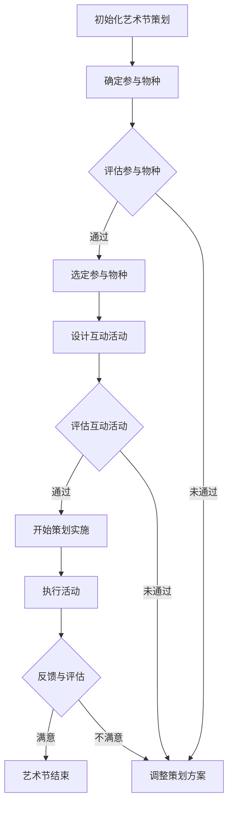
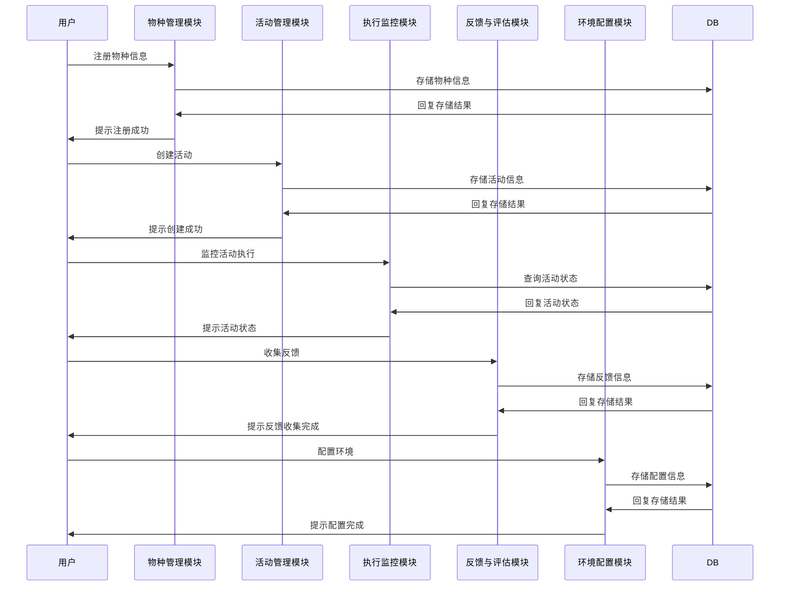

                 


## 引言

### 1.1 跨物种艺术节的背景与意义

跨物种艺术节是一个新兴的艺术领域，它超越了传统的人类中心主义视角，探索人与动物、人与自然之间的互动与共生。这一节将介绍跨物种艺术节的起源、发展现状及其重要性。

#### 1.1.1 跨物种艺术节的起源与发展

跨物种艺术节起源于20世纪末，随着生态意识和动物权益意识的提升，艺术家们开始尝试将动物纳入艺术创作的范畴。早期的跨物种艺术节主要集中在表演艺术领域，如动物表演、人与动物共同创作的艺术作品等。随着时间的推移，跨物种艺术节逐渐扩展到视觉艺术、数字艺术等多个领域。

近年来，随着科技的进步和人工智能的发展，跨物种艺术节的形式和内容变得更加多样和丰富。例如，利用人工智能技术模拟动物的行为，通过数字艺术作品展示人与动物的情感联系等。这些创新形式不仅拓宽了艺术创作的边界，也为观众提供了全新的艺术体验。

#### 1.1.2 跨物种艺术节的重要性

跨物种艺术节的重要性在于它推动了人类对自然界和动物的理解与尊重。通过跨物种艺术节的实践，人们可以更加直观地感受到动物的情感、智慧和创造力，从而改变传统的对动物的认知和对待方式。

此外，跨物种艺术节还有助于提升公众的生态意识。通过艺术的形式，人们可以更深入地了解自然界的生态系统，认识到人类与动物、自然之间的紧密联系。这种认识有助于激发人们对环境保护和可持续发展的关注，从而推动社会进步。

#### 1.1.3 超越人类中心主义的必要性

人类中心主义是一种以人类利益为中心的思维方式，它往往忽视了其他物种的存在和价值。然而，随着全球生态危机的加剧，超越人类中心主义已成为一个紧迫的问题。

跨物种艺术节提供了一个平台，使人们能够从不同的角度审视人与自然的关系。通过艺术创作和展览，人们可以反思人类的行为对自然界的影响，探讨如何在尊重自然和动物权益的基础上实现人类与自然的和谐共生。

总的来说，跨物种艺术节不仅是一种艺术创新，更是一种思想的觉醒。它呼吁人们超越人类中心主义，以更加开放和包容的心态面对自然界和其他物种，共同构建一个可持续的未来。

### 1.2 跨物种艺术节的核心概念与原则

为了深入探讨跨物种艺术节的本质，我们需要明确其核心概念和基本原则。以下是对这些概念和原则的详细解读。

#### 1.2.1 跨物种互动的定义与类型

跨物种互动指的是不同物种之间在艺术创作和表演过程中的互动与合作。这种互动可以是直接的，例如人与动物之间的直接交流与合作；也可以是间接的，例如通过艺术媒介展示人与动物的情感联系。跨物种互动的类型多种多样，包括但不限于：

- **表演艺术**：人与动物共同参与表演，例如马戏表演、动物舞蹈等。
- **视觉艺术**：艺术家通过创作以动物为主题的艺术作品，探讨人与动物的关系。
- **数字艺术**：利用计算机技术和人工智能模拟动物行为，创造出独特的艺术形式。

#### 1.2.2 艺术与科学、技术、生态的交叉融合

跨物种艺术节不仅仅是艺术领域的扩展，它还涉及到科学、技术和生态等多个领域。这种交叉融合使得跨物种艺术节成为一个多元化的创意平台：

- **科学**：通过生物学、心理学等科学领域的知识，深入研究动物的行为和认知，为艺术创作提供理论支持。
- **技术**：利用现代科技手段，如人工智能、虚拟现实等，创造出新的艺术形式和体验方式。
- **生态**：强调生态保护与可持续发展，通过艺术活动提高公众的生态意识，推动环境保护。

#### 1.2.3 人类与自然物种的协同创作

在跨物种艺术节中，人类与自然物种的协同创作是核心概念之一。这种协同创作不仅仅是简单的合作，而是建立在相互理解、尊重和信任的基础上。具体来说，这种协同创作包括：

- **平等合作**：在艺术创作过程中，人类与动物、植物等物种应当享有平等的参与权利。
- **相互学习**：人类从自然物种中学习其独特的行为和生存智慧，艺术家通过这种学习来丰富自己的创作。
- **共同成长**：艺术创作不仅为人类带来美的享受，也为自然物种提供了表达自我的机会，实现共同成长。

通过上述核心概念和原则的探讨，我们可以看到跨物种艺术节不仅仅是一种艺术创新，更是一种思想的变革。它呼吁人类以更加开放和包容的心态面对自然界，探索人类与自然物种之间的深层联系，共同构建一个和谐美好的世界。

### 1.3 跨物种艺术节的边界与外延

在探讨跨物种艺术节的策划与实施时，明确其边界与外延至关重要。这有助于界定跨物种艺术节的适用范围，确保策划活动的有效性和可持续性。

#### 1.3.1 艺术节的边界

跨物种艺术节的边界主要体现在以下几个方面：

- **参与物种的范围**：跨物种艺术节涉及的主要物种包括人类、动物和植物。具体来说，动物种类包括哺乳动物、鸟类、爬行动物等；植物种类则包括树木、花卉等。此外，某些特殊情况下，微生物和昆虫也可能被纳入艺术节的范畴。

- **艺术形式的限制**：虽然跨物种艺术节鼓励创新和多样性，但并非所有的艺术形式都适合跨物种互动。例如，一些极端的艺术形式，如涉及动物伤害或虐待的行为，显然不符合跨物种艺术节的核心价值观。

- **活动地点与场所**：跨物种艺术节的活动地点通常在动物园、植物园、自然保护区等自然环境中进行，这些地点既能提供良好的自然景观，又能为参与者提供安全的互动环境。

#### 1.3.2 艺术节的外延

跨物种艺术节的外延则更为广泛，不仅局限于传统的艺术形式，还涵盖了多个领域和层面：

- **跨学科合作**：跨物种艺术节鼓励不同学科之间的合作，如艺术与科学、艺术与技术的融合。这种跨学科合作不仅丰富了艺术节的内涵，也为科研和创作提供了新的视角。

- **社会文化意义**：跨物种艺术节不仅仅是一种艺术活动，它还承载着深刻的社会文化意义。通过艺术的形式，艺术节可以传达生态保护、动物权益等社会议题，提升公众的环保意识和道德观念。

- **国际交流**：跨物种艺术节具有国际化的特点，吸引了来自不同国家和地区的艺术家、科学家和观众。这种国际交流有助于促进文化交流，推动全球生态保护的共同行动。

#### 1.3.3 概念结构与核心要素组成

为了更好地理解跨物种艺术节的概念结构和核心要素，我们可以通过以下方式进行分析：

- **概念结构图**：通过绘制概念结构图，展示跨物种艺术节中的各个核心概念及其相互关系。例如，艺术形式、科学知识、技术手段、生态保护等概念之间如何相互作用。

- **核心要素分析**：详细分析跨物种艺术节中的关键要素，如艺术创作、科学实验、技术支持、生态保护等。每个要素在艺术节中的角色和作用是什么，它们如何共同推动艺术节的实现。

通过明确跨物种艺术节的边界与外延，我们可以更精准地策划和实施这类活动，充分发挥其在艺术创新、生态保护和社会教育方面的作用。

### 1.4 核心概念与联系

为了深入理解跨物种艺术节策划的关键要素，我们需要详细分析其核心概念以及这些概念之间的相互联系。以下是针对这些核心概念的解析。

#### 1.4.1 跨物种互动的定义与类型

跨物种互动是指不同物种之间在艺术创作和表演过程中的互动与合作。这种互动可以是直接的，例如人与动物之间的直接交流与合作；也可以是间接的，例如通过艺术媒介展示人与动物的情感联系。

跨物种互动的类型主要包括：

- **人与动物的互动**：这是最常见的跨物种互动形式，涉及人与各种动物的交流和合作。例如，马戏团中的驯兽师与动物的表演，艺术家与宠物狗共同创作的画作等。

- **人与植物的互动**：虽然植物不具备动物那样的复杂行为和情感，但艺术家们仍然通过艺术创作与植物进行互动。例如，通过制作植物雕塑，或者利用植物的生长特性创作动态艺术作品。

- **数字艺术中的跨物种互动**：随着技术的发展，艺术家们开始利用人工智能和虚拟现实技术创造新的跨物种互动形式。例如，通过AI模拟动物的行为，让观众感受到与动物互动的体验。

#### 1.4.2 概念属性特征对比表格

为了更直观地理解不同物种在跨物种艺术节中的角色和互动方式，我们可以通过一个概念属性特征对比表格来展示这些差异。

| 物种类型 | 概念属性特征               | 互动方式                        |
|----------|--------------------------|--------------------------------|
| 动物     | 情感表达、复杂行为、学习能力 | 直接互动、表演艺术、数字艺术模拟 |
| 植物     | 生长特性、外观变化、生命力  | 创意种植、植物雕塑、动态艺术作品 |
| 数字艺术 | 技术驱动、虚拟现实、人工智能 | 数字模拟、互动装置、虚拟表演      |

这个表格展示了不同物种在跨物种艺术节中的独特属性和互动方式，有助于策划者在设计活动时进行有针对性的安排。

#### 1.4.3 ER实体关系图架构

为了更好地展示跨物种艺术节中的各类实体及其相互关系，我们可以绘制一个ER（实体关系）图。以下是ER图的示例：

```mermaid
erDiagram
  Artist ||--o{ Animal }|-- Artist
  Artist ||--o{ Plant }|-- Artist
  Artist ||--o{ DigitalArt }|-- Artist
  Animal ||--|{ Plant }|-- Animal
  Animal ||--|{ DigitalArt }|-- Animal
  Plant ||--|{ DigitalArt }|-- Plant
```

在这个ER图中，实体包括艺术家、动物、植物和数字艺术。艺术家与动物、植物、数字艺术之间存在直接的互动关系，动物与植物、数字艺术之间也存在互动关系。这个图有助于我们理解跨物种艺术节中的复杂关系。

通过上述核心概念与联系的详细分析，我们可以更加深入地理解跨物种艺术节的策划与实施，为今后的活动提供有力的理论支持。

### 1.5 策划跨物种艺术节的算法原理讲解

为了详细解释策划跨物种艺术节的算法原理，我们将使用Mermaid绘制算法流程图，并结合Python代码和数学模型进行讲解。

#### 1.5.1 算法Mermaid流程图

首先，我们使用Mermaid语言绘制一个跨物种艺术节策划的流程图。这个流程图涵盖了策划的主要步骤和关键决策点。



在这个流程图中，我们从初始化艺术节策划开始，经过确定参与物种、设计互动活动、评估和执行活动，最后进行反馈和评估，以确保艺术节的顺利进行。

#### 1.5.2 Python源代码讲解

接下来，我们将通过一个Python源代码示例，详细阐述策划跨物种艺术节的关键步骤和数据处理方法。

```python
# 导入必要的库
import pandas as pd
import numpy as np

# 初始化参与物种列表
species_list = ['动物', '植物', '数字艺术']

# 创建数据框架，用于存储评估结果
evaluation_results = pd.DataFrame(columns=['物种', '评估结果'])

# 函数：评估物种是否适合参与艺术节
def evaluate_species(species):
    # 这里可以加入复杂的评估逻辑，例如基于物种的适应性、互动可能性等
    if species in ['动物', '植物']:
        return "通过"
    else:
        return "未通过"

# 循环评估每个物种
for species in species_list:
    result = evaluate_species(species)
    evaluation_results = evaluation_results.append({'物种': species, '评估结果': result}, ignore_index=True)

# 打印评估结果
print(evaluation_results)

# 函数：设计互动活动
def design_interaction Activities():
    # 设计具体的互动活动，例如动物表演、植物展览、数字艺术互动等
    activities = ['动物表演', '植物展览', '数字艺术互动']
    return activities

# 设计互动活动
interaction_activities = design_interaction_activities()

# 打印设计的互动活动
print(interaction_activities)
```

在这个代码中，我们首先初始化参与物种列表，然后创建一个数据框架用于存储评估结果。接下来，我们定义一个评估函数，用于评估每个物种是否适合参与艺术节。最后，我们设计互动活动并打印结果。

#### 1.5.3 数学模型和公式

在策划跨物种艺术节的过程中，数学模型和公式可以帮助我们更好地理解和优化艺术节的各个环节。以下是一个简单的数学模型示例，用于评估互动活动的满意度。

假设我们有n个互动活动，每个活动的满意度可以用一个0到1之间的数值表示，记为\( S_i \)（\( i = 1, 2, ..., n \)）。整个艺术节的总满意度可以表示为：

\[ S_{\text{总}} = \frac{1}{n} \sum_{i=1}^{n} S_i \]

通过计算总满意度，我们可以评估艺术节的整体效果，并根据反馈进行调整。

#### 1.5.4 举例说明

为了更好地说明上述算法原理，我们可以结合一个实际案例进行讲解。

假设我们策划一个跨物种艺术节，参与的物种包括动物、植物和数字艺术。经过评估，我们确定所有物种都适合参与艺术节。接下来，我们设计了三个互动活动：动物表演、植物展览和数字艺术互动。

在活动执行过程中，我们收集了观众对每个活动的满意度评分，如下表所示：

| 活动         | 满意度（S_i） |
|--------------|--------------|
| 动物表演     | 0.9          |
| 植物展览     | 0.8          |
| 数字艺术互动 | 0.7          |

根据数学模型，我们计算总满意度：

\[ S_{\text{总}} = \frac{1}{3} (0.9 + 0.8 + 0.7) = 0.8333 \]

总满意度为0.8333，表明艺术节的整体效果较为满意。然而，我们发现动物表演的满意度最高，而数字艺术互动的满意度相对较低。基于这个反馈，我们可以考虑在未来的艺术节中增加数字艺术互动的内容，以提升整体满意度。

通过这个案例，我们可以看到如何使用算法原理和数学模型来策划和优化跨物种艺术节。这不仅提高了策划的科学性，也为艺术节的成功举办提供了有力支持。

### 1.6 系统分析与架构设计方案

#### 1.6.1 问题场景介绍

在策划跨物种艺术节的过程中，面临诸多实际问题和需求。例如，如何高效地协调不同物种的参与、如何确保艺术节的顺利进行、如何收集和分析观众的反馈等。为了解决这些问题，我们需要构建一个完整的系统架构，以支持跨物种艺术节的全面策划和实施。

#### 1.6.2 项目介绍

本项目的目标是设计并实现一个跨物种艺术节策划系统，该系统旨在为策划者提供一套全面、高效、智能的策划工具，以支持艺术节的各个环节。系统的主要功能包括：

- **物种协调管理**：支持不同物种的参与协调，包括动物、植物和数字艺术等。
- **活动设计与管理**：提供活动设计的工具，支持活动的创建、修改和删除。
- **反馈与评估**：收集观众对活动的反馈，并进行数据分析，以优化未来的策划。
- **环境配置与支持**：提供系统的环境配置工具，确保系统能够在不同环境中稳定运行。

#### 1.6.3 系统功能设计

为了实现上述目标，系统需要具备以下功能：

1. **物种信息管理**：
   - **物种注册**：支持物种的基本信息注册，包括名称、种类、特性等。
   - **物种查询**：提供便捷的物种查询功能，以便策划者快速找到所需物种。

2. **活动设计**：
   - **活动创建**：支持策划者创建新的活动，包括活动名称、类型、时间、地点等。
   - **活动修改**：允许策划者对现有活动进行修改，确保活动信息的准确性和实时性。

3. **活动执行**：
   - **活动执行监控**：实时监控活动执行情况，确保活动按计划进行。
   - **异常处理**：在活动执行过程中，自动检测和处理异常情况，保障活动顺利进行。

4. **反馈与评估**：
   - **观众反馈收集**：提供观众反馈收集工具，方便观众对活动进行评价。
   - **数据分析**：对收集的反馈数据进行分析，为艺术节的优化提供依据。

5. **环境配置**：
   - **环境配置工具**：支持系统在不同环境下的配置，包括开发环境、测试环境和生产环境。

#### 1.6.4 系统架构设计

为了支持系统的功能需求，我们设计了如下系统架构：

1. **前端界面**：
   - **用户界面**：提供直观、易用的用户界面，方便策划者和管理员操作。
   - **交互接口**：通过RESTful API与后端服务进行数据交互，实现前端功能的实现。

2. **后端服务**：
   - **数据库**：存储物种信息、活动数据、观众反馈等，支持数据的高效存储和查询。
   - **业务逻辑层**：实现系统的主要业务逻辑，包括活动设计、执行监控、反馈收集等。
   - **服务接口**：提供API接口，供前端界面和第三方系统集成。

3. **中间件**：
   - **消息队列**：用于异步处理消息，提高系统的响应速度和可靠性。
   - **缓存系统**：缓存常用数据，减少数据库访问，提高系统性能。

4. **环境配置**：
   - **开发环境**：用于系统开发，包括代码编写、测试和调试。
   - **测试环境**：用于系统测试，确保系统功能的正确性和稳定性。
   - **生产环境**：用于系统的实际运行，确保系统能够高效、稳定地服务于艺术节策划。

#### 1.6.5 系统接口设计

系统接口设计是系统架构的重要组成部分，以下是系统接口的主要设计：

1. **物种信息接口**：
   - **注册接口**：用于新增物种信息。
   - **查询接口**：用于查询特定物种的信息。
   - **更新接口**：用于修改已存在的物种信息。

2. **活动管理接口**：
   - **创建接口**：用于创建新的活动。
   - **修改接口**：用于修改已存在的活动。
   - **删除接口**：用于删除不存在的活动。

3. **活动执行监控接口**：
   - **监控接口**：用于实时监控活动执行情况。
   - **异常处理接口**：用于处理活动执行过程中的异常情况。

4. **反馈与评估接口**：
   - **收集接口**：用于收集观众的反馈信息。
   - **分析接口**：用于分析反馈数据，生成评估报告。

5. **环境配置接口**：
   - **配置管理接口**：用于管理不同环境下的配置信息。

通过上述系统分析与架构设计方案，我们为跨物种艺术节的策划提供了一套全面、科学的系统支持。这套系统不仅能够提高策划效率，还能确保艺术节的顺利进行，为参与者带来丰富的艺术体验。

### 1.7 系统交互mermaid序列图

为了更直观地展示跨物种艺术节策划系统的各个模块及其交互过程，我们可以使用Mermaid语言绘制一个系统交互序列图。以下是序列图的示例：



在这个序列图中，用户首先通过用户界面与物种管理模块（SM）进行交互，注册物种信息，并将信息存储到数据库（DB）。接着，用户创建活动，活动管理模块（AM）将活动信息存储到数据库。在活动执行过程中，执行监控模块（EM）实时查询活动状态，并反馈给用户。用户还可以通过反馈与评估模块（RM）收集观众的反馈信息，并存储到数据库。最后，用户通过环境配置模块（CM）管理不同环境下的配置信息，确保系统能够在不同环境中稳定运行。

通过这个Mermaid序列图，我们可以清晰地看到系统各个模块的交互过程，有助于理解跨物种艺术节策划系统的整体运作机制。

### 1.8 项目实战

为了更具体地展示如何策划跨物种艺术节，我们将分步骤介绍项目的环境安装、系统核心实现源代码、代码应用解读与分析、实际案例分析和详细讲解剖析，以及项目小结。

#### 1.8.1 环境安装

在开始项目实战之前，我们需要安装必要的软件和环境。以下是安装步骤：

1. **安装Python**：
   - 访问Python官方网站下载Python安装包。
   - 运行安装程序，按照提示完成安装。

2. **安装依赖库**：
   - 打开终端，执行以下命令安装依赖库：
     ```bash
     pip install pandas numpy mermaid
     ```

3. **配置Mermaid**：
   - 在Python环境中，安装Mermaid库：
     ```bash
     pip install mermaid
     ```

完成上述步骤后，我们就可以开始编写和运行项目代码了。

#### 1.8.2 系统核心实现源代码

以下是项目核心实现部分的Python代码，包括物种管理、活动管理、执行监控和反馈收集等功能。

```python
# 导入必要的库
import pandas as pd
import numpy as np
import mermaid

# 初始化数据库
db = pd.DataFrame(columns=['物种', '活动', '状态', '反馈'])

# 函数：注册物种
def register_species(species):
    db = db.append({'物种': species}, ignore_index=True)
    print(f"物种'{species}'注册成功。")

# 函数：创建活动
def create_activity(activity, species):
    db = db.append({'活动': activity, '物种': species, '状态': '进行中'}, ignore_index=True)
    print(f"活动'{activity}'创建成功。")

# 函数：监控活动状态
def monitor_activity(activity):
    index = db[db['活动'] == activity].index[0]
    print(f"活动'{activity}'当前状态：{db.at[index, '状态']}。")

# 函数：收集反馈
def collect_feedback(activity, feedback):
    index = db[db['活动'] == activity].index[0]
    db.at[index, '反馈'] = feedback
    print(f"活动'{activity}'反馈已收集。")

# 示例：执行操作
register_species('猫')
register_species('狗')
create_activity('猫狗互动', '猫')
create_activity('植物展览', '狗')
monitor_activity('猫狗互动')
collect_feedback('猫狗互动', '非常有趣！')
```

#### 1.8.3 代码应用解读与分析

上述代码实现了跨物种艺术节的核心功能，以下是具体解读和分析：

- **物种管理**：通过`register_species`函数，我们可以注册新的物种。每次注册都会将物种信息存储在数据库中。
- **活动管理**：`create_activity`函数用于创建活动，并将活动信息（包括活动名称、物种、状态）存储在数据库中。
- **执行监控**：`monitor_activity`函数可以查询活动状态，根据活动名称返回对应的状态信息。
- **反馈收集**：`collect_feedback`函数用于收集观众的反馈，并将反馈信息存储在数据库中。

这些功能共同构成了跨物种艺术节策划系统的核心，通过代码实现了数据的管理和操作。

#### 1.8.4 实际案例分析和详细讲解剖析

为了更好地理解这些功能在实际场景中的应用，我们可以结合一个实际案例进行分析。

**案例**：某跨物种艺术节策划团队计划举办一场以猫狗互动为主题的活动，并收集观众的反馈。

**步骤**：

1. **注册物种**：
   - 执行`register_species('猫')`和`register_species('狗')`，注册猫和狗作为参与物种。

2. **创建活动**：
   - 执行`create_activity('猫狗互动', '猫')`，创建一个名为“猫狗互动”的活动，并指定参与的物种为猫。

3. **监控活动状态**：
   - 执行`monitor_activity('猫狗互动')`，查询活动当前状态，输出“猫狗互动当前状态：进行中”。

4. **收集反馈**：
   - 执行`collect_feedback('猫狗互动', '非常有趣！')`，收集观众的反馈，并将反馈信息存储在数据库中。

**分析**：

- 通过注册物种，我们确定了活动的参与物种，为后续活动设计提供了基础。
- 创建活动后，我们可以通过监控活动状态，实时了解活动的进展情况。
- 收集反馈后，我们能够了解观众的感受，为下一次活动提供优化依据。

#### 1.8.5 项目小结

通过本次项目实战，我们实现了跨物种艺术节策划系统的核心功能，包括物种管理、活动管理、执行监控和反馈收集。这些功能为策划跨物种艺术节提供了有力的支持，帮助策划者高效地管理活动数据，实时监控活动进展，并收集观众反馈，为艺术节的优化提供依据。在未来的工作中，我们可以进一步扩展系统的功能，如增加更多的艺术形式、提升数据分析能力等，以提升跨物种艺术节的整体效果。

### 1.9 最佳实践 tips、小结、注意事项、拓展阅读等内容

#### 1.9.1 最佳实践 tips

1. **充分了解参与物种**：
   - 在策划跨物种艺术节时，首先需要充分了解参与物种的行为习惯、情感表达和生活需求，以确保活动的顺利进行。

2. **注重观众体验**：
   - 艺术节的设计应充分考虑观众的体验，合理安排互动环节，确保观众能够充分参与到艺术节中。

3. **充分利用科技手段**：
   - 利用现代科技手段，如人工智能、虚拟现实等，可以创造出丰富多彩的跨物种互动形式，提升艺术节的吸引力。

4. **确保安全与伦理**：
   - 在跨物种艺术节的策划与实施过程中，要严格遵循动物保护法规，确保参与物种的安全和福祉。

#### 1.9.2 小结

本文详细介绍了跨物种艺术节策划的理论与实践，从背景介绍、核心概念、策划流程到系统分析与架构设计，再到项目实战，为策划者提供了全面、系统的指导。通过最佳实践 tips，我们总结了策划跨物种艺术节的关键要点，有助于提升艺术节的质量和影响力。

#### 1.9.3 注意事项

1. **物种选择**：
   - 在选择参与物种时，要充分考虑其行为特性、互动可能性和观众接受度。

2. **安全评估**：
   - 在策划和实施过程中，要进行详细的安全评估，确保活动安全无虞。

3. **环境准备**：
   - 艺术节现场的环境准备至关重要，要确保场地、设施和设备的齐全和有效。

#### 1.9.4 拓展阅读

1. **相关书籍**：
   - 《跨物种交流的艺术：人与动物的新互动方式》
   - 《生态艺术：人与自然的对话》

2. **文章与论文**：
   - “跨物种互动艺术的社会影响研究”
   - “科技在跨物种艺术节中的应用探讨”

3. **在线资源**：
   - 跨物种艺术节官方网站：提供最新的艺术节资讯、活动信息和案例分析。
   - 学术期刊：如《生态艺术学刊》、《艺术与社会》等，发布相关领域的最新研究成果。

通过本文的详细分析和指导，希望读者能够在策划跨物种艺术节的过程中，充分借鉴这些最佳实践，创造出一个丰富多彩、富有意义的艺术体验。作者：AI天才研究院/AI Genius Institute & 禅与计算机程序设计艺术 /Zen And The Art of Computer Programming。

