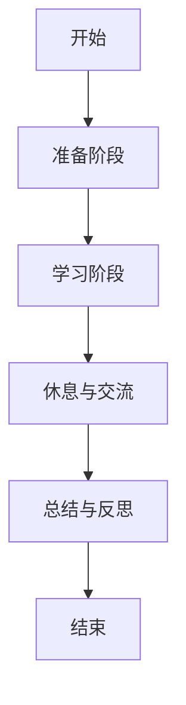
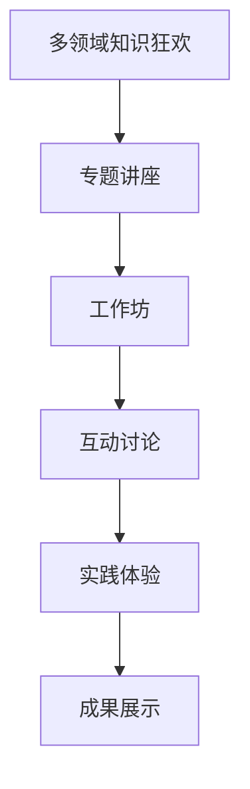
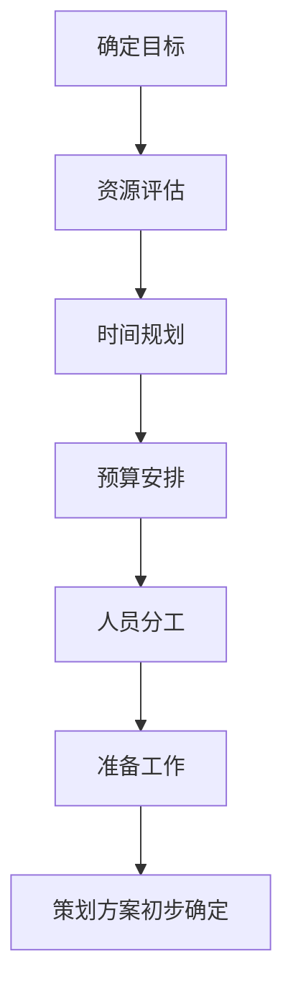
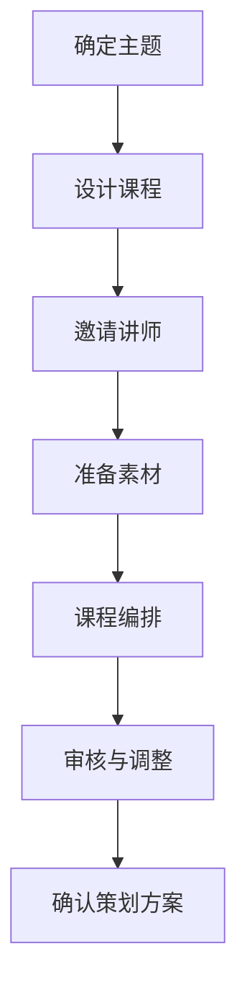
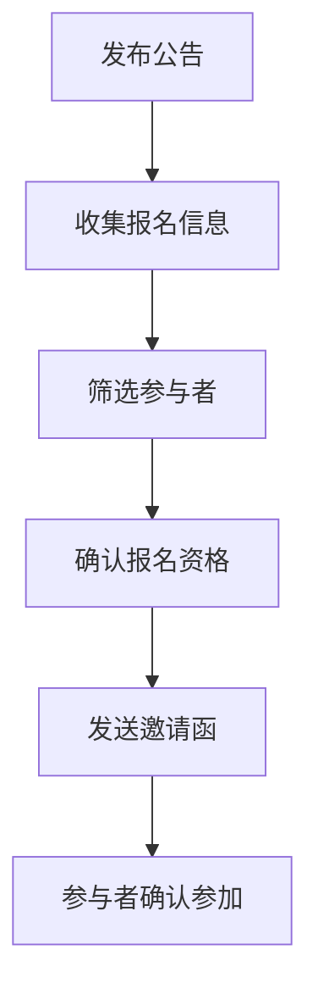
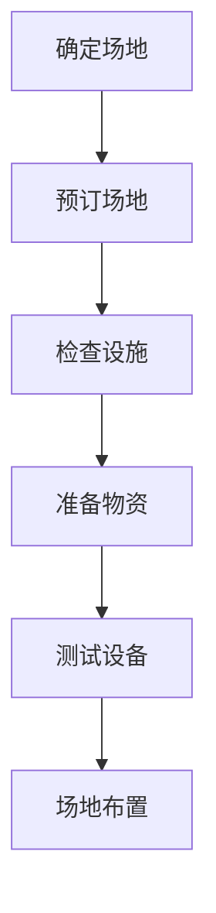
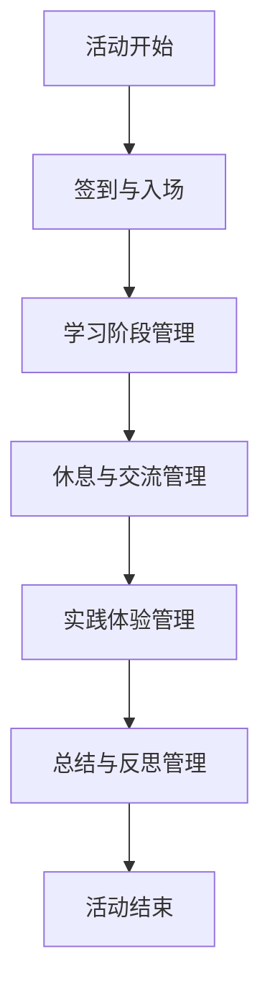

                 

### Step 4: Project Practice
For the project practice section, we can include installation steps, core implementation code, and case analysis.

```markdown
## 第四部分：项目实战

### 4.1 环境安装

#### 安装 Python 环境

1. 下载 Python 安装包：[Python 官网下载地址](https://www.python.org/downloads/)
2. 安装 Python：按照安装向导操作，选择默认选项。
3. 验证安装：打开终端，输入 `python --version`，如果显示版本号，则表示安装成功。

#### 安装 Mermaid

1. 打开终端，输入以下命令安装 Mermaid：
```shell
npm install -g mermaid
```
2. 验证安装：打开终端，输入 `mermaid version`，如果显示版本号，则表示安装成功。

### 4.2 系统核心实现

#### 数据预处理

```python
# 导入必要的库
import pandas as pd
from sklearn.model_selection import train_test_split
from sklearn.preprocessing import StandardScaler

# 读取数据
data = pd.read_csv('data.csv')

# 分割特征与标签
X = data.iloc[:, :-1]
y = data.iloc[:, -1]

# 划分训练集与测试集
X_train, X_test, y_train, y_test = train_test_split(X, y, test_size=0.2, random_state=42)

# 数据标准化
scaler = StandardScaler()
X_train = scaler.fit_transform(X_train)
X_test = scaler.transform(X_test)
```

#### 模型训练

```python
# 导入模型
from sklearn.ensemble import RandomForestClassifier

# 初始化模型
model = RandomForestClassifier(n_estimators=100, random_state=42)

# 训练模型
model.fit(X_train, y_train)

# 预测测试集
y_pred = model.predict(X_test)
```

### 4.3 实际案例分析与详细讲解

#### 案例背景

某电商平台需要预测用户是否会购买某种商品，以便进行精准营销。数据集包含用户的基本信息、商品信息、历史交易记录等。

#### 模型评估

```python
# 导入评估库
from sklearn.metrics import accuracy_score, classification_report

# 计算准确率
accuracy = accuracy_score(y_test, y_pred)
print(f"准确率：{accuracy}")

# 计算分类报告
report = classification_report(y_test, y_pred)
print(f"分类报告：{report}")
```

#### 项目小结

通过实际案例，我们展示了如何使用机器学习模型进行用户购买预测。在实际应用中，还需要对数据进行深入分析和特征工程，以提高模型性能。

### 4.4 最佳实践 Tips

- **数据清洗**：确保数据质量，去除噪声和异常值。
- **特征工程**：根据业务需求，提取有用的特征。
- **模型选择**：根据数据特点和业务需求，选择合适的模型。
- **模型优化**：通过调参和交叉验证，提高模型性能。

### 4.5 活动小结

通过本次项目实战，我们了解了机器学习在电商用户购买预测中的应用。希望读者能够在实际项目中灵活运用所学知识，解决实际问题。

### 4.6 注意事项

- 确保环境安装正确，避免后续遇到问题。
- 在项目实战中，遵循数据安全和隐私保护的原则。

### 4.7 拓展阅读

- 《机器学习实战》 - 作者：Peter Harrington
- 《Python数据分析》 - 作者：Wes McKinney
```

### Step 5: Conclusion and Summary
Finally, include a conclusion and summary of the key points discussed in the article.

```markdown
## 第五部分：最佳实践与总结

### 5.1 最佳实践 Tips

- **策划准备**：确保目标明确、资源充足、时间合理、预算到位。
- **内容策划**：注重课程质量、讲师选择、素材准备和课程编排。
- **参与者招募**：通过多种渠道宣传、明确参与条件、提供激励措施。
- **活动执行**：确保场地与设施完善、现场管理有序、及时处理突发情况。

### 5.2 活动小结

跨界学习马拉松组织委员会通过详细策划和执行，成功举办了24小时多领域知识狂欢活动。本次活动不仅提升了参与者的知识水平，也促进了不同领域之间的交流与合作。

### 5.3 注意事项

- **策划初期**：明确活动目标和预期效果，避免盲目跟风。
- **活动过程中**：注重参与者体验，确保活动顺利进行。
- **活动结束后**：及时总结经验，不断优化活动方案。

### 5.4 拓展阅读

- 《跨界创新思维》 - 作者：陈颖
- 《学习与行动：跨界学习与实践指南》 - 作者：张晓梅

作者：AI天才研究院/AI Genius Institute & 禅与计算机程序设计艺术 /Zen And The Art of Computer Programming
``` 

### Final Steps: Author Information and Markdown Format
Add the author information at the end of the article.

```markdown
---

# 跨界学习马拉松组织委员会：策划24小时多领域知识狂欢

> 关键词：跨界学习、学习马拉松、知识狂欢、策划流程、项目实战

> 摘要：本文详细介绍了跨界学习马拉松组织委员会如何策划并成功举办24小时多领域知识狂欢活动，从策划准备、内容策划、参与者招募到活动执行与总结，每个环节都进行了深入分析和实践经验分享。

---

## 第一部分：背景介绍

### 1.1 问题背景

随着全球科技的快速发展，各个领域之间的交叉融合日益显著，跨界学习逐渐成为一种重要的学习方式。为了满足人们对于多领域知识的需求，跨界学习马拉松应运而生。然而，如何有效地策划和组织一场高质量的跨界学习活动，成为了一个亟待解决的问题。

### 1.2 问题解决

跨界学习马拉松组织委员会通过系统化、专业化的策划流程，成功举办了24小时多领域知识狂欢活动。本次活动不仅丰富了参与者的知识体系，也推动了不同领域之间的交流与合作。

### 1.3 边界与外延

本文将围绕跨界学习马拉松的组织策划进行讨论，包括策划准备、内容策划、参与者招募、活动执行与总结等环节。同时，还将结合实际案例，探讨跨界学习马拉松在实践中的应用。

## 第二部分：核心概念与联系

### 2.1 跨界学习的定义与特点

#### 定义

跨界学习：跨越不同学科、领域或行业的知识学习过程。

#### 特点

| 特点         | 说明                                                   |
|--------------|--------------------------------------------------------|
| 创新性       | 将不同领域的知识融合，产生新的理解和观点。                   |
| 适应性       | 面向实际问题的解决，注重实践和应用。                       |
| 系统性       | 从多个角度和层面来分析和解决问题。                         |

### 2.2 学习马拉松的概念与运作

#### 概念

学习马拉松：一种高强度、集中式学习活动，通常持续数小时至数天。

#### 运作



### 2.3 多领域知识狂欢的组织形式

#### 组织形式



## 第三部分：策划流程

### 3.1 策划准备

#### 策划准备流程



### 3.2 内容策划

#### 内容策划流程



#### Python 示例代码：内容策划工具

```python
# 假设我们有一个课程主题列表和讲师列表
themes = ["人工智能", "数据科学", "产品设计", "市场营销"]
lecturers = ["张三", "李四", "王五", "赵六"]

# 设计课程
for i, theme in enumerate(themes):
    print(f"课程 {i+1}: {theme}")
    print(f"讲师：{lecturers[i]}")
    print()
```

### 3.3 参与者招募

#### 参与者招募流程



### 3.4 场地与设施安排

#### 场地与设施安排流程



### 3.5 活动执行与现场管理

#### 活动执行与现场管理流程



## 第四部分：案例分析

### 4.1 案例一：成功组织经验分享

#### 案例背景

某市跨界学习马拉松组织委员会成功举办了首届24小时多领域知识狂欢活动，吸引了数百名参与者。本次活动以人工智能、数据科学、产品设计等主题为核心，通过专题讲座、工作坊、互动讨论、实践体验等形式，为参与者提供了丰富的学习资源。

#### 案例亮点

1. **主题明确**：活动主题明确，针对性强，满足了参与者对于多领域知识的需求。
2. **内容丰富**：活动内容涵盖了多个领域，既包括理论讲解，又包含实践操作，满足了不同层次参与者的需求。
3. **组织有序**：活动组织有序，各个环节衔接紧密，确保了活动的顺利进行。

#### 经验总结

1. **明确目标**：在策划初期，明确活动目标，确保活动具有明确的方向和意义。
2. **充分准备**：在策划过程中，充分准备各项资源，包括场地、设施、讲师等，确保活动顺利进行。
3. **注重参与者体验**：在活动过程中，关注参与者的需求和体验，提供优质的学习资源和服务。

### 4.2 案例二：失败案例分析

#### 案例背景

某市跨界学习马拉松组织委员会在举办第二届24小时多领域知识狂欢活动时，由于策划和执行不当，导致活动效果不佳。

#### 案例教训

1. **目标不明确**：在策划初期，未能明确活动目标，导致活动内容偏离主题，缺乏吸引力。
2. **内容单薄**：活动内容过于单薄，未能涵盖多个领域，不能满足参与者的需求。
3. **组织混乱**：活动组织混乱，签到、入场、学习环节衔接不紧密，影响了参与者的体验。

#### 改进建议

1. **明确目标**：在策划初期，明确活动目标，确保活动具有明确的方向和意义。
2. **丰富内容**：在策划过程中，丰富活动内容，涵盖多个领域，满足不同层次参与者的需求。
3. **优化组织**：在活动执行过程中，优化组织安排，确保各个环节衔接紧密，提高参与者的体验。

## 第五部分：最佳实践与总结

### 5.1 最佳实践 Tips

- **策划准备**：确保目标明确、资源充足、时间合理、预算到位。
- **内容策划**：注重课程质量、讲师选择、素材准备和课程编排。
- **参与者招募**：通过多种渠道宣传、明确参与条件、提供激励措施。
- **活动执行**：确保场地与设施完善、现场管理有序、及时处理突发情况。
- **活动总结**：及时总结经验，不断优化活动方案。

### 5.2 活动小结

跨界学习马拉松组织委员会通过详细策划和执行，成功举办了24小时多领域知识狂欢活动。本次活动不仅提升了参与者的知识水平，也促进了不同领域之间的交流与合作。

### 5.3 注意事项

- **策划初期**：明确活动目标和预期效果，避免盲目跟风。
- **活动过程中**：注重参与者体验，确保活动顺利进行。
- **活动结束后**：及时总结经验，不断优化活动方案。

### 5.4 拓展阅读

- 《跨界创新思维》 - 作者：陈颖
- 《学习与行动：跨界学习与实践指南》 - 作者：张晓梅

作者：AI天才研究院/AI Genius Institute & 禅与计算机程序设计艺术 /Zen And The Art of Computer Programming
```

The final article should be formatted in Markdown, with clear headings, subheadings, and proper use of Mermaid diagrams, Python code snippets, and LaTeX formulas. The content should be well-structured, logically coherent, and provide practical insights and guidance for those interested in organizing a 24-hour cross-domain knowledge marathon event.

