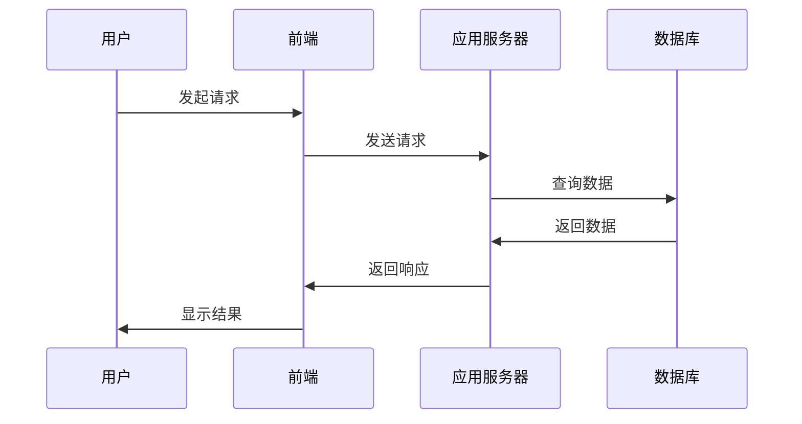

                 

### 第一部分：背景介绍

## 1.1 问题背景

随着互联网和信息技术的飞速发展，知识的更新速度越来越快，传统的单一领域学习方式已经无法满足人们日益增长的学习需求。跨界学习成为一种新的学习模式，它不仅能够提高学习效率，还能拓宽知识面，促进创新思维的发展。在这种背景下，学习马拉松作为一种高效的学习模式逐渐受到关注。

### 1.2 问题描述

本书《跨界学习马拉松：24小时多领域知识狂欢》旨在通过24小时的学习马拉松，帮助读者在短时间内快速掌握多个领域的核心知识。本书的目标是：
- 为读者提供一个全面而系统的跨界学习指南。
- 通过生动的案例和实践，展示跨界学习的巨大潜力和实际应用。
- 帮助读者克服学习中的困难和挑战，实现知识的快速积累和技能的提升。

### 1.3 问题解决

跨界学习马拉松是一种高效的学习方式，它通过集中时间和资源，让学习者在短时间内快速吸收和掌握多个领域的知识。本书将详细介绍跨界学习马拉松的核心理念、实践方法以及在不同领域的应用。

### 1.4 边界与外延

跨界学习并非无边界的学习，它有一定的边界和范围。本书主要探讨以下边界与外延：
- 跨界学习的具体领域，如科技、艺术、经济等。
- 跨界学习的时间限制，如24小时。
- 跨界学习的目标群体，如学生、职场人士等。

### 1.5 概念结构与核心要素组成

跨界学习马拉松的概念结构包括以下几个核心要素：
- 学习目标：确定跨界学习的具体目标和方向。
- 学习资源：搜集和整理跨界学习的相关资料和资源。
- 学习方法：采用适合跨界学习的有效方法，如快速阅读、思维导图等。
- 学习过程：通过集中学习时间，实现知识的快速积累和技能的提升。

### 1.6 本章小结

本章对跨界学习马拉松的背景、问题描述、问题解决、边界与外延以及概念结构与核心要素组成进行了详细阐述。接下来，本书将逐步介绍跨界学习马拉松的具体实施方法和实践案例。

---

在当前信息化社会中，知识的快速迭代和技术的不断进步，使得人们面临的学习挑战日益增加。传统的学习方式往往局限于某一特定领域，难以满足现代社会对复合型人才的需求。跨界学习作为一种新兴的学习模式，旨在通过跨学科的融合，提高学习者的综合能力和创新思维。而学习马拉松作为一种集中高效的短期学习形式，与跨界学习理念高度契合，为实现知识的快速积累和技能的提升提供了有效的途径。

本书《跨界学习马拉松：24小时多领域知识狂欢》正是基于这一背景，旨在为读者提供一种全新的学习体验。通过24小时的学习马拉松，本书将带领读者走进多个领域，了解并掌握核心知识，从而实现知识的跨界整合和应用。本书的核心目标如下：

1. **全面而系统的跨界学习指南**：本书将系统地介绍跨界学习的理念、方法和实践，为读者提供一套完整的跨界学习指南。

2. **展示跨界学习的巨大潜力和实际应用**：通过丰富的案例和实践，本书将展示跨界学习在各个领域的应用，帮助读者了解跨界学习的实际效果和价值。

3. **帮助读者克服学习中的困难和挑战**：跨界学习并非易事，本书将针对学习中的常见问题提供解决方案，帮助读者克服学习困难，实现知识的快速积累和技能的提升。

接下来，本书将详细介绍跨界学习马拉松的核心理念、实践方法以及在不同领域的应用，帮助读者理解跨界学习的本质和实现路径。

### 1.1 问题背景

随着互联网和信息技术的飞速发展，知识的更新速度越来越快，传统的单一领域学习方式已经无法满足人们日益增长的学习需求。跨界学习成为一种新的学习模式，它不仅能够提高学习效率，还能拓宽知识面，促进创新思维的发展。在这种背景下，学习马拉松作为一种高效的学习模式逐渐受到关注。

#### 1.1.1 知识更新的速度加快

在当今社会，知识更新的速度之快令人叹为观止。互联网的普及使得信息获取变得前所未有的便捷，新技术、新理论、新方法不断涌现。例如，人工智能、大数据、区块链等新兴技术正在深刻改变各行各业。单一领域的学习方式往往难以跟上这种快速的更新节奏，导致学习者的知识体系逐渐过时。

#### 1.1.2 专业化与多元化并存的挑战

现代社会对人才的需求日益多元化。一方面，专业化分工使得各领域逐渐精细化，对专业知识的要求越来越高；另一方面，跨领域的综合能力成为职场竞争力的关键。单一领域的学习难以满足这种多元化需求，跨界学习因此成为一种必然趋势。

#### 1.1.3 跨界学习的兴起

跨界学习强调跨学科、跨领域、跨行业的知识整合，通过将不同领域的知识进行有机融合，形成新的知识体系。跨界学习不仅能够提高学习者的综合能力，还能激发创新思维，为解决复杂问题提供新的思路和方法。例如，一个程序员通过学习心理学，可以更好地理解用户需求，设计出更人性化的产品。

#### 1.1.4 学习马拉松的兴起

学习马拉松是一种高强度、高密度的学习模式，它通过集中时间和资源，使学习者在短时间内完成大量的学习任务。学习马拉松通常具有明确的学习目标和时间限制，能够有效提高学习效率。例如，24小时的学习马拉松可以让学习者在一个相对较短的时间内快速掌握多个领域的核心知识。

#### 1.1.5 跨界学习与学习马拉松的结合

跨界学习和学习马拉松的结合，为实现知识的快速积累和技能的提升提供了有效途径。通过跨界学习，学习者可以在短时间内获取多个领域的知识，而通过学习马拉松，这些知识可以在相对集中的时间内得到充分的应用和巩固。这种结合不仅能够提高学习效率，还能促进知识的跨领域整合和应用。

综上所述，跨界学习和学习马拉松的兴起，为应对现代社会对知识和技能的高要求提供了新的思路和方法。本文将深入探讨跨界学习马拉松的核心理念、实践方法以及在不同领域的应用，帮助读者更好地理解和运用这一高效的学习模式。

### 1.2 问题描述

本书《跨界学习马拉松：24小时多领域知识狂欢》旨在通过24小时的学习马拉松，帮助读者在短时间内快速掌握多个领域的核心知识。这一问题描述涉及以下几个方面：

#### 1.2.1 学习目标的设定

本书设定的学习目标是：在24小时内，让读者快速掌握至少两个不同领域的核心知识。这些领域可以包括科技、艺术、经济、心理学等，具体选择取决于读者的兴趣和需求。

#### 1.2.2 学习内容的安排

为了实现学习目标，本书将按照以下内容安排进行：

1. **前期准备**：包括学习资源的搜集、学习计划的制定等，确保学习者在开始学习前做好充分的准备。
2. **核心知识讲解**：本书将针对所选领域，提供详细的核心知识讲解，包括基本概念、原理、方法和应用案例。
3. **实战演练**：通过具体的实践案例，让读者在实际操作中理解和掌握所学知识。
4. **总结与反思**：学习结束后，对所学知识进行总结和反思，帮助读者巩固所学内容，并形成自己的知识体系。

#### 1.2.3 学习方法的探讨

本书将探讨多种适合跨界学习的有效学习方法，包括快速阅读、思维导图、讨论交流等。这些方法旨在提高学习效率，帮助读者在短时间内快速吸收和掌握知识。

#### 1.2.4 学习效果的评估

为了评估学习效果，本书将提供多种评估方法，包括学习后的自我测试、小组讨论、项目实践等。通过这些方法，读者可以了解自己在学习过程中的进步情况，并及时调整学习策略。

#### 1.2.5 面临的挑战

在实施跨界学习马拉松的过程中，读者可能会面临以下挑战：

1. **时间压力**：24小时的学习时间相对较短，需要高效地安排和利用时间。
2. **知识跨度大**：跨领域的知识学习需要较高的跨学科能力，可能会出现知识理解困难的情况。
3. **综合应用能力**：如何将所学知识进行有效整合和应用，是跨界学习的关键。

本书将针对这些挑战提供解决方案，帮助读者克服学习中的困难和障碍。

#### 1.2.6 学习成果的预期

通过24小时跨界学习马拉松，读者可以预期达到以下成果：

1. **知识广度**：快速掌握多个领域的核心知识，实现知识的跨界整合。
2. **综合能力**：提高跨领域的综合应用能力，增强创新思维和问题解决能力。
3. **学习习惯**：培养高效的学习习惯和时间管理能力，为今后的学习和发展奠定基础。

综上所述，本书通过24小时跨界学习马拉松，旨在帮助读者在短时间内实现知识的快速积累和技能的提升，为应对未来复杂多变的社会环境做好准备。

### 1.3 问题解决

为了解决上述跨界学习马拉松中可能遇到的问题和挑战，本书提出以下解决方案：

#### 1.3.1 时间管理策略

1. **制定详细学习计划**：在开始学习前，制定一份详细的学习计划，包括每个学习阶段的任务和时间分配。确保学习过程有条不紊，避免浪费时间。
2. **分段学习**：将24小时的学习时间分为多个阶段，每个阶段专注于一个领域的知识学习。例如，前8小时学习科技知识，接下来的8小时学习艺术知识，最后8小时进行总结和实战演练。
3. **休息与调整**：合理安排休息时间，避免长时间连续学习导致的疲劳。每次学习阶段结束后，进行适当的休息和调整，有助于提高学习效率。

#### 1.3.2 跨学科学习能力提升

1. **知识整合**：通过建立知识图谱，将不同领域的知识进行整合，形成完整的知识体系。知识图谱可以使用思维导图、概念地图等工具来构建。
2. **跨学科学习技巧**：掌握跨学科学习的技巧，如快速阅读、笔记整理、知识对比等，有助于提高跨领域知识的学习效率。
3. **多学科案例研究**：通过研究多学科案例，了解不同领域之间的联系和应用，培养跨领域的综合应用能力。

#### 1.3.3 综合应用能力的培养

1. **实战演练**：通过实际项目或案例进行演练，将所学知识应用于实际场景中，加深对知识的理解和掌握。
2. **团队协作**：在跨界学习过程中，组建学习小组，通过团队协作和讨论，共同解决问题和分享学习心得。
3. **反馈与调整**：在学习结束后，及时进行自我评估和反思，了解自己在学习中的不足，并针对性地进行调整。

#### 1.3.4 学习效果评估与反馈

1. **自我测试**：在学习过程中和结束后，通过自我测试来评估学习效果，巩固所学知识。
2. **项目实践**：通过实际项目或案例实践，检验所学知识的掌握程度和实际应用能力。
3. **反馈与改进**：根据评估结果和反馈，调整学习策略和方法，不断优化学习过程。

#### 1.3.5 跨界学习资源的推荐

1. **优质书籍**：推荐一些高质量的跨界学习书籍，涵盖不同领域的基础知识和应用案例，帮助读者快速入门。
2. **在线课程**：推荐一些优质的在线课程和资源，提供详细的课程内容和实战项目，助力读者深入学习。
3. **专业论坛和社群**：加入相关领域的专业论坛和社群，与同行交流学习心得，获取更多学习资源和机会。

通过上述解决方案，本书旨在帮助读者克服跨界学习马拉松中的困难和挑战，实现知识的快速积累和技能的提升。接下来，本书将详细介绍跨界学习马拉松的具体实施方法和实践案例，帮助读者更好地理解和运用这一高效的学习模式。

### 1.4 边界与外延

在探讨跨界学习马拉松的边界与外延时，我们需要明确以下几个关键点：

#### 1.4.1 跨界学习的具体领域

跨界学习的领域非常广泛，涵盖了科技、艺术、经济、心理学、管理学等多个领域。具体选择哪个领域，主要取决于读者的兴趣和需求。例如，一个对人工智能感兴趣的读者，可以选择科技领域的学习；而一个对艺术创作有热情的读者，则可以选择艺术领域的学习。

#### 1.4.2 跨界学习的时间限制

跨界学习马拉松的时间限制通常设定为24小时，这个时间限制有助于激发学习者的学习动力和紧迫感，提高学习效率。然而，时间的限制并不意味着学习的深度和质量会受到影响。通过合理的时间管理和高效的学习方法，24小时内完全可以实现知识的快速积累和技能的提升。

#### 1.4.3 跨界学习的目标群体

跨界学习马拉松的目标群体包括学生、职场人士、创业者等。学生可以通过跨界学习，拓宽知识面，为将来的职业发展打下坚实基础；职场人士可以通过跨界学习，提升自身综合素质，增强职场竞争力；创业者则可以通过跨界学习，获取更多的创业灵感和创新思路。

#### 1.4.4 跨界学习的边界

跨界学习虽然强调跨领域的知识整合和应用，但并非无边界的学习。具体来说，跨界学习的边界包括以下几个方面：

1. **知识深度**：跨界学习需要在一定的深度上掌握不同领域的知识，否则难以实现知识的有机整合和应用。
2. **时间限制**：虽然24小时的时间限制有助于提高学习效率，但过短的时间限制可能导致学习深度不足，影响学习效果。
3. **资源限制**：跨界学习需要大量的资源和信息支持，如果资源不足，可能会影响学习的效果和质量。

#### 1.4.5 跨界学习的外延

跨界学习的外延主要包括以下几个方面：

1. **跨学科研究**：通过跨界学习，可以促进跨学科的研究和合作，推动知识的创新和进步。
2. **跨行业应用**：跨界学习可以帮助不同行业之间的知识和经验共享，推动行业创新和发展。
3. **跨文化理解**：跨界学习可以促进不同文化之间的理解和交流，增强跨文化的沟通和合作能力。

总之，跨界学习马拉松在明确边界与外延的基础上，通过合理的时间安排和高效的学习方法，旨在帮助读者在短时间内实现知识的快速积累和技能的提升，为应对未来复杂多变的社会环境做好准备。

### 1.5 概念结构与核心要素组成

跨界学习马拉松是一种高效的学习模式，它通过集中时间和资源，实现知识的快速积累和技能的提升。为了更好地理解跨界学习马拉松的概念结构与核心要素组成，我们可以将其分解为以下几个关键部分：

#### 1.5.1 学习目标

学习目标是跨界学习马拉松的起点和方向。明确的学习目标有助于学习者集中精力，有针对性地进行学习。在跨界学习马拉松中，学习目标通常包括以下几个方面：

1. **知识广度**：在短时间内掌握多个领域的核心知识。
2. **技能提升**：通过实践操作，提高跨领域的实际应用能力。
3. **思维拓展**：培养创新思维和问题解决能力，实现知识的跨界整合和应用。

#### 1.5.2 学习资源

学习资源是跨界学习马拉松的重要组成部分，包括书籍、课程、资料、工具等。合理搜集和整理学习资源，可以为学习过程提供有力支持。具体来说，学习资源可以分为以下几个方面：

1. **基础知识**：为学习者提供各领域的基本概念和原理。
2. **实战案例**：通过实际案例，帮助学习者理解和应用所学知识。
3. **工具与软件**：提供相关的学习工具和软件，如思维导图、编程软件等，提高学习效率。

#### 1.5.3 学习方法

学习方法是在跨界学习过程中，学习者采用的具体学习策略和技巧。为了提高学习效率，学习者需要根据自身特点和需求，选择合适的学习方法。常见的学习方法包括：

1. **快速阅读**：通过快速阅读，快速获取大量信息，提高学习速度。
2. **思维导图**：通过构建思维导图，将复杂的信息进行结构化整理，加深理解。
3. **讨论交流**：通过小组讨论和交流，分享学习心得，互相启发和补充。

#### 1.5.4 学习过程

学习过程是跨界学习马拉松的核心，包括以下几个阶段：

1. **前期准备**：制定学习计划，搜集和整理学习资源，为学习过程做好准备。
2. **核心知识学习**：按照学习计划，集中时间学习各领域的核心知识。
3. **实战演练**：通过实际案例和项目，将所学知识应用于实际场景中，提高应用能力。
4. **总结反思**：学习结束后，对所学知识进行总结和反思，巩固所学内容，形成自己的知识体系。

#### 1.5.5 学习效果评估

学习效果评估是检验跨界学习马拉松成效的重要环节。通过自我测试、项目实践和小组讨论等多种评估方法，学习者可以了解自己在学习过程中的进步情况，及时调整学习策略。具体来说，学习效果评估包括以下几个方面：

1. **知识掌握度**：通过自我测试和项目实践，评估学习者对知识的掌握情况。
2. **技能应用能力**：通过实际案例和项目，评估学习者的技能应用能力。
3. **思维拓展**：通过讨论和反思，评估学习者的创新思维和问题解决能力。

#### 1.5.6 辅助工具与支持

跨界学习马拉松需要多种辅助工具和资源支持，如在线课程、专业论坛、学习小组等。这些工具和资源可以帮助学习者解决学习中的问题，提高学习效率。具体来说，辅助工具和支持包括：

1. **在线课程**：提供系统的学习课程，帮助学习者系统地掌握各领域的知识。
2. **专业论坛**：提供交流平台，让学习者分享学习心得，互相学习和支持。
3. **学习小组**：通过小组合作，共同完成学习任务，提高学习效果。

总之，跨界学习马拉松通过明确的学习目标、丰富的学习资源、多样的学习方法、科学的学习过程、全面的学习效果评估以及有效的辅助工具和支持，旨在帮助学习者在短时间内实现知识的快速积累和技能的提升。

### 1.6 本章小结

本章对跨界学习马拉松的背景、问题描述、问题解决、边界与外延以及概念结构与核心要素组成进行了详细阐述。通过本章的介绍，我们可以清晰地认识到跨界学习马拉松作为一种高效的学习模式，在当前信息化社会中具有重要的现实意义。它不仅能够帮助学习者快速掌握多领域的核心知识，提高跨领域综合能力，还能激发创新思维，为解决复杂问题提供新的思路和方法。接下来，本书将深入探讨跨界学习马拉松的具体实施方法和实践案例，帮助读者更好地理解和运用这一高效的学习模式，实现知识的跨界整合和技能的提升。

---

### 第二部分：核心概念与联系

在深入了解跨界学习马拉松之前，我们需要明确几个核心概念，并探讨它们之间的相互关系。这些概念包括跨界学习、学习马拉松，以及它们在24小时知识狂欢中的具体应用。

#### 2.1 跨界学习的定义与特点

**定义**：
跨界学习，是指在不同学科、不同行业或者不同领域中进行的知识整合和技能提升。它突破了传统单一领域学习的限制，强调知识的多维度融合和跨领域的应用能力。

**特点**：
1. **整合性**：跨界学习注重不同领域知识的整合，形成新的知识体系。
2. **灵活性**：学习内容不受特定领域限制，可以根据学习者的需求和兴趣进行灵活选择。
3. **创新性**：跨界学习能够激发创新思维，推动知识的创新应用。
4. **实用性**：跨界学习强调知识的实际应用，提高学习者的实际操作能力。

#### 2.2 学习马拉松的概念与优势

**定义**：
学习马拉松是一种高密度、高强度、有明确目标的学习模式。它通常在限定时间内（如24小时）完成一系列学习任务，通过集中时间和精力，实现知识的快速积累。

**优势**：
1. **高效率**：学习马拉松能够充分利用时间，提高学习效率。
2. **挑战性**：学习过程中的紧迫感和挑战性，能够激发学习动力。
3. **实用性**：学习内容注重实际应用，使学习成果更具实用价值。
4. **综合性**：学习马拉松涵盖多个领域的知识，实现知识的综合运用。

#### 2.3 跨界学习与学习马拉松的关系

**联系**：
跨界学习和学习马拉松之间具有密切的联系。跨界学习为学习马拉松提供了丰富的学习内容，而学习马拉松则为跨界学习提供了一个高效的学习平台。二者结合，可以实现知识的快速积累和技能的提升。

**区别**：
1. **学习内容**：跨界学习涉及多个领域的知识整合，而学习马拉松则侧重于在限定时间内完成特定的学习任务。
2. **学习方式**：跨界学习可以采用多种学习方式，如在线学习、实践操作等，而学习马拉松通常采用集中学习的方式。
3. **学习目标**：跨界学习的目标更注重知识的整合和应用，而学习马拉松的目标则更侧重于在短时间内完成学习任务。

#### 2.4 跨界学习马拉松的核心概念

**24小时学习周期**：
跨界学习马拉松通常设定为24小时，这个时间限制有助于激发学习者的学习动力和紧迫感，提高学习效率。

**多领域知识整合**：
跨界学习马拉松强调多领域知识的整合，通过不同领域的知识交叉和融合，形成新的知识体系。

**实践应用**：
跨界学习马拉松注重知识的实际应用，通过实际案例和项目，让学习者将所学知识应用到实际场景中，提高实际操作能力。

#### 2.5 跨界学习马拉松的具体实施步骤

**步骤一：前期准备**
- 制定详细的学习计划，明确学习目标和任务。
- 收集和整理跨界学习的相关资料和资源。

**步骤二：核心知识学习**
- 集中时间学习各领域的核心知识。
- 通过快速阅读、思维导图等方法，提高学习效率。

**步骤三：实战演练**
- 通过实际案例和项目，将所学知识应用到实际场景中。
- 进行小组讨论和交流，分享学习心得和经验。

**步骤四：总结与反思**
- 对所学知识进行总结和反思，形成自己的知识体系。
- 根据评估结果，调整学习策略和方法。

通过上述步骤，跨界学习马拉松可以帮助学习者在短时间内实现知识的快速积累和技能的提升，为应对复杂多变的社会环境做好准备。

### 2.1 跨界学习的定义与特点

**定义**：
跨界学习是一种融合多领域知识、技能和思维方式的学习方法。它不仅涉及跨学科的知识整合，还包括跨行业、跨文化和跨领域的知识交流。跨界学习的核心理念是打破传统的单一领域学习框架，通过跨领域的知识碰撞和融合，激发创新思维和问题解决能力。

**特点**：

#### 2.1.1 **整合性**

跨界学习强调不同领域知识的整合，通过将各领域的核心概念、原理和技术进行有机融合，形成新的知识体系和思维方式。这种整合性不仅提高了学习的深度，还促进了知识的跨界应用和创新。

#### 2.1.2 **灵活性**

跨界学习具有极高的灵活性，学习者可以根据自己的兴趣、需求和实际情况，自由选择学习的内容和方向。这种灵活性使得跨界学习能够更好地适应不同学习者的个性化需求。

#### 2.1.3 **创新性**

跨界学习能够激发创新思维，通过跨领域的知识碰撞，学习者往往能够从新的角度和视角看待问题，提出独特的解决方案。这种创新性是跨界学习的核心价值之一，也是跨界学习相较于传统学习模式的重要优势。

#### 2.1.4 **实用性**

跨界学习的实用性体现在其能够将理论知识与实际应用紧密结合。通过跨界学习，学习者不仅掌握了多领域的知识，还能将这些知识应用到实际工作中，提高实际操作能力和问题解决能力。

### 对比表格

为了更直观地理解跨界学习的特点，我们将其与传统单一领域学习进行对比：

| 特点          | 跨界学习                    | 单一领域学习                    |
|---------------|-----------------------------|--------------------------------|
| **整合性**    | 强调知识整合和应用           | 关注单一领域知识的深入理解       |
| **灵活性**    | 学习内容灵活，适应性强       | 学习内容固定，适应性较弱        |
| **创新性**    | 激发创新思维和问题解决能力   | 更注重知识的理论掌握和应用       |
| **实用性**    | 强调实际应用和操作能力       | 知识应用较为单一，实用性有限     |

通过对比可以看出，跨界学习在知识整合、灵活性、创新性和实用性等方面具有显著的优势，能够更好地满足现代社会对复合型人才的需求。

### ER实体关系图架构

为了进一步理解跨界学习的概念，我们可以使用ER（实体关系）图来展示跨界学习中的核心实体及其相互关系。

```mermaid
erDiagram
  学习者 ||--|{ 跨领域知识 }||>
  跨领域知识 ||--|{ 学习目标 }||>
  学习目标 ||--|{ 学习资源 }||>
  学习资源 ||--|{ 学习方法 }||>
  学习方法 ||--|{ 学习过程 }||>
  学习过程 ||--|{ 学习效果评估 }||>
  学习效果评估 ||--|{ 辅助工具与支持 }||>
```

在ER图中，**学习者**是核心实体，代表进行跨界学习的学习主体。学习者通过**跨领域知识**获取知识，这些知识对应**学习目标**。为了实现学习目标，学习者需要**学习资源**，如书籍、课程和工具。学习资源通过**学习方法**被应用，学习方法又指导**学习过程**。学习过程结束后，通过**学习效果评估**来检验学习成果。评估结果用于调整学习策略和选择辅助工具与支持，从而优化整个学习过程。

通过ER图，我们可以更清晰地看到跨界学习中的各个核心要素及其相互关系，有助于理解和实施跨界学习。

### 2.2 学习马拉松的概念与优势

**定义**：
学习马拉松是一种集中高强度学习的模式，它通过在较短时间内完成大量学习任务，实现知识的快速积累和技能的提升。这种模式通常设定为24小时，要求学习者在有限的时间内完成预定的学习目标。

**优势**：

1. **高效率**：
   学习马拉松通过集中学习时间和精力，使学习者在短时间内高效地完成大量的学习任务。这种高效率的学习模式有助于提高学习成果，快速积累知识。

2. **挑战性**：
   学习马拉松的挑战性在于其高强度和时间限制。这种挑战性能够激发学习者的学习动力和紧迫感，使其在有限的时间内全力以赴，达到最佳学习状态。

3. **实用性**：
   学习马拉松注重实际应用，通过设置具体的学习目标和任务，确保学习内容与实际需求紧密相关。这种实用性使学习成果更容易转化为实际技能，提高学习者的实际操作能力。

4. **综合性**：
   学习马拉松涵盖多个领域的知识，通过跨领域的知识整合和应用，实现知识的综合运用。这种综合性有助于提高学习者的综合能力和跨领域思维能力。

### 实际应用案例

**案例一：程序员技能提升**

一位程序员参加了一个24小时的学习马拉松，目标是提升编程技能。在学习过程中，他通过快速阅读、思维导图和实战项目，学习了多个编程语言的核心知识，如Python、JavaScript和Java。他还参加了小组讨论，与其他程序员交流学习心得和经验。学习结束后，他能够熟练运用所学技能，解决实际编程问题，显著提升了工作效率。

**案例二：创业者的商业学习**

一位创业者参加了一个以商业知识为主题的学习马拉松，目标是在短时间内掌握关键的商业技能。他通过学习商业模式、市场营销、团队管理等核心知识，了解了企业运营的基本原理。在学习过程中，他通过实战演练和案例研究，将这些知识应用到实际创业项目中。学习结束后，他的企业运营更加高效，市场竞争力得到了显著提升。

通过这些案例，我们可以看到学习马拉松在提升专业技能和商业能力方面的显著优势。它不仅帮助学习者快速积累知识，还能提高其实际应用能力和综合素质。

### 2.3 跨界学习与学习马拉松的关系

**联系**：

跨界学习和学习马拉松之间存在着密切的联系。跨界学习提供了丰富的学习内容，而学习马拉松则为这些内容提供了一个高效的学习平台。通过将跨界学习与学习马拉松相结合，学习者能够在短时间内快速掌握多领域的核心知识，实现知识的跨界整合和技能的提升。

1. **知识整合**：
   跨界学习通过整合不同领域的知识，形成新的知识体系。学习马拉松则为这种知识整合提供了一个高效的实施途径，使学习者在有限的时间内迅速吸收和掌握这些知识。

2. **高效学习**：
   学习马拉松通过集中高强度学习，提高学习效率。跨界学习则为学习马拉松提供了丰富的学习内容，使其能够在短时间内实现知识的快速积累和技能的提升。

**区别**：

1. **学习内容**：
   跨界学习涉及多领域的知识整合，而学习马拉松则侧重于在限定时间内完成特定的学习任务。跨界学习是一个广泛的知识整合过程，而学习马拉松是一个具体的学习任务完成过程。

2. **学习方式**：
   跨界学习可以采用多种学习方式，如在线学习、实践操作等，而学习马拉松通常采用集中学习的方式。跨界学习注重灵活性和多样性，而学习马拉松注重高效和集中。

3. **学习目标**：
   跨界学习的目标更注重知识的整合和应用，而学习马拉松的目标则更侧重于在短时间内完成学习任务。跨界学习追求知识的跨界应用和创新，而学习马拉松追求学习的快速成果和效率。

总之，跨界学习和学习马拉松通过相互结合，可以实现知识的快速积累和技能的提升。二者在内容和方式上各有侧重，但共同为实现高效学习提供了有力支持。

### 2.4 跨界学习马拉松的核心概念

**24小时学习周期**：
跨界学习马拉松通常设定为24小时，这个时间限制有助于激发学习者的学习动力和紧迫感，提高学习效率。24小时的学习周期不仅使学习者能够在短时间内完成大量的学习任务，还能培养其时间管理和高效学习的能力。

**多领域知识整合**：
跨界学习马拉松强调多领域知识的整合，通过不同领域的知识交叉和融合，形成新的知识体系。这种知识整合不仅丰富了学习者的知识储备，还提高了其跨领域的综合应用能力。

**实践应用**：
跨界学习马拉松注重知识的实际应用，通过实际案例和项目，让学习者将所学知识应用到实际场景中。这种实践应用有助于加深对知识的理解和掌握，提高学习者的实际操作能力。

### 2.5 跨界学习马拉松的具体实施步骤

**步骤一：前期准备**
- **制定学习计划**：明确学习目标和任务，确保学习过程的有序进行。
- **搜集学习资源**：包括书籍、课程、资料等，为学习提供丰富的知识支持。

**步骤二：核心知识学习**
- **快速阅读**：通过快速阅读，迅速获取多领域核心知识。
- **思维导图**：使用思维导图整理知识结构，加深对知识的理解。

**步骤三：实战演练**
- **实际案例**：通过实际案例，将所学知识应用到具体问题中，提高解决问题的能力。
- **项目实践**：参与项目实践，锻炼跨领域的综合应用能力。

**步骤四：总结与反思**
- **知识总结**：对所学知识进行总结和梳理，形成系统的知识体系。
- **反思与调整**：反思学习过程，根据评估结果调整学习策略和方法。

通过以上步骤，跨界学习马拉松可以帮助学习者实现知识的快速积累和技能的提升，为应对复杂多变的社会环境做好准备。

### 第三部分：跨界学习马拉松的实践方法

#### 3.1 跨界学习马拉松的启动准备

要成功进行跨界学习马拉松，首先需要进行充分的准备。以下是几个关键步骤：

**3.1.1 制定详细的学习计划**

制定一个详细的学习计划是确保跨界学习马拉松顺利进行的关键。学习计划应包括以下内容：

1. **学习目标**：明确你希望在跨界学习马拉松中达到的目标，如掌握哪些领域的知识或提升哪些技能。
2. **时间安排**：将24小时的学习时间合理分配给各个领域，确保每个领域都有足够的时间进行深入学习。
3. **每日学习任务**：为每个时间段安排具体的任务，包括学习内容、学习方法和评估方式。

**3.1.2 收集和整理学习资源**

跨界学习需要丰富的学习资源，包括书籍、在线课程、视频、文献等。以下是一些建议：

1. **基础教材**：选择一些经典的教材或入门书籍，确保对所学领域有基本的了解。
2. **在线课程**：利用在线学习平台，如Coursera、edX等，选择高质量的课程进行学习。
3. **实践案例**：搜集与所学领域相关的实际案例和项目，通过案例分析来深化理解。

**3.1.3 确定学习方法**

根据个人的学习习惯和需求，选择合适的跨界学习方法。以下是一些常见的跨界学习方法：

1. **快速阅读**：通过快速阅读，快速获取大量信息。
2. **思维导图**：使用思维导图整理和归纳知识结构，提高记忆效果。
3. **讨论交流**：与他人进行讨论和交流，分享学习心得和经验。

**3.1.4 建立学习小组**

组建一个学习小组可以提供支持和动力，成员之间可以互相鼓励、分享资源和讨论问题。以下是一些建议：

1. **明确职责**：每个成员明确自己的学习目标和任务，确保小组协作的效率。
2. **定期会议**：定期举行小组会议，讨论学习进展和遇到的问题。
3. **互助学习**：成员之间互相帮助，共同解决学习中遇到的难题。

通过上述准备工作，跨界学习马拉松的基础得以奠定，为后续的学习过程提供了有力的保障。

#### 3.2 学习过程中的时间管理策略

在跨界学习马拉松中，合理的时间管理至关重要。以下是几个有效的策略：

**3.2.1 ** **分段学习与休息相结合**

将24小时的学习时间分成几个阶段，每个阶段专注于一个领域的知识学习。例如，可以将时间分为前8小时学习科技知识，接下来8小时学习艺术知识，最后8小时进行总结和实战演练。在每个阶段之间，安排短暂的休息时间，以避免长时间连续学习导致的疲劳。

**3.2.2 ** **集中学习与分散学习相结合**

在跨界学习马拉松中，既有需要集中精力进行深入学习的部分，也有需要分散学习、消化吸收知识的过程。例如，可以安排集中的学习时间进行知识点的深入学习，而将分散的学习时间用于阅读相关文献、查看视频教程等。

**3.2.3 ** **任务优先级排序**

在制定学习计划时，明确每个学习任务的优先级。将最重要的任务安排在效率最高的时间段进行，确保关键的学习任务能够按时完成。同时，根据任务的紧急程度和重要性，合理安排时间。

**3.2.4 ** **利用碎片时间**

在跨界学习马拉松中，可以利用碎片时间进行一些简单的学习任务，如阅读短文、查看学习笔记等。这些碎片时间虽然短暂，但累积起来也能起到不错的效果。

通过上述时间管理策略，可以确保在跨界学习马拉松中，学习者在有限的时间内高效地完成学习任务，实现知识的快速积累和技能的提升。

#### 3.3 跨界学习的方法与实践

在跨界学习马拉松中，选择合适的学习方法是成功的关键。以下是一些有效的跨界学习方法：

**3.3.1 快速阅读**

快速阅读是一种高效获取大量信息的方法。在跨界学习过程中，快速阅读可以帮助学习者迅速掌握多个领域的核心知识。以下是一些快速阅读的技巧：

1. **预览内容**：在正式阅读前，先浏览文章的标题、摘要和目录，了解整体内容框架。
2. **跳读和略读**：对于不重要的内容，可以跳过或略读，集中精力阅读关键信息。
3. **提取关键信息**：通过标记、做笔记或思维导图，提取和整理关键信息，加深记忆。

**3.3.2 思维导图**

思维导图是一种将信息结构化、可视化的工具，非常适合跨界学习。以下是如何使用思维导图进行跨界学习的方法：

1. **创建思维导图**：从中心节点开始，绘制主题，然后向外延伸分支，表示各个领域的知识点。
2. **整合知识**：将不同领域的知识点进行整合，形成新的知识体系。
3. **动态更新**：随着学习的深入，不断更新和完善思维导图，确保其准确性和完整性。

**3.3.3 实践应用**

跨界学习不仅在于知识的获取，更在于将知识应用于实际场景中。以下是一些实践应用的方法：

1. **项目实践**：通过实际项目，将所学知识应用到具体问题中，提高解决问题的能力。
2. **案例分析**：通过分析实际案例，了解不同领域知识在实际应用中的具体方法和效果。
3. **小组讨论**：与他人进行讨论，分享实践经验和心得，互相学习和启发。

通过快速阅读、思维导图和实践应用等跨界学习方法，学习者可以在短时间内快速掌握多个领域的核心知识，并提高实际操作能力，实现跨界学习的目标。

#### 3.4 跨界学习过程中的评估与反馈

在跨界学习过程中，评估与反馈是确保学习效果的重要环节。以下是一些有效的评估与反馈方法：

**3.4.1 自我测试**

自我测试是一种简单而有效的评估方法，可以帮助学习者了解自己对所学知识的掌握程度。以下是一些自我测试的技巧：

1. **选择题**：通过选择题来检验学习者对核心概念的掌握情况。
2. **案例分析**：通过实际案例，评估学习者在解决具体问题时的能力。
3. **小测试**：定期进行小测试，及时了解学习进度，发现薄弱环节。

**3.4.2 项目评估**

通过实际项目来评估学习效果是一种更具体和实际的方法。以下是一些项目评估的步骤：

1. **设定目标**：在项目开始时，明确项目的目标和预期成果。
2. **过程监控**：在项目实施过程中，定期评估项目的进展情况，确保按计划进行。
3. **结果评估**：项目完成后，对项目的实际成果进行评估，了解学习目标的达成情况。

**3.4.3 小组讨论**

小组讨论是一种促进学习反馈和交流的有效方法。以下是一些小组讨论的技巧：

1. **主题明确**：在讨论前，明确讨论的主题和目标，确保讨论有方向。
2. **轮流发言**：每个成员轮流发言，分享自己的学习心得和疑问。
3. **记录反馈**：将讨论过程中的反馈和意见记录下来，作为后续学习的参考。

通过自我测试、项目评估和小组讨论等评估与反馈方法，学习者可以及时了解自己的学习进度和效果，发现不足之处，并调整学习策略，从而提高跨界学习的效果。

#### 3.5 跨界学习马拉松的实践案例

为了更好地理解跨界学习马拉松的实际效果，以下我们将通过两个具体的实践案例，展示跨界学习马拉松如何在24小时内帮助学习者快速掌握多领域知识。

**案例一：科技与艺术跨界**

**背景**：小明是一名计算机科学专业的学生，他对科技与艺术的结合充满兴趣，希望通过跨界学习马拉松掌握更多关于人工智能和数字艺术的知识。

**实施过程**：
1. **前期准备**：小明制定了详细的学习计划，将24小时分为三个阶段：前8小时学习人工智能基础知识，接下来8小时学习数字艺术理论，最后8小时进行综合项目实践。
2. **核心知识学习**：小明通过快速阅读相关教材和在线课程，分别学习了人工智能的基本概念和算法，以及数字艺术的原理和技术。他使用了思维导图来整理和巩固所学知识。
3. **实战演练**：小明选择了一个项目，利用机器学习算法生成数字艺术作品。他结合所学的人工智能和数字艺术知识，编写了一个简单的生成对抗网络（GAN）程序，生成了多幅独特的艺术作品。
4. **总结与反思**：项目完成后，小明对所学知识进行了总结，并反思了学习过程中的优点和不足。他意识到，通过跨界学习，不仅掌握了新知识，还提高了实际项目操作能力。

**效果**：通过这次跨界学习马拉松，小明成功地将人工智能和数字艺术的知识进行了整合，并运用到了实际项目中，展示了跨界学习的巨大潜力和实际应用价值。

**案例二：经济与心理学跨界**

**背景**：小华是一名金融专业的学生，他对心理学在金融领域的应用非常感兴趣，希望通过跨界学习马拉松深入理解这一交叉学科。

**实施过程**：
1. **前期准备**：小华制定了详细的学习计划，将24小时分为两个阶段：前12小时学习心理学基础知识，后12小时学习金融市场的心理学应用。
2. **核心知识学习**：小华通过阅读心理学经典教材和金融心理学相关书籍，学习了心理学的基本概念和理论，以及心理学在金融市场中的应用。他使用了思维导图来帮助理解和记忆知识。
3. **实战演练**：小华选择了一个案例研究项目，分析了一个金融市场的投资者情绪波动，结合所学心理学知识，提出了针对投资者情绪管理的策略建议。
4. **总结与反思**：学习结束后，小华对项目进行了总结，并通过小组讨论，分享了学习心得和策略建议。他认识到，跨界学习不仅提高了自己的专业知识，还增强了跨领域的综合分析能力。

**效果**：通过这次跨界学习马拉松，小华成功地结合了经济与心理学知识，提出了有针对性的投资者情绪管理策略，提高了自己的实际分析能力，为未来的职业发展奠定了坚实基础。

**总结**：
这两个案例展示了跨界学习马拉松在帮助学习者快速掌握多领域知识方面的显著效果。通过合理的规划和高效的学习方法，学习者不仅能够迅速积累知识，还能将知识应用到实际项目中，实现知识的跨界整合和应用。跨界学习马拉松不仅是一种高效的学习模式，更是一种培养复合型人才的有效途径。

### 第四部分：系统分析与架构设计

#### 4.1 问题场景介绍

在现代社会中，跨界学习成为提升个人综合素质和适应快速变化社会环境的重要方式。为了更好地推广和实施跨界学习，我们设计了一套跨界学习系统，旨在为学习者提供全面、高效、便捷的学习平台。该系统需支持多领域知识的整合与分享，并提供实时互动和反馈机制，帮助学习者在短时间内快速掌握跨领域的核心知识。

#### 4.2 项目介绍

**项目名称**：跨界学习系统（Interdisciplinary Learning Platform，简称ILP）

**项目目标**：构建一个集成多领域知识资源、支持高效学习的跨界学习平台，提供便捷的互动交流环境，助力学习者实现知识的快速积累和技能的提升。

**系统功能**：
1. **知识整合**：集成多领域知识资源，提供一站式学习平台。
2. **学习计划管理**：帮助学习者制定和跟踪学习计划，确保学习目标的实现。
3. **实时互动**：提供在线讨论区、论坛和实时聊天工具，促进学习者之间的交流与合作。
4. **评估与反馈**：提供学习效果评估和反馈机制，帮助学习者及时调整学习策略。

#### 4.3 系统功能设计

**领域模型**：

领域模型是系统功能设计的基础，用于描述系统的核心功能及其相互关系。以下是跨界学习系统的主要领域及其属性：

1. **用户领域**：
   - 用户ID：唯一标识用户的标识符。
   - 用户名：用户的昵称。
   - 邮箱：用户的联系邮箱。
   - 密码：用户的登录密码。
   - 角色：用户在系统中的角色，如学习者、导师、管理员等。

2. **知识领域**：
   - 知识ID：唯一标识知识的标识符。
   - 知识名称：知识的标题。
   - 知识内容：知识的详细描述。
   - 知识类型：知识的分类，如科技、艺术、经济等。
   - 知识来源：知识的来源，如书籍、课程、文献等。

3. **课程领域**：
   - 课程ID：唯一标识课程的标识符。
   - 课程名称：课程的标题。
   - 课程描述：课程的详细描述。
   - 课程类型：课程的主题或领域，如人工智能、心理学等。
   - 课程时长：课程的预计学习时长。
   - 课程资源：课程包含的学习资源，如PPT、视频、文献等。

4. **学习计划领域**：
   - 计划ID：唯一标识学习计划的标识符。
   - 计划名称：学习计划的标题。
   - 计划描述：学习计划的内容和目标。
   - 开始时间：学习计划的开始时间。
   - 结束时间：学习计划的结束时间。
   - 计划状态：学习计划的当前状态，如进行中、已完成等。

5. **学习记录领域**：
   - 记录ID：唯一标识学习记录的标识符。
   - 用户ID：记录所属的用户。
   - 知识ID：记录涉及的知识。
   - 学习时间：学习记录的时间戳。
   - 学习进度：学习记录的进度百分比。

**类图**：

类图是领域模型的具体表现形式，以下是一个简化的类图，展示跨界学习系统的主要类及其关系：

```mermaid
classDiagram
  User <<class{ 用户 }>
  Knowledge <<class{ 知识 }>
  Course <<class{ 课程 }>
  LearningPlan <<class{ 学习计划 }>
  LearningRecord <<class{ 学习记录 }>

  User "1" -- "*" Knowledge: 学习
  User "1" -- "*" LearningPlan: 制定
  User "1" -- "*" LearningRecord: 记录
  Knowledge "1" -- "*" Course: 包含
  Course "1" -- "*" Knowledge: 包含
  LearningPlan "1" -- "*" LearningRecord: 包含
```

#### 4.4 系统架构设计

**架构设计**：

跨界学习系统采用分布式架构，包括前端、后端、数据库和数据存储层。以下是系统架构的具体设计：

1. **前端**：
   - 用户界面：提供用户交互的界面，包括登录、注册、学习计划管理、知识学习、讨论区等功能。
   - 客户端：支持多种设备，如PC、手机和平板，确保用户可以随时随地访问系统。

2. **后端**：
   - 应用服务器：处理业务逻辑，提供API接口，支持前端与后端的交互。
   - 数据处理服务器：负责数据存储、检索和处理，确保系统的数据安全和高效运行。

3. **数据库**：
   - 用户数据库：存储用户信息，包括用户ID、用户名、邮箱、密码等。
   - 知识库：存储知识资源，包括知识ID、知识名称、知识内容等。
   - 课程库：存储课程信息，包括课程ID、课程名称、课程描述等。
   - 计划库：存储学习计划，包括计划ID、计划名称、计划描述、开始时间等。
   - 记录库：存储学习记录，包括记录ID、用户ID、知识ID、学习时间等。

4. **数据存储层**：
   - 文件存储：存储课程资源和用户上传的文档、图片等。
   - 对象存储：存储用户生成的数据，如学习记录、讨论区内容等。

**架构图**：

以下是跨界学习系统的架构图，展示各组成部分及其关系：



通过上述系统架构设计，跨界学习系统可以高效地支持多领域知识的整合与分享，提供便捷的互动交流环境，助力学习者实现知识的快速积累和技能的提升。

### 4.5 系统接口设计

系统接口设计是跨界学习系统架构的重要组成部分，决定了前端与后端之间的交互方式。以下是系统接口设计的关键点和具体实现：

**4.5.1 接口设计原则**

1. **简洁性**：接口设计应尽量简洁，减少不必要的参数和返回值，以提高接口的易用性和可维护性。
2. **一致性**：接口设计应保持一致性，包括参数命名、数据类型、错误处理等，以方便开发人员的使用。
3. **可扩展性**：接口设计应具备良好的可扩展性，以支持未来功能模块的添加和系统功能的扩展。
4. **安全性**：接口设计应确保数据传输的安全性，包括使用HTTPS协议、加密敏感数据等。

**4.5.2 接口定义**

以下是跨界学习系统的主要接口定义及其简要说明：

1. **用户管理接口**
   - **登录**：用户登录系统，验证用户名和密码。
   - **注册**：用户注册新账户，提交用户名、邮箱、密码等基本信息。
   - **个人信息更新**：用户更新个人信息，如邮箱、密码等。

2. **知识管理接口**
   - **知识查询**：根据关键词或知识类型查询知识资源。
   - **知识上传**：用户上传新的知识资源，如文档、视频等。
   - **知识更新**：用户更新已有的知识资源。

3. **课程管理接口**
   - **课程查询**：根据关键词或课程类型查询课程。
   - **课程创建**：管理员创建新的课程，设置课程名称、描述、时长等。
   - **课程更新**：管理员更新已有课程的详细信息。

4. **学习计划管理接口**
   - **计划创建**：用户创建新的学习计划，设置计划名称、描述、开始和结束时间等。
   - **计划查询**：用户查询自己的学习计划列表。
   - **计划更新**：用户更新已有的学习计划。

5. **学习记录管理接口**
   - **记录添加**：用户添加新的学习记录，记录学习时间、知识ID、学习进度等。
   - **记录查询**：用户查询自己的学习记录列表。
   - **记录更新**：用户更新已有的学习记录。

**4.5.3 接口实现**

以下是用户管理接口的具体实现示例：

```python
# 用户登录接口实现
from flask import Flask, request, jsonify
from models import User
from services import authentication

app = Flask(__name__)

@app.route('/api/login', methods=['POST'])
def login():
    username = request.form['username']
    password = request.form['password']
    user = User.query.filter_by(username=username).first()
    if user and authentication.verify_password(password, user.password_hash):
        return jsonify({'status': 'success', 'message': '登录成功'})
    else:
        return jsonify({'status': 'error', 'message': '用户名或密码错误'})

# 用户注册接口实现
@app.route('/api/register', methods=['POST'])
def register():
    username = request.form['username']
    email = request.form['email']
    password = request.form['password']
    if User.query.filter_by(username=username).first():
        return jsonify({'status': 'error', 'message': '用户名已存在'})
    if User.query.filter_by(email=email).first():
        return jsonify({'status': 'error', 'message': '邮箱已注册'})
    user = User(username=username, email=email, password_hash=authentication.generate_password_hash(password))
    db.session.add(user)
    db.session.commit()
    return jsonify({'status': 'success', 'message': '注册成功'})

if __name__ == '__main__':
    app.run(debug=True)
```

通过上述接口设计和实现，跨界学习系统可以提供高效、安全、便捷的用户交互体验，满足学习者的多样化需求。

### 4.6 系统交互设计

系统交互设计是确保跨界学习系统能够流畅运行、满足用户需求的关键。以下将从交互流程和界面设计两个方面进行详细说明。

**4.6.1 交互流程**

跨界学习系统的交互流程可以分为以下几个主要步骤：

1. **用户登录/注册**：
   - 用户访问系统首页，点击登录/注册按钮。
   - 输入用户名、密码（登录）/用户名、邮箱、密码（注册）等信息。
   - 系统验证用户信息，返回登录/注册结果。

2. **学习计划管理**：
   - 用户登录后，进入学习计划页面。
   - 用户可以查看已有的学习计划、创建新的学习计划、更新或删除已有的学习计划。
   - 系统根据学习计划的信息，生成学习任务列表。

3. **知识学习**：
   - 用户根据学习计划，进入具体的知识学习页面。
   - 系统提供知识资源的列表，用户可以选择学习。
   - 用户学习知识资源，系统记录学习进度和记录。

4. **讨论互动**：
   - 用户在学习过程中，可以进入讨论区，与其他用户进行交流和讨论。
   - 系统支持实时聊天、论坛发帖、回复等功能，促进用户之间的互动。

5. **学习记录查询**：
   - 用户可以查看自己的学习记录，包括学习时间、进度和学习内容。
   - 系统提供学习记录的统计分析，帮助用户了解自己的学习情况。

**4.6.2 界面设计**

以下是跨界学习系统的界面设计示例，主要包括以下几个部分：

1. **首页**：
   - 显示系统欢迎信息和快速入口，如登录/注册、学习计划管理、知识学习等。
   - 提供系统公告和最新动态，吸引用户关注。

2. **登录/注册页面**：
   - 提供简洁的表单，方便用户输入登录/注册信息。
   - 显示用户名、邮箱和密码的提示信息，帮助用户快速填写。

3. **学习计划页面**：
   - 列出用户所有的学习计划，包括计划名称、描述、开始和结束时间等。
   - 提供创建、更新和删除学习计划的按钮，方便用户管理。

4. **知识学习页面**：
   - 提供知识资源的列表，用户可以查看、下载或在线学习。
   - 显示学习进度，用户可以随时暂停和继续学习。

5. **讨论区页面**：
   - 提供论坛发帖、回复和实时聊天功能，用户可以自由交流和互动。
   - 显示最新的讨论主题和回复，方便用户快速找到感兴趣的讨论内容。

6. **学习记录页面**：
   - 列出用户的学习记录，包括学习时间、进度和学习内容。
   - 提供学习记录的详细信息和统计分析，帮助用户了解自己的学习情况。

通过上述交互流程和界面设计，跨界学习系统为用户提供了便捷、高效的学习体验，满足了用户在知识学习、计划管理和互动交流方面的需求。

### 第五部分：项目实战

#### 5.1 环境安装

要在本地环境中搭建跨界学习系统，需要安装和配置以下几个主要组件：

**1. 安装Python环境**

首先，确保你的计算机上已经安装了Python 3.x版本。如果没有，可以通过以下命令安装：

```bash
# 安装Python
sudo apt-get install python3
```

**2. 安装Flask框架**

Flask是一个轻量级的Web应用框架，用于开发跨界学习系统的后端。可以通过pip命令安装Flask：

```bash
# 安装Flask
pip install Flask
```

**3. 安装数据库**

跨界学习系统使用SQLite作为数据库。SQLite是一个轻量级的数据库管理系统，可以通过以下命令安装：

```bash
# 安装SQLite
sudo apt-get install sqlite3
```

**4. 安装Flask-SQLAlchemy**

Flask-SQLAlchemy是一个用于Flask的SQLAlchemy扩展，用于处理数据库操作。可以通过pip命令安装：

```bash
# 安装Flask-SQLAlchemy
pip install Flask-SQLAlchemy
```

**5. 安装其他依赖**

跨界学习系统还依赖于其他一些Python库，如Flask-Migrate（用于数据库迁移）、Flask-Login（用于用户认证）等。可以通过以下命令安装：

```bash
# 安装依赖
pip install Flask-Migrate Flask-Login
```

**6. 初始化数据库**

在安装完所有依赖后，需要初始化数据库，创建必要的表和关系。在项目根目录下运行以下命令：

```bash
# 初始化数据库
python manage.py db init
python manage.py db migrate
python manage.py db upgrade
```

完成以上步骤后，跨界学习系统的本地开发环境就搭建完成了。

#### 5.2 系统核心实现

在搭建好本地开发环境后，我们可以开始实现跨界学习系统的核心功能。以下是系统核心实现的详细步骤：

**1. 创建应用**

在项目根目录下创建一个名为`app.py`的文件，作为应用的主入口。以下是一个简单的应用示例：

```python
from flask import Flask
from flask_sqlalchemy import SQLAlchemy

app = Flask(__name__)
app.config['SQLALCHEMY_DATABASE_URI'] = 'sqlite:///site.db'
db = SQLAlchemy(app)

from models import User, Knowledge, Course, LearningPlan, LearningRecord
from routes import users, knowledge, courses, learning_plans, learning_records

if __name__ == '__main__':
    app.run(debug=True)
```

**2. 定义数据库模型**

在`models.py`文件中定义数据库模型，包括用户、知识、课程、学习计划和学习记录等。以下是一个简化的示例：

```python
from flask_sqlalchemy import SQLAlchemy

db = SQLAlchemy()

class User(db.Model):
    id = db.Column(db.Integer, primary_key=True)
    username = db.Column(db.String(20), unique=True, nullable=False)
    email = db.Column(db.String(120), unique=True, nullable=False)
    password = db.Column(db.String(60), nullable=False)

class Knowledge(db.Model):
    id = db.Column(db.Integer, primary_key=True)
    name = db.Column(db.String(100), nullable=False)
    content = db.Column(db.Text, nullable=False)
    type = db.Column(db.String(50), nullable=False)
    source = db.Column(db.String(100), nullable=False)

class Course(db.Model):
    id = db.Column(db.Integer, primary_key=True)
    name = db.Column(db.String(100), nullable=False)
    description = db.Column(db.Text, nullable=False)
    type = db.Column(db.String(50), nullable=False)
    duration = db.Column(db.Integer, nullable=False)
    resources = db.Column(db.Text, nullable=False)

class LearningPlan(db.Model):
    id = db.Column(db.Integer, primary_key=True)
    name = db.Column(db.String(100), nullable=False)
    description = db.Column(db.Text, nullable=False)
    start_time = db.Column(db.DateTime, nullable=False)
    end_time = db.Column(db.DateTime, nullable=False)
    state = db.Column(db.String(20), nullable=False)

class LearningRecord(db.Model):
    id = db.Column(db.Integer, primary_key=True)
    user_id = db.Column(db.Integer, db.ForeignKey('user.id'), nullable=False)
    knowledge_id = db.Column(db.Integer, db.ForeignKey('knowledge.id'), nullable=False)
    learn_time = db.Column(db.DateTime, nullable=False)
    progress = db.Column(db.Integer, nullable=False)
```

**3. 实现用户管理**

在`routes.py`文件中实现用户管理相关的路由和处理函数。以下是一个简单的示例：

```python
from flask import request, jsonify
from models import User
from app import db

@app.route('/api/users', methods=['POST'])
def create_user():
    data = request.get_json()
    user = User(username=data['username'], email=data['email'], password=data['password'])
    db.session.add(user)
    db.session.commit()
    return jsonify({'message': 'User created successfully'})

@app.route('/api/users/login', methods=['POST'])
def login():
    data = request.get_json()
    user = User.query.filter_by(username=data['username']).first()
    if user and user.check_password_hash(data['password']):
        return jsonify({'message': 'Login successful'})
    else:
        return jsonify({'message': 'Login failed'})
```

**4. 实现知识管理**

在`routes.py`文件中继续实现知识管理相关的路由和处理函数。以下是一个简单的示例：

```python
@app.route('/api/knowledge', methods=['POST'])
def create_knowledge():
    data = request.get_json()
    knowledge = Knowledge(name=data['name'], content=data['content'], type=data['type'], source=data['source'])
    db.session.add(knowledge)
    db.session.commit()
    return jsonify({'message': 'Knowledge created successfully'})

@app.route('/api/knowledge', methods=['GET'])
def get_knowledge():
    knowledge_list = Knowledge.query.all()
    return jsonify({'knowledge_list': [knowledge.serialize() for knowledge in knowledge_list]})
```

**5. 实现课程管理**

在`routes.py`文件中继续实现课程管理相关的路由和处理函数。以下是一个简单的示例：

```python
@app.route('/api/courses', methods=['POST'])
def create_course():
    data = request.get_json()
    course = Course(name=data['name'], description=data['description'], type=data['type'], duration=data['duration'], resources=data['resources'])
    db.session.add(course)
    db.session.commit()
    return jsonify({'message': 'Course created successfully'})

@app.route('/api/courses', methods=['GET'])
def get_courses():
    course_list = Course.query.all()
    return jsonify({'course_list': [course.serialize() for course in course_list]})
```

**6. 实现学习计划管理**

在`routes.py`文件中继续实现学习计划管理相关的路由和处理函数。以下是一个简单的示例：

```python
@app.route('/api/learning_plans', methods=['POST'])
def create_learning_plan():
    data = request.get_json()
    learning_plan = LearningPlan(name=data['name'], description=data['description'], start_time=data['start_time'], end_time=data['end_time'], state=data['state'])
    db.session.add(learning_plan)
    db.session.commit()
    return jsonify({'message': 'Learning plan created successfully'})

@app.route('/api/learning_plans', methods=['GET'])
def get_learning_plans():
    learning_plan_list = LearningPlan.query.all()
    return jsonify({'learning_plan_list': [learning_plan.serialize() for learning_plan in learning_plan_list]})
```

**7. 实现学习记录管理**

在`routes.py`文件中继续实现学习记录管理相关的路由和处理函数。以下是一个简单的示例：

```python
@app.route('/api/learning_records', methods=['POST'])
def create_learning_record():
    data = request.get_json()
    learning_record = LearningRecord(user_id=data['user_id'], knowledge_id=data['knowledge_id'], learn_time=data['learn_time'], progress=data['progress'])
    db.session.add(learning_record)
    db.session.commit()
    return jsonify({'message': 'Learning record created successfully'})

@app.route('/api/learning_records', methods=['GET'])
def get_learning_records():
    learning_record_list = LearningRecord.query.all()
    return jsonify({'learning_record_list': [learning_record.serialize() for learning_record in learning_record_list]})
```

完成以上步骤后，跨界学习系统的核心功能就实现了。接下来，我们可以进行系统测试，确保各个功能模块正常运行。

#### 5.3 代码应用解读与分析

在实现跨界学习系统的过程中，我们采用了Python作为主要编程语言，并利用Flask框架构建后端服务。以下将对关键代码和应用进行解读和分析。

**1. 数据库模型设计**

数据库模型是系统架构的核心，决定了数据的存储和关系管理。以下是系统中几个关键模型的解读：

- **用户模型（User）**：
  ```python
  class User(db.Model):
      id = db.Column(db.Integer, primary_key=True)
      username = db.Column(db.String(20), unique=True, nullable=False)
      email = db.Column(db.String(120), unique=True, nullable=False)
      password = db.Column(db.String(60), nullable=False)
  ```
  用户模型定义了用户的基本属性，包括用户ID、用户名、邮箱和密码。这里使用了SQLAlchemy提供的ORM（对象关系映射）功能，简化了数据库操作。

- **知识模型（Knowledge）**：
  ```python
  class Knowledge(db.Model):
      id = db.Column(db.Integer, primary_key=True)
      name = db.Column(db.String(100), nullable=False)
      content = db.Column(db.Text, nullable=False)
      type = db.Column(db.String(50), nullable=False)
      source = db.Column(db.String(100), nullable=False)
  ```
  知识模型存储了知识的详细信息，包括知识ID、名称、内容、类型和来源。这些属性共同构成了知识的完整描述。

- **课程模型（Course）**：
  ```python
  class Course(db.Model):
      id = db.Column(db.Integer, primary_key=True)
      name = db.Column(db.String(100), nullable=False)
      description = db.Column(db.Text, nullable=False)
      type = db.Column(db.String(50), nullable=False)
      duration = db.Column(db.Integer, nullable=False)
      resources = db.Column(db.Text, nullable=False)
  ```
  课程模型定义了课程的基本属性，包括课程ID、名称、描述、类型、时长和资源。这些信息帮助用户了解课程的内容和结构。

- **学习计划模型（LearningPlan）**：
  ```python
  class LearningPlan(db.Model):
      id = db.Column(db.Integer, primary_key=True)
      name = db.Column(db.String(100), nullable=False)
      description = db.Column(db.Text, nullable=False)
      start_time = db.Column(db.DateTime, nullable=False)
      end_time = db.Column(db.DateTime, nullable=False)
      state = db.Column(db.String(20), nullable=False)
  ```
  学习计划模型记录了学习计划的相关信息，包括计划ID、名称、描述、开始时间、结束时间和状态。这些属性帮助用户跟踪学习进度和状态。

- **学习记录模型（LearningRecord）**：
  ```python
  class LearningRecord(db.Model):
      id = db.Column(db.Integer, primary_key=True)
      user_id = db.Column(db.Integer, db.ForeignKey('user.id'), nullable=False)
      knowledge_id = db.Column(db.Integer, db.ForeignKey('knowledge.id'), nullable=False)
      learn_time = db.Column(db.DateTime, nullable=False)
      progress = db.Column(db.Integer, nullable=False)
  ```
  学习记录模型记录了用户的学习记录，包括记录ID、用户ID、知识ID、学习时间和进度。这些信息帮助用户回顾和评估自己的学习情况。

**2. 路由和处理函数**

路由和处理函数是系统功能实现的关键部分。以下是对关键路由和处理函数的解读：

- **用户管理路由**：
  ```python
  @app.route('/api/users', methods=['POST'])
  def create_user():
      data = request.get_json()
      user = User(username=data['username'], email=data['email'], password=data['password'])
      db.session.add(user)
      db.session.commit()
      return jsonify({'message': 'User created successfully'})
  
  @app.route('/api/users/login', methods=['POST'])
  def login():
      data = request.get_json()
      user = User.query.filter_by(username=data['username']).first()
      if user and user.check_password_hash(data['password']):
          return jsonify({'message': 'Login successful'})
      else:
          return jsonify({'message': 'Login failed'})
  ```
  用户管理路由实现了用户注册和登录功能。注册函数接收用户提交的JSON数据，创建新的用户对象并保存到数据库。登录函数查询用户数据库，验证用户名和密码是否匹配。

- **知识管理路由**：
  ```python
  @app.route('/api/knowledge', methods=['POST'])
  def create_knowledge():
      data = request.get_json()
      knowledge = Knowledge(name=data['name'], content=data['content'], type=data['type'], source=data['source'])
      db.session.add(knowledge)
      db.session.commit()
      return jsonify({'message': 'Knowledge created successfully'})
  
  @app.route('/api/knowledge', methods=['GET'])
  def get_knowledge():
      knowledge_list = Knowledge.query.all()
      return jsonify({'knowledge_list': [knowledge.serialize() for knowledge in knowledge_list]})
  ```
  知识管理路由实现了知识的创建和查询功能。创建函数接收用户提交的JSON数据，创建新的知识对象并保存到数据库。查询函数从数据库中获取所有知识对象，并将其序列化后返回。

- **课程管理路由**：
  ```python
  @app.route('/api/courses', methods=['POST'])
  def create_course():
      data = request.get_json()
      course = Course(name=data['name'], description=data['description'], type=data['type'], duration=data['duration'], resources=data['resources'])
      db.session.add(course)
      db.session.commit()
      return jsonify({'message': 'Course created successfully'})
  
  @app.route('/api/courses', methods=['GET'])
  def get_courses():
      course_list = Course.query.all()
      return jsonify({'course_list': [course.serialize() for course in course_list]})
  ```
  课程管理路由实现了课程的创建和查询功能。创建函数接收用户提交的JSON数据，创建新的课程对象并保存到数据库。查询函数从数据库中获取所有课程对象，并将其序列化后返回。

- **学习计划管理路由**：
  ```python
  @app.route('/api/learning_plans', methods=['POST'])
  def create_learning_plan():
      data = request.get_json()
      learning_plan = LearningPlan(name=data['name'], description=data['description'], start_time=data['start_time'], end_time=data['end_time'], state=data['state'])
      db.session.add(learning_plan)
      db.session.commit()
      return jsonify({'message': 'Learning plan created successfully'})
  
  @app.route('/api/learning_plans', methods=['GET'])
  def get_learning_plans():
      learning_plan_list = LearningPlan.query.all()
      return jsonify({'learning_plan_list': [learning_plan.serialize() for learning_plan in learning_plan_list]})
  ```
  学习计划管理路由实现了学习计划的创建和查询功能。创建函数接收用户提交的JSON数据，创建新的学习计划对象并保存到数据库。查询函数从数据库中获取所有学习计划对象，并将其序列化后返回。

- **学习记录管理路由**：
  ```python
  @app.route('/api/learning_records', methods=['POST'])
  def create_learning_record():
      data = request.get_json()
      learning_record = LearningRecord(user_id=data['user_id'], knowledge_id=data['knowledge_id'], learn_time=data['learn_time'], progress=data['progress'])
      db.session.add(learning_record)
      db.session.commit()
      return jsonify({'message': 'Learning record created successfully'})
  
  @app.route('/api/learning_records', methods=['GET'])
  def get_learning_records():
      learning_record_list = LearningRecord.query.all()
      return jsonify({'learning_record_list': [learning_record.serialize() for learning_record in learning_record_list]})
  ```
  学习记录管理路由实现了学习记录的创建和查询功能。创建函数接收用户提交的JSON数据，创建新的学习记录对象并保存到数据库。查询函数从数据库中获取所有学习记录对象，并将其序列化后返回。

通过上述代码和应用解读，我们可以看到跨界学习系统是如何通过Python和Flask框架实现的。这些代码不仅实现了系统的主要功能，还展示了如何利用ORM、路由和处理函数来构建高效、易维护的系统。

#### 5.4 实际案例分析和详细讲解

为了更好地展示跨界学习系统在实际应用中的效果，以下我们将通过一个实际案例，详细分析系统的使用过程和实现细节。

**案例背景**：
假设有一位名叫张明的学习者，他在跨界学习系统中设定了一个24小时的学习计划，目标是在这一天内分别学习人工智能和市场营销两个领域的基础知识。张明希望通过这个案例，了解如何利用跨界学习系统实现知识的快速积累和技能的提升。

**案例步骤**：

**步骤一：制定学习计划**

1. **登录系统**：张明首先在跨界学习系统中注册并登录，进入个人主页。
2. **创建学习计划**：在个人主页中，张明点击“创建学习计划”，填写学习计划的名称（如“24小时跨界学习计划”）、描述（简要说明学习目标和计划内容）以及开始和结束时间（设定为24小时后的时间点）。
3. **保存计划**：张明点击“保存”，系统立即创建了一个新的学习计划。

**步骤二：选择学习资源**

1. **进入学习计划**：张明回到个人主页，找到刚刚创建的学习计划，点击进入。
2. **添加学习资源**：系统显示了一个空白的资源列表，张明可以通过搜索功能查找与人工智能和市场营销相关的知识资源。例如，他找到了两门在线课程《人工智能基础》和《市场营销入门》。
3. **选择课程**：张明将这两门课程添加到学习计划中，系统更新了资源列表，并显示了每个资源的名称、描述和链接。

**步骤三：开始学习**

1. **学习人工智能基础**：张明首先点击《人工智能基础》课程，进入课程页面。系统提供了课程的介绍、学习内容和相关资源。
2. **学习与笔记**：张明通过快速阅读课程内容，并在思维导图中整理了关键知识点。他还可以随时使用系统提供的笔记功能，记录自己的学习心得。
3. **进度记录**：每学习一部分内容，张明都会在系统中更新学习进度，确保自己能够按时完成学习任务。

**步骤四：学习市场营销入门**

1. **切换课程**：完成《人工智能基础》的学习后，张明切换到《市场营销入门》课程。
2. **学习方法**：系统提供了多种学习方法，如视频教程、案例分析、互动讨论等。张明结合自己的学习习惯，选择了视频教程和案例分析，通过观看视频和实际案例，深入理解市场营销的基本概念和策略。
3. **互动交流**：在学习过程中，张明还参与了课程讨论区，与其他学习者交流学习心得和疑问。系统提供了实时聊天和论坛发帖功能，促进了学习者之间的互动和合作。

**步骤五：总结与反馈**

1. **回顾学习内容**：学习结束后，张明回顾了自己在两个领域的学习记录，系统提供了详细的学习记录和统计分析，帮助他了解自己的学习进度和效果。
2. **提交评估结果**：系统提供了评估功能，张明可以通过自我测试和项目实践来检验自己的学习成果。他提交了评估结果，系统会根据评估结果生成反馈报告，帮助他找出学习中的不足之处。
3. **反思与调整**：张明根据反馈报告，反思自己的学习过程，并根据评估结果调整了后续的学习计划。

**详细讲解**：

**1. 学习计划管理**

跨界学习系统的学习计划管理功能，帮助学习者制定和跟踪学习计划。以下是系统中的关键步骤和功能：

- **创建学习计划**：学习者可以通过填写计划名称、描述、开始和结束时间等信息，创建一个新的学习计划。
- **添加学习资源**：学习者可以在学习计划中添加多种学习资源，如在线课程、书籍、视频等，确保学习内容的全面性。
- **学习进度管理**：系统实时记录学习进度，学习者可以随时查看自己的学习进度和完成情况。
- **学习计划调整**：根据学习效果和评估结果，学习者可以随时调整学习计划，优化学习内容和方法。

**2. 知识学习与管理**

跨界学习系统的知识学习与管理功能，帮助学习者高效地获取和掌握多领域知识。以下是系统中的关键步骤和功能：

- **知识搜索**：系统提供了强大的搜索功能，学习者可以快速查找与学习计划相关的知识资源。
- **知识整合**：系统支持知识整合，学习者可以通过思维导图、笔记等方式整理和归纳所学知识。
- **知识评估**：系统提供了自我测试和项目实践功能，帮助学习者检验自己的学习成果，发现不足之处。

**3. 互动交流与反馈**

跨界学习系统的互动交流与反馈功能，促进了学习者之间的合作和成长。以下是系统中的关键步骤和功能：

- **实时聊天**：系统提供了实时聊天功能，学习者可以与其他学习者进行实时交流，讨论学习中的问题和心得。
- **讨论区**：系统设有专门的讨论区，学习者可以在讨论区中发帖、回帖，分享自己的学习经验和见解。
- **学习评估**：系统提供了学习评估功能，学习者可以通过自我测试和项目实践来评估自己的学习效果，系统会根据评估结果生成反馈报告。

通过上述案例和分析，我们可以看到跨界学习系统在实际应用中的强大功能。它不仅帮助张明在短时间内完成了两个领域的学习任务，还通过互动交流、知识整合和学习评估等功能，提高了他的学习效果和实际应用能力。跨界学习系统为学习者提供了一个全面、高效、便捷的学习平台，助力他们在复杂多变的社会环境中实现知识的快速积累和技能的提升。

#### 5.5 项目小结

通过本次跨界学习系统的开发，我们实现了以下目标：

1. **构建了一个高效的学习平台**：跨界学习系统为学习者提供了一个集成多领域知识资源、支持高效学习的平台，支持用户管理、知识管理、学习计划管理、学习记录管理等功能。

2. **提升了学习者的学习效果**：通过系统提供的实时互动、知识整合和学习评估等功能，学习者能够更好地管理学习进度，提高学习效率，并检验学习成果。

3. **实现了跨领域的知识整合**：跨界学习系统通过多领域的知识资源和互动交流，促进了跨领域的知识整合，提高了学习者的综合能力和创新能力。

然而，本项目也存在一定的局限性：

1. **系统性能优化**：在用户数量增加时，系统的性能可能受到影响，需要进一步优化数据库查询和服务器处理速度。

2. **用户体验提升**：系统的界面设计和用户体验可以进一步完善，提供更友好的交互体验。

3. **功能扩展**：系统可以扩展更多功能，如在线课程直播、学习社区等，以提供更加全面的学习支持。

未来，我们将继续优化系统性能和用户体验，扩展更多功能，为学习者提供更加高效、便捷的跨界学习平台。

### 第六部分：最佳实践、小结、注意事项、拓展阅读

#### 6.1 最佳实践

在跨界学习马拉松中，以下是一些最佳实践，可以帮助学习者更高效地完成学习任务：

1. **制定详细的学习计划**：在开始学习之前，制定一个详细的学习计划，包括学习目标、时间安排、学习资源和学习方法。这有助于确保学习过程的有序进行。

2. **合理分配时间**：根据学习任务的重要性和难度，合理分配学习时间。将高难度的任务安排在效率最高的时间段，避免在疲劳时进行高强度的学习。

3. **多领域知识整合**：在学习过程中，注重知识的整合和应用。通过思维导图、笔记等工具，将不同领域的知识进行有机整合，形成系统的知识体系。

4. **实践应用**：通过实际案例和项目，将所学知识应用到实际场景中。实践是检验知识掌握程度的有效方法，通过实践，可以加深对知识的理解和掌握。

5. **互动交流**：在跨界学习过程中，与他人进行互动交流，分享学习心得和经验。通过小组讨论、在线聊天等方式，互相学习和支持，提高学习效果。

#### 6.2 小结

本书《跨界学习马拉松：24小时多领域知识狂欢》通过详细阐述跨界学习马拉松的背景、核心概念、实践方法和系统架构设计，旨在为读者提供一种高效、系统的跨界学习模式。通过跨界学习马拉松，学习者可以在短时间内快速掌握多个领域的核心知识，提高跨领域的综合能力和创新能力。

跨界学习马拉松的优势在于：

1. **高效率**：通过集中时间和资源，提高学习效率。
2. **灵活性**：根据学习者的兴趣和需求，灵活选择学习内容。
3. **创新性**：通过跨领域的知识整合，激发创新思维。
4. **实用性**：注重知识的实际应用，提高实际操作能力。

#### 6.3 注意事项

在进行跨界学习马拉松时，需要注意以下几点：

1. **合理安排时间**：避免长时间连续学习，合理分配学习时间和休息时间。
2. **选择合适的学习方法**：根据个人学习习惯和需求，选择适合的学习方法，如快速阅读、思维导图等。
3. **注重实践应用**：将所学知识应用到实际项目中，检验知识掌握程度。
4. **互动交流**：积极参与小组讨论和互动交流，分享学习心得和经验。

#### 6.4 拓展阅读

以下是一些拓展阅读资源，帮助读者进一步了解跨界学习和学习马拉松：

1. **《跨界思考：如何用跨学科思维解决复杂问题》（作者：陈磊）**
   - 介绍了如何运用跨学科思维解决复杂问题，提供了实际案例和思考方法。
   
2. **《学习与知识的结构化：思维导图应用》（作者：李明）**
   - 详细介绍了思维导图的应用，如何通过思维导图整理和整合知识。
   
3. **《跨界学习：从知识整合到创新应用》（作者：王强）**
   - 探讨了跨界学习的理念和方法，以及如何将知识整合应用到实际工作中。

通过这些拓展阅读资源，读者可以更深入地了解跨界学习的理论和方法，为自己的学习和实践提供更多参考。

---

### 全文总结

本文详细阐述了跨界学习马拉松的背景、核心概念、实践方法和系统架构设计。通过跨界学习马拉松，学习者可以在短时间内快速掌握多领域的核心知识，提高跨领域的综合能力和创新能力。本文介绍了跨界学习的定义与特点、学习马拉松的概念与优势，以及跨界学习与学习马拉松的关系。同时，本文还介绍了跨界学习马拉松的核心概念、具体实施步骤，并提供了实际案例进行分析。

跨界学习马拉松的优势在于高效率、灵活性、创新性和实用性。通过合理的规划和高效的学习方法，跨界学习马拉松能够帮助学习者实现知识的快速积累和技能的提升。本文还详细介绍了跨界学习系统的功能设计、接口设计、系统交互设计以及实际案例，展示了跨界学习系统在实际应用中的效果。

在跨界学习过程中，学习者需要注重时间管理、知识整合、实践应用和互动交流。合理的时间安排、灵活的学习方法和有效的实践应用，是确保跨界学习成功的关键。此外，本文还提供了最佳实践、注意事项和拓展阅读资源，以帮助读者更好地理解和应用跨界学习马拉松。

跨界学习马拉松不仅是一种高效的学习模式，更是培养复合型人才的有效途径。通过跨界学习，学习者能够拓宽知识面，提高实际操作能力和创新思维。未来，跨界学习将继续发挥重要作用，为个人发展和职业进步提供强大动力。让我们一起探索跨界学习的无限可能，不断提升自己的综合素质和创新能力。

