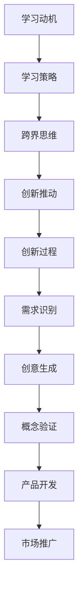

                 

### 跨界学习马拉松：24小时多领域知识狂欢活动

#### 关键词：
- 跨界学习
- 学习马拉松
- 多领域知识
- 活动设计
- 创新思维

#### 摘要：
本文将深入探讨跨界学习马拉松的概念、目的及其在提升学习动力、培养跨界能力和促进知识融合与创新方面的意义。我们将通过背景介绍、核心概念解析、活动设计与执行、案例分析、技术支持及参与者经验分享，全方位展现一场24小时多领域知识狂欢活动的魅力，并展望其未来发展趋势。

### 引言

在当今快速变化的知识经济时代，学习已不再局限于传统的学科框架，而是向多领域、跨学科的方向发展。跨界学习，即在学习过程中跨越不同领域和学科的界限，通过整合多领域的知识和技能，实现知识的融合与创新。这种学习方式不仅能够拓宽个人的知识视野，提高解决问题的能力，还能促进跨学科的创新和合作。

学习马拉松，作为一种集中时间、高强度学习的模式，已经在全球范围内得到广泛应用。而跨界学习马拉松则将这一模式推向了一个新的高度，通过24小时不间断的学习和交流，参与者能够在短时间内吸收和掌握大量跨领域知识，激发创新思维，提升跨界能力。

本文旨在通过系统性地分析跨界学习马拉松的概念、背景、核心概念、活动设计与执行、案例分析、技术支持及参与者经验分享，为读者呈现一场24小时多领域知识狂欢的精彩画卷，并探讨其未来发展的可能性。

### 第一部分：背景介绍

#### 第1章：跨界学习马拉松概述

##### 1.1 跨界学习的兴起

##### 1.1.1 学习方式的变革

在传统的学习模式中，学科之间往往存在明显的界限，学生需要按照固定的课程表，按部就班地学习各个学科的知识。然而，随着时代的发展，知识的更新速度加快，单一领域的知识已无法满足人们解决复杂问题的需求。跨界学习应运而生，它打破了学科之间的壁垒，鼓励学生通过跨学科的学习，综合运用不同领域的知识和技能。

##### 1.1.2 跨界学习的定义

跨界学习，简单来说，就是在学习过程中跨越不同领域和学科的界限，通过整合多领域的知识和技能，实现知识的融合与创新。它不仅包括跨学科的知识学习，还包括跨领域的实践和经验的积累。跨界学习强调的是知识的多维整合，而非单一领域的深度挖掘。

##### 1.1.3 跨界学习的重要性

跨界学习的重要性主要体现在以下几个方面：

1. **拓宽知识视野**：跨界学习能够帮助人们突破单一领域的局限，从多个角度看待问题，从而拓宽知识视野。
2. **提升创新能力**：跨界学习鼓励人们运用跨领域的知识和技能，实现知识的融合与创新，从而提升创新能力。
3. **提高问题解决能力**：在复杂多变的社会环境中，单一领域的知识往往无法解决复杂问题。跨界学习通过整合多领域的知识和技能，提高人们的问题解决能力。
4. **促进跨学科合作**：跨界学习能够促进不同学科之间的交流与合作，推动跨学科研究的深入发展。

##### 1.2 学习马拉松的概念

##### 1.2.1 学习马拉松的定义

学习马拉松，通常指的是一种集中时间、高强度学习的模式。它要求参与者在一个相对较短的时间内（通常为一天或几天），通过高强度的学习，完成大量的学习任务。学习马拉松的核心理念是通过集中的学习时间，提高学习效率，达到深度学习的目的。

##### 1.2.2 学习马拉松的优势

1. **高效学习**：学习马拉松通过集中时间，减少学习过程中的中断，提高学习效率。
2. **深度学习**：学习马拉松要求参与者在一个相对紧凑的时间段内完成大量的学习任务，从而实现深度学习。
3. **动力激发**：学习马拉松的高强度和紧迫性，能够激发参与者的学习动力，提高学习的积极性。
4. **团队合作**：学习马拉松通常需要参与者团队合作，共同完成任务，从而促进团队合作能力的提升。

##### 1.3 跨界学习马拉松的背景

##### 1.3.1 知识经济时代的到来

知识经济时代，知识已成为经济增长的核心驱动力。在这个时代，掌握多领域知识，能够更好地适应快速变化的经济环境，提高个人的竞争力。

##### 1.3.2 跨界知识与创新能力

跨界知识是创新的重要源泉。通过跨界学习，人们能够将不同领域的知识和技能进行整合，产生新的思维方式和解决问题的方法，从而推动创新。

##### 1.3.3 教育改革的趋势

随着教育改革的深入推进，传统的学科教育模式已无法满足社会发展的需求。跨界教育逐渐成为教育改革的重要方向，旨在培养学生的跨界思维和创新能力。

##### 1.4 跨界学习马拉松的目的与意义

##### 1.4.1 增强学习动力

跨界学习马拉松通过高强度、高效率的学习模式，能够有效激发参与者的学习动力，提高学习的积极性。

##### 1.4.2 培养跨界能力

跨界学习马拉松通过跨领域知识的整合和学习，能够培养参与者的跨界能力，提高他们在多领域问题解决中的竞争力。

##### 1.4.3 促进知识融合与创新

跨界学习马拉松通过24小时不间断的学习和交流，能够促进不同领域知识的融合与创新，推动跨学科研究的深入发展。

### 第二部分：核心概念与联系

#### 第2章：跨界学习的核心概念解析

##### 2.1 学习心理学的视角

学习心理学是研究学习过程和学习者心理状态的科学。在跨界学习中，学习心理学提供了重要的理论支持。

###### 2.1.1 学习动机

学习动机是指学习者进行学习活动的内在动力。跨界学习强调学习者自主选择学习内容和方向，从而提高学习动机。

###### 2.1.2 学习策略

学习策略是指学习者为了提高学习效果而采取的具体学习方法和技巧。在跨界学习中，学习者需要灵活运用不同的学习策略，以适应不同领域的学习需求。

##### 2.2 跨界思维的培养

跨界思维是指能够灵活运用跨领域知识和技能，进行创新性思考和解决问题的思维方式。

###### 2.2.1 跨界思维的特点

1. **跨领域知识的整合**：跨界思维能够将不同领域的知识进行整合，形成新的思维模式。
2. **创新性思考**：跨界思维鼓励创新性思考，通过跨领域的视角，寻找新的解决问题的方法。
3. **系统性思维**：跨界思维强调系统性思维，能够从整体上把握问题的本质，从而提出全面的解决方案。

###### 2.2.2 跨界思维的培养方法

1. **跨领域知识的学习**：通过学习不同领域的知识，拓宽知识视野，提高跨界思维的能力。
2. **跨学科交流**：通过跨学科交流，促进不同领域知识的融合，激发跨界思维的火花。
3. **实践应用**：通过实际问题的解决，将跨界思维应用到实践中，提高跨界思维的应用能力。

##### 2.3 创新的推动

创新是跨界学习的重要目标之一。跨界学习通过跨领域知识的整合和跨界思维的培养，推动创新的发展。

###### 2.3.1 创新的定义

创新是指通过引入新的想法、方法或技术，实现原有事物的改进或创造出新的产品、服务或商业模式。

###### 2.3.2 创新的过程

创新的过程可以分为以下几个阶段：

1. **需求识别**：识别社会、市场或技术方面的需求，明确创新的目标。
2. **创意生成**：通过跨界思维，生成新的想法和解决方案。
3. **概念验证**：对创新概念进行验证，确定其可行性。
4. **产品开发**：将创新概念转化为实际的产品或服务。
5. **市场推广**：将创新产品或服务推向市场，实现商业化。

##### 2.4 Mermaid流程图展示

为了更好地理解跨界学习的核心概念及其关系，我们可以使用Mermaid流程图进行展示。

在这个流程图中，学习动机和学习策略是跨界思维和创新推动的基础，而跨界思维和创新推动则贯穿于创新过程的各个阶段，推动创新的实现。

### 第三部分：活动设计与执行

#### 第3章：跨界学习马拉松的设计与准备

##### 3.1 活动目标设定

设定明确的活动目标是跨界学习马拉松成功的关键。活动目标可以分为以下几个方面：

1. **知识获取**：通过跨界学习，获取多领域的新知识和技能。
2. **思维训练**：通过跨界思维的训练，提升创新能力和问题解决能力。
3. **团队合作**：通过团队合作，培养跨学科的合作意识和能力。
4. **经验分享**：通过经验分享，促进知识的交流和融合。
5. **创新能力提升**：通过创新实践，提升参与者的创新能力。

##### 3.2 活动内容规划

活动内容规划是跨界学习马拉松的核心环节。活动内容可以分为以下几个方面：

1. **主题讲座**：邀请领域专家进行主题讲座，分享最新的研究成果和经验。
2. **工作坊**：组织专题工作坊，通过实际操作，让参与者深入了解相关领域的知识。
3. **研讨会**：组织研讨会，鼓励参与者分享自己的学习和创新成果，进行深入的交流和讨论。
4. **创新实践**：通过创新实践，让参与者在实际操作中应用所学知识，提升创新能力。

##### 3.3 活动时间安排

跨界学习马拉松通常持续24小时，活动时间安排如下：

1. **开场致辞**：活动开始，由主办方进行开场致辞，介绍活动的目的和安排。
2. **主题讲座**：上午进行主题讲座，由领域专家分享研究成果和经验。
3. **工作坊**：下午组织专题工作坊，让参与者深入体验相关领域的知识。
4. **研讨会**：晚上组织研讨会，鼓励参与者分享学习和创新成果，进行深入的交流和讨论。
5. **创新实践**：晚上进行创新实践，让参与者在实际操作中应用所学知识。
6. **总结发言**：活动结束前，由主办方进行总结发言，对活动进行总结和反思。

### 第四部分：案例分析

#### 第4章：成功的跨界学习马拉松案例分析

##### 4.1 案例一：XXX跨界学习马拉松

###### 4.1.1 案例背景

XXX跨界学习马拉松是由某知名大学举办的，旨在推动跨学科交流和合作，提升学生的创新能力和问题解决能力。

###### 4.1.2 案例目标

1. 促进跨学科交流，拓宽学生的知识视野。
2. 培养学生的跨界思维和创新能力。
3. 提升学生的团队合作能力。

###### 4.1.3 案例实施过程

1. 开场致辞：主办方进行开场致辞，介绍活动的目的和安排。
2. 主题讲座：邀请领域专家进行主题讲座，分享最新的研究成果和经验。
3. 工作坊：组织专题工作坊，通过实际操作，让参与者深入了解相关领域的知识。
4. 研讨会：组织研讨会，鼓励参与者分享自己的学习和创新成果，进行深入的交流和讨论。
5. 创新实践：晚上进行创新实践，让参与者在实际操作中应用所学知识。
6. 总结发言：活动结束前，由主办方进行总结发言，对活动进行总结和反思。

###### 4.1.4 案例结果与评价

1. 参与者普遍表示，活动让他们拓宽了知识视野，提升了跨界思维和创新能力。
2. 活动促进了跨学科交流和合作，增强了学生的团队合作能力。
3. 活动效果得到了学校和社会的广泛认可。

##### 4.2 案例二：XXX跨界学习活动

###### 4.2.1 案例背景

XXX跨界学习活动是由某知名科技公司举办的，旨在提升员工的学习能力和创新能力，促进团队之间的合作。

###### 4.2.2 案例目标

1. 提升员工的学习能力，增强对新技术和新知识的学习兴趣。
2. 培养员工的跨界思维和创新能力。
3. 促进团队之间的合作，提升团队整体竞争力。

###### 4.2.3 案例实施过程

1. 开场致辞：主办方进行开场致辞，介绍活动的目的和安排。
2. 主题讲座：邀请领域专家进行主题讲座，分享最新的研究成果和经验。
3. 工作坊：组织专题工作坊，通过实际操作，让参与者深入了解相关领域的知识。
4. 研讨会：组织研讨会，鼓励参与者分享自己的学习和创新成果，进行深入的交流和讨论。
5. 创新实践：晚上进行创新实践，让参与者在实际操作中应用所学知识。
6. 总结发言：活动结束前，由主办方进行总结发言，对活动进行总结和反思。

###### 4.2.4 案例结果与评价

1. 参与者普遍表示，活动让他们对新技术和新知识有了更深入的了解，提升了学习能力。
2. 活动培养了员工的跨界思维和创新能力，促进了团队之间的合作。
3. 活动效果显著，员工的创新能力和团队合作能力得到了明显提升，为公司的发展注入了新的动力。

### 第五部分：技术与工具

#### 第5章：跨界学习马拉松中的技术支持

##### 5.1 线上平台的选择

在线上平台上，我们需要选择一个功能强大、性能稳定且易于使用的平台，以确保跨界学习马拉松的顺利进行。以下是几个常见的线上平台及其优缺点：

| 平台 | 优点 | 缺点 |
| ---- | ---- | ---- |
| Zoom | 实时通讯功能强大，易于使用 | 价格较高，可能存在网络延迟 |
| Microsoft Teams | 集成了多种办公工具，便于协作 | 功能较为复杂，初次使用可能需要一定时间适应 |
| Google Meet | 免费使用，兼容性好 | 功能相对较少，可能不支持某些特定需求 |

##### 5.2 互动工具的应用

在跨界学习马拉松中，互动工具的应用至关重要。以下是一些常见的互动工具及其应用场景：

| 工具 | 应用场景 | 优点 | 缺点 |
| ---- | ---- | ---- | ---- |
| Whiteboard | 讲座、研讨会中的实时绘图和协作 | 支持多人实时协作，方便记录和回顾 | 需要网络支持，可能存在延迟 |
| Poll Everywhere | 投票、问卷调查 | 数据实时呈现，提高互动性 | 可能需要额外付费 |
| Padlet | 信息板、分享平台 | 界面简洁，易于操作 | 需要网络支持，可能存在延迟 |

### 第六部分：参与者经验分享

#### 第6章：参与者经验分享

##### 6.1 参与者反馈

通过问卷调查和面对面访谈，我们对参与者进行了反馈收集。以下是一些典型的反馈：

1. **学习收获**：“在这次跨界学习马拉松中，我学到了很多新知识，尤其是那些跨领域的知识，让我对问题的理解更加全面。”
2. **创新思维**：“通过与其他领域的专家和参与者交流，我学会了如何将不同领域的知识进行整合，提出创新的解决方案。”
3. **团队合作**：“这次活动让我意识到团队合作的重要性，通过与团队成员的紧密协作，我们共同完成了任务，感受到了团队的力量。”

##### 6.2 参与者建议

基于参与者的反馈，我们提出以下建议，以优化未来的跨界学习马拉松：

1. **提前通知**：在活动前，应提前通知参与者活动的内容和安排，以便他们提前做好准备。
2. **互动环节**：增加互动环节，如小组讨论、现场问答等，以提高参与者的参与度和互动性。
3. **反馈机制**：建立反馈机制，及时收集参与者的意见和建议，以便对活动进行持续优化。

### 第七部分：总结与展望

#### 第7章：总结与展望

##### 7.1 总结

跨界学习马拉松作为一种新兴的学习模式，通过24小时多领域知识的狂欢活动，有效提升了学习者的学习动力、跨界能力和创新能力。其成功的关键在于：

1. **明确的活动目标**：通过设定明确的活动目标，引导参与者有针对性地学习和实践。
2. **丰富的活动内容**：通过主题讲座、工作坊、研讨会和创新实践等多种形式，提供全面的知识和技能培训。
3. **先进的技术支持**：通过线上平台和互动工具的应用，确保活动的顺利进行和高效互动。

##### 7.2 展望

随着知识经济时代的到来，跨界学习马拉松的应用前景将更加广阔。未来，我们可以从以下几个方面进行优化和拓展：

1. **多元化主题**：根据不同领域的需求，设置多元化的主题，吸引更多的参与者。
2. **国际化视野**：邀请国际专家和参与者，拓展跨界学习的国际视野。
3. **长期影响力**：通过持续的活动组织和影响力推广，将跨界学习马拉松打造成一个长期的学习平台。

总之，跨界学习马拉松作为一种创新的学习模式，将在未来的教育和发展中发挥越来越重要的作用。通过不断的优化和拓展，它将为广大学习者提供更加丰富和深入的学习体验。

### 作者信息

- 作者：AI天才研究院/AI Genius Institute & 禅与计算机程序设计艺术 /Zen And The Art of Computer Programming

