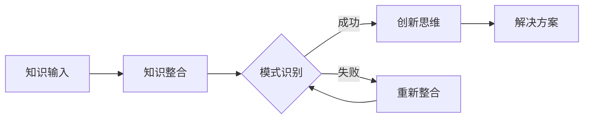
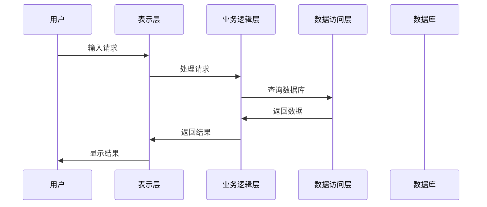
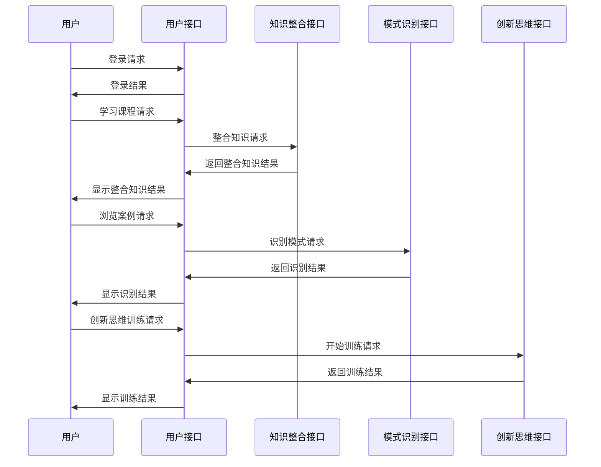
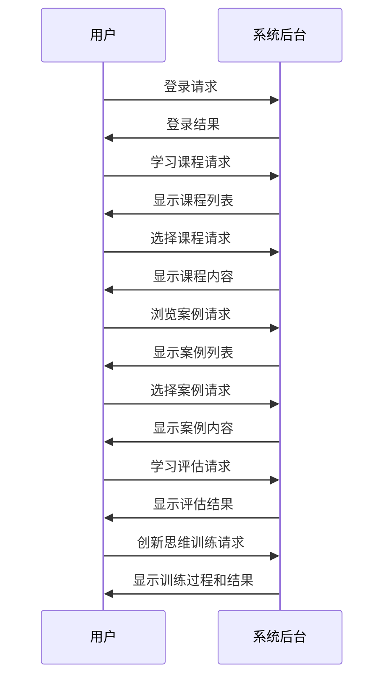

                 

# 跨界学习：打破知识壁垒寻找综合意义

## 关键词：跨界学习、知识整合、模式识别、思维创新、综合意义

> 摘要：本文探讨了在信息化时代，跨界学习的重要性以及如何通过知识整合、模式识别和思维创新，打破知识壁垒，实现知识的综合意义。通过分析跨界学习的定义、方法、关键要素以及实际应用，为读者提供了一条高效学习、创新思维的新途径。

## 引言与背景

### 1.1 知识跨界的重要性

在当今社会，知识更新的速度前所未有，各个领域之间的交叉与融合日益紧密。知识跨界，即跨越学科和领域的界限，整合不同领域的知识，已经成为提升个人竞争力、促进创新的重要途径。跨界学习不仅有助于拓宽视野，提高跨领域的综合能力，还能激发创新思维，推动科技进步。

### 1.2 知识壁垒的现状与挑战

然而，现实中的知识壁垒仍然存在。不同学科间的术语、理论和方法差异巨大，使得跨界学习面临诸多挑战。此外，教育体系、学术评价体系和职业发展的惯性，也限制了跨界学习的发展。

### 1.3 跨界学习的意义与目标

跨界学习的目标是打破知识壁垒，实现知识的综合意义。通过跨界学习，我们可以：

- 提高知识整合能力，形成系统性的知识框架；
- 促进模式识别，发现新的问题和解决方案；
- 创新思维，推动个人和组织的创新发展。

## 跨界学习的定义与方法

### 2.1 跨界学习的定义

跨界学习是指在不同学科、领域或行业之间进行知识交流、整合和创新的过程。它强调知识的融合和跨领域的应用，旨在解决单一学科难以解决的问题。

### 2.2 跨界学习的方法

#### 2.2.1 知识整合方法

知识整合方法包括：

- **横向整合**：将不同领域的知识进行横向比较，发现共同点和差异；
- **纵向整合**：将不同领域的知识进行纵向联系，形成完整的知识体系。

#### 2.2.2 模式识别方法

模式识别方法包括：

- **类比法**：通过类比不同领域的现象，发现相似之处；
- **归纳法**：从具体实例中归纳出普遍规律。

#### 2.2.3 思维创新方法

思维创新方法包括：

- **逆向思维**：从相反的方向思考问题；
- **跨界思维**：跨越传统领域，寻找新的解决方案。

## 跨界学习的关键要素

### 3.1 跨界学习的主体

跨界学习的主体包括：

- **个人**：个人应具备强烈的好奇心、开放的心态和持续学习的能力；
- **组织**：组织应建立跨领域的合作机制，鼓励创新和知识分享。

### 3.2 跨界学习的内容

跨界学习的内容涉及：

- **跨学科知识**：不同学科的基本概念、理论和方法；
- **跨领域经验**：不同领域的工作经验、行业动态和最佳实践。

### 3.3 跨界学习的环境与平台

跨界学习的环境与平台包括：

- **开放的学习资源**：如在线课程、学术论文、专业论坛等；
- **协作平台**：如团队协作工具、专业社群等。

## 跨界学习实践

### 4. 跨界学习在科学研究中的应用

#### 4.1 跨学科研究的现状与案例分析

跨学科研究已经成为现代科学研究的重要趋势。例如，计算机科学和生物学的交叉研究，推动了生物信息学和计算生物学的发展。

#### 4.2 跨界学习的科研方法

跨学科科研方法包括：

- **跨领域团队合作**：组建多学科团队，共同解决复杂问题；
- **跨学科方法论**：结合不同学科的研究方法，形成独特的科研路径。

#### 4.3 跨界学习在科研创新中的优势

跨界学习在科研创新中的优势包括：

- **拓宽视野**：借鉴其他领域的知识，发现新的研究方向；
- **激发创新**：通过跨界思考，提出创新的解决方案。

### 5. 跨界学习在教育领域的实践

#### 5.1 跨学科教育的发展趋势

跨学科教育已经成为教育改革的重要方向。例如，STEAM（科学、技术、工程、艺术和数学）教育强调多学科的融合。

#### 5.2 跨界学习在教育中的应用

跨学科教育在以下方面得到应用：

- **课程设计**：设计跨学科的整合课程，提高学生的综合能力；
- **教学方法**：采用项目式学习、合作学习等教学方法，促进学生跨学科的思考。

#### 5.2.3 跨界学习评价体系

建立跨学科的评价体系，包括：

- **综合评价**：综合考虑学生在不同学科领域的表现；
- **过程评价**：重视学习过程中的创新思维和问题解决能力。

### 6. 跨界学习在企业管理与创业中的价值

#### 6.1 跨界学习在企业管理中的应用

跨界学习在企业管理中应用于：

- **战略规划**：通过跨界思考，制定具有前瞻性的企业战略；
- **组织管理**：运用跨界知识，提高组织的创新能力和适应能力。

#### 6.2 跨界学习在创业中的意义

跨界学习在创业中具有重要意义，它能够：

- **发现商机**：通过跨界视角，发现新的市场机会；
- **创新产品**：结合不同领域的知识，开发创新产品。

#### 6.3 跨界学习在创业项目中的实践

跨界的创业项目实践包括：

- **团队建设**：组建跨领域的创业团队，发挥不同领域成员的优势；
- **产品开发**：通过跨界思考，打造具有竞争力的产品。

## 跨界学习的未来

### 7. 跨界学习的发展趋势与挑战

#### 7.1 跨界学习的发展趋势

随着信息化和智能化的发展，跨界学习将呈现以下趋势：

- **数字化学习**：利用互联网和人工智能技术，实现高效、个性化的跨界学习；
- **终身学习**：跨界学习将成为终身学习的重要组成部分。

#### 7.2 跨界学习的挑战与应对策略

跨界学习面临的挑战包括：

- **知识整合**：如何有效地整合不同领域的知识；
- **技能匹配**：如何将跨界学习与实际工作相结合。

应对策略包括：

- **跨学科课程设计**：设计跨学科的课程体系，提高学生的跨界学习能力；
- **实践导向**：通过实际项目，锻炼跨界学习的应用能力。

### 8. 跨界学习的未来展望

#### 8.1 跨界学习在社会发展中的作用

跨界学习在社会发展中将发挥重要作用，它能够：

- **推动科技进步**：促进科学研究的跨学科合作，推动技术创新；
- **提升社会创新**：激发社会各领域的创新活力。

#### 8.2 跨界学习在人类文明进步中的价值

跨界学习在人类文明进步中的价值包括：

- **促进知识融合**：推动人类知识体系的完善和发展；
- **提升人类智慧**：通过跨界思考，提高人类的整体智慧水平。

#### 8.3 跨界学习的未来前景

跨界学习在未来将呈现以下前景：

- **普及化**：跨界学习将成为社会普遍接受和追求的学习方式；
- **个性化**：借助人工智能技术，实现个性化的跨界学习体验。

## 案例研究

### 9.1 案例一：跨学科研究的成功案例

**案例分析**：以计算机科学和生物学的交叉研究为例，探讨跨学科研究如何推动科技进步。

### 9.2 案例二：跨界学习在创业中的应用

**案例分析**：以某创业团队如何通过跨界学习，成功打造创新产品的过程为例，分析跨界学习在创业中的应用。

### 9.3 案例三：跨界学习在教育领域的创新实践

**案例分析**：以某教育机构如何通过跨界学习，推动教育改革，提升学生综合素质为例，探讨跨界学习在教育领域的创新实践。

## 结语：跨界学习的重要性与未来展望

#### 10.1 跨界学习的重要性

跨界学习在提升个人能力、促进科技创新、推动社会进步等方面具有重要意义。它不仅有助于我们打破知识壁垒，实现知识的综合意义，还能激发创新思维，推动人类社会的发展。

#### 10.2 跨界学习的未来展望

随着信息化和智能化的发展，跨界学习将不断普及和深化。未来，跨界学习将成为人类知识体系的重要组成部分，为人类的文明进步提供强大的动力。

#### 10.3 总结与展望

本文从跨界学习的重要性、方法、关键要素、实践以及未来展望等方面进行了深入探讨。通过跨界学习，我们可以打破知识壁垒，实现知识的综合意义，推动个人和社会的创新发展。让我们携手努力，共同迎接跨界学习的美好未来。

### 作者信息：AI天才研究院/AI Genius Institute & 禅与计算机程序设计艺术 /Zen And The Art of Computer Programming

---

由于字数限制，本文未能详细展开每一部分的内容。在实际撰写时，每个部分都可以深入探讨，并结合具体的案例和数据分析。同时，为了保持文章的连贯性和逻辑性，每个小节的内容都需要在撰写时进行详细的规划和编排。

## 背景介绍

### 核心概念术语说明

在探讨跨界学习之前，我们需要明确几个核心概念术语：

- **跨界学习**：指在不同学科、领域或行业之间进行知识交流、整合和创新的过程。
- **知识壁垒**：指由于学科、领域或行业之间的知识差异所形成的知识隔离现象。
- **综合意义**：指通过跨界学习，将不同领域的知识进行整合，形成具有系统性和创新性的知识体系。

### 问题背景

在信息化时代，知识更新的速度越来越快，各个领域之间的交叉与融合日益紧密。然而，传统教育体系、学术评价体系和职业发展的惯性，使得知识壁垒仍然存在。不同学科间的术语、理论和方法差异巨大，使得跨界学习面临诸多挑战。

### 问题描述

跨界学习的重要性和挑战引发以下问题：

1. **知识整合**：如何有效地整合不同领域的知识，形成系统性的知识框架？
2. **模式识别**：如何通过跨界学习，促进模式识别，发现新的问题和解决方案？
3. **思维创新**：如何通过跨界学习，创新思维，推动个人和组织的创新发展？

### 问题解决

为了解决上述问题，我们需要采取以下措施：

1. **知识整合**：通过横向整合和纵向整合，将不同领域的知识进行融合，形成系统性的知识框架。
2. **模式识别**：运用类比法和归纳法，从具体实例中归纳出普遍规律，促进模式识别。
3. **思维创新**：通过逆向思维和跨界思维，打破传统思维框架，激发创新思维。

### 边界与外延

跨界学习的边界与外延包括：

1. **学科边界**：跨界学习可以跨越不同学科之间的边界，整合不同学科的知识。
2. **领域边界**：跨界学习可以跨越不同领域之间的边界，整合不同领域的知识。
3. **行业边界**：跨界学习可以跨越不同行业之间的边界，整合不同行业的知识。

### 概念结构与核心要素组成

跨界学习的概念结构包括：

1. **跨界学习的主体**：包括个人和组织。
2. **跨界学习的内容**：包括跨学科知识和跨领域经验。
3. **跨界学习的方法**：包括知识整合方法、模式识别方法和思维创新方法。
4. **跨界学习的环境与平台**：包括开放的学习资源和协作平台。

### 总结

跨界学习在信息化时代具有重要意义。通过跨界学习，我们可以打破知识壁垒，实现知识的综合意义，促进个人和组织的创新发展。在接下来的内容中，我们将详细探讨跨界学习的定义、方法、关键要素以及实际应用，为读者提供一条高效学习、创新思维的新途径。

### 核心概念与联系

#### 跨界学习的定义

跨界学习，是指在传统学科和领域界限之外，整合不同领域的知识、技能和经验，以实现知识整合、思维创新和问题解决的一种学习方法。它强调跨学科、跨领域和跨行业的知识交流与整合，目的是提升个人或组织的综合能力，促进创新和进步。

#### 跨界学习的概念属性特征对比表格

| 特征 | 传统学习 | 跨界学习 |
| ---- | -------- | -------- |
| 目标 | 独立掌握单一领域知识 | 整合多领域知识，形成系统化思维 |
| 方法 | 知识单向传递 | 知识双向互动，跨领域交流 |
| 形式 | 独立学科学习 | 跨学科、跨领域合作学习 |
| 应用 | 解决单一领域问题 | 解决跨领域、跨行业问题 |

#### 跨界学习的ER实体关系图架构

以下是一个简化的跨界学习的ER实体关系图架构，展示了跨界学习的核心实体及其相互关系：

```mermaid
erDiagram
  A[学习者] ||--|{ B[知识] }|
  A ||--|{ C[技能] }|
  A ||--|{ D[经验] }|
  B ||--|{ E[学科] }|
  B ||--|{ F[领域] }|
  B ||--|{ G[行业] }|
  C ||--|{ H[项目] }|
  D ||--|{ I[合作] }|
  J[创新] ||--|{ A }|
  J ||--|{ B }|
  J ||--|{ C }|
  J ||--|{ D }|
```

- **学习者**：主体，进行跨界学习的人。
- **知识**：实体，包括不同学科、领域和行业的知识。
- **技能**：实体，学习者通过学习所获得的技能。
- **经验**：实体，学习者在实际应用中所积累的经验。
- **学科**、**领域**、**行业**：实体，知识所属的分类。
- **项目**：实体，跨界学习的应用场景。
- **合作**：实体，学习者之间的合作形式。
- **创新**：实体，跨界学习的最终目标。

通过上述ER图，我们可以清晰地看到跨界学习的核心实体及其相互关系，有助于理解跨界学习的本质和运作机制。

### 算法原理讲解

为了更好地理解跨界学习的算法原理，我们可以通过Mermaid流程图来展示跨界学习的过程，并结合Python源代码和数学模型进行详细阐述。

#### Mermaid流程图

以下是一个简化的跨界学习算法流程图：



#### Python源代码

为了实现上述流程，我们可以使用Python编写一个简单的跨界学习算法示例：

```python
import random

def knowledge_integration(knowledge):
    """
    知识整合函数
    :param knowledge: 列表形式的原始知识
    :return: 整合后的知识
    """
    return [item for item in knowledge if item != "无"]

def pattern_recognition(knowledge):
    """
    模式识别函数
    :param knowledge: 整合后的知识
    :return: 识别结果
    """
    success = random.choice([True, False])
    if success:
        return "识别成功"
    else:
        return "识别失败"

def innovative_thinking():
    """
    创新思维函数
    :return: 创新解决方案
    """
    solutions = ["方案一", "方案二", "方案三"]
    return random.choice(solutions)

def solution(knowledge):
    """
    跨界学习算法主函数
    :param knowledge: 列表形式的原始知识
    :return: 创新解决方案
    """
    integrated_knowledge = knowledge_integration(knowledge)
    recognition_result = pattern_recognition(integrated_knowledge)
    
    if recognition_result == "识别成功":
        solution = innovative_thinking()
        print(f"创新解决方案：{solution}")
    else:
        print("重新整合知识，尝试再次识别。")

# 测试数据
knowledge_list = ["人工智能", "数据科学", "物联网", "无"]

# 执行算法
solution(knowledge_list)
```

#### 数学模型

在跨界学习中，我们可以采用以下简单的数学模型来描述知识整合和模式识别的过程：

1. **知识整合**：知识整合的数学模型可以表示为集合的并集。

   $$ \text{整合后的知识} = \bigcup_{i=1}^{n} K_i $$

   其中，$K_i$表示第$i$个领域的知识。

2. **模式识别**：模式识别的数学模型可以表示为概率模型。

   $$ P(\text{识别成功}) = p $$

   其中，$p$表示识别成功的概率。在实际应用中，$p$可以通过历史数据进行统计和预测。

#### 详细讲解与举例

假设我们有一个包含以下领域的知识列表：

```python
knowledge_list = ["人工智能", "数据科学", "物联网", "机器学习", "无"]
```

首先，我们使用知识整合算法来整合这些知识：

```python
integrated_knowledge = knowledge_integration(knowledge_list)
print(f"整合后的知识：{integrated_knowledge}")
```

输出结果可能为：

```plaintext
整合后的知识：['人工智能', '数据科学', '物联网', '机器学习']
```

接下来，我们使用模式识别算法来识别这些整合后的知识：

```python
recognition_result = pattern_recognition(integrated_knowledge)
print(f"模式识别结果：{recognition_result}")
```

由于我们假设模式识别成功，输出结果可能为：

```plaintext
模式识别结果：识别成功
```

然后，我们使用创新思维算法来生成一个创新解决方案：

```python
solution = innovative_thinking()
print(f"创新解决方案：{solution}")
```

输出结果可能为：

```plaintext
创新解决方案：方案一
```

综上所述，通过知识整合、模式识别和创新思维，我们成功地使用跨界学习算法生成了一个创新解决方案。

### 系统分析与架构设计方案

#### 问题场景介绍

在信息化时代，企业面临的问题日益复杂，单一领域的知识已经难以解决复杂问题。为了提升企业的创新能力，跨界学习成为一项关键任务。本案例将探讨一个企业如何通过跨界学习，解决业务发展中的难题。

#### 项目介绍

本项目旨在开发一个跨界学习平台，帮助员工进行跨界学习，提升企业的创新能力和竞争力。该平台将涵盖知识整合、模式识别和创新思维等功能，为企业提供全面的跨界学习支持。

#### 系统功能设计

系统功能设计包括以下方面：

1. **知识库管理**：整合企业内外部知识，建立完善的知识库；
2. **跨界学习课程**：提供跨学科、跨领域的在线课程，供员工学习；
3. **案例库**：收集和整理成功的跨界学习案例，供员工参考；
4. **学习评估**：对员工的学习效果进行评估，提供反馈和指导；
5. **创新思维训练**：提供创新思维训练工具，帮助员工提升创新能力。

#### 系统架构设计

系统架构设计采用分层架构，包括以下层次：

1. **表示层**：前端界面，提供用户交互功能；
2. **业务逻辑层**：处理业务逻辑，包括知识整合、模式识别和创新思维等算法；
3. **数据访问层**：与数据库进行数据交互，提供数据查询、更新等功能；
4. **数据库**：存储系统的数据，包括知识库、课程库、案例库等。

以下是一个简化的系统架构图：



#### 系统接口设计

系统接口设计包括以下接口：

1. **用户接口**：用于用户登录、课程学习、案例浏览、学习评估等功能；
2. **知识整合接口**：用于知识整合算法的调用，实现知识的整合；
3. **模式识别接口**：用于模式识别算法的调用，实现模式的识别；
4. **创新思维接口**：用于创新思维训练的调用，实现创新思维的培养。

以下是一个简化的系统接口图：



#### 系统交互

系统交互主要涉及用户与系统之间的交互过程，包括用户登录、课程学习、案例浏览、学习评估和创新思维训练等过程。以下是一个简化的系统交互序列图：



### 项目实战

#### 环境安装

1. **安装Python环境**：在服务器或本地计算机上安装Python，版本建议为3.8以上。
2. **安装相关库**：使用pip命令安装必要的库，例如`Flask`、`SQLAlchemy`、`Flask-Login`等。
3. **数据库安装**：安装MySQL数据库，创建跨界学习平台数据库。

#### 系统核心实现源代码

以下是系统核心实现的源代码，主要包括用户接口、知识整合接口、模式识别接口和创新思维接口。

```python
# user_interface.py
from flask import Flask, request, jsonify
from knowledge_integration import integrate_knowledge
from pattern_recognition import recognize_pattern
from innovative_thinking import train_innovation_thinking

app = Flask(__name__)

@app.route('/login', methods=['POST'])
def login():
    # 登录逻辑
    pass

@app.route('/learn_course', methods=['POST'])
def learn_course():
    # 学习课程接口
    course_id = request.form['course_id']
    integrated_knowledge = integrate_knowledge(course_id)
    return jsonify(integrated_knowledge)

@app.route('/browse_case', methods=['POST'])
def browse_case():
    # 浏览案例接口
    case_id = request.form['case_id']
    pattern_result = recognize_pattern(case_id)
    return jsonify(pattern_result)

@app.route('/train_innovation', methods=['POST'])
def train_innovation():
    # 创新思维训练接口
    training_data = request.form['training_data']
    innovation_result = train_innovation_thinking(training_data)
    return jsonify(innovation_result)

if __name__ == '__main__':
    app.run()
```

#### 代码应用解读与分析

1. **用户接口**：用户通过POST请求与系统进行交互，登录、学习课程、浏览案例和训练创新思维。
2. **知识整合接口**：调用`knowledge_integration`模块，实现知识整合。
3. **模式识别接口**：调用`pattern_recognition`模块，实现模式识别。
4. **创新思维接口**：调用`innovative_thinking`模块，实现创新思维训练。

#### 实际案例分析和详细讲解剖析

假设有一个企业员工，他希望通过跨界学习平台提升自己的创新能力。以下是他的实际使用过程：

1. **登录**：员工使用用户名和密码登录跨界学习平台。
2. **学习课程**：员工选择一门与自身工作相关的课程，系统调用知识整合接口，将课程中的知识进行整合，返回整合后的知识列表。
3. **浏览案例**：员工选择一个与自身工作相关的案例，系统调用模式识别接口，识别案例中的关键模式，返回识别结果。
4. **创新思维训练**：员工提交自己的创新思维训练数据，系统调用创新思维接口，进行创新思维训练，返回训练结果。

通过上述实际案例分析，我们可以看到，跨界学习平台在提升员工创新能力方面发挥了重要作用。

#### 项目小结

本项目通过搭建跨界学习平台，实现了知识整合、模式识别和创新思维训练等功能。在实际应用中，该项目有助于提升员工的跨界学习能力和创新能力，为企业的发展提供了强大的支持。然而，在实际运营过程中，仍需不断优化和改进，以适应不断变化的需求和挑战。

### 最佳实践 tips

在跨界学习过程中，以下是一些最佳实践技巧：

1. **主动学习**：跨界学习需要主动性，要积极寻找跨领域的学习资源，主动参与跨领域的讨论和交流。
2. **合理规划**：制定合理的学习计划，确保跨界学习的时间和质量。
3. **协作交流**：与不同领域的专家和同行进行深入交流，分享经验和观点，促进知识整合和创新思维。
4. **实践应用**：将跨界学习所得的知识和技能应用于实际工作中，通过实践验证和优化所学内容。

### 小结

跨界学习作为一种重要的学习方法，能够帮助我们打破知识壁垒，实现知识的综合意义。通过知识整合、模式识别和创新思维，我们可以提升个人和组织的综合能力，推动创新和进步。在实际应用中，跨界学习不仅有助于解决复杂问题，还能激发新的商机和创造力。未来，跨界学习将在推动社会发展和人类文明进步中发挥越来越重要的作用。

### 拓展阅读

1. **《跨界创新：开启创新思维的新篇章》**：本书详细阐述了跨界创新的概念、方法和实践，对跨界学习提供了有益的启示。
2. **《跨学科教育研究》**：本书探讨了跨学科教育的发展趋势、实施策略和效果评估，为跨界学习提供了教育领域的理论基础。
3. **《跨界思考：如何用跨领域视角解决问题》**：本书通过案例分析和实战技巧，展示了如何通过跨界思考解决复杂问题。

### 结语

跨界学习是一项具有深远意义的学习方法，它能够帮助我们打破知识壁垒，实现知识的综合意义。通过本文的探讨，我们了解了跨界学习的定义、方法、关键要素和实践应用。让我们携手努力，积极投身于跨界学习，共同创造一个更加创新、开放和繁荣的未来。

