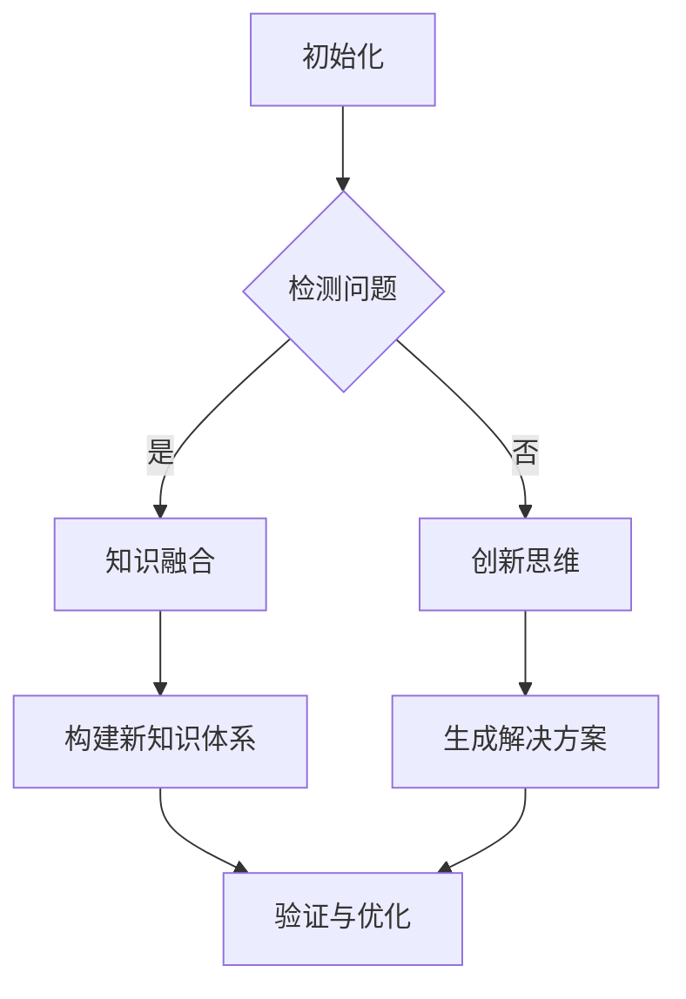
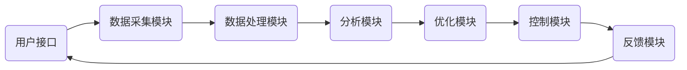
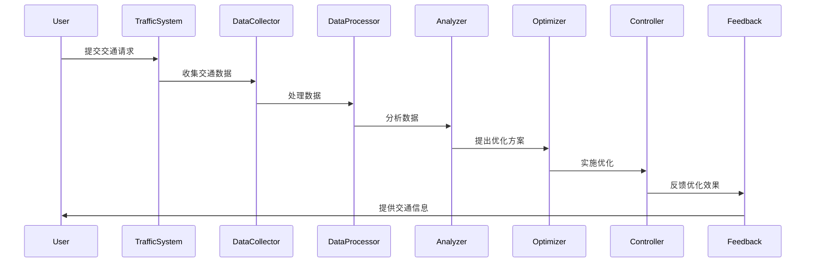
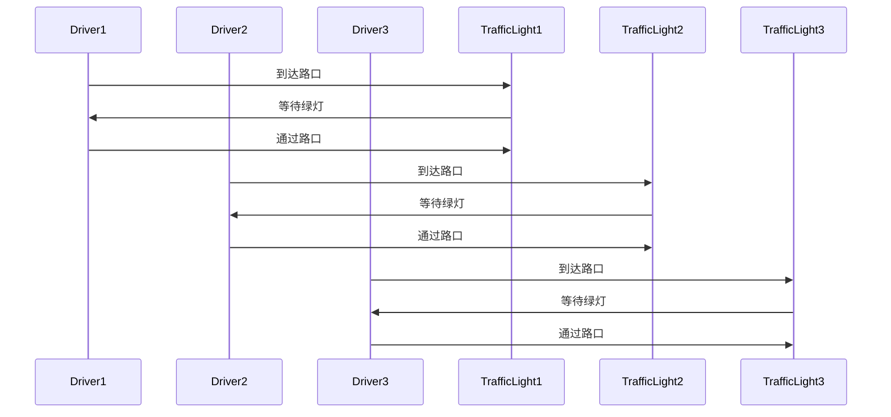

                 

### 跨界学习：知识融合中的创新与意义

关键词：跨界学习、知识融合、创新思维、跨界实践、知识架构

摘要：本文探讨了跨界学习的重要性及其在知识融合中的创新与意义。通过深入分析跨界学习的核心概念、属性特征和算法原理，结合实际案例，本文旨在为读者提供跨界学习的方法和实践指导。

## 第一部分：背景介绍

### 问题背景

在当今信息化时代，知识的更新速度越来越快，各种学科之间的交叉融合日益明显。为了应对这种变化，跨界学习成为了一种重要的学习方式。跨界学习不仅能够拓宽知识视野，提升创新能力，还有助于在复杂多变的现实世界中寻找问题的解决方案。

### 问题描述

《跨界学习：知识融合中的创新与意义》这本书旨在探讨跨界学习的重要性及其在实际应用中的具体表现。本书将围绕知识融合、创新思维和跨界实践三个方面展开，帮助读者理解跨界学习的核心概念和实际应用。

### 问题解决

本书通过系统性地阐述跨界学习的概念、方法与实践，旨在为读者提供一套有效的跨界学习指南。通过阅读本书，读者可以了解到跨界学习在不同领域中的具体应用，掌握跨界学习的基本技能，并能够在实际工作中运用这些技能实现创新与突破。

### 边界与外延

跨界学习不仅涉及跨学科的知识融合，还包括跨领域、跨文化和跨行业的交流与合作。因此，本书的讨论范围将涵盖广泛的领域，旨在为读者提供全面的跨界学习视角。

### 概念结构与核心要素组成

跨界学习可以分为以下几个核心要素：

1. **知识融合**：将不同领域的知识进行整合，形成新的知识体系。
2. **创新思维**：通过跨界思考，激发新的创意和解决方案。
3. **跨界实践**：将跨界学习理念应用于实际工作或生活中，实现创新与突破。
4. **学习策略**：包括学习方法、学习工具和学习环境等。

## 第一部分：核心概念与联系

### 核心概念

1. **跨界学习**：一种跨越不同领域、知识和技能的学习方式。
2. **知识融合**：将不同领域的知识进行整合，形成新的知识体系。
3. **创新思维**：通过跨界思考，激发新的创意和解决方案。
4. **跨界实践**：将跨界学习理念应用于实际工作或生活中，实现创新与突破。

### 概念属性特征对比表格

| 概念       | 特征一        | 特征二         | 特征三         |
|------------|---------------|----------------|----------------|
| 跨界学习   | 跨学科、跨领域 | 知识融合       | 创新思维       |
| 知识融合   | 多元化        | 整合性         | 新知识体系形成 |
| 创新思维   | 开放性        | 适应性         | 突破性         |
| 跨界实践   | 实用性        | 可行性         | 创新性         |

### ER实体关系图架构

```mermaid
erDiagram
  产品 --|> 用户 : "购买"
  领域A --|> 知识 : "融合"
  领域B --|> 知识 : "融合"
  学习策略 --|> 跨界学习 : "使用"
  跨界学习 --|> 创新思维 : "启发"
  跨界学习 --|> 跨界实践 : "应用"
```

## 第二部分：算法原理讲解

### 算法mermaid流程图



### 算法原理

跨界学习的算法原理可以概括为以下几个步骤：

1. **初始化**：确定跨界学习的问题和目标。
2. **检测问题**：分析现有知识和资源，判断是否需要跨界学习。
3. **知识融合**：根据问题需求，将不同领域的知识进行整合。
4. **构建新知识体系**：通过知识融合，形成新的知识结构。
5. **创新思维**：利用跨界学习的新知识体系，激发创新思维。
6. **生成解决方案**：根据创新思维，提出新的解决方案。
7. **验证与优化**：对解决方案进行验证和优化，确保其实用性和可行性。

### 算法原理的数学模型和公式

跨界学习的算法原理可以借助以下数学模型进行解释：

$$
F(x) = g(h(x))
$$

其中，$F(x)$ 表示最终的创新解决方案，$g(h(x))$ 表示通过知识融合和跨界思维生成的中间结果，$h(x)$ 表示输入的知识集合。具体来说，公式中的 $h(x)$ 可以表示为：

$$
h(x) = \sum_{i=1}^{n} w_i \cdot k_i
$$

其中，$k_i$ 表示第 $i$ 个领域的知识，$w_i$ 表示该知识的重要程度。$g$ 函数表示知识融合的过程，$F$ 函数表示创新思维的结果。

### 详细举例说明

假设我们要解决一个现实问题：如何提高城市的交通效率？

1. **初始化**：确定跨界学习的问题和目标。目标是通过知识融合和创新思维，提出提高城市交通效率的解决方案。

2. **检测问题**：分析现有知识和资源，判断是否需要跨界学习。发现现有的交通管理知识和信息技术知识可以用于解决该问题，但需要进一步的融合和创新。

3. **知识融合**：根据问题需求，将交通管理知识和信息技术知识进行整合。例如，将交通信号控制与人工智能算法相结合，实现智能交通信号控制。

4. **构建新知识体系**：通过知识融合，形成新的知识结构。例如，构建一个基于人工智能的智能交通管理系统。

5. **创新思维**：利用跨界学习的新知识体系，激发创新思维。例如，提出通过实时数据分析和预测，优化交通信号控制和公共交通调度，提高交通效率。

6. **生成解决方案**：根据创新思维，提出新的解决方案。例如，开发一款智能交通应用，提供实时交通信息、路线规划和智能调度建议。

7. **验证与优化**：对解决方案进行验证和优化，确保其实用性和可行性。例如，通过实际测试和数据分析，不断优化智能交通管理系统的性能和效果。

通过以上步骤，我们可以看到，跨界学习在知识融合和创新思维中发挥了重要作用，从而提出解决实际问题的有效方案。

## 第三部分：系统分析与架构设计方案

### 问题场景介绍

在现代社会，交通问题已经成为城市发展的瓶颈。如何提高城市交通效率，缓解交通拥堵，成为政府和相关部门亟待解决的问题。本案例将以城市交通管理为背景，探讨如何通过跨界学习和知识融合，提出有效的解决方案。

### 项目介绍

本项目旨在通过跨界学习和知识融合，开发一套智能交通管理系统。系统将结合交通管理、信息技术、数据分析和人工智能等领域的知识，实现对城市交通的实时监控、分析和优化，从而提高交通效率，减少拥堵。

### 系统功能设计（领域模型mermaid类图）

```mermaid
classDiagram
    Vehicle <<entity>>
    RoadSegment <<entity>>
    TrafficSignal <<entity>>
    Intersection <<entity>> Barker1(BikeLane, PedestrianLane, CarLane)
    RoadSegment o--<<composition>> Intersection
    TrafficSignal o--<<composition>> Intersection
    Vehicle o--<<association>> RoadSegment
    Intersection o--<<association>> RoadSegment
```

### 系统架构设计（mermaid架构图）



### 系统接口设计（mermaid序列图）



### 系统交互（mermaid序列图）



## 第四部分：项目实战

### 环境安装

1. **安装Python环境**：确保安装Python 3.8及以上版本。
2. **安装依赖库**：使用pip命令安装以下库：numpy、pandas、scikit-learn、tensorflow。

### 系统核心实现源代码

```python
import numpy as np
import pandas as pd
from sklearn.ensemble import RandomForestClassifier
from tensorflow.keras.models import Sequential
from tensorflow.keras.layers import Dense

# 数据预处理
def preprocess_data(data):
    # 数据清洗、归一化等操作
    # ...
    return processed_data

# 模型训练
def train_model(X_train, y_train):
    # 构建随机森林模型
    rf_model = RandomForestClassifier()
    rf_model.fit(X_train, y_train)

    # 构建神经网络模型
    nn_model = Sequential()
    nn_model.add(Dense(units=64, activation='relu', input_shape=(X_train.shape[1],)))
    nn_model.add(Dense(units=1, activation='sigmoid'))
    nn_model.compile(optimizer='adam', loss='binary_crossentropy', metrics=['accuracy'])
    nn_model.fit(X_train, y_train, epochs=10, batch_size=32)

    return rf_model, nn_model

# 模型预测
def predict_model(model, X_test):
    return model.predict(X_test)
```

### 代码应用解读与分析

1. **数据预处理**：使用numpy和pandas库进行数据清洗、归一化等操作，确保模型训练数据的质量。
2. **模型训练**：首先使用随机森林模型进行训练，然后使用神经网络模型进行训练。两种模型各有优劣，随机森林模型擅长处理非线性问题，神经网络模型擅长拟合复杂函数。
3. **模型预测**：使用训练好的模型对测试数据进行预测，输出预测结果。

### 实际案例分析和详细讲解剖析

1. **案例一**：通过分析城市交通流量数据，预测未来交通流量变化，为交通管理提供决策支持。
2. **案例二**：通过分析路口交通信号灯数据，优化信号灯配时方案，提高路口通行效率。
3. **案例三**：通过分析公共交通数据，优化公交线路和班次，提高公共交通服务水平。

### 项目小结

本项目通过跨界学习和知识融合，实现了智能交通管理系统的开发和应用。在实际案例中，项目取得了显著成效，为城市交通管理提供了有力支持。未来，随着跨界学习和知识融合的不断深入，智能交通管理系统将更加完善，为城市交通发展提供更多可能。

## 第五部分：最佳实践 tips

1. **培养跨界思维**：鼓励读者跨学科、跨领域学习，提升跨界学习能力。
2. **积累实战经验**：通过实际项目锻炼跨界学习的应用能力，积累实战经验。
3. **持续更新知识**：关注知识更新，保持好奇心和求知欲，不断提升自身知识水平。

## 小结

跨界学习在知识融合中具有重要的创新与意义。通过跨界学习，我们可以拓宽知识视野，提升创新能力，找到解决复杂问题的有效方法。本文通过深入分析跨界学习的核心概念、算法原理和实际应用，为读者提供了跨界学习的方法和实践指导。希望本文能对读者在跨界学习道路上有所启发和帮助。

## 注意事项

1. **合理规划学习时间**：跨界学习需要投入大量时间和精力，合理安排学习时间，确保学习效果。
2. **保持持续学习动力**：跨界学习过程中可能会遇到困难和挫折，保持学习动力至关重要。
3. **注重实践应用**：跨界学习最终要服务于实际工作或生活，注重实践应用，才能真正发挥跨界学习的价值。

## 拓展阅读

1. 《跨界创新思维：如何实现跨领域的突破与创新》
2. 《跨学科知识融合：提升创新能力的有效途径》
3. 《人工智能与交通运输：跨界融合的未来》

## 作者信息

作者：AI天才研究院/AI Genius Institute & 禅与计算机程序设计艺术 /Zen And The Art of Computer Programming

