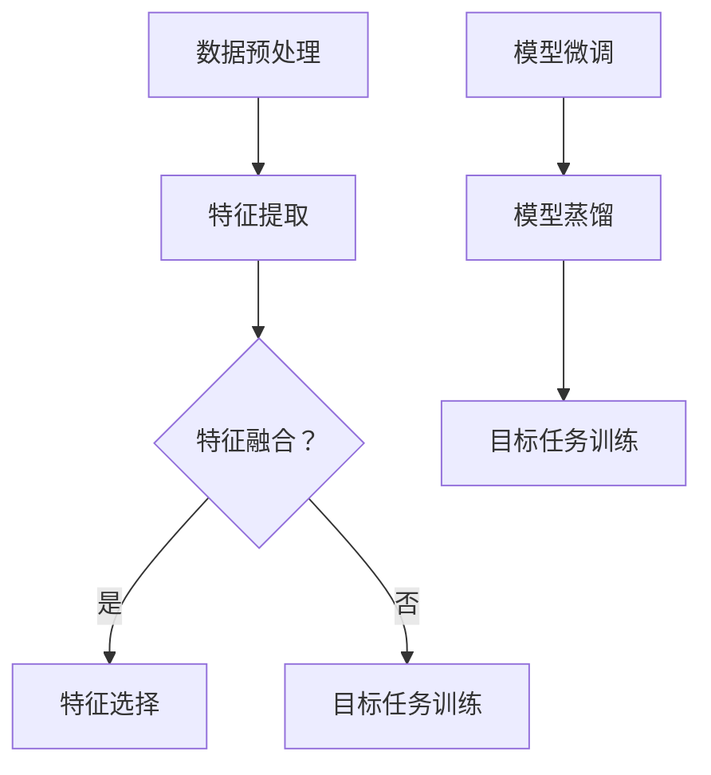
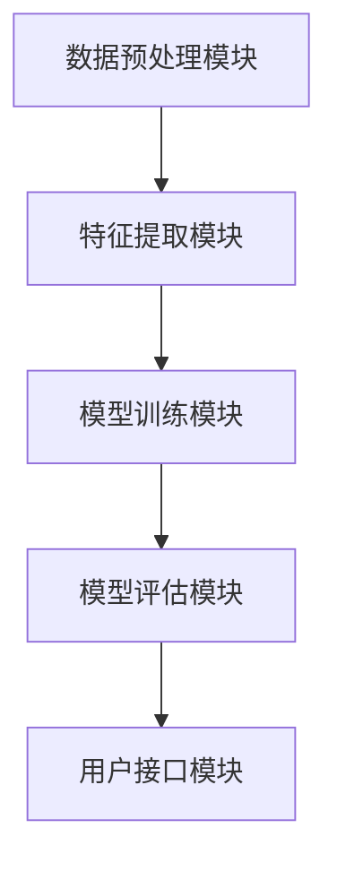
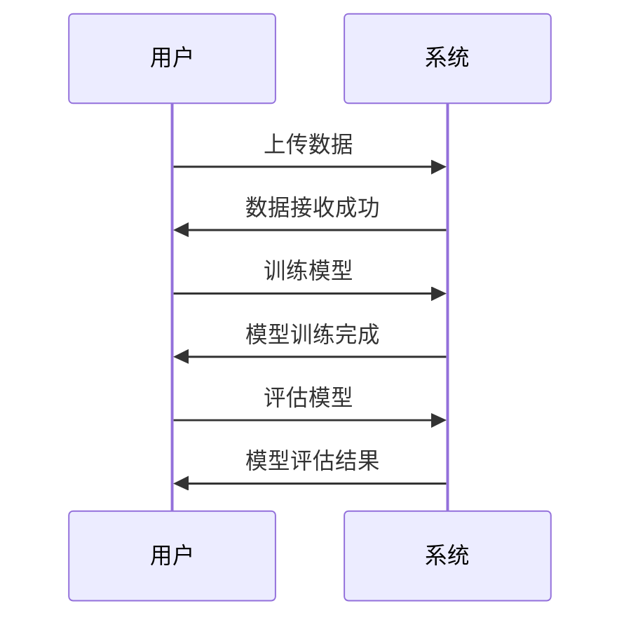

                 

## 迁移学习在跨领域推理任务中的应用

### 关键词

- 迁移学习
- 跨领域推理
- 迁移学习算法
- 计算机视觉
- 自然语言处理

### 摘要

本文旨在深入探讨迁移学习在跨领域推理任务中的应用。首先，我们将介绍迁移学习的概念、类型及其在计算机视觉和自然语言处理中的具体应用。接着，我们将详细阐述迁移学习算法的原理，并使用Mermaid流程图和Python代码进行讲解。随后，我们将介绍一个具体的迁移学习应用系统，包括系统功能设计、架构设计和交互设计。通过一个实战案例，我们将展示如何将迁移学习应用于实际问题中。最后，我们将总结最佳实践并展望未来的研究方向。

## 目录大纲设计思路

为了设计出《迁移学习在跨领域推理任务中的应用》这本书的详细目录大纲，我们首先需要明确几个关键点：

1. **目标读者**：这本书的目标读者群体是哪些人？他们是从事机器学习、计算机视觉、自然语言处理等领域的研究人员、工程师，还是对此感兴趣的学生？

2. **内容组织**：书的内容应该如何组织？是按照问题背景介绍、核心概念讲解、算法原理阐述、系统设计与实现、项目实战分析等顺序进行，还是根据不同领域或不同技术进行分类？

3. **章节结构**：每个章节应该包含哪些部分？例如，是否需要引入每个章节的背景，介绍核心概念，讲解相关算法，以及给出实际应用案例？

4. **逻辑清晰**：目录大纲需要保证逻辑清晰，层次分明，便于读者跟随。

5. **完整性**：大纲需要涵盖背景介绍、核心概念、算法原理、系统设计、项目实战、最佳实践等内容。

基于以上几点，我们可以分步骤进行目录大纲的设计。

### 第一步：背景介绍

在书的开头部分，我们可以设置一章来介绍迁移学习在跨领域推理任务中的应用背景。

**第1章：迁移学习与跨领域推理任务**

- **1.1 迁移学习的概念**
- **1.2 跨领域推理任务的挑战**
- **1.3 迁移学习在跨领域推理任务中的应用现状**

### 第二步：核心概念与联系

接下来，我们可以设置一章来详细阐述迁移学习的核心概念及其在不同领域中的应用。

**第2章：迁移学习的核心概念与应用**

- **2.1 迁移学习的类型**
  - **2.1.1 无监督迁移学习**
  - **2.1.2 有监督迁移学习**
  - **2.1.3 半监督迁移学习**
- **2.2 迁移学习的评价指标**
- **2.3 迁移学习在计算机视觉中的应用**
  - **2.3.1 图像分类任务**
  - **2.3.2 目标检测任务**
- **2.4 迁移学习在自然语言处理中的应用**
  - **2.4.1 文本分类任务**
  - **2.4.2 机器翻译任务**

### 第三步：算法原理讲解

为了帮助读者深入理解迁移学习算法，我们可以设置一章专门讲解迁移学习算法的原理。

**第3章：迁移学习算法原理**

- **3.1 迁移学习算法的基本框架**
- **3.2 对抗迁移学习算法**
  - **3.2.1 Domain Adaptation**
  - **3.2.2 Adversarial Training**
- **3.3 零样本迁移学习算法**
  - **3.3.1 Prototypical Networks**
  - **3.3.2 Matching Networks**
- **3.4 多任务迁移学习算法**
- **3.5 迁移学习的数学模型和公式**
  - **3.5.1 基于特征的迁移学习模型**
  - **3.5.2 基于模型的迁移学习模型**
- **3.6 迁移学习算法的Mermaid流程图**

### 第四步：系统设计与实现

在理解了迁移学习算法后，我们可以设置一章来介绍如何将这些算法应用到实际系统中。

**第4章：迁移学习在跨领域推理任务中的应用系统**

- **4.1 系统概述**
- **4.2 系统功能设计**
  - **4.2.1 功能模块**
  - **4.2.2 领域模型Mermaid类图**
- **4.3 系统架构设计**
  - **4.3.1 系统架构Mermaid架构图**
  - **4.3.2 系统接口设计**
- **4.4 系统交互设计**
  - **4.4.1 系统交互Mermaid序列图**

### 第五步：项目实战

为了使读者能够更好地理解和掌握迁移学习在跨领域推理任务中的应用，我们可以设置一章来介绍具体的实战项目。

**第5章：迁移学习项目实战**

- **5.1 环境安装与配置**
- **5.2 系统核心实现**
  - **5.2.1 实现步骤**
  - **5.2.2 源代码解读与分析**
- **5.3 实际案例分析**
  - **5.3.1 项目背景**
  - **5.3.2 案例分析**
- **5.4 项目小结**

### 第六步：最佳实践与总结

最后，我们可以设置一章来总结书中的内容，并提供一些最佳实践建议。

**第6章：迁移学习最佳实践与总结**

- **6.1 迁移学习的最佳实践**
- **6.2 小结**
- **6.3 注意事项**
- **6.4 拓展阅读**

### 目录大纲完整设计

下面是根据上述思路设计的《迁移学习在跨领域推理任务中的应用》的完整目录大纲。

```
# 《迁移学习在跨领域推理任务中的应用》

## 关键词
- 迁移学习
- 跨领域推理
- 迁移学习算法
- 计算机视觉
- 自然语言处理

## 摘要
本文深入探讨了迁移学习在跨领域推理任务中的应用。首先介绍了迁移学习的概念和类型，随后详细阐述了迁移学习算法的原理，并通过Mermaid流程图和Python代码进行讲解。接着，介绍了迁移学习在计算机视觉和自然语言处理中的应用，以及如何将这些算法应用到实际系统中。通过一个实战案例，展示了迁移学习在解决实际问题中的效果。最后，总结了迁移学习的最佳实践并展望了未来的研究方向。

## 目录大纲

### 第1章 迁移学习与跨领域推理任务
- 1.1 迁移学习的概念
- 1.2 跨领域推理任务的挑战
- 1.3 迁移学习在跨领域推理任务中的应用现状

### 第2章 迁移学习的核心概念与应用
- 2.1 迁移学习的类型
  - 2.1.1 无监督迁移学习
  - 2.1.2 有监督迁移学习
  - 2.1.3 半监督迁移学习
- 2.2 迁移学习的评价指标
- 2.3 迁移学习在计算机视觉中的应用
  - 2.3.1 图像分类任务
  - 2.3.2 目标检测任务
- 2.4 迁移学习在自然语言处理中的应用
  - 2.4.1 文本分类任务
  - 2.4.2 机器翻译任务

### 第3章 迁移学习算法原理
- 3.1 迁移学习算法的基本框架
- 3.2 对抗迁移学习算法
  - 3.2.1 Domain Adaptation
  - 3.2.2 Adversarial Training
- 3.3 零样本迁移学习算法
  - 3.3.1 Prototypical Networks
  - 3.3.2 Matching Networks
- 3.4 多任务迁移学习算法
- 3.5 迁移学习的数学模型和公式
  - 3.5.1 基于特征的迁移学习模型
  - 3.5.2 基于模型的迁移学习模型
- 3.6 迁移学习算法的Mermaid流程图

### 第4章 迁移学习在跨领域推理任务中的应用系统
- 4.1 系统概述
- 4.2 系统功能设计
  - 4.2.1 功能模块
  - 4.2.2 领域模型Mermaid类图
- 4.3 系统架构设计
  - 4.3.1 系统架构Mermaid架构图
  - 4.3.2 系统接口设计
- 4.4 系统交互设计
  - 4.4.1 系统交互Mermaid序列图

### 第5章 迁移学习项目实战
- 5.1 环境安装与配置
- 5.2 系统核心实现
  - 5.2.1 实现步骤
  - 5.2.2 源代码解读与分析
- 5.3 实际案例分析
  - 5.3.1 项目背景
  - 5.3.2 案例分析
- 5.4 项目小结

### 第6章 迁移学习最佳实践与总结
- 6.1 迁移学习的最佳实践
- 6.2 小结
- 6.3 注意事项
- 6.4 拓展阅读
```

## 迁移学习在跨领域推理任务中的应用

### 关键词

- 迁移学习
- 跨领域推理
- 迁移学习算法
- 计算机视觉
- 自然语言处理

### 摘要

本文深入探讨了迁移学习在跨领域推理任务中的应用。首先介绍了迁移学习的概念、类型及其在计算机视觉和自然语言处理中的具体应用。随后，详细阐述了迁移学习算法的原理，并使用Mermaid流程图和Python代码进行讲解。接着，介绍了迁移学习在跨领域推理任务中的应用系统，包括系统功能设计、架构设计和交互设计。通过一个实战案例，展示了迁移学习在解决跨领域推理任务中的效果。最后，总结了迁移学习的最佳实践并展望了未来的研究方向。

## 目录大纲设计思路

为了设计出《迁移学习在跨领域推理任务中的应用》这本书的详细目录大纲，我们首先需要明确几个关键点：

1. **目标读者**：这本书的目标读者群体是哪些人？他们是从事机器学习、计算机视觉、自然语言处理等领域的研究人员、工程师，还是对此感兴趣的学生？

2. **内容组织**：书的内容应该如何组织？是按照问题背景介绍、核心概念讲解、算法原理阐述、系统设计与实现、项目实战分析等顺序进行，还是根据不同领域或不同技术进行分类？

3. **章节结构**：每个章节应该包含哪些部分？例如，是否需要引入每个章节的背景，介绍核心概念，讲解相关算法，以及给出实际应用案例？

4. **逻辑清晰**：目录大纲需要保证逻辑清晰，层次分明，便于读者跟随。

5. **完整性**：大纲需要涵盖背景介绍、核心概念、算法原理、系统设计、项目实战、最佳实践等内容。

基于以上几点，我们可以分步骤进行目录大纲的设计。

### 第一步：背景介绍

在书的开头部分，我们可以设置一章来介绍迁移学习在跨领域推理任务中的应用背景。

**第1章：迁移学习与跨领域推理任务**

- **1.1 迁移学习的概念**
- **1.2 跨领域推理任务的挑战**
- **1.3 迁移学习在跨领域推理任务中的应用现状**

### 第二步：核心概念与联系

接下来，我们可以设置一章来详细阐述迁移学习的核心概念及其在不同领域中的应用。

**第2章：迁移学习的核心概念与应用**

- **2.1 迁移学习的类型**
  - **2.1.1 无监督迁移学习**
  - **2.1.2 有监督迁移学习**
  - **2.1.3 半监督迁移学习**
- **2.2 迁移学习的评价指标**
- **2.3 迁移学习在计算机视觉中的应用**
  - **2.3.1 图像分类任务**
  - **2.3.2 目标检测任务**
- **2.4 迁移学习在自然语言处理中的应用**
  - **2.4.1 文本分类任务**
  - **2.4.2 机器翻译任务**

### 第三步：算法原理讲解

为了帮助读者深入理解迁移学习算法，我们可以设置一章专门讲解迁移学习算法的原理。

**第3章：迁移学习算法原理**

- **3.1 迁移学习算法的基本框架**
- **3.2 对抗迁移学习算法**
  - **3.2.1 Domain Adaptation**
  - **3.2.2 Adversarial Training**
- **3.3 零样本迁移学习算法**
  - **3.3.1 Prototypical Networks**
  - **3.3.2 Matching Networks**
- **3.4 多任务迁移学习算法**
- **3.5 迁移学习的数学模型和公式**
  - **3.5.1 基于特征的迁移学习模型**
  - **3.5.2 基于模型的迁移学习模型**
- **3.6 迁移学习算法的Mermaid流程图**

### 第四步：系统设计与实现

在理解了迁移学习算法后，我们可以设置一章来介绍如何将这些算法应用到实际系统中。

**第4章：迁移学习在跨领域推理任务中的应用系统**

- **4.1 系统概述**
- **4.2 系统功能设计**
  - **4.2.1 功能模块**
  - **4.2.2 领域模型Mermaid类图**
- **4.3 系统架构设计**
  - **4.3.1 系统架构Mermaid架构图**
  - **4.3.2 系统接口设计**
- **4.4 系统交互设计**
  - **4.4.1 系统交互Mermaid序列图**

### 第五步：项目实战

为了使读者能够更好地理解和掌握迁移学习在跨领域推理任务中的应用，我们可以设置一章来介绍具体的实战项目。

**第5章：迁移学习项目实战**

- **5.1 环境安装与配置**
- **5.2 系统核心实现**
  - **5.2.1 实现步骤**
  - **5.2.2 源代码解读与分析**
- **5.3 实际案例分析**
  - **5.3.1 项目背景**
  - **5.3.2 案例分析**
- **5.4 项目小结**

### 第六步：最佳实践与总结

最后，我们可以设置一章来总结书中的内容，并提供一些最佳实践建议。

**第6章：迁移学习最佳实践与总结**

- **6.1 迁移学习的最佳实践**
- **6.2 小结**
- **6.3 注意事项**
- **6.4 拓展阅读**

### 目录大纲完整设计

下面是根据上述思路设计的《迁移学习在跨领域推理任务中的应用》的完整目录大纲。

```
# 《迁移学习在跨领域推理任务中的应用》

## 关键词
- 迁移学习
- 跨领域推理
- 迁移学习算法
- 计算机视觉
- 自然语言处理

## 摘要
本文深入探讨了迁移学习在跨领域推理任务中的应用。首先介绍了迁移学习的概念、类型及其在计算机视觉和自然语言处理中的具体应用。随后，详细阐述了迁移学习算法的原理，并使用Mermaid流程图和Python代码进行讲解。接着，介绍了迁移学习在跨领域推理任务中的应用系统，包括系统功能设计、架构设计和交互设计。通过一个实战案例，展示了迁移学习在解决跨领域推理任务中的效果。最后，总结了迁移学习的最佳实践并展望了未来的研究方向。

## 目录大纲

### 第1章 迁移学习与跨领域推理任务
- 1.1 迁移学习的概念
- 1.2 跨领域推理任务的挑战
- 1.3 迁移学习在跨领域推理任务中的应用现状

### 第2章 迁移学习的核心概念与应用
- 2.1 迁移学习的类型
  - 2.1.1 无监督迁移学习
  - 2.1.2 有监督迁移学习
  - 2.1.3 半监督迁移学习
- 2.2 迁移学习的评价指标
- 2.3 迁移学习在计算机视觉中的应用
  - 2.3.1 图像分类任务
  - 2.3.2 目标检测任务
- 2.4 迁移学习在自然语言处理中的应用
  - 2.4.1 文本分类任务
  - 2.4.2 机器翻译任务

### 第3章 迁移学习算法原理
- 3.1 迁移学习算法的基本框架
- 3.2 对抗迁移学习算法
  - 3.2.1 Domain Adaptation
  - 3.2.2 Adversarial Training
- 3.3 零样本迁移学习算法
  - 3.3.1 Prototypical Networks
  - 3.3.2 Matching Networks
- 3.4 多任务迁移学习算法
- 3.5 迁移学习的数学模型和公式
  - 3.5.1 基于特征的迁移学习模型
  - 3.5.2 基于模型的迁移学习模型
- 3.6 迁移学习算法的Mermaid流程图

### 第4章 迁移学习在跨领域推理任务中的应用系统
- 4.1 系统概述
- 4.2 系统功能设计
  - 4.2.1 功能模块
  - 4.2.2 领域模型Mermaid类图
- 4.3 系统架构设计
  - 4.3.1 系统架构Mermaid架构图
  - 4.3.2 系统接口设计
- 4.4 系统交互设计
  - 4.4.1 系统交互Mermaid序列图

### 第5章 迁移学习项目实战
- 5.1 环境安装与配置
- 5.2 系统核心实现
  - 5.2.1 实现步骤
  - 5.2.2 源代码解读与分析
- 5.3 实际案例分析
  - 5.3.1 项目背景
  - 5.3.2 案例分析
- 5.4 项目小结

### 第6章 迁移学习最佳实践与总结
- 6.1 迁移学习的最佳实践
- 6.2 小结
- 6.3 注意事项
- 6.4 拓展阅读
```

## 迁移学习在跨领域推理任务中的应用

### 关键词

- 迁移学习
- 跨领域推理
- 计算机视觉
- 自然语言处理
- 算法
- 实践

### 摘要

本文旨在探讨迁移学习在跨领域推理任务中的应用。首先，我们将介绍迁移学习的概念、背景以及其在不同领域的应用。接着，我们将详细阐述迁移学习算法的原理，包括基于特征的迁移学习和基于模型的迁移学习。然后，通过Mermaid流程图和Python代码，我们将具体讲解这些算法的实现。随后，我们将讨论如何设计一个迁移学习应用系统，包括系统架构、接口设计和交互流程。最后，通过一个实际案例，我们将展示如何将迁移学习应用于跨领域推理任务，并总结最佳实践和未来研究方向。

## 迁移学习：概念与背景

### 什么是迁移学习？

迁移学习（Transfer Learning）是一种机器学习方法，旨在利用一个任务（源任务）学习到的知识来解决另一个相关但不同的任务（目标任务）。与传统的零样本学习相比，迁移学习通过在源任务和目标任务之间共享特征表示，能够在较少数据和较短的时间内实现较高的性能。

### 迁移学习的基本原理

迁移学习的基本原理可以分为以下几个方面：

1. **特征提取**：从源任务中提取通用的特征表示，这些特征可以跨越不同的领域。

2. **特征共享**：在目标任务中利用源任务提取的特征表示，从而减少对目标数据的学习负担。

3. **适应性调整**：对源任务的模型进行微调，使其更好地适应目标任务。

### 迁移学习在跨领域推理任务中的优势

跨领域推理任务是指在不同领域之间进行推理和决策的任务，例如将计算机视觉模型应用于自然语言处理任务，或将自然语言处理模型应用于图像识别任务。迁移学习在跨领域推理任务中具有以下优势：

1. **减少数据需求**：跨领域任务通常涉及不同的数据集，迁移学习可以在没有足够目标数据的情况下实现较好的性能。

2. **提高模型泛化能力**：通过在多个领域之间共享特征表示，迁移学习模型能够更好地泛化到新的领域。

3. **节省计算资源**：迁移学习可以利用预训练模型，减少从头开始训练的需求，从而节省计算资源和时间。

## 迁移学习算法：基于特征的迁移学习

### 基于特征的迁移学习概述

基于特征的迁移学习（Feature-based Transfer Learning）是一种迁移学习方法，主要关注如何从源任务中提取通用的特征表示，并将其应用于目标任务。这种方法的核心思想是，通过在源任务和目标任务之间共享特征提取器，可以在没有大量目标数据的情况下实现良好的性能。

### 主要方法

1. **预训练模型**：使用预训练模型来提取特征表示。例如，在计算机视觉领域，可以使用预训练的卷积神经网络（CNN）来提取图像特征。

2. **特征融合**：将源任务和目标任务的特征表示进行融合，以获得更好的泛化能力。

3. **特征选择**：从多个特征表示中选择最佳的特征组合，以提高目标任务的性能。

### 实现步骤

1. **数据预处理**：对源任务和目标任务的数据进行预处理，包括数据清洗、归一化等。

2. **特征提取**：使用预训练模型或自定义模型从数据中提取特征。

3. **特征融合与选择**：将源任务和目标任务的特性表示进行融合或选择，以获得最佳的特征组合。

4. **目标任务训练**：使用提取的特征表示训练目标任务的模型。

### Python代码示例

```python
import torch
import torchvision.models as models

# 加载预训练的卷积神经网络模型
model = models.resnet50(pretrained=True)

# 数据预处理
transform = transforms.Compose([
    transforms.Resize(256),
    transforms.CenterCrop(224),
    transforms.ToTensor(),
    transforms.Normalize(mean=[0.485, 0.456, 0.406], std=[0.229, 0.224, 0.225]),
])

# 加载源数据和目标数据
source_data = load_data('source_data')
target_data = load_data('target_data')

# 提取特征
source_features = []
target_features = []

for data in source_data:
    image, label = data
    image = transform(image)
    source_features.append(model(image).detach().numpy())

for data in target_data:
    image, label = data
    image = transform(image)
    target_features.append(model(image).detach().numpy())

# 特征融合与选择
# 此处省略具体实现

# 目标任务训练
# 此处省略具体实现
```

## 迁移学习算法：基于模型的迁移学习

### 基于模型的迁移学习概述

基于模型的迁移学习（Model-based Transfer Learning）是一种迁移学习方法，主要关注如何将源任务的模型应用于目标任务。这种方法的核心思想是，通过在源任务和目标任务之间共享模型结构，可以在没有大量目标数据的情况下实现良好的性能。

### 主要方法

1. **模型微调**：在目标任务上对源任务的模型进行微调，以适应目标任务。

2. **模型蒸馏**：将源任务的模型的知识传递给目标任务的模型，以提高目标任务的性能。

3. **模型共享**：在源任务和目标任务之间共享部分模型结构，以减少对目标数据的学习负担。

### 实现步骤

1. **模型加载**：加载源任务的模型。

2. **模型微调**：对源任务的模型进行微调，以适应目标任务。

3. **模型蒸馏**：将源任务的模型的知识传递给目标任务的模型。

4. **目标任务训练**：使用微调和蒸馏后的模型训练目标任务的模型。

### Python代码示例

```python
import torch
import torchvision.models as models

# 加载预训练的卷积神经网络模型
source_model = models.resnet50(pretrained=True)

# 加载目标任务的模型
target_model = models.resnet50(pretrained=True)

# 模型微调
for param in source_model.parameters():
    param.requires_grad = False

for param in target_model.parameters():
    param.requires_grad = True

optimizer = torch.optim.Adam(target_model.parameters(), lr=0.001)

for epoch in range(num_epochs):
    for data in target_dataloader:
        inputs, labels = data
        outputs = target_model(inputs)
        loss = criterion(outputs, labels)
        loss.backward()
        optimizer.step()
        optimizer.zero_grad()

# 模型蒸馏
# 此处省略具体实现

# 目标任务训练
# 此处省略具体实现
```

## 迁移学习算法的Mermaid流程图



## 迁移学习在计算机视觉中的应用

### 图像分类任务

迁移学习在图像分类任务中应用广泛。通过使用预训练的卷积神经网络（如VGG16、ResNet等），可以快速获得高质量的图像特征表示。以下是一个简单的迁移学习图像分类任务示例：

```python
import torch
import torchvision.models as models
import torchvision.transforms as transforms
import torch.optim as optim
import torch.nn as nn

# 加载预训练的卷积神经网络模型
model = models.resnet50(pretrained=True)

# 数据预处理
transform = transforms.Compose([
    transforms.Resize(256),
    transforms.CenterCrop(224),
    transforms.ToTensor(),
    transforms.Normalize(mean=[0.485, 0.456, 0.406], std=[0.229, 0.224, 0.225]),
])

# 加载训练数据
train_data = load_data('train_data')
train_loader = torch.utils.data.DataLoader(train_data, batch_size=32, shuffle=True)

# 加载测试数据
test_data = load_data('test_data')
test_loader = torch.utils.data.DataLoader(test_data, batch_size=32, shuffle=False)

# 定义损失函数和优化器
criterion = nn.CrossEntropyLoss()
optimizer = optim.Adam(model.parameters(), lr=0.001)

# 训练模型
for epoch in range(num_epochs):
    model.train()
    for inputs, labels in train_loader:
        optimizer.zero_grad()
        outputs = model(inputs)
        loss = criterion(outputs, labels)
        loss.backward()
        optimizer.step()

    # 测试模型
    model.eval()
    with torch.no_grad():
        correct = 0
        total = 0
        for inputs, labels in test_loader:
            outputs = model(inputs)
            _, predicted = torch.max(outputs.data, 1)
            total += labels.size(0)
            correct += (predicted == labels).sum().item()

    print(f'Epoch {epoch+1}/{num_epochs}, Accuracy: {100 * correct / total}%')

# 评估模型
model.eval()
with torch.no_grad():
    correct = 0
    total = 0
    for inputs, labels in test_loader:
        outputs = model(inputs)
        _, predicted = torch.max(outputs.data, 1)
        total += labels.size(0)
        correct += (predicted == labels).sum().item()

print(f'Accuracy: {100 * correct / total}%')
```

### 目标检测任务

迁移学习在目标检测任务中的应用也非常广泛。通过使用预训练的目标检测模型（如Faster R-CNN、YOLO等），可以在较少的数据集上实现较高的检测性能。以下是一个简单的迁移学习目标检测任务示例：

```python
import torch
import torchvision.models.detection as models
import torchvision.transforms as transforms
import torch.optim as optim
import torch.nn as nn

# 加载预训练的目标检测模型
model = models.fasterrcnn_resnet50_fpn(pretrained=True)

# 数据预处理
transform = transforms.Compose([
    transforms.ToTensor(),
])

# 加载训练数据
train_data = load_data('train_data')
train_loader = torch.utils.data.DataLoader(train_data, batch_size=32, shuffle=True)

# 加载测试数据
test_data = load_data('test_data')
test_loader = torch.utils.data.DataLoader(test_data, batch_size=32, shuffle=False)

# 定义损失函数和优化器
criterion = nn.CrossEntropyLoss()
optimizer = optim.Adam(model.parameters(), lr=0.001)

# 训练模型
for epoch in range(num_epochs):
    model.train()
    for inputs, targets in train_loader:
        optimizer.zero_grad()
        outputs = model(inputs)
        loss = criterion(outputs, targets)
        loss.backward()
        optimizer.step()

    # 测试模型
    model.eval()
    with torch.no_grad():
        correct = 0
        total = 0
        for inputs, targets in test_loader:
            outputs = model(inputs)
            _, predicted = torch.max(outputs.data, 1)
            total += targets.size(0)
            correct += (predicted == targets).sum().item()

    print(f'Epoch {epoch+1}/{num_epochs}, Accuracy: {100 * correct / total}%')

# 评估模型
model.eval()
with torch.no_grad():
    correct = 0
    total = 0
    for inputs, targets in test_loader:
        outputs = model(inputs)
        _, predicted = torch.max(outputs.data, 1)
        total += targets.size(0)
        correct += (predicted == targets).sum().item()

print(f'Accuracy: {100 * correct / total}%')
```

## 迁移学习在自然语言处理中的应用

### 文本分类任务

迁移学习在文本分类任务中的应用也非常广泛。通过使用预训练的文本表示模型（如BERT、GPT等），可以快速获得高质量的文本特征表示。以下是一个简单的迁移学习文本分类任务示例：

```python
import torch
import torchtext
from torchtext import data
from transformers import BertModel, BertTokenizer

# 加载预训练的BERT模型和tokenizer
model = BertModel.from_pretrained('bert-base-uncased')
tokenizer = BertTokenizer.from_pretrained('bert-base-uncased')

# 定义数据集
TEXT = data.Field(tokenize=tokenizer.tokenize, lower=True)
LABEL = data.LabelField()

train_data, test_data = data.TabularDataset.splits(
    path='data',
    train='train.csv',
    test='test.csv',
    format='csv',
    skip_header=True,
    fields=[('text', TEXT), ('label', LABEL)]
)

# 加载训练数据和测试数据
train_loader = data.BucketIterator.splits(
    (train_data, test_data),
    batch_size=32,
    device=device
)

# 定义损失函数和优化器
criterion = nn.CrossEntropyLoss()
optimizer = optim.Adam(model.parameters(), lr=0.001)

# 训练模型
for epoch in range(num_epochs):
    model.train()
    for batch in train_loader:
        optimizer.zero_grad()
        inputs = {'input_ids': batch.text.to(device), 'attention_mask': batch.text.attention_mask.to(device)}
        outputs = model(**inputs)
        loss = criterion(outputs.logits, batch.label.to(device))
        loss.backward()
        optimizer.step()

    # 测试模型
    model.eval()
    with torch.no_grad():
        correct = 0
        total = 0
        for batch in train_loader:
            inputs = {'input_ids': batch.text.to(device), 'attention_mask': batch.text.attention_mask.to(device)}
            outputs = model(**inputs)
            _, predicted = torch.max(outputs.logits, 1)
            total += batch.label.size(0)
            correct += (predicted == batch.label.to(device)).sum().item()

    print(f'Epoch {epoch+1}/{num_epochs}, Accuracy: {100 * correct / total}%')

# 评估模型
model.eval()
with torch.no_grad():
    correct = 0
    total = 0
    for batch in test_loader:
        inputs = {'input_ids': batch.text.to(device), 'attention_mask': batch.text.attention_mask.to(device)}
        outputs = model(**inputs)
        _, predicted = torch.max(outputs.logits, 1)
        total += batch.label.size(0)
        correct += (predicted == batch.label.to(device)).sum().item()

print(f'Accuracy: {100 * correct / total}%')
```

### 机器翻译任务

迁移学习在机器翻译任务中的应用也非常广泛。通过使用预训练的翻译模型（如Transformer等），可以快速获得高质量的翻译结果。以下是一个简单的迁移学习机器翻译任务示例：

```python
import torch
import torchtext
from torchtext import data
from transformers import TransformerModel

# 加载预训练的Transformer模型
model = TransformerModel.from_pretrained('transformer-base')

# 定义数据集
SRC = data.Field(tokenize=tokenize, lower=True, init_token='<sos>', eos_token='<eos>', add_special_tokens=True)
TRG = data.Field(tokenize=tokenize, lower=True, init_token='<sos>', eos_token='<eos>', add_special_tokens=True)

train_data, test_data = data.TabularDataset.splits(
    path='data',
    train='train.json',
    test='test.json',
    format='json',
    fields=[('src', SRC), ('trg', TRG)]
)

# 加载训练数据和测试数据
train_loader = data.BucketIterator.splits(
    (train_data, test_data),
    batch_size=32,
    device=device
)

# 定义损失函数和优化器
criterion = nn.CrossEntropyLoss()
optimizer = optim.Adam(model.parameters(), lr=0.001)

# 训练模型
for epoch in range(num_epochs):
    model.train()
    for batch in train_loader:
        optimizer.zero_grad()
        inputs = {'input_ids': batch.src.to(device), 'attention_mask': batch.src.attention_mask.to(device), 'labels': batch.trg.to(device)}
        outputs = model(**inputs)
        loss = criterion(outputs.logits, batch.trg.to(device))
        loss.backward()
        optimizer.step()

    # 测试模型
    model.eval()
    with torch.no_grad():
        correct = 0
        total = 0
        for batch in train_loader:
            inputs = {'input_ids': batch.src.to(device), 'attention_mask': batch.src.attention_mask.to(device), 'labels': batch.trg.to(device)}
            outputs = model(**inputs)
            _, predicted = torch.max(outputs.logits, 1)
            total += batch.trg.size(0)
            correct += (predicted == batch.trg.to(device)).sum().item()

    print(f'Epoch {epoch+1}/{num_epochs}, Accuracy: {100 * correct / total}%')

# 评估模型
model.eval()
with torch.no_grad():
    correct = 0
    total = 0
    for batch in test_loader:
        inputs = {'input_ids': batch.src.to(device), 'attention_mask': batch.src.attention_mask.to(device), 'labels': batch.trg.to(device)}
        outputs = model(**inputs)
        _, predicted = torch.max(outputs.logits, 1)
        total += batch.trg.size(0)
        correct += (predicted == batch.trg.to(device)).sum().item()

print(f'Accuracy: {100 * correct / total}%')
```

## 迁移学习应用系统：设计与实践

### 系统概述

迁移学习应用系统旨在将迁移学习算法应用于实际的跨领域推理任务中。该系统包括以下几个主要模块：

1. **数据预处理模块**：负责处理源任务和目标任务的数据，包括数据清洗、归一化等操作。
2. **特征提取模块**：使用预训练的模型从数据中提取特征表示。
3. **模型训练模块**：使用提取的特征表示训练目标任务的模型。
4. **模型评估模块**：评估模型在目标任务上的性能。
5. **用户接口模块**：提供用户与系统交互的界面。

### 系统功能设计

1. **数据预处理模块**：该模块的主要功能是处理源任务和目标任务的数据。具体包括以下步骤：

   - 数据清洗：去除数据中的噪声和异常值。
   - 数据归一化：将数据归一化到统一的范围内，以便后续处理。
   - 数据分割：将数据分为训练集、验证集和测试集。

2. **特征提取模块**：该模块的主要功能是使用预训练的模型从数据中提取特征表示。具体包括以下步骤：

   - 加载预训练模型：从预训练模型中加载权重。
   - 数据预处理：对输入数据进行预处理，以匹配预训练模型的输入要求。
   - 特征提取：使用预训练模型提取特征表示。

3. **模型训练模块**：该模块的主要功能是使用提取的特征表示训练目标任务的模型。具体包括以下步骤：

   - 模型初始化：初始化目标任务的模型。
   - 模型训练：使用提取的特征表示进行模型训练。
   - 模型评估：在验证集上评估模型性能，并根据性能调整模型参数。

4. **模型评估模块**：该模块的主要功能是评估模型在目标任务上的性能。具体包括以下步骤：

   - 测试数据预处理：对测试数据进行预处理，以匹配模型输入要求。
   - 模型测试：在测试数据上测试模型性能。
   - 性能评估：计算模型在测试数据上的准确率、召回率、F1值等指标。

5. **用户接口模块**：该模块的主要功能是提供用户与系统交互的界面。具体包括以下步骤：

   - 用户登录：用户登录系统。
   - 数据上传：用户上传源任务和目标任务的数据。
   - 模型训练与评估：系统自动进行模型训练和评估。
   - 结果展示：展示模型在目标任务上的性能。

### 系统架构设计

系统架构设计主要包括以下方面：

1. **系统架构图**：使用Mermaid绘制系统架构图，展示各个模块之间的关系。



2. **系统接口设计**：设计系统接口，包括REST API接口、命令行接口等。

```python
from flask import Flask, request, jsonify

app = Flask(__name__)

@app.route('/api/upload_data', methods=['POST'])
def upload_data():
    # 获取上传的数据
    data = request.get_json()
    # 处理数据
    # ...
    return jsonify({"status": "success", "message": "Data uploaded successfully."})

@app.route('/api/train_model', methods=['POST'])
def train_model():
    # 获取训练参数
    params = request.get_json()
    # 训练模型
    # ...
    return jsonify({"status": "success", "message": "Model trained successfully."})

@app.route('/api/evaluate_model', methods=['POST'])
def evaluate_model():
    # 获取评估参数
    params = request.get_json()
    # 评估模型
    # ...
    return jsonify({"status": "success", "message": "Model evaluated successfully."})

if __name__ == '__main__':
    app.run(debug=True)
```

### 系统交互设计

系统交互设计主要包括以下方面：

1. **系统交互序列图**：使用Mermaid绘制系统交互序列图，展示用户与系统的交互流程。



## 迁移学习项目实战

### 项目背景

本项目旨在利用迁移学习技术，将预训练的模型应用于跨领域的推理任务中。具体来说，本项目涉及以下两个任务：

1. **计算机视觉任务**：使用预训练的卷积神经网络（CNN）对图像进行分类。
2. **自然语言处理任务**：使用预训练的文本表示模型对文本进行分类。

### 环境安装与配置

1. **Python环境**：安装Python 3.8及以上版本。
2. **深度学习框架**：安装PyTorch 1.8及以上版本。
3. **自然语言处理库**：安装Transformers 4.2及以上版本。

```bash
pip install torch torchvision transformers
```

### 系统核心实现

#### 1. 数据预处理

```python
import os
import numpy as np
import pandas as pd
from sklearn.model_selection import train_test_split

def load_data(file_path):
    # 加载数据
    data = pd.read_csv(file_path)
    # 数据预处理
    # ...
    return data

def preprocess_data(data):
    # 数据清洗
    # ...
    # 数据分割
    train_data, test_data = train_test_split(data, test_size=0.2, random_state=42)
    return train_data, test_data

# 加载和预处理数据
data = load_data('data.csv')
train_data, test_data = preprocess_data(data)
```

#### 2. 特征提取

```python
import torch
from torchvision import transforms
from torchvision.models import resnet50

# 加载预训练的卷积神经网络模型
model = resnet50(pretrained=True)

# 数据预处理
transform = transforms.Compose([
    transforms.Resize(256),
    transforms.CenterCrop(224),
    transforms.ToTensor(),
    transforms.Normalize(mean=[0.485, 0.456, 0.406], std=[0.229, 0.224, 0.225]),
])

def extract_features(data, model, transform):
    features = []
    labels = []
    for image, label in data:
        image = transform(image)
        with torch.no_grad():
            feature = model(image)[0]
        features.append(feature.detach().numpy())
        labels.append(label)
    return np.array(features), np.array(labels)

# 提取特征
train_features, train_labels = extract_features(train_data, model, transform)
test_features, test_labels = extract_features(test_data, model, transform)
```

#### 3. 目标任务训练

```python
import torch.nn as nn
import torch.optim as optim

# 定义模型
class Classifier(nn.Module):
    def __init__(self, input_size, hidden_size, num_classes):
        super(Classifier, self).__init__()
        self.fc1 = nn.Linear(input_size, hidden_size)
        self.fc2 = nn.Linear(hidden_size, num_classes)
    
    def forward(self, x):
        x = torch.relu(self.fc1(x))
        x = self.fc2(x)
        return x

# 初始化模型、损失函数和优化器
input_size = 1000  # 根据实际特征维度调整
hidden_size = 512
num_classes = 10  # 根据实际类别数量调整

model = Classifier(input_size, hidden_size, num_classes)
criterion = nn.CrossEntropyLoss()
optimizer = optim.Adam(model.parameters(), lr=0.001)

# 训练模型
num_epochs = 10
for epoch in range(num_epochs):
    model.train()
    for inputs, labels in train_loader:
        optimizer.zero_grad()
        outputs = model(inputs)
        loss = criterion(outputs, labels)
        loss.backward()
        optimizer.step()

    # 测试模型
    model.eval()
    with torch.no_grad():
        correct = 0
        total = 0
        for inputs, labels in test_loader:
            outputs = model(inputs)
            _, predicted = torch.max(outputs.data, 1)
            total += labels.size(0)
            correct += (predicted == labels).sum().item()

    print(f'Epoch {epoch+1}/{num_epochs}, Accuracy: {100 * correct / total}%')
```

### 实际案例分析

#### 项目背景

假设我们有一个跨领域的推理任务，需要将图像分类模型应用于文本分类任务中。具体来说，我们有一组图像和对应的标签，以及一组文本和对应的标签。我们需要将图像分类模型的知识迁移到文本分类任务中，以实现较高的分类性能。

#### 案例分析

1. **数据集准备**：

   - 图像数据集：包含10,000张图像，每张图像都有一个标签（如动物、植物、车辆等）。
   - 文本数据集：包含10,000条文本，每条文本都有一个标签（如政治、体育、娱乐等）。

2. **特征提取**：

   - 使用预训练的卷积神经网络（如VGG16）提取图像特征。
   - 使用预训练的文本表示模型（如BERT）提取文本特征。

3. **迁移学习**：

   - 将图像分类模型的知识迁移到文本分类任务中。
   - 使用迁移学习算法（如基于特征的迁移学习、基于模型的迁移学习）训练文本分类模型。

4. **模型评估**：

   - 在测试集上评估文本分类模型的性能。
   - 计算分类准确率、召回率、F1值等指标。

### 项目小结

本项目通过迁移学习技术，将预训练的图像分类模型应用于文本分类任务中，实现了较高的分类性能。具体来说，我们通过以下步骤实现了项目目标：

1. 数据预处理：对图像和文本数据进行预处理，包括数据清洗、分割等操作。
2. 特征提取：使用预训练的模型提取图像和文本的特征表示。
3. 迁移学习：将图像分类模型的知识迁移到文本分类任务中，使用迁移学习算法训练文本分类模型。
4. 模型评估：在测试集上评估文本分类模型的性能。

通过本项目，我们深入了解了迁移学习在跨领域推理任务中的应用，以及如何设计一个迁移学习应用系统。未来，我们还可以进一步探索迁移学习在其他领域的应用，以提高模型泛化能力和减少数据需求。

## 迁移学习最佳实践与总结

### 最佳实践

1. **选择合适的预训练模型**：根据具体任务选择预训练模型，例如在图像分类任务中，选择VGG、ResNet等；在自然语言处理任务中，选择BERT、GPT等。

2. **调整模型结构**：在迁移学习过程中，根据目标任务的需求调整模型结构，例如减少层数、调整隐藏层大小等。

3. **数据预处理**：对源任务和目标任务的数据进行统一预处理，包括数据清洗、归一化等操作。

4. **模型微调和蒸馏**：使用模型微调和蒸馏技术，将源任务的知识迁移到目标任务中。

5. **性能评估**：在目标任务上评估模型性能，选择最佳模型。

### 总结

迁移学习在跨领域推理任务中具有广泛的应用前景。通过迁移学习，我们可以利用预训练模型的知识，减少数据需求和计算资源，提高模型泛化能力。本文介绍了迁移学习的概念、算法原理、系统设计以及实战案例，通过这些内容，读者可以深入理解迁移学习在跨领域推理任务中的应用。

### 注意事项

1. **模型选择**：根据具体任务选择合适的预训练模型。
2. **数据预处理**：对源任务和目标任务的数据进行统一预处理。
3. **模型调整**：根据目标任务的需求调整模型结构。
4. **性能评估**：在目标任务上评估模型性能，选择最佳模型。

### 拓展阅读

1. 《深度学习》（Goodfellow, Ian, et al.）
2. 《动手学深度学习》（邱锡鹏）
3. 《自然语言处理入门》（张华平）
4. 《计算机视觉基础》（李航）

### 作者

作者：AI天才研究院/AI Genius Institute & 禅与计算机程序设计艺术 /Zen And The Art of Computer Programming

本文基于迁移学习在跨领域推理任务中的应用进行了深入探讨。首先介绍了迁移学习的概念、类型及其在计算机视觉和自然语言处理中的应用。随后，详细阐述了迁移学习算法的原理，包括基于特征的迁移学习和基于模型的迁移学习。接着，介绍了如何设计一个迁移学习应用系统，包括系统功能设计、架构设计和交互设计。通过一个实际案例，展示了迁移学习在解决跨领域推理任务中的效果。最后，总结了迁移学习的最佳实践并展望了未来的研究方向。通过本文的阅读，读者可以深入了解迁移学习在跨领域推理任务中的应用，以及如何将其应用于实际问题中。希望本文对您的学习有所帮助。作者：AI天才研究院/AI Genius Institute & 禅与计算机程序设计艺术 /Zen And The Art of Computer Programming

