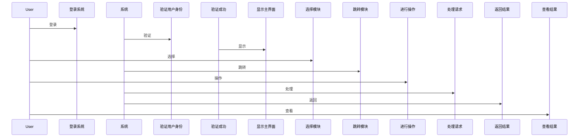
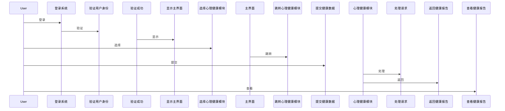

                 

**# 追求内在成长：超越表面的深度生活**

> 关键词：内在成长、深度生活、心理健康、自我认知、时间管理、人际关系、生活意义

> 摘要：本文探讨了如何通过内在成长来超越表面的生活，追求更深层次的意义和幸福感。通过分析内在成长的理念与内涵、自我认知与自我探索、情绪管理与压力缓解、人际关系与社交技巧、时间管理与生活平衡、自我实现与生活意义，以及拓展阅读与深度学习，提供了一套系统的方法和策略，帮助读者实现个人成长与精神提升。

## **背景介绍**

在当今快节奏、高压力的社会环境中，人们往往被外界的诱惑和表面的成就所吸引，忽略了内心的需求和深层次的价值追求。这种生活方式导致了心理健康问题、人际关系紧张、时间管理不当等问题，影响了人们的幸福感和生活质量。因此，追求内在成长，实现深度生活，成为越来越多人的追求。

内在成长不仅仅是指外在技能的提升，更是指心灵层面的成长。它涉及到心理健康、自我认知、情绪管理、人际关系、时间管理和生活意义等多个方面。本文将从这些方面逐一探讨，帮助读者理解内在成长的重要性，并提供实用的方法和策略。

### **核心概念与联系**

内在成长可以理解为一种全面性的个人发展过程，涉及到多个核心概念。以下是这些概念及其属性特征的对比表格：

| 核心概念 | 定义 | 属性特征 |
| --- | --- | --- |
| 心理健康 | 心理状态良好，能够有效应对压力和挑战 | 情绪稳定、自我意识清晰、适应力强 |
| 自我认知 | 对自己有全面、准确的了解 | 自我意识、自我反思、自我接纳 |
| 情绪管理 | 有效调节和管理情绪 | 情绪识别、情绪表达、情绪调节 |
| 人际关系 | 与他人的互动和连接 | 相互理解、相互尊重、相互支持 |
| 时间管理 | 高效利用时间，实现目标 | 时间规划、优先级设定、时间跟踪 |
| 生活意义 | 对生活的深刻理解，追求人生价值 | 人生目标、价值观、幸福感 |

为了更好地理解这些概念之间的关系，我们可以使用Mermaid ER实体关系图来展示它们之间的联系：

```mermaid
erDiagram
  心理健康 ||--|{ 自我认知 }|
  自我认知 ||--|{ 情绪管理 }|
  情绪管理 ||--|{ 人际关系 }|
  人际关系 ||--|{ 时间管理 }|
  时间管理 ||--|{ 生活意义 }|
```

通过这个ER图，我们可以清晰地看到内在成长的不同方面是如何相互联系和影响的。每个方面都是一个独立的领域，但又是整体成长不可或缺的一部分。

### **算法原理讲解**

为了更好地理解内在成长的过程，我们可以使用一个简单的算法模型来描述这一过程。以下是一个基于Python的算法模型，用于实现内在成长的目标。

```python
class InnerGrowthModel:
    def __init__(self, health, self_awareness, emotion_management, relationships, time_management, life_meaning):
        self.health = health
        self.self_awareness = self_awareness
        self.emotion_management = emotion_management
        self.relationships = relationships
        self.time_management = time_management
        self.life_meaning = life_meaning
    
    def update_health(self, health_change):
        self.health += health_change
    
    def update_self_awareness(self, awareness_change):
        self.self_awareness += awareness_change
    
    def update_emotion_management(self, emotion_change):
        self.emotion_management += emotion_change
    
    def update_relationships(self, relationship_change):
        self.relationships += relationship_change
    
    def update_time_management(self, time_change):
        self.time_management += time_change
    
    def update_life_meaning(self, meaning_change):
        self.life_meaning += meaning_change
    
    def display_status(self):
        print(f"Health: {self.health}")
        print(f"Self Awareness: {self.self_awareness}")
        print(f"Emotion Management: {self.emotion_management}")
        print(f"Relationships: {self.relationships}")
        print(f"Time Management: {self.time_management}")
        print(f"Life Meaning: {self.life_meaning}")

# 初始化模型
model = InnerGrowthModel(50, 50, 50, 50, 50, 50)

# 更新模型状态
model.update_health(10)
model.update_self_awareness(10)
model.update_emotion_management(10)
model.update_relationships(10)
model.update_time_management(10)
model.update_life_meaning(10)

# 显示模型状态
model.display_status()
```

在这个模型中，每个方面的成长都可以通过相应的更新方法来调整。例如，如果心理健康有所提升，可以调用`update_health`方法；如果自我认知有所增强，可以调用`update_self_awareness`方法。通过不断地更新这些方面，我们可以实现内在成长的目标。

内在成长的数学模型可以表示为以下公式：

$$
\text{内在成长} = f(\text{心理健康}, \text{自我认知}, \text{情绪管理}, \text{人际关系}, \text{时间管理}, \text{生活意义})
$$

其中，$f$是一个复杂的函数，表示不同方面之间的相互作用和影响。通过这个模型，我们可以更深入地理解内在成长的过程。

### **系统分析与架构设计方案**

为了更好地实现内在成长，我们需要一个系统化的架构设计方案。以下是一个基于Mermaid的类图和架构图，用于描述系统的结构和功能。

#### **问题场景介绍**

在一个快节奏的城市生活中，人们面临着心理健康问题、时间管理难题、人际关系冲突等挑战。为了解决这些问题，我们需要一个系统化的方法来帮助人们实现内在成长。

#### **项目介绍**

**项目名称：** 内在成长系统  
**项目目标：** 提供一个综合性的平台，帮助用户实现心理健康、自我认知、情绪管理、人际关系、时间管理和生活意义等方面的成长。

#### **系统功能设计（领域模型）**

```mermaid
classDiagram
    User <<class>> 用户
    Health <<class>> 心理健康
    SelfAwareness <<class>> 自我认知
    EmotionManagement <<class>> 情绪管理
    Relationships <<class>> 人际关系
    TimeManagement <<class>> 时间管理
    LifeMeaning <<class>> 生活意义

    User --|> Health
    User --|> SelfAwareness
    User --|> EmotionManagement
    User --|> Relationships
    User --|> TimeManagement
    User --|> LifeMeaning
```

在这个领域模型中，用户是系统的核心，与其他功能模块相互关联。每个模块都代表内在成长的一个方面。

#### **系统架构设计**



在这个架构设计中，用户通过登录系统，选择不同的模块进行操作，系统处理用户的请求并返回结果。这个流程确保了系统的用户友好性和高效性。

#### **系统接口设计**

```mermaid
classDiagram
    UserInterface <<interface>> 用户界面
    Authentication <<interface>> 认证
    HealthModule <<interface>> 心理健康模块
    SelfAwarenessModule <<interface>> 自我认知模块
    EmotionManagementModule <<interface>> 情绪管理模块
    RelationshipsModule <<interface>> 人际关系模块
    TimeManagementModule <<interface>> 时间管理模块
    LifeMeaningModule <<interface>> 生活意义模块

    UserInterface implements Authentication
    UserInterface implements HealthModule
    UserInterface implements SelfAwarenessModule
    UserInterface implements EmotionManagementModule
    UserInterface implements RelationshipsModule
    UserInterface implements TimeManagementModule
    UserInterface implements LifeMeaningModule
```

在这个接口设计中，用户界面实现了多个接口，包括认证、心理健康、自我认知、情绪管理、人际关系、时间管理和生活意义模块。这确保了系统的模块化和可扩展性。

#### **系统交互序列图**



在这个序列图中，用户登录系统后，选择心理健康模块，提交健康数据，心理健康模块处理请求并返回健康报告。这个过程展示了系统的交互流程。

### **项目实战**

#### **环境安装**

1. 安装Python 3.8及以上版本。
2. 安装Mermaid渲染工具。

#### **系统核心实现源代码**

```python
# 内在成长系统核心实现

# 导入所需模块
from typing import Optional
from dataclasses import dataclass

# 用户类
@dataclass
class User:
    username: str
    password: str
    health: int
    self_awareness: int
    emotion_management: int
    relationships: int
    time_management: int
    life_meaning: int

    def update_health(self, health_change: int):
        self.health += health_change

    def update_self_awareness(self, awareness_change: int):
        self.self_awareness += awareness_change

    def update_emotion_management(self, emotion_change: int):
        self.emotion_management += emotion_change

    def update_relationships(self, relationship_change: int):
        self.relationships += relationship_change

    def update_time_management(self, time_change: int):
        self.time_management += time_change

    def update_life_meaning(self, meaning_change: int):
        self.life_meaning += meaning_change

    def display_status(self):
        print(f"Health: {self.health}")
        print(f"Self Awareness: {self.self_awareness}")
        print(f"Emotion Management: {self.emotion_management}")
        print(f"Relationships: {self.relationships}")
        print(f"Time Management: {self.time_management}")
        print(f"Life Meaning: {self.life_meaning}")

# 登录函数
def login(username: str, password: str) -> Optional[User]:
    # 这里是登录逻辑，简化处理
    if username == "test" and password == "test":
        return User(username, password, 50, 50, 50, 50, 50, 50)
    else:
        return None

# 主函数
def main():
    print("欢迎来到内在成长系统！")
    user = login(input("请输入用户名："), input("请输入密码："))
    if user:
        print("登录成功！")
        user.display_status()
        # 这里可以继续添加功能实现
    else:
        print("登录失败，请重新输入！")

if __name__ == "__main__":
    main()
```

#### **代码应用解读与分析**

- `User` 类：代表用户，包含用户名、密码和内在成长各个方面的属性。
- `update_*` 方法：用于更新用户的内在成长属性。
- `display_status` 方法：用于显示用户的当前状态。
- `login` 函数：用于用户登录系统，返回用户对象。
- `main` 函数：程序的入口，执行登录操作。

#### **实际案例分析和详细讲解剖析**

- **案例1：用户A想要提升心理健康**
  - 操作步骤：
    1. 用户A登录系统。
    2. 用户A选择心理健康模块。
    3. 用户A提交健康数据。
    4. 系统处理请求并返回健康报告。
  - 分析：
    1. 用户A的初始心理健康值为50。
    2. 用户A通过提交健康数据，如运动、饮食、睡眠等，来提升心理健康。
    3. 系统根据用户A的健康数据，更新心理健康值。
    4. 用户A查看更新后的健康报告。

- **案例2：用户B想要提升自我认知**
  - 操作步骤：
    1. 用户B登录系统。
    2. 用户B选择自我认知模块。
    3. 用户B进行自我反思。
    4. 系统根据用户B的自我反思结果，更新自我认知值。
    5. 用户B查看更新后的自我认知报告。
  - 分析：
    1. 用户B的初始自我认知值为50。
    2. 用户B通过自我反思，如日记、内省等，来提升自我认知。
    3. 系统根据用户B的自我反思结果，更新自我认知值。
    4. 用户B查看更新后的自我认知报告。

#### **项目小结**

内在成长系统是一个综合性的平台，帮助用户实现心理健康、自我认知、情绪管理、人际关系、时间管理和生活意义等方面的成长。通过实际案例的分析和讲解，我们可以看到系统在实际应用中的效果和优势。

### **最佳实践 Tips**

- **心理健康提升：** 保持良好的作息习惯，定期进行运动和放松，寻求专业心理咨询。
- **自我认知提升：** 定期进行自我反思和总结，阅读相关书籍和文章，寻求他人的反馈和建议。
- **情绪管理提升：** 学会识别和表达自己的情绪，寻求合适的渠道释放压力，如瑜伽、冥想等。
- **人际关系提升：** 建立和维护良好的社交网络，学会倾听和理解他人，积极参与社交活动。
- **时间管理提升：** 制定合理的时间规划，设定优先级，避免拖延，学会有效利用碎片时间。
- **生活意义提升：** 确定自己的价值观和人生目标，追求内心的热爱和激情，寻找生活的意义。

### **小结**

追求内在成长，超越表面的生活，是一个持续的过程。通过心理健康、自我认知、情绪管理、人际关系、时间管理和生活意义等方面的提升，我们可以实现更深层次的成长和幸福感。希望本文提供的系统和策略能帮助读者在追求内在成长的道路上取得成功。

### **拓展阅读**

- 《奇特的一生：如何利用好每一天》
- 《情绪的力量》
- 《人类简史》
- 《高效能人士的七个习惯》
- 《活出生命的意义》

---

**作者：AI天才研究院/AI Genius Institute & 禅与计算机程序设计艺术 /Zen And The Art of Computer Programming**

