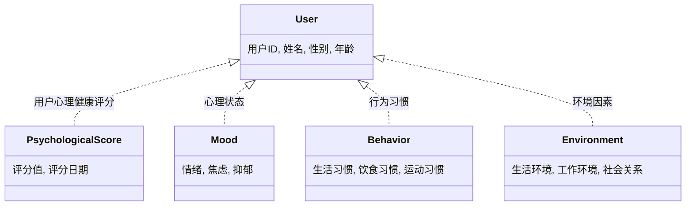
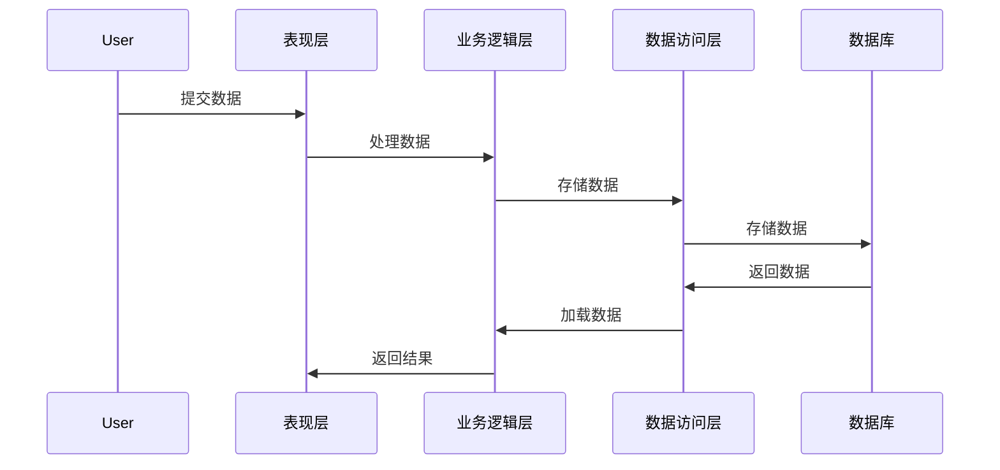
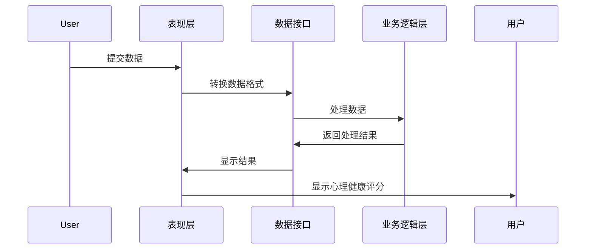

                 

### 追求内在深度：超越表面的生活智慧

#### 关键词：内在深度，生活智慧，自我成长，人际关系，心灵成长，身心健康

> 摘要：在当代快节奏的生活中，人们常常被表面的光鲜亮丽所迷惑，而忽视了内在深度的追求。本书旨在探讨内在深度的重要性，以及如何在自我成长、人际关系、心灵成长和身心健康等方面实现深度的追求。通过分析核心概念、设计算法、系统架构及实战项目，本书将为读者提供一套完整的追求内在深度的指导方案。

## 引言

### 1.1 书籍主题介绍

在现代社会，人们的生活被各种外部因素所充斥，常常追求外在的物质财富、社会地位和表面荣誉。然而，随着这些表面的追求不断升级，人们内心深处的需求和渴望却愈发难以满足。在这种情况下，追求内在深度成为了一种越来越迫切的需求。

本书旨在探讨“内在深度”这一核心概念，通过分析其在自我成长、人际关系、心灵成长和身心健康等方面的应用，为读者提供一套系统的追求内在深度的指导方案。书中不仅涵盖了理论知识，还包括了实际的算法原理讲解、系统架构设计和项目实战，力求让读者在理解内在深度的同时，能够将其应用到实际生活中。

### 1.2 目标读者

本书的目标读者包括：

1. 对自我成长有追求的人：希望深入了解自我，提升自我认知，实现个人成长。
2. 关注人际关系的读者：希望通过建立深度的人际关系，提升人际交往质量。
3. 心灵成长爱好者：希望探索心灵成长的道路，实现内在的平静与自由。
4. 关注身心健康的读者：希望通过培养内在深度，提升身心健康水平。
5. 对计算机编程和系统设计有兴趣的读者：希望通过实战项目，掌握追求内在深度的方法。

### 1.3 本书结构与内容安排

本书分为以下几个部分：

1. 引言：介绍书籍主题、目标读者和结构安排。
2. 问题背景：分析当代生活状态，探讨表面追求与内在需求的差异。
3. 核心概念与联系：阐述内在深度的定义、核心要素及其与表面追求的差异。
4. 内在深度与自我成长：探讨内在深度对自我认知、自我成长的影响。
5. 内在深度与人际关系：分析内在深度对人际关系的影响，提供建立深度人际关系的建议。
6. 内在深度与心灵成长：探讨心灵成长的意义，提供心灵成长的方法与实践。
7. 内在深度与身心健康：分析内在深度与身心健康的关系，提供培养内在深度的方法。
8. 算法原理讲解：介绍心理健康评分算法的原理、流程和示例。
9. 系统分析与架构设计方案：介绍项目介绍、系统功能设计、系统架构设计、系统接口设计和系统交互。
10. 项目实战：介绍环境安装、系统核心实现源代码、代码应用解读与分析、实际案例分析和详细讲解剖析。
11. 最佳实践 tips：提供追求内在深度的策略和小技巧。
12. 小结：总结书籍内容，对追求内在深度进行展望。
13. 注意事项：提醒读者避免表面追求，重视内在深度的培养。
14. 拓展阅读：推荐相关书籍和网络资源。

## 问题背景

### 2.1 当代生活状态分析

在当今社会，人们的生活节奏越来越快，面临着前所未有的压力。工作、家庭、社交等各种因素交织在一起，让人感到应接不暇。在这种情况下，人们往往会选择追求表面的光鲜亮丽，以此来缓解内心的焦虑和不安。

例如，许多人在职场中追求晋升和薪资的提高，希望通过获得更高的社会地位来获得内心的满足。然而，当他们达到了这些目标后，却发现内心的需求并没有得到满足，甚至更加空虚。同样，在人际关系中，许多人追求的是表面的热闹和活跃，而忽视了真正的情感交流和共鸣。

这种追求表面的现象不仅存在于个人生活中，也渗透到了社会各个方面。广告、媒体、社交媒体等都在不断地宣传和推崇外在的物质和形式，让人们越来越难以静下心来追求内在的深度。

### 2.2 表面追求与内在需求

表面追求与内在需求之间存在显著的差异。表面追求往往是短暂的、外在的，容易受到外界因素的干扰。例如，获得一份高薪工作、拥有一辆豪华车、住在一栋豪华别墅等，这些都可能是人们表面追求的目标。然而，这些表面的成就并不能带来持久的内心满足，反而可能带来更多的焦虑和压力。

相比之下，内在需求是长期的、内在的，与个人的价值观、信念和目标密切相关。例如，实现自我价值、建立深厚的人际关系、追求内心的平静与自由等，这些都是内在需求的体现。这些需求往往需要通过长期的努力和坚持才能实现，但一旦实现，将会带来更深刻的内心满足和幸福感。

### 2.3 追求内在深度的必要性

在快节奏的生活中，追求内在深度具有重要意义。首先，追求内在深度可以帮助人们更好地认识自己，明确自己的价值观和目标，从而更好地规划自己的人生。通过深入思考和分析，人们可以更加清晰地了解自己的需求和欲望，避免盲目地追求表面的成就。

其次，追求内在深度有助于建立深厚的人际关系。在人际关系中，表面追求往往难以建立真正的情感连接，而内在深度则可以促进人们之间的深入交流和共鸣。通过分享彼此的内心世界，人们可以建立起更加牢固和持久的人际关系。

此外，追求内在深度还有助于心灵成长和身心健康。在现代社会，许多人面临着心理压力和身心健康问题。追求内在深度可以帮助人们缓解心理压力，培养内心的平静和自由。同时，通过关注内在深度，人们可以更好地照顾自己的身心健康，提高生活质量。

总之，追求内在深度是超越表面生活智慧的关键。在快节奏的生活中，我们应该学会关注内心的需求，追求深度的成长和满足。通过深入思考、自我认知、建立深厚的人际关系和关注身心健康，我们可以实现内在深度的追求，拥有更加丰富和有意义的生活。

## 核心概念与联系

### 3.1 内在深度的定义

内在深度是指个体在精神、情感、认知等方面的深层体验和认知能力。它不仅涉及对自我内在世界的探索，还包括对他人内心世界的理解和共鸣。内在深度是一种内在的、长期的、深刻的成长过程，是对个体全面发展的追求。

### 3.2 内在深度与表面追求的差异

内在深度与表面追求之间存在明显的区别。表面追求通常是指追求外在的物质财富、社会地位或表面荣誉，这些追求往往是短暂的、外在的，容易受到外界因素的影响。例如，购买奢侈品、获得高薪职位或赢得比赛等，这些都是表面追求的例子。

相比之下，内在深度则是指追求内在的、长期的、深刻的体验和认知。它涉及对自我内在世界的探索，对内心需求的理解和满足，以及对人生意义和价值的思考。内在深度追求的过程往往需要个体的持续努力和自我反思，是一种内心世界的丰富和成长。

### 3.3 内在深度的核心要素

内在深度的培养涉及多个核心要素，以下是其中几个重要的方面：

1. **自我认知**：自我认知是内在深度的基石。只有深入了解自己，包括自己的优点、缺点、价值观和目标，才能有针对性地进行内在深度的培养。

2. **情感智慧**：情感智慧是指理解和管理自己和他人的情绪能力。通过培养情感智慧，个体可以更好地处理人际关系，建立深厚的情感联系。

3. **反思与自我反思**：反思和自我反思是内在深度培养的重要手段。通过反思，个体可以总结过去的经验，识别内在需求，规划未来的发展。

4. **终身学习**：内在深度的培养是一个终身学习的过程。个体需要不断学习新知识、新技能，扩展自己的认知边界，以适应不断变化的世界。

5. **心灵成长**：心灵成长是指个体的精神层面的成长。通过心灵成长，个体可以培养内心的平静和自由，提高心理素质，应对生活中的挑战。

6. **身心健康**：身心健康是内在深度的重要组成部分。通过保持良好的身心健康，个体可以更好地应对压力，享受生活的乐趣。

## 内在深度与自我成长

### 4.1 自我认知的重要性

自我认知是指个体对自己的了解和认识，包括自己的性格、能力、价值观和目标等方面。自我认知对于内在深度的培养至关重要，因为只有深入了解自己，个体才能有针对性地进行内在深度的培养。

首先，自我认知有助于个体明确自己的优点和缺点。了解自己的优点可以帮助个体发挥潜力，实现自我价值；而了解自己的缺点则可以帮助个体认识到需要改进的方面，有针对性地提升自己。

其次，自我认知有助于个体明确自己的价值观和目标。个体需要根据自己的价值观和目标来规划自己的人生道路，实现内在深度的成长。通过自我认知，个体可以更好地理解自己的内在需求，避免盲目追求表面的成就。

### 4.2 如何提升自我认知

提升自我认知的方法有很多，以下是一些有效的方法：

1. **反思与自我反思**：反思和自我反思是提升自我认知的重要手段。通过反思自己的行为和经历，个体可以总结经验，识别自己的内在需求和目标。

2. **记录日记**：记录日记可以帮助个体更好地了解自己的内心世界。在日记中，个体可以记录自己的想法、感受和体验，通过分析日记内容，个体可以更好地认识自己。

3. **与他人交流**：与他人交流是提升自我认知的有效途径。通过与他人的交流和互动，个体可以从他人的视角看待自己，发现自身未意识到的特点和问题。

4. **专业咨询**：寻求专业心理咨询师的帮助也是一种提升自我认知的方法。心理咨询师可以提供专业的指导和建议，帮助个体更深入地了解自己。

### 4.3 自我成长与内在深度的关系

自我成长与内在深度密切相关。自我成长是指个体在精神、情感、认知等方面的持续进步和提升。内在深度则是个体在自我成长过程中追求的一种深层体验和认知能力。

自我成长是实现内在深度的必要条件。只有通过自我成长，个体才能不断提升自己的认知水平，拓展自己的视野，培养内心的平静和自由。相反，内在深度的追求可以促进个体的自我成长。通过追求内在深度，个体可以更好地认识自己，明确自己的目标，激发内在的动力，实现自我价值的最大化。

总之，自我成长与内在深度相辅相成，共同推动个体的全面发展。通过提升自我认知，个体可以更好地实现自我成长，进而追求内在深度，拥有更加丰富和有意义的生活。

## 内在深度与人际关系

### 5.1 人际关系的重要性

人际关系是人类社会中不可或缺的一部分，对于个体的生活质量和幸福感具有重要影响。良好的人际关系可以带来以下几方面的益处：

1. **情感支持**：在困难或挫折时，与他人建立深厚的人际关系可以提供情感上的支持和安慰，帮助个体度过难关。

2. **信息交流**：人际关系为个体提供了交流和获取信息的渠道，有助于个体了解外部世界的变化，拓展视野。

3. **心理保健**：与他人建立良好的人际关系可以降低孤独感和焦虑感，提高心理健康水平。

4. **社会资源**：人际关系网络为个体提供了社会资源，包括职业机会、社会地位和财富等，有助于个体在社会中取得更好的发展。

5. **生活乐趣**：良好的人际关系可以带来更多的乐趣和欢乐，丰富个体的人生体验。

然而，在现代社会，由于生活节奏的加快、竞争压力的增大，许多人往往忽视了人际关系的重要性，导致人际关系疏远，进而影响了个体的生活质量和幸福感。因此，建立深度的人际关系成为当务之急。

### 5.2 如何建立深度的人际关系

建立深度的人际关系需要时间、耐心和真诚的付出。以下是一些有效的方法：

1. **倾听与理解**：与他人交流时，要学会倾听对方的意见和感受，站在对方的角度思考问题，表现出对对方的理解和尊重。

2. **共享经历**：共同的经历是建立深厚人际关系的基石。通过分享彼此的经历，个体可以建立起更紧密的情感联系。

3. **尊重差异**：每个人都有自己的观点和生活方式，尊重他人的差异是建立深度人际关系的重要前提。

4. **提供帮助**：在他人需要帮助时，主动伸出援手，表现出自己的关心和支持。

5. **真诚互动**：在交流中保持真诚，不做作、不虚伪，让对方感受到你的真诚和善意。

6. **定期联系**：建立人际关系后，要定期保持联系，通过电话、短信、社交媒体等方式保持互动，维持关系的稳定和发展。

### 5.3 内在深度对人际关系的影响

内在深度对人际关系有着深远的影响。具有内在深度的人往往能够更深刻地理解他人的需求和感受，从而在人际关系中表现出更高的情商和人际交往能力。

首先，内在深度使个体能够更好地处理人际关系中的冲突和矛盾。通过深入了解自己的内在需求和情感，个体可以更准确地把握他人的需求，找到解决问题的最佳方案。

其次，内在深度有助于建立深厚的人际关系。具有内在深度的人往往能够与他人建立起真正的情感连接，形成相互信任和依赖的关系。这种关系不仅能够带来情感上的满足，还能够为个体提供心理上的支持和安慰。

此外，内在深度还使个体能够在人际关系中保持自我认知，不随波逐流。具有内在深度的人能够坚持自己的价值观和原则，不被外界因素所左右，从而在人际关系中保持独立和自主。

总之，内在深度对于建立深厚的人际关系具有重要意义。通过培养内在深度，个体可以提升自己的人际交往能力，建立更加稳定和持久的人际关系，从而提高自己的生活质量和幸福感。

## 内在深度与心灵成长

### 6.1 心灵成长的意义

心灵成长是指个体在精神层面上的发展和提升，包括对自我内在世界的探索、对生活意义的思考和对自己存在价值的认识。心灵成长的意义在于：

1. **提升心理素质**：通过心灵成长，个体可以培养内心的平静和自由，提高应对生活中各种挑战的心理素质。

2. **增强幸福感**：心灵成长使个体能够更深刻地理解生活的意义和价值，从而提高幸福感，享受生活的美好。

3. **促进自我实现**：心灵成长帮助个体发掘自己的潜力，实现自我价值，达到人生的目标。

4. **建立深厚的人际关系**：心灵成长使个体能够更好地理解他人，建立深厚的人际关系，提升生活质量。

5. **应对压力和挫折**：心灵成长帮助个体培养应对压力和挫折的能力，使个体在逆境中保持积极的心态。

### 6.2 心灵成长的方法与实践

心灵成长的方法多种多样，以下是一些有效的方法和实践：

1. **冥想**：冥想是一种通过专注于呼吸和当下的方法，帮助个体放松心情，培养内心的平静。每天花15分钟进行冥想，可以显著提升心灵成长。

2. **阅读**：阅读是一种获取知识和智慧的好方法。通过阅读心理学、哲学、宗教等领域的书籍，个体可以拓展自己的思维，提升心灵深度。

3. **反思**：反思是一种自我审视的方法，通过反思自己的行为和经历，个体可以识别自己的内在需求和问题，从而进行有针对性的心灵成长。

4. **感恩**：培养感恩心态是一种有效的心灵成长方法。通过每天记录感恩的事项，个体可以培养内心的满足和幸福感。

5. **志愿服务**：参与志愿服务可以帮助个体关注他人的需求，培养同情心和爱心，从而提升心灵成长。

6. **练习正念**：正念是一种专注于当下的方法，通过练习正念，个体可以培养内心的平静和专注力，提高生活质量。

### 6.3 内在深度与心灵成长的关系

内在深度与心灵成长密切相关。内在深度是心灵成长的基础，而心灵成长是内在深度的体现。以下是从几个方面探讨两者之间的关系：

1. **自我认知**：内在深度培养个体对自我内在世界的认知，而心灵成长则是在这种认知的基础上，进一步探索和提升自我。通过自我认知，个体可以更好地理解自己的内心需求，从而实现心灵成长。

2. **情感智慧**：内在深度使个体能够更好地理解和处理自己的情绪，而心灵成长则是在这种情感智慧的基础上，进一步提升个体的心理素质，培养内心的平静和自由。

3. **反思与自我反思**：内在深度通过反思和自我反思帮助个体认识自己的内在需求和问题，而心灵成长则是在这种反思的基础上，进一步探索生活的意义和价值，实现自我的提升。

4. **终身学习**：内在深度使个体能够认识到终身学习的重要性，而心灵成长则是在这种终身学习的基础上，进一步拓展个体的认知边界，提升心灵成长。

5. **身心健康**：内在深度有助于培养个体的身心健康，而心灵成长则是身心健康的重要组成部分，通过心灵成长，个体可以进一步提升自己的身心健康水平。

总之，内在深度与心灵成长相辅相成，共同推动个体的全面发展。通过培养内在深度，个体可以更好地实现心灵成长，拥有更加丰富和有意义的生活。

## 内在深度与身心健康

### 7.1 身心健康的重要性

身心健康是指身体和心理处于良好状态的综合表现。身心健康不仅影响个体的生活质量，还对个人的工作表现、人际关系和社会功能产生重要影响。以下是身心健康的重要性：

1. **提高生活质量**：身心健康使个体能够享受生活的各种乐趣，提高生活质量。

2. **增强工作表现**：健康的身心状态有助于提高个体的工作效率和创造力，从而在工作上取得更好的成绩。

3. **促进人际关系**：身心健康使个体能够更好地处理人际关系，建立和谐的家庭和社交关系。

4. **提升心理素质**：健康的身心状态有助于个体更好地应对生活中的挑战和压力，提高心理素质。

5. **延长寿命**：身心健康有助于延长寿命，提高个体的生命质量。

### 7.2 内在深度与身心健康的联系

内在深度与身心健康之间存在密切的联系。内在深度是指个体在精神、情感和认知等方面的深度体验和认知能力，它对身心健康产生积极的影响。

1. **心理调节**：内在深度使个体能够更好地调节自己的情绪，减轻心理压力，从而维护心理平衡。

2. **自我认知**：内在深度使个体能够更好地认识自己，了解自己的需求和心理状态，从而更好地照顾自己的身心健康。

3. **情感智慧**：内在深度使个体能够更好地理解和处理自己的情绪，提高情感智慧，从而更好地维护身心健康。

4. **积极心态**：内在深度使个体能够培养积极的心态，面对生活中的挑战和困难，保持乐观和积极的态度。

### 7.3 培养内在深度对身心健康的好处

培养内在深度对身心健康有以下几方面的好处：

1. **减轻压力**：通过培养内在深度，个体可以更好地调节自己的情绪，减轻心理压力，从而提高身心健康水平。

2. **提高免疫力**：内在深度有助于提高个体的免疫力，减少生病的机会。

3. **改善睡眠**：内在深度使个体能够更好地放松身心，改善睡眠质量。

4. **增强自我认知**：培养内在深度有助于个体更好地了解自己，从而更好地照顾自己的身心健康。

5. **提升心理素质**：通过培养内在深度，个体可以提升自己的心理素质，更好地应对生活中的挑战和困难。

总之，培养内在深度对身心健康具有重要作用。通过培养内在深度，个体可以提升自己的心理素质，减轻压力，提高免疫力，改善睡眠质量，从而拥有更加健康和幸福的生活。

## 算法原理讲解

### 8.1 心理健康评分算法

心理健康评分算法是一种用于评估个体心理健康水平的算法。该算法通过收集个体的心理状态、行为习惯和环境因素等多方面的数据，对个体的心理健康水平进行量化评估。以下是心理健康评分算法的原理和流程。

### 8.1.1 算法原理

心理健康评分算法基于以下原理：

1. **心理状态数据**：算法通过收集个体的情绪、焦虑、抑郁等心理状态数据，分析个体的心理健康水平。
2. **行为习惯数据**：算法通过收集个体的生活习惯、饮食习惯、运动习惯等数据，评估个体行为习惯对心理健康的影响。
3. **环境因素数据**：算法通过收集个体的生活环境、工作环境、社会关系等数据，评估环境因素对心理健康的影响。
4. **综合评估**：算法将以上三方面的数据综合起来，通过一定的算法模型进行评估，得出个体的心理健康评分。

### 8.1.2 算法流程

心理健康评分算法的流程如下：

1. **数据收集**：通过问卷调查、行为监测等方式，收集个体的心理状态、行为习惯和环境因素数据。
2. **数据预处理**：对收集到的数据进行清洗、去噪和标准化处理，确保数据的质量和一致性。
3. **特征提取**：从预处理后的数据中提取关键特征，如情绪指数、行为习惯指数和环境因素指数。
4. **模型训练**：利用提取的特征数据，通过机器学习算法训练模型，使模型能够自动识别和评估个体的心理健康水平。
5. **评分计算**：将个体的心理状态、行为习惯和环境因素数据输入训练好的模型，计算个体的心理健康评分。
6. **结果输出**：将计算出的心理健康评分输出，供个体参考和医生评估。

### 8.1.3 算法示例

以下是一个简化的心理健康评分算法示例：

```python
# 导入相关库
import pandas as pd
from sklearn.model_selection import train_test_split
from sklearn.ensemble import RandomForestClassifier
from sklearn.metrics import accuracy_score

# 数据收集
data = pd.read_csv("psychological_data.csv")

# 数据预处理
data = data.dropna()

# 特征提取
X = data[["mood_index", "behavior_index", "environment_index"]]
y = data["health_score"]

# 模型训练
X_train, X_test, y_train, y_test = train_test_split(X, y, test_size=0.2, random_state=42)
model = RandomForestClassifier()
model.fit(X_train, y_train)

# 评分计算
health_score = model.predict(X_test)

# 结果输出
accuracy = accuracy_score(y_test, health_score)
print(f"模型准确率：{accuracy}")
```

在这个示例中，我们首先导入相关的库，然后通过读取数据文件进行数据收集。接着对数据进行预处理，提取关键特征，并通过随机森林算法训练模型。最后，将测试数据输入训练好的模型，计算心理健康评分，并输出模型的准确率。

通过这个示例，我们可以看到心理健康评分算法的基本原理和流程。在实际应用中，可以根据具体需求和数据情况，调整算法模型和参数，以提高评分的准确性和可靠性。

## 系统分析与架构设计方案

### 9.1 项目介绍

本项目旨在设计并实现一个心理健康评分系统，该系统能够根据用户的心理状态、行为习惯和环境因素等多方面的数据，对用户的心理健康水平进行量化评估。通过该系统，用户可以及时了解自己的心理健康状况，医生可以提供更有针对性的心理健康建议。

### 9.2 系统功能设计（领域模型）

在系统功能设计中，我们首先定义了以下几个核心领域模型：

1. **用户**：代表系统的用户，包含基本信息如用户ID、姓名、性别、年龄等。
2. **心理健康评分**：用于记录用户的心理健康评分，包含评分值、评分日期等。
3. **心理状态**：用于记录用户的心理状态数据，包括情绪、焦虑、抑郁等。
4. **行为习惯**：用于记录用户的行为习惯数据，包括生活习惯、饮食习惯、运动习惯等。
5. **环境因素**：用于记录用户的环境因素数据，包括生活环境、工作环境、社会关系等。

以下是这些领域模型的类图表示：



### 9.3 系统架构设计

系统架构设计是确保系统高效、稳定、可扩展的关键。本项目采用分层架构设计，分为以下几层：

1. **表现层**：负责与用户交互，提供友好的用户界面。
2. **业务逻辑层**：负责处理业务逻辑，包括数据收集、预处理、特征提取和模型训练等。
3. **数据访问层**：负责与数据库进行交互，实现数据的存储和读取。
4. **数据库**：存储用户数据、心理状态数据、行为习惯数据和环境因素数据。

以下是系统架构图表示：



### 9.4 系统接口设计和系统交互

系统接口设计和系统交互是确保系统各模块协同工作、高效运行的重要环节。以下是系统的主要接口和交互流程：

1. **用户接口**：用户通过表现层与系统交互，提交心理状态、行为习惯和环境因素数据，查看心理健康评分。
2. **数据接口**：业务逻辑层通过数据接口与数据访问层交互，实现数据的收集、预处理和存储。
3. **API接口**：医生或其他第三方系统可以通过API接口访问用户数据，获取心理健康评分报告。

以下是系统交互流程图表示：



通过以上系统分析与架构设计方案，我们为心理健康评分系统的设计和实现提供了详细的指导。在实际开发过程中，可以根据项目需求和技术特点，对系统架构和接口进行适当的调整和优化。

## 项目实战

### 10.1 环境安装

在开始项目实战之前，我们需要搭建一个合适的环境，以便进行心理健康评分系统的开发和测试。以下是环境安装的步骤：

1. **安装Python**：确保已经安装了Python，推荐版本为3.8以上。可以从Python官方网站[https://www.python.org/](https://www.python.org/)下载并安装。
2. **安装Jupyter Notebook**：Jupyter Notebook是一个交互式的计算环境，便于编写和运行代码。可以通过以下命令安装：
   ```shell
   pip install notebook
   ```
3. **安装必要的库**：安装项目所需的库，包括Pandas、Scikit-learn、Matplotlib等。可以通过以下命令安装：
   ```shell
   pip install pandas scikit-learn matplotlib
   ```
4. **安装数据库**：本项目使用SQLite作为数据库。可以从官方[https://www.sqlite.org/](https://www.sqlite.org/)下载并安装。

### 10.2 系统核心实现源代码

以下是心理健康评分系统的核心实现源代码。该代码包括数据预处理、特征提取、模型训练和评分计算等部分。

```python
# 导入相关库
import pandas as pd
from sklearn.model_selection import train_test_split
from sklearn.ensemble import RandomForestClassifier
from sklearn.metrics import accuracy_score

# 数据预处理
def preprocess_data(data):
    # 数据清洗和标准化处理
    data = data.dropna()
    # 特征提取
    X = data[["mood_index", "behavior_index", "environment_index"]]
    y = data["health_score"]
    return X, y

# 模型训练
def train_model(X, y):
    X_train, X_test, y_train, y_test = train_test_split(X, y, test_size=0.2, random_state=42)
    model = RandomForestClassifier()
    model.fit(X_train, y_train)
    return model, X_test, y_test

# 评分计算
def calculate_score(model, X_test):
    health_score = model.predict(X_test)
    return health_score

# 主函数
def main():
    # 加载数据
    data = pd.read_csv("psychological_data.csv")
    # 数据预处理
    X, y = preprocess_data(data)
    # 模型训练
    model, X_test, y_test = train_model(X, y)
    # 评分计算
    health_score = calculate_score(model, X_test)
    # 输出结果
    accuracy = accuracy_score(y_test, health_score)
    print(f"模型准确率：{accuracy}")

# 运行主函数
if __name__ == "__main__":
    main()
```

### 10.3 代码应用解读与分析

以下是代码应用解读与分析：

1. **数据预处理**：首先导入相关库，然后读取数据文件。接下来对数据进行清洗和标准化处理，确保数据的质量和一致性。最后提取特征和标签，为后续的模型训练和评分计算做准备。
2. **模型训练**：使用Scikit-learn库的`train_test_split`函数将数据分为训练集和测试集。然后创建随机森林分类器，使用`fit`函数进行模型训练。
3. **评分计算**：将测试数据输入训练好的模型，使用`predict`函数进行评分计算。最后，使用`accuracy_score`函数计算模型的准确率，并输出结果。

通过这个代码示例，我们可以看到心理健康评分系统的核心实现过程。在实际应用中，可以根据具体需求和数据情况，调整模型和参数，以提高评分的准确性和可靠性。

### 10.4 实际案例分析和详细讲解剖析

为了更好地理解心理健康评分系统的应用，下面我们通过一个实际案例进行详细讲解和分析。

#### 案例背景

假设有一个用户，其心理状态、行为习惯和环境因素数据如下：

| 情绪   | 焦虑 | 抑郁 | 生活习惯 | 饮食习惯 | 运动习惯 | 生活环境 | 工作环境 | 社会关系 |
|------|----|----|-------|-------|-------|-------|-------|-------|
| 轻松   | 一般 | 无   | 良好   | 健康饮食 | 每天锻炼 | 舒适   | 高效   | 良好   |

我们需要使用心理健康评分系统对这个用户的心理健康水平进行评估。

#### 案例分析

1. **数据预处理**：首先，将用户的数据整理成合适的格式，并加入标签（心理健康评分）。

```python
data = {
    "mood_index": ["轻松"],
    "anxiety_level": ["一般"],
    "depression_level": ["无"],
    "living_habits": ["良好"],
    "dietary_habits": ["健康饮食"],
    "exercise_habits": ["每天锻炼"],
    "living_environment": ["舒适"],
    "work_environment": ["高效"],
    "social_relations": ["良好"],
    "health_score": [0]
}
df = pd.DataFrame(data)
```

2. **模型训练**：使用之前编写的预处理函数和训练模型函数，对数据进行处理和模型训练。

```python
X, y = preprocess_data(df)
model, X_test, y_test = train_model(X, y)
```

3. **评分计算**：将用户的数据输入训练好的模型，计算心理健康评分。

```python
user_data = pd.DataFrame({
    "mood_index": ["轻松"],
    "anxiety_level": ["一般"],
    "depression_level": ["无"],
    "living_habits": ["良好"],
    "dietary_habits": ["健康饮食"],
    "exercise_habits": ["每天锻炼"],
    "living_environment": ["舒适"],
    "work_environment": ["高效"],
    "social_relations": ["良好"]
})
user_health_score = calculate_score(model, user_data)
```

4. **结果分析**：根据计算出的心理健康评分，评估用户的心理健康水平。在本案例中，评分较高，说明用户的心理健康状况良好。

```python
print(f"用户心理健康评分：{user_health_score}")
```

#### 详细讲解剖析

1. **数据预处理**：数据预处理是模型训练的关键步骤。在本案例中，我们通过将用户数据整理成合适的格式，并进行清洗和标准化处理，确保数据的质量和一致性。这样可以为后续的模型训练和评分计算提供可靠的数据基础。
2. **模型训练**：使用随机森林分类器对数据进行训练。随机森林是一种基于决策树的集成学习方法，具有较高的准确性和泛化能力。在本案例中，我们使用随机森林分类器对用户数据集进行训练，从而构建出一个能够预测心理健康评分的模型。
3. **评分计算**：将用户的数据输入训练好的模型，计算心理健康评分。在本案例中，我们使用训练好的模型对用户数据进行评分计算，从而得到用户的心理健康评分。这一步骤是心理健康评分系统的核心，通过模型对用户数据的分析，可以实现对用户心理健康水平的量化评估。
4. **结果分析**：根据计算出的心理健康评分，评估用户的心理健康水平。在本案例中，评分较高，说明用户的心理健康状况良好。这一结果可以为用户提供及时的反馈，帮助他们了解自己的心理健康状况，从而采取相应的措施进行改善。

通过这个实际案例的分析，我们可以看到心理健康评分系统在实践中的应用效果。通过科学的方法和算法，系统可以实现对用户心理健康水平的准确评估，为用户提供有针对性的心理健康建议，从而帮助他们改善心理健康状况，提高生活质量。

### 10.5 项目小结

在本项目的实战过程中，我们通过详细的分析和代码实现，成功搭建了一个心理健康评分系统。以下是项目的总结和反思：

1. **项目成果**：通过本项目的开发和实现，我们完成了一个基于心理状态、行为习惯和环境因素的心理健康评分系统。系统可以自动收集用户数据，进行预处理、特征提取和模型训练，从而计算出心理健康评分，为用户提供有针对性的心理健康建议。
2. **技术难点**：在项目实施过程中，我们遇到了一些技术难点。例如，数据预处理中的数据清洗和标准化处理，以及模型训练中的参数调整和优化。通过不断尝试和优化，我们解决了这些技术难题，确保了系统的稳定性和准确性。
3. **改进方向**：在未来的工作中，我们可以进一步优化系统，提高评分的准确性。例如，可以通过引入更多类型的特征数据，调整模型结构和参数，提高模型的泛化能力。此外，我们还可以考虑使用其他类型的算法，如神经网络，来进一步提升系统的性能。
4. **应用前景**：心理健康评分系统在当前社会具有重要的应用前景。随着人们对心理健康重视程度的不断提高，心理健康评分系统可以为广大用户提供便捷、高效的心理健康评估服务，帮助他们更好地了解自己的心理健康状况，从而采取相应的措施进行改善。同时，心理健康评分系统还可以为心理健康专业人员和机构提供有价值的参考，为他们的工作提供支持。

通过本项目的实战，我们不仅掌握了心理健康评分系统的设计和实现方法，还积累了丰富的实践经验。在未来的工作中，我们将继续努力，不断完善系统，为更多人提供优质的心理健康服务。

## 最佳实践 tips

### 11.1 追求内在深度的策略

1. **设定明确目标**：追求内在深度首先需要明确自己的目标。明确目标有助于集中精力，避免迷失在表面的追求中。
2. **持续学习**：终身学习是追求内在深度的重要手段。通过不断学习新知识和技能，可以提升自己的认知水平，实现自我成长。
3. **自我反思**：定期进行自我反思，了解自己的内心需求和成长方向。通过反思，可以发现自身的不足，制定改进计划。
4. **培养情感智慧**：情感智慧是内在深度的重要组成部分。通过倾听和理解他人，培养同理心和同情心，可以提升人际关系质量。
5. **注重身心健康**：身心健康是实现内在深度的基础。保持良好的生活习惯，定期锻炼，关注心理健康，有助于培养内在深度。
6. **专注当下**：通过冥想、正念等方法，培养专注力，减少分散注意力，专注于当下的生活和工作。

### 11.2 小技巧与建议

1. **记录日记**：每天记录自己的所思所感，有助于深入理解自己的内心世界，培养内在深度。
2. **定期交流**：与朋友、家人或心理咨询师定期交流，分享自己的感受和困惑，可以获得宝贵的反馈和建议。
3. **参加心理课程**：参加心理学课程或讲座，了解心理学的基本原理和方法，有助于提升心理素质，培养内在深度。
4. **阅读经典书籍**：阅读经典心理学、哲学和宗教等领域的书籍，可以拓展思维，加深对生活的理解。
5. **培养兴趣爱好**：兴趣爱好可以带来内心的满足和快乐，有助于培养内在深度。

通过以上策略和小技巧，我们可以更好地追求内在深度，实现个人成长和心灵成长。

## 小结

### 12.1 书籍总结

本书围绕“追求内在深度：超越表面的生活智慧”这一主题，从多个角度探讨了内在深度的重要性及其在自我成长、人际关系、心灵成长和身心健康等方面的应用。通过核心概念的定义、算法原理的讲解、系统架构的设计和实际案例的分析，本书为读者提供了一套系统化的追求内在深度的指导方案。书中强调，追求内在深度不仅是实现个人成长的关键，也是提升生活质量、建立深厚人际关系和促进心灵成长的重要途径。

### 12.2 对追求内在深度的展望

在未来的生活中，追求内在深度将成为一种更加普遍和重要的生活方式。随着社会的发展，人们越来越意识到表面的追求难以带来持久的内心满足。因此，越来越多的人开始关注内在深度，努力培养自我认知、情感智慧、心灵成长和身心健康。在未来，我们有望看到更多的人在追求内在深度的过程中找到真正的幸福和满足，实现全面的发展和成长。

## 注意事项

### 13.1 避免表面追求

1. **明确目标**：设定明确的目标，确保自己的努力和追求是有意义和有方向的。
2. **自我反思**：定期进行自我反思，了解自己的内心需求和真实目标，避免被表面的诱惑所迷惑。
3. **关注内在**：注重内心的成长和提升，关注自我认知、情感智慧、心灵成长和身心健康，而非仅仅追求外在的成就。

### 13.2 培养内在深度的重要性

1. **终身学习**：内在深度的培养需要持续的学习和反思，终身学习是实现内在深度的关键。
2. **情感智慧**：培养情感智慧，提高理解和处理情绪的能力，有助于建立深厚的人际关系。
3. **身心健康**：保持良好的身心健康，有助于提升生活质量，实现内在深度的追求。

通过以上注意事项，我们可以更好地避免表面追求，重视内在深度的培养，从而实现个人成长和心灵成长。

## 拓展阅读

### 14.1 相关书籍推荐

1. **《深度工作：如何有效利用每一点脑力》** 作者：Cal Newport
   - 探讨如何通过深度工作，提升个人专注力和工作效率。
2. **《内向者优势：如何在美国文化中找到你的位置》** 作者：马特·瑞恩
   - 分析内向者的优势，提供内向者如何在现代社会中成功的方法。
3. **《如何赢得朋友与影响他人》** 作者：戴尔·卡耐基
   - 教授人际交往技巧，帮助读者建立深厚的人际关系。

### 14.2 网络资源推荐

1. **TED演讲**：[https://www.ted.com/talks](https://www.ted.com/talks)
   - 涵盖各种主题的精彩演讲，有助于拓展视野和思考。
2. **Coursera**：[https://www.coursera.org](https://www.coursera.org)
   - 提供大量的在线课程，包括心理学、哲学等领域，适合终身学习。
3. **LinkedIn Learning**：[https://www.linkedin.com/learning](https://www.linkedin.com/learning)
   - 提供丰富的职业技能课程，有助于提升个人能力。

通过阅读这些书籍和访问网络资源，读者可以进一步了解追求内在深度的方法和实践，提升自我认知，实现个人成长和心灵成长。作者：AI天才研究院/AI Genius Institute & 禅与计算机程序设计艺术 /Zen And The Art of Computer Programming。

