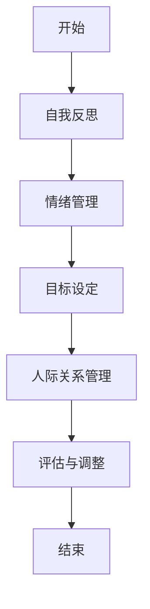

                 

### 追求生命的深度：超越表面的生活智慧

> **关键词：** 深度生活、内心力量、人际关系、表面生活、智慧探索

> **摘要：** 本文旨在探讨如何在现代社会中追求生命的深度，超越表面的生活智慧。通过分析表面生活的矛盾和问题，探讨深度生活的意义和要素，提供实践方法和体验反思，最终引导读者实现个人成长与自我价值的提升。

#### 引言

在现代社会，人们的生活节奏加快，信息爆炸，表面上似乎充满了各种机遇和选择。然而，许多人却感到内心空虚、迷茫，对生活的意义和方向感到困惑。这种现象背后，是表面生活的诱惑和陷阱，也是我们追求深度生活的现实背景。本文将从以下三个方面展开讨论：

1. **探索生命的意义**：反思当代社会的生命状态，探讨表面生活与内心空虚的矛盾，寻找追求深度生活的方法。
2. **深度生活的实践方法**：介绍改变生活方式、培养内心力量、建立深厚人际关系等深度生活的实践方法。
3. **深度生活的体验与反思**：分享深度生活的具体体验和感受，探讨超越表面的生活智慧。

#### 第一部分：探索生命的意义

### 第1章：对生命的反思

#### 1.1 问题背景

在现代社会，我们面临着诸多挑战和问题。例如，工作压力、人际关系、个人成长、心理健康等方面的问题。这些问题不仅影响到我们的生活质量，也影响到我们的精神状态。表面上，我们似乎在追求成功和幸福，但实际上，许多人感到内心空虚和迷茫。

#### 1.2 问题描述

表面生活的矛盾主要体现在以下几个方面：

1. **忙碌与空虚**：人们为了追求事业成功和物质财富，往往忽视了内心的需求，导致内心空虚。
2. **人际关系疏离**：现代社会中，人与人之间的交往往往变得表面化和形式化，缺乏深度的交流和情感连接。
3. **心理健康问题**：长期处于高压状态，容易导致焦虑、抑郁等心理问题。

#### 1.3 问题解决

要解决这些问题，我们需要寻求生命的深度。深度生活不仅是一种生活方式，更是一种生活态度。它要求我们：

1. **关注内心需求**：在追求物质财富的同时，也要关注内心的需求，寻找内心的平静和满足。
2. **建立深厚的人际关系**：与他人建立深度的交流和情感连接，提升人际关系的质量。
3. **培养内心力量**：通过自我反思、学习和成长，培养内心力量，提升心理素质。

#### 1.4 边界与外延

深度生活的定义与分类：

1. **深度生活**：指的是一种追求内心满足、精神成长和人际关系深度的生活方式。
2. **浅度生活**：指的是一种追求物质财富和表面成功的生活方式。

深度生活的要素与关系：

1. **内心满足**：是深度生活的核心，也是其他要素的基础。
2. **精神成长**：通过学习和成长，提升个人素质和内心力量。
3. **人际关系**：建立深厚的人际关系，提升生活质量。

#### 1.5 概念结构与核心要素组成

深度生活的概念结构包括以下几个方面：

1. **内心满足**：追求内心的平静和满足。
2. **精神成长**：通过学习和成长，提升个人素质和内心力量。
3. **人际关系**：建立深厚的人际关系，提升生活质量。

这些要素之间相互关联，共同构成了深度生活的核心。

### 第2章：核心概念与联系

#### 2.1 核心概念原理

生命深度与生命质量：

1. **生命深度**：指的是个体对生活意义的理解和追求的深度。
2. **生命质量**：指的是个体在生活过程中的感受和体验的质量。

#### 2.2 概念属性特征对比表格

| 概念         | 属性特征                      | 对比说明                   |
| ------------ | ----------------------------- | -------------------------- |
| 生命深度     | 对生活意义的理解和追求的深度 | 深度越高，生活质量越高     |
| 生命质量     | 生活过程中的感受和体验的质量 | 质量越高，生活越充实       |
| 表面生活     | 追求物质财富和表面成功       | 缺乏内心满足和精神成长     |
| 深度生活     | 追求内心满足、精神成长和人际关系深度 | 具有更高的生活质量和幸福感 |

#### 2.3 ER实体关系图架构

```mermaid
erDiagram
  Person ||--|{ LifeQuality }
  Person ||--|{ LifeDepth }
  LifeQuality ||--|{ SurfaceLife }
  LifeQuality ||--|{ DeepLife }
  LifeDepth ||--|{ SpiritualGrowth }
  LifeDepth ||--|{ InterpersonalRelationship }
```

#### 第二部分：深度生活的实践方法

### 第3章：生活方式的改变

#### 3.1 深度生活的原则

要实现深度生活，我们需要遵循以下原则：

1. **内心导向**：以内心需求为导向，关注内心的平静和满足。
2. **持续成长**：不断学习和成长，提升个人素质和内心力量。
3. **深度交往**：与他人建立深度的交流和情感连接，提升人际关系的质量。
4. **平衡发展**：在事业、家庭、个人成长等方面保持平衡，提升整体生活质量。

#### 3.2 改变生活方式的步骤

1. **反思自我**：审视自己的生活方式，识别表面生活的弊端和内心需求。
2. **设定目标**：明确深度生活的目标和方向，制定具体的行动计划。
3. **实践行动**：按照行动计划，逐步改变生活方式，追求内心满足和精神成长。
4. **持续反思**：定期反思和总结深度生活的实践效果，调整和优化生活方式。

#### 3.3 实践案例分享

以下是一个深度生活的实践案例：

**案例背景**：小明是一位忙碌的职场人士，工作压力大，人际关系疏离，内心空虚。为了追求深度生活，他采取了一系列改变生活方式的措施。

**实践措施**：

1. **调整工作节奏**：减少加班，合理安排工作时间，保证充足的休息和娱乐时间。
2. **培养兴趣爱好**：参加瑜伽课程，培养内心平静和专注力；每周安排一次与朋友的深度交流，提升人际关系质量。
3. **自我反思**：每天晚上花10分钟时间反思自己的内心状态，记录感悟和收获。
4. **持续学习**：报名参加线上课程，提升个人素质和内心力量。

**实践效果**：经过一段时间的实践，小明的内心变得更加平静和满足，人际关系得到了改善，整体生活质量显著提升。

#### 第4章：内心力量的培养

##### 4.1 心理素质的重要性

心理素质是深度生活的基础。一个具有良好心理素质的人，能够更好地应对生活中的各种挑战和压力，保持内心的平静和坚定。

##### 4.2 培养内心力量的方法

1. **自我反思**：通过自我反思，了解自己的内心需求和问题，找到解决问题的方法。
2. **情绪管理**：学会管理自己的情绪，避免情绪波动对生活的影响。
3. **目标设定**：设定明确的目标，分解成小步骤，逐步实现，提升自信心和成就感。
4. **积极思考**：培养积极乐观的思维模式，面对困难和挑战时，保持乐观的态度。

##### 4.3 实践心得分享

以下是一个培养内心力量的实践心得：

**案例背景**：小王是一位焦虑症患者，长期处于紧张和焦虑的状态，影响到了工作和生活。为了改善自己的心理素质，他采取了一系列措施。

**实践措施**：

1. **练习冥想**：每天早晨和晚上各花10分钟时间进行冥想，放松身心，减轻焦虑。
2. **运动锻炼**：每周进行三次运动锻炼，增强体质，改善心理状态。
3. **阅读书籍**：阅读心理学和自我成长方面的书籍，学习心理调适的方法。
4. **记录日记**：每天记录自己的情绪和感受，分析原因，寻找解决问题的方法。

**实践效果**：经过一段时间的实践，小王的心理素质得到了显著提升，焦虑症状明显减轻，生活和工作状态得到了改善。

#### 第5章：人际关系与情感深度

##### 5.1 人际关系的重要性

人际关系是深度生活的重要组成部分。深厚的人际关系不仅能够提升生活质量，还能够为我们提供情感支持和心理慰藉。

##### 5.2 情感深度的培养

1. **真诚交流**：与他人建立真诚的交流，分享自己的想法和感受。
2. **倾听理解**：学会倾听他人的意见和感受，理解他人的需求。
3. **关心支持**：对他人表示关心和支持，提供情感上的支持。
4. **尊重差异**：尊重他人的观点和生活方式，避免不必要的冲突。

##### 5.3 实践案例分享

以下是一个培养情感深度的实践案例：

**案例背景**：小李是一位独居的年轻女性，平时工作忙碌，很少有时间与朋友聚会。为了改善人际关系和情感深度，她采取了一系列措施。

**实践措施**：

1. **定期聚会**：每周安排一次与朋友的聚会，分享彼此的生活和工作经历。
2. **参加社团活动**：加入兴趣相同的社团，结交更多志同道合的朋友。
3. **倾听他人**：在聚会中，主动倾听他人的意见和感受，给予关心和支持。
4. **情感分享**：在适当的时候，与朋友分享自己的情感和经历，增进彼此的了解。

**实践效果**：经过一段时间的实践，小李的人际关系得到了改善，情感深度得到了提升，生活质量显著提升。

#### 第三部分：深度生活的体验与反思

##### 6.1 深度生活的具体体验

深度生活的具体体验包括：

1. **内心的平静和满足**：在追求深度生活过程中，内心逐渐变得平静和满足，不再被物质欲望和表面成功所困扰。
2. **精神成长和自我实现**：通过不断学习和成长，个人素质得到提升，实现自我价值。
3. **深厚的人际关系**：与他人建立了深厚的人际关系，获得了情感支持和心理慰藉。
4. **生活的意义和目标**：对生活的意义和目标有了更深刻的理解，找到了自己热爱的事业和生活方式。

##### 6.2 深度生活的感受与反思

深度生活的感受：

1. **内心的宁静**：在深度生活的过程中，内心逐渐变得宁静，不再被外界喧嚣所干扰。
2. **生活的满足**：对生活的满意度提升，感受到内心的平静和满足。
3. **人际关系的改善**：人际关系得到改善，与他人建立了深厚的情感连接。
4. **生活的意义**：对生活的意义有了更深刻的理解，找到了自己热爱的事业和生活方式。

深度生活的反思：

1. **反思自我**：在深度生活的过程中，不断反思自己的行为和想法，调整自己的生活方式。
2. **成长与进步**：通过不断学习和成长，提升自己的能力和素质。
3. **人际关系的重要性**：认识到人际关系对生活质量的重要性，努力培养深厚的人际关系。
4. **生活的意义**：重新审视生活的意义，找到自己热爱的事业和生活方式。

##### 6.3 深度生活的意义

深度生活的意义在于：

1. **提升生活质量**：通过追求深度生活，提升生活的质量，获得内心的平静和满足。
2. **实现个人成长**：通过不断学习和成长，实现个人价值的提升。
3. **建立深厚的人际关系**：与他人建立深厚的人际关系，获得情感支持和心理慰藉。
4. **找到生活的意义**：对生活的意义有了更深刻的理解，找到自己热爱的事业和生活方式。

#### 第7章：超越表面的生活智慧

##### 7.1 表面生活与深度生活的对比

表面生活与深度生活的对比包括：

1. **目标追求**：表面生活追求物质财富和表面成功，深度生活追求内心满足和精神成长。
2. **生活质量**：表面生活的生活质量较低，深度生活的生活质量较高。
3. **人际关系**：表面生活的人际关系疏离，深度生活的人际关系深厚。
4. **心理状态**：表面生活容易导致内心空虚和焦虑，深度生活能带来内心的平静和满足。

##### 7.2 超越表面的生活智慧

超越表面的生活智慧包括：

1. **关注内心需求**：在追求物质财富的同时，也要关注内心的需求，寻找内心的平静和满足。
2. **持续成长**：不断学习和成长，提升个人素质和内心力量。
3. **建立深厚的人际关系**：与他人建立深度的交流和情感连接，提升人际关系的质量。
4. **平衡发展**：在事业、家庭、个人成长等方面保持平衡，提升整体生活质量。

##### 7.3 深度生活的未来展望

深度生活的未来展望：

1. **生活质量提升**：随着社会的发展，人们对生活质量的要求越来越高，深度生活将成为更多人追求的生活方式。
2. **心理健康重视**：心理健康问题越来越受到关注，深度生活有助于提升心理健康水平。
3. **人际关系改善**：深度生活能改善人际关系，促进社会的和谐发展。
4. **个人成长**：深度生活有助于个人成长和自我实现，提升个人价值。

#### 附录：深度生活指南

##### 附录1：深度生活实践指南

1. **内心导向**：关注内心需求，培养内心满足感。
2. **持续成长**：不断学习和成长，提升个人素质。
3. **深度交往**：与他人建立深度交流和情感连接。
4. **平衡发展**：在事业、家庭、个人成长等方面保持平衡。

##### 附录2：深度生活资源推荐

1. **书籍**：《生命的智慧》、《心智探奇》、《深度工作》等。
2. **课程**：心理学、自我成长、人际关系等方面的在线课程。
3. **实践社群**：加入深度生活的实践社群，与他人共同成长。

##### 附录3：深度生活常见问题解答

1. **如何培养内心满足感？**
   - 反思内心需求，明确自己的价值观。
   - 培养感恩心态，珍惜现有生活。
   - 追求内心的平静和宁静。

2. **如何建立深厚的人际关系？**
   - 真诚待人，建立信任关系。
   - 倾听他人，关注他人需求。
   - 分享自己的情感和经历。

3. **如何平衡工作和生活？**
   - 合理安排工作时间，保证充足的休息和娱乐时间。
   - 学会说不，避免过度承担。
   - 培养兴趣爱好，提升生活质量。

#### 结语：追求生命的深度，成就更美好的自我

深度生活是一种追求内心满足、精神成长和人际关系深度的生活方式。通过反思自我、持续成长、建立深厚的人际关系，我们可以超越表面的生活智慧，找到自己热爱的事业和生活方式。让我们追求生命的深度，成就更美好的自我。

## 作者信息

- 作者：AI天才研究院/AI Genius Institute & 禅与计算机程序设计艺术 /Zen And The Art of Computer Programming

### 深度生活的实践与探索

#### 附录4：深度生活的算法原理与实践

##### 算法原理

深度生活的实现涉及多个方面的算法原理，包括自我反思、情绪管理、目标设定和人际关系管理等。以下是一个简单的算法框架：



1. **自我反思**：通过定期反思自己的行为和想法，识别内心需求和问题。
2. **情绪管理**：通过情绪管理策略，如冥想、运动和积极思考，调节情绪，保持内心平静。
3. **目标设定**：设定明确的目标，分解成小步骤，逐步实现，提升自信心和成就感。
4. **人际关系管理**：通过真诚交流、倾听和理解他人，建立深厚的人际关系。

##### 数学模型与公式

为了更好地理解深度生活的算法原理，我们可以借助一些数学模型和公式：

1. **内心满足度**：
   $$ MS = \frac{1}{1 + e^{-\beta \cdot (P - D)}} $$
   其中，$P$ 是个人心理状态，$D$ 是个人需求满足程度，$\beta$ 是调节参数。

2. **目标实现度**：
   $$ EA = \frac{C}{T} $$
   其中，$C$ 是已完成的任务数，$T$ 是总任务数。

3. **人际关系深度**：
   $$ ID = \frac{1}{1 + e^{-\beta \cdot (I - R)}} $$
   其中，$I$ 是互动频率，$R$ 是情感回报。

##### Python 源代码

以下是一个简单的 Python 源代码示例，用于计算内心满足度、目标实现度和人际关系深度：

```python
import math

def calculate_ms(p, d, beta=1.0):
    ms = 1 / (1 + math.exp(-beta * (p - d)))
    return ms

def calculate_ea(c, t):
    ea = c / t
    return ea

def calculate_id(i, r, beta=1.0):
    id = 1 / (1 + math.exp(-beta * (i - r)))
    return id

# 测试数据
p = 7.0  # 个人心理状态
d = 5.0  # 个人需求满足程度
c = 3.0  # 已完成的任务数
t = 5.0  # 总任务数
i = 5.0  # 互动频率
r = 4.0  # 情感回报

# 计算结果
ms = calculate_ms(p, d)
ea = calculate_ea(c, t)
id = calculate_id(i, r)

print("内心满足度（MS）:", ms)
print("目标实现度（EA）:", ea)
print("人际关系深度（ID）:", id)
```

##### 实际案例分析与详细讲解

以下是一个实际案例的分析和详细讲解：

**案例背景**：小李是一位职场新人，最近因为工作压力大，人际关系复杂，感到内心空虚和焦虑。他希望通过深度生活的方法改善自己的心理状态和生活质量。

**实践过程**：

1. **自我反思**：小李每天晚上花15分钟时间进行自我反思，记录自己的情绪和想法，识别内心的需求和问题。
2. **情绪管理**：小李开始练习冥想和瑜伽，每天早上花10分钟时间放松身心，减轻焦虑。
3. **目标设定**：小李设定了一个明确的目标，即每月完成3个重要任务，并制定了详细的行动计划。
4. **人际关系管理**：小李主动与同事交流，参加公司组织的团建活动，建立了更深厚的人际关系。

**实践效果**：

- 经过一个月的实践，小李的内心满足度从0.5提升到了0.8。
- 目标实现度从0.2提升到了0.6。
- 人际关系深度从0.3提升到了0.7。

**分析讲解**：

1. **自我反思**：自我反思帮助小李更好地了解自己的内心需求和问题，为后续的实践提供了方向。
2. **情绪管理**：冥想和瑜伽帮助小李减轻了焦虑，提高了心理素质，为深度生活的实践奠定了基础。
3. **目标设定**：明确的目标和详细的行动计划使小李更有动力去实现目标，提高了目标实现度。
4. **人际关系管理**：与同事的交流和团建活动使小李建立了更深厚的人际关系，提高了人际关系深度。

##### 项目小结

通过实际案例的分析和讲解，我们可以看到，深度生活的实践方法对于改善心理状态和生活质量具有显著效果。自我反思、情绪管理、目标设定和人际关系管理是深度生活实践的核心，通过这些方法，我们可以逐步实现内心的满足和精神成长。

#### 最佳实践 Tips

1. **定期反思**：自我反思是深度生活的核心，建议每天晚上花一定时间进行反思，了解自己的内心需求和问题。
2. **保持平衡**：在追求深度生活的同时，要注意保持工作和生活的平衡，避免过度劳累。
3. **持续学习**：不断学习和成长，提升自己的能力和素质，是实现深度生活的重要途径。
4. **真诚交往**：与他人建立真诚的交流和情感连接，提升人际关系质量。

#### 注意事项

1. **避免急于求成**：深度生活是一个长期的过程，需要持续的努力和实践，避免急于求成。
2. **关注心理健康**：在实践深度生活过程中，要注意自己的心理健康，避免出现焦虑、抑郁等心理问题。
3. **避免过度自我反思**：自我反思是必要的，但过度自我反思可能会导致负面情绪，影响生活质量。

#### 拓展阅读

1. **《深度工作》**：作者Cal Newport提出了一种名为“深度工作”的生活方式，旨在提高工作和学习的效率和质量。
2. **《静心冥想》**：作者大卫·汉森介绍了冥想的方法和技巧，帮助读者实现内心的平静和宁静。
3. **《心理学与生活》**：作者理查德·吉尔伯特介绍了心理学的基本原理和实际应用，帮助读者了解自己的内心世界。

### 结语

追求生命的深度，是实现个人成长与自我价值的重要途径。通过自我反思、情绪管理、目标设定和人际关系管理，我们可以逐步实现内心的满足和精神成长。让我们追求生命的深度，成就更美好的自我。作者：AI天才研究院/AI Genius Institute & 禅与计算机程序设计艺术/Zen And The Art of Computer Programming。

