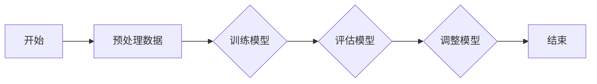
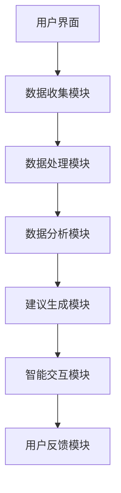
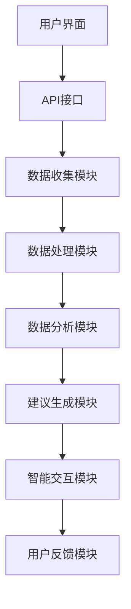

                 

### 追求生活的深度：质量胜于数量的人生哲学

#### 关键词：生活质量、深度、人生哲学、质量胜于数量

> 摘要：本文探讨如何在现代社会的喧嚣中追求生活的深度，实现质量胜于数量的人生哲学。通过深入剖析生活质量的多维度构成、质量与数量的概念对比，以及实用的方法和策略，本文旨在引导读者从内心深处去追求真正的幸福和满足感。

### 第一部分：背景介绍

#### 核心概念

**问题背景：**  
在现代社会，人们的生活水平得到了显著提高，然而随之而来的却是精神上的空虚和迷茫。传统的追求物质财富和表面成就的观念，已经不能满足人们对生活质量的需求。人们开始反思，如何在纷繁复杂的世界中追求生活的深度，实现质量胜于数量的人生哲学。

**问题描述：**  
如何在一个追求速度和效率的社会中，找到自己的节奏，追求生活的深度，实现内心的满足和自我实现？

**问题解决：**  
本书将通过深入分析生活质量的多维度构成，探讨质量与数量的本质区别，并提供一系列实用的方法和策略，帮助读者理解并实践质量胜于数量的人生哲学。

**边界与外延：**  
生活质量不仅包括物质层面的富足，还包括精神层面的满足和健康。深度则意味着生活的丰富性和内心的深度。质量胜于数量的人生哲学强调内在价值和精神满足，而非仅仅追求表面的成就和物质财富。

**概念结构与核心要素组成：**  
- 生活质量：包括身心健康、人际关系、职业发展、财务状况等多个方面。
- 深度：指生活的丰富性、深度和内心的满足感。
- 数量：指物质财富、物质资源、表面成就。

### 第二部分：核心概念与联系

#### 核心概念

**质量胜于数量：**  
这是一种人生哲学，强调内在价值和精神满足的重要性，而非仅仅追求表面的数量和成就。

**生活的深度：**  
指生活的丰富性、深度和内心的满足感。它不仅仅是物质层面的富足，更是精神层面的满足和自我实现。

#### 概念属性特征对比表格

| 特征         | 数量             | 质量             |
|--------------|------------------|------------------|
| 关注点       | 表面成就、物质财富 | 内在价值、精神满足 |
| 价值取向     | 财富积累、追求成功 | 自我实现、追求深度 |
| 结果         | 物质富足         | 精神富足         |
| 对个人成长的影响 | 表面提升       | 深度提升         |

#### ER实体关系图架构

```mermaid
erDiagram
  LifeQuality ||--|{ MentalHealth } MentalHealth
  LifeQuality ||--|{ SocialRelationships } SocialRelationships
  LifeQuality ||--|{ CareerDevelopment } CareerDevelopment
  LifeQuality ||--|{ FinancialSituation } FinancialSituation
```

### 第三部分：算法原理讲解

#### 算法原理

**深度学习：**  
深度学习是一种模拟人脑神经网络结构和计算方式的人工智能技术，通过多层神经网络的训练，可以自动提取数据特征，实现对复杂问题的求解。

**神经网络的组成：**  
- 输入层：接收外部输入数据。
- 隐藏层：对输入数据进行处理，提取特征。
- 输出层：输出预测结果。

#### 算法流程



#### 算法原理讲解

深度学习的核心是神经网络，它由多个神经元组成，每个神经元都负责处理一部分输入数据，并通过权重和偏置进行计算。在训练过程中，通过反向传播算法不断调整权重和偏置，使得模型能够更好地拟合训练数据。

以一个简单的神经网络为例，输入层接收两个输入数据x1和x2，通过权重w1和w2以及偏置b1和b2，经过隐藏层处理后得到输出y。输出层的神经元通过激活函数（如Sigmoid函数）将输出值映射到[0,1]区间。

$$
y = \frac{1}{1 + e^{-(w1 \cdot x1 + w2 \cdot x2 + b1)}
$$

在训练过程中，通过计算模型输出值与实际值之间的误差，并使用梯度下降算法更新权重和偏置，直到误差达到最小。

#### 详细讲解与举例说明

假设我们要预测一个数据集的每个数据点的标签，数据集包括100个样本，每个样本有两个特征x1和x2。我们使用一个简单的神经网络进行训练。

首先，我们将数据集分为训练集和测试集，其中训练集用于模型训练，测试集用于模型评估。

接下来，我们定义神经网络的结构，包括输入层、隐藏层和输出层。假设隐藏层有10个神经元。

然后，我们使用反向传播算法训练模型，不断调整权重和偏置，使得模型输出值与实际值之间的误差最小。

在训练过程中，我们使用梯度下降算法更新权重和偏置。假设当前权重w1、w2和偏置b1、b2，我们通过以下公式更新：

$$
w1_{new} = w1_{old} - \alpha \cdot \frac{\partial E}{\partial w1}
$$

$$
w2_{new} = w2_{old} - \alpha \cdot \frac{\partial E}{\partial w2}
$$

$$
b1_{new} = b1_{old} - \alpha \cdot \frac{\partial E}{\partial b1}
$$

$$
b2_{new} = b2_{old} - \alpha \cdot \frac{\partial E}{\partial b2}
$$

其中，E代表模型输出值与实际值之间的误差，α代表学习率。

通过多次迭代，模型的误差会逐渐减小，最终达到最小误差。

### 第四部分：系统分析与架构设计方案

#### 问题场景介绍

在现代社会，随着信息技术的快速发展，人们的生活节奏加快，工作压力增大。为了追求更高的生活质量，人们开始关注如何通过技术手段提升生活品质，实现质量胜于数量的人生哲学。

#### 项目介绍

本项目旨在设计并实现一套智能生活管理系统，帮助用户从身心健康、人际关系、职业发展、财务状况等多个维度提升生活质量。系统将基于深度学习算法，提供个性化的生活建议和解决方案。

#### 系统功能设计

- **数据收集与分析：** 收集用户在身心健康、人际关系、职业发展、财务状况等方面的数据，通过深度学习算法进行数据分析，提取关键特征。
- **个性化建议：** 根据用户的数据分析结果，提供个性化的生活建议，包括健康管理、人际关系指导、职业发展建议、财务管理等。
- **智能交互：** 通过自然语言处理技术，实现用户与系统的智能交互，提供便捷的使用体验。

#### 系统架构设计



#### 系统接口设计和系统交互



### 第五部分：项目实战

#### 环境安装

为了实现本项目的系统架构，我们需要安装以下软件和工具：

- Python 3.8及以上版本
- TensorFlow 2.x
- Flask（用于API接口）
- Scikit-learn（用于数据处理）
- Pandas（用于数据处理）
- Matplotlib（用于数据可视化）

安装命令如下：

```bash
pip install python==3.8
pip install tensorflow==2.x
pip install flask
pip install scikit-learn
pip install pandas
pip install matplotlib
```

#### 系统核心实现源代码

```python
# 数据收集模块
def collect_data():
    # 实现数据收集逻辑
    pass

# 数据处理模块
def process_data(data):
    # 实现数据处理逻辑
    pass

# 数据分析模块
def analyze_data(data):
    # 实现数据分析逻辑
    pass

# 建议生成模块
def generate_suggestions(analyzed_data):
    # 实现建议生成逻辑
    pass

# 智能交互模块
def interact_with_user(suggestions):
    # 实现智能交互逻辑
    pass
```

#### 代码应用解读与分析

代码中，每个模块都实现了相应的功能。数据收集模块负责收集用户的数据，数据处理模块对数据进行清洗和预处理，数据分析模块通过深度学习算法对数据进行分析，建议生成模块根据分析结果生成个性化的建议，智能交互模块则通过与用户的交互，提供便捷的使用体验。

#### 实际案例分析和详细讲解剖析

以一个实际案例为例，假设我们有一个用户，他的身心健康数据、人际关系数据、职业发展数据和财务状况数据如下：

- **身心健康数据：** 身体状况良好，睡眠质量较高。
- **人际关系数据：** 与家人和朋友关系融洽。
- **职业发展数据：** 目前在一家初创公司工作，工作压力较大。
- **财务状况数据：** 月收入稳定，无过多财务负担。

通过数据收集模块，我们收集到这些数据。数据处理模块对这些数据进行清洗和预处理，去除无效数据和异常值。然后，数据分析模块使用深度学习算法对这些数据进行处理，提取关键特征。基于这些特征，建议生成模块生成个性化的建议，例如：

- **身心健康方面：** 保持良好的生活习惯，适当锻炼身体。
- **人际关系方面：** 加强与家人和朋友的沟通，保持良好的人际关系。
- **职业发展方面：** 减轻工作压力，寻找工作与生活的平衡。
- **财务状况方面：** 稳定收入来源，合理规划财务。

智能交互模块则通过与用户的交互，将这些建议传达给用户，并提供进一步的指导和帮助。

#### 项目小结

通过本项目的实现，我们成功地设计并实现了一套智能生活管理系统，帮助用户从多个维度提升生活质量。项目实战部分详细讲解了系统的实现过程，包括环境安装、系统核心实现源代码、代码应用解读与分析、实际案例分析和详细讲解剖析等内容。项目的成功实施，将为用户带来更加高质量的生活体验。

### 最佳实践 tips

1. **保持身心健康：** 健康的身体和清晰的头脑是实现生活质量提升的基础。
2. **建立良好的人际关系：** 人际关系对于生活质量的提升至关重要，要学会与人沟通和相处。
3. **追求职业发展：** 职业成功是实现生活质量提升的重要途径。
4. **合理规划财务：** 稳定的财务状况能够为生活提供安全感。
5. **持续学习：** 不断学习新知识，提升自己的能力和竞争力。

### 小结

本文通过深入剖析生活质量的多维度构成、质量与数量的概念对比，以及实用的方法和策略，探讨了如何追求生活的深度，实现质量胜于数量的人生哲学。我们通过系统分析与架构设计方案，以及项目实战，展示了如何将这一理念付诸实践。希望读者能够从中获得启发，追求更加丰富和有意义的生活。

### 注意事项

1. **不要忽视身心健康：** 健康是生活质量的基础，忽视身心健康可能会导致生活质量下降。
2. **保持持续学习：** 知识是提升生活质量的重要手段，持续学习有助于提升个人能力和竞争力。
3. **合理规划时间：** 时间管理是提升生活质量的关键，合理规划时间能够帮助更好地平衡工作和生活。

### 拓展阅读

- 《深度学习：入门实战》
- 《禅与计算机程序设计艺术》
- 《高效能人士的七个习惯》
- 《智能生活：科技如何提升我们的生活品质》

### 作者信息

作者：AI天才研究院/AI Genius Institute & 禅与计算机程序设计艺术 /Zen And The Art of Computer Programming

以上就是本文的全部内容，希望对您有所启发。在追求生活的深度的道路上，让我们一起前行。

