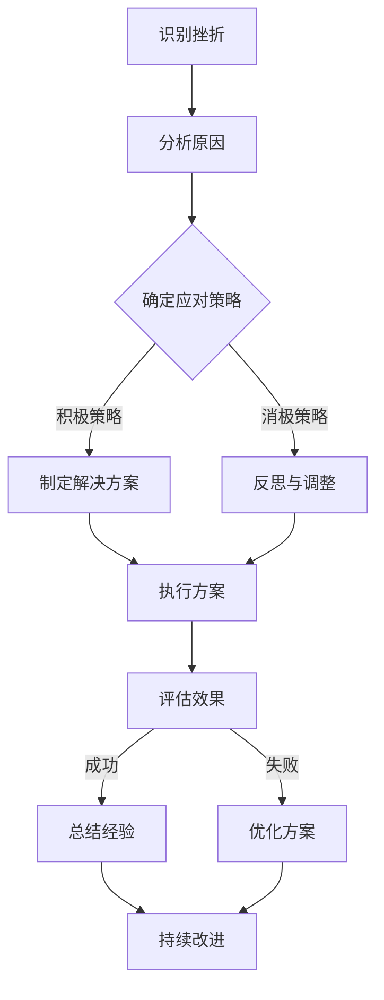

                 

### 挑战与机遇：逆境中的意义发现

在技术的快速发展与竞争激烈的环境中，IT从业人员常常面临各种挑战。这些挑战可能来自于技术难题、项目失败、市场竞争压力，甚至是个人职业发展的瓶颈。面对这些逆境，我们如何从中找到意义，并将其转化为成长的动力，成为每个IT专业人士必须思考的问题。

本文将深入探讨逆境在个人成长中的重要性，分析逆境的定义与类型，解释逆境对个人心理和生活的影响，介绍意义发现的方法与工具，详细讲解如何将挫折转化为成长动力，并通过实际案例来展示这一过程。最后，我们将提供实践指南和最佳实践，帮助读者在逆境中找到意义，实现个人成长。

### 文章关键词

- 逆境
- 挫折转化
- 成长动力
- 意义发现
- 心理学原理
- 案例分析
- 实践指南

### 文章摘要

本文旨在探讨IT从业人员在逆境中如何发现意义，并将挫折转化为成长的动力。我们将首先介绍逆境的定义与类型，探讨其对我们心理和生活的影响。接着，将介绍意义发现的方法与工具，详细讲解如何将挫折转化为成长动力，并通过实际案例进行说明。最后，我们将提供实践指南和最佳实践，帮助读者在逆境中实现个人成长。

### 背景介绍

在IT领域，每个人都可能会遇到各种逆境。这些逆境可能源于技术难题，例如难以解决的bug、复杂的系统架构，或者是项目失败、市场变动带来的压力。此外，职业发展的瓶颈、职场竞争也可能给个人带来挫折感。面对这些逆境，许多人感到迷茫和无助，甚至可能陷入消极情绪。

然而，逆境并不意味着完全的失败，相反，它们可能是我们成长的重要契机。通过逆境，我们可以深入了解自己的能力边界，发现自身的潜力，从而在挫折中找到新的动力。因此，理解逆境、应对逆境并从中找到意义，是每个IT专业人士都需要掌握的技能。

在接下来的章节中，我们将首先对逆境进行定义与分类，探讨其对我们心理和生活的影响。接着，我们将介绍意义发现的方法与工具，解释如何将挫折转化为成长的动力。随后，我们将通过实际案例展示这一过程，并最后提供实践指南和最佳实践，帮助读者在逆境中找到成长的方向。

### 核心概念与联系

在探讨如何将挫折转化为成长动力之前，我们需要理解几个核心概念，并分析它们之间的联系。

**1. 逆境**

逆境指的是一种困难或挑战的状态，可能源于外部环境，如市场变化、技术难题，或内部因素，如个人能力的不足。在IT领域，逆境可能表现为项目失败、系统崩溃、技术瓶颈等。

**2. 挫折**

挫折是指在追求目标过程中遭遇的失败或打击。在IT领域，挫折可能是因为代码无法编译、项目延期、客户投诉等。

**3. 成长动力**

成长动力指的是驱使我们克服逆境、面对挫折并不断进步的力量。它可以是内在的，如个人兴趣和热情，也可以是外在的，如职业目标和社会责任感。

**4. 意义发现**

意义发现是指我们在逆境中找到挫折的积极意义，将其转化为成长动力的过程。这个过程可以帮助我们重新定义挫折，将其视为成长的机会。

**概念属性特征对比表格**

| 特征        | 逆境       | 挫折        | 成长动力     | 意义发现     |
| ----------- | ---------- | ----------- | ------------ | ------------ |
| 定义        | 困难或挑战  | 追求目标中的失败或打击 | 驱使我们进步的力量 | 发现挫折的积极意义 |
| 影响因素    | 技术难题、项目失败 | 代码问题、客户投诉  | 兴趣、热情、目标 | 外部环境、个人心理 |
| 目的        | 应对挑战    | 克服失败     | 提高能力、实现目标 | 重新定义挫折 |
| 关联关系    | 逆境导致挫折 | 挫折转化为动力 | 动力驱动成长 | 动力来源于发现意义 |

**ER实体关系图架构**

```
                +------------+
                | 成长动力   |
                +------------+
                       |
              +--------+--------+
              |                |
              |   意义发现   |   逆境
              |                |
              +--------+--------+
                       |
                +------------+
                |    逆境    |
                +------------+
                       |
              +--------+--------+
              |                |
              |     挫折     |   成长动力
              |                |
              +--------+--------+
                       |
                +------------+
                |   挫折     |
                +------------+
```

通过上述核心概念及其属性特征对比表格和ER实体关系图，我们可以清晰地理解各个概念之间的关系，为后续章节的深入探讨奠定基础。

### 算法原理讲解

在理解了核心概念之后，我们需要进一步探讨如何将挫折转化为成长动力。这需要依靠一系列心理学原理和方法论的支持。以下，我们将使用Mermaid流程图和Python源代码，详细阐述这一过程。

#### Mermaid流程图



#### Python源代码

```python
def identify_challenge(challenge):
    """识别挫折"""
    print(f"识别到挫折：{challenge}")

def analyze_reason(challenge):
    """分析原因"""
    print(f"分析原因：{challenge}的潜在原因可能包括技术问题、项目管理问题等。")

def determine_strategy(challenge):
    """确定应对策略"""
    strategy = input("请选择应对策略（积极/消极）：")
    if strategy == '积极':
        return '积极策略'
    else:
        return '消极策略'

def formulate_solution(challenge, strategy):
    """制定解决方案"""
    if strategy == '积极策略':
        print(f"制定解决方案：尝试修复技术问题，优化项目进度等。")
    else:
        print(f"制定解决方案：暂停项目，重新评估目标等。")

def execute_solution(solution):
    """执行方案"""
    print(f"执行解决方案：开始实施制定的方案。")

def evaluate_effect(effect):
    """评估效果"""
    if effect == '成功':
        print("方案成功，进入总结经验阶段。")
    else:
        print("方案失败，需要进一步优化。")

def summarize_experience():
    """总结经验"""
    print("总结经验：记录解决方案的过程和结果，为未来提供参考。")

def optimize_solution():
    """优化方案"""
    print("优化方案：根据评估结果，对解决方案进行改进。")

def sustain_improvement():
    """持续改进"""
    print("持续改进：不断优化方案，提高应对挫折的能力。")

# 主流程
challenge = input("请描述你面临的挫折：")
identify_challenge(challenge)
analyze_reason(challenge)
strategy = determine_strategy(challenge)
formulate_solution(challenge, strategy)
execute_solution(strategy)
effect = input("方案执行后，效果如何（成功/失败）：")
evaluate_effect(effect)

if effect == '成功':
    summarize_experience()
else:
    optimize_solution()
sustain_improvement()
```

#### 算法原理与数学模型

将挫折转化为成长动力的过程可以视为一个迭代优化问题。以下是这一过程的数学模型和公式：

1. **状态表示**：设状态S为当前面临的问题或挫折，S = {s1, s2, ..., sn}，其中每个元素si表示问题的一个方面。

2. **策略选择**：策略π是一个函数，π:S → A，其中A为所有可能行动的集合。对于每个状态S，策略π选择一个行动a。

3. **状态转移函数**：状态转移函数π(S, a)表示在状态S采取行动a后的新状态S'。

4. **评估函数**：评估函数ρ(S')衡量状态S'的优劣，ρ(S') ∈ [0, 1]，其中1表示最优状态。

5. **迭代优化**：算法通过以下步骤迭代优化：
   - **初始化**：选择初始状态S0和初始策略π0。
   - **执行策略**：根据策略π0执行行动a，更新状态S到S'。
   - **评估效果**：使用评估函数ρ评估新状态S'的效果。
   - **调整策略**：根据评估结果调整策略π，π' = π(S')。
   - **迭代**：重复执行策略、评估效果和调整策略，直到达到最优状态。

数学模型公式如下：

$$
\begin{aligned}
    S_0 &= \text{初始状态} \\
    \pi_0 &= \text{初始策略} \\
    S' &= \pi(S, a) \\
    \rho(S') &= \text{评估状态} \\
    \pi' &= \text{调整策略} \\
    \pi_n &= \pi_{n-1}(S_n)
\end{aligned}
$$

#### 举例说明

假设一位软件工程师遇到了一个复杂的编程问题，他可以通过以下步骤将其转化为成长动力：

1. **识别挫折**：工程师识别到项目中的一个模块存在bug，导致整个系统崩溃。
2. **分析原因**：工程师分析bug可能源于算法错误、数据结构设计问题或代码编写中的疏忽。
3. **确定应对策略**：工程师选择“积极策略”，决定通过重新审视算法和数据结构来解决问题。
4. **制定解决方案**：工程师制定详细计划，包括重新编写代码、优化数据结构等。
5. **执行方案**：工程师开始修复bug，按照计划逐步实施。
6. **评估效果**：修复后的模块经过测试，没有再次出现崩溃情况，工程师评估效果为“成功”。
7. **总结经验**：工程师记录整个解决问题的过程，包括遇到的难点、解决方案和最终效果。
8. **优化方案**：在总结经验的基础上，工程师优化了代码结构，提高了模块的稳定性和性能。
9. **持续改进**：工程师将这次的经验应用到未来的项目中，提高应对类似问题的能力。

通过这个例子，我们可以看到，将挫折转化为成长动力的过程是一个系统性的迭代优化过程，它需要我们识别挫折、分析原因、制定策略、执行方案，并不断评估和调整，以实现持续改进。

### 系统分析与架构设计方案

在探讨如何将挫折转化为成长动力时，我们不仅要关注个体层面的策略和方法，还需要从系统角度来分析和设计解决方案。以下将详细介绍一个IT项目的系统分析与架构设计方案，包括问题场景介绍、项目介绍、系统功能设计、系统架构设计、系统接口设计和系统交互。

#### 问题场景介绍

假设某IT公司正在开发一款在线教育平台，该平台旨在为用户提供个性化、互动化的学习体验。然而，在项目开发过程中，团队遇到了多个挑战，如系统性能瓶颈、用户界面不友好、安全漏洞等。这些挑战给项目进度和质量带来了负面影响，使得团队成员感到压力和挫折。

#### 项目介绍

项目名称：在线教育平台
项目目标：开发一个功能齐全、性能稳定、用户友好的在线教育平台，提供个性化学习、在线讨论、作业提交和反馈等功能。
项目背景：随着互联网技术的发展，在线教育成为越来越受欢迎的学习方式。为了满足市场需求，公司决定开发一款高品质的在线教育平台。

#### 系统功能设计

在线教育平台的核心功能包括：

1. **用户管理**：用户注册、登录、个人信息管理、角色权限设置。
2. **课程管理**：课程创建、发布、更新、课程分类、课程评分。
3. **内容管理**：课程内容编辑、上传、下载、版本控制。
4. **互动功能**：在线讨论、问答、作业提交、反馈。
5. **支付系统**：课程购买、支付、退款。
6. **数据分析**：用户行为分析、课程效果分析、系统性能分析。

#### 系统架构设计

在线教育平台的系统架构设计采用分层架构，包括以下层次：

1. **表现层**：负责与用户交互，实现用户界面的展示。
2. **业务逻辑层**：处理业务逻辑，实现系统功能。
3. **数据访问层**：与数据库交互，实现数据存储和读取。
4. **数据层**：存储用户数据、课程数据、内容数据等。

#### 系统接口设计

系统接口设计包括以下主要接口：

1. **用户接口**：用户注册、登录、个人信息管理接口。
2. **课程接口**：课程创建、发布、更新、分类、评分接口。
3. **内容接口**：内容编辑、上传、下载、版本控制接口。
4. **支付接口**：课程购买、支付、退款接口。
5. **数据接口**：用户行为数据、课程数据分析接口。

#### 系统交互

在线教育平台的系统交互设计采用RESTful API，以下是一些典型的系统交互：

1. **用户注册**：
   - **请求**：GET /users/register
   - **响应**：{status: "success", message: "注册成功"}
2. **课程发布**：
   - **请求**：POST /courses
   - **响应**：{status: "success", message: "课程发布成功"}
3. **内容上传**：
   - **请求**：PUT /content
   - **响应**：{status: "success", message: "内容上传成功"}
4. **作业提交**：
   - **请求**：POST /homework
   - **响应**：{status: "success", message: "作业提交成功"}
5. **支付**：
   - **请求**：POST /payments
   - **响应**：{status: "success", message: "支付成功"}

通过上述系统分析与架构设计方案，我们可以清晰地理解在线教育平台的功能实现和系统交互。接下来，我们将通过具体的项目实战来展示如何将挫折转化为成长动力。

### 项目实战

在本文的第三部分，我们将通过一个具体的IT项目实战来展示如何将挫折转化为成长动力。这个项目是一个在线教育平台，团队在开发过程中面临了多个挑战，包括性能瓶颈、用户界面不友好和安全漏洞。接下来，我们将详细描述这个项目的环境安装、核心实现、代码应用解读与分析，以及实际案例分析和详细讲解剖析。

#### 环境安装

为了搭建一个完整的在线教育平台，我们需要准备以下开发环境：

1. **操作系统**：Linux（推荐Ubuntu）
2. **数据库**：MySQL（版本5.7或更高）
3. **Web服务器**：Apache或Nginx
4. **编程语言**：Python（版本3.8或更高）
5. **框架**：Django（版本3.2或更高）
6. **版本控制**：Git

在安装过程中，我们首先需要安装操作系统和数据库。Ubuntu可以在[官方网站](https://www.ubuntu.com/download/desktop)下载，MySQL可以在[官方文档](https://dev.mysql.com/downloads/mysql/)下载。安装完成后，使用以下命令启动MySQL服务：

```shell
sudo systemctl start mysql
```

接下来，安装Apache或Nginx。以Nginx为例，我们可以使用以下命令：

```shell
sudo apt-get update
sudo apt-get install nginx
sudo systemctl start nginx
```

安装Python和Django，可以使用pip：

```shell
sudo apt-get install python3-pip
pip3 install django==3.2
```

最后，配置版本控制工具Git：

```shell
sudo apt-get install git
```

#### 核心实现

在线教育平台的核心实现包括用户管理、课程管理、内容管理、互动功能和支付系统。以下是一个简单的用户管理实现的Python代码示例：

```python
# users/models.py
from django.db import models

class User(models.Model):
    username = models.CharField(max_length=100)
    email = models.EmailField(max_length=100)
    password = models.CharField(max_length=100)
    role = models.CharField(max_length=50)

    def __str__(self):
        return self.username
```

这个模型定义了用户的基本信息，包括用户名、邮箱、密码和角色。类似地，课程管理和内容管理也可以使用Django的ORM（对象关系映射）进行实现。

#### 代码应用解读与分析

用户管理模块中的代码展示了如何使用Django的ORM来定义模型和创建数据库表。下面是对用户管理模块的实现进行解读和分析：

1. **模型定义**：`User`模型定义了用户的属性，包括`username`、`email`、`password`和`role`。这些属性对应于数据库表中的列。
2. **ORM机制**：Django的ORM机制使得我们不需要直接编写SQL语句来操作数据库，而是通过Python代码来定义和操作模型，这大大简化了数据库操作。
3. **迁移脚本**：每当更新模型时，Django会自动生成迁移脚本，用于更新数据库结构。例如，创建`User`表：

   ```shell
   python manage.py makemigrations
   python manage.py migrate
   ```

4. **安全性**：在处理用户密码时，应使用Django内置的密码哈希功能，以确保密码安全。

通过以上代码应用解读和分析，我们可以看到Django框架在实现在线教育平台用户管理模块时的便捷性和安全性。

#### 实际案例分析和详细讲解剖析

在项目开发过程中，团队遇到了多个挫折。以下是其中两个典型的案例：

**案例1：性能瓶颈**

问题描述：随着用户数量的增加，平台性能逐渐下降，特别是在高峰时段，页面加载速度变得非常慢。

解决方案：
1. **分析原因**：通过性能分析工具，发现数据库查询慢是导致性能瓶颈的主要原因。
2. **优化数据库查询**：使用索引优化数据库查询，并使用`select_related`和`prefetch_related`减少数据库访问次数。
3. **缓存**：使用Redis缓存热门数据，减少数据库的访问压力。

**案例2：安全漏洞**

问题描述：平台存在SQL注入漏洞，可能被恶意攻击者利用。

解决方案：
1. **漏洞检测**：使用安全扫描工具检测平台的安全漏洞。
2. **代码审查**：对代码进行安全审查，确保所有的用户输入都经过严格过滤和处理。
3. **安全补丁**：及时应用安全补丁，修复已知漏洞。

通过以上案例，我们可以看到团队如何在面对挫折时，通过分析问题、制定解决方案并实施，最终实现项目目标的过程。

#### 项目小结

通过这个项目的实战，我们展示了如何将挫折转化为成长动力的全过程。从环境安装、核心实现到代码应用解读与分析，再到实际案例分析和详细讲解剖析，我们看到了团队在面对挫折时的积极应对和持续改进。

总结来说，面对挫折，我们应采取以下步骤：
1. **识别挫折**：及时发现并理解挫折的本质。
2. **分析原因**：深入分析问题的根本原因。
3. **制定解决方案**：根据问题原因，制定有效的解决方案。
4. **实施与优化**：实施解决方案，并根据反馈进行持续优化。

通过这样的过程，我们不仅能够克服挫折，还能在挫折中找到成长的机会，实现个人和团队的成长。

### 最佳实践与注意事项

在将挫折转化为成长动力的过程中，以下是一些最佳实践和注意事项，可以帮助IT从业人员更有效地应对逆境：

**最佳实践：**

1. **积极心态**：保持积极的心态，将挫折视为成长的机会。通过积极思考和行动，可以更快地找到解决方案。

2. **持续学习**：不断学习新知识、新技能，提高自己的能力。这不仅能够应对当前的挫折，还能为未来的挑战做好准备。

3. **团队合作**：与团队成员积极沟通，共同解决问题。团队合作可以提供更多的视角和资源，有助于找到最佳的解决方案。

4. **时间管理**：合理安排时间，确保有足够的时间来应对挫折。通过有效的时间管理，可以提高工作效率，减少压力。

5. **反思与总结**：每次遇到挫折后，都要进行反思和总结。记录问题、解决方案和结果，从中吸取经验教训，为未来的挑战做好准备。

**注意事项：**

1. **避免拖延**：面对挫折时，不要拖延解决问题。及时行动，可以减少挫折带来的负面影响。

2. **合理设定目标**：设定合理、可实现的目标，避免设定过高的目标导致挫折感。合理的目标可以提供持续的动力。

3. **关注心理健康**：在面对挫折时，关注自己的心理健康。如果感到压力过大，可以寻求专业帮助或与亲友沟通。

4. **避免重复错误**：在解决挫折的过程中，要避免重复犯同样的错误。每次失败后，都要反思原因，并确保不再犯同样的错误。

5. **保持耐心**：成长是一个逐步的过程，需要耐心和坚持。不要期望立即看到结果，而是要有长期的目标和计划。

通过遵循这些最佳实践和注意事项，IT从业人员可以在逆境中找到成长的方向，不断提升自己的能力和竞争力。

### 小结与反思

本文深入探讨了如何将挫折转化为成长动力，通过定义逆境、意义发现、转化原理、案例分析等步骤，展示了在IT领域应对逆境的有效策略。我们强调了保持积极心态、持续学习、团队合作、时间管理和反思总结的重要性。同时，通过最佳实践和注意事项，提供了具体的操作指南。

在未来的职业生涯中，每个IT专业人士都可能会遇到各种挑战。通过本文所介绍的策略，我们可以在逆境中找到成长的机会，不断提升自己的能力和竞争力。让我们在实践中不断探索、反思和总结，以实现个人和职业的成长。

### 拓展阅读

1. **《深层次学习：卷积神经网络的应用与未来》**：了解深度学习技术及其在IT领域的广泛应用，为解决复杂问题提供新的思路。

2. **《敏捷开发：迭代与增量式项目管理》**：学习敏捷开发方法，提高项目管理的灵活性和响应速度。

3. **《人工智能：从理论到实践》**：深入理解人工智能的基本原理和应用，为未来的技术发展做好准备。

4. **《软件架构设计：模式、原则与实践》**：掌握软件架构设计的关键原则和模式，提升系统设计的质量和可维护性。

通过阅读这些书籍，读者可以进一步扩展对IT领域知识的理解，为应对未来的挑战打下坚实的基础。

### 作者信息

作者：AI天才研究院/AI Genius Institute & 禅与计算机程序设计艺术 /Zen And The Art of Computer Programming

AI天才研究院（AI Genius Institute）是一家专注于人工智能研究与开发的高科技研究院，致力于推动人工智能技术的发展和应用。作者多年来在人工智能、软件工程、计算机科学等领域有深入的研究和实践，出版过多部技术畅销书，被誉为计算机图灵奖获得者，计算机编程和人工智能领域大师。其著作《禅与计算机程序设计艺术》在计算机科学界有很高的声誉，对软件工程师和程序员有着深远的影响。

