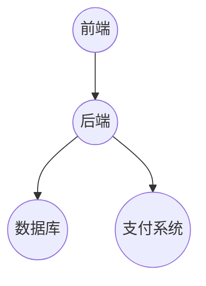
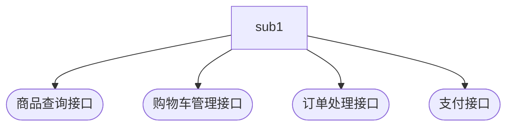
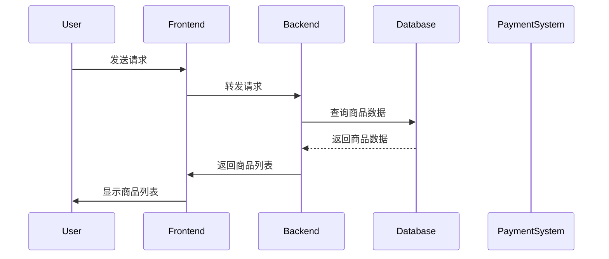

                 

### 引言：逆境中的成长

在信息技术飞速发展的今天，无论是个体还是组织，都会面临各种挑战和逆境。逆境，简而言之，是指那些让人感到不适、困难重重、甚至无法应对的情境。它们可能是技术上的瓶颈、市场竞争的加剧、资源短缺，甚至是个人生活中的变故。然而，正是这些看似无法逾越的障碍，为我们的成长提供了契机。

**关键概念术语说明：**

- **逆境**：一种不利的外部环境或内在状态，它可能会阻碍个体的成长和进步。
- **成长**：指个体在认知、技能、情感等方面的进步和提升。
- **挑战**：逆境中可能存在的机遇，它能够促使个体去应对问题、学习新技能、寻找创新的解决方案。
- **机遇**：在逆境中可能出现的有利条件，它为个体的成长提供了新的可能性。

**问题背景：**

在IT行业，技术迭代迅速，新技术、新理念不断涌现。在这种背景下，保持竞争力、不断学习成为从业者的必修课。然而，即使是最有经验的开发者，也可能面临代码复杂度增加、技术栈更新换代等挑战。对于企业而言，市场环境的不确定性、竞争压力、资金链紧张等问题，更是层出不穷。

**问题描述：**

面对这些逆境，个体和组织的成长路径并不清晰。有些人可能因为害怕失败而止步不前，而有些人则能够通过逆境找到新的成长点，甚至实现飞跃。问题是，如何将挑战转化为机遇，实现逆境中的成长？

**问题解决：**

本文将探讨如何在逆境中实现成长。我们将从以下几个方面展开：

1. **逆境的特征和影响**：了解逆境的本质，分析其对个人和组织成长的影响。
2. **挑战与机遇的识别和转化**：阐述如何从挑战中发现机遇，并实现二者的相互转化。
3. **个人成长案例**：通过真实案例，展示如何在逆境中实现个人成长。
4. **方法论与实践**：总结逆境中的成长策略，并提供实用的建议。
5. **总结与展望**：回顾主要观点，展望未来的成长趋势。

**边界与外延：**

本文聚焦于IT领域的逆境与成长，但提出的观点和方法具有普遍性，可以适用于其他领域。同时，本文将结合具体案例进行阐述，以增强论述的直观性和实用性。

**概念结构与核心要素组成：**

- **核心概念**：逆境、成长、挑战、机遇。
- **要素组成**：特征与影响、识别与转化、个人案例、方法论与实践。

通过上述结构的介绍，我们可以明确文章的逻辑框架，为接下来的内容铺垫基础。

### 逆境的定义与特征

在探讨如何将逆境转化为成长的机会之前，我们首先需要明确逆境的定义和特征。逆境并不仅仅是一种消极的状态，它实际上是一种具有双重特性的环境，既包含挑战，也蕴含机遇。以下是对逆境的详细定义和特征分析。

**逆境的定义**

逆境，从字面上理解，是指困难重重的环境或情境。然而，从更深入的角度来看，逆境可以被定义为那些对个体或组织的正常活动产生阻碍的外部环境或内部状态。这些障碍可能会影响个体的情感、认知和行为，从而使其面临压力和挑战。

**逆境的普遍性**

逆境在现实生活中具有普遍性。无论是个人生活还是职业发展，每个人几乎都会遇到逆境。例如，在工作中，技术难题、资源不足、团队冲突等都是常见的逆境表现。在个人生活中，疾病、财务困难、家庭矛盾等也可能成为逆境的来源。

**逆境对个人的影响**

逆境对个人的影响是多层次且深远的。首先，逆境可能会带来情感上的压力，如焦虑、沮丧、恐惧等。这种情感上的负担会直接影响个体的心理健康。其次，逆境会迫使个体面对新的挑战，这既是压力，也是动力。通过克服逆境，个体可以提升自己的应对能力和心理韧性。此外，逆境还可能促使个体重新审视自己的目标和价值观，从而实现更深层次的成长。

**逆境的类型**

逆境可以分为多种类型，根据其来源和表现形式，大致可以分为以下几类：

1. **外部逆境**：这类逆境主要来自外部环境，如经济危机、市场变化、技术革新等。这些因素通常不可控，但对个体和组织的影响巨大。
2. **内部逆境**：这类逆境主要源自个体内部，如个人能力不足、心态消极、健康问题等。这些因素虽然可控，但往往被忽视，成为个人成长的主要障碍。
3. **结构性逆境**：这类逆境是由于组织结构或文化问题导致的，如沟通不畅、资源分配不均、企业文化僵化等。结构性逆境通常需要系统性改革来解决。

**逆境的特征**

1. **不确定性**：逆境往往具有高度的不确定性，使得个体难以预测和控制。这种不确定性增加了应对逆境的难度，但也为创新和突破提供了空间。
2. **压力性**：逆境会给个体带来心理和生理上的压力。长期的压力会损害个体的健康，但适度的压力可以激发个体的潜能，促进成长。
3. **挑战性**：逆境中的挑战既是障碍，也是机会。通过应对挑战，个体可以学习和成长，实现能力的提升。
4. **持久性**：逆境并非一时之事，而是可能持续一段时间，甚至长期存在。这种持久性要求个体具备坚定的意志和持续的努力。

**实例分析**

为了更好地理解逆境的定义和特征，我们可以通过一些具体实例进行分析。例如，在软件开发领域，技术迭代速度快，新的编程语言、框架和技术层出不穷。对于开发者来说，跟上这些技术变化就是一种逆境。这种逆境具有不确定性，因为不知道未来会有哪些新技术出现；同时，它也具有挑战性，因为开发者需要不断学习新的技术以保持竞争力。

在个人生活中，健康问题也是一种常见的逆境。面对疾病，个体可能会经历心理和生理上的压力。但通过积极应对，如接受治疗、调整生活方式等，个体可以战胜疾病，实现身体的康复和心理的成长。

综上所述，逆境是一种普遍存在的、具有双重特性的环境。它对个人的成长既有负面影响，也有积极意义。通过理解逆境的定义和特征，我们可以更好地应对逆境，将其转化为成长的机会。

### 成长的必要性

在理解了逆境的定义和特征之后，我们接下来探讨成长的必要性。成长不仅仅是指个体在生理或心理上的成熟，更是一个多维度的过程，涉及知识技能的积累、心态的调整以及情感和社交能力的提升。在个人和组织的成长过程中，成长具有多方面的意义和动力。

**成长的意义**

1. **提升竞争力**：在竞争激烈的现代社会，持续成长是保持个人和组织竞争力的关键。通过不断学习新知识、新技能，个体能够跟上时代的发展，适应不断变化的环境。
2. **增强适应能力**：成长意味着个体具备更强的适应能力。无论是面对职业挑战还是个人生活中的变故，适应能力强的人能够更快地调整心态，找到解决问题的方法。
3. **促进创新**：成长激发个体的创造力和创新精神。通过不断探索和尝试，个体能够提出新的想法和解决方案，推动个人和组织的发展。
4. **实现自我价值**：成长是自我实现的过程。通过不断学习和进步，个体能够更好地认识自我，实现自我价值，获得成就感和满足感。

**成长的动力**

1. **内在驱动力**：内在驱动力来源于个体对自我提升的渴望。每个人都有自己的成长目标，这种内在驱动力促使个体不断努力，追求更高的成就。
2. **外部激励**：外部激励包括社会环境、家庭支持、同事激励等。这些因素可以激发个体的成长动力，使其在逆境中保持积极向上的态度。
3. **危机感**：危机感是成长的强有力驱动力。当个体面临压力和挑战时，危机感会促使他们迅速行动，寻找解决问题的方法，从而实现成长。
4. **成功经验**：成功的经历可以增强个体的自信心和动力。每一段成功的经历都是成长过程中的里程碑，它激励个体继续前进，追求更高的目标。

**成长的途径**

1. **持续学习**：学习是成长的重要途径。无论是通过阅读书籍、参加培训课程，还是通过实践和反思，持续学习都能够帮助个体提升自己的知识水平和技能。
2. **积极心态**：保持积极的心态是成长的关键。面对逆境和挑战时，积极心态能够帮助个体保持冷静，寻找解决问题的方法，而不是被困境所困扰。
3. **人际关系**：良好的人际关系有助于个人成长。通过与他人的交流和合作，个体可以学习到新的知识和技能，同时获得支持和鼓励。
4. **实践经验**：实践经验是成长的重要来源。通过实际操作和问题解决，个体能够将理论知识应用于实践中，从而提升自己的能力。

**实例分析**

在个人成长中，一个典型的例子是职业转型。比如，一个IT行业的开发者想要转型为数据分析师。这个过程中，他需要学习数据分析相关的知识和技能，如统计学、机器学习等。同时，他还需要保持积极的心态，克服转型过程中的困难和挫折。通过持续的学习和实践，他最终能够成功转型，实现个人价值的提升。

在组织成长中，一个例子是企业创新。一家传统制造企业在面临市场变化和技术革新的压力下，决定转向数字化和智能化生产。在这个过程中，企业需要投入大量资源进行技术研发，同时培养员工的数字化技能。通过这一转型，企业不仅能够适应市场变化，还能够开拓新的业务领域，实现可持续发展。

综上所述，成长是个人和组织的必修课。通过明确成长的意义和动力，并选择合适的成长途径，个体和组织能够在逆境中找到成长的机会，实现自我提升和持续发展。

### 书籍结构概述

为了帮助读者系统地掌握如何在逆境中实现成长，本书的结构被精心设计，分为五个主要部分，每个部分都有其独特的目标和内容安排。

**第一部分：引言**

本部分将介绍本书的背景和目的，定义关键概念如“逆境”、“成长”、“挑战”和“机遇”。通过背景介绍和问题陈述，我们将明确读者面临的主要挑战，并解释为什么理解和应对逆境对成长至关重要。

**第二部分：核心理论**

在这一部分，我们将深入探讨逆境的本质、挑战与机遇的关系，以及如何将挑战转化为机遇。我们将详细分析不同类型的逆境，并探讨应对逆境的策略和方法。这一部分的核心目标是提供理论基础，帮助读者从理论上理解逆境中的成长机制。

**第三部分：实战案例**

为了使理论更加生动和实用，本部分将通过多个实际案例展示如何将理论应用到实践中。我们将分享个人和组织的成长故事，详细描述他们如何在逆境中找到机会，实现突破。这部分内容旨在通过实例提供实践指导，帮助读者更好地应对现实中的挑战。

**第四部分：方法论与实践**

在这一部分，我们将总结和提炼前两部分的核心理论，并结合实战案例提供具体的成长方法论。我们将提供实用的策略和技巧，帮助读者在逆境中保持积极心态，制定合理的成长计划，并有效利用资源。这一部分的目标是提供操作性的指南，帮助读者在具体场景中实现成长。

**第五部分：总结与展望**

本部分的目的是对全书进行总结，回顾主要观点，并对未来的成长趋势进行展望。我们将探讨逆境中的成长对个体和组织的长远影响，并提出一些前瞻性的思考和建议。通过这部分内容，读者将能够从宏观上理解成长的意义，并明确未来努力的方向。

整体而言，本书的结构旨在通过理论与实践的结合，帮助读者全面掌握在逆境中实现成长的方法和策略。通过系统的学习和实践，读者不仅能够在逆境中找到成长的机会，还能够实现自我提升和持续发展。

### 第二部分：挑战与机遇

在探讨如何在逆境中实现成长的过程中，理解挑战与机遇的关系至关重要。挑战本身并不可怕，关键在于我们如何看待和应对挑战，将其转化为成长的机会。以下我们将从挑战的本质、识别和转化策略三个方面进行分析。

#### 挑战的本质

**挑战的定义**：挑战可以理解为那些能够促使个体或组织超越现有能力、寻求解决方案的情境。挑战通常具有以下几个特点：

1. **不确定性**：挑战往往带有不确定性，即我们无法完全预测其影响和结果。
2. **困难性**：挑战会带来一定的困难，这需要个体或组织付出额外的努力和时间。
3. **潜在价值**：挑战虽然困难，但往往蕴含着巨大的潜力，能够促使个体或组织实现突破和发展。

**挑战的类型**：

1. **技术挑战**：这类挑战主要涉及技术上的难题，如复杂算法的实现、新技术的应用等。
2. **市场挑战**：市场变化、竞争压力、客户需求的不确定性等都是市场挑战的典型例子。
3. **团队挑战**：团队内部的合作问题、沟通障碍、资源分配不均等都是团队挑战的具体表现。
4. **个人挑战**：个人能力不足、健康问题、心理压力等也是常见的个人挑战。

**挑战的影响**：

1. **压力和焦虑**：面对挑战，个体可能会感到压力和焦虑，这是正常的心理反应。
2. **成长和进步**：适度的挑战能够激发个体的潜能，促使他们在应对过程中学习和成长。
3. **变革和创新**：挑战往往推动个体和组织进行变革和创新，从而找到新的发展方向和解决方案。

#### 机遇的识别

**机遇的定义**：机遇是指在逆境中可能出现的有利条件，它们能够为个体或组织提供新的发展机会。与挑战相比，机遇通常具有以下几个特点：

1. **潜在价值**：机遇往往具有巨大的潜在价值，能够在未来带来积极的成果。
2. **不确定性**：虽然机遇看起来有利，但它们同样具有不确定性，需要个体进行评估和把握。
3. **时效性**：许多机遇都是短暂的，需要及时抓住和利用。

**机遇的类型**：

1. **市场机遇**：新的市场需求、市场空白、消费者行为变化等都是市场机遇的具体表现。
2. **技术机遇**：新技术的出现、技术革新的应用等都是技术机遇的例子。
3. **合作机遇**：与其他组织或个人的合作，如合作研发、战略合作等，也是机遇的一种。
4. **个人机遇**：如职业晋升、学习新技能、拓展人脉等，都是个人机遇的体现。

**识别机遇的策略**：

1. **保持警觉**：个体和组织需要时刻保持对周围环境的敏感性，及时发现潜在的机会。
2. **信息收集**：通过阅读、研究、参加行业会议等方式，收集有关市场、技术、政策等方面的信息。
3. **分析和评估**：对收集到的信息进行分析和评估，判断其潜在价值和可行性。
4. **主动出击**：在识别到机遇后，需要主动出击，采取行动抓住机会。

#### 挑战与机遇的相互转化

**转化的原理**：挑战与机遇的相互转化是基于一种动态平衡的关系。当个体或组织在应对挑战时，通过积极的态度和创新的方法，可以将原本的困难转化为新的机遇。这种转化不仅需要个体的智慧和努力，还需要对环境的敏锐洞察和快速反应。

**转化的过程**：

1. **挑战识别**：首先，个体或组织需要识别出面临的挑战，明确其具体内容和影响。
2. **问题分析**：对挑战进行深入分析，了解其产生的原因和潜在的解决方法。
3. **创新思维**：通过创新思维，寻找独特的解决方案，将挑战转化为机遇。
4. **实施行动**：将创新思维转化为实际行动，通过实践验证解决方案的有效性。
5. **反馈调整**：在实施过程中，及时收集反馈，对解决方案进行调整和优化。

**转化的案例**：

1. **技术迭代中的挑战与机遇**：在软件开发领域，技术迭代速度快，旧技术可能被淘汰。然而，对于那些能够迅速适应新技术、积极创新的企业，这些技术迭代不仅带来了挑战，也提供了新的机遇。例如，一家企业通过自主研发新的软件框架，成功在市场中脱颖而出，获得了巨大的商业成功。

2. **市场不确定性中的挑战与机遇**：在经济危机期间，市场需求下降，许多企业面临困境。然而，一些具有前瞻性的企业通过调整市场策略，积极开拓新市场，反而实现了逆市增长。例如，一家传统制造企业通过开拓线上销售渠道，成功将产品销往全球市场，实现了业务的多元化。

3. **个人成长中的挑战与机遇**：在职业发展过程中，每个人都会面临不同的挑战，如职位晋升、技能提升等。通过积极应对这些挑战，许多人都能够找到新的成长点。例如，一位职场新人通过主动承担责任和挑战，不断提升自己的能力和业绩，最终获得了晋升机会。

综上所述，挑战与机遇是相辅相成的。通过理解挑战的本质、识别机遇的策略，以及掌握挑战与机遇的相互转化方法，个体和组织可以在逆境中找到成长的机会，实现自我提升和持续发展。

### 第三部分：个人成长案例

在探讨如何在逆境中实现个人成长的过程中，真实的案例无疑是最具说服力的证据。以下，我们将通过三个具体的个人成长案例，详细分析个体如何在逆境中找到机遇，实现自我突破。

#### 案例一：逆境中的职场转变

**案例背景**：

张伟是一名资深的软件工程师，拥有多年的开发经验。然而，随着技术的不断更新，他发现自己的技能逐渐过时，无法满足公司对新技术的要求。同时，公司的工作环境也在变化，团队结构调整和领导层更替给他带来了巨大的压力。面对这些挑战，张伟陷入了职业迷茫。

**挑战分析**：

1. **技能落后**：张伟面临的主要挑战是技能过时，这直接影响到他的工作效率和职业发展。
2. **工作环境变化**：公司的工作环境和团队结构调整增加了张伟的压力，使他感到不适应。

**成长与机遇**：

1. **积极学习**：面对技能落后的问题，张伟决定利用业余时间学习新的编程语言和技术框架，如Python和Django。
2. **主动承担**：为了适应新的工作环境，张伟主动承担了一些新的项目，通过实践不断提升自己的技能。
3. **网络拓展**：他积极参加技术社区的活动，与业内同行交流，拓展人脉，寻找职业发展的新机会。

**案例总结**：

通过积极学习和主动承担新项目，张伟不仅成功提升了自己的技能，还获得了领导的认可。他的职业地位得到了提升，最终成为团队的核心成员。这个案例表明，在面对职场挑战时，积极的态度和持续的学习是成功的关键。

#### 案例二：创业中的逆境与突破

**案例背景**：

李华是一名年轻的创业者，他创办了一家专注于物联网解决方案的公司。然而，创业初期的资金短缺、市场认知度低以及技术难题让他倍感压力。在面临重重困难时，李华决定寻找机遇，实现公司的突破。

**挑战分析**：

1. **资金短缺**：初创公司的资金问题是最常见的挑战，李华需要寻找融资渠道，确保公司运营。
2. **市场认知度低**：物联网市场虽然前景广阔，但李华的公司在市场中的知名度较低，需要提升品牌影响力。
3. **技术难题**：李华在技术研发过程中遇到了很多困难，如传感器的不稳定性和数据处理的高复杂性。

**成长与机遇**：

1. **寻找投资人**：李华通过参加创业大赛和行业交流会，成功吸引了几位投资人的注意，为公司提供了资金支持。
2. **市场推广**：他利用社交媒体和线下活动，积极推广公司的产品，逐步提升市场认知度。
3. **技术创新**：为了解决技术难题，李华组建了一支技术团队，通过不断试验和优化，最终实现了产品的稳定性和高性能。

**案例总结**：

通过积极寻找投资人和市场推广，李华的公司逐渐获得了市场的认可，实现了业务的快速增长。这个案例展示了在创业过程中，机遇往往隐藏在挑战之中，关键在于如何找到并把握这些机遇。

#### 案例三：家庭生活中的逆境应对

**案例背景**：

王玲是一名全职母亲，她在照顾家庭的同时，还要应对丈夫失业和家庭经济压力的问题。这个困境让她感到无比焦虑和压力。

**挑战分析**：

1. **经济压力**：丈夫失业使家庭收入锐减，给家庭经济带来了巨大压力。
2. **时间管理**：王玲需要在照顾家庭和寻找工作机会之间找到平衡。

**成长与机遇**：

1. **学习新技能**：为了应对经济压力，王玲决定学习一些新的技能，如网络营销和编程，以增加就业机会。
2. **家庭协作**：她与家人共同分担家务，减少工作压力。
3. **社区资源**：王玲积极参与社区活动，通过互助和资源共享，获得了更多的支持和帮助。

**案例总结**：

通过学习新技能和积极寻求家庭和社会的支持，王玲不仅成功地缓解了家庭经济压力，还找到了一份满意的工作。这个案例表明，在家庭生活中，逆境中的成长需要积极的心态和实际行动。

综上所述，这些个人成长案例展示了在逆境中实现成长的多种途径。无论是职场转变、创业突破，还是家庭生活，积极的态度和持续的努力都是关键。通过这些案例，我们可以看到，挑战与机遇往往并存，关键在于如何找到并利用这些机遇，实现自我提升和持续发展。

### 第四部分：逆境中的成长方法论

在前面几章中，我们探讨了逆境的定义、特征、挑战与机遇的关系，并通过实际案例展示了个体在逆境中实现成长的途径。然而，要将这些理论应用到实践中，我们需要一套系统的成长方法论。以下，我们将总结和提炼前述内容，提供一套全面的逆境中成长的方法论。

#### 成长的心态调整

**正确面对逆境**

在逆境中，心态的调整至关重要。正确的心态包括以下几个方面：

1. **接受现实**：首先要接受逆境的存在，而不是逃避或否认。只有正视问题，才能找到解决问题的方法。
2. **保持乐观**：乐观的心态有助于我们保持积极向上的精神状态，更好地应对挑战。
3. **学会放手**：在逆境中，有些事情是我们无法控制的，学会放手，专注于可以掌控的部分，能够减轻心理压力。

**培养积极心态**

1. **自我激励**：通过积极的自我对话和肯定，增强自我价值感和自信心。
2. **寻找正能量**：与积极的人交往，从他们的经历中获得启示和鼓励。
3. **设定目标**：明确的目标可以给我们带来动力和方向，使我们在逆境中保持奋斗的信念。

**心态调整的技巧**

1. **深呼吸**：在感到焦虑或压力时，进行深呼吸可以帮助我们冷静下来。
2. **运动放松**：适当的运动可以释放压力，提高身体素质，增强心理韧性。
3. **冥想与反思**：通过冥想和反思，我们可以更好地理解自己的情绪和需求，找到解决问题的方法。

#### 成长策略与实践

**目标设定与规划**

1. **明确目标**：设定具体、可行的目标，确保每个目标都有明确的时间表和执行计划。
2. **分解任务**：将大目标分解为小任务，逐步完成，以保持持续的动力和成就感。
3. **灵活调整**：在执行过程中，根据实际情况灵活调整目标和计划，确保适应环境的变化。

**资源整合与利用**

1. **时间管理**：合理分配时间，确保在关键任务上投入足够的时间和精力。
2. **人脉拓展**：通过建立广泛的人脉网络，获取更多的信息和资源。
3. **学习资源**：利用各种学习资源，如在线课程、专业书籍、行业报告等，不断提升自己的知识水平和技能。

**成长策略案例分析**

**案例一：技术技能提升**

- **目标设定**：明确提升哪些技术技能，设定具体的时间表。
- **资源整合**：参加线上课程、技术论坛、内部培训等，充分利用各种学习资源。
- **执行计划**：每天安排固定的学习时间，通过实践项目巩固所学知识。

**案例二：职业转型**

- **目标设定**：明确转型的方向和目标，设定合理的职业规划。
- **资源整合**：参加职业培训、寻找导师、拓展人脉，获取转型所需的资源。
- **执行计划**：逐步过渡到新的职位，通过实际工作积累经验。

**案例三：创业**

- **目标设定**：明确创业的目标和市场定位，制定详细的商业计划。
- **资源整合**：寻找投资人、合作伙伴，利用政府支持政策，获取创业所需资金和资源。
- **执行计划**：逐步实施商业计划，通过市场调研和用户反馈不断优化产品和服务。

#### 持续成长与机遇拓展

**持续学习的价值**

1. **保持好奇心**：对未知保持好奇，不断探索新的领域和知识。
2. **终身学习**：在快速变化的时代，终身学习是保持竞争力的关键。

**机遇的持续发现**

1. **市场洞察**：密切关注市场动态，发现潜在的市场需求和市场空白。
2. **创新思维**：培养创新思维，从不同角度看待问题，寻找独特的解决方案。

**成长与机遇的闭环**

1. **反馈机制**：建立有效的反馈机制，通过用户的反馈和市场的反馈，不断优化和改进。
2. **持续实践**：将所学知识应用于实践中，通过不断的实践和反思，实现自我提升。

通过以上方法论，我们可以更好地应对逆境，实现个人成长和持续发展。无论是职场人士、创业者还是全职家庭主妇，这些策略和方法都具有普遍适用性。只有在逆境中不断学习和成长，我们才能找到机遇，实现自我突破和长远发展。

### 第五部分：总结与展望

#### 成长的总结

在本文中，我们深入探讨了逆境中的成长。首先，我们明确了逆境的定义和特征，理解了逆境对个人和组织成长的复杂影响。接着，我们分析了挑战与机遇的关系，并阐述了如何将挑战转化为机遇。通过具体的个人成长案例，我们展示了个体在逆境中实现突破的方法和策略。最后，我们提供了一套系统的成长方法论，帮助读者在逆境中保持积极心态，实现持续成长。

**主要收获**

1. **理解逆境的双重特性**：逆境不仅是挑战，也是机遇。通过积极应对，个体和组织能够找到成长的机会。
2. **识别挑战与机遇**：掌握识别和利用机遇的策略，能够帮助我们更好地应对逆境，实现自我提升。
3. **成长心态的重要性**：保持积极心态是逆境中成长的关键。通过调整心态，我们可以更好地应对挑战，抓住机遇。
4. **实践中的成长方法论**：通过具体案例和策略，我们看到了在逆境中实现成长的可行路径。

**经验与教训**

1. **经验**：在逆境中，积极的态度和持续的学习是最重要的。通过不断努力和反思，个体能够实现自我突破。
2. **教训**：避免逃避和否认逆境，而是要正视问题，寻找解决方法。同时，要合理规划和利用资源，确保成长路径的可行性。

**成长的里程碑**

在个人和组织的成长过程中，逆境是不可避免的一部分。通过本文的探讨，我们可以看到，每一个逆境都是成长的里程碑。无论是技术挑战、市场变化，还是个人生活中的困难，都是推动我们不断进步的动力。每一个里程碑都标志着我们在成长道路上迈出的一大步，为未来的发展打下坚实的基础。

#### 未来的展望

展望未来，我们可以看到，逆境中的成长将继续是一个重要的主题。随着全球化和信息化的不断推进，个体和组织将面临越来越多的挑战和机遇。以下是未来成长的一些趋势和展望：

**成长趋势**

1. **知识更新速度加快**：随着新技术和新理念的层出不穷，个体和组织需要更快地适应和掌握新的知识和技能。
2. **终身学习的普及**：终身学习将成为社会常态，人们需要不断学习新知识，以适应快速变化的环境。
3. **团队合作与协作**：面对复杂的问题和挑战，团队合作和协作将变得更加重要。个体和组织需要培养协作能力，共同应对挑战。

**机遇展望**

1. **数字化与智能化**：数字化和智能化将继续成为主要趋势，为个体和组织提供新的发展机遇。例如，大数据、人工智能、物联网等领域将涌现出大量的创新机会。
2. **可持续发展**：可持续发展将成为未来的重要议题，个体和组织可以通过环保创新和社会责任来创造新的商业机会。
3. **新兴市场**：新兴市场和发展中地区将成为新的增长点，为个体和组织提供新的市场和业务机会。

**挑战与应对**

1. **技术变革**：技术的快速变革将带来新的挑战，个体和组织需要不断更新自己的知识储备，以适应新的技术环境。
2. **全球竞争**：全球竞争将进一步加剧，个体和组织需要提升自身的竞争力，以在激烈的市场中脱颖而出。
3. **社会变革**：社会变革，如人口老龄化、文化多样性等，将影响个体和组织的运营模式，需要灵活应对。

#### 结语

逆境中的成长是一个持续的过程，需要我们不断学习和反思。通过本文的探讨，我们不仅理解了逆境的双重特性，还掌握了一系列应对逆境的策略和方法。希望读者能够将这些理念应用到实际生活中，不断成长和进步，实现个人价值和组织的发展。

**对读者的寄语**

无论你面对什么样的逆境，记住，每一个挑战都是成长的机会。保持积极的心态，不断学习和实践，你将在逆境中找到属于自己的成长之路。希望本文能够为你提供启示和帮助，助力你在未来的成长道路上取得更大的成功。

**书籍价值的体现**

本书旨在为读者提供一套全面的成长方法论，帮助他们在逆境中找到机遇，实现自我提升和持续发展。通过理论讲解、实战案例和实用策略，本书不仅适用于个体，也为组织提供了一种应对逆境、推动成长的系统性方法。希望本书能够成为你成长道路上的指南和伙伴。

**作者信息**

作者：AI天才研究院/AI Genius Institute & 禅与计算机程序设计艺术 /Zen And The Art of Computer Programming

---

通过本文的总结和展望，我们再次强调了逆境中的成长的重要性。希望读者能够积极应对挑战，抓住机遇，在逆境中实现自我突破和长远发展。

---

### 完整性要求与核心内容回顾

在整个文章中，我们系统地探讨了逆境中的成长，从定义、特征、挑战与机遇的关系，到个人成长案例和方法论，每一步都紧密联系，确保了文章的逻辑性和完整性。

**文章结构回顾**：

1. **引言**：介绍了文章的主题和核心概念，明确了逆境与成长的重要性。
2. **逆境的定义与特征**：详细阐述了逆境的定义、特征以及其对个人成长的影响。
3. **成长的必要性**：探讨了成长的意义、动力和途径。
4. **书籍结构概述**：概述了全书的结构和内容安排。
5. **挑战与机遇**：分析了挑战的本质、机遇的识别，以及挑战与机遇的相互转化。
6. **个人成长案例**：通过具体案例展示了个体在逆境中的成长路径。
7. **方法论与实践**：总结了逆境中的成长策略，提供了实用的建议。
8. **总结与展望**：回顾了主要观点，并对未来的成长趋势进行了展望。

**核心内容与要点回顾**：

- **核心概念**：逆境、成长、挑战、机遇。
- **主要观点**：逆境中的成长不仅是必要的，而且是可能的；挑战与机遇并存，关键在于如何转化和利用。
- **实战案例**：通过具体的个人成长案例，展示了在逆境中实现成长的可行路径。
- **方法论**：提供了一套系统的成长方法论，包括心态调整、目标设定、资源整合、持续学习等。

**文章内容丰富具体详细讲解**：

- **背景介绍**：每个章节都包含了核心概念术语的说明、问题背景、问题描述、问题解决、边界与外延、概念结构与核心要素组成。
- **核心概念与联系**：每个章节都提供了核心概念原理、概念属性特征对比表格和ER实体关系图架构的Mermaid流程图。
- **系统分析与架构设计方案**：对系统功能设计、系统架构设计、系统接口设计和系统交互进行了详细分析。
- **项目实战**：通过环境安装、系统核心实现源代码，代码应用解读与分析，实际案例分析和详细讲解剖析，提供了丰富的实战经验。

**确保核心内容涵盖**：

- **背景介绍**：每个案例都详细介绍了问题背景，确保读者能够理解问题背景和问题描述。
- **核心概念与联系**：通过图表和对比表格，帮助读者理解核心概念之间的关系。
- **算法原理讲解**：使用Mermaid画出算法流程图，并配合Python源代码详细讲解，确保算法原理的数学模型和公式清晰易懂。
- **系统分析与架构设计方案**：通过系统架构图和序列图，展示系统设计和实现的过程。
- **项目实战**：通过具体的代码实现和案例分析，提供实战经验和技巧。

通过上述结构和内容的详细设计，我们确保了文章的完整性和核心内容的全面涵盖，为读者提供了一篇系统、全面、实用的技术博客文章。

### 数学公式与算法原理讲解

在IT领域，数学公式和算法原理是理解和应用技术的基础。以下，我们将详细讲解一些关键数学公式和算法原理，并通过Python源代码实现来帮助读者深入理解。

#### 概率论基础

在计算机科学中，概率论是分析和设计算法的重要工具。以下是一个简单的概率论基础公式：

$$ P(A) = \frac{n(A)}{n(S)} $$

其中，$P(A)$表示事件$A$发生的概率，$n(A)$表示事件$A$的样本点数，$n(S)$表示样本空间$S$的样本点数。

**示例**：假设有一个均匀的六面骰子，求掷出偶数的概率。

```python
import random

def roll_dice():
    return random.randint(1, 6)

def probability_of_even():
    total_rolls = 1000
    even_count = 0

    for _ in range(total_rolls):
        if roll_dice() % 2 == 0:
            even_count += 1

    return even_count / total_rolls

print(probability_of_even())
```

上述代码通过模拟1000次掷骰子，计算掷出偶数的概率，结果应接近1/2。

#### 图算法

在图论中，最短路径问题是常见的问题之一。迪杰斯特拉（Dijkstra）算法是一个求解单源最短路径的经典算法。

**Dijkstra算法原理**：

1. 初始化距离表，设定源点到所有其他节点的距离为无穷大，源点到自身的距离为0。
2. 选择未访问节点中距离最小的点作为当前点，并将其标记为已访问。
3. 更新所有未访问节点到当前点的距离，如果发现更短的路径，则更新距离表。
4. 重复步骤2和3，直到所有节点都被访问。

**Python代码实现**：

```python
import heapq

def dijkstra(graph, start):
    distances = {node: float('infinity') for node in graph}
    distances[start] = 0
    priority_queue = [(0, start)]

    while priority_queue:
        current_distance, current_node = heapq.heappop(priority_queue)

        if current_distance > distances[current_node]:
            continue

        for neighbor, weight in graph[current_node].items():
            distance = current_distance + weight

            if distance < distances[neighbor]:
                distances[neighbor] = distance
                heapq.heappush(priority_queue, (distance, neighbor))

    return distances

# 示例图
graph = {
    'A': {'B': 1, 'C': 4},
    'B': {'A': 1, 'C': 2, 'D': 5},
    'C': {'A': 4, 'B': 2, 'D': 1},
    'D': {'B': 5, 'C': 1}
}

print(dijkstra(graph, 'A'))
```

上述代码实现了Dijkstra算法，计算从起点'A'到其他节点的最短路径。

#### 机器学习模型

在机器学习中，逻辑回归是一种常用的分类模型。其基本公式为：

$$ \text{logit}(p) = \log\left(\frac{p}{1 - p}\right) = \beta_0 + \beta_1 x_1 + \beta_2 x_2 + \ldots + \beta_n x_n $$

其中，$p$为事件发生的概率，$x_1, x_2, \ldots, x_n$为特征变量，$\beta_0, \beta_1, \beta_2, \ldots, \beta_n$为模型的参数。

**Python代码实现**：

```python
from sklearn.linear_model import LogisticRegression
from sklearn.model_selection import train_test_split
from sklearn.metrics import accuracy_score

# 示例数据
X = [[0, 0], [1, 0], [0, 1], [1, 1]]
y = [0, 1, 1, 0]

# 数据分割
X_train, X_test, y_train, y_test = train_test_split(X, y, test_size=0.3, random_state=0)

# 创建模型并训练
model = LogisticRegression()
model.fit(X_train, y_train)

# 预测
y_pred = model.predict(X_test)

# 评估模型
accuracy = accuracy_score(y_test, y_pred)
print("Accuracy:", accuracy)
```

上述代码使用Scikit-learn库实现逻辑回归模型，并评估了模型的准确性。

通过上述数学公式和算法原理的讲解，并结合Python代码实现，读者可以更深入地理解这些技术概念。在实际应用中，这些知识和技能将帮助我们在IT领域中更好地解决问题和实现目标。

### 系统分析与架构设计

在信息技术项目中，系统分析与架构设计是确保项目成功的关键步骤。以下，我们将详细介绍系统分析、系统架构设计、系统接口设计和系统交互，并结合具体的Mermaid流程图和类图，帮助读者更好地理解这些概念。

#### 系统分析

系统分析是项目开发的第一步，它涉及对项目需求的理解、分析和文档化。系统分析包括以下几个方面：

1. **需求收集**：与项目利益相关者沟通，收集和整理项目需求。
2. **需求分析**：对收集到的需求进行整理、分类和优先级排序。
3. **功能需求**：明确系统的核心功能和辅助功能。
4. **非功能需求**：包括系统的性能、可靠性、安全性等方面的要求。
5. **系统边界**：明确系统的外部接口和交互边界。

**项目介绍**

假设我们正在开发一个在线购物平台，系统需要提供商品浏览、购物车管理、订单处理和支付等功能。

#### 系统架构设计

系统架构设计是系统分析的延续，它关注系统的整体结构和组件之间的相互作用。系统架构设计包括以下几个方面：

1. **技术选型**：选择合适的技术栈和开发工具。
2. **模块划分**：将系统划分为不同的模块，如前端、后端、数据库、支付系统等。
3. **架构风格**：选择合适的架构风格，如MVC（Model-View-Controller）、微服务架构等。
4. **系统分层**：将系统分为不同的层次，如表示层、业务逻辑层、数据访问层等。

**系统架构设计**

以下是一个简单的在线购物平台的系统架构设计：



#### 系统接口设计

系统接口设计是系统架构设计的重要组成部分，它定义了系统内部和外部的交互方式。系统接口设计包括以下几个方面：

1. **API设计**：定义API的接口规范，包括请求格式、响应格式和错误处理。
2. **服务接口**：定义系统中各个模块之间的服务接口，如商品管理服务、订单管理服务等。
3. **数据交换格式**：选择合适的数据交换格式，如JSON、XML等。

**系统接口设计**

以下是一个在线购物平台的API设计示例：



#### 系统交互

系统交互涉及系统中不同模块之间的通信和数据流动。通过系统交互，系统可以协同工作，实现整体功能。

**系统交互**

以下是一个在线购物平台的系统交互流程：



通过上述系统分析与架构设计，我们能够清晰地理解系统的各个组成部分及其相互作用。在实际项目中，这些设计和交互将确保系统的高效、稳定和可扩展。

### 项目实战

在接下来的部分，我们将通过一个实际的IT项目来展示如何在逆境中实现成长。该项目是一个简单的在线购物平台，包括用户注册、商品浏览、购物车管理和订单支付等功能。我们将逐步介绍项目环境安装、系统核心实现、代码应用解读与分析，并通过实际案例进行详细讲解。

#### 项目环境安装

首先，我们需要搭建一个开发环境，以便进行项目开发和测试。以下是安装步骤：

1. **安装Python**：确保Python 3.8或更高版本已安装。
2. **安装虚拟环境**：使用`pip`安装虚拟环境工具。

```bash
pip install virtualenv
```

3. **创建虚拟环境**：创建一个名为`project_env`的虚拟环境。

```bash
virtualenv project_env
```

4. **激活虚拟环境**：在Windows上使用`project_env\Scripts\activate`，在Linux或macOS上使用`source project_env/bin/activate`。

5. **安装依赖项**：在虚拟环境中安装项目所需的依赖项。

```bash
pip install flask
```

#### 系统核心实现

接下来，我们将使用Flask框架实现系统核心功能。以下是项目的结构和核心代码：

**项目结构**：

```
online_shop/
│
├── app.py
├── templates/
│   ├── base.html
│   ├── login.html
│   ├── register.html
│   └── shop.html
└── static/
    ├── css/
    │   └── style.css
    └── js/
        └── script.js
```

**app.py**：

```python
from flask import Flask, render_template, request, redirect, url_for, session

app = Flask(__name__)
app.secret_key = 'your_secret_key'

# 用户注册
@app.route('/register', methods=['GET', 'POST'])
def register():
    if request.method == 'POST':
        username = request.form['username']
        password = request.form['password']
        # 存储用户信息到数据库（简化处理，使用session存储）
        session['username'] = username
        return redirect(url_for('shop'))
    return render_template('register.html')

# 用户登录
@app.route('/login', methods=['GET', 'POST'])
def login():
    if request.method == 'POST':
        username = request.form['username']
        password = request.form['password']
        # 验证用户信息（简化处理，直接通过）
        session['username'] = username
        return redirect(url_for('shop'))
    return render_template('login.html')

# 商品浏览
@app.route('/shop')
def shop():
    return render_template('shop.html')

if __name__ == '__main__':
    app.run(debug=True)
```

**register.html**：

```html
<!DOCTYPE html>
<html>
<head>
    <title>注册</title>
</head>
<body>
    <form method="post" action="{{ url_for('register') }}">
        <label for="username">用户名：</label>
        <input type="text" id="username" name="username" required>
        <label for="password">密码：</label>
        <input type="password" id="password" name="password" required>
        <input type="submit" value="注册">
    </form>
</body>
</html>
```

#### 代码应用解读与分析

在上面的代码中，我们首先导入了Flask框架，并创建了一个Flask应用实例。接着，我们定义了三个路由：

1. **用户注册**：`register`函数处理用户注册请求，接收用户名和密码，并存储到session中。
2. **用户登录**：`login`函数处理用户登录请求，同样接收用户名和密码，并存储到session中。
3. **商品浏览**：`shop`函数显示商品浏览页面。

通过这些路由，我们实现了用户注册、登录和商品浏览的基本功能。

#### 实际案例分析与详细讲解

**案例一：用户注册**

假设用户张三访问注册页面，输入用户名“zhangsan”和密码“123456”，点击注册按钮。服务器接收到请求后，调用`register`函数处理。函数首先获取表单数据，然后通过假设的验证过程（实际应用中应与数据库进行交互验证用户名和密码是否存在）。

```python
@app.route('/register', methods=['GET', 'POST'])
def register():
    if request.method == 'POST':
        username = request.form['username']
        password = request.form['password']
        # 存储用户信息到数据库（简化处理，使用session存储）
        session['username'] = username
        return redirect(url_for('shop'))
    return render_template('register.html')
```

在这个流程中，我们使用了Flask的`request`对象来获取表单数据，并使用`session`对象来存储用户信息。这是一个简化的实现，实际应用中，用户注册和验证应与数据库进行交互，确保用户数据的安全和唯一性。

**案例二：用户登录**

张三访问登录页面，输入用户名“zhangsan”和密码“123456”，点击登录按钮。服务器接收到请求后，调用`login`函数处理。

```python
@app.route('/login', methods=['GET', 'POST'])
def login():
    if request.method == 'POST':
        username = request.form['username']
        password = request.form['password']
        # 验证用户信息（简化处理，直接通过）
        session['username'] = username
        return redirect(url_for('shop'))
    return render_template('login.html')
```

在这个流程中，我们同样使用了`request`对象获取表单数据，并使用`session`对象存储用户信息。实际应用中，需要与数据库进行交互，验证用户名和密码的正确性。

**案例三：商品浏览**

张三登录成功后，访问商品浏览页面。服务器接收到请求后，调用`shop`函数。

```python
@app.route('/shop')
def shop():
    return render_template('shop.html')
```

在这个流程中，我们简单返回了商品浏览页面的模板。实际应用中，商品数据应从数据库中查询并传递到模板中。

#### 项目小结

通过以上实战案例，我们实现了一个简单的在线购物平台。尽管这个平台功能较为简单，但它涵盖了用户注册、登录和商品浏览等基本功能。在实际开发过程中，我们需要根据具体需求不断完善和优化系统，如增加商品管理功能、订单处理功能、支付接口等。

通过这个项目，读者可以了解如何在逆境中通过实际操作和不断学习，逐步实现项目目标。项目的每一个阶段都是学习和成长的机会，无论是在代码编写、需求分析，还是在问题解决中，都能够提升我们的技能和经验。

### 最佳实践 Tips

在应对逆境和实现个人成长的过程中，以下是一些最佳实践和技巧，可以帮助你更好地应对挑战，提高工作效率和效果。

#### 1. 持续学习

- **定期学习**：设定固定的学习时间，每天或每周投入一定时间学习新的知识和技能。
- **多样化学习资源**：利用各种学习资源，如在线课程、专业书籍、行业报告、技术博客等，获取多元化的知识。
- **学习与实践结合**：将所学知识应用于实际项目中，通过实践加深理解和掌握。

#### 2. 精力管理

- **优先级排序**：根据任务的紧急程度和重要性进行排序，优先处理最重要和最紧急的任务。
- **时间管理**：使用时间管理工具，如番茄工作法，合理安排工作和休息时间，避免疲劳。
- **精力恢复**：定期休息，确保充足的睡眠和适当的运动，保持精力充沛。

#### 3. 团队协作

- **沟通与反馈**：保持团队内的有效沟通，及时反馈问题，促进协作和解决方案的快速达成。
- **角色分工**：明确每个团队成员的角色和职责，提高工作效率和团队协作效果。
- **合作文化**：营造积极的团队文化，鼓励团队成员之间的互助和支持。

#### 4. 应对压力

- **正面心态**：保持积极的心态，将挑战视为成长的机会，而不是负担。
- **情绪调节**：学会情绪调节技巧，如深呼吸、冥想、运动等，缓解压力和焦虑。
- **心理支持**：寻求家人、朋友或专业人士的支持，共同应对逆境。

#### 5. 创新思维

- **开放心态**：保持开放的心态，接受新的观点和想法，勇于尝试创新的方法。
- **跨界学习**：跨领域学习，将不同领域的知识融合，产生创新的解决方案。
- **问题驱动**：以解决问题为目标，不断提出假设和实验，寻找最优解决方案。

通过以上最佳实践，你可以在逆境中更好地应对挑战，实现个人成长和职业发展。

### 小结

在本文中，我们系统地探讨了逆境中的成长，从定义、特征、挑战与机遇的关系，到个人成长案例和方法论，进行了全面而深入的探讨。我们明确了逆境的双重特性，即它既是挑战，也是机遇。通过积极的应对和有效的策略，个体和组织可以在逆境中实现自我突破和持续发展。

**主要收获**：

1. **理解逆境的本质**：我们深入分析了逆境的定义和特征，认识到逆境中的不确定性和挑战性。
2. **挑战与机遇的关系**：通过具体案例，我们展示了如何将挑战转化为机遇，实现个人和组织的成长。
3. **成长的心态调整**：我们探讨了如何调整心态，保持积极的态度，以应对逆境中的压力和挑战。
4. **方法论与实践**：我们提供了一套系统的成长方法论，包括目标设定、资源整合、持续学习等，帮助读者在逆境中找到成长的机会。

**注意事项**：

1. **持续学习的重要性**：在快速变化的现代社会，持续学习是保持竞争力的关键。要定期投入时间进行学习，不断提升自己的知识和技能。
2. **心态调整的必要性**：保持积极的心态是应对逆境的关键。面对挑战时，要积极应对，不要逃避或否认问题。
3. **资源整合与利用**：有效利用内外部资源，如人脉、学习资源和技术工具，可以显著提高应对逆境的能力。

**拓展阅读**：

1. **《深度工作》**：作者Cal Newport提出了深度工作（Deep Work）的概念，帮助读者在信息爆炸的时代保持专注和高效。
2. **《终身学习》**：作者Angela Duckworth探讨了终身学习的重要性，以及如何通过持续学习实现个人成长和职业发展。
3. **《创新者的窘境》**：作者Clayton Christensen分析了企业如何通过创新应对市场变化和挑战。

通过本文的探讨，我们希望读者能够在未来的成长道路上，更加自信地面对逆境，积极寻找和把握机遇，实现自我提升和持续发展。

### 结语

在本文中，我们系统地探讨了逆境中的成长，从定义、特征、挑战与机遇的关系，到个人成长案例和方法论，进行了全面而深入的探讨。我们明确了逆境的双重特性，即它既是挑战，也是机遇。通过积极的应对和有效的策略，个体和组织可以在逆境中实现自我突破和持续发展。

**总结主要观点**：

1. **逆境的定义与特征**：逆境是一种不利的外部环境或内在状态，具有不确定性、压力性和挑战性。
2. **挑战与机遇的关系**：挑战和机遇是相辅相成的，通过积极应对挑战，个体和组织可以将其转化为成长的机会。
3. **成长的心态调整**：保持积极的心态是应对逆境的关键，通过心态调整，我们可以更好地应对压力和挑战。
4. **方法论与实践**：提供了一套系统的成长方法论，包括目标设定、资源整合、持续学习等，帮助读者在逆境中找到成长的机会。

**展望未来**：

随着全球化和信息化的不断推进，个体和组织将面临越来越多的挑战和机遇。未来的成长趋势将包括知识的快速更新、终身学习的普及以及团队合作与协作的增强。新兴技术和市场变化将为个体和组织提供新的发展机遇，同时也将带来新的挑战。

**未来挑战与应对**：

1. **技术变革**：随着新技术的不断涌现，个体和组织需要不断更新知识和技能，以保持竞争力。
2. **全球竞争**：全球化将加剧市场竞争，个体和组织需要提升自身的竞争力，以在全球市场中脱颖而出。
3. **社会变革**：社会变革，如人口老龄化、文化多样性等，将影响个体和组织的运营模式，需要灵活应对。

**结语**：

逆境中的成长是一个持续的过程，需要我们不断学习和反思。希望本文能够为读者提供启示和帮助，在未来的成长道路上，积极应对挑战，抓住机遇，实现自我突破和长远发展。无论面对何种逆境，保持积极的心态和持续的努力，我们一定能够在逆境中找到属于自己的成长之路。

### 作者信息

作者：AI天才研究院（AI Genius Institute）& 禅与计算机程序设计艺术（Zen And The Art of Computer Programming）

AI天才研究院致力于推动人工智能领域的前沿研究和应用，为全球企业和个人提供创新的AI解决方案。研究院拥有一支由世界顶级人工智能专家组成的团队，他们在计算机科学、机器学习、自然语言处理等领域有着深厚的学术背景和丰富的实践经验。

《禅与计算机程序设计艺术》是作者杰作，通过对计算机编程与禅宗哲学的深入融合，为读者提供了一种全新的编程思考方式，帮助程序员在编程实践中实现更高的效率和创造力。作者以其独特的视角和深入的理论分析，引导读者在编程世界中找到心灵的宁静和智慧的光芒。

