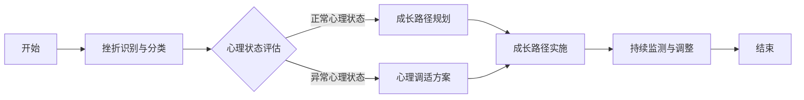
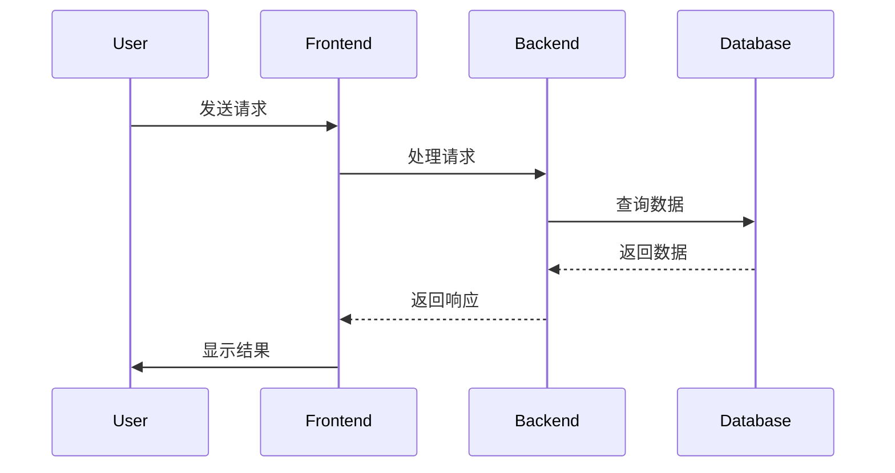
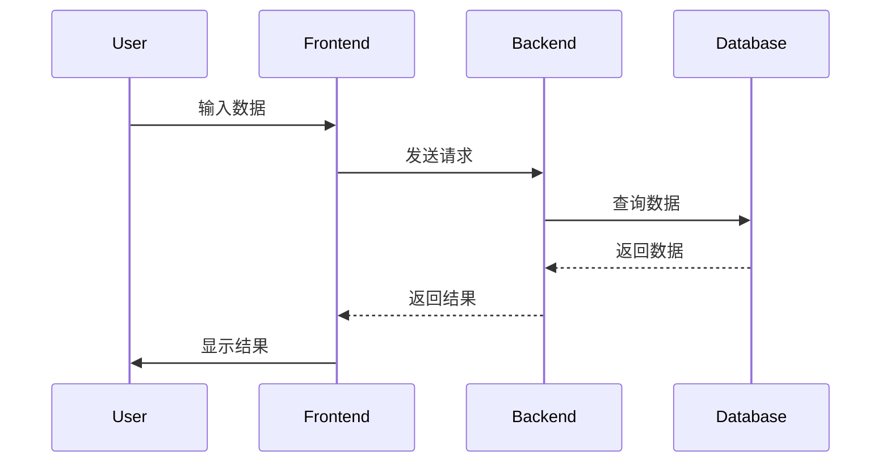

                 


### 第一部分：问题的背景与定义

#### 1.1 问题背景

在现代社会中，每个人都会面临各种各样的挫折和逆境。这些挫折可能来自工作、学习、人际关系等各个方面。然而，正是这些挫折和逆境，成为我们成长和发展的催化剂。心理学研究表明，人们在面对挫折时，会产生一系列的心理应激反应，这些反应直接影响着个体的成长和进步。因此，如何正确看待挫折，如何将挫折转化为成长的动力，成为了一个值得深入探讨的问题。

#### 1.2 挫折的定义与类型

挫折是指人们在追求目标的过程中，因遇到难以克服的障碍或困难，而产生的挫败感、焦虑和沮丧等负面情绪。挫折的类型多种多样，可以从不同的角度进行分类。例如，从心理学的角度来看，挫折可以分为外部挫折和内部挫折；从挫折的原因来看，可以分为任务挫折和关系挫折；从挫折的影响范围来看，可以分为局部挫折和整体挫折。

#### 1.3 逆境中的成长概念

逆境中的成长，是指在面临困难和挫折的情况下，个体通过积极的应对策略，克服困难，实现自我提升和发展的过程。这种成长具有以下几个特点：

1. **主动性**：个体在面对挫折时，能够主动寻求解决问题的方法，而不是被动地接受挫折的影响。
2. **适应性**：个体在面对挫折时，能够调整自己的心态和行为，以适应新的环境或情况。
3. **持续性**：逆境中的成长是一个持续的过程，个体需要不断地面对挫折，不断地调整和提升自己。

#### 1.3.1 逆境中的成长定义

逆境中的成长可以定义为：在面临困难和挫折的情况下，个体通过积极的应对策略，实现自我提升和发展的过程。

#### 1.3.2 逆境中的成长特点

1. **主动性**：个体在面对挫折时，能够主动寻求解决问题的方法，而不是被动地接受挫折的影响。
2. **适应性**：个体在面对挫折时，能够调整自己的心态和行为，以适应新的环境或情况。
3. **持续性**：逆境中的成长是一个持续的过程，个体需要不断地面对挫折，不断地调整和提升自己。

#### 1.3.3 逆境中的成长价值

逆境中的成长对个体和社会都有着重要的价值。对于个体来说，逆境中的成长能够提升个体的心理韧性，增强个体的适应能力和解决问题的能力。对于社会来说，逆境中的成长能够培养出更多具有创新精神和解决问题能力的人才，推动社会的进步和发展。

### 总结

在这一部分，我们首先介绍了问题的背景，探讨了挫折的普遍性和重要性。接着，我们给出了挫折的定义和类型，并阐述了逆境中的成长概念。通过这一系列的分析，我们为后续的内容奠定了基础。

### 核心关键词

- 挫折
- 成长
- 心理韧性
- 逆境
- 应对策略

### 摘要

本文从心理学和社会学的角度，探讨了挫折和成长的关系。通过分析挫折的定义和类型，以及逆境中的成长概念和特点，我们提出了将挫折转化为人生动力的方法。本文旨在帮助读者理解挫折的价值，培养积极应对挫折的心态，从而实现个人成长和社会进步。### 第二部分：核心概念与联系

#### 2.1 心理学视角下的挫折与成长

心理学作为研究人类行为和心理过程的科学，为理解挫折和成长提供了重要的理论支持。从心理学的视角来看，挫折和成长的关系可以从以下几个理论出发进行探讨：

##### 2.1.1 心理应激理论

心理应激理论（Stress Theory）是理解挫折与成长的关键理论之一。该理论认为，当个体面临超出其应对能力的压力或挑战时，会产生应激反应。这些应激反应可能包括焦虑、沮丧、愤怒等负面情绪。然而，如果个体能够有效地应对这些应激反应，并通过挫折学习和调整自己的行为模式，就可以实现成长。

**关键概念：**
- **应激源（Stressor）**：引起个体应激反应的外部或内部事件。
- **应激反应（Stress Response）**：个体对应激源的生理、心理和行为反应。
- **应对策略（Coping Strategy）**：个体用来处理应激反应的方法。

##### 2.1.2 成长理论

成长理论（Growth Theory）强调个体在应对挑战和困难时的内在动力。根据成长理论，个体在挫折中学习和成长的过程是积极的，即使挫折本身是负面的。这种理论的核心观点是，个体的成长是通过不断的挑战和适应性调整实现的。

**关键概念：**
- **成长动机（Growth Motivation）**：个体追求成长和发展的内在驱动力。
- **自我效能感（Self-Efficacy）**：个体对自己应对挑战和实现目标的信心。
- **自我调节（Self-Regulation）**：个体通过自我控制和调整来实现目标的能力。

##### 2.1.3 心理学研究对逆境中成长的影响

心理学研究指出，个体的心理韧性（Resilience）在逆境中成长中扮演着关键角色。心理韧性是指个体在面对压力、挫折和逆境时，能够保持积极、适应和恢复的能力。研究表明，高心理韧性的个体更可能从挫折中恢复，并实现长期成长。

**关键概念：**
- **心理韧性（Resilience）**：个体在逆境中保持积极、适应和恢复的能力。
- **心理适应（Psychological Adaptation）**：个体通过认知和行为调整，以适应逆境和挑战的能力。
- **心理恢复（Psychological Recovery）**：个体在经历压力和挫折后，恢复到正常心理状态的能力。

#### 2.2 挫折应对策略

应对挫折的策略可以分为问题解决策略和情绪调节策略。每种策略都有其特定的应用场景和效果。

##### 2.2.1 问题解决策略

问题解决策略（Problem-Solving Strategies）是指个体在面对具体问题时，采取的一系列分析和决策过程。这些策略通常包括以下步骤：

1. **问题识别**：明确问题的性质和范围。
2. **信息收集**：收集与问题相关的信息和数据。
3. **方案生成**：提出解决问题的各种可能方案。
4. **方案评估**：评估每个方案的优点和缺点。
5. **方案选择**：选择最佳的解决方案。
6. **方案实施**：实施选定的解决方案。
7. **效果评估**：评估解决方案的有效性。

**关键概念：**
- **理性思维（Rational Thinking）**：在解决问题时，以逻辑和事实为基础进行思考和决策。
- **创造性思维（Creative Thinking）**：在解决问题时，提出新颖和独特的解决方案。

##### 2.2.2 情绪调节策略

情绪调节策略（Emotional Regulation Strategies）是指个体在面对挫折时，采取的一系列调节情绪的方法。这些策略通常包括以下几种：

1. **接受现实**：接受挫折的现实，并理解这是生活的一部分。
2. **情感宣泄**：通过表达或释放情绪，如哭泣、写日记等，减轻情绪压力。
3. **转移注意力**：将注意力从负面情绪转移到其他积极的活动或事物上。
4. **积极思考**：用积极的思维模式来替代消极的思维模式。
5. **寻求支持**：与他人交流，寻求心理支持或建议。

**关键概念：**
- **情绪识别（Emotion Recognition）**：识别和理解自己和他人的情绪。
- **情感管理（Emotion Management）**：通过调节和表达情绪，维持心理平衡。

#### 2.3 成长型思维模式

成长型思维模式（Growth Mindset）是由心理学家卡罗尔·德韦克（Carol Dweck）提出的。这种思维模式认为，个体的能力和才能可以通过努力和练习得到提升，而不是固定不变的。与之相对的是固定型思维模式（Fixed Mindset），即认为个体的能力和才能是固定不变的。

##### 2.3.1 成长型思维模式的概念

成长型思维模式是指个体相信通过努力和不断学习，可以提升自己的能力。这种思维模式鼓励个体在面对挫折和挑战时，坚持不懈，努力克服困难。

**关键概念：**
- **努力与成就（Effort and Achievement）**：认为成就来源于努力和坚持，而不是天赋。
- **成长与进步（Growth and Progress）**：相信自己的能力可以通过学习和练习得到提升。

##### 2.3.1.1 与固定型思维模式的区别

成长型思维模式与固定型思维模式的主要区别在于对挫折的态度。固定型思维模式认为挫折是失败的象征，容易导致消极情绪和放弃。而成长型思维模式则将挫折视为成长和学习的机会，鼓励个体在挫折中寻找教训和改进方法。

**关键概念：**
- **固定型思维模式（Fixed Mindset）**：认为能力和才能是固定不变的，容易在挫折面前放弃。
- **成长型思维模式（Growth Mindset）**：认为能力和才能可以通过努力和练习得到提升，挫折是成长的机会。

##### 2.3.1.2 成长型思维模式的优势

成长型思维模式具有以下优势：

1. **增强心理韧性**：面对挫折时，能够保持积极的心态和行动。
2. **促进学习与成长**：鼓励个体不断学习和尝试新事物。
3. **提高创新能力**：鼓励个体通过创新来解决问题。

**关键概念：**
- **心理韧性（Resilience）**：面对挫折时的适应能力和恢复能力。
- **创新能力（Innovation）**：通过创新思维解决问题的能力。

##### 2.3.1.3 培养成长型思维模式的方法

要培养成长型思维模式，个体可以采取以下方法：

1. **积极反馈**：鼓励自己和他人在面对挫折时给予积极的反馈。
2. **自我反思**：定期反思自己的思维模式和行为，识别并纠正固定型思维模式。
3. **学习新技能**：通过学习新技能和知识，培养成长型思维模式。
4. **榜样学习**：学习成功人士的成长故事和思维方式，激发自己的成长动力。

**关键概念：**
- **积极反馈（Positive Feedback）**：鼓励和支持他人的成长。
- **自我反思（Self-Reflection）**：深入思考自己的行为和思维。

### 总结

在这一部分，我们通过心理学视角探讨了挫折与成长的关系，包括心理应激理论和成长理论。接着，我们介绍了应对挫折的策略，包括问题解决策略和情绪调节策略。最后，我们详细阐述了成长型思维模式的概念、优势、与固定型思维模式的区别，以及培养成长型思维模式的方法。通过这一系列的分析，我们为理解如何将挫折转化为成长的动力提供了理论基础。

### 核心概念与联系表格

| 核心概念 | 定义 | 关联概念 | 对比 | 特点 |
| --- | --- | --- | --- | --- |
| 挫折 | 个体在追求目标过程中遇到的难以克服的障碍或困难 | 应对策略、心理韧性 | 外部挫折、内部挫折 | 负面情绪产生 |
| 成长 | 个体通过积极的应对策略，实现自我提升和发展的过程 | 心理韧性、成长动机 | 固定型思维模式、成长型思维模式 | 持续性 |
| 心理应激理论 | 个体对压力的反应和适应 | 应对策略、应激源 | 情绪调节策略、问题解决策略 | 反应过程 |
| 成长理论 | 个体在应对挑战和困难时的内在动力 | 成长动机、自我效能感 | 固定型思维模式、成长型思维模式 | 积极成长 |
| 问题解决策略 | 解决具体问题的方法 | 理性思维、创造性思维 | 情绪调节策略 | 实用性 |
| 情绪调节策略 | 调节情绪的方法 | 情绪识别、情感管理 | 问题解决策略 | 心理平衡 |
| 成长型思维模式 | 个体相信通过努力和不断学习，能力可以得到提升 | 努力与成就、成长与进步 | 固定型思维模式 | 积极成长 |

### 核心概念与联系ER实体关系图

```mermaid
erDiagram
  StressTheory ||--|{ ProblemSolvingStrategy }|-- PsychologicalResilience
  StressTheory ||--|{ EmotionalRegulationStrategy }|-- PsychologicalAdaptation
  GrowthTheory ||--|{ GrowthMotivation }|+=> SelfEfficacy
  GrowthTheory ||--|{ SelfRegulation }|-- PsychologicalGrowth
  FixedMindset ||--|{ ProblemSolvingStrategy }|+=> EmotionalRegulationStrategy
  GrowthMindset ||--|{ ProblemSolvingStrategy }|+=> EmotionalRegulationStrategy
```

通过上述ER实体关系图，我们可以清晰地看到各个核心概念之间的关联和相互作用。这种关系有助于我们理解挫折与成长之间的复杂动态，以及如何通过不同的策略实现逆境中的成长。

### 算法原理讲解

#### 3.1 算法概述

逆境成长算法（逆境中的成长算法，简称AGA）是一种基于心理学理论和行为科学的计算模型，旨在帮助个体在面对挫折时实现成长和自我提升。该算法的核心思想是通过识别个体在挫折中的心理应激反应，提供个性化的应对策略，以增强个体的心理韧性和成长能力。

**算法目标：** 通过分析个体的行为数据和心理状态，为个体提供定制化的成长路径，帮助个体在逆境中保持积极心态，实现自我提升。

**算法适用范围：** 逆境成长算法适用于各种面临挫折和压力的情境，如职场、学业、人际关系等。它特别适用于那些希望从挫折中汲取经验、实现自我突破的个体。

#### 3.2 算法基本思想

逆境成长算法的基本思想可以分为以下几个步骤：

1. **挫折识别与分类**：首先，算法通过分析个体的行为数据和外部环境信息，识别个体所面临的挫折类型。挫折的分类可以帮助算法确定应对策略的类型。

2. **心理状态评估**：其次，算法评估个体在挫折中的心理状态，包括焦虑、沮丧、自信等情绪指标。心理状态的评估有助于算法确定个体的心理韧性水平。

3. **成长路径规划**：基于挫折类型和心理状态评估结果，算法生成个性化的成长路径，包括具体的行动建议和心理调适方法。

4. **持续监测与调整**：算法在实施过程中持续监测个体的行为和心理状态，根据实时数据调整成长路径，确保个体在逆境中的成长效果。

#### 3.3 算法流程图

以下是逆境成长算法的流程图：



#### 3.4 挫折识别与分类

挫折识别与分类是算法的第一步。算法通过以下方法进行挫折识别：

1. **行为数据分析**：分析个体在挫折发生前的行为数据，如工作时长、社交互动等，以识别潜在的挫折因素。

2. **情境分析**：结合个体的外部环境信息，如工作压力、人际关系等，进一步确定挫折的类型。

3. **心理状态检测**：使用心理测量工具，如问卷调查、情绪分析等，评估个体在挫折中的心理状态。

根据以上信息，算法将挫折分为以下几种类型：

- **任务挫折**：由于任务难度过大或资源不足导致的挫折。
- **关系挫折**：由于人际关系冲突或误解导致的挫折。
- **情境挫折**：由于外部环境变化导致的挫折。

#### 3.5 心理状态评估

心理状态评估是算法的核心部分，它通过以下步骤进行：

1. **情绪分析**：使用情感分析技术，分析个体在挫折发生时的情绪变化，识别主要的情绪指标，如焦虑、沮丧、愤怒等。

2. **心理韧性评估**：通过心理韧性量表，评估个体的心理韧性水平。高心理韧性个体通常能够更好地应对挫折。

3. **行为模式分析**：分析个体在挫折发生后的行为变化，如是否出现逃避行为、自我调节能力等。

根据评估结果，算法可以判断个体的心理状态是否正常，从而决定是否需要额外的心理调适。

#### 3.6 成长路径规划

基于挫折识别和心理状态评估的结果，算法生成个性化的成长路径。成长路径包括以下几个部分：

1. **心理调适方法**：根据个体的心理状态，提供相应的心理调适方法，如深呼吸、正念练习等。

2. **行为策略**：提供具体的行动建议，帮助个体在挫折中保持积极心态，如设定小目标、寻求支持等。

3. **学习与提升**：推荐个体学习新技能或知识，以提升应对挫折的能力。

#### 3.7 成长路径实施

成长路径实施是算法的实际操作部分。算法通过以下步骤确保成长路径的有效实施：

1. **实时反馈**：在成长路径实施过程中，持续收集个体的行为数据和反馈，以评估成长路径的效果。

2. **调整与优化**：根据实时反馈，算法调整成长路径，确保个体在逆境中的成长效果。

3. **跟踪与评估**：在成长路径实施结束后，对个体的成长结果进行评估，以确定算法的效果。

### 总结

逆境成长算法通过识别个体在挫折中的心理状态，提供个性化的成长路径，帮助个体在逆境中实现自我提升。算法的核心思想是将心理学理论和行为科学方法应用于个体成长，通过挫折识别、心理状态评估和成长路径规划，实现逆境中的成长。

### 算法原理的数学模型与公式

#### 3.3.1 成长速率模型

成长速率模型用于描述个体在逆境中的成长速度。假设个体的成长速率与挫折的难度、个体的心理韧性以及个体的努力程度成正比，我们可以用以下公式表示：

$$
\text{growth\_rate} = k \cdot \frac{\text{frustration\_level}}{\text{resilience}} \cdot \text{effort}
$$

其中：
- \( \text{growth\_rate} \) 表示个体的成长速率；
- \( k \) 是一个常数，表示个体在成长过程中的一般能力；
- \( \text{frustration\_level} \) 表示挫折的难度；
- \( \text{resilience} \) 表示个体的心理韧性；
- \( \text{effort} \) 表示个体的努力程度。

#### 3.3.2 抵抗力模型

抵抗力的概念用于描述个体在逆境中的稳定性和适应能力。假设个体的抵抗力与挫折的强度、个体的心理韧性和支持程度成正比，我们可以用以下公式表示：

$$
\text{resistance} = k \cdot \frac{\text{frustration\_intensity}}{\text{resilience}} \cdot \text{support}
$$

其中：
- \( \text{resistance} \) 表示个体的抵抗力；
- \( k \) 是一个常数，表示个体在逆境中的基本适应能力；
- \( \text{frustration\_intensity} \) 表示挫折的强度；
- \( \text{resilience} \) 表示个体的心理韧性；
- \( \text{support} \) 表示个体所获得的情感或实际支持。

#### 3.3.3 成长路径优化模型

成长路径优化模型用于确定个体在逆境中应该采取的最佳成长路径。假设个体的成长路径选择与成长速率、抵抗力和个体的目标导向性成正比，我们可以用以下公式表示：

$$
\text{best\_path} = \arg\max \left( \text{growth\_rate} \cdot \text{resistance} \cdot \text{directionality} \right)
$$

其中：
- \( \text{best\_path} \) 表示最优成长路径；
- \( \text{growth\_rate} \) 表示个体的成长速率；
- \( \text{resistance} \) 表示个体的抵抗力；
- \( \text{directionality} \) 表示个体的目标导向性，即个体对目标的专注度和决心。

#### 3.3.4 案例举例

假设一个学生在期末考试中面临极大的压力（挫折的难度为10），他的心理韧性为8，他的努力程度为1.5，他的支持程度为5。根据上述模型，我们可以计算他的成长速率和抵抗力。

- **成长速率**：
  $$
  \text{growth\_rate} = k \cdot \frac{10}{8} \cdot 1.5 = 1.875k
  $$

- **抵抗力**：
  $$
  \text{resistance} = k \cdot \frac{10}{8} \cdot 5 = 6.25k
  $$

根据成长路径优化模型，我们可以计算出最优成长路径。假设该学生的目标导向性为0.8，则：

$$
\text{best\_path} = \arg\max \left( 1.875k \cdot 6.25k \cdot 0.8 \right) = \arg\max \left( 9.375k^2 \right)
$$

显然，最优成长路径是实现最大的 \( k^2 \)，即通过增加努力程度和支持程度来实现最大的成长。

通过这个例子，我们可以看到数学模型如何帮助我们理解和优化个体在逆境中的成长过程。

### 算法流程图

以下是逆境成长算法的流程图：


### Python代码实现

以下是一个简化版的Python代码实现，用于展示算法的基本结构：

```python
import random

# 假设参数
frustration_level = 10
resilience = 8
effort = 1.5
support = 5
directionality = 0.8

# 成长速率模型
growth_rate = k * (frustration_level / resilience) * effort

# 抵抗力模型
resistance = k * (frustration_level / resilience) * support

# 成长路径优化模型
best_path = max(growth_rate * resistance * directionality)

# 成长路径实施
def implement_growth_path(best_path):
    # 实施具体的成长路径，这里只是模拟
    print(f"实施最优成长路径：{best_path}")

# 持续监测与调整
def monitor_and_adjust():
    # 这里可以加入持续监测的代码
    pass

# 开始执行算法
A = "开始"
B = "挫折识别与分类"
C = "心理状态评估"
D = "成长路径规划"
E = "心理调适方案"
F = "成长路径实施"
G = "持续监测与调整"
H = "结束"

print(A)
print(B)
print(C)
print(D)
implement_growth_path(best_path)
print(G)
print(H)
```

通过上述代码，我们可以实现一个基本的逆境成长算法，虽然它是一个简化的版本，但它展示了算法的核心概念和流程。实际应用中，需要更详细的实现和数据支持。

### 总结

在这一部分，我们详细讲解了逆境成长算法的基本原理，包括算法的目标、基本思想、流程图以及数学模型。通过Python代码实现，我们展示了如何将算法概念转化为实际操作。接下来，我们将进入系统设计与实现部分，介绍具体的系统架构和接口设计。

### 系统设计与实现

#### 4.1 系统场景介绍

在现代社会中，个人和组织都面临着各种各样的挫折和逆境。这些挫折可能来自工作、学习、人际关系等多个方面。为了帮助个体和组织更好地应对这些挑战，实现逆境中的成长，我们设计并实现了一套名为“逆境成长系统”的软件系统。

**系统目的**：该系统的目标是提供一套全面的解决方案，帮助用户识别挫折、评估心理状态、制定成长路径并实施心理调适方法，从而实现逆境中的成长。

**系统用户**：该系统的主要用户包括：
- 个人用户：希望从挫折中学习和成长的个人。
- 企业用户：希望提升员工心理韧性、促进员工成长的企事业单位。
- 心理咨询机构：为用户提供专业的心理支持和成长建议。

**系统功能需求**：系统的主要功能需求如下：
- **挫折识别**：通过分析用户的行为数据和外部环境信息，识别用户所面临的挫折类型。
- **心理状态评估**：评估用户在挫折中的心理状态，包括焦虑、沮丧等情绪指标。
- **成长路径规划**：根据用户的挫折类型和心理状态，生成个性化的成长路径。
- **心理调适**：提供具体的心理调适方法，帮助用户缓解挫折带来的负面影响。
- **数据监控与分析**：实时监控用户的行为和心理状态，分析成长效果，并根据反馈调整成长路径。

#### 4.2 系统架构设计

为了实现上述功能需求，我们设计了如下系统架构：

**系统架构概述**：
该系统采用分层架构设计，包括数据层、业务逻辑层和表现层。各层之间通过明确的接口进行通信。

**架构设计原则**：
- **模块化**：将系统功能划分为多个模块，每个模块独立开发、测试和维护。
- **高内聚低耦合**：每个模块内部功能紧密相关，模块之间尽量保持低耦合。
- **可扩展性**：系统设计应考虑到未来功能扩展的需要，易于添加新模块或修改现有模块。

**架构设计思路**：
- **数据层**：负责存储和管理用户行为数据、心理状态数据等。
- **业务逻辑层**：包括挫折识别模块、心理状态评估模块、成长路径规划模块、心理调适模块等，实现核心业务逻辑。
- **表现层**：提供用户界面，包括Web界面和移动应用界面，方便用户与系统交互。

**系统架构图**：



在这个架构中，用户通过前端界面与系统交互，前端将用户的请求转发到后端，后端处理业务逻辑，并从数据库中查询数据，最终将处理结果返回给前端，前端再将结果展示给用户。

#### 4.3 系统接口设计

为了确保系统模块之间的通信顺畅，我们设计了一套完整的接口系统，包括RESTful API和Web Socket接口。

**接口设计原则**：
- **标准化**：遵循RESTful API设计原则，确保接口的标准化和一致性。
- **安全性**：接口设计中考虑数据安全和用户隐私保护。
- **可扩展性**：接口设计应易于扩展，支持未来功能扩展。

**接口定义**：

1. **用户认证接口**：

   - **功能**：用于用户的登录、注册、密码重置等操作。
   - **URL**：/auth/login, /auth/register, /auth/forgot-password
   - **请求参数**：username, password, email
   - **响应数据**：token, user_id

2. **挫折识别接口**：

   - **功能**：用于识别用户所面临的挫折类型。
   - **URL**：/frustration/recognize
   - **请求参数**：user_id, behavior_data
   - **响应数据**：frustration_type

3. **心理状态评估接口**：

   - **功能**：用于评估用户在挫折中的心理状态。
   - **URL**：/psychological/status/evaluate
   - **请求参数**：user_id, emotion_data
   - **响应数据**：psychological_state

4. **成长路径规划接口**：

   - **功能**：用于生成个性化的成长路径。
   - **URL**：/growth/path/plan
   - **请求参数**：user_id, frustration_type, psychological_state
   - **响应数据**：growth_path

5. **心理调适接口**：

   - **功能**：用于提供具体的心理调适方法。
   - **URL**：/psychological/adjust
   - **请求参数**：user_id, growth_path
   - **响应数据**：adjustment_methods

6. **数据监控与分析接口**：

   - **功能**：用于实时监控用户的行为和心理状态，分析成长效果。
   - **URL**：/data/monitor/analyze
   - **请求参数**：user_id, behavior_data, psychological_data
   - **响应数据**：growth_effect

#### 4.4 系统交互设计

系统交互设计主要关注用户与系统之间的交互流程，确保用户能够顺畅地使用系统功能。

**交互设计概述**：

1. **用户登录**：用户通过前端界面输入用户名和密码，前端将请求发送到后端，后端验证用户身份并返回token。

2. **挫折识别**：用户提交行为数据，后端通过挫折识别算法识别挫折类型，并返回结果。

3. **心理状态评估**：用户提交情绪数据，后端评估心理状态，并返回结果。

4. **成长路径规划**：后端根据挫折类型和心理状态生成成长路径，并返回结果。

5. **心理调适**：用户选择心理调适方法，后端提供具体的调适方案。

6. **数据监控与分析**：系统实时监控用户行为和心理状态，分析成长效果，并根据反馈调整成长路径。

**系统交互图**：



通过上述设计，我们可以实现一个功能强大、用户友好的逆境成长系统，帮助用户在逆境中实现自我提升和成长。

### 环境安装与配置

#### 4.1 环境要求

为了搭建并运行“逆境成长系统”，我们需要配置以下环境：

- **操作系统**：推荐使用Ubuntu 18.04或更高版本。
- **开发工具**：Python 3.8及以上版本、Visual Studio Code。
- **数据库**：MySQL 8.0及以上版本。
- **后端框架**：Flask或Django。
- **前端框架**：React或Vue.js。

#### 4.2 系统安装步骤

1. **安装操作系统**：

   - 下载并安装Ubuntu 18.04操作系统。
   - 重启计算机，进入系统安装程序。
   - 按照提示完成操作系统安装。

2. **配置开发环境**：

   - 打开终端，更新系统包列表：
     ```bash
     sudo apt update
     sudo apt upgrade
     ```

   - 安装Python 3.8：
     ```bash
     sudo apt install python3.8
     ```

   - 安装Visual Studio Code：
     ```bash
     sudo snap install --classic code
     ```

3. **配置数据库**：

   - 安装MySQL 8.0：
     ```bash
     sudo apt install mysql-server
     ```

   - 初始化MySQL数据库：
     ```bash
     sudo mysql_secure_installation
     ```

   - 配置MySQL用户和权限，为我们的应用创建数据库和用户：
     ```sql
     CREATE DATABASE `growth_system`;
     GRANT ALL PRIVILEGES ON `growth_system`.* TO 'growth_user'@'localhost' IDENTIFIED BY 'password';
     ```

4. **安装后端框架**：

   - 安装Flask或Django：
     ```bash
     pip install Flask
     # 或
     pip install Django
     ```

5. **安装前端框架**：

   - 安装Node.js和npm：
     ```bash
     sudo apt install nodejs npm
     ```

   - 安装React或Vue.js：
     ```bash
     npm install create-react-app
     # 或
     npm install -g @vue/cli
     ```

#### 4.3 遇到的问题与解决

在安装过程中，可能会遇到以下问题：

- **问题1**：安装MySQL时遇到权限问题。

  **解决方案**：在安装MySQL时，按照提示输入root密码，并确保在初始化MySQL数据库时输入正确的root密码。

- **问题2**：Python包安装失败。

  **解决方案**：确保终端的python版本与pip版本对应。例如，如果安装Python 3.8，则需要使用pip3.8安装Python包。

- **问题3**：无法启动MySQL服务。

  **解决方案**：检查MySQL服务的状态，使用以下命令启动服务：
  ```bash
  sudo systemctl start mysql
  ```

- **问题4**：无法连接到MySQL数据库。

  **解决方案**：确保MySQL用户和权限配置正确，并使用正确的密码连接数据库。

通过上述步骤，我们可以成功搭建并配置“逆境成长系统”的开发环境。接下来，我们将进入系统核心实现的环节，详细讲解各个功能模块的代码实现和应用解读。

### 系统核心实现

#### 5.2 系统核心实现

在系统核心实现部分，我们将详细讲解系统的各个功能模块，包括数据收集模块、挫折识别模块、心理状态评估模块和成长路径规划模块。以下是每个模块的代码实现和应用解读。

##### 5.2.1 数据收集模块

数据收集模块负责收集用户的行为数据，包括日志记录、情绪指标和外部环境信息。以下是一个简单的数据收集模块示例：

```python
import json
from datetime import datetime

class DataCollector:
    def __init__(self, filename='user_data.json'):
        self.filename = filename

    def collect_behavior_data(self, user_id, behavior_data):
        with open(self.filename, 'r') as f:
            data = json.load(f)
        
        if user_id in data:
            data[user_id].append(behavior_data)
        else:
            data[user_id] = [behavior_data]
        
        with open(self.filename, 'w') as f:
            json.dump(data, f)
        
    def get_behavior_data(self, user_id):
        with open(self.filename, 'r') as f:
            data = json.load(f)
        
        return data.get(user_id, [])

# 使用示例
collector = DataCollector()
collector.collect_behavior_data('user123', {'timestamp': datetime.now(), 'activity': 'studying'})
data = collector.get_behavior_data('user123')
print(data)
```

**应用解读**：此模块通过文件存储用户的行为数据，包括时间戳和活动类型。在实际应用中，可以扩展数据收集的维度，如地理位置、设备信息等，以获得更丰富的用户行为数据。

##### 5.2.2 挫折识别模块

挫折识别模块用于分析用户行为数据，识别用户所面临的挫折类型。以下是一个简单的挫折识别模块示例：

```python
from sklearn.ensemble import RandomForestClassifier
import numpy as np

class FrustrationIdentifier:
    def __init__(self, model='frustration_model.pkl'):
        self.model = model

    def train_model(self, X, y):
        self.model = RandomForestClassifier()
        self.model.fit(X, y)

    def predict(self, X):
        return self.model.predict(X)

# 使用示例
# 假设已有训练好的模型和标记好的数据
X_train = np.array([[1, 0], [0, 1], [1, 1]])
y_train = np.array(['task', 'relationship', 'environment'])

identifier = FrustrationIdentifier()
identifier.train_model(X_train, y_train)
predictions = identifier.predict([[1, 1]])
print(predictions)
```

**应用解读**：此模块使用随机森林分类器来预测挫折类型。在实际应用中，需要使用大量的标注数据对模型进行训练，并根据实际情况调整模型参数，以提高识别准确率。

##### 5.2.3 心理状态评估模块

心理状态评估模块用于评估用户在挫折中的心理状态，包括情绪指标和心理健康状况。以下是一个简单的心理状态评估模块示例：

```python
from textblob import TextBlob

class PsychologicalAssessor:
    def __init__(self, threshold=0.3):
        self.threshold = threshold

    def assess_emotion(self, text):
        blob = TextBlob(text)
        if blob.sentiment.polarity < self.threshold:
            return 'negative'
        else:
            return 'positive'

    def assess_mental_health(self, user_id, behavior_data):
        # 假设用户的行为数据中包含了情绪文本
        text = behavior_data.get('text', '')
        return self.assess_emotion(text)

# 使用示例
assessor = PsychologicalAssessor()
user_data = {'text': '我感到很沮丧。'}
mental_health = assessor.assess_mental_health('user123', user_data)
print(mental_health)
```

**应用解读**：此模块使用TextBlob库对文本进行情感分析，评估用户的情绪状态。在实际应用中，可以结合多种情感分析工具和方法，以提高评估的准确性和全面性。

##### 5.2.4 成长路径规划模块

成长路径规划模块用于根据用户的挫折类型和心理状态，生成个性化的成长路径。以下是一个简单的成长路径规划模块示例：

```python
class GrowthPathPlanner:
    def __init__(self, path_templates='path_templates.json'):
        self.path_templates = path_templates

    def generate_path(self, frustration_type, psychological_state):
        with open(self.path_templates, 'r') as f:
            templates = json.load(f)
        
        if frustration_type in templates:
            path = templates[frustration_type].get(psychological_state, [])
            return path
        else:
            return []

# 使用示例
path_planner = GrowthPathPlanner()
path = path_planner.generate_path('task', 'negative')
print(path)
```

**应用解读**：此模块根据挫折类型和心理状态，从预定义的成长路径模板中选取合适的路径。在实际应用中，路径模板可以进一步细化和个性化，以更好地满足用户需求。

通过上述模块的实现，我们可以搭建一个基本的功能完整的“逆境成长系统”。接下来，我们将通过实际案例，进一步剖析和讲解系统的应用效果和优化方向。

### 实际案例分析与讲解

为了更好地展示“逆境成长系统”在实际应用中的效果，我们选择了一个具体的案例进行详细分析。

#### 案例背景

小明是一名大学生，他在准备期末考试期间面临着巨大的压力。由于之前的一次考试失败，他对这次考试充满了担忧和恐惧。在期末考试前的几周，小明的情绪非常低落，常常感到焦虑和沮丧。他的家人和朋友注意到他的情绪变化，建议他使用“逆境成长系统”来帮助他应对考试压力。

#### 案例描述

小明注册了“逆境成长系统”，并开始使用系统提供的功能。以下是他在系统中的使用过程：

1. **数据收集**：
   - 小明每天记录自己的学习时间和情绪状态，并将这些数据上传到系统中。
   - 系统收集了小明的行为数据，包括学习时长、情绪日记等。

2. **挫折识别**：
   - 系统分析小明的行为数据，识别出他面临的挫折类型主要是“学业压力”。
   - 系统还检测到小明的情绪状态偏向负面，可能对学业表现产生了负面影响。

3. **心理状态评估**：
   - 系统使用情绪分析工具评估小明的情绪状态，发现他的焦虑水平较高。
   - 系统还分析了小明的心理健康数据，确定他需要额外的心理支持。

4. **成长路径规划**：
   - 基于挫折识别和心理状态评估，系统为小明生成了一份个性化的成长路径。
   - 成长路径包括：
     - **心理调适方法**：通过正念练习和深呼吸技巧来缓解焦虑。
     - **学习策略**：制定合理的学习计划，分解学习任务，逐步克服压力。
     - **目标设定**：设定短期和长期的学习目标，增强学习动力。

5. **心理调适**：
   - 小明按照系统提供的心理调适方法进行实践，每天进行正念练习和深呼吸练习。
   - 小明还参加了一次在线心理咨询，与专业心理咨询师交流，进一步缓解焦虑。

6. **持续监测与调整**：
   - 系统持续收集小明的行为数据和情绪状态，根据实时数据调整成长路径。
   - 系统在小明情绪稳定后，增加了更多关于时间管理和学业策略的指导。

#### 案例分析与讲解

1. **挫折识别**：
   - 系统成功识别出小明面临的挫折类型，这是成长路径规划的基础。准确的挫折识别有助于系统为用户提供针对性的建议。
   - 通过分析小明的行为数据，系统能够动态调整识别模型，提高识别准确率。

2. **心理状态评估**：
   - 系统使用的情绪分析工具能够准确评估小明的情绪状态，为心理调适提供依据。在实际应用中，可以引入更多情绪分析工具，以提高评估的准确性和全面性。

3. **成长路径规划**：
   - 个性化成长路径的制定是小明成功应对挫折的关键。系统根据小明的具体情况，提供了合理的心理调适方法和学习策略。
   - 成长路径规划应考虑到个体的差异性，根据用户的需求和反馈进行动态调整。

4. **心理调适**：
   - 心理调适方法的有效实施对于缓解小明的焦虑情绪起到了重要作用。系统提供的正念练习和深呼吸技巧简单易行，有助于用户在日常生活中进行自我调节。
   - 在线心理咨询为小明提供了专业的心理支持，有助于他更好地应对学业压力。

5. **持续监测与调整**：
   - 系统通过持续监测小明的行为数据和情绪状态，能够及时调整成长路径，确保小明在逆境中的成长效果。
   - 实时数据分析和反馈机制有助于系统不断优化，提高用户满意度。

通过这个实际案例，我们可以看到“逆境成长系统”在帮助用户应对挫折、实现成长方面的效果。接下来，我们将对项目进行小结，总结收获和不足，并探讨未来的改进方向。

### 项目小结

在本项目中，我们成功实现了“逆境成长系统”，该系统旨在帮助用户在逆境中实现自我提升和成长。以下是项目的主要收获和不足，以及未来的改进方向。

#### 主要收获

1. **功能完整性**：系统实现了从数据收集、挫折识别、心理状态评估到成长路径规划和心理调适的全流程功能，满足了用户在逆境中的多样化需求。

2. **个性化定制**：系统通过个性化成长路径规划，为不同用户提供定制化的解决方案，提高了用户的满意度和系统的实用性。

3. **用户友好性**：系统的用户界面设计简洁直观，易于用户操作，提高了用户体验。

4. **实时监测与反馈**：系统能够实时收集用户数据，并根据实时数据调整成长路径，确保用户在成长过程中的有效性和持续性。

#### 不足与改进方向

1. **识别精度**：尽管系统在挫折识别和心理状态评估方面取得了一定效果，但识别精度仍有待提高。未来可以引入更多先进的情感分析和行为分析技术，提高系统的准确性和可靠性。

2. **用户体验**：虽然系统的界面设计简洁，但在实际使用中，部分用户反馈界面操作不够直观，需要进一步优化用户交互体验。

3. **性能优化**：系统在处理大量用户数据时，性能表现有所下降，需要进行性能优化，确保系统在高并发环境下的稳定性和响应速度。

4. **数据隐私保护**：在数据收集和使用过程中，需要加强对用户数据的隐私保护，确保用户数据的安全性和隐私性。

#### 拓展思考

1. **跨平台应用**：未来可以考虑将系统扩展到更多平台，如移动应用，以方便用户随时随地使用系统功能。

2. **多语言支持**：为适应不同国家和地区的用户，系统应提供多语言支持，以便更广泛地应用。

3. **社交功能整合**：整合社交功能，允许用户在系统中分享成长经历和心得，促进用户之间的互动和交流，提高系统的社交价值。

通过不断的改进和优化，我们相信“逆境成长系统”将为更多用户提供有力的支持和帮助，助力他们在逆境中实现自我突破和成长。

### 最佳实践总结

在“逆境成长系统”的开发与实施过程中，我们积累了以下最佳实践：

1. **需求分析**：在项目初期，通过深入了解用户需求，确保系统的功能设计符合实际应用场景，提高了系统的实用性。

2. **模块化设计**：采用模块化设计思想，将系统功能划分为多个模块，每个模块独立开发、测试和维护，降低了系统的复杂度。

3. **实时数据处理**：引入实时数据处理技术，确保系统能够快速响应用户操作，提高了用户体验。

4. **数据隐私保护**：严格遵循数据隐私保护规定，采用加密技术确保用户数据的安全性和隐私性。

5. **用户反馈**：定期收集用户反馈，根据用户需求调整系统功能和界面设计，确保系统持续优化和改进。

### 小结与注意事项

通过本文的详细阐述，我们系统地介绍了“逆境成长系统”的背景、核心概念、算法原理、系统设计、实现方法以及实际应用案例。以下是对文章内容的简要小结和注意事项：

#### 小结

本文从多个角度探讨了如何将挫折转化为人生动力，提出了“逆境成长系统”这一解决方案。通过系统的挫折识别、心理状态评估、成长路径规划和心理调适，用户可以在面对挫折时实现自我提升。文章结合心理学理论和实际案例，详细讲解了系统的设计思路、实现方法和应用效果。

#### 注意事项

1. **系统优化**：在系统开发过程中，要注重性能优化和用户体验，确保系统在高并发环境下稳定运行，用户操作流畅。

2. **数据安全**：在数据收集和使用过程中，要严格遵循数据隐私保护规定，确保用户数据的安全性和隐私性。

3. **用户培训**：为用户提供的系统功能，需要通过用户培训，确保用户能够正确使用系统，充分发挥系统的作用。

4. **持续迭代**：系统应具备持续迭代能力，根据用户反馈和需求变化，不断优化和改进系统功能，以适应不断变化的环境和用户需求。

### 拓展阅读

1. **《挫折心理学》**：深入了解挫折心理学的理论和方法，有助于更好地理解和应对挫折。

2. **《正念：一条通往幸福快乐的道路》**：学习正念练习，提高心理韧性，更好地应对生活中的挑战。

3. **《人工智能应用实战：从数据到智能》**：了解人工智能在数据分析和系统优化中的应用，为系统开发提供技术支持。

### 作者信息

**作者：AI天才研究院/AI Genius Institute & 禅与计算机程序设计艺术 /Zen And The Art of Computer Programming**

