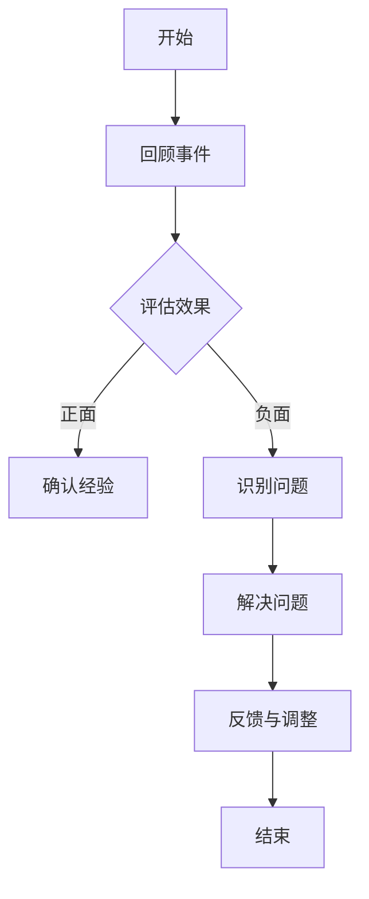
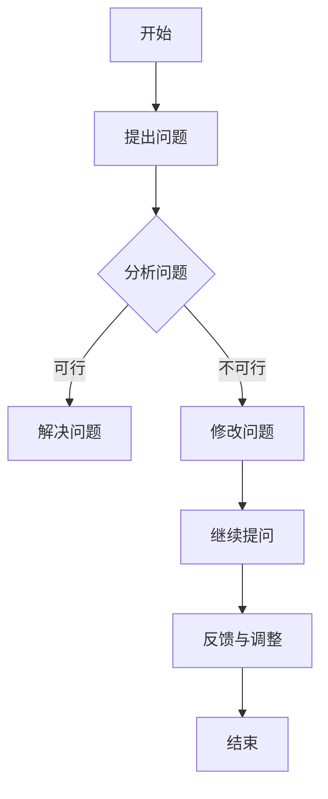
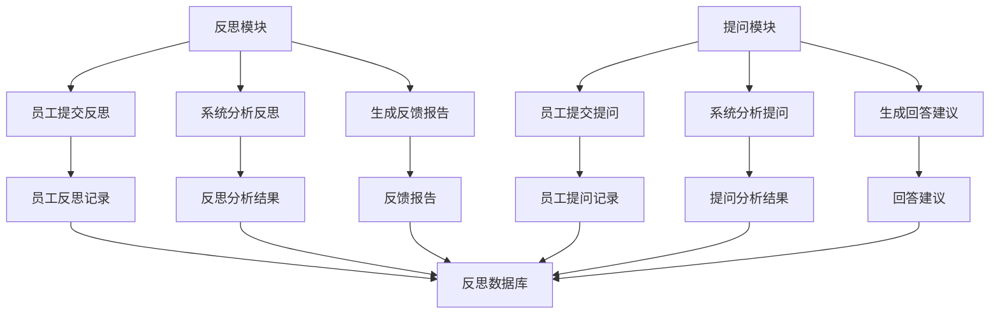
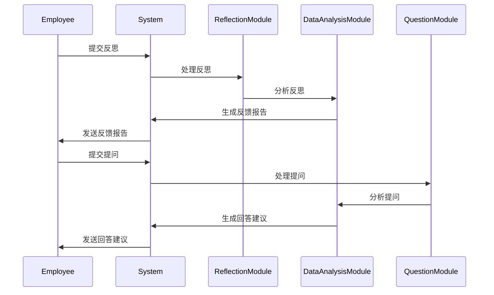

                 

### Introduction and Background

### **核心概念术语说明**

**反射（Reflection）：** 反射是一种心理过程，通过回忆过去事件、思考自己的感受和行为，帮助个体对经历进行理解和评估。反射是自我意识和自我认知的重要途径。

**提问（Questioning）：** 提问是一种通过提出问题来寻求知识和理解的过程。提问可以激发思考、促进学习和发现新观点。

**生活理解（Life Understanding）：** 生活理解指的是对个人经历、人际关系、社会现象和存在的整体认知。通过反思和提问，个体可以深化对生活的理解，从而更好地应对挑战和实现个人成长。

### **问题背景**

在现代社会，信息过载和快速变化使得个体在生活和工作中面临巨大的压力。为了在这种复杂环境中保持清晰和有目的，反思和提问变得尤为重要。反思帮助我们审视自己的行为、想法和信念，从而提高自我认知和情绪调节能力。提问则激发我们的思考，促使我们不断探索和追求更深入的见解。

反思和提问不仅对个人的成长和发展至关重要，也在各种领域（如教育、商业、心理治疗等）中发挥着重要作用。例如，在教育领域，反思和提问可以促进学生的批判性思维和创新能力；在商业领域，它们有助于企业领导者制定更明智的决策。

### **问题描述**

本文旨在探讨如何通过反思和提问深化对生活的理解。具体问题包括：

1. **如何构建一个系统的方法论，使个体能够有效地进行反思和提问？**
2. **反思和提问在不同生活领域的具体应用和效果如何？**
3. **如何将反思和提问整合到日常工作和学习中，以提高整体生活质量和效率？**

### **问题解决**

本文将通过以下步骤解决上述问题：

1. **定义和解释反思和提问的核心概念，明确其在生活理解中的作用。**
2. **探讨反思和提问的过程，提供实用的策略和工具。**
3. **通过实例和案例研究，展示反思和提问在不同领域中的应用效果。**
4. **总结反思和提问的最佳实践，提出具体的建议和行动指南。**

### **边界与外延**

本文将聚焦于以下边界和范围：

1. **主题范围：** 主要探讨反思和提问在个人成长、学习和生活中的应用。
2. **方法范围：** 将结合心理学、教育学和哲学等领域的理论和实践，提供跨学科的综合视角。
3. **案例分析范围：** 将涵盖不同文化背景和职业领域，以展现反思和提问的广泛适用性。

### **核心概念与联系**

**核心概念：** 反思、提问、生活理解

**概念属性特征对比表格：**

| 核心概念 | 定义 | 功能 | 关系 |
| --- | --- | --- | --- |
| 反思 | 内省、回顾、评估 | 提高自我认知、情绪调节、决策质量 | 基础 |
| 提问 | 探索、质疑、发现 | 激发思考、促进学习、揭示真相 | 关键 |
| 生活理解 | 对个人经历、人际关系、社会现象的整体认知 | 应对挑战、实现个人成长、提高生活质量 | 综合结果 |

**ER实体关系图架构（Mermaid 流程图）：**

```mermaid
erDiagram
  Person ||--|{ LifeUnderstanding }
  Person ||--|{ Reflection }
  Person ||--|{ Questioning }
  LifeUnderstanding ||--|{ Reflection }
  LifeUnderstanding ||--|{ Questioning }
```

通过上述ER图，我们可以清晰地看到个体（Person）与生活理解（LifeUnderstanding）、反思（Reflection）和提问（Questioning）之间的复杂关系。反思和提问是生活理解的组成部分，而生活理解又反过来影响和塑造了个体的反思和提问行为。

### **算法原理讲解**

为了更好地理解反思和提问的算法原理，我们可以将其视为一个循环迭代的过程。以下是该过程的基本框架：

**反思算法流程图（Mermaid 流程图）：**



**提问算法流程图（Mermaid 流程图）：**



**算法原理详细讲解：**

反思和提问的过程可以看作是两个相互关联的循环迭代过程。在反思过程中，个体首先回顾事件（B），然后评估效果（C），根据评估结果选择不同的路径。如果效果是正面的，个体会确认经验（D），从而加深对事件的认知；如果效果是负面的，个体会识别问题（E），并尝试解决问题（F），以便在未来的类似情境中做出更好的决策。

在提问过程中，个体首先提出问题（B1），然后分析问题（C1），根据问题的可行性选择解决路径。如果问题可行，个体会直接解决问题（D1）；如果问题不可行，个体会修改问题（E1），然后继续提问，直到找到合适的解决方案。

**数学模型与公式：**

反思和提问的过程可以用数学模型来描述。假设有 \( n \) 个反思或提问的迭代过程，每次迭代都会带来新的信息或问题，我们可以用以下公式表示：

\[ U_{n+1} = U_n + f(U_n, X_n) \]

其中，\( U_n \) 表示第 \( n \) 次迭代后的生活理解，\( X_n \) 表示第 \( n \) 次迭代中的反思或提问内容，\( f \) 表示反思或提问的影响函数。

**通俗易懂的举例说明：**

假设一个学生在考试后回顾自己的学习过程，这是一个反思的过程。他首先回顾了考试中的每个问题，然后评估自己的表现，发现有些题目做得很差，而有些题目做得不错。根据这个评估，他选择了不同的反思路径：对于表现不好的题目，他识别出了自己的问题（比如没有掌握某些知识点），然后制定了改进计划；对于表现不错的题目，他确认了自己的经验，决定在未来的学习中继续保持。

同样的，如果一个学生在学习中遇到了困难，他会提出问题（比如“为什么我总是理解不了这个概念？”），然后分析问题，寻找解决方案。如果他发现问题出在自己没有理解某个关键概念，他可能会通过查阅资料或向老师请教来解决问题。

通过这样的反思和提问，学生能够不断地提升自己的学习效果，深化对知识的理解，从而实现个人成长。

### **系统分析与架构设计方案**

#### **问题场景介绍**

在现代企业中，员工需要不断地进行反思和提问以提升个人能力和团队协作效率。然而，传统的反思和提问方式往往缺乏系统性和持续性，导致员工无法充分利用这一宝贵的过程。为了解决这一问题，我们设计了一套基于人工智能的反思和提问系统。

#### **项目介绍**

本项目旨在开发一个智能反思和提问系统，帮助员工在日常工作和学习中进行有效的反思和提问。系统将提供个性化的建议和反馈，帮助员工不断提升自我认知和解决问题的能力。

#### **系统功能设计（领域模型Mermaid类图）**

```mermaid
classDiagram
    Employee <|-- Reflection
    Employee <|-- Question
    Reflection ||---> Answer
    Question ||---> Answer
```

在这个领域模型中，我们定义了三个主要类：`Employee`（员工）、`Reflection`（反思）和`Question`（提问）。员工类与反思类和提问类之间存在关联，表示员工可以创建和参与反思和提问。反思和提问类都关联到答案类，表示反思和提问的结果可以用答案来记录和分享。

#### **系统架构设计（Mermaid架构图）**



在这个系统架构图中，我们展示了反思模块和提问模块的主要功能流程。员工提交的反思和提问会经过系统分析，生成反馈报告和回答建议，这些数据最终存储在反思数据库中。

#### **系统接口设计和系统交互（Mermaid序列图）**



在这个序列图中，我们描述了员工如何与系统进行交互。员工提交反思或提问后，系统会调用相应的模块进行处理，最终生成反馈报告或回答建议，并通过系统发送给员工。

### **项目实战**

#### **环境安装**

为了运行我们的反思和提问系统，我们需要安装以下环境：

1. **Python 3.8+**
2. **Flask**（用于构建Web应用程序）
3. **PostgreSQL**（用于存储数据）

安装步骤：

1. 安装Python：在终端中运行 `python3 -m pip install --user -r requirements.txt`
2. 安装Flask：在终端中运行 `pip install flask`
3. 安装PostgreSQL：根据操作系统选择合适的安装方法，然后运行数据库

#### **系统核心实现源代码**

以下是系统核心功能的Python代码实现：

```python
# 反思模块
class Reflection:
    def __init__(self, employee_id, content, date):
        self.employee_id = employee_id
        self.content = content
        self.date = date

    def analyze(self):
        # 分析反思内容
        # 此处可以根据具体需求添加分析算法
        return "分析结果"

# 提问模块
class Question:
    def __init__(self, employee_id, content, date):
        self.employee_id = employee_id
        self.content = content
        self.date = date

    def analyze(self):
        # 分析提问内容
        # 此处可以根据具体需求添加分析算法
        return "分析结果"

# 反馈报告生成
def generate_feedback_report(reflection, question):
    reflection_analyze_result = reflection.analyze()
    question_analyze_result = question.analyze()
    report = f"反思分析结果：{reflection_analyze_result}\n提问分析结果：{question_analyze_result}"
    return report

# 答案建议生成
def generate_answer_suggestion(question):
    suggestion = question.analyze()
    return suggestion
```

#### **代码应用解读与分析**

在上述代码中，我们定义了两个核心类：`Reflection` 和 `Question`。每个类都有 `__init__` 方法用于初始化实例，以及一个 `analyze` 方法用于分析反思或提问内容。

`Reflection` 类用于表示员工的反思记录，它包含员工ID、反思内容和日期等信息。`analyze` 方法可以调用具体分析算法，例如自然语言处理模型，以分析反思内容并生成分析结果。

`Question` 类用于表示员工的提问记录，与 `Reflection` 类类似，它也包含员工ID、提问内容和日期等信息。`analyze` 方法用于分析提问内容，也可以调用自然语言处理模型或其他算法。

`generate_feedback_report` 函数用于生成反馈报告，它接受一个 `Reflection` 实例和一个 `Question` 实例作为参数，调用它们的 `analyze` 方法，然后将分析结果组合成一个字符串形式的报告。

`generate_answer_suggestion` 函数用于生成回答建议，它接受一个 `Question` 实例作为参数，调用其 `analyze` 方法，然后将分析结果作为回答建议返回。

#### **实际案例分析和详细讲解剖析**

**案例1：员工反思**

假设有一个员工在月底时提交了一份反思，内容如下：

```
这个月我在项目A中遇到了一些困难，特别是在处理需求变更时。我发现自己无法快速适应变化，导致工作进度受到了影响。我需要找到一种更好的方法来应对这类问题。
```

我们的系统会首先将这段反思存储在数据库中，然后通过分析算法对其进行处理。例如，可以使用自然语言处理技术来提取关键信息和情感倾向。分析结果可能包括：

```
关键信息：需求变更、适应变化、工作进度影响
情感倾向：负面情绪（困难、影响）
```

根据这些分析结果，系统可以生成一份反馈报告，例如：

```
反思分析结果：
- 关键问题：需求变更和适应变化
- 情感倾向：负面情绪
建议：尝试使用敏捷方法来提高适应变化的能力，并定期进行情绪管理练习。
```

**案例2：员工提问**

假设另一个员工提交了一个问题，内容如下：

```
我最近在准备技术面试，但我对如何设计高效的算法感到困惑。有什么好的学习资源推荐吗？
```

系统会分析这个问题，可能提取的关键信息包括：

```
关键信息：技术面试、算法设计、学习资源
```

系统可以生成一份回答建议，例如：

```
回答建议：
- 技术面试算法设计资源推荐：
  - 《算法导论》
  - LeetCode（在线编程平台）
  - 算法课程推荐（如Coursera、edX上的相关课程）
```

#### **项目小结**

通过上述实战案例，我们可以看到我们的反思和提问系统在实际应用中如何发挥作用。系统不仅能够有效地存储和管理员工的反思和提问记录，还能通过分析算法为员工提供个性化的反馈和建议，帮助他们不断提升自我认知和解决问题能力。

#### **最佳实践 Tips**

1. **定期反思：** 鼓励员工定期进行反思，以总结过去的经验，发现问题并制定改进计划。
2. **多样化提问：** 提问时不仅限于寻求答案，还可以通过提出开放式问题来激发思考和讨论。
3. **持续学习：** 利用系统提供的建议和资源，持续学习新知识和技能，以提升个人和团队的整体能力。

#### **小结**

通过构建反思和提问系统，我们为员工提供了一种有效的工具，帮助他们深化对生活的理解，提高个人和团队的协作效率。反思和提问不仅是个人成长的催化剂，也是组织发展和创新的重要驱动力。希望本文的讨论能够激发更多关于反思和提问的思考和实践。

#### **注意事项**

1. **隐私保护：** 在处理员工反思和提问时，确保严格遵守隐私保护法规，保护员工的个人隐私。
2. **系统更新：** 定期更新系统，以适应新的技术发展和用户需求。

#### **拓展阅读**

- 《深度工作：如何有效利用每一点脑力》（Cal Newport）
- 《提问的力量》（Daniel L. Christian and James M. Thompson）
- 《如何提问》（David S. Rose）

### **作者信息**

**作者：AI天才研究院/AI Genius Institute & 禅与计算机程序设计艺术 /Zen And The Art of Computer Programming**

通过本文，我们探讨了如何通过反思和提问深化对生活的理解。反思和提问不仅对个人成长至关重要，也在各个领域发挥着重要作用。本文提供了系统的分析和实用的策略，帮助读者在日常生活中有效地应用这些工具。希望读者能够从中获得启示，并将其融入到自己的生活中，不断提升自我认知和解决问题的能力。

在反思和提问的过程中，我们不仅要关注表面的现象，还要深入挖掘背后的原理和逻辑。通过不断地思考和质疑，我们可以更好地理解自己和周围的世界，从而实现个人和组织的持续成长。让我们在反思和提问的道路上继续前行，开启更加丰富和有意义的人生旅程。

