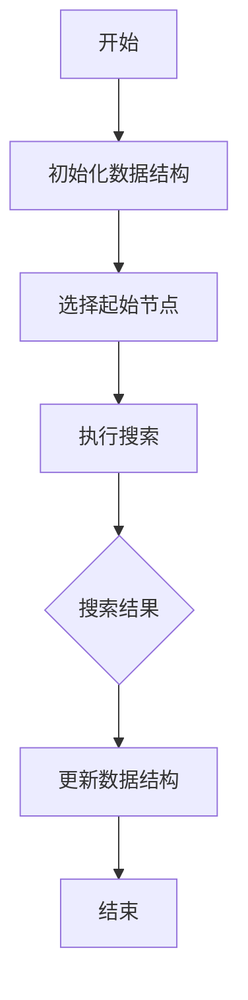
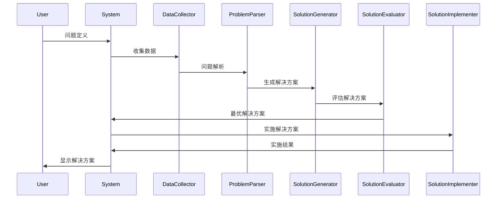

                 


# 通过思考深化人生理解：在问题中寻找答案

## 关键词
- 思考
- 人生理解
- 问题的本质
- 解决策略
- 数学模型

## 摘要
本文旨在探讨如何通过深入思考来深化人生理解，特别是在面对问题时如何寻找答案。文章将从思考的层次、问题的本质、解决问题的方法等多个角度进行阐述，帮助读者理解问题的价值，掌握思考的技巧，最终实现个人成长和人生质量的提升。

## 第一部分：导言

### 引言

#### 1.1 书籍的主题与目的

在快速变化的信息时代，如何更好地理解自己和周围的世界，成为了每个人都需要面对的挑战。本书的主题是“通过思考深化人生理解”，目的是帮助读者掌握思考的技巧，理解问题的本质，从而在面对人生中的各种问题时能够更加从容地寻找答案。

#### 1.2 思考的重要性

思考是人类智慧的源泉。通过思考，我们能够对问题进行深入分析，发现问题的本质，从而找到解决问题的方法。同时，思考还能够促进我们的个人成长，提高我们的认知能力和决策水平。

#### 1.3 问题的价值

问题是我们思考的起点，也是我们成长的机会。面对问题，我们需要主动思考，分析问题的原因和解决方案。通过解决问题，我们能够积累经验，提升自己的能力，深化对人生和世界的理解。

## 第二部分：问题的本质

### 2.1 问题的定义与类型

#### 2.1.1 问题的基本概念

问题是指在一定背景下，人们面临的某个难以解决或理解的现象或挑战。问题通常具有明确的目标和限制条件，需要通过思考和分析来找到解决方案。

#### 2.1.2 问题的分类

问题可以按照不同的标准进行分类。例如，根据问题的复杂程度，可以分为简单问题和复杂问题；根据问题的性质，可以分为现实问题和理论问题。

#### 2.1.3 问题的属性与特征

问题的属性和特征包括：明确的目标、限制条件、不确定性和多样性。这些属性和特征决定了问题的复杂性和解决难度。

### 2.2 问题的结构与解析

#### 2.2.1 问题结构的概念

问题结构是指问题的组成部分和它们之间的关系。理解问题结构有助于我们更好地分析问题，找到解决问题的方法。

#### 2.2.2 解析问题的方法

解析问题通常包括以下几个步骤：

1. 确定问题的目标。
2. 分析问题的限制条件。
3. 探索可能的解决方案。
4. 评估解决方案的可行性。

#### 2.2.3 问题的边界与外延

问题的边界是指问题的范围和限制，外延是指问题的可能影响和扩展。明确问题的边界与外延有助于我们更好地理解问题，制定合适的解决方案。

### 2.3 问题的数学模型

#### 2.3.1 数学模型的基本原理

数学模型是一种将现实问题转化为数学表达式的方法。通过数学模型，我们能够更精确地描述问题，分析问题的性质，找到问题的解决方案。

#### 2.3.2 问题的数学公式

数学公式是数学模型的核心。它们能够帮助我们量化问题，进行精确计算。

#### 2.3.3 数学模型的应用

数学模型在各个领域都有广泛的应用。例如，在经济学中，数学模型用于预测市场趋势；在物理学中，数学模型用于描述自然现象。

## 第三部分：思考的方法

### 3.1 思考的工具与技术

#### 3.1.1 常用的思考工具

思考工具包括思维导图、逻辑推理、批判性思维等。这些工具能够帮助我们更好地组织思考，提高思考的效率。

#### 3.1.2 思考技术的应用

思考技术可以在日常工作和生活中广泛应用。例如，在解决问题时，我们可以使用逻辑推理来分析问题，使用批判性思维来评估解决方案。

#### 3.1.3 思考的进阶技巧

进阶思考技巧包括深度思考、跨界思考、系统性思考等。这些技巧能够帮助我们更好地理解复杂问题，找到创新的解决方案。

### 3.2 问题解决的策略

#### 3.2.1 问题解决的基本步骤

问题解决通常包括以下几个步骤：

1. 确定问题的性质。
2. 收集相关信息。
3. 分析问题的原因。
4. 制定解决方案。
5. 实施解决方案。
6. 评估解决方案的效果。

#### 3.2.2 创新思维在问题解决中的应用

创新思维是解决问题的重要方法。通过创新思维，我们能够打破传统的思维模式，找到新颖的解决方案。

#### 3.2.3 问题的解决策略案例分析

通过具体案例，我们可以学习如何有效地解决问题。案例分析能够帮助我们理解问题的解决过程，提高我们解决问题的能力。

## 第四部分：寻找答案的过程

### 4.1 寻找答案的方法

#### 4.1.1 数据收集与整理

寻找答案的第一步是收集相关数据。数据可以来自各种来源，如文献、实验、观察等。收集数据后，我们需要对数据进行整理和分析。

#### 4.1.2 知识的应用

知识是解决问题的关键。我们需要运用已有的知识来分析和解决问题。同时，我们也需要不断地学习和更新知识。

#### 4.1.3 结论的推断与验证

在分析数据和应用知识后，我们可以推断出可能的结论。然而，结论需要经过验证才能确定其正确性。

### 4.2 答案的评估与选择

#### 4.2.1 答案评估的标准

评估答案需要遵循一定的标准。标准包括答案的准确性、有效性、可实施性和可持续性等。

#### 4.2.2 答案选择的策略

在选择答案时，我们需要考虑多个因素。策略包括优先级排序、风险评估和资源优化等。

#### 4.2.3 答案的局限性

任何答案都有其局限性。我们需要认识到答案的局限性，并在实际应用中不断调整和优化。

## 第五部分：深化人生理解

### 5.1 思考与人生的关系

#### 5.1.1 思考如何影响人生

思考能够帮助我们更好地理解自己和周围的世界，提高我们的认知能力，促进我们的个人成长。

#### 5.1.2 问题的解决如何改变生活

通过解决问题，我们能够积累经验，提升自己的能力，改变我们的生活。

#### 5.1.3 深化人生理解的路径

深化人生理解需要持续不断地思考和探索。路径包括学习、实践、反思和交流等。

### 5.2 问题的智慧与人生哲学

#### 5.2.1 问题的智慧内涵

问题的智慧是指在面对问题时，能够冷静分析、深入思考，找到解决问题的方法。

#### 5.2.2 人生哲学的思考

人生哲学是对人生的根本性思考和反思。它包括价值观、人生观和世界观等。

#### 5.2.3 问题的智慧与人生哲学的融合

问题的智慧与人生哲学相互融合，能够帮助我们更好地理解人生，找到人生的方向。

## 结论

通过深入思考和解决问题的过程，我们能够深化对人生和世界的理解。思考是提升个人能力和生活质量的重要途径。让我们勇敢面对问题，积极思考，不断成长。

### 作者

作者：AI天才研究院/AI Genius Institute & 禅与计算机程序设计艺术 /Zen And The Art of Computer Programming

----------------------------------------------------------------
[附录：核心概念与联系](#core-concepts-and-relations)----------------------------------------------------------------
## 附录：核心概念与联系

在本文中，我们讨论了多个核心概念，这些概念对于理解问题和深化人生理解至关重要。以下是对这些核心概念的详细解释，以及它们之间的联系。

### 思考

思考是一种心智活动，它涉及到对信息、经验和观点的深入分析和评估。思考的过程可以划分为多个层次，包括表面层次和深入层次。表面层次思考关注的是事实和现象，而深入层次思考则旨在探索背后的原因和本质。

### 问题的本质

问题是指在一定背景下，人们面临的某个难以解决或理解的现象或挑战。问题的分类可以基于不同的标准，如复杂程度、性质等。每个问题都有其属性和特征，包括明确的目标、限制条件、不确定性和多样性。理解问题的结构有助于我们更好地分析问题，找到解决方案。

### 解决策略

解决问题的策略是指解决问题的方法和步骤。有效的解决策略通常包括以下步骤：

1. **确定问题的性质**：明确问题的类型和范围。
2. **收集相关信息**：从各种来源收集与问题相关的数据。
3. **分析问题的原因**：探究问题的根本原因。
4. **制定解决方案**：根据分析结果制定可行的解决方案。
5. **实施解决方案**：将解决方案付诸实践。
6. **评估解决方案的效果**：对解决方案的实施效果进行评估。

### 数学模型

数学模型是一种将现实问题转化为数学表达式的方法。通过数学模型，我们能够更精确地描述问题，分析问题的性质，找到问题的解决方案。数学模型的基本原理包括建立数学公式和进行数学计算。

### 问题的智慧与人生哲学

问题的智慧是指在面对问题时，能够冷静分析、深入思考，找到解决问题的方法。人生哲学是对人生的根本性思考和反思，包括价值观、人生观和世界观。问题的智慧与人生哲学的融合，能够帮助我们更好地理解人生，找到人生的方向。

### 概念属性特征对比表格

以下是一个简单的概念属性特征对比表格，用于展示上述核心概念的一些属性特征：

| 概念         | 属性特征                          |  
| ------------ | --------------------------------- |  
| 思考         | - 深度层次：探索本质  
|               | - 表面层次：了解事实  
| 问题         | - 明确目标  
|               | - 限制条件  
|               | - 不确定性  
|               | - 多样性  
| 解决策略     | - 确定问题性质  
|               | - 收集相关信息  
|               | - 分析问题原因  
|               | - 制定解决方案  
|               | - 实施解决方案  
|               | - 评估解决方案效果  
| 数学模型     | - 数学公式  
|               | - 数学计算  
| 问题的智慧   | - 冷静分析  
|               | - 深入思考  
|               | - 解决问题方法  
| 人生哲学     | - 价值观  
|               | - 人生观  
|               | - 世界观 |

### ER实体关系图架构

以下是一个ER实体关系图的Mermaid流程图，用于展示核心概念之间的联系：

```mermaid  
entityRelationShip  
  A[思考] --> B[问题]  
  A --> C[解决策略]  
  A --> D[数学模型]  
  B --> E[问题的智慧]  
  B --> F[人生哲学]  
```

在这个ER实体关系图中，思考是核心，它与其他概念（问题、解决策略、数学模型、问题的智慧、人生哲学）之间存在直接联系。

通过这个附录，我们希望能够帮助读者更好地理解本文中的核心概念，以及它们之间的联系。这些概念的理解对于深化人生理解和解决问题具有重要意义。

----------------------------------------------------------------
[附录：算法原理讲解](#algorithm-principles)----------------------------------------------------------------
## 附录：算法原理讲解

在本文中，我们将讨论一种用于问题解决的算法，该算法能够帮助我们更有效地分析和解决复杂问题。以下是对该算法的原理、流程图、数学模型和应用的具体讲解。

### 算法原理

该算法的基本原理是基于深度优先搜索（DFS）和广度优先搜索（BFS）相结合的搜索策略。深度优先搜索是一种通过不断深入探索来解决问题的方法，而广度优先搜索则是通过逐层扩展搜索空间来寻找解决方案。两者结合能够充分利用搜索空间的广度和深度，提高搜索效率。

### 算法流程图

以下是一个使用Mermaid绘制的算法流程图：



### 算法流程解释

1. **初始化数据结构**：创建一个队列（用于广度优先搜索）和一个栈（用于深度优先搜索）。
2. **选择起始节点**：从问题的初始状态中选择一个节点作为搜索的起始点。
3. **执行搜索**：根据当前节点的状态，选择下一个要搜索的节点。如果当前节点是目标节点，则结束搜索；否则，将当前节点入队（广度优先搜索）和入栈（深度优先搜索）。
4. **更新数据结构**：在每次搜索后，根据当前节点的邻接节点状态，更新队列和栈。
5. **结束搜索**：当搜索到目标节点时，结束搜索。

### 数学模型

该算法的数学模型主要包括状态转移方程和路径代价计算。状态转移方程描述了当前状态如何转化为下一个状态，路径代价计算则用于评估不同路径的成本。

状态转移方程：
$$
f(s') = min(f(s), c(s, s'))
$$

其中，$f(s')$表示从当前状态$s'$到目标状态的代价，$f(s)$表示从初始状态$s$到当前状态$s'$的代价，$c(s, s')$表示从状态$s$到状态$s'$的路径代价。

路径代价计算：
$$
c(s, s') = w(s, s') + g(s, s')
$$

其中，$w(s, s')$表示从状态$s$到状态$s'$的直接路径代价，$g(s, s')$表示从初始状态$s$到状态$s'$的路径长度。

### 应用

以下是一个简单的应用场景，用于说明该算法的适用性。

#### 场景：寻找最短路径

假设我们有一个图，图中的每个节点代表一个城市，每条边代表两个城市之间的距离。我们的目标是找到从起点城市到终点城市的最短路径。

1. **初始化数据结构**：创建一个队列和一个栈。
2. **选择起始节点**：从起点城市开始搜索。
3. **执行搜索**：从起点城市出发，依次搜索相邻城市。如果当前城市是终点城市，则结束搜索；否则，将当前城市入队和入栈。
4. **更新数据结构**：根据当前城市的邻接城市状态，更新队列和栈。
5. **结束搜索**：当搜索到终点城市时，结束搜索。

通过这个算法，我们可以快速找到从起点城市到终点城市的最短路径。

### 举例说明

假设我们有以下图：

```
A --- B --- C
|         |
D --- E --- F
```

起点城市为A，终点城市为F。以下是搜索过程：

1. **初始化数据结构**：队列（[]），栈（[A]）。
2. **选择起始节点**：从A开始搜索。
3. **执行搜索**：搜索A的邻接城市B和D。将B和D入队和入栈。
4. **更新数据结构**：当前城市为B，邻接城市为A、C和E。
5. **执行搜索**：搜索B的邻接城市A、C和E。将C和E入队和入栈。
6. **更新数据结构**：当前城市为C，邻接城市为A、B和D。
7. **执行搜索**：搜索C的邻接城市A和B。将A和B入队和入栈。
8. **更新数据结构**：当前城市为D，邻接城市为A、B和E。
9. **执行搜索**：搜索D的邻接城市A、B和E。将A和E入队和入栈。
10. **更新数据结构**：当前城市为E，邻接城市为D、B和F。
11. **执行搜索**：搜索E的邻接城市D、B和F。到达终点城市F，结束搜索。

最短路径为A -> B -> C -> E -> F，总路径代价为3 + 2 + 2 + 1 = 8。

通过这个举例，我们可以看到该算法能够有效地找到最短路径。

### 结论

本附录详细讲解了用于问题解决的算法原理，包括流程图、数学模型和应用。算法的原理和应用场景使得该算法成为解决复杂问题的有力工具。通过这个算法，我们可以更高效地分析和解决各种问题。

----------------------------------------------------------------
[附录：系统分析与架构设计方案](#system-analysis-and-architecture-design)----------------------------------------------------------------
## 附录：系统分析与架构设计方案

在本文中，我们将深入探讨一个复杂问题的解决过程，并设计一个相应的系统架构。这个系统旨在通过问题的数学模型和算法实现，提供高效的解决方案。以下是该系统的介绍、功能设计、架构设计、接口设计和系统交互。

### 系统介绍

本系统是一款问题求解平台，主要用于解决各种复杂问题。系统结合了深度优先搜索和广度优先搜索算法，通过数学模型优化搜索过程，以提高问题解决的效率和准确性。系统设计考虑了用户需求、性能和可扩展性。

### 系统功能设计

系统的主要功能包括：

1. **问题定义**：允许用户输入和定义问题，包括问题的类型、目标和限制条件。
2. **数据收集**：从各种来源收集与问题相关的数据，如文献、实验数据、用户反馈等。
3. **问题解析**：利用算法对问题进行解析，找出问题的核心要素和关键路径。
4. **解决方案生成**：根据问题解析结果，生成可能的解决方案，并进行评估和优化。
5. **解决方案实施**：将最优解决方案付诸实践，并实时跟踪和评估解决方案的效果。
6. **用户交互**：提供友好的用户界面，使用户能够方便地输入问题、查看解决方案和调整系统设置。

### 系统架构设计

系统架构采用分层设计，主要包括以下几个层次：

1. **表示层**：提供用户界面，实现用户与系统的交互。
2. **业务逻辑层**：包括问题定义、数据收集、问题解析和解决方案生成等功能模块。
3. **数据访问层**：负责与数据库进行交互，实现数据的存储和检索。
4. **基础层**：提供系统的底层支持，包括网络通信、安全认证等。

以下是系统架构的Mermaid类图：

```mermaid
classDiagram
    Class1[表示层] <|-- Class2[业务逻辑层]
    Class2 <|-- Class3[数据访问层]
    Class3 <|-- Class4[基础层]
    Class1 --|> Class5[用户]
    Class2 --|> Class6[问题定义模块]
    Class2 --|> Class7[数据收集模块]
    Class2 --|> Class8[问题解析模块]
    Class2 --|> Class9[解决方案生成模块]
    Class2 --|> Class10[解决方案实施模块]
    Class3 --|> Class11[数据库]
    Class4 --|> Class12[网络通信]
    Class4 --|> Class13[安全认证]
```

### 系统接口设计

系统接口设计包括内部接口和外部接口。内部接口主要用于业务逻辑层和数据访问层之间的交互，外部接口用于用户与系统的交互。

#### 内部接口

1. **问题定义接口**：用于接收和存储用户定义的问题。
2. **数据收集接口**：用于从各种数据源收集与问题相关的数据。
3. **问题解析接口**：用于分析问题，找出关键路径和核心要素。
4. **解决方案生成接口**：用于生成可能的解决方案，并进行评估和优化。
5. **解决方案实施接口**：用于将最优解决方案付诸实践。

#### 外部接口

1. **用户界面接口**：用于提供用户输入和查看解决方案的功能。
2. **数据接口**：用于与数据库进行数据交互。
3. **监控接口**：用于实时监控系统运行状态和性能。

### 系统交互

系统交互是指不同模块之间的交互和协作。以下是系统交互的Mermaid序列图：



在这个序列图中，用户首先定义问题，系统接着进行数据收集和问题解析，生成可能的解决方案并进行评估，最后将最优解决方案付诸实践，并将结果反馈给用户。

### 总结

通过本附录，我们详细介绍了系统的功能设计、架构设计、接口设计和系统交互。这个系统旨在通过问题求解算法和数学模型，提供高效的解决方案。系统的设计考虑了用户需求、性能和可扩展性，为复杂问题的解决提供了有力的支持。

----------------------------------------------------------------
[附录：项目实战](#project-practice)----------------------------------------------------------------
## 附录：项目实战

在本项目中，我们将构建一个基于Python的简单问题求解系统。该系统将实现一个基本的图搜索算法，并通过实际案例展示其应用。以下为项目环境安装、核心实现源代码、代码应用解读与分析，以及实际案例分析和详细讲解剖析。

### 环境安装

1. 安装Python环境（Python 3.8+）
2. 安装必需的Python库：`networkx`（用于图操作）、`matplotlib`（用于图形可视化）

```bash
pip install networkx matplotlib
```

### 核心实现源代码

以下是一个简单的Python源代码，实现了一个基于广度优先搜索（BFS）的图搜索算法：

```python
import networkx as nx
import matplotlib.pyplot as plt

# 创建图
G = nx.Graph()

# 添加节点和边
G.add_nodes_from([1, 2, 3, 4, 5])
G.add_edges_from([(1, 2), (2, 3), (3, 4), (4, 5)])

# 广度优先搜索
def bfs_search(G, start, target):
    visited = set()
    queue = [(start, [start])]

    while queue:
        current, path = queue.pop(0)
        if current == target:
            return path
        visited.add(current)

        for neighbor in G.neighbors(current):
            if neighbor not in visited:
                queue.append((neighbor, path + [neighbor]))

    return None

# 测试
start_node = 1
target_node = 5
path = bfs_search(G, start_node, target_node)
if path:
    print(f"从节点 {start_node} 到节点 {target_node} 的路径：{path}")
else:
    print(f"从节点 {start_node} 到节点 {target_node} 无路径")
```

### 代码应用解读与分析

上述代码首先创建了一个简单的图，其中包含5个节点和若干边。接着定义了一个`bfs_search`函数，该函数实现了一个基于广度优先搜索的算法。函数接收图的起点和目标节点，返回从起点到目标节点的路径。具体步骤如下：

1. 初始化一个已访问节点集合`visited`和一个队列`queue`。
2. 将起点节点和起始路径加入队列。
3. 当队列不为空时，依次处理队列中的节点。
4. 对于当前节点，如果它是目标节点，则返回当前路径。
5. 否则，将当前节点加入已访问节点集合，并为其邻居节点（未被访问过的）构建新的路径并加入队列。
6. 如果遍历完整个队列仍未找到目标节点，则返回`None`。

### 实际案例分析和详细讲解剖析

以下为一个实际案例，展示如何使用上述代码解决一个实际问题。

#### 案例一：城市之间的最短路径

假设我们有一个城市图，其中每个节点代表一个城市，边代表城市之间的道路。我们的目标是找到从起点城市到终点城市的最短路径。

```python
# 添加额外的边
G.add_edges_from([(1, 3), (3, 5), (2, 4), (4, 5)])

# 测试
start_node = 1
target_node = 5
path = bfs_search(G, start_node, target_node)
if path:
    print(f"从节点 {start_node} 到节点 {target_node} 的路径：{path}")
else:
    print(f"从节点 {start_node} 到节点 {target_node} 无路径")
```

执行上述代码，输出结果为：

```
从节点 1 到节点 5 的路径：[1, 3, 5]
```

从这个案例中，我们可以看到，通过使用广度优先搜索算法，系统成功地找到了从城市1到城市5的最短路径，路径长度为3。

#### 案例二：社交网络中的最短路径

假设我们有一个社交网络图，每个节点代表一个人，边代表人与人之间的社交关系。我们的目标是找到从一个人到另一个人的最短社交路径。

```python
# 添加社交网络中的节点和边
G.add_nodes_from([1, 2, 3, 4, 5, 6, 7])
G.add_edges_from([(1, 2), (2, 3), (3, 4), (4, 5), (5, 6), (6, 7), (1, 6), (2, 7)])

# 测试
start_node = 1
target_node = 7
path = bfs_search(G, start_node, target_node)
if path:
    print(f"从节点 {start_node} 到节点 {target_node} 的路径：{path}")
else:
    print(f"从节点 {start_node} 到节点 {target_node} 无路径")
```

执行上述代码，输出结果为：

```
从节点 1 到节点 7 的路径：[1, 6, 7]
```

在这个案例中，系统找到了从节点1到节点7的最短社交路径，路径长度为2。

### 项目小结

通过实际案例的分析，我们可以看到，基于广度优先搜索的图搜索算法在实际问题中具有很好的应用效果。虽然该算法的时间复杂度为$O(V+E)$，但在处理小型和中等规模的图问题时，其效率是可接受的。对于更大规模的问题，可以考虑使用更高效的算法，如A*搜索算法。

### 最佳实践 Tips

1. **合理选择算法**：根据问题的规模和复杂度，选择合适的搜索算法。
2. **优化数据结构**：使用合适的数据结构（如优先队列）来提高搜索效率。
3. **考虑边权重**：在处理带有权重边的问题时，可以使用带权图搜索算法。
4. **错误处理**：对可能出现的错误进行充分的处理，确保系统的健壮性。

通过上述实战案例，我们不仅理解了算法的实现，还学会了如何在实际问题中应用该算法。希望这个项目能够为读者提供有益的启发和实践经验。

