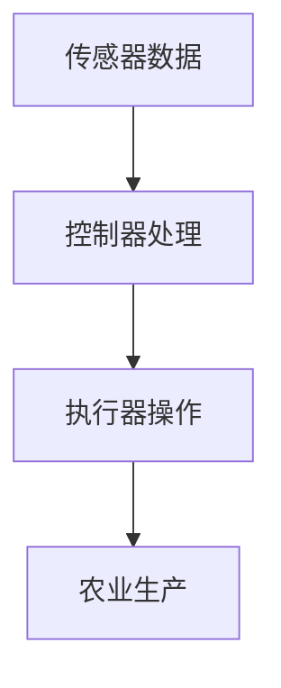
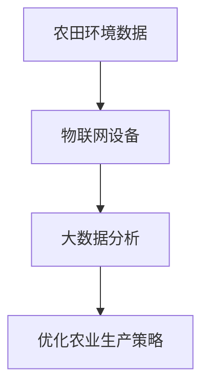
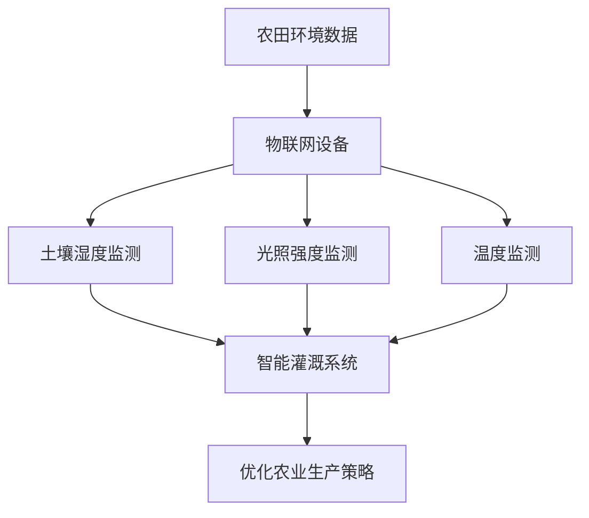
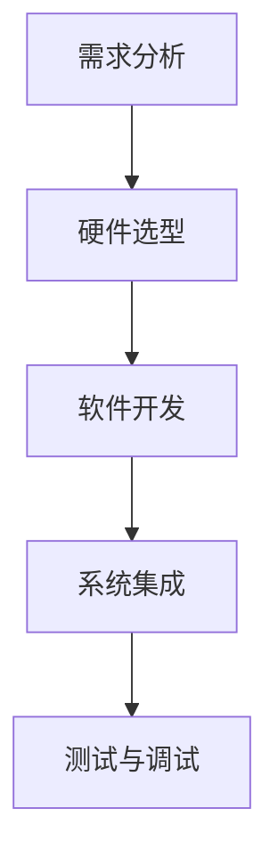
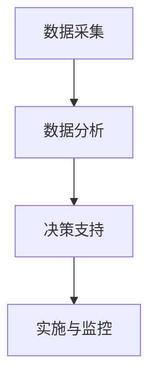
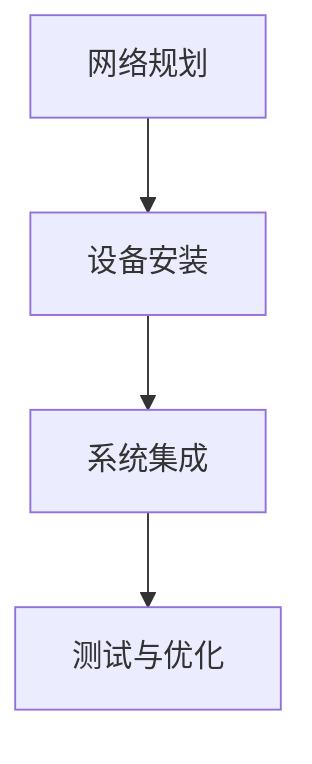
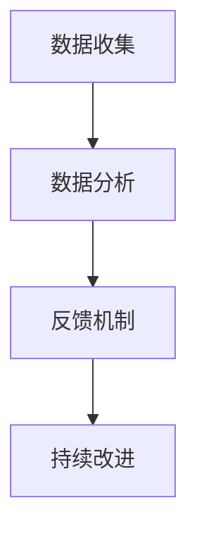

                 


### 篇章一：都市农业革命2.0计划概述

#### 1.1 问题背景

##### 1.1.1 都市农业现状

随着城市化进程的加速，都市农业成为了城市可持续发展的重要组成部分。都市农业不仅提供了丰富的农产品，还改善了城市生态环境，促进了城市经济和社会的协调发展。然而，当前都市农业面临着诸多挑战：

- **土地资源紧张**：城市土地资源有限，可用于农业的土地面积有限，如何在有限的土地上实现高效生产成为都市农业发展的一大难题。
- **生产效率低下**：传统都市农业生产方式依赖人力和经验，生产效率较低，难以满足城市居民日益增长的食物需求。
- **环境污染问题**：都市农业可能带来的环境污染问题，如土壤退化、水体污染等，需要得到有效控制。

##### 1.1.2 食物自给自足的挑战

实现城市食物自给自足是都市农业发展的核心目标，但这一目标面临着诸多挑战：

- **交通运输成本**：城市与农村之间的距离较远，农产品运输成本较高，影响了食物自给自足的实现。
- **技术依赖**：都市农业需要依赖现代农业技术，如自动化、物联网等，但技术获取和实施成本较高。
- **市场需求多样**：城市居民对农产品的种类和品质要求较高，如何满足这一需求成为都市农业发展的关键。

##### 1.1.3 都市农业革命2.0计划的意义

都市农业革命2.0计划旨在通过创新技术和新模式，实现城市食物自给自足。这一计划的意义在于：

- **提高生产效率**：利用现代农业技术，提高农业生产效率，满足城市居民的食物需求。
- **减少环境污染**：通过可持续的农业生产方式，减少环境污染，改善城市生态环境。
- **促进经济发展**：都市农业发展能够带动相关产业，促进城市经济繁荣。
- **提升居民生活质量**：实现城市食物自给自足，提升城市居民的生活质量，增强城市居民的幸福感和满意度。

#### 1.2 核心概念与联系

##### 1.2.1 智慧农业技术

智慧农业技术是都市农业2.0计划的核心技术之一，它利用大数据、云计算、物联网等现代信息技术，实现农业生产的智能化和自动化。智慧农业技术的主要特点包括：

- **数据驱动的决策**：通过收集和分析农业生产过程中的各种数据，实现精准农业管理，提高生产效率。
- **自动化控制系统**：利用自动化控制系统，实现农业生产的自动化，降低劳动力成本，提高生产效率。
- **物联网技术**：通过物联网技术，实现农业生产过程中的设备互联，提高农业生产的管理和监控能力。

##### 1.2.2 垂直农业

垂直农业是一种新型的农业生产模式，它通过在建筑物内部或建筑物外部垂直构建种植系统，实现高效、可持续的农业生产。垂直农业的主要特点包括：

- **高密度种植**：垂直农业通过多层种植系统，实现高密度种植，提高单位面积产量。
- **环境控制**：垂直农业通过环境控制系统，实现温、湿度、光照等环境参数的精确控制，提高作物生长质量。
- **节约土地资源**：垂直农业能够在有限的城市土地上实现高效的农业生产，节约土地资源。

##### 1.2.3 社区农业

社区农业是一种以社区为单位，通过居民共同参与，实现农产品自给自足的农业生产模式。社区农业的主要特点包括：

- **居民参与**：社区农业鼓励社区居民参与农业生产，提高居民对农产品的认知和认可度。
- **本地化生产**：社区农业强调本地化生产，减少农产品的运输距离，降低环境污染。
- **社会效益**：社区农业能够增强社区的凝聚力和互助精神，促进社会和谐发展。

##### 1.2.4 概念关系图

以下是智慧农业技术、垂直农业和社区农业的概念关系图：

```mermaid
graph TD
    A[智慧农业技术] --> B[数据驱动]
    A --> C[自动化控制]
    A --> D[物联网技术]
    B --> E[精准农业]
    C --> F[降低人力成本]
    D --> G[设备互联]
    H[垂直农业] --> I[J[高密度种植]]
    H --> K[L[环境控制]]
    H --> M[N[节约土地]]
    O[社区农业] --> P[居民参与]
    O --> Q[R[本地化生产]]
    O --> S[T[社会效益]]
    E --> U[V[提高产量]]
    F --> W[X[提高效率]]
    G --> Y[Z[提高监控]]
    I --> A
    J --> A
    K --> A
    L --> A
    M --> A
    N --> A
    P --> O
    Q --> O
    R --> O
    S --> O
    U --> E
    V --> F
    W --> C
    X --> D
    Y --> G
    Z --> H
```

#### 1.3 都市农业2.0计划的新模式

##### 1.3.1 城市农场

城市农场是都市农业2.0计划的一种重要模式，它利用城市中的空置土地或建筑物，建立高度自动化的农业生产系统。城市农场的主要特点包括：

- **自动化生产**：城市农场通过自动化控制系统，实现种植、灌溉、施肥等农业生产环节的自动化，提高生产效率。
- **高密度种植**：城市农场利用多层立体种植系统，实现高密度种植，提高单位面积产量。
- **环境控制**：城市农场通过环境控制系统，实现温、湿度、光照等环境参数的精确控制，提高作物生长质量。

##### 1.3.2 屋顶花园

屋顶花园是另一种都市农业2.0计划的重要模式，它利用建筑物的屋顶空间进行农业生产。屋顶花园的主要特点包括：

- **生态环保**：屋顶花园通过绿色植被和农业生产，改善城市生态环境，减少城市热岛效应。
- **休闲功能**：屋顶花园为城市居民提供了休闲和放松的空间，增强了城市生活的品质。
- **高密度种植**：屋顶花园通过多层种植系统，实现高密度种植，提高单位面积产量。

##### 1.3.3 室内种植

室内种植是都市农业2.0计划中的一种高效生产模式，它利用建筑物内部的空间进行农业生产。室内种植的主要特点包括：

- **全年生产**：室内种植不受季节和气候的限制，可以实现全年生产，满足城市居民对新鲜农产品的需求。
- **环境控制**：室内种植通过环境控制系统，实现温、湿度、光照等环境参数的精确控制，提高作物生长质量。
- **高密度种植**：室内种植通过多层立体种植系统，实现高密度种植，提高单位面积产量。

##### 1.3.4 模式比较与选择

以下是城市农场、屋顶花园和室内种植三种模式的比较表格：

| 模式       | 自动化程度 | 环境控制 | 产量 | 成本 | 适用场景         |
|------------|-------------|-----------|------|------|-----------------|
| 城市农场   | 高          | 强         | 高   | 中   | 大型空置土地     |
| 屋顶花园   | 中          | 中         | 中   | 低   | 建筑物屋顶       |
| 室内种植   | 中          | 强         | 高   | 高   | 建筑物内部空间   |

根据具体需求和条件，可以选择合适的模式进行推广。

#### 1.4 技术原理

##### 1.4.1 自动化控制系统

自动化控制系统是都市农业2.0计划的核心技术之一，它通过自动化设备和技术，实现农业生产的智能化和自动化。自动化控制系统的主要组成部分包括：

- **传感器**：用于实时监测土壤湿度、温度、光照等环境参数。
- **控制器**：根据传感器数据，自动调整灌溉、施肥、通风等农业生产环节。
- **执行器**：根据控制器的指令，执行具体的农业生产操作。

以下是自动化控制系统的流程图：



##### 1.4.2 精准农业技术

精准农业技术是都市农业2.0计划的重要技术之一，它通过大数据分析和物联网技术，实现农业生产的精准管理。精准农业技术的主要组成部分包括：

- **大数据分析**：通过收集和分析农业生产过程中的各种数据，优化农业生产策略。
- **物联网技术**：通过物联网设备，实时监测农田环境参数，实现农业生产的精准控制。

以下是精准农业技术的流程图：



##### 1.4.3 物联网在都市农业中的应用

物联网技术在都市农业中的应用，为农业生产的智能化和自动化提供了有力支持。物联网技术在都市农业中的应用主要包括：

- **环境监测**：通过物联网设备，实时监测农田环境参数，如土壤湿度、温度、光照等。
- **智能灌溉**：根据土壤湿度数据，自动调整灌溉时间和水量，实现精准灌溉。
- **智能施肥**：根据作物生长数据和土壤养分含量，自动调整施肥量和施肥时间。

以下是物联网在都市农业中的应用流程图：



#### 1.5 案例研究

##### 1.5.1 成功案例一

成功案例一是一家位于纽约的城市农场，通过自动化控制系统和精准农业技术，实现了高效率的农业生产。该城市农场的核心特点包括：

- **自动化生产**：通过自动化控制系统，实现了种植、灌溉、施肥等农业生产环节的自动化。
- **精准管理**：通过精准农业技术，实时监测农田环境参数，优化农业生产策略。

该城市农场取得了显著成效：

- **产量提高**：通过自动化和精准农业技术，农产品的产量提高了30%。
- **成本降低**：自动化减少了劳动力成本，提高了生产效率，降低了生产成本。
- **环境改善**：通过精准农业技术，减少了农药和化肥的使用，改善了农田生态环境。

##### 1.5.2 成功案例二

成功案例二是位于上海的一座屋顶花园，通过环境控制和智能灌溉技术，实现了全年无季节限制的农业生产。该屋顶花园的核心特点包括：

- **环境控制**：通过环境控制系统，实现了温、湿度、光照等环境参数的精确控制。
- **智能灌溉**：根据土壤湿度数据，自动调整灌溉时间和水量，实现精准灌溉。

该屋顶花园取得了显著成效：

- **全年生产**：通过环境控制和智能灌溉技术，实现了全年无季节限制的农业生产。
- **品质提高**：通过环境控制，提高了作物的生长质量和品质。
- **社会效益**：屋顶花园为城市居民提供了休闲和放松的空间，增强了城市生活的品质。

#### 1.6 挑战与解决方案

##### 1.6.1 资源限制

资源限制是都市农业2.0计划面临的主要挑战之一。解决资源限制的解决方案包括：

- **提高资源利用效率**：通过自动化和精准农业技术，提高农业生产的资源利用效率。
- **合理规划土地利用**：通过科学规划，合理利用城市土地资源，实现农业生产的高效发展。
- **推广节水灌溉技术**：采用节水灌溉技术，减少水资源的浪费。

##### 1.6.2 政策支持

政策支持是都市农业2.0计划成功推广的关键因素。解决政策支持的解决方案包括：

- **政府扶持政策**：政府应制定扶持政策，鼓励企业和个人投资都市农业。
- **税收优惠**：政府应给予都市农业企业税收优惠，降低企业成本。
- **资金支持**：政府应提供专项资金支持，用于都市农业的技术研发和推广。

##### 1.6.3 技术难题

技术难题是都市农业2.0计划实施过程中的一大挑战。解决技术难题的解决方案包括：

- **技术创新**：加强技术研发，推动自动化、物联网等技术的创新和应用。
- **人才培养**：加强人才培养，提高农业从业人员的技能水平。
- **技术培训**：为农业从业者提供技术培训，提高其技术能力。

#### 1.7 最佳实践与未来趋势

##### 1.7.1 最佳实践总结

在都市农业2.0计划的推广过程中，成功的关键在于：

- **技术创新**：通过自动化和精准农业技术，提高农业生产效率。
- **政策支持**：政府应制定扶持政策，鼓励企业和个人投资都市农业。
- **社区参与**：鼓励社区居民参与农业生产，提高农业生产的可持续性。
- **环境友好**：采用环保的农业生产方式，减少对环境的影响。

##### 1.7.2 未来发展趋势分析

未来，都市农业的发展趋势将包括：

- **智慧农业**：智慧农业技术将得到广泛应用，实现农业生产的智能化和自动化。
- **垂直农业**：垂直农业模式将得到进一步发展，通过多层立体种植系统，实现高效农业生产。
- **社区农业**：社区农业模式将得到普及，通过居民共同参与，实现农产品自给自足。
- **环境友好**：都市农业将更加注重环境保护，采用可持续的农业生产方式。

#### 1.8 本章小结

都市农业革命2.0计划通过创新技术和新模式，实现城市食物自给自足，具有重要意义。本文从问题背景、核心概念与联系、新模式讲解、技术原理、案例研究、挑战与解决方案等方面，对都市农业革命2.0计划进行了深入分析和探讨。未来，随着技术的不断进步和政策的支持，都市农业2.0计划将得到广泛应用，为城市可持续发展作出贡献。

### 篇章二：实施与推广

#### 2.1 实施规划

##### 2.1.1 调研与评估

在实施都市农业2.0计划之前，首先需要进行深入的调研和评估。调研内容包括：

- **市场需求**：了解城市居民对农产品的种类、品质和数量的需求，为制定生产计划提供依据。
- **资源条件**：评估城市土地、水资源等资源条件，确定适合的农业生产模式。
- **技术基础**：评估现有农业技术水平和基础设施建设情况，确定需要改进和提升的领域。

评估内容包括：

- **经济效益**：分析都市农业2.0计划的经济效益，包括生产成本、销售收入、投资回报等。
- **社会效益**：评估都市农业2.0计划对社会发展、居民生活质量提升等方面的贡献。
- **环境效益**：评估都市农业2.0计划对环境保护、资源节约等方面的效果。

##### 2.1.2 项目计划

在调研和评估的基础上，制定详细的项目计划。项目计划应包括以下内容：

- **目标设定**：明确都市农业2.0计划的目标，包括产量目标、品质目标、可持续发展目标等。
- **任务分工**：明确各个阶段的具体任务和责任分工，确保项目顺利进行。
- **时间安排**：制定项目的时间表，包括调研、设计、建设、运营等各阶段的时间安排。
- **预算编制**：编制项目的预算，包括人力、物力、财力等各项开支。

##### 2.1.3 资源配置

在实施都市农业2.0计划过程中，合理配置资源至关重要。资源配置包括以下几个方面：

- **土地资源**：根据生产模式，合理规划土地使用，确保农业生产有足够的空间。
- **水资源**：采用节水灌溉技术，合理利用水资源，确保农业生产的水需求。
- **技术资源**：引进先进的农业技术，提高农业生产的智能化和自动化水平。
- **人力资源**：培养专业的农业技术人员，确保项目顺利实施和运营。

##### 2.1.4 风险管理

在实施都市农业2.0计划过程中，风险管理至关重要。风险管理包括以下几个方面：

- **风险识别**：识别项目实施过程中可能面临的各种风险，如市场风险、技术风险、政策风险等。
- **风险评估**：评估各种风险的可能性和影响程度，确定风险等级。
- **风险应对**：制定应对各种风险的策略和措施，降低风险对项目的影响。
- **风险监控**：建立风险监控机制，实时跟踪风险的变化，及时调整应对措施。

#### 2.2 技术实施

##### 2.2.1 自动化控制系统搭建

自动化控制系统是都市农业2.0计划的核心技术之一，其搭建过程包括以下几个步骤：

1. **需求分析**：根据农业生产需求，明确自动化控制系统的功能和要求。
2. **硬件选型**：选择合适的传感器、控制器和执行器等硬件设备，确保系统的稳定性和可靠性。
3. **软件开发**：编写控制系统软件，实现传感器的数据采集、控制器的数据处理和执行器的动作控制等功能。
4. **系统集成**：将硬件设备和软件系统进行集成，确保系统能够正常运行。
5. **测试与调试**：对自动化控制系统进行测试和调试，确保系统功能完善、性能稳定。

以下是自动化控制系统的搭建流程图：



##### 2.2.2 精准农业技术应用

精准农业技术是提高农业生产效率和品质的关键技术，其应用过程包括以下几个步骤：

1. **数据采集**：利用传感器和物联网设备，采集农田环境参数和作物生长数据。
2. **数据分析**：利用大数据技术和人工智能算法，对采集到的数据进行分析和挖掘，提取有价值的信息。
3. **决策支持**：根据数据分析结果，制定精准农业管理策略，实现农业生产的智能化和自动化。
4. **实施与监控**：将精准农业管理策略付诸实施，并对农业生产过程进行实时监控和调整。

以下是精准农业技术的应用流程图：



##### 2.2.3 物联网系统部署

物联网系统是都市农业2.0计划的支撑技术之一，其部署过程包括以下几个步骤：

1. **网络规划**：根据农业生产需求，规划物联网系统的网络结构和设备布局。
2. **设备安装**：将传感器、控制器、执行器等设备安装在农田和养殖场等场所，确保设备的正常运行。
3. **系统集成**：将物联网设备与自动化控制系统、精准农业系统等进行集成，实现数据采集、传输、处理和反馈等功能。
4. **测试与优化**：对物联网系统进行测试和优化，确保系统稳定、可靠、高效运行。

以下是物联网系统部署的流程图：



##### 2.2.4 技术实施案例

以下是几个都市农业2.0计划的技术实施案例：

1. **城市农场自动化控制系统**：某城市农场采用自动化控制系统，实现了种植、灌溉、施肥等农业生产环节的自动化。系统采用传感器实时监测土壤湿度、温度、光照等环境参数，控制器根据参数数据自动调整灌溉和施肥时间，执行器执行具体的灌溉和施肥操作。自动化控制系统提高了农业生产效率，降低了劳动力成本。

2. **精准农业技术**：某农田采用精准农业技术，通过物联网设备采集土壤湿度、温度、光照等数据，利用大数据技术和人工智能算法进行分析和挖掘，制定精准农业管理策略。根据数据分析结果，农田实现了精准灌溉、施肥和病虫害防治，作物生长质量和产量显著提高。

3. **物联网系统**：某养殖场采用物联网系统，实现了养殖环境的实时监控和自动化管理。系统采用传感器实时监测温度、湿度、空气质量等参数，控制器根据参数数据自动调整通风和照明，执行器执行具体的通风和照明操作。物联网系统提高了养殖环境的舒适度，降低了养殖成本，提高了养殖效益。

#### 2.3 政策与支持

##### 2.3.1 政策环境分析

政策环境对都市农业2.0计划的实施具有重要意义。政策环境分析包括以下几个方面：

- **政策法规**：分析国家、地方关于农业、环保、土地使用等方面的法律法规，了解政策法规对都市农业2.0计划的支持程度。
- **政策扶持**：分析政府出台的扶持政策，如财政补贴、税收优惠、土地政策等，了解政策扶持对都市农业2.0计划的推动作用。
- **行业规范**：分析行业规范和标准，了解都市农业2.0计划的实施应符合哪些规范和标准。

##### 2.3.2 政府支持措施

为了推动都市农业2.0计划的实施，政府应采取一系列支持措施：

- **财政支持**：政府应设立专项资金，支持都市农业2.0计划的研究、开发和推广。
- **税收优惠**：政府应给予都市农业2.0计划企业税收优惠，降低企业成本，鼓励企业投入都市农业。
- **土地政策**：政府应制定合理的土地政策，支持都市农业2.0计划的实施，如提供优惠的土地使用政策、简化土地审批程序等。
- **技术支持**：政府应加强技术研发和技术推广，支持都市农业2.0计划的技术创新和应用。

##### 2.3.3 企业与政府合作

企业与政府合作是推动都市农业2.0计划实施的重要途径。企业与政府合作的内容包括：

- **政策对接**：企业应与政府相关部门对接，了解政策法规，争取政策支持。
- **技术研发**：企业与科研院所合作，共同研发适用于都市农业2.0计划的新技术和新产品。
- **项目申报**：企业应积极参与政府组织的项目申报，争取政府资金支持。
- **经验分享**：企业与政府共同分享实施都市农业2.0计划的经验和成果，推动行业共同发展。

##### 2.3.4 政策支持案例

以下是几个政策支持案例：

1. **某城市政府财政支持**：某城市政府设立了专项资金，支持都市农业2.0计划的研究和推广。政府提供了200万元资金，用于购买农业自动化设备和智能监控系统，提升了农业生产效率。

2. **某地方政府税收优惠**：某地方政府对从事都市农业的企业给予税收优惠，企业年销售额的5%可作为税收减免。这一政策鼓励了企业投资都市农业，促进了农业现代化发展。

3. **某省土地政策**：某省政府出台了土地政策，对从事都市农业的企业给予土地使用优惠。政府提供了1000亩土地，供企业免费使用，用于建设城市农场和屋顶花园。

#### 2.4 社区参与与教育

##### 2.4.1 社区参与的重要性

社区参与是都市农业2.0计划成功实施的关键因素之一。社区参与的重要性包括：

- **提高农业生产效率**：社区参与能够提供更多的劳动力资源，提高农业生产的效率。
- **提升居民生活质量**：社区参与能够提供新鲜、健康的农产品，提升居民的生活质量。
- **增强社区凝聚力**：社区参与能够增强社区的凝聚力，促进社区成员之间的交流和互动。

##### 2.4.2 教育与培训计划

为了提高社区参与度，需要制定相应的教育与培训计划。教育与培训计划包括：

- **农业技术培训**：为社区居民提供农业技术培训，提高他们的农业技术水平。
- **食品安全教育**：为社区居民提供食品安全教育，提高他们对农产品的认知和识别能力。
- **环境保护教育**：为社区居民提供环境保护教育，提高他们对环境保护的认识和行动。

##### 2.4.3 社区互动与反馈

社区互动与反馈是确保都市农业2.0计划顺利实施的重要环节。社区互动与反馈包括：

- **社区交流平台**：建立社区交流平台，如社区微信群、QQ群等，便于社区成员之间的交流和互动。
- **居民反馈机制**：建立居民反馈机制，收集居民对农产品质量和服务的意见和建议，及时进行改进。
- **社区活动**：定期组织社区活动，如农业展览、农产品品尝会等，增强社区成员之间的联系。

##### 2.4.4 社区参与案例

以下是几个社区参与案例：

1. **某社区屋顶花园**：某社区在屋顶建立了花园，由社区居民共同参与种植和养护。社区组织定期开展种植培训，提高居民的种植技能。屋顶花园不仅为居民提供了新鲜、健康的农产品，还增强了社区的凝聚力。

2. **某社区农业合作社**：某社区成立了农业合作社，由社区居民共同投资、共同经营。合作社采用现代化农业技术，提高农业生产效率，生产的农产品在社区内进行销售。社区居民通过合作社获得了稳定的收入，生活质量得到了提升。

3. **某社区环保行动**：某社区开展了环保行动，鼓励居民参与垃圾分类、节能减排等活动。社区组织开展了环保知识讲座，提高居民的环保意识。通过社区环保行动，社区环境得到了显著改善，居民的幸福感和满意度提高。

#### 2.5 营销与推广

##### 2.5.1 品牌建设

品牌建设是都市农业2.0计划成功推广的重要环节。品牌建设包括以下几个方面：

- **品牌定位**：明确都市农业2.0计划的品牌定位，如高品质、环保、健康等。
- **品牌形象**：设计具有独特性和辨识度的品牌形象，如品牌标识、包装设计等。
- **品牌传播**：利用多种渠道进行品牌传播，如社交媒体、广告宣传等，提高品牌知名度和美誉度。

##### 2.5.2 市场营销策略

市场营销策略是确保都市农业2.0计划成功推广的关键。市场营销策略包括以下几个方面：

- **市场调研**：了解目标市场的需求、消费习惯和购买力，制定合适的市场营销策略。
- **产品定位**：根据市场调研结果，确定产品的市场定位，如高端、中端等。
- **渠道选择**：选择合适的销售渠道，如社区直销、超市销售、电商平台等。
- **价格策略**：根据市场情况和产品定位，制定合理的价格策略，如高价位、中价位等。
- **促销活动**：定期举办促销活动，如打折、赠品等，吸引消费者购买。

##### 2.5.3 网络推广

网络推广是都市农业2.0计划成功推广的重要手段。网络推广包括以下几个方面：

- **网站建设**：建立品牌官方网站，展示产品和服务，提供在线购买渠道。
- **社交媒体推广**：利用社交媒体平台，如微信、微博、抖音等，进行品牌宣传和产品推广。
- **搜索引擎优化**（SEO）：优化网站内容和结构，提高在搜索引擎中的排名，吸引更多潜在客户。
- **搜索引擎营销**（SEM）：通过投放广告，提高在搜索引擎中的曝光度，吸引潜在客户。

##### 2.5.4 成功推广案例

以下是几个成功推广案例：

1. **某城市农场**：某城市农场通过品牌建设、市场营销策略和网络推广，成功打开了市场。农场推出了高品质的有机农产品，吸引了大量消费者。农场通过社交媒体和官方网站，与消费者建立了良好的互动，提高了品牌知名度和美誉度。

2. **某社区农业合作社**：某社区农业合作社通过品牌建设、市场营销策略和网络推广，成功实现了农产品销售。合作社推出了多种农产品，如蔬菜、水果、肉类等，满足了社区居民的需求。合作社通过社交媒体和电商平台，与消费者建立了稳定的联系，实现了农产品的快速销售。

3. **某屋顶花园**：某屋顶花园通过品牌建设、市场营销策略和网络推广，成功吸引了大量游客。花园推出了丰富的观光和体验项目，如种植体验、采摘体验等，吸引了大量游客。花园通过官方网站和社交媒体，宣传推广项目，提高了知名度和美誉度。

#### 2.6 持续改进与创新

##### 2.6.1 数据分析与反馈

持续改进是都市农业2.0计划成功实施的重要保证。数据分析与反馈包括以下几个方面：

- **数据收集**：收集农业生产过程中的各种数据，如产量、品质、成本等。
- **数据分析**：利用数据分析技术，对收集到的数据进行处理和分析，发现存在的问题和改进机会。
- **反馈机制**：建立反馈机制，将数据分析结果及时反馈给相关部门和人员，推动改进措施的落实。

以下是数据分析与反馈的流程图：



##### 2.6.2 持续改进策略

持续改进策略包括以下几个方面：

- **技术改进**：根据数据分析结果，优化农业技术，提高生产效率和品质。
- **管理改进**：优化生产管理，提高管理水平，降低生产成本。
- **员工培训**：加强员工培训，提高员工的技能和素质，提升生产效率。
- **设备升级**：根据实际需求，更新和升级生产设备，提高生产效率和安全性。

##### 2.6.3 创新实践

创新实践是推动都市农业2.0计划发展的重要动力。创新实践包括以下几个方面：

- **新技术应用**：积极引进和应用新技术，如物联网、人工智能等，提高农业生产效率和品质。
- **新模式探索**：探索新的农业生产模式，如共享农业、智慧农业等，提高农业生产的可持续性。
- **产品创新**：开发新产品，满足市场需求，提高产品竞争力。
- **服务创新**：创新服务模式，提供更多增值服务，提高用户体验。

##### 2.6.4 创新案例

以下是几个创新案例：

1. **智慧农场**：某农场引进了物联网技术，实现了农业生产过程的智能化和自动化。通过传感器实时监测农田环境参数，控制器自动调整灌溉、施肥等农业生产环节。智慧农场提高了生产效率，降低了生产成本，取得了显著的经济效益。

2. **共享农业**：某社区推出了共享农业项目，居民可以购买土地份额，共同参与农业生产。项目提供了种植、管理、收获等全过程服务，让居民体验农业生产的乐趣。共享农业项目不仅提高了农业生产效率，还增强了社区的凝聚力。

3. **农产品溯源**：某农场建立了农产品溯源系统，消费者可以通过扫描二维码，了解农产品的生产过程、品质等信息。农产品溯源系统提高了消费者对农产品的信任度，增加了产品的市场竞争力。

#### 2.7 本章小结

实施与推广是都市农业2.0计划成功的关键环节。本章从实施规划、技术实施、政策支持、社区参与、营销推广、持续改进与创新等方面，对都市农业2.0计划的实施与推广进行了详细阐述。通过合理的规划和技术实施，有效的政策支持，社区的广泛参与，以及创新的营销手段，都市农业2.0计划将能够成功推广，为城市可持续发展作出贡献。

### 篇章三：未来展望

#### 3.1 持续发展

##### 3.1.1 可持续发展的概念

可持续发展是指在满足当前需求的同时，不损害后代满足其需求的能力。在都市农业2.0计划中，可持续发展体现在以下几个方面：

- **资源节约**：通过高效利用土地、水资源等资源，减少资源浪费，实现农业生产的可持续发展。
- **环境保护**：采用环保的农业生产方式，减少农业活动对环境的负面影响，保护生态环境。
- **经济繁荣**：通过农业生产的持续发展，促进城市经济的繁荣，提高居民生活水平。

##### 3.1.2 都市农业在可持续发展中的作用

都市农业在可持续发展中发挥着重要作用：

- **提供食物来源**：都市农业能够为城市居民提供新鲜、安全的农产品，满足食物需求，减少对远距离农产品供应的依赖。
- **改善城市环境**：都市农业通过绿化、空气净化等措施，改善城市环境，提升城市居民的生活质量。
- **促进经济发展**：都市农业的发展能够带动相关产业，如物流、包装、餐饮等，促进城市经济的繁荣。
- **社会效益**：都市农业能够增强社区凝聚力，提高居民的参与度和满意度，促进社会和谐发展。

##### 3.1.3 持续发展策略

为了实现都市农业的可持续发展，需要采取以下策略：

- **技术创新**：引进和应用新技术，提高农业生产效率，减少资源消耗。
- **政策支持**：制定扶持政策，鼓励企业和个人投资都市农业，推动农业现代化发展。
- **教育培训**：加强农业技术培训，提高农业从业人员的技能水平，促进农业生产的持续改进。
- **社区参与**：鼓励社区居民参与农业生产，提高农业生产的可持续性和社会效益。

#### 3.2 环境影响

##### 3.2.1 城市农业的环境效益

城市农业在环境保护方面具有显著效益：

- **减少温室气体排放**：通过绿色植被的种植，吸收二氧化碳，减少温室气体排放，缓解全球气候变化。
- **改善空气质量**：城市农业通过植物光合作用，净化空气中的有害物质，改善城市空气质量。
- **水资源管理**：城市农业采用节水灌溉技术，减少水资源消耗，改善水资源管理。
- **土壤保护**：通过合理的农业管理，防止土壤侵蚀，提高土壤肥力，保护土壤资源。

##### 3.2.2 环境影响评估

为了确保都市农业的环境效益，需要对其进行环境影响评估：

- **环境影响因素**：识别农业生产过程中的潜在环境影响因素，如农药、化肥使用，土地开发等。
- **环境影响程度**：评估各项环境影响因素的潜在影响程度，确定其重要性。
- **环境影响措施**：制定环境保护措施，如减少农药使用、推广有机农业等，降低环境影响。

##### 3.2.3 减少环境影响的措施

为了减少都市农业的环境影响，需要采取以下措施：

- **绿色农业技术**：推广绿色农业技术，如有机农业、精准农业等，减少农药和化肥的使用。
- **环境监测**：建立环境监测系统，实时监测农田环境参数，及时发现并处理环境问题。
- **政策引导**：制定环境保护政策，鼓励企业和个人采用环保的农业生产方式，减少环境影响。
- **公众参与**：提高公众对环境保护的认识和参与度，共同推动环境保护工作。

#### 3.3 社会经济影响

##### 3.3.1 城市农业的经济效益

城市农业具有显著的经济效益：

- **农产品销售收入**：通过城市农业，城市居民可以享受到新鲜、安全的农产品，增加消费需求，提高销售收入。
- **就业机会**：城市农业的发展能够创造大量的就业机会，包括农业生产、物流配送、市场营销等。
- **产业链发展**：城市农业的发展能够带动相关产业链的发展，如农业生产资料、农产品加工、餐饮服务等。
- **税收贡献**：城市农业的发展能够增加税收收入，为城市经济发展提供资金支持。

##### 3.3.2 社会效益分析

城市农业的社会效益包括：

- **生活质量提升**：城市农业的发展能够提高城市居民的生活质量，提供新鲜、健康的农产品，改善饮食结构。
- **社区凝聚力增强**：城市农业的社区参与，能够增强社区的凝聚力和互助精神，促进社会和谐发展。
- **教育意义**：城市农业的教育意义，通过农业体验和教育活动，提高公众对农业的认识和了解，培养农业技术人才。

##### 3.3.3 经济发展潜力

城市农业具有巨大的经济发展潜力：

- **技术创新**：随着技术的进步，城市农业的智能化、自动化水平将不断提高，为农业发展提供新的动力。
- **市场拓展**：随着消费者对农产品品质和安全性要求的提高，城市农业的市场潜力将不断增大。
- **产业链延伸**：城市农业的发展将带动相关产业链的延伸，如农业旅游、农产品加工等，为经济发展提供新的增长点。

#### 3.4 未来发展展望

##### 3.4.1 技术发展

未来，都市农业将不断向智能化、自动化、精准化方向发展：

- **物联网技术**：物联网技术将在都市农业中广泛应用，实现农田环境监测、智能灌溉、精准施肥等功能。
- **人工智能**：人工智能技术在农业领域的应用，将提高农业生产效率，优化农业管理决策。
- **生物技术**：生物技术的进步，将推动农作物的品种改良和病虫害防治，提高农产品品质和产量。

##### 3.4.2 模式创新

未来，都市农业的发展将呈现多样化、创新化的趋势：

- **垂直农业**：垂直农业模式将继续发展，通过多层立体种植系统，实现高效、可持续的农业生产。
- **共享农业**：共享农业模式将得到普及，居民可以通过购买土地份额，共同参与农业生产，享受农产品收益。
- **城市农业综合体**：城市农业综合体将形成，通过农业、旅游、文化、娱乐等多产业的融合发展，实现城市农业的多元化发展。

##### 3.4.3 社会参与

未来，城市农业的发展将更加注重社会参与和公众教育：

- **社区农业**：社区农业将得到进一步推广，鼓励社区居民共同参与农业生产，提高农业生产的可持续性和社会效益。
- **教育农业**：通过农业教育和体验活动，提高公众对农业的认识和了解，培养农业技术人才。
- **公众参与**：鼓励公众参与都市农业的决策和管理，提高公众对城市农业发展的参与度和满意度。

##### 3.4.4 可持续发展

未来，都市农业的发展将更加注重可持续发展：

- **资源节约**：通过技术创新和管理优化，提高农业生产的资源利用效率，减少资源浪费。
- **环境保护**：采用环保的农业生产方式，减少农业活动对环境的负面影响，保护生态环境。
- **经济繁荣**：通过农业生产的持续发展，促进城市经济的繁荣，提高居民生活水平。

#### 3.5 本章小结

未来，都市农业的发展将朝着智能化、自动化、精准化、可持续化的方向不断前进。通过技术创新、模式创新、社会参与和可持续发展策略，都市农业将为城市可持续发展作出更大贡献。同时，都市农业的发展也将为城市居民提供新鲜、安全、高品质的农产品，提高居民的生活质量，促进社会和谐发展。

### 文章总结

本文从都市农业革命2.0计划的背景、核心概念、新模式、技术原理、案例研究、挑战与解决方案、实施与推广以及未来展望等方面，对都市农业2.0计划进行了全面深入的探讨。都市农业2.0计划通过创新技术和新模式，实现城市食物自给自足，具有显著的生态、经济和社会效益。

为了实现都市农业2.0计划的顺利实施和推广，我们需要：

- **技术创新**：不断引进和应用新技术，提高农业生产效率和质量。
- **政策支持**：制定和落实相关政策，鼓励企业和个人投资都市农业，提供资金和技术支持。
- **社区参与**：鼓励社区居民共同参与农业生产，提高农业生产的可持续性和社会效益。
- **市场营销**：加强品牌建设和市场营销，提高都市农业产品的知名度和市场占有率。

未来，随着技术的不断进步和政策的支持，都市农业2.0计划将得到广泛应用，为城市可持续发展作出重要贡献。同时，都市农业的发展也将为城市居民提供新鲜、安全、高品质的农产品，提高居民的生活质量，促进社会和谐发展。

### 作者信息

作者：AI天才研究院/AI Genius Institute & 禅与计算机程序设计艺术 /Zen And The Art of Computer Programming

感谢您阅读本文，希望本文对您了解都市农业革命2.0计划有所帮助。如果您有任何疑问或建议，欢迎在评论区留言，我们会及时回复。同时，也欢迎关注我们的其他文章，获取更多关于计算机编程、人工智能等领域的最新资讯和技术分享。再次感谢您的支持！

