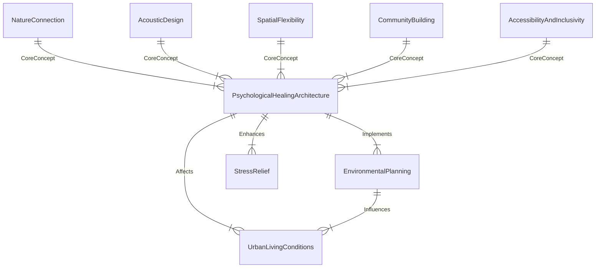

                 

### Introduction and Overview

#### Problem Background

In the modern era, the pace of urban life has accelerated, leading to increased stress and mental health issues among urban residents. The bustling atmosphere, long working hours, and the incessant noise of cities can contribute significantly to elevated stress levels. Chronic stress can negatively impact physical and mental well-being, leading to a variety of health problems, including cardiovascular disease, anxiety, and depression. It is crucial to address these issues through innovative architectural design that promotes psychological healing and stress relief in urban environments.

#### Problem Description

The primary stressors in urban environments can be categorized into several key areas:

1. **Noise Pollution:** High levels of ambient noise, such as traffic and construction sounds, can disrupt the tranquility of urban living and contribute to stress.
2. **Crowded Spaces:** Overcrowded public spaces, such as subways, parks, and shopping areas, can lead to a sense of claustrophobia and increase stress levels.
3. **Lack of Greenery:** Urban sprawl often results in a scarcity of green spaces, which are known to have a calming effect on the mind and body.
4. **Long Commutes:** Time spent commuting can be stressful, especially in congested traffic conditions.
5. **Social Isolation:** In urban areas, the fast pace of life can lead to social isolation and a lack of meaningful connections.

These stressors have a cumulative effect, making it essential to design urban environments that address these issues effectively.

#### Problem Solution

The solution to alleviating stress in urban environments lies in the principles of psychological healing architectural design. By incorporating specific design strategies and techniques, architects can create spaces that promote relaxation, well-being, and a sense of community. Environmental planning plays a critical role in this process by strategically organizing and designing urban spaces to mitigate stressors and enhance the quality of life.

#### Boundaries and Extension

The scope of this book will focus on the fundamental principles and practical applications of urban psychological healing architectural design. We will explore various design strategies and techniques that can be implemented in urban environments to create stress-relieving spaces. While the primary focus will be on architectural design, this book will also touch upon related fields such as urban planning, environmental psychology, and public health.

This book will not delve into detailed technical aspects of construction or engineering but will instead provide a comprehensive overview of the conceptual framework and practical applications of psychological healing architectural design. It will also discuss the potential future developments and trends in this field.

### Core Concepts and Principles

#### Key Concepts

In the realm of urban psychological healing architectural design, several key concepts and terms are essential to understand:

1. **Psychological Healing Architecture:** This refers to the design of architectural spaces that promote psychological well-being and healing through the use of specific elements such as natural light, greenery, water features, and acoustics.
2. **Environmental Planning:** This involves the strategic organization and design of urban spaces to create functional and aesthetically pleasing environments that enhance the quality of life.
3. **Stress Relief:** The process of alleviating stress through various design interventions, such as creating calm spaces, reducing noise, and incorporating natural elements.
4. **Urban Living Conditions:** The overall environment in which urban residents live, including factors such as noise levels, green space availability, and social connectivity.

#### Principles of Urban Psychological Healing Architectural Design

The principles of urban psychological healing architectural design are based on a deep understanding of human behavior and the psychological impacts of the built environment. Here are some of the core principles:

1. **Nature Connection:** Incorporating natural elements such as plants, water features, and natural light can significantly reduce stress and improve mood.
2. **Acoustic Design:** Managing noise levels through sound insulation, sound-absorbing materials, and strategic placement of buildings can create calm and quiet spaces.
3. **Spatial Flexibility:** Designing spaces that can be easily reconfigured to meet the needs of different activities and user groups can promote a sense of control and reduce stress.
4. **Community Building:** Creating communal spaces that foster social interaction and a sense of belonging can alleviate feelings of isolation.
5. **Accessibility and Inclusivity:** Ensuring that all residents, regardless of age, ability, or socio-economic status, have equal access to stress-relieving spaces is crucial for a comprehensive approach.

#### Relationship Diagram

To illustrate the relationship between these core concepts and principles, we can create an ER (Entity-Relationship) diagram using Mermaid. Here's an example of how this might look in Markdown format:

This diagram shows how the key concepts and principles are interconnected, forming a comprehensive framework for urban psychological healing architectural design. By understanding and applying these principles, architects and urban planners can create environments that promote mental well-being and enhance the quality of urban living.

