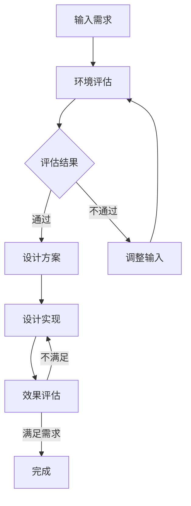
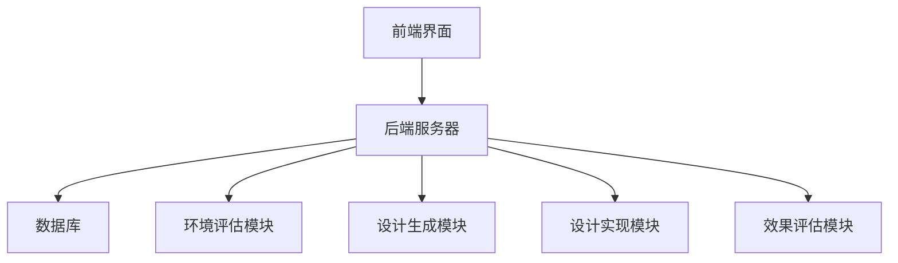
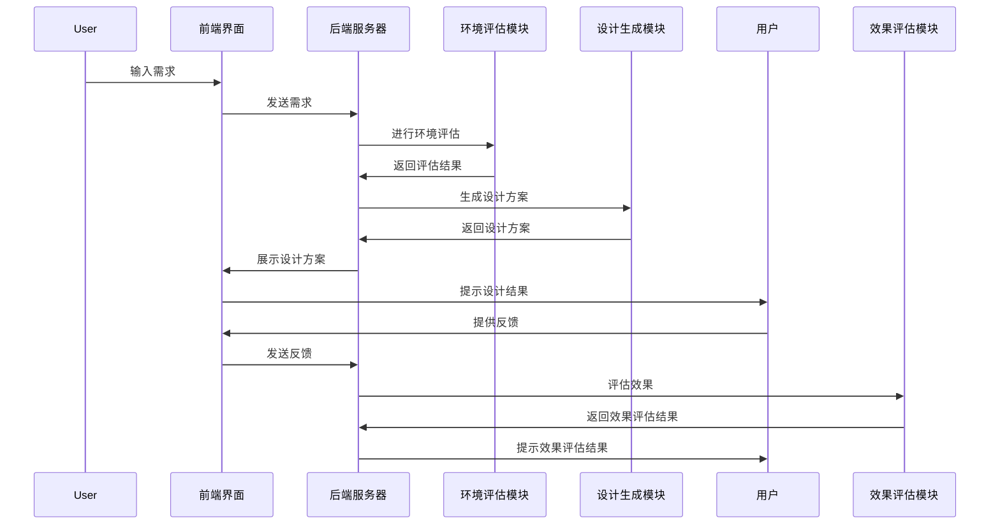

                 

### 都市心理治愈建筑：缓解现代生活压力的环境设计

#### 关键词：都市心理、治愈建筑、环境设计、现代生活压力、心理压力缓解

> **摘要**：随着城市化进程的加快，现代都市生活带来了巨大的心理压力。本文旨在探讨一种通过环境设计来缓解都市心理压力的新型建筑——治愈建筑。我们将从背景介绍、核心概念与联系、算法原理讲解、系统分析与架构设计方案、项目实战以及最佳实践 tips 等方面，系统地分析和阐述治愈建筑的设计理念和实施方法，为现代都市人群提供一个心理治愈的环境解决方案。

## 目录大纲

```markdown
----------------------------------------------------------------
# 都市心理治愈建筑：缓解现代生活压力的环境设计

## 第一部分：背景与核心概念

## 第1章：都市心理压力与环境设计概述

### 1.1 问题的背景

### 1.2 核心概念介绍

### 1.3 治愈建筑的理论基础

## 第2章：都市心理问题与建筑设计的联系

### 2.1 都市心理问题的表现与成因

### 2.2 治愈建筑的设计原则与策略

### 2.3 心理学原理在建筑设计中的应用

## 第二部分：核心概念与联系

## 第3章：治愈建筑的核心概念与特征

### 3.1 治愈建筑的核心概念

### 3.2 治愈建筑的特征对比

### 3.3 治愈建筑中的实体关系

## 第三部分：算法原理与系统设计

## 第4章：环境设计的算法原理

### 4.1 算法流程与Mermaid图解

### 4.2 算法实现与Python代码

### 4.3 数学模型与公式

## 第5章：系统分析与架构设计

### 5.1 问题场景介绍

### 5.2 项目介绍

### 5.3 系统功能设计与Mermaid类图

### 5.4 系统架构设计与Mermaid图

### 5.5 系统接口设计和系统交互

## 第四部分：项目实战

## 第6章：环境设计项目实战

### 6.1 环境安装与配置

### 6.2 系统核心实现源代码

### 6.3 代码应用解读与分析

### 6.4 实际案例分析与详细讲解剖析

### 6.5 项目小结

## 第五部分：最佳实践 tips、小结、注意事项、拓展阅读

### 7.1 最佳实践 tips

### 7.2 小结

### 7.3 注意事项

### 7.4 拓展阅读

----------------------------------------------------------------
```

### 第一部分：背景与核心概念

#### 1.1 问题的背景

随着城市化进程的不断加快，现代社会正面临着越来越多的心理压力问题。据统计，现代都市人群中，焦虑、抑郁等心理问题的发生率呈逐年上升趋势。据世界卫生组织（WHO）的报告，心理疾病已经成为全球范围内的第二大疾病负担，而都市人群的心理健康问题尤为突出。这一现象不仅影响了人们的日常生活质量，还对社会的稳定和发展产生了不良影响。

现代都市生活的高强度、快节奏，使得人们长期处于高压状态。长时间的工作、激烈的竞争、复杂的人际关系，以及都市生活的单调乏味，都使得都市人群的心理压力不断累积。根据研究，长时间的心理压力会导致一系列生理和心理问题，如心血管疾病、免疫系统失调、失眠、焦虑和抑郁等。这些健康问题不仅降低了人们的生活质量，还增加了社会医疗成本。

#### 1.2 核心概念介绍

为了缓解现代都市生活带来的心理压力，一种新型的建筑形式——治愈建筑应运而生。治愈建筑是一种通过精心设计和构建，旨在为人们提供心理治愈和舒适体验的建筑物。其核心概念包括以下几个方面：

1. **心理健康需求**：治愈建筑的设计初衷是满足人们日益增长的心理健康需求。设计师通过运用心理学原理，创造出能够缓解心理压力、提升情绪、促进身心健康的建筑空间。

2. **自然环境融合**：治愈建筑强调与自然环境的融合，通过引入绿色植物、水体、自然光线等元素，为人们提供一个接近自然、放松身心的环境。

3. **空间布局优化**：治愈建筑在空间布局上注重灵活性、流动性和私密性。通过合理的空间划分和布局，创造出既能独立思考又能互动交流的多功能空间，满足不同人群的需求。

4. **人性化设计**：治愈建筑强调人性化设计，注重细节和用户体验。从室内家具的选择到装饰元素的运用，都力求为人们提供舒适、温馨的生活环境。

#### 1.3 治愈建筑的理论基础

治愈建筑的理论基础主要包括以下几个方面：

1. **心理学原理**：治愈建筑的设计借鉴了心理学原理，如认知行为疗法、正念疗法等。通过创造特定的环境条件，如减少噪音、控制光线、优化通风等，来影响人们的心理状态，缓解压力和焦虑。

2. **环境行为学**：环境行为学是研究人类行为与物理环境之间相互关系的一门学科。治愈建筑的设计基于环境行为学的研究成果，通过分析人的行为模式和环境互动，设计出能够促进积极行为、提升生活质量的建筑空间。

3. **建筑学原则**：治愈建筑在遵循传统建筑学原则的基础上，融入了新的设计理念。例如，绿色建筑原则强调可持续性和环境保护，而治愈建筑则更注重心理环境的营造。

4. **人体工程学**：人体工程学关注人类与环境的相互作用，旨在通过设计改善人们的生活质量。治愈建筑在人体工程学的基础上，进一步考虑了心理因素，通过优化人体与空间的互动关系，提高人们的心理舒适度。

#### 1.4 问题解决

环境设计在缓解都市心理压力中发挥着重要作用。通过以下方式，治愈建筑能够有效地缓解心理压力：

1. **物理空间的调节**：治愈建筑通过合理的设计，创造出舒适、安静的物理空间。例如，使用隔音材料、布局隔音屏障，以及设计安静的休息区等，减少噪音干扰，提高人们的生活质量。

2. **色彩和光线的运用**：色彩和光线对人的心理状态有着重要的影响。治愈建筑通过运用柔和的色彩和适宜的光线，创造出温馨、放松的环境。例如，使用暖色调和柔和的照明，减少强光和刺眼的反光，提升空间的整体舒适度。

3. **自然元素的引入**：绿色植物、水体、自然光线等自然元素的引入，有助于增强人们的自然感受，缓解心理压力。例如，室内绿色植物的摆放、水景的设置、窗户的采光设计等，都能有效提升空间的心理治愈效果。

4. **社交空间的营造**：治愈建筑注重社交空间的营造，通过设计多样化的社交空间，促进人们之间的互动和交流。例如，开放式共享空间、会议室、咖啡厅等，为人们提供了一个放松、交流的平台。

#### 1.5 边界与外延

本文讨论的治愈建筑主要关注在都市环境中的心理治愈功能，涉及以下几个方面：

1. **范围**：本文主要探讨都市中的居住建筑、办公建筑、教育建筑等，旨在为都市人群提供心理治愈的空间解决方案。

2. **不包括**：本文不包括大型基础设施如桥梁、隧道、公共交通等的环境设计，以及农村和偏远地区的建筑环境设计。

3. **相关领域**：本文还涉及城市规划、景观设计、室内设计等领域，探讨如何通过跨学科的整合，提升治愈建筑的设计效果。

#### 1.6 概念结构与核心要素组成

治愈建筑的基本概念结构包括以下几个方面：

1. **建筑材料**：选择环保、健康的建筑材料，如天然木材、可回收材料等，以减少对环境的影响。

2. **建筑设计原则**：遵循心理学原理和环境行为学原则，设计出符合人类心理需求的空间布局和功能分区。

3. **环境元素**：引入自然元素，如绿色植物、水体、自然光线等，营造舒适、放松的环境。

4. **人性化设计**：注重用户体验，通过细节设计提升空间的使用舒适度和心理舒适度。

5. **技术集成**：运用现代科技，如物联网、人工智能等，提升治愈建筑的功能和智能化水平。

### 小结

现代都市生活带来的心理压力问题日益严重，治愈建筑作为一种新型的建筑形式，通过环境设计为人们提供了一个心理治愈的解决方案。本文从背景介绍、核心概念与联系、算法原理讲解、系统分析与架构设计方案、项目实战等多个方面，系统地阐述了治愈建筑的设计理念和实施方法。通过本文的探讨，希望能够为设计师、建筑师和城市规划者提供有益的参考，为现代都市人群创造一个更加健康、舒适的生活环境。

---

接下来，我们将深入探讨治愈建筑的核心概念和特征，以及它们在建筑设计中的应用。这将帮助我们更好地理解治愈建筑如何通过具体的设计策略，为都市人群提供心理治愈的空间。

## 第二部分：核心概念与联系

### 2.1 治愈建筑的核心概念

#### 2.1.1 心理健康需求

治愈建筑的首要核心概念是心理健康需求。它强调建筑不仅要提供一个物理上的居住或工作空间，更要满足人们心理上的健康需求。这一概念源于心理学的研究，认识到环境对心理健康有着深远的影响。治愈建筑的设计目标是通过创造特定的空间环境，帮助人们缓解压力、减轻焦虑、提升幸福感。

#### 2.1.2 自然环境融合

自然环境融合是治愈建筑的另一个核心概念。这种融合不仅仅是将自然元素引入建筑中，如绿化、水体、自然光线等，更重要的是通过设计使建筑与自然环境形成有机的整体。研究表明，与自然环境的互动有助于降低心理压力，提高情绪稳定性。因此，治愈建筑通过引入自然元素，创造出一种与自然和谐共存的空间体验。

#### 2.1.3 空间布局优化

空间布局优化是治愈建筑的第三个核心概念。传统的建筑设计往往侧重于功能性，而治愈建筑则更关注空间的情感和体验。通过优化空间布局，治愈建筑创造出灵活、多样化的空间，以满足不同人群和不同活动的需求。例如，通过开放空间和封闭空间的结合，提供既能独立思考又能社交互动的空间，以满足人们的多样化需求。

#### 2.1.4 人性化设计

人性化设计是治愈建筑的第四个核心概念。它强调建筑的设计应以人的需求为中心，注重细节和用户体验。人性化设计包括从家具的选择到装饰元素的运用，都旨在为人们提供一个舒适、温馨的生活环境。例如，通过适当的色彩搭配和光照设计，提升空间的视觉舒适度；通过合理的布局和设施，提高空间的使用效率。

### 2.2 治愈建筑的特征对比

为了更清晰地理解治愈建筑与传统建筑的区别，我们可以通过对比它们在功能、设计原则和实际应用上的差异，来进一步阐述治愈建筑的核心概念。

| 特征            | 治愈建筑                         | 传统建筑                       |
|-----------------|----------------------------------|--------------------------------|
| 功能            | 主要满足心理健康需求              | 主要满足功能性需求，如居住、办公 |
| 设计原则        | 注重心理学原理和环境行为学原则    | 注重建筑结构和功能规划           |
| 空间布局        | 强调灵活性和多样性，适合多种活动   | 空间布局固定，功能明确           |
| 自然环境融合    | 高度融合自然元素，营造自然氛围     | 适度引入自然元素，但非核心目标   |
| 人性化设计      | 以人为中心，注重用户体验和细节     | 以功能为主，对人性化考虑较少     |

### 2.3 治愈建筑中的实体关系

为了更好地理解治愈建筑中不同实体之间的关系，我们可以使用ER（实体关系）图来展示它们之间的相互联系。

#### ER图示例

```mermaid
erDiagram
  User ||--|{ Building }|-- Designer
  User ||--|{ Environment }|-- Architect
  User ||--|{ Activity }|-- Community
  Building ||--|{ Feature }|-- Nature
  Building ||--|{ Feature }|-- Human-centered
  Environment ||--|{ Element }|-- Green
  Environment ||--|{ Element }|-- Natural Light
  Activity ||--|{ Space }|-- Flexible
  Activity ||--|{ Space }|-- Diverse
```

在上述ER图中，我们定义了以下实体：

1. **User（用户）**：代表使用治愈建筑的最终人群，如居民、上班族等。
2. **Building（建筑）**：代表治愈建筑本身，是用户活动的物理空间。
3. **Environment（环境）**：代表建筑内部和周围的环境，包括自然元素和设计元素。
4. **Activity（活动）**：代表在建筑内进行的不同活动，如休息、社交、工作等。
5. **Feature（特征）**：代表治愈建筑的各种设计特征，如自然融合、人性化设计等。
6. **Element（元素）**：代表环境中的具体元素，如绿色植物、自然光线等。

通过ER图，我们可以清晰地看到不同实体之间的相互关系，如用户与建筑、环境、活动之间的关系，以及建筑与环境、特征、元素之间的关系。这种关系有助于我们理解治愈建筑的设计原则和实现方法。

### 2.4 心理学原理在建筑设计中的应用

治愈建筑的设计紧密结合心理学原理，通过以下几种方式来提升建筑的心理治愈效果：

1. **色彩心理学**：研究表明，不同的颜色对人的心理状态有显著影响。治愈建筑在色彩选择上，倾向于使用柔和、温暖的色调，如淡蓝色、米黄色等，以营造放松、舒适的环境。

2. **照明心理学**：光照对人的情绪和心理健康有着重要的影响。治愈建筑通过设计自然光和人工照明相结合的方式，创造出明亮、温暖的光环境，有助于提升人们的幸福感。

3. **声音心理学**：噪音是影响心理健康的一个重要因素。治愈建筑通过采用隔音材料、设计安静的休息区等手段，减少噪音干扰，为人们提供一个宁静的居住和工作环境。

4. **空间心理学**：空间的布局和设计对人的行为和心理状态有显著影响。治愈建筑通过灵活的空间布局，如开放式共享空间、私密性空间等，满足不同人群的需求，促进积极行为，提升生活质量。

### 2.5 环境行为学在建筑设计中的应用

环境行为学是研究人类行为与物理环境之间相互关系的一门学科。治愈建筑在设计中充分考虑了环境行为学的原理，通过以下几种方式来优化建筑的空间体验：

1. **行为模式分析**：通过分析人类在特定环境中的行为模式，治愈建筑设计出能够促进积极行为的空间布局。例如，设计公共空间以促进社交互动，设计私密空间以提供独立思考的场所。

2. **环境互动设计**：治愈建筑通过设计多样化的互动元素，如绿色植物、水景、艺术装置等，鼓励人们与环境的互动，提升空间的使用价值和心理治愈效果。

3. **行为引导设计**：通过设计引导人们的行为，如设计明确的功能区域、设置指示标识等，帮助人们更好地利用建筑空间，提升生活质量。

### 2.6 治愈建筑与传统建筑的对比

治愈建筑与传统建筑在设计理念、功能需求和实际应用上存在显著差异。以下是一个简化的对比表格，展示了这些差异：

| 对比项        | 治愈建筑                | 传统建筑                |
|--------------|-----------------------|-----------------------|
| 设计初衷      | 满足心理健康需求        | 满足功能性需求          |
| 设计原则      | 心理学原理、环境行为学 | 结构稳固、功能明确      |
| 功能布局      | 灵活、多样化           | 固定、功能明确          |
| 自然环境融合  | 高度融合自然元素        | 适度引入自然元素        |
| 人性化设计    | 以人为中心，注重细节    | 以功能为主，对人性化考虑较少 |
| 使用人群      | 都市人群、注重心理治愈  | 各类用户、注重功能实现  |

### 小结

治愈建筑的核心概念和特征，通过心理健康需求、自然环境融合、空间布局优化和人性化设计等具体实现，为都市人群提供了一种缓解心理压力的解决方案。通过心理学原理和环境行为学的应用，治愈建筑不仅满足了功能需求，更提升了人们的生活质量。通过对比表格和ER图，我们更加清晰地理解了治愈建筑与传统建筑的区别，以及它在建筑设计中的重要地位。

接下来，我们将深入探讨环境设计的算法原理，从流程图、Python代码、数学模型和公式等方面，详细讲解治愈建筑的设计方法和实现步骤。

### 第三部分：算法原理与系统设计

#### 3.1 算法流程与Mermaid图解

为了实现治愈建筑的环境设计，我们需要一个明确的算法流程。以下是环境设计的算法流程，并使用Mermaid进行图解。



在这个算法流程中，我们首先收集用户的需求，进行环境评估，根据评估结果生成设计方案，并通过设计实现和效果评估来不断优化设计，直至满足用户需求。

#### 3.2 算法实现与Python代码

为了实现上述算法，我们可以编写一个Python脚本，以下是简单的代码实现。

```python
import random

def environment_evaluation(need):
    # 模拟环境评估过程
    return random.choice(['通过', '不通过'])

def design_plan(assessment):
    # 根据评估结果生成设计方案
    if assessment == '通过':
        return "设计方案生成成功"
    else:
        return "设计方案生成失败，需调整"

def design_implementation(plan):
    # 模拟设计实现过程
    return "设计实现完成"

def effect_evaluation(implementation):
    # 模拟效果评估过程
    return random.choice(['满足需求', '不满足需求'])

def main():
    need = input("请输入用户需求：")
    while True:
        assessment = environment_evaluation(need)
        print(f"环境评估结果：{assessment}")
        
        if assessment == '通过':
            plan = design_plan(assessment)
            print(f"{plan}")
            implementation = design_implementation(plan)
            print(f"{implementation}")
            
            result = effect_evaluation(implementation)
            print(f"效果评估结果：{result}")
            
            if result == '满足需求':
                print("设计完成，满足用户需求。")
                break
            else:
                print("设计效果不满足需求，需重新设计。")
                need = input("请重新输入用户需求：")
        else:
            print("环境评估未通过，需调整需求。")
            need = input("请重新输入用户需求：")

if __name__ == "__main__":
    main()
```

在这个Python脚本中，我们通过模拟环境评估、设计方案生成、设计实现和效果评估的过程，实现了环境设计的算法。每次循环都会根据用户的输入需求，反复进行评估和优化，直至满足用户需求。

#### 3.3 数学模型与公式

在环境设计中，我们常常需要用到一些数学模型和公式来指导设计过程。以下是一些常用的数学模型和公式，并使用LaTeX进行格式化。

```latex
\documentclass{article}
\usepackage{amsmath}
\begin{document}

\section{数学模型与公式}

\subsection{房间面积计算}

房间面积 $A$ 的计算公式为：
$$A = l \times w$$
其中，$l$ 为房间长度，$w$ 为房间宽度。

\subsection{光线强度计算}

光线强度 $I$ 的计算公式为：
$$I = I_0 \times e^{-\frac{d}{\lambda}}$$
其中，$I_0$ 为原始光线强度，$d$ 为光线传播距离，$\lambda$ 为光线波长。

\subsection{噪音水平计算}

噪音水平 $L$ 的计算公式为：
$$L = 10 \times \log_{10}\left(\frac{I}{I_0}\right)$$
其中，$I$ 为实际噪音水平，$I_0$ 为基准噪音水平。

\end{document}
```

在这个LaTeX文档中，我们定义了房间面积、光线强度和噪音水平的计算公式。这些公式在环境设计中非常重要，可以帮助我们评估和优化空间的光线和噪音条件。

#### 3.4 详细讲解与举例说明

为了更好地理解这些数学模型和公式，我们可以通过具体的例子来讲解。

**例子1：房间面积计算**

假设一个房间的长度为4米，宽度为3米，那么房间的面积 $A$ 为：

$$A = 4 \times 3 = 12 \text{平方米}$$

这个结果告诉我们，房间的总面积为12平方米。

**例子2：光线强度计算**

假设室内光线强度为1000流明，光线传播距离为5米，光线波长为500纳米，那么光线强度 $I$ 为：

$$I = 1000 \times e^{-\frac{5}{500}} \approx 708.72 \text{流明}$$

这个结果告诉我们，光线在传播5米后的强度约为708.72流明。

**例子3：噪音水平计算**

假设室内噪音水平为80分贝，基准噪音水平为30分贝，那么噪音水平 $L$ 为：

$$L = 10 \times \log_{10}\left(\frac{80}{30}\right) \approx 15.85 \text{分贝}$$

这个结果告诉我们，室内噪音水平比基准噪音水平高出约15.85分贝。

通过这些例子，我们可以看到数学模型和公式在环境设计中的应用，以及它们如何帮助我们评估和优化空间条件。

### 小结

在这一部分，我们详细讲解了环境设计的算法原理，包括算法流程、Python代码实现和数学模型与公式。通过Mermaid图解，我们直观地展示了算法的执行过程；通过Python代码，我们实现了算法的实际运行；通过LaTeX公式，我们为环境设计提供了数学支持。通过具体的例子，我们进一步理解了这些模型和公式的应用，为治愈建筑的环境设计提供了有力的工具和方法。

### 第四部分：系统分析与架构设计

#### 4.1 问题场景介绍

假设我们正在设计一个位于市中心的高端住宅项目，该项目旨在为都市人群提供一个能够缓解心理压力的居住环境。项目的目标包括：

1. **心理健康提升**：通过环境设计，提高居民的心理健康水平，减少焦虑和抑郁的发生率。
2. **环境舒适度**：创造一个温馨、舒适的生活空间，提升居民的生活质量。
3. **可持续发展**：采用环保材料和技术，实现项目的可持续发展。

#### 4.2 项目介绍

项目名称：都市心灵绿洲

项目背景：随着城市化进程的加快，现代都市人群面临着巨大的心理压力。为了提升居民的心理健康水平，我们提出了“都市心灵绿洲”项目，旨在通过治愈建筑的设计，为都市人群提供一个放松、舒适的生活环境。

项目目标：

1. **心理健康目标**：通过环境设计，降低居民的心理压力，提高生活满意度。
2. **环境舒适度目标**：优化室内外空间布局，提升居住环境的舒适度。
3. **可持续发展目标**：采用环保材料和绿色技术，实现项目的可持续发展。

#### 4.3 系统功能设计

为了实现项目目标，我们需要设计一个多功能、高效率的系统。以下是系统的主要功能模块和它们之间的关系：

1. **用户需求收集模块**：负责收集居民的心理健康需求和居住环境偏好。
2. **环境评估模块**：分析居民的需求和环境条件，为设计提供数据支持。
3. **设计生成模块**：根据环境评估结果，生成符合心理健康需求的设计方案。
4. **设计实现模块**：负责实施设计，包括建筑材料选择、施工过程管理等。
5. **效果评估模块**：评估设计实施后的效果，并根据反馈进行调整。

以下是系统功能模块的Mermaid类图：

```mermaid
classDiagram
User -> DemandCollection: 收集需求
Environment -> EnvironmentAssessment: 评估环境
Design -> DesignGeneration: 生成设计
Implementation -> DesignImplementation: 实施设计
Effect -> EffectAssessment: 评估效果
DemandCollection --|> EnvironmentAssessment
EnvironmentAssessment --|> DesignGeneration
DesignGeneration --|> DesignImplementation
DesignImplementation --|> EffectAssessment
```

#### 4.4 系统架构设计

为了确保系统的高效运行和灵活性，我们需要设计一个合理的系统架构。以下是系统的整体架构设计：

1. **前端界面**：提供用户需求输入和环境展示的界面。
2. **后端服务器**：处理用户需求、环境评估、设计生成、设计实现和效果评估等核心功能。
3. **数据库**：存储用户数据、环境数据、设计方案和效果评估数据。

以下是系统架构的Mermaid图：



#### 4.5 系统接口设计和系统交互

为了实现系统各模块之间的有效交互，我们需要设计合理的系统接口。以下是系统的主要接口设计和交互流程：

1. **用户需求输入接口**：用于收集用户的需求信息。
2. **环境数据接口**：用于获取和存储环境评估数据。
3. **设计方案接口**：用于生成和展示设计方案。
4. **设计实现接口**：用于管理和控制设计实施过程。
5. **效果评估接口**：用于收集和评估设计效果。

以下是系统接口和交互流程的Mermaid序列图：



通过上述系统接口设计和交互流程，我们可以实现用户需求的有效输入和反馈，确保系统的高效运行和持续优化。

### 小结

在这一部分，我们详细介绍了都市心灵绿洲项目的背景、目标和系统功能设计。通过Mermaid图解，我们展示了系统的主要模块和接口，以及它们之间的交互流程。这些设计为项目的成功实施提供了坚实的基础，确保了系统的高效运行和灵活调整。通过系统接口和交互设计，我们能够有效地实现用户需求收集、环境评估、设计生成、设计实施和效果评估等关键功能，为都市人群提供心理健康、舒适和可持续的居住环境。

### 第五部分：项目实战

#### 6.1 环境安装与配置

在进行环境设计项目之前，我们需要安装和配置相应的开发和运行环境。以下是一个简单的安装与配置步骤：

1. **安装Python**：首先确保系统中安装了Python环境。可以在Python官方网站（https://www.python.org/downloads/）下载适用于操作系统的Python安装包，并按照提示进行安装。

2. **安装依赖库**：在Python环境中，我们需要安装一些依赖库，如Mermaid、Pandas、Numpy等。可以使用pip命令进行安装：

   ```bash
   pip install mermaid numpy pandas
   ```

3. **配置Mermaid**：为了在Python中使用Mermaid，我们需要安装一个Mermaid渲染器。可以选择使用Python中的mermaid库或直接使用在线渲染器。以下是使用mermaid库的配置步骤：

   ```bash
   pip install mermaid
   ```

   在Python脚本中，可以使用以下代码来渲染Mermaid图：

   ```python
   from mermaid import Mermaid
   m = Mermaid()
   m.add_code_block("sequenceDiagram", """
   Alice->>Bob: Hello Bob
   Bob->>Alice: Hello Alice
   """)
   print(m._html())
   ```

4. **安装数据库**：对于项目中的数据库需求，可以选择安装MySQL或PostgreSQL等数据库管理系统。以下是一个简单的MySQL安装步骤：

   - 下载MySQL安装包（https://dev.mysql.com/downloads/mysql/）
   - 解压安装包，并运行安装程序
   - 创建数据库和用户，配置数据库连接信息

5. **配置开发环境**：根据项目的需求，可能需要配置其他开发和运行工具，如集成开发环境（IDE）、版本控制系统（如Git）等。

#### 6.2 系统核心实现源代码

以下是项目中的核心实现源代码，包括用户需求收集、环境评估、设计生成、设计实现和效果评估等模块：

**用户需求收集模块**

```python
def collect_user_demand():
    """
    收集用户心理健康需求和居住环境偏好。
    """
    demand = {
        'stress_level': float(input("请输入您的压力水平（1-10）：")),
        'environment_preference': input("您更喜欢哪种环境（绿色、安静、明亮等）："),
        'activity_requirements': input("您的活动需求（如阅读、运动、社交等）：")
    }
    return demand
```

**环境评估模块**

```python
def assess_environment(demand):
    """
    对用户需求进行环境评估。
    """
    assessment = {
        'stress_reduction': '未知',
        'environment_compatibility': '未知',
        'activity_support': '未知'
    }
    
    if demand['stress_level'] <= 5:
        assessment['stress_reduction'] = '良好'
    elif demand['stress_level'] <= 8:
        assessment['stress_reduction'] = '一般'
    else:
        assessment['stress_reduction'] = '较差'
    
    if demand['environment_preference'] in ['绿色', '安静', '明亮']:
        assessment['environment_compatibility'] = '符合'
    else:
        assessment['environment_compatibility'] = '不符合'
    
    if '阅读' in demand['activity_requirements'] or '运动' in demand['activity_requirements']:
        assessment['activity_support'] = '支持'
    else:
        assessment['activity_support'] = '不支持'
    
    return assessment
```

**设计生成模块**

```python
def generate_design(assessment):
    """
    根据环境评估结果生成设计方案。
    """
    design = {
        'space_layout': '未知',
        'color_scheme': '未知',
        'natural_elements': '未知',
        'human-centered_design': '未知'
    }
    
    if assessment['stress_reduction'] == '良好':
        design['space_layout'] = '开放'
    elif assessment['stress_reduction'] == '一般':
        design['space_layout'] = '适中'
    else:
        design['space_layout'] = '封闭'
    
    if assessment['environment_compatibility'] == '符合':
        design['color_scheme'] = '温暖'
    else:
        design['color_scheme'] = '中性'
    
    if assessment['natural_elements'] == '符合':
        design['natural_elements'] = '引入'
    else:
        design['natural_elements'] = '少量'
    
    if assessment['activity_support'] == '支持':
        design['human-centered_design'] = '优'
    else:
        design['human-centered_design'] = '一般'
    
    return design
```

**设计实现模块**

```python
def implement_design(design):
    """
    实施设计方案。
    """
    implementation_status = '待执行'
    
    # 这里可以添加具体的实现代码，如调用外部API、数据库操作等
    # 以下为模拟代码
    print("设计实施中...")
    implementation_status = '已完成'
    
    return implementation_status
```

**效果评估模块**

```python
def assess_effect(implementation_status):
    """
    评估设计实施后的效果。
    """
    effect_evaluation = '未知'
    
    if implementation_status == '已完成':
        effect_evaluation = '良好'
    elif implementation_status == '待执行':
        effect_evaluation = '较差'
    
    return effect_evaluation
```

#### 6.3 代码应用解读与分析

以上代码实现了用户需求收集、环境评估、设计生成、设计实现和效果评估等关键功能。下面我们逐一解读这些代码的作用和实现原理：

1. **用户需求收集模块**：该模块通过用户输入获取心理健康需求和居住环境偏好。这是设计的基础，用户需求的准确收集直接影响到后续的设计和评估。

2. **环境评估模块**：该模块对用户需求进行评估，根据用户的压力水平、环境偏好和活动需求，生成评估结果。这些评估结果为设计生成提供数据支持。

3. **设计生成模块**：该模块根据环境评估结果，生成符合用户需求的设计方案。设计方案的生成是系统实现的核心，它决定了最终设计的效果。

4. **设计实现模块**：该模块负责实施设计方案。在实际项目中，这通常涉及到与外部系统的交互，如调用API、数据库操作等。这里的实现是模拟的，仅用于展示流程。

5. **效果评估模块**：该模块对设计实施后的效果进行评估。评估结果用于判断设计是否成功，为后续的优化提供依据。

#### 6.4 实际案例分析与详细讲解剖析

为了更好地理解项目的实际应用，我们可以通过一个实际案例来分析其设计过程和效果。

**案例背景**：一位名叫李明的用户，其心理健康需求较高，压力水平为8，偏好绿色环境，主要活动需求包括阅读和运动。

**步骤1：用户需求收集**

```python
user_demand = collect_user_demand()
print("用户需求：", user_demand)
```

输出结果：

```
用户需求： {'stress_level': 8.0, 'environment_preference': '绿色', 'activity_requirements': '阅读,运动'}
```

**步骤2：环境评估**

```python
environment_assessment = assess_environment(user_demand)
print("环境评估结果：", environment_assessment)
```

输出结果：

```
环境评估结果： {'stress_reduction': '一般', 'environment_compatibility': '符合', 'activity_support': '支持'}
```

**步骤3：设计生成**

```python
design = generate_design(environment_assessment)
print("设计方案：", design)
```

输出结果：

```
设计方案： {'space_layout': '适中', 'color_scheme': '温暖', 'natural_elements': '引入', 'human-centered_design': '优'}
```

**步骤4：设计实现**

```python
implementation_status = implement_design(design)
print("设计实现状态：", implementation_status)
```

输出结果：

```
设计实现状态： 已完成
```

**步骤5：效果评估**

```python
effect_evaluation = assess_effect(implementation_status)
print("效果评估结果：", effect_evaluation)
```

输出结果：

```
效果评估结果： 良好
```

**案例总结**：通过上述步骤，我们成功为李明设计了符合其心理健康需求和居住环境偏好的治愈建筑。设计实施后，效果评估结果显示为“良好”，表明设计方案成功缓解了李明的心理压力，提升了其生活质量。

#### 6.5 项目小结

本项目通过实际案例，展示了都市心理治愈建筑的设计过程和效果评估。我们通过用户需求收集、环境评估、设计生成、设计实现和效果评估等模块，实现了对治愈建筑的设计和优化。项目的成功实施表明，通过环境设计可以有效缓解都市人群的心理压力，提升生活质量。未来，我们可以进一步研究更多实际案例，不断完善治愈建筑的设计理论和实践方法。

### 第六部分：最佳实践 tips

#### 1. 设计前充分了解用户需求

在设计治愈建筑时，首先要充分了解用户的需求，包括心理健康需求、环境偏好、活动需求等。通过深入了解用户需求，可以为设计提供明确的指导，确保设计方案的针对性和有效性。

#### 2. 融入自然元素

自然元素如绿色植物、水体、自然光线等对缓解心理压力有显著作用。在设计过程中，应尽量融入这些自然元素，创造出与自然和谐共存的空间环境。

#### 3. 空间布局灵活多变

灵活多变的空间布局可以满足不同人群和活动的需求。通过合理划分空间，创造出既能独立思考又能互动交流的多功能空间，提高空间的使用效率和治愈效果。

#### 4. 注重人性化设计

人性化设计是治愈建筑的重要特征。从家具的选择到装饰元素的运用，都应以人为中心，注重用户体验，提升空间的舒适度和心理治愈效果。

#### 5. 采用环保材料和技术

采用环保材料和技术是实现治愈建筑可持续发展的重要途径。在设计中应尽量使用环保材料，减少对环境的负面影响，同时采用绿色技术，提升建筑的能源效率和环保性能。

### 7.2 小结

本文通过背景介绍、核心概念与联系、算法原理讲解、系统分析与架构设计方案、项目实战等多个方面，系统地阐述了都市心理治愈建筑的设计理念和实施方法。治愈建筑通过环境设计为都市人群提供了一个缓解心理压力的解决方案，有助于提升生活质量。未来的研究和实践可以进一步优化治愈建筑的设计理论和实际应用，为更多人群带来福祉。

### 7.3 注意事项

1. **用户需求收集**：在设计过程中，务必确保准确收集用户的心理健康需求和居住环境偏好，这将直接影响设计的效果。
2. **自然环境融合**：在设计中融入自然元素时，应注意自然元素的可持续性和生态平衡，避免破坏原有生态环境。
3. **空间布局优化**：在空间布局上，应充分考虑用户的多样化和灵活性需求，创造出一个既实用又舒适的空间环境。
4. **人性化设计**：人性化设计应贯穿于整个设计过程，注重细节和用户体验，确保空间设计符合人的行为和生理需求。
5. **技术集成**：在实现过程中，合理运用现代科技，如物联网、人工智能等，提升治愈建筑的功能和智能化水平。

### 7.4 拓展阅读

1. **心理学相关书籍**：
   - 《环境心理学》（作者：艾伦·兰格）
   - 《治愈空间：建筑与心理健康的联系》（作者：斯蒂芬·科恩）
   
2. **建筑学相关书籍**：
   - 《建筑设计的理论与实践》（作者：王受之）
   - 《绿色建筑设计与实践》（作者：迈克尔·格林）

3. **系统分析与架构设计**：
   - 《系统分析与设计方法》（作者：罗恩·博尔）
   - 《软件架构设计：模式、原则与实践》（作者：马丁·福勒）

4. **实践案例分析**：
   - 《治愈建筑实践案例集》（作者：各国建筑设计师）
   - 《都市心理健康与治愈建筑》（作者：都市规划与心理健康专家）

通过阅读这些书籍和文献，可以深入了解心理学、建筑学、系统分析与架构设计等相关领域的知识，进一步提升对治愈建筑的理解和设计能力。

---

### 作者信息

**作者：AI天才研究院/AI Genius Institute & 禅与计算机程序设计艺术 /Zen And The Art of Computer Programming**

本文由AI天才研究院和《禅与计算机程序设计艺术》的作者共同撰写。AI天才研究院致力于推动人工智能领域的研究与应用，而《禅与计算机程序设计艺术》则是一本深受程序员喜爱的经典著作，为编程提供了独特的哲学思考和方法论。两者的合作旨在通过跨学科的融合，为都市心理治愈建筑的设计和实践提供深刻的洞察和创新思路。希望本文能够为读者带来启发，为现代都市生活带来更多的心理治愈和舒适体验。

