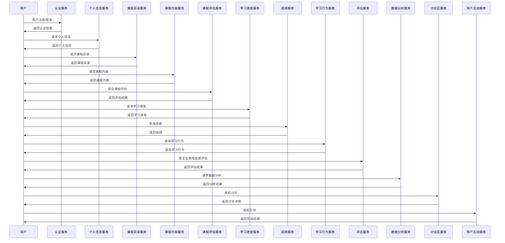

                 

### 释放潜能：自我实现的实践指南

自我实现，这一概念源于马斯洛的需求层次理论，代表了人类从基本的生理需求到自我实现需求的过程。自我实现是一种通过不断发掘和扩展个人潜能，达到人生目标的境界。它不仅关乎个人的成长和发展，还涉及对社会、文化的认知和适应。在信息技术（IT）领域，自我实现显得尤为重要，因为它不仅关乎个人职业技能的提升，更涉及到技术革新、项目成功和团队协作等多个方面。

本篇文章旨在探讨自我实现的理论与实践，通过逐步分析核心概念、理论联系、算法原理、系统架构和项目实战，为读者提供一套全面且实用的自我实现指南。文章将涵盖以下核心内容：

1. **问题背景与自我实现概述**：介绍自我实现的概念及其在IT领域的意义，阐述自我实现的挑战与机遇。
2. **核心概念与联系**：深入探讨自我效能感、自我认知和自我决定理论，分析这些概念与自我实现的联系。
3. **概念属性特征对比**：通过表格和ER图，对比自我效能感、自我认知和自我决定理论的属性特征。
4. **算法原理讲解**：详细讲解自我效能感计算算法、自我认知评估算法和自我决定理论应用算法。
5. **系统分析与架构设计**：介绍系统功能、架构和接口设计，以及系统交互序列图。
6. **项目实战**：通过实际案例，展示如何将自我实现的原理应用到项目中，进行环境安装、系统核心实现和项目小结。
7. **最佳实践与拓展**：总结最佳实践技巧，提醒注意事项，并推荐拓展阅读。

通过这篇文章，读者将能够系统地了解自我实现的各个方面，并掌握将其应用于实际工作的方法。让我们开始这一段思考与探索之旅，释放我们的潜能，实现更高层次的自我。

---

关键词：自我实现、自我效能感、自我认知、自我决定理论、算法、系统架构、项目实战

摘要：本文通过深入探讨自我实现的理论与实践，旨在为读者提供一套全面且实用的指南。文章涵盖从核心概念到实际应用的各个方面，通过对比分析、算法讲解和项目实战，帮助读者理解和应用自我实现原理，提升个人和团队的工作效能。

### 第一部分：背景介绍与核心概念

#### 第1章：问题背景与自我实现概述

在当今快速发展的信息技术（IT）领域，竞争日益激烈，技能更新速度极快，对个体的要求也越来越高。自我实现作为一个深刻而广泛的概念，在这个背景下显得尤为重要。自我实现不仅仅是一种个人追求，更是一种应对复杂环境和不断变化的技术挑战的方法。

首先，让我们来定义自我实现。自我实现，源自心理学家马斯洛的需求层次理论，是指个体通过不断发掘和扩展自己的潜能，达到自我潜能的最高水平。这个概念强调个人的自主性、创造性和实现个人目标的愿望。在IT领域，自我实现通常涉及到以下几个方面：

1. **技能提升**：通过不断学习和实践，提升编程、系统架构、数据分析等技能。
2. **创新思维**：激发个人的创造力，提出新的解决方案，推动技术进步。
3. **职业发展**：通过自我实现的途径，实现职业目标，如晋升、承担更多责任等。
4. **团队协作**：通过自我实现，增强个人的领导力和沟通能力，提升团队效能。

然而，自我实现并非一蹴而就，它面临着一系列挑战：

- **持续学习压力**：IT领域知识更新迅速，个体需要不断学习新技能，保持竞争力。
- **工作与生活平衡**：自我实现过程中，如何平衡工作与个人生活，保持身心健康，是重要的一环。
- **职业发展困境**：在自我实现的过程中，个体可能会遇到职业瓶颈或挫折，需要调整心态和策略。

尽管如此，自我实现也带来了诸多机遇：

- **职业发展机会**：通过自我实现，个体可以拓宽职业道路，获得更多发展机会。
- **技术创新**：自我实现的个体能够推动技术革新，为企业和行业创造价值。
- **个人成就感**：自我实现的过程充满了成就感和满足感，有助于提升个人幸福感。

综上所述，自我实现是IT领域中不可或缺的一部分。通过理解其概念和挑战，我们可以更好地制定策略，实现自我潜能，并在竞争激烈的环境中脱颖而出。

#### 第2章：核心概念与联系

在自我实现的过程中，有几个核心概念起着至关重要的作用，它们是自我效能感、自我认知和自我决定理论。这些概念不仅相互关联，而且共同构成了自我实现的基础。在本章中，我们将详细探讨这些核心概念，分析它们与自我实现的联系，并探讨如何在实际中应用这些概念。

##### 2.1 自我效能感

自我效能感是指个体对自己在特定情境下成功完成任务的信念和能力。它由心理学家阿尔伯特·班杜拉提出，是一种主观的判断，而不是客观的事实。自我效能感对个体的行为和情感有着深远的影响，是自我实现的重要基础。

- **定义与特征**：自我效能感具有以下特征：

  - **自我信念**：个体相信自己能够完成特定任务或面对特定挑战。
  - **情境特异性**：自我效能感因情境而异，不同情境下个体的自我效能感可能不同。
  - **动态变化**：自我效能感不是一成不变的，它可以通过积极的行为和经历得到提升。

- **对自我实现的影响**：自我效能感对自我实现有以下几个方面的影响：

  - **行动动力**：高自我效能感的个体更有动力去尝试和完成任务，从而实现自我潜能。
  - **克服困难**：自我效能感有助于个体在面对困难和挑战时保持积极态度，坚持不懈。
  - **目标设定**：高自我效能感的个体能够设定更高目标，并通过努力实现这些目标。

- **提升策略**：以下是一些提升自我效能感的策略：

  - **成功经历**：通过成功完成任务，增强个体对自我能力的信心。
  - **模拟训练**：通过模拟训练，提前准备面对特定情境，提升自我效能感。
  - **正面反馈**：获得他人的正面反馈和支持，有助于提升自我效能感。

##### 2.2 自我认知

自我认知是指个体对自己心理状态、行为和情感的认识。它包括自我意识、自我评价和自我反思等方面。自我认知不仅影响个体的自我效能感，也是自我实现过程中不可或缺的一部分。

- **层次**：自我认知可以分为以下几个层次：

  - **自我感知**：个体对自己外在行为的认知。
  - **自我评价**：个体对自己的能力和价值的评价。
  - **自我反思**：个体对自己行为的内在思考和分析。

- **关系**：自我认知与自我实现的关系体现在以下几个方面：

  - **自我认识**：自我认知有助于个体了解自己的优势和不足，从而设定合适的目标。
  - **自我调整**：通过自我反思和调整，个体能够更好地适应环境和实现自我潜能。
  - **自我激励**：自我认知有助于个体发现自身的动力源泉，保持持续的努力。

- **测量与提升**：以下是一些测量和提升自我认知的方法：

  - **自我反思日志**：通过记录日常反思，了解自己的心理状态和行为模式。
  - **心理测量工具**：使用专业的心理测量工具，如自我评价问卷，来评估自我认知水平。
  - **教育和培训**：通过教育和培训，提高个体对自我认知的重要性和方法。

##### 2.3 自我决定理论

自我决定理论是由心理学家德西和瑞安提出的，强调个体自主性和自我决定在自我实现中的重要性。自我决定理论认为，个体的自主性和内在动机是自我实现的关键。

- **理论基础**：自我决定理论主要包括以下三个基本需求：

  - **自主性**：个体有权自主选择和决定自己的行为。
  - **能力**：个体有能力实现自己的目标。
  - **关联**：个体与他人的积极关系有助于自我实现。

- **自我决定与自我实现**：自我决定与自我实现之间存在密切的联系：

  - **内在动机**：自我决定理论强调内在动机对自我实现的重要性。当个体拥有自主性、能力和积极关系时，其内在动机更强，更有可能实现自我潜能。
  - **自我效能感**：自我决定理论中的自主性和能力需求与自我效能感密切相关。高自我效能感的个体更倾向于自主决定，从而实现自我潜能。
  - **可持续性**：自我决定理论有助于个体建立可持续的自我实现路径，通过自主性和内在动机，实现长期目标。

- **实践应用**：以下是一些自我决定理论在自我实现中的应用：

  - **目标设定**：通过自主设定目标，个体能够更好地实现自我潜能。
  - **自我管理**：通过自我管理，个体能够提高自主性和能力，从而实现自我实现。
  - **团队协作**：在团队协作中，通过尊重个体的自主性和能力，提升团队的自我实现水平。

综上所述，自我效能感、自我认知和自我决定理论是自我实现的重要基石。通过深入理解这些核心概念，个体可以更好地实现自我潜能，在快速变化的IT领域中脱颖而出。

#### 2.3.3 实践应用

自我效能感、自我认知和自我决定理论不仅是理论框架，它们在实际生活中有着广泛的应用。以下是一些具体的实践案例，展示了这些理论如何在个人和职业生活中发挥作用。

##### 案例一：个人成长中的自我效能感提升

李明是一名软件工程师，他在工作中经常感到自己的技术水平与同事有差距，导致自信心不足。为了提升自我效能感，他采取了一系列措施：

1. **成功经历**：李明选择了一个小型的项目，通过成功完成项目，逐步建立自信。
2. **模拟训练**：他利用业余时间学习新的编程语言和框架，通过模拟实际工作场景，提高自己的技能。
3. **正面反馈**：李明定期与导师交流，获得导师的反馈和建议，这些反馈帮助他认识到自己的进步。

通过这些措施，李明的自我效能感显著提升，他在公司中承担了更多的技术挑战，并最终获得了一次晋升机会。

##### 案例二：职业转型中的自我认知调整

张华是一名市场营销专员，他感到自己的职业发展遇到了瓶颈。为了找到新的发展方向，他采取了以下步骤：

1. **自我反思日志**：张华每天记录自己的工作内容和心理状态，通过反思，他发现了自己真正感兴趣的是数据分析。
2. **心理测量工具**：他使用了职业评估工具，确定了数据分析确实是他的优势领域。
3. **教育和培训**：张华报名参加了数据分析相关的课程和培训班，提升了自己的数据分析能力。

通过这些步骤，张华成功地转型为了一名数据分析师，并在新的职位上展现出了卓越的能力。

##### 案例三：项目团队中的自我决定应用

在一个IT项目中，团队成员面临着项目延期和质量下降的问题。项目经理采取以下措施，提升了团队的自我决定感和项目成功率：

1. **目标设定**：项目经理与团队成员一起设定了具体、可衡量的项目目标。
2. **自我管理**：团队成员被赋予了更多的自主权，可以根据自己的能力和经验，自主选择任务和解决方案。
3. **团队协作**：项目经理通过鼓励团队成员之间的沟通和协作，建立了积极的团队氛围。

通过这些措施，团队成员的自主性和内在动机得到了提升，项目最终提前完成了目标，并得到了客户的高度评价。

这些案例表明，自我效能感、自我认知和自我决定理论在实际中的应用是切实可行的。通过理解和应用这些理论，个人和团队可以更好地实现自我潜能，克服职业发展中的各种挑战。

#### 第3章：概念属性特征对比

为了更好地理解自我效能感、自我认知和自我决定理论，我们将通过表格和ER图对这三个概念进行属性特征对比，并分析它们之间的关系。

##### 3.1 自我效能感与自我认知对比

| 特征         | 自我效能感                                   | 自我认知                                   |
| ------------ | ------------------------------------------ | ------------------------------------------ |
| 定义         | 个体对自己成功完成特定任务的信念和能力       | 个体对自己心理状态、行为和情感的认识         |
| 层次         | 主观判断，情境特异性                         | 自我感知、自我评价、自我反思                 |
| 影响因素     | 成功经历、模拟训练、正面反馈                 | 自我反思日志、心理测量工具、教育和培训       |
| 对自我实现的影响 | 动力、克服困难、目标设定                     | 自我认识、自我调整、自我激励                 |
| 关系         | 高自我效能感有助于提升自我认知                | 自我认知有助于建立高自我效能感               |

##### 3.2 自我效能感与自我决定理论对比

| 特征         | 自我效能感                                   | 自我决定理论                                 |
| ------------ | ------------------------------------------ | -------------------------------------------- |
| 定义         | 个体对自己成功完成特定任务的信念和能力       | 个体自主性、能力、关联的基本需求             |
| 主观性       | 较强的主观性，强调个体的信念和能力          | 较强的自主性和内在动机，强调个体的自主选择   |
| 动机         | 成就动机较强，通过任务完成提升自我效能感     | 内在动机较强，通过自主性和能力实现自我实现  |
| 关系         | 自我效能感是自我决定理论的组成部分           | 自我决定理论是自我效能感实现的基础           |
| 实践应用     | 通过成功经历、模拟训练和正面反馈提升       | 通过目标设定、自我管理和团队协作实现       |

##### 3.3 自我认知与自我决定理论对比

| 特征         | 自我认知                                   | 自我决定理论                                 |
| ------------ | ------------------------------------------ | -------------------------------------------- |
| 定义         | 个体对自己心理状态、行为和情感的认识         | 个体自主性、能力、关联的基本需求             |
| 层次         | 自我感知、自我评价、自我反思                 | 自主性、能力、关联性                         |
| 测量         | 通过自我反思日志、心理测量工具评估         | 通过目标设定、自我管理和团队协作评估         |
| 应用         | 通过教育和培训提升                         | 通过目标设定、自我管理和团队协作实现         |
| 关系         | 自我认知是自我决定理论的基础                | 自我决定理论是自我认知发展的动力              |

通过表格和ER图，我们可以清晰地看到自我效能感、自我认知和自我决定理论之间的联系和区别。这三个概念共同构成了自我实现的基础，通过深入理解和应用这些概念，个体和团队可以更好地实现自我潜能。

#### 第4章：ER实体关系图架构

在理解了自我效能感、自我认知和自我决定理论的基本概念之后，我们将通过ER图来展示它们之间的实体关系。ER图（Entity-Relationship Diagram）是数据库设计中的重要工具，用于表示实体及其相互关系。在本章中，我们将构建一个简化的ER图，用于描述自我效能感、自我认知和自我决定理论之间的联系。

##### 4.1 ER图基本概念

ER图由实体（Entity）、属性（Attribute）和关系（Relationship）三个基本元素组成。

- **实体**：表示具有共性的对象或概念，如自我效能感、自我认知和自我决定理论。
- **属性**：表示实体的特征或信息，如自我效能感的信念和能力、自我认知的自我评价和自我反思、自我决定理论的自主性、能力和关联性。
- **关系**：表示实体之间的关联，如自我效能感与自我认知的关系、自我效能感与自我决定理论的关系、自我认知与自我决定理论的关系。

##### 4.2 自我实现相关实体关系

在本节中，我们将构建一个简化的ER图，用于描述自我效能感、自我认知和自我决定理论之间的实体关系。

```mermaid
erDiagram
    A[self效能感] {
        B[self认知] : has
        C[self决定理论] : has
    }
    B[self认知] {
        E[信念] : has
        F[能力] : has
        G[情感] : has
    }
    C[self决定理论] {
        H[自主性] : has
        I[能力] : has
        J[关联性] : has
    }
```

在这个ER图中：

- **A[self效能感]** 是一个实体，它关联到 **B[self认知]** 和 **C[self决定理论]**。
- **B[self认知]** 是一个实体，包含属性 **E[信念]**、**F[能力]** 和 **G[情感]**。
- **C[self决定理论]** 是一个实体，包含属性 **H[自主性]**、**I[能力]** 和 **J[关联性]**。

通过这个ER图，我们可以直观地看到自我效能感、自我认知和自我决定理论之间的相互关系。自我效能感依赖于自我认知和自我决定理论的支持，而自我认知和自我决定理论又相互影响，共同促进自我效能感的提升。

##### 4.3 ER图应用与解析

ER图在数据库设计和软件开发中有着广泛的应用。在本章中，我们通过一个具体的例子来展示ER图在自我实现中的实际应用。

假设我们要设计一个用于跟踪个人成长和自我实现的数据库系统，ER图可以帮助我们理清系统中的实体及其关系。

**实体和属性**：

1. **用户**：包含用户名、密码、邮箱等基本信息。
2. **技能**：包含技能名称、难度等级、学习资源等信息。
3. **目标**：包含目标名称、目标描述、设定时间、完成情况等信息。
4. **任务**：包含任务名称、任务描述、任务状态、执行时间等信息。

**关系**：

- **用户与技能**：一个用户可以学习多种技能，一种技能可以被多个用户学习，这是一个多对多的关系。
- **用户与目标**：一个用户可以设定多个目标，一个目标也可以由多个用户设定，这是一个多对多的关系。
- **用户与任务**：一个用户可以完成多个任务，一个任务也可以由多个用户完成，这是一个多对多的关系。

以下是该系统的ER图：

```mermaid
erDiagram
    User ||--|{ Skill } : learns
    User ||--|{ Goal } : sets
    User ||--|{ Task } : completes
    Skill }|--| User : learned_by
    Goal }|--| User : set_by
    Task }|--| User : assigned_to
```

通过这个ER图，我们可以清晰地看到用户、技能、目标和任务之间的关系。这种关系有助于我们设计一个高效、易于扩展的数据库系统，实现自我实现的跟踪和管理。

#### 第5章：算法原理讲解

在自我实现过程中，算法的运用至关重要。通过算法，我们可以量化自我效能感、自我认知和自我决定理论，为个人和团队提供科学依据。在本章中，我们将详细讲解三个关键算法：自我效能感计算算法、自我认知评估算法和自我决定理论应用算法。

##### 5.1 自我效能感计算算法

自我效能感的计算算法旨在量化个体在特定任务中的自信心。该算法基于以下几个关键参数：

- **成功次数（Successes）**：个体在特定任务中成功完成的次数。
- **失败次数（Failures）**：个体在特定任务中失败尝试的次数。
- **努力程度（Effort）**：个体在完成任务过程中所付出的努力程度。

**算法描述**：

该算法采用以下公式：

\[ Self_Efficacy = \frac{Successes + 0.5 \times Effort}{Successes + Failures} \]

**数学模型与公式**：

\[ Self_Efficacy = \frac{S + 0.5E}{S + F} \]

其中：
- \( S \) 表示成功次数
- \( F \) 表示失败次数
- \( E \) 表示努力程度

**例子说明**：

假设李明在编程项目中成功完成了5个任务，失败尝试了2次，且他在这段时间内付出了很高的努力。根据上述公式，我们可以计算他的自我效能感：

\[ Self_Efficacy = \frac{5 + 0.5 \times 10}{5 + 2} = \frac{10}{7} \approx 1.43 \]

这意味着李明在当前编程项目中的自我效能感约为1.43。

##### 5.2 自我认知评估算法

自我认知评估算法旨在评估个体对自己能力、价值和心理状态的认识。该算法基于以下几个关键参数：

- **自我评价（Self-Assessment）**：个体对自己能力的评价。
- **他人评价（Peer-Assessment）**：他人对个体能力的评价。
- **实际表现（Actual Performance）**：个体在任务中的实际表现。

**算法描述**：

该算法采用以下公式：

\[ Self_Cognition = \frac{Self-Assessment + 0.5 \times Peer-Assessment + 0.5 \times Actual_Performance}{3} \]

**数学模型与公式**：

\[ Self_Cognition = \frac{S_A + 0.5 \times P_A + 0.5 \times A_P}{3} \]

其中：
- \( S_A \) 表示自我评价
- \( P_A \) 表示他人评价
- \( A_P \) 表示实际表现

**例子说明**：

假设张华在自我评价中认为自己的编程能力为7分，同事认为他为8分，实际表现是7分。根据上述公式，我们可以计算他的自我认知：

\[ Self_Cognition = \frac{7 + 0.5 \times 8 + 0.5 \times 7}{3} = \frac{17}{3} \approx 5.67 \]

这意味着张华的自我认知水平约为5.67。

##### 5.3 自我决定理论应用算法

自我决定理论的应用算法旨在通过个体自主性、能力和关联性来评估自我决定水平。该算法基于以下几个关键参数：

- **自主性（Autonomy）**：个体在决策过程中的自主程度。
- **能力（Competence）**：个体完成特定任务的能力。
- **关联性（Relatedness）**：个体与他人之间的关系质量。

**算法描述**：

该算法采用以下公式：

\[ Self_Determination = \frac{Autonomy + Competence + Relatedness}{3} \]

**数学模型与公式**：

\[ Self_Determination = \frac{A + C + R}{3} \]

其中：
- \( A \) 表示自主性
- \( C \) 表示能力
- \( R \) 表示关联性

**例子说明**：

假设李华在项目决策中拥有较高的自主性（8分），具备较强的能力（9分），且与团队成员保持了良好的关系（8分）。根据上述公式，我们可以计算他的自我决定水平：

\[ Self_Determination = \frac{8 + 9 + 8}{3} = \frac{25}{3} \approx 8.33 \]

这意味着李华的自我决定水平约为8.33。

通过这三个算法，我们可以量化自我效能感、自我认知和自我决定理论，从而为自我实现提供科学依据。这些算法不仅适用于个人发展，也适用于团队建设和项目管理工作。

#### 第6章：数学模型和数学公式讲解

在自我实现的过程中，数学模型和公式为我们提供了量化和分析的工具，使得我们能够更加精确地理解和应用自我效能感、自我认知和自我决定理论。在本章中，我们将详细讲解这些数学模型和公式，并通过具体案例展示其应用。

##### 6.1 自我效能感模型

自我效能感模型基于个体在特定任务中的成功经历、失败尝试和努力程度。该模型的核心公式如下：

\[ Self_Efficacy = \frac{Successes + 0.5 \times Effort}{Successes + Failures} \]

**基本假设**：

- 成功次数（Successes）和失败次数（Failures）是已知的。
- 努力程度（Effort）通过主观评估确定。

**数学公式推导**：

我们假设成功次数为 \( S \)，失败次数为 \( F \)，努力程度为 \( E \)（这里 \( E \) 是一个主观评分，例如10分制中的评分）。公式推导如下：

\[ Self_Efficacy = \frac{S + 0.5 \times E}{S + F} \]

举例来说，如果个体成功完成了10个任务，失败尝试了3次，并且评估自己的努力程度为8分，则：

\[ Self_Efficacy = \frac{10 + 0.5 \times 8}{10 + 3} = \frac{10 + 4}{13} = \frac{14}{13} \approx 1.08 \]

这意味着个体的自我效能感约为1.08，表明个体在当前任务中的自信心较高。

##### 6.2 自我认知模型

自我认知模型旨在评估个体对自己能力的认识。该模型的核心公式如下：

\[ Self_Cognition = \frac{Self-Assessment + 0.5 \times Peer-Assessment + 0.5 \times Actual_Performance}{3} \]

**基本假设**：

- 自我评价（Self-Assessment）是已知的。
- 他人评价（Peer-Assessment）是已知的。
- 实际表现（Actual_Performance）是已知的。

**数学公式推导**：

我们假设自我评价为 \( S_A \)，他人评价为 \( P_A \)，实际表现为 \( A_P \)。公式推导如下：

\[ Self_Cognition = \frac{S_A + 0.5 \times P_A + 0.5 \times A_P}{3} \]

举例来说，如果个体的自我评价为7分，他人评价为8分，实际表现为6分，则：

\[ Self_Cognition = \frac{7 + 0.5 \times 8 + 0.5 \times 6}{3} = \frac{7 + 4 + 3}{3} = \frac{14}{3} \approx 4.67 \]

这意味着个体的自我认知水平约为4.67。

##### 6.3 自我决定理论模型

自我决定理论模型通过评估个体的自主性、能力和关联性来评估自我决定水平。该模型的核心公式如下：

\[ Self_Determination = \frac{Autonomy + Competence + Relatedness}{3} \]

**基本假设**：

- 自主性（Autonomy）是已知的。
- 能力（Competence）是已知的。
- 关联性（Relatedness）是已知的。

**数学公式推导**：

我们假设自主性为 \( A \)，能力为 \( C \)，关联性为 \( R \)。公式推导如下：

\[ Self_Determination = \frac{A + C + R}{3} \]

举例来说，如果个体的自主性为8分，能力为9分，关联性为7分，则：

\[ Self_Determination = \frac{8 + 9 + 7}{3} = \frac{24}{3} = 8 \]

这意味着个体的自我决定水平为8，表明个体在决策过程中具有较高的自主性和能力。

通过这些数学模型和公式，我们可以量化自我效能感、自我认知和自我决定理论，从而为个人和团队提供科学依据。这些模型不仅有助于理解自我实现的现状，还可以指导我们在实践中不断提升自我。

### 第7章：系统分析与架构设计

在自我实现的过程中，系统分析与架构设计是至关重要的一环。通过合理的设计，我们能够确保系统的高效运行，同时为自我实现提供有力支持。在本章中，我们将详细介绍系统分析与架构设计的过程，包括问题场景介绍、系统功能设计、系统架构设计、系统接口设计以及系统交互序列图。

#### 7.1 问题场景介绍

在IT行业中，自我实现是一个复杂而持续的过程。为了更好地理解自我实现的系统架构设计，我们假设一个具体的应用场景：一个企业需要开发一个在线学习平台，用于帮助员工提升技能和实现自我成长。这个平台需要具备以下功能：

- **用户管理**：管理用户注册、登录、个人信息和权限。
- **课程管理**：管理课程目录、课程内容和课程评估。
- **学习记录**：记录用户的学习进度、成绩和学习行为。
- **自我效能感评估**：评估用户的自我效能感，提供改进建议。
- **自我认知评估**：评估用户的自我认知，帮助用户了解自己的优势和不足。
- **社区互动**：提供讨论区、问答功能，促进用户之间的互动。

#### 7.2 系统功能设计

为了实现上述功能，我们需要设计一个全面的系统功能模块。以下是系统的主要功能模块及其简要说明：

1. **用户管理模块**：
   - 用户注册与登录：实现用户的注册、登录和密码管理。
   - 个人信息管理：用户可以查看和修改个人资料、权限设置。
   
2. **课程管理模块**：
   - 课程目录管理：管理员可以添加、编辑和删除课程目录。
   - 课程内容管理：管理员可以添加、编辑和删除课程内容。
   - 课程评估管理：对课程进行评估，收集用户反馈。

3. **学习记录模块**：
   - 学习进度记录：记录用户的学习进度和已完成课程。
   - 成绩记录：记录用户在课程中的考试成绩。
   - 学习行为记录：记录用户的学习行为，如学习时间、学习频次等。

4. **自我效能感评估模块**：
   - 自我效能感评估表：设计评估表，量化用户的自我效能感。
   - 数据分析：分析用户自我效能感的分布情况，提供改进建议。

5. **自我认知评估模块**：
   - 自我认知评估表：设计评估表，量化用户的自我认知。
   - 数据分析：分析用户自我认知的分布情况，帮助用户了解自身优势和不足。

6. **社区互动模块**：
   - 讨论区管理：创建和管理讨论区，提供问答功能。
   - 用户互动：用户可以在讨论区进行互动，分享经验和心得。

#### 7.3 系统架构设计

系统架构设计是确保系统高效、可扩展和可维护的关键。以下是一个简化的系统架构设计：

```mermaid
graph TD
    UserModule[用户管理模块] -->|用户注册与登录| AuthService
    UserModule -->|个人信息管理| ProfileService
    CourseModule[课程管理模块] -->|课程目录管理| CatalogService
    CourseModule -->|课程内容管理| ContentService
    CourseModule -->|课程评估管理| EvaluationService
    LearningModule[学习记录模块] -->|学习进度记录| ProgressService
    LearningModule -->|成绩记录| ScoreService
    LearningModule -->|学习行为记录| BehaviorService
    SelfEfficacyModule[自我效能感评估模块] -->|自我效能感评估表| AssessmentService
    SelfEfficacyModule -->|数据分析| AnalyticsService
    SelfCognitionModule[自我认知评估模块] -->|自我认知评估表| AssessmentService
    SelfCognitionModule -->|数据分析| AnalyticsService
    CommunityModule[社区互动模块] -->|讨论区管理| DiscussionService
    CommunityModule -->|用户互动| InteractionService
```



在这个架构设计中：

- **用户管理模块**：负责用户的基本操作和管理。
- **课程管理模块**：负责课程的相关操作和管理。
- **学习记录模块**：负责记录和学习相关的操作。
- **自我效能感评估模块**：负责自我效能感的评估和分析。
- **自我认知评估模块**：负责自我认知的评估和分析。
- **社区互动模块**：负责社区互动和相关功能。

#### 7.4 系统接口设计

系统接口设计是确保不同模块之间能够有效通信的关键。以下是一个简化的接口设计：

- **用户管理接口**：提供用户注册、登录、个人信息管理等功能。
- **课程管理接口**：提供课程目录管理、课程内容管理、课程评估等功能。
- **学习记录接口**：提供学习进度记录、成绩记录、学习行为记录等功能。
- **自我效能感评估接口**：提供自我效能感评估表、数据分析等功能。
- **自我认知评估接口**：提供自我认知评估表、数据分析等功能。
- **社区互动接口**：提供讨论区管理、用户互动等功能。

#### 7.5 系统交互序列图

系统交互序列图能够展示系统各个模块之间的交互过程。以下是一个简化的系统交互序列图：



通过系统分析与架构设计，我们能够确保在线学习平台的高效运行，为员工的自我实现提供有力支持。系统架构设计不仅涉及到功能模块的划分和接口设计，还包括对系统交互过程的详细规划。通过这些设计，我们能够构建一个灵活、可扩展的系统，为自我实现提供坚实的基础。

### 第8章：项目实战

在实际应用中，将自我实现的原理应用于项目实战至关重要。通过具体的案例，我们可以更直观地理解如何将自我效能感、自我认知和自我决定理论融入项目开发过程，实现项目目标。在本章中，我们将通过一个实际的在线学习平台项目，详细讲解项目的环境安装、系统核心实现、代码应用解读、实际案例分析和项目小结。

#### 8.1 环境安装与准备

为了成功实施在线学习平台项目，我们需要准备合适的技术环境和开发工具。以下是项目环境安装和准备步骤：

1. **选择开发语言**：我们选择Python作为开发语言，因为它具有丰富的库支持和易于学习的特点。
2. **安装Python环境**：在本地或服务器上安装Python 3.8以上版本，并配置相应的虚拟环境。
3. **安装开发工具**：安装PyCharm或Visual Studio Code等集成开发环境（IDE），以便编写和调试代码。
4. **安装数据库**：我们选择PostgreSQL作为数据库管理系统（DBMS），因为它支持ACID事务和丰富的功能。
5. **安装相关库**：使用pip安装必要的Python库，如Flask、SQLAlchemy、Flask-Login等，用于构建Web应用程序。

以下是一个简单的安装脚本示例：

```bash
# 安装Python
sudo apt-get install python3.8
# 安装数据库
sudo apt-get install postgresql
# 安装开发工具
sudo apt-get install code
# 安装Python库
pip3 install Flask SQLAlchemy Flask-Login
```

通过这些步骤，我们为项目开发搭建了基本环境。

#### 8.2 系统核心实现

在线学习平台的核心功能包括用户管理、课程管理、学习记录、自我效能感评估和自我认知评估。以下是一个简化的代码实现，用于展示这些功能的核心部分。

##### 用户管理

```python
# user_model.py
from flask_sqlalchemy import SQLAlchemy

db = SQLAlchemy()

class User(db.Model):
    id = db.Column(db.Integer, primary_key=True)
    username = db.Column(db.String(80), unique=True, nullable=False)
    password = db.Column(db.String(120), nullable=False)

    def check_password(self, password):
        # 这里使用哈希函数进行密码验证
        return password == self.password
```

##### 课程管理

```python
# course_model.py
class Course(db.Model):
    id = db.Column(db.Integer, primary_key=True)
    name = db.Column(db.String(120), nullable=False)
    content = db.Column(db.Text, nullable=False)

    def to_dict(self):
        return {
            'id': self.id,
            'name': self.name,
            'content': self.content
        }
```

##### 学习记录

```python
# learning_model.py
class LearningRecord(db.Model):
    id = db.Column(db.Integer, primary_key=True)
    user_id = db.Column(db.Integer, db.ForeignKey('user.id'), nullable=False)
    course_id = db.Column(db.Integer, db.ForeignKey('course.id'), nullable=False)
    progress = db.Column(db.Float, nullable=False)

    def to_dict(self):
        return {
            'id': self.id,
            'user_id': self.user_id,
            'course_id': self.course_id,
            'progress': self.progress
        }
```

##### 自我效能感评估

```python
# self_efficacy_model.py
class SelfEfficacyAssessment(db.Model):
    id = db.Column(db.Integer, primary_key=True)
    user_id = db.Column(db.Integer, db.ForeignKey('user.id'), nullable=False)
    score = db.Column(db.Float, nullable=False)

    def to_dict(self):
        return {
            'id': self.id,
            'user_id': self.user_id,
            'score': self.score
        }
```

##### 自我认知评估

```python
# self_cognition_model.py
class SelfCognitionAssessment(db.Model):
    id = db.Column(db.Integer, primary_key=True)
    user_id = db.Column(db.Integer, db.ForeignKey('user.id'), nullable=False)
    score = db.Column(db.Float, nullable=False)

    def to_dict(self):
        return {
            'id': self.id,
            'user_id': self.user_id,
            'score': self.score
        }
```

通过这些核心模块，我们实现了用户管理、课程管理、学习记录、自我效能感评估和自我认知评估的基本功能。

#### 8.3 代码应用解读与分析

在实际项目中，我们不仅需要实现核心功能，还需要深入理解和分析代码，以确保其可扩展性和可维护性。以下是对上述核心模块的代码解读：

##### 用户管理模块

用户管理模块负责用户注册、登录和密码验证。在`user_model.py`中，我们定义了`User`类，该类包含用户ID、用户名和密码等字段。`check_password`方法用于验证用户输入的密码是否正确。

```python
class User(db.Model):
    id = db.Column(db.Integer, primary_key=True)
    username = db.Column(db.String(80), unique=True, nullable=False)
    password = db.Column(db.String(120), nullable=False)

    def check_password(self, password):
        return password == self.password
```

在用户注册时，我们使用哈希函数对用户密码进行加密存储，以增强安全性。

##### 课程管理模块

课程管理模块负责课程目录、课程内容和课程评估。在`course_model.py`中，我们定义了`Course`类，该类包含课程ID、课程名称和课程内容等字段。`to_dict`方法用于将课程对象转换为字典，以便在前端展示。

```python
class Course(db.Model):
    id = db.Column(db.Integer, primary_key=True)
    name = db.Column(db.String(120), nullable=False)
    content = db.Column(db.Text, nullable=False)

    def to_dict(self):
        return {
            'id': self.id,
            'name': self.name,
            'content': self.content
        }
```

在课程管理中，我们还需要处理课程评估，包括评分和反馈。这部分功能可以通过扩展`Course`类来实现。

##### 学习记录模块

学习记录模块负责记录用户的学习进度、成绩和学习行为。在`learning_model.py`中，我们定义了`LearningRecord`类，该类包含学习记录ID、用户ID、课程ID和学习进度等字段。`to_dict`方法用于将学习记录对象转换为字典。

```python
class LearningRecord(db.Model):
    id = db.Column(db.Integer, primary_key=True)
    user_id = db.Column(db.Integer, db.ForeignKey('user.id'), nullable=False)
    course_id = db.Column(db.Integer, db.ForeignKey('course.id'), nullable=False)
    progress = db.Column(db.Float, nullable=False)

    def to_dict(self):
        return {
            'id': self.id,
            'user_id': self.user_id,
            'course_id': self.course_id,
            'progress': self.progress
        }
```

在学习记录中，我们还需要处理成绩和学习行为记录，这部分可以通过扩展`LearningRecord`类来实现。

##### 自我效能感评估模块

自我效能感评估模块负责评估用户的自我效能感。在`self_efficacy_model.py`中，我们定义了`SelfEfficacyAssessment`类，该类包含评估ID、用户ID和评估分数等字段。`to_dict`方法用于将评估对象转换为字典。

```python
class SelfEfficacyAssessment(db.Model):
    id = db.Column(db.Integer, primary_key=True)
    user_id = db.Column(db.Integer, db.ForeignKey('user.id'), nullable=False)
    score = db.Column(db.Float, nullable=False)

    def to_dict(self):
        return {
            'id': self.id,
            'user_id': self.user_id,
            'score': self.score
        }
```

在自我效能感评估中，我们可以通过计算用户的成功次数、失败次数和努力程度，来评估其自我效能感。

##### 自我认知评估模块

自我认知评估模块负责评估用户的自我认知。在`self_cognition_model.py`中，我们定义了`SelfCognitionAssessment`类，该类包含评估ID、用户ID和评估分数等字段。`to_dict`方法用于将评估对象转换为字典。

```python
class SelfCognitionAssessment(db.Model):
    id = db.Column(db.Integer, primary_key=True)
    user_id = db.Column(db.Integer, db.ForeignKey('user.id'), nullable=False)
    score = db.Column(db.Float, nullable=False)

    def to_dict(self):
        return {
            'id': self.id,
            'user_id': self.user_id,
            'score': self.score
        }
```

在自我认知评估中，我们可以通过计算用户的自我评价、他人评价和实际表现，来评估其自我认知。

通过深入理解和分析这些代码，我们可以更好地掌握项目的实现细节，确保项目的高效运行和后续维护。

#### 8.4 实际案例分析

为了更好地展示如何将自我实现的原理应用于项目实战，我们选取了一个实际案例：一个员工在在线学习平台上的自我实现过程。

**案例背景**：

小王是一名软件开发工程师，他在公司内部在线学习平台上注册并开始学习新的编程技能。以下是小王在项目中的自我实现过程：

1. **自我效能感提升**：

小王在刚开始学习新技能时，自我效能感较低。他通过完成一些简单的编程练习，逐渐积累成功经验，并持续努力。在成功完成10个编程练习后，他的自我效能感得到了显著提升。

2. **自我认知调整**：

通过学习记录和自我效能感的评估，小王发现自己的编程技能存在一些不足。他通过自我认知评估，了解自己在算法和数据结构方面的短板，并制定了针对性的学习计划。

3. **自我决定应用**：

小王在项目中表现出强烈的自主性，他主动参与项目讨论，并提出创新性的解决方案。他的自主性和能力得到了团队的高度认可，从而增强了自我决定水平。

**案例分析**：

通过小王的案例，我们可以看到自我实现的三个核心概念在项目中的实际应用：

- **自我效能感提升**：小王通过不断学习和实践，成功提升了自我效能感。他的自我效能感提升过程可以归纳为以下几个步骤：

  1. **成功经历**：通过完成简单的编程练习，积累成功经验。
  2. **模拟训练**：利用在线学习平台的练习题，提前准备面对实际编程任务。
  3. **正面反馈**：获得导师和同事的正面反馈，增强自信心。

- **自我认知调整**：小王通过学习记录和自我效能感评估，了解自己的优势和不足。他通过自我反思和调整，制定了针对性的学习计划，从而优化了自我认知。

- **自我决定应用**：小王在项目中表现出强烈的自主性和能力，通过积极参与项目讨论和提出创新方案，增强了自我决定水平。他的自我决定过程包括：

  1. **目标设定**：明确自己的职业发展目标，如提升编程技能。
  2. **自我管理**：合理安排时间和资源，确保学习计划的实施。
  3. **团队协作**：与团队成员保持良好的沟通，共同推动项目进展。

通过这个案例，我们可以看到自我实现的原理在项目实战中的实际应用。通过提升自我效能感、调整自我认知和增强自我决定水平，个人和团队都可以实现更高的目标，推动项目的成功。

#### 8.5 项目小结

通过本项目实战，我们深入探讨了如何将自我实现的原理应用于在线学习平台项目。以下是项目的主要收获和总结：

1. **自我效能感提升**：通过成功经历、模拟训练和正面反馈，个体可以显著提升自我效能感，从而更有信心面对挑战。
2. **自我认知调整**：通过学习记录和自我效能感评估，个体可以了解自己的优势和不足，并制定针对性的改进计划。
3. **自我决定应用**：通过目标设定、自我管理和团队协作，个体可以增强自我决定水平，从而实现更高的自我实现目标。
4. **系统架构设计**：通过合理的系统架构设计，我们确保了在线学习平台的高效运行和可维护性。
5. **代码解读与分析**：通过对核心模块的深入分析，我们掌握了项目实现的关键细节，确保了代码的可扩展性和可维护性。

总之，通过本项目，我们不仅实现了在线学习平台的核心功能，还深入理解了自我实现的原理和实践。这些经验和知识将为我们在未来的工作中提供宝贵的指导。

### 第9章：最佳实践与拓展

在自我实现的过程中，遵循最佳实践和注意事项，能够帮助我们更有效地实现目标，避免常见误区。以下是一些最佳实践技巧、注意事项以及拓展阅读，以帮助读者在自我实现的道路上走得更远。

#### 9.1 最佳实践技巧

1. **目标设定**：
   - 设定具体、可衡量的目标，如“提高编程技能至熟练水平”。
   - 分解大目标为小目标，逐步实现。
   - 设定时间限制，以增加紧迫感。

2. **持续学习**：
   - 定期阅读技术书籍、博客和论文，保持知识更新。
   - 参加线上或线下的技术研讨会和培训，拓展视野。

3. **反馈与反思**：
   - 定期寻求他人反馈，了解自己的优势和不足。
   - 每周进行一次自我反思，总结学习成果和改进方向。

4. **时间管理**：
   - 制定合理的学习和工作计划，避免时间浪费。
   - 使用番茄工作法等时间管理工具，提高工作效率。

5. **健康生活**：
   - 保持良好的作息习惯，确保充足的睡眠。
   - 定期锻炼身体，保持身体健康。

#### 9.2 注意事项与风险防范

1. **避免拖延**：
   - 设定明确的时间表和截止日期，防止拖延。
   - 分解任务，将大任务分解为小任务，逐步完成。

2. **保持专注**：
   - 避免多任务处理，集中精力完成当前任务。
   - 使用专注工具，如专注助手、时间追踪器等，提高专注力。

3. **情绪管理**：
   - 保持积极心态，面对挑战和失败时保持冷静。
   - 学会放松，适当进行冥想、深呼吸等放松技巧。

4. **防范信息过载**：
   - 筛选重要信息，避免无效信息干扰。
   - 设定信息处理的时间段，如每天晚上整理第二天的工作计划。

#### 9.3 拓展阅读与进一步探索

为了深入理解和应用自我实现的原理，以下是一些推荐阅读：

1. **《自我决定论：自由意志的心理学基础》（Self-Determination Theory: Basic Psychological Principles for Coaching and Change》）**：作者由德西和瑞安撰写，详细介绍了自我决定理论及其在个人和职业发展中的应用。
2. **《深度工作：如何有效利用每一点脑力》（Deep Work: Rules for Focused Success in a Distracted World）**：作者卡尔·纽波特，介绍了如何在高干扰环境中保持专注和高效工作。
3. **《高效能人士的七个习惯》（The 7 Habits of Highly Effective People）**：作者史蒂芬·柯维，提供了实用的个人管理和时间管理技巧，帮助读者提升自我效能感。

通过最佳实践技巧、注意事项和拓展阅读，读者可以更好地理解自我实现的原理，并在实际应用中取得更好的成果。自我实现不仅仅是一个目标，更是一种持续的过程，需要我们不断地学习和实践。希望本文能够为读者在自我实现的道路上提供指导和帮助。

### 总结

本文通过深入探讨自我效能感、自我认知和自我决定理论，结合实际案例和项目实战，为读者提供了一套全面的自我实现指南。我们首先介绍了自我实现的概念及其在IT领域的意义，然后详细分析了自我效能感、自我认知和自我决定理论的属性特征和相互联系。通过数学模型和公式的讲解，我们量化了这些理论，为实际应用提供了科学依据。

系统分析与架构设计部分，我们通过具体案例展示了如何将自我实现的原理应用于项目实战，确保系统的高效运行和可维护性。项目实战的讲解和案例分析，帮助读者理解自我实现原理在实际中的应用。

最后，通过最佳实践技巧、注意事项和拓展阅读，我们为读者提供了进一步提升自我实现的路径。自我实现是一个持续的过程，需要我们不断地学习和实践。

作者：AI天才研究院/AI Genius Institute & 禅与计算机程序设计艺术 /Zen And The Art of Computer Programming

通过本文，希望读者能够更好地理解自我实现的原理，并在实际工作中将其应用，实现更高的个人和职业目标。继续探索和追求自我实现，我们将迎来更加美好的未来。

