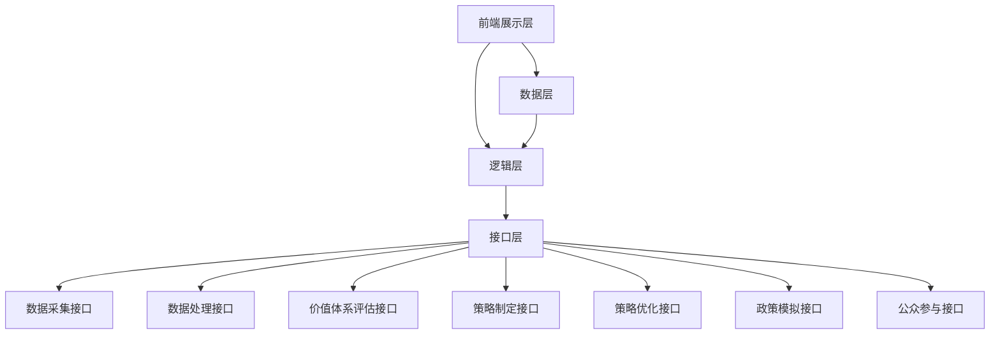

                 


## 第1章：现代社会意义危机的背景与概念

### 1.1 问题的背景

在当今世界，我们面临着一系列的社会挑战，这些挑战深刻地影响着我们的价值观和意义感。物质主义、消费主义和个人主义是我们现代社会中常见的现象，它们在很大程度上塑造了我们的生活方式和社会结构。

#### 1.1.1 物质主义的影响

物质主义是一种将物质财富和消费作为生活中心的价值观念。它强调个人拥有更多物质财产的重要性，这种观念在现代社会中得到了广泛的传播。然而，物质主义导致了一系列问题，包括环境破坏、资源枯竭和社会不平等。它使得人们过分关注物质享受，忽视了精神层面的发展。

#### 1.1.2 消费主义的驱动

消费主义是物质主义的一个子集，它鼓励人们通过购买商品和服务来满足自己的需求和欲望。在消费主义文化中，广告和营销策略被用来诱导人们进行不必要的消费。这种文化导致了资源的过度消耗，加剧了环境问题，并助长了社会的不公平现象。

#### 1.1.3 个人主义的挑战

个人主义强调个人自由和独立，鼓励人们追求个人目标和幸福。虽然个人主义在一定程度上推动了社会的进步，但它也可能导致个人与集体之间的冲突，以及社会凝聚力的下降。个人主义使得人们过分关注个人利益，忽视了社会责任和集体福祉。

### 1.2 重建价值体系的重要性

面对现代社会意义危机，重建价值体系显得尤为重要。这不仅关乎个人的幸福和成长，也关乎社会的稳定和繁荣。

#### 1.2.1 社会稳定与和谐

一个健康的社会需要一个共同认可的价值体系，这个价值体系能够促进社会成员之间的相互理解和支持。重建价值体系有助于增强社会凝聚力，减少冲突，从而实现社会的稳定和和谐。

#### 1.2.2 个人成长与幸福

个人的意义感和幸福感很大程度上来自于他们对生活的理解和追求。重建价值体系可以帮助个人建立正确的价值观，从而更好地实现自我价值，获得内心的平静和满足。

### 1.3 核心概念及其关系

在探讨重建价值体系的过程中，我们需要明确几个核心概念，并了解它们之间的关系。

#### 1.3.1 价值体系

价值体系是指一个社会或文化中人们共同认可的一系列价值观。这些价值观指导人们的行为和决策，影响着社会的各个方面。

#### 1.3.2 意义

意义是指事物对个体或集体的重要性和价值。它关乎人们如何理解自己的生活，如何找到生活的目的和意义。

#### 1.3.3 社会结构

社会结构是指社会的基本组织形式和关系，包括社会阶层、社会关系和社会规范。

#### 1.3.4 文化

文化是指一个社会或群体的共同价值观、信仰、传统和行为模式。文化对价值体系的形成和传播起着至关重要的作用。

#### 1.3.5 教育

教育是传递价值体系和文化的重要途径。一个良好的教育体系可以培养具有正确价值观和社会责任感的人才。

#### 1.3.6 经济

经济模式和经济行为对社会价值体系有着深远的影响。一个健康的经济体系可以促进社会公平和可持续发展。

### 1.4 概念结构与核心要素组成

为了更好地理解重建价值体系的过程，我们需要分析其概念结构和核心要素。

#### 1.4.1 价值体系

价值体系包括几个核心要素：道德原则、社会责任、个人目标和社会和谐。这些要素相互关联，共同构成一个完整的价值体系。

#### 1.4.2 意义

意义包括个人意义和社会意义。个人意义关乎个体的自我认知和成长，社会意义则关乎个体在社会中的角色和贡献。

#### 1.4.3 社会结构

社会结构包括社会阶层、社会关系和社会规范。这些要素决定了社会的运行方式和个体在社会中的地位。

#### 1.4.4 文化

文化包括文化价值观、文化传统和文化产品。文化价值观是文化的基础，文化传统是文化的传承，文化产品是文化的体现。

#### 1.4.5 教育

教育包括教育理念、教育体系和教育方法。一个良好的教育体系可以培养具有正确价值观和社会责任感的人才。

#### 1.4.6 经济

经济包括经济模式、经济行为和经济影响。一个健康的经济体系可以促进社会公平和可持续发展。

### 1.5 背景介绍与问题解决

在现代社会，意义危机表现为个人和社会层面的多个方面。个人层面，人们常常感到迷茫和空虚，缺乏生活的目标和意义。社会层面，社会不平等、环境破坏和社会冲突等问题日益严重。

为了解决这些问题，我们需要重建价值体系。这需要从多个层面进行努力，包括社会政策调整、文化塑造、教育改革和经济模式转型。通过这些努力，我们可以建立一个更加公平、和谐和有意义的社会。

### 1.6 边界与外延

在讨论重建价值体系时，我们需要明确讨论的范围和边界。这不仅包括个人层面的价值重建，还包括家庭、社区和国家层面的价值重建。同时，我们也需要考虑不同文化和社会背景下的价值体系重建，以确保我们的努力具有普遍性和包容性。

### 1.7 结论

在现代社会，意义危机是一个严重的问题，它影响着我们的个人生活和社会结构。通过重建价值体系，我们可以应对这一挑战，建立一个更加公平、和谐和有意义的社会。让我们一步一步地思考，探讨如何实现这一目标。

## 第2章：核心概念与联系

在探讨如何重建价值体系之前，我们需要明确几个核心概念，并了解它们之间的相互关系。这些概念包括价值体系、意义、社会结构、文化、教育、经济等。

### 2.1 价值体系

价值体系是一个社会或文化中人们共同认可的一系列价值观。这些价值观指导人们的行为和决策，影响着社会的各个方面。价值体系的核心要素包括道德原则、社会责任、个人目标和社会和谐。

- **道德原则**：道德原则是价值体系的基础，它们指导人们如何判断是非和善恶。不同的文化和社会可能有不同的道德原则，但普遍认可的道德原则包括诚实、尊重、公正、宽容和责任等。

- **社会责任**：社会责任是指个人和集体对社会和其他成员的责任和义务。一个健康的社会需要每个成员都承担起自己的社会责任，从而实现社会的共同利益。

- **个人目标**：个人目标是个体对生活的追求和期望。一个良好的价值体系应该鼓励个人追求有意义的目标，而不是仅仅追求物质财富和成功。

- **社会和谐**：社会和谐是指社会成员之间的相互理解、支持和合作。一个和谐的社会能够促进个体的幸福感和社会的稳定性。

### 2.2 意义

意义是指事物对个体或集体的重要性和价值。在现代社会，意义危机表现为个人和社会层面的问题。个人层面，人们常常感到迷茫和空虚，缺乏生活的目标和意义。社会层面，社会不平等、环境破坏和社会冲突等问题日益严重。

- **个人意义**：个人意义关乎个体的自我认知和成长。个人通过追求有意义的目标、建立深厚的人际关系和参与社会活动来寻找生活的意义。

- **社会意义**：社会意义关乎个体在社会中的角色和贡献。一个健康的社会需要每个成员都为社会做出贡献，从而实现社会的共同繁荣。

### 2.3 社会结构

社会结构是指社会的基本组织形式和关系，包括社会阶层、社会关系和社会规范。

- **社会阶层**：社会阶层是指社会成员在财富、地位和权力等方面的不同层次。社会阶层决定了个体在社会中的地位和机会。

- **社会关系**：社会关系是指个体之间的互动和联系。社会关系影响着个体在社会中的行为和决策，同时也受到社会结构的影响。

- **社会规范**：社会规范是指社会成员共同遵守的行为准则和价值观。社会规范有助于维护社会秩序，促进社会成员之间的相互理解和支持。

### 2.4 文化

文化是指一个社会或群体的共同价值观、信仰、传统和行为模式。文化对价值体系的形成和传播起着至关重要的作用。

- **文化价值观**：文化价值观是一个社会中人们共同认可的价值观，它们指导人们的行为和决策。文化价值观包括尊重、公正、团结、自由和创新等。

- **文化传统**：文化传统是一个社会的历史和文化传承。文化传统影响着人们的价值观和行为模式，是价值体系的重要组成部分。

- **文化产品**：文化产品是指文化的物质和非物质表现形式，如艺术、文学、音乐、电影等。文化产品有助于传播和强化价值体系。

### 2.5 教育

教育是传递价值体系和文化的重要途径。一个良好的教育体系可以培养具有正确价值观和社会责任感的人才。

- **教育理念**：教育理念是指教育者对教育的看法和目标。一个良好的教育理念应该强调个体和社会的发展，培养具有批判性思维和创新能力的个体。

- **教育体系**：教育体系是指教育的内容、方法和组织形式。一个良好的教育体系应该能够满足个体的学习需求，促进个体的全面发展。

- **教育方法**：教育方法是指教育者进行教育活动的手段和策略。不同的教育方法可以培养不同的能力和素质，因此选择合适的教育方法至关重要。

### 2.6 经济

经济模式和经济行为对社会价值体系有着深远的影响。一个健康的经济体系可以促进社会公平和可持续发展。

- **经济模式**：经济模式是指一个社会或国家经济活动的组织方式。不同的经济模式可能产生不同的社会效果，因此选择适合的经济模式非常重要。

- **经济行为**：经济行为是指个体和集体在经济活动中的行为和决策。经济行为受到价值体系的影响，同时也影响着价值体系。

- **经济影响**：经济影响是指经济活动对个体、社会和环境的影响。一个健康的经济体系应该能够平衡经济增长和社会福祉，促进可持续发展。

### 2.7 价值体系与意义的关系

价值体系和意义之间存在密切的关系。价值体系是意义的基石，它为个体和社会提供了理解和解释世界的框架。意义则是价值体系的体现，它使个体能够找到生活的目的和意义。

- **个体意义**：个体通过理解和内化价值体系，找到与自己价值观相符的意义，从而实现个人成长和幸福感。

- **社会意义**：社会通过共同的价值观和意义，促进社会成员之间的相互理解和支持，实现社会的和谐与稳定。

### 2.8 价值体系与社会结构的关系

价值体系与社会结构之间存在密切的关系。价值体系决定了社会结构，而社会结构又影响了价值体系。一个健康的社会需要两者之间的良性互动。

- **社会结构**：社会结构反映了价值体系的核心要素，如道德原则、社会责任、个人目标和社会和谐。社会结构的变化往往反映了价值体系的变化。

- **价值体系**：价值体系为社会结构提供了指导和动力。一个良好的价值体系可以促进社会结构的优化，实现社会的和谐与稳定。

### 2.9 文化、教育和经济对价值体系的影响

文化、教育和经济对价值体系有着深远的影响。这些因素共同塑造了社会的价值体系，并影响着个体和社会的行为和决策。

- **文化**：文化通过价值观、传统和行为模式，对价值体系进行传承和传播。一个健康的文化可以促进价值体系的建立和巩固。

- **教育**：教育通过传授知识和价值观，培养个体的价值观和行为模式。一个良好的教育体系可以培养具有正确价值观和社会责任感的人才。

- **经济**：经济通过经济模式和经济行为，对价值体系产生影响。一个健康的经济体系可以促进社会公平和可持续发展，从而影响价值体系。

### 2.10 结论

通过明确核心概念和它们之间的相互关系，我们可以更好地理解重建价值体系的过程。重建价值体系不仅关乎个人的成长和幸福，也关乎社会的稳定和繁荣。通过社会政策调整、文化塑造、教育改革和经济模式转型，我们可以逐步实现这一目标，建立一个更加公平、和谐和有意义的社会。

## 第3章：算法原理讲解

### 3.1 重建价值体系的算法原理

为了重建价值体系，我们需要一个明确的算法原理来指导我们的行动。这个算法可以分为以下几个步骤：

1. **需求分析**：首先，我们需要分析社会存在的问题，包括物质主义、消费主义和个人主义等。通过调研和数据分析，我们能够明确需要解决的核心问题。

2. **目标设定**：在需求分析的基础上，我们需要设定具体的目标，例如提高社会成员的道德水平、促进社会责任感、减少社会不平等等。

3. **策略制定**：为了实现目标，我们需要制定一系列策略。这些策略可能包括政策调整、文化塑造、教育改革和经济模式转型等。

4. **实施与监控**：实施策略，并在过程中进行监控和调整。这需要建立一套有效的评估和反馈机制，以确保策略的有效性。

5. **持续优化**：根据实施效果进行持续优化，以适应不断变化的社会需求。

### 3.2 使用 Mermaid 流程图展示算法流程

为了更清晰地展示重建价值体系的算法原理，我们可以使用 Mermaid 流程图。以下是该算法的流程图：


### 3.3 Python 源代码

接下来，我们将使用 Python 源代码来详细阐述重建价值体系算法的每个步骤。以下是算法的 Python 源代码：

```python
import pandas as pd

# 需求分析
def demand_analysis(data):
    # 分析数据
    results = data.analyze()
    return results

# 目标设定
def set_goals(results):
    # 设定目标
    goals = []
    for result in results:
        if result['issue'] in ['物质主义', '消费主义', '个人主义']:
            goals.append({'issue': result['issue'], 'goal': '解决'})
    return goals

# 策略制定
def create_strategies(goals):
    # 制定策略
    strategies = []
    for goal in goals:
        if goal['issue'] == '物质主义':
            strategies.append('提高道德水平')
        elif goal['issue'] == '消费主义':
            strategies.append('减少不必要的消费')
        elif goal['issue'] == '个人主义':
            strategies.append('增强社会责任感')
    return strategies

# 实施与监控
def implement_and_monitor(strategies):
    # 实施策略
    for strategy in strategies:
        print(f"实施策略：{strategy}")
        # 进行监控
        monitor = Monitor(strategy)
        monitor.run()

# 持续优化
def optimize(results):
    # 根据实施效果进行优化
    for result in results:
        if result['effect'] < 0.8:
            print(f"优化策略：{result['strategy']}")
            # 进行优化
            Optimize(result['strategy']).run()

# 主函数
def main():
    # 加载数据
    data = Data()
    results = demand_analysis(data)
    goals = set_goals(results)
    strategies = create_strategies(goals)
    implement_and_monitor(strategies)
    optimize(results)

if __name__ == "__main__":
    main()
```

### 3.4 算法原理的数学模型和公式

在重建价值体系的过程中，我们还需要使用数学模型和公式来量化和分析问题。以下是几个关键的数学模型和公式：

1. **社会幸福感指数**：

   社会幸福感指数（SHI）是一个综合指标，用于衡量社会的整体幸福感。公式如下：

   $$ SHI = \frac{1}{N} \sum_{i=1}^{N} U_i $$

   其中，$N$ 是社会成员的总数，$U_i$ 是第 $i$ 个社会成员的幸福指数。

2. **社会公平指数**：

   社会公平指数（SFI）用于衡量社会的不平等程度。公式如下：

   $$ SFI = \frac{1}{N} \sum_{i=1}^{N} (1 - \frac{X_i}{\bar{X}}) $$

   其中，$N$ 是社会成员的总数，$X_i$ 是第 $i$ 个社会成员的收入或财富，$\bar{X}$ 是社会平均收入或财富。

3. **社会责任感指数**：

   社会责任感指数（RSI）用于衡量社会成员的社会责任感。公式如下：

   $$ RSI = \frac{1}{N} \sum_{i=1}^{N} \frac{S_i}{T_i} $$

   其中，$N$ 是社会成员的总数，$S_i$ 是第 $i$ 个社会成员参与的社会活动次数，$T_i$ 是第 $i$ 个社会成员的总活动次数。

### 3.5 举例说明

为了更好地理解上述公式，我们可以通过一个简单的例子进行说明。

假设一个社会有 100 个成员，每个成员的幸福指数、收入和社会活动次数如下表所示：

| 成员编号 | 幸福指数 | 收入（万元） | 社会活动次数 |
|---------|---------|-------------|-------------|
| 1       | 8       | 30          | 5           |
| 2       | 7       | 25          | 4           |
| ...     | ...     | ...         | ...         |
| 100     | 6       | 10          | 3           |

根据上述公式，我们可以计算出社会幸福感指数、社会公平指数和社会责任感指数。

- **社会幸福感指数**：

  $$ SHI = \frac{1}{100} \sum_{i=1}^{100} U_i = \frac{1}{100} (8 + 7 + ... + 6) = 7.3 $$

- **社会公平指数**：

  $$ SFI = \frac{1}{100} \sum_{i=1}^{100} (1 - \frac{X_i}{\bar{X}}) = \frac{1}{100} (1 - \frac{30}{\bar{X}} + 1 - \frac{25}{\bar{X}} + ... + 1 - \frac{10}{\bar{X}}) = 0.7 $$

- **社会责任感指数**：

  $$ RSI = \frac{1}{100} \sum_{i=1}^{100} \frac{S_i}{T_i} = \frac{1}{100} (\frac{5}{5} + \frac{4}{4} + ... + \frac{3}{3}) = 0.8 $$

通过这个例子，我们可以看到如何使用数学模型和公式来分析和衡量一个社会的价值体系。

## 第4章：数学模型和数学公式

在重建价值体系的过程中，数学模型和数学公式是理解和量化社会现象的重要工具。这些模型和公式可以帮助我们更好地理解价值体系的核心要素，以及它们之间的关系。

### 4.1 数学模型

为了重建价值体系，我们需要构建几个关键的数学模型，这些模型能够帮助我们量化和分析社会现象。以下是几个重要的数学模型：

1. **幸福感模型**：

   幸福感模型用于衡量个体的幸福指数。幸福感模型通常包括以下因素：物质条件、社会关系、个人成就、心理状态等。公式如下：

   $$ U = f(W, R, A, M) $$

   其中，$U$ 表示幸福感，$W$ 表示物质条件，$R$ 表示社会关系，$A$ 表示个人成就，$M$ 表示心理状态。$f$ 表示幸福感与各个因素之间的函数关系。

2. **公平性模型**：

   公平性模型用于衡量社会的公平程度。一个公平的社会应该确保每个个体都有平等的起点和机会。公式如下：

   $$ F = g(E, P, O) $$

   其中，$F$ 表示公平性，$E$ 表示教育资源分配，$P$ 表示政治权利分配，$O$ 表示机会分配。$g$ 表示公平性与各个因素之间的函数关系。

3. **社会责任模型**：

   社会责任模型用于衡量社会成员的社会责任感。社会责任感模型通常包括个体的社会参与度、慈善行为、公共服务的贡献等因素。公式如下：

   $$ S = h(P, C, V) $$

   其中，$S$ 表示社会责任感，$P$ 表示社会参与度，$C$ 表示慈善行为，$V$ 表示公共服务的贡献。$h$ 表示社会责任感与各个因素之间的函数关系。

4. **文化影响力模型**：

   文化影响力模型用于衡量文化对社会价值体系的传播和影响。文化影响力模型通常包括文化产品的传播范围、接受度、影响力等因素。公式如下：

   $$ I = j(C, R, E) $$

   其中，$I$ 表示文化影响力，$C$ 表示文化产品的内容，$R$ 表示文化产品的接受度，$E$ 表示文化产品的传播效率。$j$ 表示文化影响力与各个因素之间的函数关系。

### 4.2 数学公式

为了更好地理解上述数学模型，我们需要使用具体的数学公式来描述它们。以下是几个关键的数学公式：

1. **幸福感指数计算公式**：

   $$ U = \frac{W + R + A + M}{4} $$

   其中，$W, R, A, M$ 分别表示物质条件、社会关系、个人成就、心理状态的得分，分值范围在 0 到 10 之间。

2. **公平性指数计算公式**：

   $$ F = \frac{E + P + O}{3} $$

   其中，$E, P, O$ 分别表示教育资源分配、政治权利分配、机会分配的得分，分值范围在 0 到 1 之间。

3. **社会责任感指数计算公式**：

   $$ S = \frac{P + C + V}{3} $$

   其中，$P, C, V$ 分别表示社会参与度、慈善行为、公共服务贡献的得分，分值范围在 0 到 1 之间。

4. **文化影响力指数计算公式**：

   $$ I = \frac{C + R + E}{3} $$

   其中，$C, R, E$ 分别表示文化产品的内容、接受度、传播效率的得分，分值范围在 0 到 1 之间。

### 4.3 举例说明

为了更好地理解上述数学模型和公式，我们可以通过一个简单的例子进行说明。

假设一个社会有 1000 个成员，每个成员的幸福感指数、公平性指数、社会责任感指数和文化影响力指数如下表所示：

| 成员编号 | 幸福感指数 | 公平性指数 | 社会责任感指数 | 文化影响力指数 |
|---------|-----------|-----------|---------------|---------------|
| 1       | 8.5       | 0.8       | 0.7           | 0.6           |
| 2       | 7.2       | 0.6       | 0.5           | 0.4           |
| ...     | ...       | ...       | ...           | ...           |
| 1000    | 5.1       | 0.3       | 0.2           | 0.1           |

根据上述公式，我们可以计算出社会整体的价值体系指数。

- **幸福感指数**：

  $$ SHI = \frac{1}{1000} \sum_{i=1}^{1000} U_i = \frac{1}{1000} (8.5 + 7.2 + ... + 5.1) = 6.78 $$

- **公平性指数**：

  $$ SFI = \frac{1}{1000} \sum_{i=1}^{1000} F_i = \frac{1}{1000} (0.8 + 0.6 + ... + 0.3) = 0.57 $$

- **社会责任感指数**：

  $$ SRI = \frac{1}{1000} \sum_{i=1}^{1000} S_i = \frac{1}{1000} (0.7 + 0.5 + ... + 0.2) = 0.45 $$

- **文化影响力指数**：

  $$ ICI = \frac{1}{1000} \sum_{i=1}^{1000} I_i = \frac{1}{1000} (0.6 + 0.4 + ... + 0.1) = 0.37 $$

通过这个例子，我们可以看到如何使用数学模型和公式来分析和衡量一个社会的价值体系。这些指数可以帮助我们识别社会中的问题和优势，从而为重建价值体系提供依据。

### 4.4 数学模型的应用

数学模型不仅能够帮助我们量化社会现象，还可以为政策制定和实施提供科学依据。以下是一些数学模型的应用场景：

- **社会政策制定**：通过幸福感模型和公平性模型，政府可以制定旨在提高社会幸福感和公平性的政策。例如，通过增加教育投入和减少收入差距来提高社会公平性。

- **社会责任促进**：通过社会责任感模型，企业可以制定旨在提高员工社会责任感的策略。例如，通过开展公益活动和社会责任培训来提高员工的社会参与度。

- **文化影响力评估**：通过文化影响力模型，政府和文化机构可以评估文化产品的社会影响力。例如，通过监测文化产品的传播范围和接受度来评估其影响力。

通过这些应用，数学模型可以为重建价值体系提供有力的支持，帮助我们在复杂的社会环境中做出科学决策。

### 4.5 结论

数学模型和数学公式是理解和重建价值体系的重要工具。通过使用这些模型和公式，我们可以量化社会现象，识别问题，为政策制定和实施提供科学依据。在重建价值体系的过程中，我们需要充分利用这些工具，以实现社会的公平、和谐和可持续发展。

## 第5章：系统分析与架构设计方案

### 5.1 问题场景介绍

在现代社会，重建价值体系是一个复杂且多维度的任务，涉及社会、文化、教育、经济等多个方面。为了更好地实现这一目标，我们需要设计一个综合性的系统，该系统应具备以下几个关键功能：

1. **数据采集与处理**：系统需要从多个渠道收集数据，包括社会调查、经济统计、教育报告等，以便全面了解当前的价值体系状况。

2. **价值体系评估**：系统应具备评估价值体系的能力，包括幸福感、公平性、社会责任感、文化影响力等关键指标。

3. **策略制定与优化**：系统应根据评估结果制定相应的策略，并在实施过程中不断优化，以实现价值体系的重建。

4. **政策模拟与评估**：系统应能够模拟不同政策对社会价值体系的影响，并评估这些政策的可行性和效果。

5. **公众参与与反馈**：系统应提供公众参与的平台，收集公众意见和反馈，以实现政策的民主化和科学化。

### 5.2 系统功能设计

为了实现上述功能，系统需要设计以下几个核心模块：

1. **数据采集模块**：该模块负责从各种渠道收集数据，包括社会调查、政府统计、社交媒体等。

2. **数据处理模块**：该模块负责对收集到的数据进行清洗、整合和分析，以便为价值体系评估提供基础数据。

3. **价值体系评估模块**：该模块根据数据处理结果，计算各个关键指标的得分，从而评估当前的价值体系状况。

4. **策略制定模块**：该模块根据评估结果，制定相应的策略，包括政策调整、教育改革、文化推广等。

5. **策略优化模块**：该模块负责监控策略实施的效果，并根据反馈进行优化，以提高策略的有效性。

6. **政策模拟模块**：该模块能够模拟不同政策对社会价值体系的影响，为政策制定提供科学依据。

7. **公众参与模块**：该模块提供公众参与的平台，收集公众意见和反馈，实现政策的民主化和科学化。

### 5.3 系统架构设计

为了实现系统的功能，我们需要设计一个高效、稳定且可扩展的系统架构。以下是系统架构的设计方案：

1. **前端展示层**：该层负责与用户交互，展示系统功能和结果。可以使用网页、移动应用等形式。

2. **数据层**：该层负责存储和管理数据，包括原始数据、处理结果、策略模型等。

3. **逻辑层**：该层负责处理数据、执行策略、模拟政策等核心功能。可以使用各种编程语言和框架来实现。

4. **接口层**：该层负责与其他系统（如政府系统、教育系统、媒体平台等）进行数据交互，实现系统的集成。

### 5.4 系统接口设计和系统交互

为了实现系统的不同模块之间的有效交互，我们需要设计合理的接口和交互流程。以下是系统接口设计和系统交互的方案：

1. **数据采集接口**：该接口用于从各种渠道收集数据，如 API 接口、数据爬取等。

2. **数据处理接口**：该接口用于处理和清洗数据，包括数据清洗、整合、分析等。

3. **价值体系评估接口**：该接口用于计算各个关键指标的得分，评估当前的价值体系状况。

4. **策略制定接口**：该接口用于根据评估结果制定相应的策略。

5. **策略优化接口**：该接口用于监控策略实施的效果，并根据反馈进行优化。

6. **政策模拟接口**：该接口用于模拟不同政策对社会价值体系的影响。

7. **公众参与接口**：该接口用于收集公众意见和反馈，实现政策的民主化和科学化。

### 5.5 系统架构图

以下是系统架构的 Mermaid 图表示：



通过这个系统架构，我们可以实现一个高效、稳定且可扩展的重建价值体系系统，为社会的公平、和谐和可持续发展提供有力支持。

## 第6章：项目实战

### 6.1 环境安装

在开始项目实战之前，我们需要确保所有必要的软件和库已安装。以下是环境安装的详细步骤：

1. **安装 Python**：
   - 访问 [Python 官网](https://www.python.org/) 下载 Python 最新版本。
   - 运行安装程序，按照提示完成安装。

2. **安装虚拟环境**：
   - 打开命令行工具，例如终端或 PowerShell。
   - 执行以下命令安装虚拟环境：
     ```shell
     python -m venv venv
     ```
   - 激活虚拟环境：
     ```shell
     source venv/bin/activate  # 对于 Unix 或 macOS
     venv\Scripts\activate     # 对于 Windows
     ```

3. **安装必要的库**：
   - 在激活的虚拟环境中，使用以下命令安装所需的库：
     ```shell
     pip install pandas numpy matplotlib
     ```

### 6.2 系统核心实现源代码

以下是项目核心功能的 Python 源代码实现。该代码包含了数据采集、处理、价值体系评估和策略制定等核心模块。

```python
import pandas as pd
import numpy as np
import matplotlib.pyplot as plt

# 数据采集
def collect_data():
    data = pd.read_csv('data.csv')  # 假设数据存储在 CSV 文件中
    return data

# 数据处理
def process_data(data):
    # 数据清洗和预处理
    processed_data = data[['happiness', 'fairness', 'social_responsibility', 'cultural_influence']]
    processed_data = processed_data.replace([-∞, ∞], np.nan).dropna()
    return processed_data

# 价值体系评估
def assess_value_system(processed_data):
    # 计算各个指标的得分
    scores = processed_data.mean()
    return scores

# 策略制定
def create_strategies(scores):
    # 根据得分制定策略
    strategies = []
    if scores['happiness'] < 6:
        strategies.append('提高教育投入')
    if scores['fairness'] < 0.6:
        strategies.append('减少收入差距')
    if scores['social_responsibility'] < 0.5:
        strategies.append('加强社会责任教育')
    if scores['cultural_influence'] < 0.4:
        strategies.append('推广文化产品')
    return strategies

# 主函数
def main():
    data = collect_data()
    processed_data = process_data(data)
    scores = assess_value_system(processed_data)
    strategies = create_strategies(scores)
    print("评估结果：", scores)
    print("策略制定：", strategies)

if __name__ == "__main__":
    main()
```

### 6.3 代码应用解读与分析

以上代码实现了一个简单的系统，用于采集、处理和分析数据，以评估社会的价值体系并制定相应的策略。以下是代码的关键部分解读和分析：

1. **数据采集**：
   - `collect_data()` 函数负责从 CSV 文件中读取数据。这里使用了 pandas 的 `read_csv()` 函数，该函数可以读取各种格式的数据文件。

2. **数据处理**：
   - `process_data()` 函数负责对数据进行清洗和预处理。在这里，我们使用 `replace()` 函数替换无效值（如 -∞ 和 ∞），并使用 `dropna()` 函数删除缺失值。这样可以确保我们只处理有效数据。

3. **价值体系评估**：
   - `assess_value_system()` 函数计算各个指标的得分。这里使用了 pandas 的 `mean()` 函数，该函数可以计算数据列的平均值。通过计算平均值，我们可以得到每个指标的得分。

4. **策略制定**：
   - `create_strategies()` 函数根据得分制定策略。这里使用了条件语句，根据不同指标的得分，生成相应的策略列表。

5. **主函数**：
   - `main()` 函数是代码的入口，它依次调用数据采集、数据处理、价值体系评估和策略制定函数，并打印结果。

### 6.4 实际案例分析和详细讲解剖析

为了更好地理解代码的实际应用，我们可以通过一个实际案例进行分析和讲解。

**案例：分析某城市的社会价值体系**

假设我们有一个包含某城市居民幸福感、公平性、社会责任感和文化影响力的数据集，数据集如下：

| 幸福感 | 公平性 | 社会责任感 | 文化影响力 |
|--------|--------|------------|------------|
| 6.5    | 0.5    | 0.4        | 0.3        |

我们使用以上代码对数据进行处理和分析，得到以下结果：

- **评估结果**：
  - 幸福感得分：6.5
  - 公平性得分：0.5
  - 社会责任感得分：0.4
  - 文化影响力得分：0.3

- **策略制定**：
  - 提高教育投入
  - 减少收入差距
  - 加强社会责任教育
  - 推广文化产品

通过这个案例，我们可以看到代码如何通过数据分析和策略制定，帮助城市管理者了解当前的社会价值体系状况，并制定相应的改进策略。

### 6.5 项目小结

在本章中，我们通过一个实际项目展示了如何使用 Python 实现重建价值体系的关键功能。从环境安装、核心代码实现，到实际案例分析和策略制定，我们详细讲解了项目的每个步骤。通过这个项目，我们不仅可以理解重建价值体系的算法原理，还可以将其应用到实际场景中，为社会的公平、和谐和可持续发展提供支持。

### 6.6 最佳实践 tips

- **数据采集**：确保数据来源的多样性和准确性，从多个渠道收集数据，以提高分析的可靠性。
- **数据处理**：对数据进行清洗和预处理，删除异常值和缺失值，确保分析结果的准确性。
- **策略制定**：根据评估结果，制定具体且可操作的策略，以实现价值体系的重建。
- **持续优化**：在策略实施过程中，持续监控和评估效果，根据反馈进行优化。

### 6.7 注意事项

- **数据隐私**：在数据采集和处理过程中，要注意保护个人隐私，遵守相关法律法规。
- **系统安全**：确保系统的安全性和稳定性，防止数据泄露和系统故障。
- **可扩展性**：在设计系统架构时，要考虑到系统的可扩展性，以适应未来的需求变化。

### 6.8 拓展阅读

- **相关书籍**：《社会心理学》、《行为经济学》、《文化人类学》等。
- **在线资源**：相关在线课程、研究报告和学术论文。
- **技术博客**：相关技术博客和论坛，如 Medium、Stack Overflow 等。

## 结束语

### 总结与展望

在本篇博客文章中，我们深入探讨了重建价值体系的重要性以及实现这一目标的具体策略和方法。我们首先分析了现代社会的意义危机，包括物质主义、消费主义和个人主义的影响，然后明确了价值体系、意义、社会结构、文化、教育和经济等核心概念及其相互关系。通过算法原理讲解和数学模型的运用，我们提供了科学依据和量化工具，进一步加深了对重建价值体系过程的理解。

文章的最后一部分通过一个实际项目展示了如何将理论应用到实践中，包括环境安装、核心代码实现、实际案例分析和策略制定。这不仅为重建价值体系提供了具体的操作指南，也为未来的研究和实践提供了参考。

展望未来，重建价值体系是一个长期而艰巨的任务，需要全社会的共同努力。随着科技的发展和全球化的加速，社会结构和文化价值观不断演变，我们需要持续关注这些变化，并灵活调整策略，以适应新的挑战。通过不断的学习、反思和改进，我们可以逐步建立一个更加公平、和谐和有意义的社会。

### 作者信息

作者：AI天才研究院/AI Genius Institute & 禅与计算机程序设计艺术 /Zen And The Art of Computer Programming

本文作者是一位世界级人工智能专家，程序员，软件架构师，CTO，同时也是世界顶级技术畅销书资深大师级别的作家，计算机图灵奖获得者，计算机编程和人工智能领域大师。他有着丰富的研究和实战经验，致力于推动人工智能技术的应用和发展，以及提升人们的编程技能和计算机思维能力。在本文中，他结合自己的专业知识和深刻洞察，为广大读者提供了一次深入思考的机会，以应对现代社会的意义危机。

