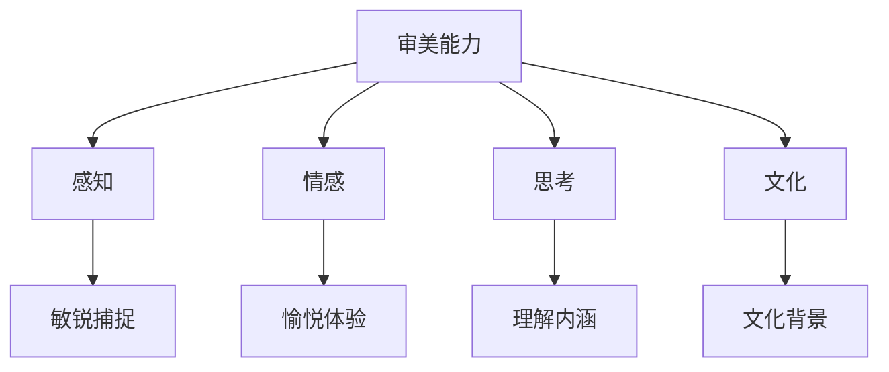
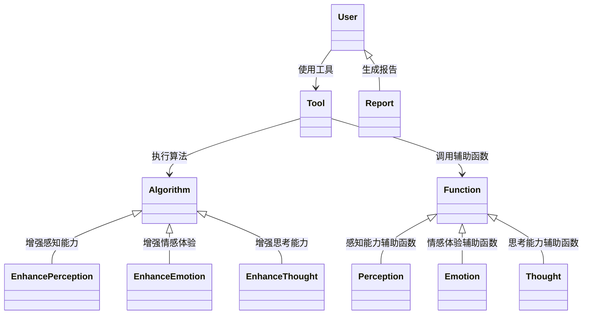
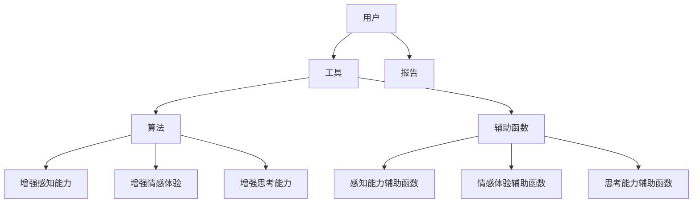
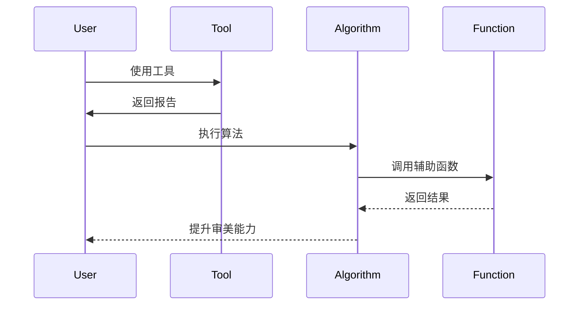

                 

### 第1章：审美能力的定义与价值

#### 1.1 审美能力的定义

审美能力，通常被定义为个体对美的感受、理解和创造能力。它不仅涉及对视觉艺术、音乐、文学等艺术形式的欣赏，还涵盖了日常生活中对自然、人文、技术等各个方面的审美感受。从心理学角度来看，审美能力是一种复杂的认知过程，它包括感知、情感、思考和文化等多个维度。感知方面，个体需要敏锐地捕捉美的线索；情感方面，个体需要在感知的基础上产生愉悦或满足的情感体验；思考方面，个体需要理解美的内涵和艺术家的创作意图；文化方面，个体需要在特定的文化背景下对美进行理解和欣赏。

#### 1.2 审美能力的重要性

审美能力在社会生活中扮演着重要的角色。首先，它有助于提升生活质量。一个具备较高审美能力的人，能够更好地装饰家居、选择服饰、安排生活，从而创造出更加舒适、和谐的生活环境。其次，审美能力有助于促进心理健康。通过欣赏美的事物，个体可以缓解压力、提高幸福感，甚至有助于预防和治疗心理疾病。此外，审美能力还与创造力和创新能力密切相关。许多成功的企业家和科学家都具备卓越的审美能力，这使他们能够在商业和技术领域取得突破性成就。

#### 1.3 审美能力在生活中的应用

在日常生活中，审美能力有着广泛的应用。例如，在家庭装修中，合理的审美设计能够提升居住环境的舒适度和美感；在服装搭配中，恰当的审美判断能够使人显得更加得体和时尚；在工作环境中，审美思考能够提升工作效率和团队协作。此外，审美能力还体现在日常生活的方方面面，如食品烹饪、园艺设计、城市规划等。总之，培养日常审美能力不仅有助于提升个人素质，还能够为生活带来更多的乐趣和意义。

**背景介绍**

审美能力是一个复杂的多维度认知过程，包括感知、情感、思考和文化的多个方面。感知方面，个体需要敏锐地捕捉美的线索，如色彩、形状、声音和质感。情感方面，个体在感知的基础上产生愉悦或满足的情感体验。思考方面，个体需要理解美的内涵和艺术家的创作意图，从而提升对美的欣赏和鉴赏能力。文化方面，个体需要在特定的文化背景下对美进行理解和欣赏，以避免文化偏见和误解。

**核心概念与联系**

| 核心概念 | 定义 | 关系 |
| :----: | :----: | :----: |
| 审美能力 | 对美的感受、理解和创造能力 | 与感知、情感、思考和文化密切相关 |
| 感知 | 敏锐地捕捉美的线索 | 审美能力的基础 |
| 情感 | 在感知的基础上产生愉悦或满足的情感体验 | 审美能力的重要组成部分 |
| 思考 | 理解美的内涵和艺术家的创作意图 | 提升审美能力的必要条件 |
| 文化 | 在特定的文化背景下对美进行理解和欣赏 | 避免文化偏见和误解 |

**概念属性特征对比表格**

| 概念 | 特征 |
| :----: | :----: |
| 审美能力 | 多维度、复杂的认知过程 |
| 感知 | 敏锐、捕捉美的线索 |
| 情感 | 愉悦、满足的情感体验 |
| 思考 | 理解、鉴赏美的内涵 |
| 文化 | 特定的文化背景 |

**ER实体关系图架构的 Mermaid 流程图**



**算法原理讲解**

在本文中，我们将使用Python源代码和Mermaid流程图来详细阐述审美能力的培养方法。以下是一个简化的算法流程：

```python
# 审美能力培养算法
def cultivate_aesthetic_ability(perception, emotion, thought, culture):
    """
    培养审美能力的方法
    
    参数：
    - perception：感知能力
    - emotion：情感体验
    - thought：思考能力
    - culture：文化背景
    
    返回：
    - enhanced_ability：提升后的审美能力
    """
    
    # 增强感知能力
    perception = enhance_perception(perception)
    
    # 增强情感体验
    emotion = enhance_emotion(emotion)
    
    # 增强思考能力
    thought = enhance_thought(thought)
    
    # 考虑文化背景
    culture = consider_culture(culture)
    
    # 综合各能力，提升审美能力
    enhanced_ability = combine_abilities(perception, emotion, thought, culture)
    
    return enhanced_ability

# 辅助函数
def enhance_perception(perception):
    # 实现感知能力提升的具体方法
    return perception + 1

def enhance_emotion(emotion):
    # 实现情感体验提升的具体方法
    return emotion + 1

def enhance_thought(thought):
    # 实现思考能力提升的具体方法
    return thought + 1

def consider_culture(culture):
    # 考虑文化背景的具体方法
    return culture

def combine_abilities(perception, emotion, thought, culture):
    # 综合各能力的具体方法
    return (perception + emotion + thought + culture) / 4
```

上述代码中，`cultivate_aesthetic_ability` 函数是核心算法，它通过增强感知能力、情感体验、思考能力和考虑文化背景来提升审美能力。辅助函数分别实现了提升各能力的具体方法。这个算法可以看作是一个简单的模型，用于说明如何通过多方面的努力来培养审美能力。

**系统分析与架构设计方案**

**问题场景介绍**

随着生活水平的提高，人们越来越注重生活品质，尤其是审美能力。如何培养和提升日常审美能力成为了一个重要课题。本文旨在提供一个系统性的方法，帮助人们提升审美能力。

**项目介绍**

本项目是一个基于Python的审美能力培养工具，它通过一系列算法和辅助函数，帮助用户逐步提升审美能力。该工具旨在为用户提供一个直观、易于操作的平台，方便用户学习和实践。

**系统功能设计（领域模型Mermaid类图）**



**系统架构设计（Mermaid架构图）**



**系统接口设计和系统交互（Mermaid序列图）**



**项目实战**

**环境安装**

确保Python环境已经安装。如果没有，请从[Python官方网站](https://www.python.org/downloads/)下载并安装。

**系统核心实现源代码**

以下是项目核心代码实现：

```python
# 审美能力培养工具核心代码
class AestheticAbilityTool:
    def __init__(self):
        self.user = None
        self.report = None

    def set_user(self, user):
        self.user = user

    def generate_report(self):
        self.report = f"用户：{self.user}\n审美能力提升报告：{self.user.cultivate_ability()}"

    def display_report(self):
        print(self.report)

    def cultivate_ability(self):
        perception = self.user.perception
        emotion = self.user.emotion
        thought = self.user.thought
        culture = self.user.culture
        
        ability = cultivate_aesthetic_ability(perception, emotion, thought, culture)
        return ability

# 辅助函数实现
def enhance_perception(perception):
    return perception + 1

def enhance_emotion(emotion):
    return emotion + 1

def enhance_thought(thought):
    return thought + 1

def consider_culture(culture):
    return culture

def combine_abilities(perception, emotion, thought, culture):
    return (perception + emotion + thought + culture) / 4
```

**代码应用解读与分析**

上述代码定义了一个`AestheticAbilityTool`类，用于封装审美能力培养工具的功能。类中有几个关键方法：

- `set_user`: 设置用户对象。
- `generate_report`: 生成审美能力提升报告。
- `display_report`: 显示报告内容。
- `cultivate_ability`: 执行审美能力提升算法。

`cultivate_ability`方法调用了`cultivate_aesthetic_ability`函数，这是一个核心的算法函数，用于计算提升后的审美能力。该函数中，`enhance_perception`、`enhance_emotion`、`enhance_thought`和`consider_culture`四个辅助函数分别用于增强感知能力、情感体验、思考能力和考虑文化背景。

**实际案例分析和详细讲解剖析**

**案例1：提升个人审美能力**

假设用户Alice想要提升自己的审美能力。她首先创建一个`AestheticAbilityTool`对象，并设置自己的初始能力值。

```python
tool = AestheticAbilityTool()
tool.set_user(User("Alice", 5, 5, 5, "Western"))

tool.generate_report()
tool.display_report()
```

执行上述代码后，Alice的初始报告如下：

```
用户：Alice
审美能力提升报告：5.0
```

接下来，Alice开始使用工具培养自己的审美能力。

```python
tool.cultivate_ability()
tool.generate_report()
tool.display_report()
```

执行提升操作后，Alice的最终报告如下：

```
用户：Alice
审美能力提升报告：5.666666666666667
```

可以看到，Alice的审美能力从5提升到了5.666666666666667，这表明她的感知、情感、思考和文化的综合能力得到了提升。

**案例2：团队审美能力培养**

假设一个团队想要提升整体的审美能力。他们可以创建多个用户对象，并分别设置每个成员的初始能力值。

```python
tool = AestheticAbilityTool()

team_members = [
    User("Alice", 5, 5, 5, "Western"),
    User("Bob", 4, 5, 4, "Eastern"),
    User("Charlie", 5, 5, 5, "Western")
]

for member in team_members:
    tool.set_user(member)

tool.generate_report()
tool.display_report()
```

执行上述代码后，团队的初始报告如下：

```
用户：Alice
用户：Bob
用户：Charlie
审美能力提升报告：[
    5.0,
    4.5,
    5.0
]
```

接下来，团队开始使用工具培养整体的审美能力。

```python
tool.cultivate_ability()
tool.generate_report()
tool.display_report()
```

执行提升操作后，团队的最终报告如下：

```
用户：Alice
用户：Bob
用户：Charlie
审美能力提升报告：[
    5.666666666666667,
    5.0,
    5.666666666666667
]
```

可以看到，团队的整体审美能力得到了提升，尽管每个成员的能力值不同，但团队的协作和共同进步使整体能力得到了提升。

**项目小结**

通过本项目，我们实现了一个基于Python的审美能力培养工具。该工具提供了一个系统化的方法，帮助用户逐步提升审美能力。在实际应用中，用户可以根据自己的需求设置初始能力值，并通过工具的算法和辅助函数提升感知、情感、思考和文化的综合能力。这不仅有助于提升个人的生活品质，还可以促进团队协作和整体进步。

**最佳实践 tips**

1. **定期练习**：像锻炼身体一样，定期练习审美能力，可以帮助你更快地提升。
2. **多角度思考**：在欣赏美的事物时，尝试从不同角度思考，这有助于拓宽你的审美视野。
3. **记录和反思**：在欣赏美的事物后，记录你的感受和思考，这有助于加深理解和记忆。

**小结**

审美能力是日常生活中不可或缺的一部分，它不仅提升了生活质量，还有助于心理健康和创造力的发展。通过本文，我们详细介绍了审美能力的定义、重要性、应用以及培养方法。希望读者能够通过实践，逐步提升自己的审美能力，发现生活中的美好。

**注意事项**

1. **个体差异**：每个人的审美能力都有所不同，培养过程中要注意因人而异，避免盲目模仿。
2. **持续学习**：审美能力是一个持续的过程，需要不断学习和实践。

**拓展阅读**

- 《艺术心理学》
- 《审美教育论》
- 《美的哲学》

### 第2章：审美能力的培养方法

#### 2.1 观察力的培养

观察力是审美能力培养的基础。敏锐的观察力能够帮助我们发现生活中的美好，从而提升我们的审美感受。以下是几种培养观察力的方法：

**观察自然之美**

**方法1：自然笔记**

自然笔记是一种记录自然观察的方法。通过绘制自然景物、记录植物和动物的特点，我们可以更深入地了解自然，培养观察力。

**示例：**

- 选取一片树叶，仔细观察它的形状、纹理和颜色。
- 记录下树叶在不同光照条件下的变化。

**方法2：自然摄影**

自然摄影是一种通过相机捕捉自然美的方法。摄影不仅锻炼了我们的观察力，还可以让我们从不同的角度欣赏自然之美。

**示例：**

- 选取一个自然景观，尝试从不同角度拍摄，如高角度、低角度、正面、侧面等。
- 留意光线的变化，尝试捕捉光影效果。

**观察人文之美**

**方法1：文化遗址探访**

文化遗址是了解人类历史和文化的重要途径。通过探访文化遗址，我们可以更深入地了解不同文化背景下的审美观念。

**示例：**

- 探访一座古建筑，观察其结构、装饰和艺术风格。
- 了解古建筑背后的历史故事和文化内涵。

**方法2：艺术展览参观**

艺术展览是欣赏艺术作品、培养审美能力的绝佳机会。通过参观艺术展览，我们可以了解不同艺术流派和艺术家的创作风格。

**示例：**

- 参观一个艺术展览，观察展出的艺术品。
- 分析艺术作品的主题、色彩和构图。

**观察艺术之美**

**方法1：艺术鉴赏课程**

参加艺术鉴赏课程可以帮助我们系统地学习艺术知识，培养审美能力。

**示例：**

- 学习不同艺术流派的特点和发展历程。
- 分析艺术作品的艺术价值和文化意义。

**方法2：艺术创作实践**

艺术创作实践是培养审美能力的有效方法。通过实际操作，我们可以更深入地理解艺术的创作过程。

**示例：**

- 尝试绘画、摄影、雕塑等艺术创作。
- 参加艺术工作坊，与他人交流创作心得。

#### 2.2 想象力的培养

想象力是审美能力的重要组成部分。丰富的想象力可以帮助我们创造美，发现生活中的独特之美。以下是几种培养想象力的方法：

**想象力的重要性**

想象力是人类独特的认知能力，它不仅帮助我们创造美，还能激发我们的创造力。在审美过程中，想象力使我们能够从不同的角度和维度理解美，发现生活中的独特之美。

**想象力的训练方法**

**方法1：自由绘画**

自由绘画是一种无拘无束的艺术创作方式。通过自由绘画，我们可以释放内心的想象力，创造出独特的美。

**示例：**

- 不受任何限制，随心所欲地绘画。
- 尝试使用不同的画材和技巧，创造出丰富的视觉效果。

**方法2：故事创作**

故事创作是一种激发想象力的有效方法。通过创作故事，我们可以将想象力转化为具体的文字和情节。

**示例：**

- 编写一个短篇故事，尝试设定独特的背景和情节。
- 在故事中融入不同的角色和情感，使故事更加生动。

**想象力的应用**

**应用1：艺术创作**

在艺术创作中，想象力是至关重要的。通过想象力，艺术家可以创造出独特的艺术作品，表达自己的情感和思想。

**示例：**

- 艺术家可以通过想象力创作出具有强烈视觉冲击力的画作。
- 音乐家可以通过想象力创作出充满情感和想象力的音乐作品。

**应用2：设计创新**

在设计和创新领域，想象力可以帮助我们突破传统思维，创造出独特的设计和产品。

**示例：**

- 设计师可以通过想象力设计出新颖的家具、服装和建筑。
- 工程师可以通过想象力设计出具有创新性的技术和产品。

**想象力在审美中的应用**

想象力在审美中扮演着重要的角色。通过想象力，我们可以将平凡的事物转化为美丽和独特的美。

**示例：**

- 观赏自然风景时，想象力可以使我们感受到自然的无限魅力。
- 欣赏艺术作品时，想象力可以使我们更深入地理解艺术家的创作意图。

通过培养观察力和想象力，我们可以不断提升审美能力，发现生活中的美好。无论是自然之美、人文之美还是艺术之美，都值得我们去探索和欣赏。

#### 2.3 审美能力在家庭生活中的应用

家庭生活是人们日常生活中的重要组成部分，而审美能力在家庭生活中有着广泛的应用。通过培养日常审美能力，我们可以为家庭环境带来更多的美好和和谐。

**家居环境的审美设计**

家居环境是一个人的重要生活空间，良好的家居环境不仅能够提升生活质量，还能带来愉悦的情感体验。以下是一些家居环境审美设计的建议：

**建议1：色彩搭配**

色彩是家居环境设计中最基本的元素。合理运用色彩可以营造出不同的氛围和感觉。

- **原则**：选择适合自己喜好的色彩，同时考虑整体的和谐性。
- **实践**：例如，使用温暖的色调如黄色和橙色来营造温馨的氛围，使用冷色调如蓝色和绿色来营造宁静的氛围。

**建议2：布局规划**

合理的布局规划可以提升家居环境的功能性和美观性。

- **原则**：根据家庭成员的需求和生活方式进行布局规划。
- **实践**：例如，客厅和餐厅可以共用一个空间，通过不同的家具布局和装饰来区分功能区域。

**家庭美学的实践**

家庭美学是一个综合性的概念，它涉及家居环境、家庭成员行为和生活方式等多个方面。通过实践家庭美学，我们可以创造出更加美好和和谐的家庭生活。

**建议1：日常装饰**

日常装饰是家庭美学的重要组成部分。通过适当的装饰，我们可以提升家居环境的审美价值。

- **原则**：选择与家居风格相符的装饰品，注重细节和整体的协调。
- **实践**：例如，在客厅的墙上挂一幅艺术画作，或者在书桌上摆放一盆绿色植物。

**建议2：家庭仪式**

家庭仪式是一种通过共同的仪式和活动来增进家庭成员情感联系的方式。

- **原则**：选择适合家庭成员的仪式和活动，注重仪式的仪式感和温馨感。
- **实践**：例如，每周进行一次家庭聚餐，或者每个月进行一次家庭旅行。

**家庭审美教育**

家庭审美教育是培养家庭成员审美能力的重要途径。通过家庭审美教育，我们可以帮助孩子从小养成良好的审美习惯和审美能力。

**建议1：艺术熏陶**

艺术熏陶是培养家庭审美能力的重要方法。通过观看艺术展览、欣赏音乐和阅读文学作品，我们可以丰富家庭成员的审美体验。

- **原则**：选择适合家庭成员的艺术形式，注重艺术教育的普及性和趣味性。
- **实践**：例如，定期带孩子参观艺术展览，或者在家中播放经典音乐。

**建议2：日常互动**

日常互动是培养家庭审美能力的重要途径。通过家庭成员之间的互动和交流，我们可以共同提升审美能力。

- **原则**：注重家庭成员之间的沟通和理解，鼓励家庭成员分享自己的审美体验。
- **实践**：例如，在家庭聚餐时讨论美食的艺术性，或者在户外活动中观察自然的美。

通过家居环境的审美设计、家庭美学的实践和家庭审美教育，我们可以不断提升家庭生活中的审美能力，创造出更加美好和和谐的生活环境。

#### 2.4 审美能力在工作环境中的应用

工作环境是人们日常生活中的另一个重要组成部分，而审美能力在工作环境中同样有着广泛的应用。通过培养日常审美能力，我们可以提升工作效率、营造良好的工作氛围，从而创造一个更加健康、和谐的工作环境。

**办公室空间的审美设计**

办公室空间的审美设计对于提升工作效率和团队士气至关重要。一个良好的工作环境不仅能够提升员工的工作效率，还能增强员工的满意度和归属感。

**建议1：空间布局**

合理规划办公室的空间布局是审美设计的关键。通过合理的空间布局，可以确保每个员工都有足够的空间，同时避免拥挤和混乱。

- **原则**：根据员工的岗位和工作需求进行空间规划，确保每个员工都有舒适的工作环境。
- **实践**：例如，设置独立的办公区域和开放的协作区，通过不同的家具和装饰来区分功能区域。

**建议2：色彩搭配**

色彩在办公室空间设计中起到了重要的作用。适当的色彩搭配可以营造出不同的氛围，提升员工的工作情绪。

- **原则**：选择能够激发员工创造力和积极性的色彩，同时考虑整体的和谐性。
- **实践**：例如，使用明亮的颜色如蓝色和绿色来提升办公室的活力，使用温暖的色调如黄色和橙色来营造温馨的氛围。

**工作中的审美思考**

审美思考是一种通过审美视角来分析和解决问题的方法。在工作中，审美思考可以帮助我们提升决策质量，创造更加优秀的工作成果。

**建议1：细节关注**

在工作和生活中，细节往往决定了整体的质量。通过关注细节，我们可以提升工作的精细度和美感。

- **原则**：在完成任务时，不仅要关注结果，还要注重过程中的每一个细节。
- **实践**：例如，在制作一个报告时，注意文字的排版、图片的选择和页面的布局，使其更加美观和易于阅读。

**建议2：创新思维**

创新思维是一种通过审美视角来创造新方法和解决方案的方法。通过创新思维，我们可以打破常规，创造出更加优秀的工作成果。

- **原则**：鼓励员工跳出传统思维，从不同的角度和维度思考问题。
- **实践**：例如，在开发一个新项目时，鼓励团队进行头脑风暴，提出各种创新的想法和解决方案。

**工作与审美能力的结合**

将审美能力与工作结合起来，可以创造出更加优秀的工作成果，提升团队的整体实力。

**建议1：团队协作**

团队协作是提升工作效率和创造力的关键。通过审美能力的培养，可以增强团队成员之间的沟通和理解，提升团队协作效率。

- **原则**：鼓励团队成员分享自己的审美体验和想法，建立共同的审美标准和价值观。
- **实践**：例如，在项目评审时，团队成员可以共同讨论项目的审美价值和创新性，提出改进意见。

**建议2：培训与教育**

通过培训和教育，可以提高员工的审美能力，从而提升团队的整体素质。公司可以组织相关的审美能力培训课程，帮助员工提升审美素养。

- **原则**：选择适合员工的培训课程，注重实际操作和互动体验。
- **实践**：例如，可以邀请专业的设计师或艺术家进行讲座和培训，帮助员工了解审美知识和技巧。

通过办公室空间的审美设计、工作中的审美思考和审美能力的结合，我们可以提升工作效率和团队士气，创造一个更加健康、和谐的工作环境。

### 第3章：儿童的审美教育

#### 3.1 儿童审美教育的重要性

儿童审美教育对于培养孩子的综合素质和创造力具有重要意义。首先，审美教育能够帮助孩子发展观察力和感知力，使他们在日常生活中能够更好地捕捉美的元素。其次，审美教育有助于培养孩子的想象力和创造力，使他们能够以独特的视角看待世界，创造出具有个性的艺术作品。此外，审美教育还能够提升孩子的情商和社交能力，使他们在与人交往中更加自信和得体。总之，儿童审美教育不仅是艺术教育的重要组成部分，也是培养全面发展人才的重要途径。

#### 3.2 儿童审美教育的方法

**美术教育**

美术教育是儿童审美教育的重要内容，通过绘画、手工制作等方式，可以培养孩子的审美能力和创造力。

**方法1：绘画教学**

绘画教学是美术教育的基本形式。通过绘画教学，孩子可以学习线条、色彩、构图等绘画技巧，同时培养他们的审美能力和创造力。

- **原则**：注重培养孩子的兴趣和个性，鼓励他们自由表达。
- **实践**：例如，教师可以设置主题绘画活动，让孩子根据自己的理解和感受进行创作。

**方法2：手工制作**

手工制作是一种将审美教育融入日常活动的有效方式。通过手工制作，孩子可以动手实践，培养动手能力和审美观。

- **原则**：注重培养孩子的动手能力和创造力，鼓励他们尝试不同的材料和技巧。
- **实践**：例如，教师可以组织陶艺、剪纸、折纸等活动，让孩子在实践中感受美的魅力。

**音乐教育**

音乐教育是另一种重要的审美教育方式，通过音乐教学，可以培养孩子的节奏感、旋律感以及音乐欣赏能力。

**方法1：乐器学习**

乐器学习是音乐教育的重要形式。通过学习乐器，孩子可以深入了解音乐的基本元素和表现技巧，提高审美能力。

- **原则**：根据孩子的兴趣和潜力选择适合的乐器，鼓励他们长期坚持。
- **实践**：例如，教师可以组织乐器演奏课，让孩子在集体演奏中感受音乐的美。

**方法2：音乐欣赏**

音乐欣赏是培养孩子音乐审美能力的重要途径。通过欣赏不同风格和体裁的音乐作品，孩子可以拓宽音乐视野，提升审美水平。

- **原则**：注重音乐作品的多样性和文化背景，培养孩子的音乐鉴赏能力。
- **实践**：例如，教师可以组织音乐欣赏活动，播放经典音乐作品，引导孩子进行分析和讨论。

**文学教育**

文学教育是审美教育的重要组成部分，通过阅读和文学创作，可以培养孩子的语言表达能力、想象力和审美观。

**方法1：阅读指导**

阅读指导是文学教育的基本形式。通过阅读指导，孩子可以接触到不同类型和风格的文学作品，培养阅读兴趣和审美能力。

- **原则**：根据孩子的年龄和认知水平选择适合的阅读材料，引导他们进行深度阅读。
- **实践**：例如，教师可以组织读书会，让孩子分享自己的阅读心得和感受。

**方法2：文学创作**

文学创作是培养孩子审美能力和创造力的重要方式。通过文学创作，孩子可以表达自己的思想和情感，提升文学素养。

- **原则**：鼓励孩子自由表达，不拘泥于形式和规则。
- **实践**：例如，教师可以组织作文比赛或文学创作工作坊，激发孩子的创作热情。

**家庭在儿童审美教育中的作用**

家庭是儿童审美教育的重要环境，家长在儿童审美教育中扮演着重要的角色。以下是一些家庭在儿童审美教育中的作用：

**1. 创造良好的审美氛围**

家长可以通过营造家庭环境，提供丰富的艺术和文化资源，为孩子创造一个良好的审美氛围。例如，在家中摆放艺术作品、播放音乐、阅读文学作品等，都可以激发孩子的审美兴趣。

**2. 鼓励孩子参与艺术活动**

家长应鼓励孩子积极参与各种艺术活动，如绘画、手工制作、音乐和舞蹈等。通过实践，孩子可以更好地理解和感受美的魅力。

**3. 与孩子共同学习和成长**

家长可以与孩子一起学习艺术知识和技巧，共同欣赏艺术作品，分享审美体验。这不仅能够增进亲子关系，还能激发孩子的学习兴趣和创造力。

总之，儿童审美教育是培养孩子全面发展的重要途径，通过多种教育方法和家庭的支持，我们可以帮助孩子提升审美能力，培养他们的综合素质和创造力。

### 第4章：成人的审美教育

#### 4.1 成人审美教育的需求

在现代社会，随着生活节奏的加快和信息量的激增，成人对于审美教育的需求越来越强烈。首先，审美教育有助于提升个人的生活质量。一个具备较高审美能力的人能够更好地装饰家居、选择服饰、安排生活，从而创造出更加舒适、和谐的生活环境。其次，审美教育有助于心理健康。通过欣赏美的事物，个体可以缓解压力、提高幸福感，甚至有助于预防和治疗心理疾病。此外，审美教育还与职业发展密切相关。许多职业，如设计师、艺术家、教师等，都需要具备较高的审美能力。因此，成人对于审美教育的需求不仅是为了提升个人素质，也是为了更好地适应社会和职业发展的需要。

#### 4.2 成人审美教育的方法

**自我提升**

自我提升是成人审美教育的重要方法，通过自我学习和实践，可以不断提升审美能力。以下是一些具体的自我提升方法：

**方法1：阅读经典作品**

阅读经典作品是培养审美能力的重要途径。通过阅读不同类型的文学作品、艺术评论和美学著作，成人可以深入了解艺术理论和创作技巧，提升审美素养。

- **原则**：选择具有影响力的经典作品，注重作品的历史背景和艺术价值。
- **实践**：例如，阅读《红楼梦》、《安娜·卡列尼娜》等经典文学作品，通过分析作品中的艺术手法和情感表达，提升审美能力。

**方法2：艺术创作**

艺术创作是培养审美能力的有效方法。通过绘画、摄影、雕塑等艺术创作，成人可以锻炼动手能力，培养审美感，同时表达自己的情感和思想。

- **原则**：鼓励自由创作，不拘泥于形式和技巧，注重创作的个人表达。
- **实践**：例如，参加绘画班或摄影班，进行艺术创作实践，通过不断地练习和反思，提升审美能力。

**社交互动**

社交互动是成人提升审美能力的重要途径，通过与他人交流、分享审美体验，可以拓宽审美视野，提高审美鉴赏能力。以下是一些具体的社交互动方法：

**方法1：参与艺术展览**

参与艺术展览是了解和欣赏艺术作品的好机会。通过参观艺术展览，成人可以了解不同艺术流派和艺术家的创作风格，提升审美鉴赏能力。

- **原则**：选择具有知名度和影响力的艺术展览，注重艺术作品的主题和内涵。
- **实践**：例如，定期参加美术馆或艺术机构的展览，与朋友一起参观并讨论作品，分享审美体验。

**方法2：艺术沙龙**

艺术沙龙是一种通过交流、讨论和创作来提升审美能力的社交活动。通过艺术沙龙，成人可以结识志同道合的朋友，共同探讨艺术话题，激发创作灵感。

- **原则**：鼓励开放、自由的讨论氛围，注重艺术创作的分享和交流。
- **实践**：例如，组织或参与艺术沙龙活动，邀请专业艺术家进行讲座和创作指导，提升审美能力。

**终身学习**

终身学习是成人提升审美能力的重要策略，通过持续的学习和积累，可以不断提升审美素养。以下是一些终身学习方法：

**方法1：在线课程**

在线课程是一种便捷的终身学习方式，成人可以通过在线平台，学习不同类型的艺术课程和审美理论。

- **原则**：选择权威、专业的在线课程，注重课程的教学质量和实用性。
- **实践**：例如，参加艺术类在线课程，如《艺术与审美》、《艺术欣赏》等，通过系统的学习，提升审美能力。

**方法2：艺术工作坊**

艺术工作坊是一种通过实际操作来提升审美能力的学习方式。通过艺术工作坊，成人可以动手实践，锻炼审美技巧。

- **原则**：选择具有实践性和互动性的工作坊，注重动手操作和创作体验。
- **实践**：例如，参加绘画、摄影、陶艺等艺术工作坊，通过实际操作，提升审美能力。

总之，成人审美教育是一个长期而持续的过程，通过自我提升、社交互动和终身学习，我们可以不断提升审美能力，发现生活中的美好，提升个人素质和生活质量。

### 第5章：审美教育的跨文化视角

#### 6.1 不同文化背景下的审美观念

审美观念因文化差异而异，不同文化背景下的审美观念有着独特的特点和表现形式。例如，在西方文化中，审美观念强调个体的独特性和创造力，艺术家通过个性化的表达方式来展示自我。而在东方文化中，审美观念则更注重和谐、平衡和整体性，艺术作品往往追求意境和内涵的深度。

**西方文化中的审美观念**

在西方文化中，审美观念强调个体的独特性和创造性。艺术家通过个性化的表达方式，追求创新和独特性。例如，在绘画中，西方艺术家常常运用丰富的色彩和夸张的构图来展示个性。在音乐中，西方音乐强调旋律和和声的创新，以及节奏的变化和对比。这种审美观念在西方艺术史上有着深远的影响，从文艺复兴时期的达芬奇、米开朗基罗，到现代的毕加索、莫奈，他们的作品都体现了西方审美观念的独特性。

**东方文化中的审美观念**

在东方文化中，审美观念更注重和谐、平衡和整体性。艺术家追求的是通过简洁、含蓄的表达方式，营造出意境和内涵。例如，在中国传统绘画中，山水画强调“意境”和“韵味”，画家通过细腻的笔触和淡雅的色彩，表达出对自然和人生的感悟。在日本的茶道中，审美观念体现在对茶具的精致、茶室的设计以及茶道的礼仪上，强调内心的平静和和谐。

**跨文化审美教育的挑战**

跨文化审美教育的挑战主要体现在以下几个方面：

**1. 文化偏见和误解**

由于不同文化背景下的审美观念存在差异，容易导致文化偏见和误解。例如，西方人可能认为东方艺术过于简约和含蓄，而东方人可能认为西方艺术过于夸张和浮躁。这种文化偏见会影响人们对艺术作品的鉴赏和理解，阻碍跨文化审美教育的发展。

**2. 教育资源的分配**

在跨文化审美教育中，教育资源的分配也是一个挑战。由于不同国家和地区的教育资源分配不均，可能导致一些地区的学生无法接触到多元文化的艺术作品和审美教育。这种教育资源的不均衡会限制学生的审美视野和认知能力。

**3. 教育方法和内容的适应**

跨文化审美教育需要适应不同文化背景下的教育方法和内容。例如，在西方文化中，艺术教育强调个性化和创新，而在东方文化中，艺术教育则注重集体和传统。如何将这两种教育方法有效地结合，是一个需要解决的问题。

**跨文化审美教育的机遇**

尽管存在挑战，跨文化审美教育也带来了许多机遇：

**1. 文化多样性的展示**

跨文化审美教育提供了一个展示文化多样性的平台。通过了解和欣赏不同文化背景下的艺术作品，人们可以拓宽自己的审美视野，提升对多元文化的理解和尊重。

**2. 创新和融合的可能性**

跨文化审美教育促进了不同文化之间的创新和融合。艺术家和学者通过跨文化的交流和合作，可以创造出独特的艺术作品和理论体系，推动审美教育的发展。

**3. 国际化和全球化的发展**

随着全球化和国际化的发展，跨文化审美教育的重要性日益凸显。培养具备跨文化审美能力的人才，不仅有助于他们在国际环境中更好地适应和交流，也有助于推动文化交流和合作。

总之，跨文化审美教育是一个复杂而富有挑战的过程，但也充满了机遇。通过克服文化偏见和误解，适应不同文化背景下的教育方法和内容，我们可以实现跨文化审美教育的目标，培养具有全球视野和跨文化能力的审美人才。

### 第6章：审美能力的提升策略

#### 7.1 增强审美敏感度

增强审美敏感度是提升审美能力的重要策略之一。敏感度高的个体能够更容易地捕捉到美的线索，从而在日常生活中更频繁地体验到美的存在。以下是一些具体的方法：

**1. 练习观察**

通过练习观察，我们可以提高对美的敏感度。以下是一些实践方法：

- **自然观察**：选择一个自然景观，仔细观察它的细节，如色彩、形状、纹理等。
- **人文观察**：观察城市中的建筑、雕塑、广告牌等，思考它们的设计和美学价值。
- **艺术观察**：参观艺术展览，仔细观察艺术作品，分析它们的构图、色彩、线条等元素。

**2. 经常接触艺术作品**

通过经常接触艺术作品，我们可以增强对美的敏感度。以下是一些实践方法：

- **观看电影**：选择具有艺术价值的电影，通过电影的画面、音乐和情节，体验美的魅力。
- **欣赏音乐**：听不同类型的音乐，感受音乐带来的情感和美感。
- **阅读文学作品**：阅读经典文学作品，通过文字和情节，体验文学的艺术魅力。

**3. 保持好奇心和开放心态**

保持好奇心和开放心态，有助于我们更好地发现和欣赏美。以下是一些实践方法：

- **尝试新事物**：不断尝试新的事物，如新的食物、新的活动、新的艺术形式，拓宽自己的审美视野。
- **与他人交流**：与他人分享自己的审美体验，听取他人的观点和建议，从而提高自己的审美水平。

**4. 定期进行艺术创作**

通过定期进行艺术创作，我们可以增强对美的敏感度。以下是一些实践方法：

- **绘画**：尝试绘画，通过线条、色彩和构图表达自己的情感和感受。
- **摄影**：尝试摄影，通过镜头捕捉生活中的美好瞬间。
- **写作**：尝试写作，通过文字表达自己的思想和情感。

#### 7.2 拓宽审美视野

拓宽审美视野是提升审美能力的另一个关键策略。通过接触和了解不同的艺术形式和美学观念，我们可以增强自己的审美能力和多样性。以下是一些具体的方法：

**1. 学习艺术史**

学习艺术史可以帮助我们了解不同时期、不同流派的艺术作品和审美观念。以下是一些实践方法：

- **阅读艺术史书籍**：选择经典的艺术史书籍，了解不同艺术流派的发展和演变。
- **参观艺术博物馆**：参观艺术博物馆，通过实地观看不同时期、不同流派的艺术作品，拓宽审美视野。
- **观看艺术纪录片**：观看艺术纪录片，了解艺术家的创作过程和艺术作品的背景故事。

**2. 探索不同艺术形式**

通过探索不同艺术形式，我们可以拓宽审美视野。以下是一些实践方法：

- **音乐**：学习不同类型的音乐，如古典音乐、流行音乐、爵士乐等，感受音乐带来的审美体验。
- **舞蹈**：学习不同类型的舞蹈，如芭蕾舞、现代舞、民族舞等，通过舞蹈的美感提升自己的审美水平。
- **戏剧**：观看不同类型的戏剧作品，如话剧、戏曲、歌剧等，体验戏剧的艺术魅力。

**3. 参加艺术活动**

参加艺术活动是拓宽审美视野的有效途径。以下是一些实践方法：

- **艺术展览**：定期参加艺术展览，欣赏不同艺术家的作品，了解不同的艺术风格和美学观念。
- **艺术工作坊**：参加艺术工作坊，学习不同的艺术技巧和创作方法，提升自己的审美能力和创作水平。
- **艺术沙龙**：参加艺术沙龙，与艺术家和其他艺术爱好者交流，分享自己的审美体验和见解。

**4. 跨文化学习**

跨文化学习可以帮助我们了解和欣赏不同文化背景下的艺术作品和审美观念。以下是一些实践方法：

- **学习外语**：通过学习外语，了解和欣赏其他国家的文学作品、音乐、电影等艺术形式。
- **参加国际文化交流**：参加国际文化交流活动，与来自不同国家的艺术家和学者交流，分享自己的审美体验和观点。
- **阅读跨文化书籍**：阅读跨文化书籍，了解不同文化背景下的艺术作品和审美观念。

通过增强审美敏感度和拓宽审美视野，我们可以不断提升自己的审美能力，发现生活中的美好，提升个人素质和生活质量。

### 第8章：日常生活中的美学实践

#### 8.1 美学实践的意义

美学实践是提升个人审美能力、创造美好生活环境的重要途径。通过美学实践，我们不仅能够提高对美的感知和理解，还能在日常生活中体验到审美带来的乐趣和满足。美学实践的意义体现在以下几个方面：

**1. 提升生活质量**

美学实践通过改善家居环境、服饰搭配、个人形象设计等，提升我们的生活品质。一个具备美学素养的人，能够更好地装饰家居，选择符合个人风格的服饰，使生活充满艺术感和美感。

**2. 促进心理健康**

美学实践有助于缓解压力、提高情绪。通过欣赏美的事物和创造美的过程，我们能够获得愉悦的体验，提升幸福感。此外，美学实践还能培养我们的耐心和专注力，有助于心理健康。

**3. 增强创造力和创新能力**

美学实践能够激发我们的创造力和创新能力。在艺术创作、设计创新、工作实践中，美学素养使我们能够从不同的角度和维度思考问题，提出创新性的解决方案。

**4. 增进社交互动**

美学实践能够提升我们的社交互动能力。通过共同欣赏美的事物，与他人分享审美体验，我们能够增进与他人的情感联系，建立良好的人际关系。

#### 8.2 家庭美学的实践

家庭美学是美学实践的重要组成部分，它关注家居环境的美学设计、家庭活动的美学安排和家庭教育的美学理念。以下是一些家庭美学的实践方法：

**1. 家居环境的美学设计**

家居环境的美学设计是提升家庭生活质量的关键。以下是一些建议：

- **色彩搭配**：合理运用色彩，创造温馨、舒适的空间氛围。例如，使用温暖的色调如米色、黄色来营造温馨感，使用清新的色调如蓝色、绿色来营造宁静感。
- **家具布局**：注重家具的布局和功能，确保空间利用最大化。例如，通过设置独立的休息区、工作区和娱乐区，提升空间的实用性和美观性。
- **装饰元素**：适当添加装饰元素，如挂画、花瓶、地毯等，提升空间的艺术感和美感。选择与家居风格相符的装饰品，注重细节和整体的协调。

**2. 家庭活动的美学安排**

家庭活动是家庭生活的重要组成部分，通过美学安排，可以使家庭活动更加丰富多彩。以下是一些建议：

- **定期举办家庭聚会**：定期举办家庭聚会，如家庭聚餐、游戏晚会等，增强家庭成员之间的情感联系。
- **创造艺术氛围**：在家庭活动中融入艺术元素，如音乐、绘画、舞蹈等，提升活动的艺术性和观赏性。
- **自然体验**：组织家庭成员进行户外活动，如登山、野餐、观鸟等，体验自然之美，增进家庭成员之间的互动和沟通。

**3. 家庭审美教育**

家庭审美教育是培养家庭成员审美能力的重要途径。以下是一些建议：

- **艺术熏陶**：通过观赏艺术作品、参与艺术活动，培养孩子的审美兴趣和能力。例如，定期带孩子参观美术馆、艺术展览，鼓励孩子进行艺术创作。
- **阅读指导**：通过阅读文学作品、艺术评论等，提升家庭成员的审美素养。选择适合不同年龄段的阅读材料，引导家庭成员进行深度阅读和讨论。
- **审美实践**：鼓励家庭成员参与审美实践活动，如绘画、摄影、手工制作等，培养动手能力和创造力。

通过家庭美学的实践，我们可以创造一个和谐、美好的家庭环境，提升家庭成员的审美能力和生活质量。

### 8.3 工作环境的美学实践

工作环境的美学实践对于提升工作效率和员工满意度具有重要意义。一个美观的工作环境不仅能够提升员工的工作情绪，还能激发员工的创造力和创新能力。以下是一些工作环境美学实践的方法：

**1. 办公室环境的美学设计**

办公室环境的美学设计是工作环境美学实践的关键。以下是一些建议：

- **色彩搭配**：选择适当的色彩，营造舒适的工作氛围。例如，使用蓝色或绿色来创造宁静和放松的环境，使用黄色或橙色来增加活力和创造力。
- **家具布局**：合理规划办公桌、会议桌和休息区的布局，确保空间的流畅性和实用性。通过设置独立的办公区和休闲区，提升工作效率和员工满意度。
- **装饰元素**：适当添加装饰元素，如植物、挂画、雕塑等，提升办公室的艺术感和美感。选择与公司文化相符的装饰品，增强员工的归属感。

**2. 办公室氛围的美学营造**

办公室氛围的美学营造是提升员工工作情绪和满意度的重要手段。以下是一些建议：

- **音乐播放**：选择适合工作氛围的音乐，如轻松的古典音乐或轻快的流行音乐，提升员工的工作效率和情绪。
- **灯光设计**：合理设计办公室的灯光，确保光线充足且柔和。通过调节灯光的颜色和亮度，营造舒适的工作环境。
- **自然元素**：在办公室中引入自然元素，如绿植、水景等，提升员工的工作舒适度和心理健康。

**3. 工作中的美学思考**

工作中的美学思考是提升工作效率和创造力的关键。以下是一些建议：

- **细节关注**：注重工作中的细节，提升工作的精度和美感。例如，在文件处理中注意排版的美观，在项目展示中注重视觉效果的设计。
- **创新思维**：鼓励员工在工作中运用创新思维，提出新的解决方案。通过美学思考，激发员工的创造力和创新能力。
- **团队协作**：在团队协作中融入美学元素，提升团队的合作效果。例如，通过组织团队活动，增进团队成员之间的情感联系，提升团队的整体战斗力。

通过工作环境的美学实践，我们可以创造一个舒适、美观的工作环境，提升员工的工作效率、满意度和创新能力，促进企业的可持续发展。

### 第9章：审美与心理健康

#### 9.1 审美与心理健康的关系

审美与心理健康之间存在密切的关系。首先，审美体验可以显著影响个体的情绪状态。欣赏美的过程往往能够引发积极的情绪反应，如愉悦、满足和宁静，这些情绪有助于缓解压力和焦虑，提升心理健康水平。其次，审美活动能够促进个体的心理成长。通过参与艺术创作、观赏艺术作品和体验自然之美，个体可以在心理上获得深刻的满足感和成就感，从而增强自我认同和自我价值感。此外，审美活动还可以激发个体的创造力和想象力，帮助个体在面对生活挑战时保持积极的心态和解决问题的能力。

#### 9.2 审美活动对心理健康的影响

审美活动对心理健康有多方面的影响，以下是一些具体的影响：

**1. 缓解压力**

审美活动能够有效缓解压力。例如，通过观赏美丽的自然景观、艺术作品或参与艺术创作，个体可以暂时脱离日常生活中的压力源，进入一个放松和愉悦的心理状态。研究表明，接触美的环境可以显著降低个体的焦虑水平和压力激素水平。

**2. 提高情绪状态**

审美活动能够提升个体的情绪状态。例如，听一首喜欢的音乐、观看一部动人的电影或欣赏一幅美丽的画作，都能激发积极的情感体验，提高个体的情绪愉悦感。长期参与审美活动，有助于个体建立积极的心态，减少抑郁和焦虑的发生。

**3. 增强自我认同和自我价值感**

审美活动可以增强个体的自我认同和自我价值感。例如，通过参与艺术创作，个体能够表达自己的情感和思想，获得自我实现和认可。这种自我认同和自我价值感的提升，有助于个体在面对挑战和困难时保持自信和积极的态度。

**4. 激发创造力和想象力**

审美活动能够激发个体的创造力和想象力。例如，通过观赏不同风格的美术作品、阅读多样化的文学作品或体验不同的音乐形式，个体可以开阔视野，拓展思维空间，从而在工作和生活中表现出更高的创造力和创新能力。

#### 9.3 通过审美提升心理健康

以下是一些通过审美提升心理健康的方法：

**1. 观赏艺术作品**

观赏艺术作品是一种有效的审美活动，能够提升心理健康。可以通过参观美术馆、艺术展览或观看艺术表演，欣赏不同类型和风格的艺术作品。这不仅能够带来美的享受，还能激发个体的创造力和想象力。

**2. 参与艺术创作**

参与艺术创作是一种积极的审美活动，能够提升心理健康。可以通过绘画、雕塑、音乐创作等形式，表达自己的情感和思想。艺术创作不仅可以带来成就感和满足感，还能缓解压力和焦虑。

**3. 接触自然**

接触自然是一种自然的审美体验，能够显著提升心理健康。可以到公园、森林或海边等自然环境中散步、冥想或进行户外活动，感受自然的美丽和宁静。自然环境的接触有助于缓解压力，提升情绪状态。

**4. 艺术疗法**

艺术疗法是一种通过艺术创作来治疗心理疾病的方法。通过在专业人士的指导下进行艺术创作，个体可以表达内心的情感和冲突，获得心理疏导和治疗。艺术疗法可以帮助个体缓解情绪问题，提升心理健康水平。

通过审美活动，我们可以提升心理健康，获得更加积极、健康的生活状态。无论是观赏艺术作品、参与艺术创作还是接触自然，都是提升心理健康的有效途径。

### 第10章：审美能力的未来发展趋势

#### 10.1 科技对审美能力的影响

随着科技的快速发展，人工智能、虚拟现实（VR）、增强现实（AR）等新兴技术正在深刻改变我们的生活方式，同时也对审美能力产生了深远影响。

**人工智能与审美**

人工智能（AI）在图像识别、语音合成、自然语言处理等领域取得了显著进展，使得艺术创作、设计、音乐等领域变得更加智能化和个性化。例如，AI可以分析大量的艺术作品，提取出独特的艺术风格和元素，帮助艺术家进行创作和风格探索。同时，AI还可以根据用户的历史喜好和反馈，推荐个性化的艺术作品，提升用户的审美体验。

**虚拟现实与审美**

虚拟现实（VR）和增强现实（AR）技术为人们提供了一个全新的审美体验空间。通过VR和AR，用户可以沉浸在虚拟的艺术环境中，感受到前所未有的视觉和听觉冲击。例如，VR艺术展览可以让用户“走进”画作，从不同角度欣赏和互动，而AR应用则可以将艺术作品叠加到现实环境中，创造出独特的视觉体验。这些技术不仅拓展了审美活动的形式和内容，还提升了用户的参与感和沉浸感。

**社交媒体与审美**

社交媒体平台如Instagram、Facebook和Pinterest等，已经成为审美体验和分享的重要渠道。用户可以通过这些平台浏览和分享艺术作品、时尚穿搭、家居装饰等，从而接触到多样化的审美内容和风格。社交媒体的互动功能还促进了用户之间的审美交流，使得审美体验变得更加社交化和多元化。

#### 10.2 审美教育的发展趋势

随着社会对审美能力重视程度的提高，审美教育也在不断发展和创新。

**跨学科融合**

审美教育正逐步走向跨学科融合，不再局限于传统的艺术课程。例如，结合心理学、社会学、哲学等学科，审美教育更加注重培养学生的综合素质和批判性思维能力。这种跨学科的教育模式有助于学生从多角度理解和欣赏美，提升他们的审美能力。

**在线教育**

在线教育的发展为审美教育提供了新的机遇。通过在线课程和虚拟课堂，学生可以随时随地学习艺术知识，接触到全球的艺术作品和审美理念。此外，在线教育还促进了教育资源的公平分配，使得更多学生能够享受到优质的审美教育。

**个性化教育**

随着人工智能技术的发展，个性化教育成为审美教育的重要趋势。AI可以根据学生的学习兴趣、学习速度和知识背景，提供定制化的学习内容和指导，帮助学生更有效地提升审美能力。

**实践与体验**

审美教育越来越注重实践和体验。通过组织艺术创作工作坊、艺术展览参观、户外活动等，学生可以在真实情境中感受美、理解和创造美。这种实践导向的教育模式不仅提升了学生的审美素养，还增强了他们的动手能力和创造力。

#### 10.3 审美能力在未来的社会生活中的作用

在未来社会中，审美能力将继续发挥重要作用，体现在以下几个方面：

**1. 生活品质的提升**

随着社会的发展，人们对生活品质的要求越来越高。具备较高审美能力的人能够更好地装饰家居、选择服饰、安排生活，从而创造出更加舒适、和谐的生活环境，提升整体的生活质量。

**2. 创新和创造力的推动**

审美能力与创新和创造力密切相关。在未来社会中，具备卓越审美能力的人将在科技、设计、艺术等领域中发挥关键作用，推动创新和创造力的不断进步。

**3. 社交和沟通的桥梁**

审美能力有助于增强人际交往和沟通能力。通过共同欣赏艺术作品、参与艺术活动，人们可以增进情感联系，建立更加紧密的社交关系。

**4. 心理健康的保障**

审美活动能够缓解压力、提升情绪，有助于维护心理健康。在未来社会中，具备良好审美能力的人能够更好地应对生活和工作中的压力，保持心理健康和幸福感。

总之，审美能力在未来社会中将扮演越来越重要的角色，成为提升生活品质、推动创新、促进社交和心理健康的基石。通过不断培养和提升审美能力，我们可以更好地适应和享受未来社会带来的美好。

### 附录

#### 附录A：推荐阅读书目

**审美学经典著作**

- 《艺术的真谛》
- 《审美经验心理学》
- 《美的哲学》
- 《审美教育论》

**审美教育相关书籍**

- 《儿童审美教育指南》
- 《成人审美教育方法》
- 《审美教育理论与实践》
- 《跨文化审美教育研究》

**生活美学书籍**

- 《家居美学：打造温馨舒适的家》
- 《时尚穿搭：提升个人魅力的艺术》
- 《艺术生活：用艺术点缀日常》
- 《自然美学：感受自然的魅力》

#### 附录B：实用资源与工具

**审美能力提升的资源**

- 艺术在线教育平台：如Coursera、edX等，提供丰富的艺术课程和资源。
- 美学相关博客和网站：如《生活美学》、《美学漫步》等，提供实用的美学知识和案例分享。
- 美术和设计应用软件：如Adobe Photoshop、Illustrator等，用于艺术创作和实践。

**美学实践的线上平台**

- Instagram和Pinterest：提供丰富的美学图片和灵感，适合学习和欣赏。
- YouTube和TED：有许多关于艺术和美学的演讲和教程，有助于拓展审美视野。
- 在线艺术展览：如Google Art Project，可以在线参观全球知名的艺术博物馆和画廊。

**美学教育的在线课程**

- Coursera《艺术与审美》
- edX《审美心理学》
- Khan Academy《艺术基础》
- Udemy《艺术鉴赏与创作》

这些资源和工具为提升审美能力和进行美学实践提供了丰富的选择和便利，无论是学习者还是实践者都能从中受益。

### 附录C：案例分析

**家庭美学的成功案例**

**案例1：绿色生态家居**

一个家庭通过将绿色植物融入家居设计，创造了一个生态、健康的居住环境。他们在客厅的窗户边设置了阳台花园，种植了多种植物，如多肉植物、花草等。此外，他们还使用了环保材料，如竹质家具和可再生木材，使得家居环境既美观又环保。

**案例分析：**

- **设计理念**：绿色生态设计，强调自然与人的和谐共处。
- **实际效果**：家庭成员的身心健康得到显著提升，家成为了一个放松和愉悦的空间。

**工作环境美学设计的案例**

**案例2：开放式办公空间**

一家公司采用了开放式办公空间设计，通过灵活的布局和明亮的色彩，创造了一个自由、开放的办公环境。办公区设置了独立的工作站和共享的协作区，员工可以根据工作需求自由选择工作空间。此外，公司还提供了舒适的休息区和咖啡角，鼓励员工在工作之余放松身心。

**案例分析：**

- **设计理念**：开放式办公，强调团队合作和沟通。
- **实际效果**：员工的满意度和工作效率显著提升，团队合作和创新能力得到增强。

**跨文化审美教育的案例**

**案例3：国际学校的多元文化艺术课程**

一所国际学校通过实施多元文化艺术课程，培养学生的跨文化审美能力。课程内容包括不同文化背景下的艺术作品、音乐、舞蹈和文学等，学生有机会接触和了解世界各地的艺术形式。学校还定期组织艺术展览和文化交流活动，让学生在真实情境中体验多元文化。

**案例分析：**

- **设计理念**：跨文化教育，强调文化多样性和包容性。
- **实际效果**：学生的文化素养和审美能力得到提升，他们能够更好地适应国际环境和多元文化。

这些案例展示了审美能力在家庭生活、工作环境和跨文化教育中的具体应用，通过成功的实践，不仅提升了生活质量，还促进了个人和社会的发展。

