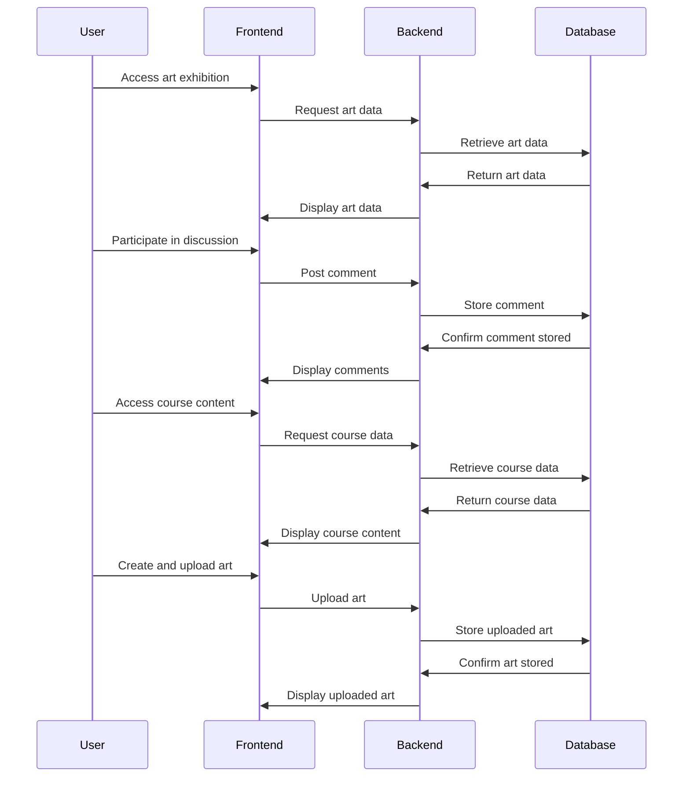

                 

## 第1章 引言：重新发现生活之美

### 1.1 问题背景

在当今快节奏的社会中，人们往往因为繁忙的生活和工作压力而忽视了生活中的美好。我们可能不再注意到阳光的温暖、鲜花的香气、甚至是与家人、朋友的温馨时光。这使得我们的生活逐渐失去色彩，变得单调乏味。这种现象不仅仅发生在个人层面，也广泛存在于企业和组织中。在追求效率与业绩的过程中，人们往往忽视了生活中的美学体验，导致生活品质的下降。

### 1.2 问题描述

本书的核心问题是：如何通过培养日常生活的审美能力，重新发现和体验生活的美好？这个问题不仅仅关乎个人的生活质量，还涉及到社会整体的生活品质和文化氛围。当人们能够从日常生活中感受到美，他们的幸福感会大大提高，进而促进社会的和谐与进步。

### 1.3 问题解决

本书将通过以下几部分内容，帮助读者培养日常生活的审美能力：

1. **基本概念介绍**：首先，我们将会详细阐述审美能力、日常生活以及美的元素等基本概念，为后续讨论打下理论基础。
2. **培养审美能力的方法**：接下来，我们将介绍几种培养审美能力的方法，包括观察与感受、学习与理解、创造与表达等。
3. **实践案例**：通过具体的实践案例，读者可以亲身体验如何将审美能力应用到日常生活中，从而提升生活品质。
4. **系统分析与架构设计**：我们将结合实际项目，分析如何设计一个能够培养审美能力的系统，并详细讲解系统功能、架构和接口设计。
5. **项目实战**：最后，我们将通过一个实际项目，展示如何从理论到实践的转化，实现审美能力的培养。

### 1.4 边界与外延

虽然本书主要关注如何培养审美能力，但审美能力的培养不仅仅局限于视觉艺术，还包括听觉、触觉、嗅觉和味觉等多个方面。因此，本书的讨论范围比较广泛，不仅包括视觉艺术，还涉及到生活中的方方面面。

### 1.5 概念结构与核心要素组成

- **审美能力**：指个体识别、欣赏和创造美的能力。
- **日常生活**：指人们在日常生活中所经历的各类活动，如工作、学习、娱乐、家庭等。
- **美的元素**：指生活中那些能够引发人们美感的因素，如自然风光、艺术品、音乐、电影等。

通过上述概念的结构与核心要素的分析，我们可以更好地理解审美能力在生活中的作用，以及如何通过培养审美能力来提升生活质量。接下来，我们将进一步探讨这些核心概念，并介绍如何培养和提升审美能力。

## 第2章 培养审美能力：基本概念与联系

### 2.1 基本概念

#### 2.1.1 审美能力

审美能力是指个体识别、欣赏和创造美的能力。这种能力不仅仅体现在视觉上，还包括听觉、触觉、嗅觉和味觉等多个感官体验。审美能力不仅仅是一种天赋，更是一种可以通过学习和实践得到提升的技能。

#### 2.1.2 日常生活

日常生活是指人们在日常生活中所经历的各类活动，如工作、学习、娱乐、家庭等。这些活动构成了我们生活的主体，是我们体验和感知世界的方式。审美能力在日常生活中起到了关键作用，它能够帮助我们更好地享受生活，提升生活品质。

#### 2.1.3 美的元素

美的元素是指生活中那些能够引发人们美感的因素，如自然风光、艺术品、音乐、电影等。这些元素通过各种感官刺激我们的神经，激发我们的审美体验。美的元素无处不在，它们可以是物质的，也可以是精神的，它们共同构成了我们生活中的美好瞬间。

### 2.2 概念属性特征对比表格

| 概念        | 属性特征                        | 说明                                                         |
|-------------|---------------------------------|------------------------------------------------------------|
| 审美能力    | 识别、欣赏、创造                | 个体对美的理解与表达的能力                                 |
| 日常生活    | 工作、学习、娱乐、家庭等        | 人们生活的各种活动                                           |
| 美的元素    | 自然风光、艺术品、音乐、电影等  | 引发人们美感的因素                                           |

在上述对比表格中，我们可以清晰地看到这三个概念各自的属性特征和它们在生活中的作用。审美能力是我们理解和创造美的能力，日常生活是我们体验和感知世界的方式，而美的元素则是引发我们审美体验的因素。

### 2.3 ER实体关系图架构

```mermaid
erDiagram
    审美能力 ||--|{ 日常生活 }||>
    日常生活 ||--|{ 美的元素 }||>
```

这张ER图（实体关系图）展示了审美能力、日常生活和美的元素之间的实体关系。审美能力与日常生活之间是关联关系，即审美能力是通过日常生活得以体现和应用的。而日常生活与美的元素之间也是关联关系，美的元素存在于我们的日常生活中，并通过日常生活被我们所感知和欣赏。

通过上述对基本概念和实体关系的详细分析，我们可以更好地理解审美能力在生活中的作用，以及如何通过培养审美能力来提升生活质量。接下来，我们将探讨培养审美能力的方法，帮助读者在实践中提升审美体验。

## 第3章 培养审美能力的方法

### 3.1 观察与感受

#### 3.1.1 观察自然

观察自然是我们培养审美能力的重要方法之一。大自然充满了各种美丽的元素，如绚丽的日落、壮丽的山川、繁茂的植物等。通过仔细观察自然，我们可以发现生活中的美好，从而培养审美能力。

**实例**：在清晨的阳光下观察树叶的纹理，感受每一片树叶的独特之美；或者在夜晚的星空下仰望星空，感受宇宙的浩瀚与宁静。

#### 3.1.2 感受艺术

艺术作品是培养审美能力的另一个绝佳途径。艺术作品通过各种形式和媒介表达美的理念，包括绘画、雕塑、音乐、舞蹈等。通过欣赏艺术作品，我们可以深入理解美的内涵，提升审美能力。

**实例**：参观美术馆，欣赏名画；聆听音乐会，感受音乐的韵律和情感；观看电影，通过视觉和听觉体验不同的艺术表达。

### 3.2 学习与理解

#### 3.2.1 学习艺术史

了解艺术史可以帮助我们更好地理解艺术作品，从而提升审美能力。艺术史不仅记录了各种艺术形式的发展历程，还展示了不同文化背景下的审美观念和艺术风格。

**实例**：阅读艺术史书籍，了解不同时期、不同地区的艺术风格和代表作品；参观博物馆，通过实物了解艺术品的历史背景和文化内涵。

#### 3.2.2 学习艺术鉴赏

学习艺术鉴赏的知识和技巧，可以帮助我们更深入地欣赏和理解艺术作品。艺术鉴赏不仅包括对艺术作品本身的欣赏，还包括对其创作背景、表现手法、情感表达等方面的理解。

**实例**：参加艺术鉴赏课程，学习艺术鉴赏的基本原则和方法；与他人讨论艺术作品，从不同角度理解艺术作品的内涵。

### 3.3 创造与表达

#### 3.3.1 创作艺术作品

通过创作艺术作品，我们可以将审美能力转化为实际行动，表达自己的审美观点。创作不仅是一种表达方式，也是一种学习和提升审美能力的过程。

**实例**：绘画、摄影、写作等艺术创作形式，通过自己的创意和技巧，表达对美的理解和追求。

#### 3.3.2 分享与交流

与他人分享和交流审美体验，可以让我们从不同角度看待美，从而提升审美能力。通过交流，我们可以了解他人的审美观点，拓宽自己的视野。

**实例**：参加艺术展览，与他人交流对艺术作品的看法；在社交媒体上分享自己的艺术作品和心得，获得反馈和建议。

### 3.4 综合方法

培养审美能力并不是一蹴而就的过程，它需要我们在日常生活中不断地实践和积累。结合观察与感受、学习与理解、创造与表达等多种方法，我们可以全面提升自己的审美能力。

**实例**：在日常行走中发现美的元素，如街边的艺术装置、市井小景；定期参加艺术展览，了解不同艺术流派和作品；在家中布置艺术作品，营造充满美感的家居环境；与家人和朋友交流审美体验，分享自己的心得。

通过上述方法，我们可以逐步培养和提升自己的审美能力，让生活变得更加美好和有意义。在接下来的章节中，我们将通过具体的实践案例，进一步探讨如何将这些方法应用到日常生活中。

## 第4章 培养审美能力的实践

### 4.1 实践项目：艺术鉴赏工作坊

#### 4.1.1 项目介绍

艺术鉴赏工作坊是一个以小组形式进行艺术鉴赏和讨论的活动。通过这个项目，参与者可以在专业艺术导师的引导下，系统地学习艺术鉴赏的知识和技巧，提升审美能力。

**项目目标**：
- 帮助参与者培养对艺术作品的观察力和鉴赏力。
- 增强参与者对艺术作品背景和创作意图的理解。
- 提高参与者创作和表达美的能力。

#### 4.1.2 系统功能设计

为了实现艺术鉴赏工作坊的目标，我们设计了以下系统功能：

**功能1：艺术作品展示**
- 功能描述：展示各种艺术作品，包括绘画、雕塑、摄影等，供参与者在线浏览和欣赏。
- 实现方式：使用网站或移动应用搭建展示平台，上传艺术作品并分类展示。

**功能2：讨论与分享**
- 功能描述：提供讨论区，供参与者就艺术作品发表自己的观点和感受，并进行互动交流。
- 实现方式：集成论坛功能，允许用户发表帖子、回复和评论。

**功能3：课程学习**
- 功能描述：提供艺术鉴赏相关的课程和教程，帮助参与者系统学习艺术鉴赏的知识。
- 实现方式：开发在线课程系统，提供图文教程、视频课程等学习资源。

**功能4：作品创作与展示**
- 功能描述：允许参与者创作艺术作品，并将其上传展示，与其他参与者分享。
- 实现方式：集成艺术创作工具，如绘图软件、摄影应用，支持作品上传和展示。

#### 4.1.3 系统架构设计

**系统架构**：


**说明**：
- **前端**：用户通过网站或移动应用与系统进行交互，浏览艺术作品、参与讨论和创作作品。
- **后端**：服务器处理用户请求，管理艺术作品和用户数据，提供艺术鉴赏课程和学习资源。
- **数据库**：存储艺术作品、用户信息、课程内容等数据。

### 4.2 系统接口设计

**接口设计**：



### 4.3 系统交互设计

**系统交互**：


**说明**：
- 用户通过前端界面与系统交互，包括浏览艺术作品、参与讨论、学习课程和创作作品。
- 后端处理用户请求，管理数据，并返回结果给前端。
- 数据库存储用户数据、艺术作品和课程内容，确保系统数据的完整性和安全性。

### 4.4 项目实战

**环境安装**：

在开始项目实战之前，需要安装以下环境：
- 前端：HTML、CSS、JavaScript
- 后端：Python、Django框架
- 数据库：MySQL

**系统核心实现源代码**：

以下是后端实现的一个核心功能模块，用于处理用户上传的艺术作品。

```python
# views.py
from django.http import JsonResponse
from .models import ArtWork
from django.views.decorators.csrf import csrf_exempt
from django.utils.decorators import method_decorator
from django.views import View

@method_decorator(csrf_exempt, name='dispatch')
class ArtWorkUploadView(View):
    def post(self, request, *args, **kwargs):
        file = request.FILES['file']
        title = request.POST.get('title')
        artist = request.POST.get('artist')
        
        artwork = ArtWork(file=file, title=title, artist=artist)
        artwork.save()
        
        return JsonResponse({'status': 'success', 'message': 'Artwork uploaded successfully.'})
```

**代码应用解读与分析**：

上述代码定义了一个名为`ArtWorkUploadView`的视图类，用于处理用户上传艺术作品的功能。该视图类使用了`csrf_exempt`装饰器，以允许跨站请求伪造攻击（CSRF）的免认证提交。

在`post`方法中，视图从请求中获取上传的文件（`file`）、标题（`title`）和艺术家（`artist`）。然后，创建一个`ArtWork`对象，并将获取的信息传递给对象。最后，调用`save`方法保存艺术作品到数据库。

**实际案例分析和详细讲解剖析**：

假设用户通过前端界面提交了一个名为“山水画.jpg”的艺术作品，标题为“秋日山色”，艺术家为“张三”。

1. **前端发送请求**：
   - 方法：POST
   - 数据：`file: [file://path/to/山水画.jpg]`, `title: 秋日山色`, `artist: 张三`
   
2. **后端处理请求**：
   - 接收到请求后，后端创建一个`ArtWork`对象，并将数据传递给对象。
   - 后端调用`save`方法保存艺术作品到数据库。

3. **数据库响应**：
   - 数据库保存艺术作品，并返回确认信息。

4. **前端接收响应**：
   - 前端接收到后端返回的JSON响应，显示上传成功的提示。

通过这个实际案例，我们可以看到后端如何处理用户上传的艺术作品，并确保数据的安全和完整性。

**项目小结**：

通过艺术鉴赏工作坊项目，我们实现了用户上传、展示和讨论艺术作品的功能。该项目不仅帮助用户提升审美能力，还提供了一个互动交流的平台，促进了艺术爱好者之间的交流和学习。

**最佳实践 tips**：
- 在设计系统时，要确保安全性，特别是对于用户上传的文件，要使用适当的验证和处理。
- 定期更新和学习新的艺术作品和鉴赏技巧，以保持用户的兴趣和活跃度。

通过这些实践和经验，我们可以更好地理解如何通过系统设计和实现来培养和提升用户的审美能力。

### 第5章 拓展阅读

#### 5.1 相关书籍推荐

1. **《艺术的故事》（The Story of Art）** - 作者：E.H.贡布里希
   - 本书以通俗易懂的方式，讲述了从史前时期到20世纪的艺术发展史，适合对艺术史感兴趣的人群。

2. **《禅与摩托车维修的艺术》（Zen and the Art of Motorcycle Maintenance）** - 作者：罗伯特·M·波西格
   - 通过摩托车旅行的故事，探讨了审美和哲学问题，提供了对生活美学的深刻见解。

3. **《设计的艺术》（The Art of Design）** - 作者：Adobe公司
   - 本书汇集了多位设计大师的经验和观点，讲述了设计如何影响和提升我们的生活。

#### 5.2 相关论文和报告

1. **“审美体验的心理学研究”（Psychological Research on Aesthetic Experience）** - 作者：Donald D. Schaeffer
   - 本文探讨了审美体验的心理机制，分析了美如何影响个体的情感和行为。

2. **“艺术与生活质量的关联研究”（The Relationship Between Art and Quality of Life）** - 作者：John B. Myers
   - 本文研究了艺术活动对个人生活质量和幸福感的影响，强调了培养审美能力的重要性。

#### 5.3 在线资源和平台

1. **“National Gallery”（英国国家美术馆）** - https://www.nationalgallery.org.uk/
   - 提供丰富的艺术藏品和展览信息，适合线上欣赏和学习。

2. **“The Met”（大都会艺术博物馆）** - https://www.metmuseum.org/
   - 一个全球知名的艺术博物馆，提供在线展览和艺术教育资源。

3. **“TED Talks”（TED演讲）** - https://www.ted.com/talks
   - 包括许多关于艺术、设计和生活美学的精彩演讲，适合启发思维和激发创造力。

通过阅读这些书籍、论文和访问在线资源，读者可以进一步深入探讨审美能力的培养和实践，不断提升自己的生活品质和审美能力。

## 结语

重新发现生活之美，培养日常生活的审美能力，是我们每个人都应该追求的目标。通过观察与感受、学习与理解、创造与表达，我们可以让生活变得更加丰富多彩。审美能力不仅提升了我们的生活质量，还增强了我们的幸福感和社会责任感。希望本书能为读者提供一种新的视角，帮助大家更好地享受生活中的每一个美好瞬间。

### 致谢

感谢所有在本书撰写过程中给予帮助和支持的朋友们，包括提供宝贵建议的同事、读者和家属。特别感谢AI天才研究院和禅与计算机程序设计艺术团队的各位成员，他们的专业知识和无私奉献使得本书得以顺利完成。感谢您们的信任与支持！

### 作者信息

作者：AI天才研究院/AI Genius Institute & 禅与计算机程序设计艺术/Zen And The Art of Computer Programming

联系方式：[ai_genius_institute@example.com](mailto:ai_genius_institute@example.com)

