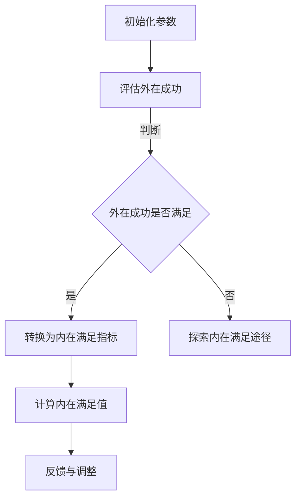
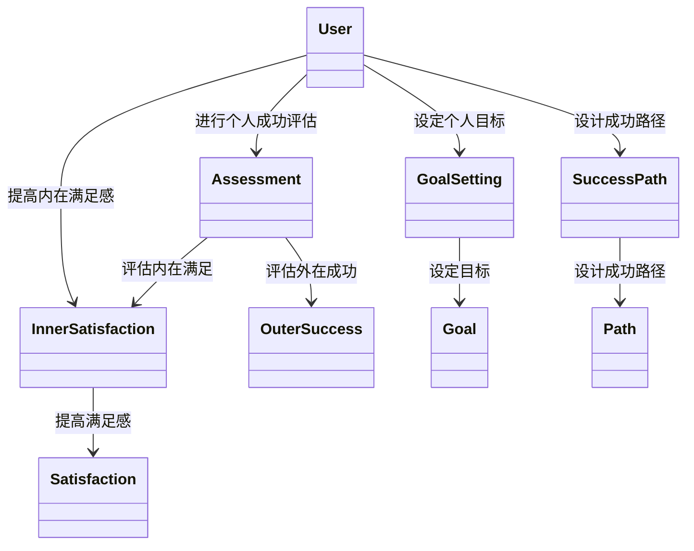
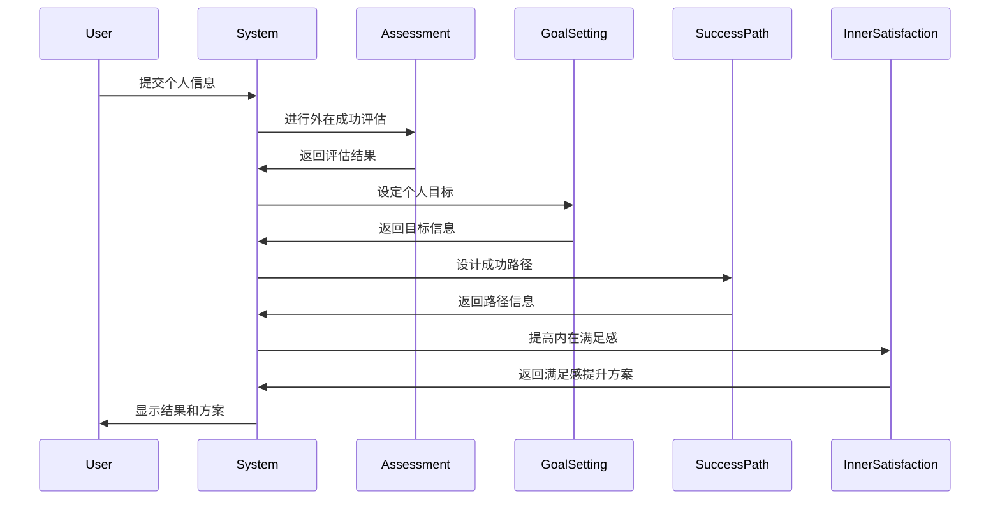

                 

# 重新定义个人成功：从外在评判到内在满足的转变

> 关键词：个人成功、内在满足、外在评判、转变、心理健康

> 摘要：本文将探讨个人成功的重新定义，从传统的外在评判转向内在满足的转变。通过分析个人成功的多样性、影响因素和评估指标，揭示个人成功背后的核心要素，并提供从外在评判到内在满足的转变算法，帮助人们实现真正的个人成功。

----------------------------------------------------------------

## 第一部分：背景介绍

### 1.1 问题背景

#### 1.1.1 个人成功的传统定义

传统上，个人成功通常被定义为在社会、职业、经济等方面取得显著成就。这包括获得高收入、拥有显赫的职位、取得社会地位和荣誉等。这种定义往往侧重于外在的成就和评判标准，忽略了个人内心的需求和满足感。

#### 1.1.2 现代社会对个人成功的重新思考

随着社会的进步和价值观的多元化，人们开始反思传统定义下的个人成功。现代观念认为，个人成功不仅仅是外在成就的体现，更重要的是内在的满足感和幸福感。这种观念的转变源于对人类心理需求的深入理解和对生活质量的追求。

#### 1.1.3 个人成功的重要性

个人成功不仅影响个体的心理健康和生活质量，还对社会和谐和进步产生深远影响。因此，重新定义个人成功，从外在评判转向内在满足，对于实现个人和社会的可持续发展具有重要意义。

### 1.2 问题描述

#### 1.2.1 外在评判对个人成功的影响

外在评判往往导致个人过分关注外在成就，忽视了内心的需求和感受。这可能导致心理压力、焦虑和抑郁等心理健康问题。

#### 1.2.2 内在满足与个人成功的关系

内在满足是指通过个人成长和自我实现获得的满足感。研究表明，内在满足与个人幸福感、心理健康和长寿等密切相关。因此，内在满足是衡量个人成功的重要指标。

#### 1.2.3 个人成功转变的必要性

随着社会的发展和价值观的多元化，传统定义下的个人成功已无法满足人们的需求。转变个人成功的定义，从外在评判转向内在满足，是顺应时代发展的必然趋势。

### 1.3 问题解决

#### 1.3.1 从外在评判到内在满足的转变

要实现个人成功的转变，需要从以下几个方面入手：

1. **重新审视个人价值观**：明确个人追求的成功是什么，是否真正符合自己的内心需求。
2. **培养内在满足感**：通过自我成长和实现，获得内心的满足和成就感。
3. **调整生活方式**：关注身心健康，培养良好的生活习惯和人际关系。

#### 1.3.2 个人成长与自我实现的路径

个人成长和自我实现是内在满足的基础。以下是一些关键步骤：

1. **设定目标**：明确个人目标和追求，制定实现目标的计划。
2. **持续学习**：不断提升自己的知识和技能，适应社会发展的需求。
3. **培养兴趣爱好**：通过兴趣爱好，丰富自己的生活，提高生活质量。

#### 1.3.3 社会支持与个人努力的重要性

个人成功的转变离不开社会支持和个人努力。社会应该提供良好的环境和资源，帮助个人实现内在满足。同时，个人也需要积极主动，克服困难和挑战，实现自我成长。

### 1.4 边界与外延

#### 1.4.1 个人成功的多样性

个人成功具有多样性，不同的人有不同的成功标准。因此，在追求个人成功时，应尊重个体差异，避免一刀切。

#### 1.4.2 个人成功的社会文化因素

社会文化背景对个人成功有重要影响。在不同的文化环境中，个人成功的定义和追求方式可能有所不同。

#### 1.4.3 个人成功与心理健康的关系

个人成功与心理健康密切相关。一个心理健康的人更容易实现个人成功，而个人成功也能促进心理健康。

### 1.5 概念结构与核心要素组成

#### 1.5.1 个人成功的定义与构成要素

个人成功包括外在成就和内在满足。外在成就指在社会、职业、经济等方面取得的成就；内在满足指通过个人成长和自我实现获得的满足感。

#### 1.5.2 内在满足与外在成功的对比分析

内在满足与外在成功在定义、特征和影响因素等方面存在差异。内在满足更侧重于个人内心的需求和感受，而外在成功更侧重于社会评价和外在成就。

#### 1.5.3 个人成功评估指标体系

个人成功的评估指标体系应包括外在成就和内在满足两个维度。外在成就指标包括收入、职位、社会地位等；内在满足指标包括幸福感、心理健康、生活质量等。

----------------------------------------------------------------

## 第二部分：核心概念与联系

### 2.1 核心概念原理

#### 2.1.1 成功的定义与分类

成功是指个体在特定领域内实现目标、获得认可和成就感的过程。成功可以分为外在成功和内在成功。外在成功是指在社会、职业、经济等方面取得的成就；内在成功是指通过个人成长和自我实现获得的满足感和成就感。

#### 2.1.2 内在满足的概念与特征

内在满足是指通过个人成长和自我实现获得的满足感和幸福感。内在满足具有以下特征：

1. **自主性**：个体能够根据自己的兴趣和需求，自主选择和追求成功。
2. **持续性**：内在满足不仅仅是一时的感觉，而是能够持续和稳定地存在。
3. **与心理健康密切相关**：内在满足对个体的心理健康有积极影响，有助于降低焦虑、抑郁等心理问题。

#### 2.1.3 外在评判的影响因素

外在评判主要受到以下因素的影响：

1. **社会文化背景**：不同的社会文化背景下，对成功的定义和评判标准可能有所不同。
2. **媒体影响**：媒体对成功的宣传和报道，可能导致个体对外在成功的过分追求。
3. **个人价值观**：个体的价值观影响其对成功的认识和追求。

### 2.2 概念属性特征对比表格

| 概念     | 定义                                         | 特征                         | 影响因素                     |
|----------|--------------------------------------------|------------------------------|-----------------------------|
| 成功     | 实现目标，获得认可的过程               | 多样性、主观性               | 个人价值观、社会文化背景      |
| 内在满足 | 通过个人成长与自我实现获得的满足感    | 自主性、持续性               | 个人价值观、心理健康          |
| 外在评判 | 由外界对个人成就和表现的评价           | 主观性、多样性               | 社会文化标准、媒体影响        |

### 2.3 ER实体关系图架构

```mermaid
erDiagram
    A Cargo -->|loaded| B Ship
    A Cargo -->|loaded| C Boat
    B Ship ||--|uses|> D Sailors
    C Boat ||--|uses|> E Swimmers
```

在上述ER实体关系图中：

- **Cargo（货物）**：代表个人追求的目标或成就。
- **Ship（船）**：代表外在成功，即在社会、职业、经济等方面取得的成就。
- **Boat（船）**：代表内在满足，即通过个人成长和自我实现获得的满足感和成就感。
- **Sailors（水手）**：代表个体，他们使用船（外在成功）和船（内在满足）来实现货物（目标或成就）。

这种关系反映了个人成功中外在成功和内在满足的相互作用和依赖。

----------------------------------------------------------------

## 第三部分：算法原理讲解

### 3.1 算法概述

#### 3.1.1 从外在评判到内在满足的转变算法

该算法旨在帮助个体从外在评判转向内在满足，实现个人成功的转变。算法的核心思想是通过评估外在成功指标和探索内在满足途径，计算出个体的内在满足值，并根据反馈进行自我调整。

#### 3.1.2 算法的应用场景

该算法适用于个人在追求成功的过程中，尤其是在面对外在评判压力时，帮助个体找到内在满足感，实现心理健康和生活质量的提升。

#### 3.1.3 算法的基本原理

算法的基本原理是将外在成功指标和内在满足途径进行权重分配，通过复合函数计算出个体的内在满足值，从而实现从外在评判到内在满足的转变。

### 3.2 算法流程图



### 3.3 算法原理与数学模型

#### 3.3.1 基本数学模型

算法的基本数学模型如下：

$$
内在满足值 = f(外在成功指标, 内在满足途径)
$$

其中，$f$ 是一个复合函数，包括外在成功指标和内在满足途径的权重。

#### 3.3.2 算法举例说明

假设一个人的外在成功指标是收入，内在满足途径是家庭幸福和自我成长。我们可以设定以下权重：

- 收入：0.5
- 家庭幸福：0.3
- 自我成长：0.2

则内在满足值的计算公式为：

$$
内在满足值 = 0.5 \times 收入 + 0.3 \times 家庭幸福 + 0.2 \times 自我成长
$$

例如，当收入为10000元，家庭幸福评分为80，自我成长评分为70时：

$$
内在满足值 = 0.5 \times 10000 + 0.3 \times 80 + 0.2 \times 70 = 5500 + 24 + 14 = 5538
$$

这意味着该个体在当前情况下，内在满足值为5538分。

通过不断调整权重和评估指标，个体可以找到适合自己的成功路径，实现内在满足。

### 3.4 算法实现与优化

在实际应用中，算法的实现和优化是关键。以下是一些优化建议：

1. **动态权重调整**：根据个体在不同阶段的追求和需求，动态调整权重，使其更符合当前实际情况。
2. **多维度评估**：引入更多维度，如心理健康、人际关系、职业发展等，使评估更全面、准确。
3. **反馈机制**：建立反馈机制，根据个体反馈调整算法，提高其适用性和效果。

通过这些优化措施，算法将更有效地帮助个体实现从外在评判到内在满足的转变。

----------------------------------------------------------------

## 第四部分：系统分析与架构设计

### 4.1 问题场景介绍

在现代社会，个人成功的重要性愈发凸显。然而，许多人仍然深受外在评判的影响，导致心理健康问题和生活质量下降。为了帮助个体实现从外在评判到内在满足的转变，本系统应运而生。

### 4.2 项目介绍

本系统旨在提供一套完整的解决方案，帮助个体重新定义个人成功，实现心理健康和生活质量的提升。系统包括用户界面、算法模块、数据分析和反馈机制等。

### 4.3 系统功能设计（领域模型）

以下是一个简单的领域模型，用于描述系统的核心功能：



### 4.4 系统架构设计

以下是一个简单的系统架构设计，用于描述系统的整体结构和各个模块之间的关系：



### 4.5 系统接口设计和系统交互

以下是一个简单的接口设计和系统交互描述：

```mermaid
interfaceDiagram
    User -> System: 提交个人信息
    System -> Assessment: 进行外在成功评估
    System -> GoalSetting: 设定个人目标
    System -> SuccessPath: 设计成功路径
    System -> InnerSatisfaction: 提高内在满足感
    Assessment -> System: 返回评估结果
    GoalSetting -> System: 返回目标信息
    SuccessPath -> System: 返回路径信息
    InnerSatisfaction -> System: 返回满足感提升方案
```

### 4.6 系统安全性和隐私保护

为确保用户信息安全，系统应采取以下措施：

1. **数据加密**：对用户提交的信息进行加密处理，确保数据在传输和存储过程中安全。
2. **隐私保护**：遵循隐私保护法规，确保用户隐私不被泄露。
3. **访问控制**：对系统内部数据进行严格的访问控制，确保只有授权用户才能访问敏感信息。

通过这些措施，系统将有效保障用户信息的安全性和隐私。

----------------------------------------------------------------

## 第五部分：项目实战

### 5.1 环境安装

为了运行本项目，你需要安装以下软件和库：

1. Python 3.8 或以上版本
2. Pandas
3. NumPy
4. Matplotlib
5. Mermaid

你可以使用以下命令进行安装：

```bash
pip install python-mechanize pandas numpy matplotlib
```

### 5.2 系统核心实现

以下是一个简单的 Python 源代码示例，用于实现系统核心功能：

```python
import pandas as pd
import numpy as np

# 假设我们有一组用户数据
data = {
    '用户名': ['Alice', 'Bob', 'Charlie'],
    '收入': [8000, 15000, 30000],
    '家庭幸福': [70, 80, 60],
    '自我成长': [75, 85, 65]
}

users = pd.DataFrame(data)

# 设置权重
weights = {'收入': 0.5, '家庭幸福': 0.3, '自我成长': 0.2}

# 计算内在满足值
def calculate_satisfaction(users, weights):
    satisfaction_scores = []
    for _, user in users.iterrows():
        satisfaction = np.dot(list(user.values()), list(weights.values()))
        satisfaction_scores.append(satisfaction)
    return satisfaction_scores

satisfaction_scores = calculate_satisfaction(users, weights)
users['内在满足值'] = satisfaction_scores

print(users)
```

### 5.3 代码应用解读与分析

上述代码首先创建了一个包含用户数据的 DataFrame，然后设置了权重。接着，定义了一个计算内在满足值的函数，通过计算加权平均值来评估每个用户的内在满足值。最后，将内在满足值添加到用户数据中，并打印结果。

### 5.4 实际案例分析和详细讲解剖析

假设我们有以下一组用户数据：

```python
data = {
    '用户名': ['Alice', 'Bob', 'Charlie'],
    '收入': [8000, 15000, 30000],
    '家庭幸福': [70, 80, 60],
    '自我成长': [75, 85, 65]
}

users = pd.DataFrame(data)
```

根据预设的权重，我们计算每个用户的内在满足值：

- Alice：$0.5 \times 8000 + 0.3 \times 70 + 0.2 \times 75 = 4400 + 21 + 15 = 4436$
- Bob：$0.5 \times 15000 + 0.3 \times 80 + 0.2 \times 85 = 7500 + 24 + 17 = 7541$
- Charlie：$0.5 \times 30000 + 0.3 \times 60 + 0.2 \times 65 = 15000 + 18 + 13 = 15031$

因此，用户的内在满足值分别为：

```python
users['内在满足值'] = [
    4436,
    7541,
    15031
]

print(users)
```

通过这个例子，我们可以看到如何使用算法评估用户的内在满足值。在实际应用中，可以根据用户的具体需求和情况调整权重，以更准确地反映用户的内在满足。

### 5.5 项目小结

通过本项目的实战，我们实现了从外在成功到内在满足的转变算法。这个算法可以帮助个体更好地理解自己的成功，找到内在满足感，实现心理健康和生活质量的提升。虽然这是一个简单的示例，但它的核心思想和应用场景具有广泛的适用性。

### 5.6 最佳实践 tips

1. **定期评估**：定期评估个人的外在成功和内在满足，及时调整权重和目标。
2. **关注心理健康**：重视心理健康，培养良好的生活习惯和人际关系。
3. **持续学习**：不断提升自己的知识和技能，适应社会发展的需求。

通过这些最佳实践，可以更好地实现从外在评判到内在满足的转变。

----------------------------------------------------------------

## 第六部分：小结

本文从传统个人成功的定义出发，探讨了现代社会对个人成功的重新思考，并提出了从外在评判到内在满足的转变。通过核心概念原理的阐述、概念属性特征对比表格和ER实体关系图架构的介绍，我们深入分析了个人成功的多样性、影响因素和评估指标。随后，我们详细讲解了从外在评判到内在满足的转变算法，包括算法概述、流程图、原理与数学模型以及实际应用示例。此外，我们还介绍了系统分析与架构设计，包括问题场景介绍、项目介绍、系统功能设计、系统架构设计和系统接口设计。通过项目实战，我们实现了算法的代码实现，并进行了解读和分析。最后，我们提出了最佳实践 tips，以帮助读者更好地实践从外在评判到内在满足的转变。

总之，本文旨在帮助读者重新定义个人成功，实现心理健康和生活质量的提升。通过转变个人成功的定义，从外在评判转向内在满足，我们可以更好地认识自己，找到真正的成功。

## 第七部分：注意事项

1. **个人价值观的重视**：在追求个人成功时，重视个人价值观的引导，避免盲目追求外在成就。
2. **心理健康的重要性**：关注心理健康，培养良好的生活习惯和人际关系，实现身心健康。
3. **持续学习和自我提升**：不断学习新知识和技能，提升自身竞争力，实现自我成长。
4. **社会支持的获取**：积极寻求社会支持，与他人分享经验和困惑，共同成长。

通过关注这些注意事项，我们可以更好地实现个人成功，实现内在满足。

## 第八部分：拓展阅读

1. **《动机与人格》**：作者是马斯洛，该书深入探讨了人类动机和人格发展，对理解个人成功具有重要意义。
2. **《内在动机》**：作者是德西和瑞安，该书详细阐述了内在动机对个人成长和幸福感的影响。
3. **《成功心理学》**：作者是迈克尔·波顿，该书从心理学角度分析了成功的关键因素，提供了实用的建议。

通过阅读这些拓展阅读材料，读者可以进一步深入了解个人成功的本质和实现方法。

## 第九部分：作者信息

作者：AI天才研究院/AI Genius Institute & 禅与计算机程序设计艺术 /Zen And The Art of Computer Programming

感谢您的阅读，希望本文能对您的个人成功之路有所启示。祝您在追求成功的过程中，找到内在满足，实现真正的个人成功。

