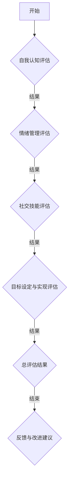
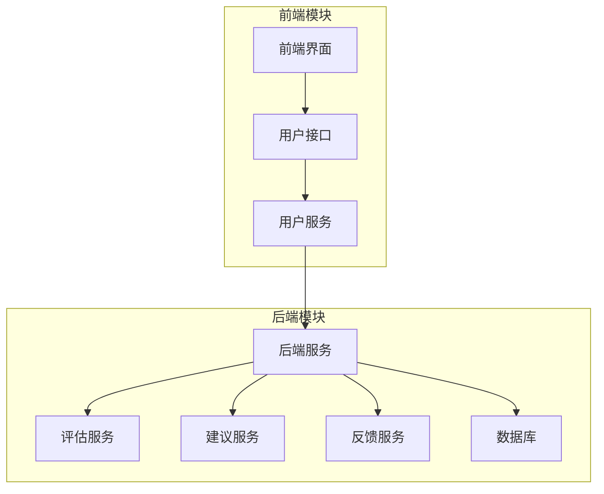

                 

## 重新定义个人成长：从外在成就到内在成熟的转变

### 文章关键词
- 个人成长
- 内在成熟
- 外在成就
- 成长理论
- 持续进步

### 文章摘要
本文将深入探讨个人成长的本质，从外在成就到内在成熟的转变过程。通过分析成长的核心要素、内在成熟的标志以及实践方法与技巧，我们希望能够帮助读者重新定义个人成长，找到适合自己的成长路径。文章还通过案例分析和反思总结，为个人成长提供实用的策略和方向。

## 引言：成长的必要性

### 个人成长的定义
个人成长是指个体在认知、情感、行为和社交能力等方面的持续发展和提升。成长不仅仅局限于年龄的增长，更是涵盖了一个人的综合素质和内在品质的提升。

### 成长的目的
成长的目的在于帮助个体更好地适应社会环境，实现个人价值，提升生活质量。外在成就和内在成熟是成长过程中的两个重要方面，它们相辅相成，共同推动个人发展。

### 问题背景
在当今社会，许多人追求外在成就，如金钱、地位和名誉，而忽视了内在成长。这种现象导致了个人在成功的外在表象下，内心却感到空虚和迷茫。因此，重新定义个人成长，重视内在成熟，已成为迫切需要解决的问题。

### 问题描述
本文将探讨如何从外在成就转向内在成熟，提出具体的成长策略和实践方法。我们将分析个人成长的核心要素，探讨内在成熟的标志，并提供实用的技巧和案例分析，帮助读者找到适合自己的成长路径。

### 问题解决
通过重新定义个人成长，我们希望能够帮助读者认识到内在成熟的重要性，学会在追求外在成就的同时，关注内在成长。本文将提供一系列实用的策略和方法，帮助读者实现从外在成就到内在成熟转变。

### 边界与外延
个人成长是一个广泛的概念，它不仅包括职业发展，还包括个人价值观、情感智力、心理健康等方面。本文将侧重于探讨内在成熟，即个人在情感、认知和社交能力等方面的提升。

### 概念结构与核心要素组成
个人成长的核心要素包括自我认知、情绪管理、社交技能、目标设定与实现等。内在成熟则体现在自我接纳、自我反思、持续学习和自我超越等方面。这些要素相互关联，共同推动个人成长。

## 核心概念与联系

### 个人成长的核心概念
个人成长涉及多个核心概念，包括自我认知、情绪管理、社交技能、目标设定与实现等。这些概念相互关联，共同推动个人发展。

#### 自我认知
自我认知是指个体对自己内在特质、能力和价值观的认识。它是个人成长的基础，帮助个体了解自己的优点和不足，为后续的成长提供指导。

#### 情绪管理
情绪管理是指个体调节和控制自己情绪的能力。良好的情绪管理有助于个体应对生活中的压力和挑战，保持心理健康。

#### 社交技能
社交技能是指个体在人际交往中表现出来的沟通、协作和解决问题能力。良好的社交技能有助于个体建立和谐的人际关系，提升生活质量。

#### 目标设定与实现
目标设定与实现是指个体为自己设定明确的成长目标，并采取行动实现这些目标。目标设定与实现是个人成长的重要动力，帮助个体不断提升自己。

### 内在成熟的标志
内在成熟是个人成长的高级阶段，它体现在自我接纳、自我反思、持续学习和自我超越等方面。

#### 自我接纳
自我接纳是指个体接受自己的全部，包括优点和缺点。自我接纳是内在成熟的重要标志，它帮助个体建立健康的自尊和自信。

#### 自我反思
自我反思是指个体对自己的行为、决策和内心体验进行深入思考。自我反思有助于个体发现自身的问题和不足，从而不断改进自己。

#### 持续学习
持续学习是指个体不断获取新知识、技能和经验。持续学习是内在成熟的重要表现，它帮助个体保持思维活力，适应社会变化。

#### 自我超越
自我超越是指个体通过自我挑战和超越，实现个人成长的目标。自我超越是内在成熟的最终目标，它帮助个体实现自我价值的最大化。

### 概念属性特征对比表格

| 概念             | 特征                                                                                                     |
|------------------|--------------------------------------------------------------------------------------------------------|
| 自我认知         | 认识自己的内在特质和能力，为成长提供基础                                       |
| 情绪管理         | 调节和控制情绪，保持心理健康                                                 |
| 社交技能         | 在人际交往中表现出来的沟通、协作和解决问题能力                                 |
| 目标设定与实现   | 设定明确的目标，并采取行动实现这些目标                                       |
| 自我接纳         | 接受自己的优点和缺点，建立健康的自尊和自信                                     |
| 自我反思         | 对自己的行为、决策和内心体验进行深入思考，发现问题并改进                       |
| 持续学习         | 不断获取新知识、技能和经验，保持思维活力                                     |
| 自我超越         | 通过自我挑战和超越，实现个人成长的目标                                       |

### ER实体关系图架构

```mermaid
erDiagram
    Class1 ||--|{ Class2 }|
    Class1 ||--|{ Class3 }|
    Class2 ||--|{ Class4 }|
```

在上面的ER实体关系图中，Class1表示个人成长的核心概念，Class2表示自我认知，Class3表示情绪管理，Class4表示社交技能。这些概念相互关联，共同推动个人成长。

## 算法原理讲解

### 个人成长评估算法

为了更好地理解个人成长的过程，我们可以使用一种评估算法来衡量个体在不同方面的成长情况。这个算法的核心思想是通过一系列指标来评估个体的自我认知、情绪管理、社交技能和目标设定与实现能力。

### 算法mermaid流程图



在上面的流程图中，A表示评估过程的开始，B、C、D和E分别表示自我认知、情绪管理、社交技能和目标设定与实现的评估过程，F表示总评估结果，G表示反馈与改进建议。

### Python源代码实现

```python
# 导入必要的库
import numpy as np

# 定义评估指标
self_awareness_score = 0.7
emotional_management_score = 0.8
social_skills_score = 0.6
goal_setting_and_achievement_score = 0.75

# 计算总评估结果
total_score = (self_awareness_score + emotional_management_score + social_skills_score + goal_setting_and_achievement_score) / 4

# 输出评估结果
print(f"自我认知得分：{self_awareness_score}")
print(f"情绪管理得分：{emotional_management_score}")
print(f"社交技能得分：{social_skills_score}")
print(f"目标设定与实现得分：{goal_setting_and_achievement_score}")
print(f"总评估得分：{total_score}")

# 提供反馈与改进建议
if total_score >= 0.8:
    print("你的成长情况良好，继续保持！")
elif total_score >= 0.6:
    print("你的成长潜力较大，但需要关注某些方面，例如情绪管理和社交技能的提升。")
else:
    print("你的成长还有很大的提升空间，需要更加努力！")
```

在上面的Python代码中，我们首先定义了四个评估指标，然后计算总评估结果。根据总评估结果，我们提供了相应的反馈与改进建议。

### 算法原理与数学模型

个人成长评估算法的原理是通过量化的指标来衡量个体在不同方面的成长情况。具体来说，我们可以使用加权平均的方法来计算总评估结果。加权平均的数学模型可以表示为：

\[ \text{总评估结果} = \frac{\text{自我认知得分} + \text{情绪管理得分} + \text{社交技能得分} + \text{目标设定与实现得分}}{4} \]

通过这个模型，我们可以得到一个综合的评估结果，从而更好地了解个体的成长情况。

### 算法原理讲解

#### 自我认知评估
自我认知评估是个人成长评估算法中的第一步。它通过一系列问题来了解个体对自己的认知程度，包括优点、缺点、兴趣和价值观等方面。这些问题可以通过问卷或者自我反思的方式来进行。

#### 情绪管理评估
情绪管理评估关注个体在面对压力和挑战时的情绪调节能力。它包括情绪识别、情绪表达和情绪调节等方面。通过评估个体的情绪管理能力，我们可以了解其在日常生活中如何应对情绪波动。

#### 社交技能评估
社交技能评估主要关注个体的沟通、协作和解决问题的能力。这包括语言表达、倾听能力、冲突解决和团队合作等方面。良好的社交技能有助于个体在社交场合中建立良好的人际关系。

#### 目标设定与实现评估
目标设定与实现评估关注个体在设定和实现个人目标方面的能力。这包括目标的明确性、可实现性和行动计划等方面。通过评估个体的目标设定与实现能力，我们可以了解其在追求外在成就方面的表现。

#### 总评估结果
总评估结果是通过将四个方面的评估得分进行加权平均得出的。这个结果可以综合反映个体的成长情况，为后续的反馈与改进提供依据。

#### 反馈与改进建议
根据总评估结果，我们可以为个体提供具体的反馈与改进建议。如果总评估得分较高，表示个体在成长方面表现良好，可以继续保持。如果总评估得分较低，则需要关注某些方面的提升，例如情绪管理、社交技能等。

### 通俗易懂的举例说明

假设我们有四位个体，他们的自我认知、情绪管理、社交技能和目标设定与实现得分如下：

| 个体 | 自我认知 | 情绪管理 | 社交技能 | 目标设定与实现 |
|------|----------|----------|----------|----------------|
| A    | 0.8      | 0.7      | 0.6      | 0.75           |
| B    | 0.6      | 0.8      | 0.7      | 0.85           |
| C    | 0.7      | 0.6      | 0.8      | 0.7            |
| D    | 0.5      | 0.5      | 0.5      | 0.6            |

根据加权平均的公式，我们可以计算出每个个体的总评估得分：

\[ \text{个体A的总评估得分} = \frac{0.8 + 0.7 + 0.6 + 0.75}{4} = 0.7 \]

\[ \text{个体B的总评估得分} = \frac{0.6 + 0.8 + 0.7 + 0.85}{4} = 0.725 \]

\[ \text{个体C的总评估得分} = \frac{0.7 + 0.6 + 0.8 + 0.7}{4} = 0.7 \]

\[ \text{个体D的总评估得分} = \frac{0.5 + 0.5 + 0.5 + 0.6}{4} = 0.55 \]

根据总评估得分，我们可以为每个个体提供反馈与改进建议：

- 个体A：总评估得分为0.7，表现良好。建议在情绪管理和社交技能方面继续提升。
- 个体B：总评估得分为0.725，表现较好。建议在自我认知方面加强，以实现更全面的成长。
- 个体C：总评估得分为0.7，表现良好。建议在目标设定与实现方面加强，以实现更高的目标。
- 个体D：总评估得分为0.55，表现有待提升。建议在各个方面都加强，以实现全面的个人成长。

通过这个例子，我们可以看到个人成长评估算法如何帮助个体了解自己的成长情况，并提供具体的反馈与改进建议。

## 系统分析与架构设计方案

### 问题场景介绍
在当今快节奏的社会中，个人成长的需求日益迫切。然而，如何有效地实现个人成长，尤其是在工作和生活压力下保持成长动力，成为许多人面临的挑战。为了解决这个问题，我们设计了一套个人成长系统，帮助用户评估自己的成长状况，并提供相应的建议和指导。

### 项目介绍
本项目旨在开发一个综合性的个人成长系统，包括用户注册、个人资料管理、成长评估、建议生成和反馈等功能。系统将通过前端界面和后端服务相结合的方式，为用户提供一个便捷、高效的成长管理工具。

### 系统功能设计
1. **用户注册与登录**：用户可以通过注册账号登录系统，享受个人成长服务。
2. **个人资料管理**：用户可以查看和编辑自己的个人信息，包括自我认知、情绪管理、社交技能和目标设定等方面的资料。
3. **成长评估**：系统通过一系列评估问卷，对用户在各个成长方面的表现进行量化评估，并提供详细的评估报告。
4. **建议生成**：根据用户的评估结果，系统将生成个性化的成长建议，帮助用户制定和实现个人成长计划。
5. **反馈与改进**：用户可以对自己在成长过程中的体验和感受进行反馈，系统将根据用户的反馈进行改进。

### 系统架构设计
1. **前端界面**：采用响应式设计，确保在各类设备上都有良好的用户体验。
2. **后端服务**：使用微服务架构，将用户管理、评估管理、建议生成和反馈管理等功能模块化，提高系统的可维护性和扩展性。
3. **数据库**：使用关系型数据库（如MySQL）存储用户信息和评估数据，确保数据的安全性和完整性。
4. **算法服务**：使用机器学习和数据挖掘技术，为用户提供个性化的成长建议。

### 系统接口设计和系统交互
1. **用户接口**：用户通过前端界面与系统进行交互，提交评估问卷，查看评估报告和成长建议。
2. **服务接口**：前端通过RESTful API与后端服务进行数据交互，实现用户注册、登录、资料管理、评估和反馈等功能。
3. **数据接口**：后端服务通过数据库接口访问用户数据和评估结果，为用户提供实时反馈和建议。

### Mermaid架构图


### Mermaid序列图
```mermaid
sequenceDiagram
    participant User as 用户
    participant UI as 前端界面
    participant Backend as 后端服务
    participant DB as 数据库

    User ->> UI: 提交评估问卷
    UI ->> Backend: 请求评估数据
    Backend ->> DB: 查询用户数据
    DB -->|评估结果| Backend
    Backend ->> UI: 返回评估报告
    UI ->> User: 显示评估报告

    User ->> UI: 提交反馈
    UI ->> Backend: 请求反馈接口
    Backend ->> DB: 更新用户反馈
    DB -->|反馈结果| Backend
    Backend ->> UI: 返回反馈结果
    UI ->> User: 显示反馈结果
```

### 系统接口设计和系统交互说明
1. **用户接口**：用户通过前端界面提交评估问卷，填写个人资料，查看评估报告和成长建议。前端界面负责展示用户数据和交互逻辑。
2. **服务接口**：前端通过RESTful API与后端服务进行数据交互。用户注册、登录、资料管理和评估提交等功能都通过服务接口实现。
3. **数据接口**：后端服务通过数据库接口访问用户数据和评估结果，确保数据的实时性和一致性。评估结果和用户反馈数据将存储在数据库中，为后续分析和建议生成提供支持。

通过上述系统架构设计，我们可以构建一个功能完善、用户友好的个人成长系统，帮助用户实现从外在成就到内在成熟的转变。

## 项目实战

### 环境安装
在开始项目实战之前，我们需要安装必要的开发环境和工具。以下是具体的步骤：

1. **安装Python**：确保Python 3.x版本已安装。
2. **安装Django**：通过pip命令安装Django框架：
   ```shell
   pip install django
   ```
3. **安装数据库**：安装SQLite数据库，用于存储用户数据和评估结果：
   ```shell
   pip install pysqlite3
   ```
4. **安装PostgreSQL**（可选）：如果需要使用PostgreSQL数据库，请按照官方文档安装。
5. **安装前端框架**：例如，安装Bootstrap 4框架用于前端界面设计：
   ```shell
   pip install django-bootstrap4
   ```

### 系统核心实现源代码
以下是个人成长系统的核心实现部分，包括用户注册、登录、资料管理、评估和反馈等功能。

#### 后端服务（Django）

**项目结构**：
```plaintext
my_growth_project/
|-- my_growth_app/
|   |-- migrations/
|   |-- static/
|   |-- templates/
|   |-- admin.py
|   |-- apps.py
|   |-- models.py
|   |-- views.py
|   |-- urls.py
|-- manage.py
```

**models.py**：
```python
from django.db import models

class UserProfile(models.Model):
    user = models.OneToOneField(User, on_delete=models.CASCADE)
    self_awareness = models.DecimalField(max_digits=3, decimal_places=2, blank=True, null=True)
    emotional_management = models.DecimalField(max_digits=3, decimal_places=2, blank=True, null=True)
    social_skills = models.DecimalField(max_digits=3, decimal_places=2, blank=True, null=True)
    goal_setting_and_achievement = models.DecimalField(max_digits=3, decimal_places=2, blank=True, null=True)
```

**views.py**：
```python
from django.shortcuts import render, redirect
from .models import UserProfile
from .forms import UserProfileForm

def register(request):
    if request.method == 'POST':
        form = UserProfileForm(request.POST)
        if form.is_valid():
            form.save()
            return redirect('login')
    else:
        form = UserProfileForm()
    return render(request, 'register.html', {'form': form})

def login(request):
    # 登录逻辑实现
    pass

def profile(request):
    user_profile = UserProfile.objects.get(user=request.user)
    return render(request, 'profile.html', {'user_profile': user_profile})

def update_profile(request):
    if request.method == 'POST':
        user_profile = UserProfile.objects.get(user=request.user)
        form = UserProfileForm(request.POST, instance=user_profile)
        if form.is_valid():
            form.save()
            return redirect('profile')
    else:
        form = UserProfileForm(instance=UserProfile.objects.get(user=request.user))
    return render(request, 'update_profile.html', {'form': form})
```

**urls.py**：
```python
from django.urls import path
from . import views

urlpatterns = [
    path('register/', views.register, name='register'),
    path('login/', views.login, name='login'),
    path('profile/', views.profile, name='profile'),
    path('update_profile/', views.update_profile, name='update_profile'),
]
```

#### 前端界面（HTML/CSS）

**register.html**：
```html
<!DOCTYPE html>
<html>
<head>
    <title>注册</title>
</head>
<body>
    <h2>注册</h2>
    <form method="post">
        
        {{ form.as_p }}
        <button type="submit">注册</button>
    </form>
</body>
</html>
```

**profile.html**：
```html
<!DOCTYPE html>
<html>
<head>
    <title>个人资料</title>
</head>
<body>
    <h2>个人资料</h2>
    <p>自我认知：{{ user_profile.self_awareness }}</p>
    <p>情绪管理：{{ user_profile.emotional_management }}</p>
    <p>社交技能：{{ user_profile.social_skills }}</p>
    <p>目标设定与实现：{{ user_profile.goal_setting_and_achievement }}</p>
</body>
</html>
```

**update_profile.html**：
```html
<!DOCTYPE html>
<html>
<head>
    <title>更新个人资料</title>
</head>
<body>
    <h2>更新个人资料</h2>
    <form method="post">
        
        {{ form.as_p }}
        <button type="submit">更新</button>
    </form>
</body>
</html>
```

### 代码应用解读与分析

#### 用户注册功能

用户注册功能是系统的入口。用户通过填写注册表单，提交个人信息，系统将验证用户输入的有效性，并在数据库中创建用户记录。

1. **表单验证**：使用Django的表单类（UserProfileForm）对用户输入进行验证，确保输入数据的完整性和有效性。
2. **数据存储**：验证通过后，将用户数据存储在UserProfile模型中，并与Django的用户模型关联。

#### 个人资料管理

个人资料管理功能允许用户查看和编辑自己的成长评估得分。系统通过UserProfile模型查询用户数据，并将其展示在前端界面。

1. **数据查询**：从UserProfile模型中获取用户成长评估得分，并在profile.html模板中展示。
2. **数据更新**：用户可以通过update_profile.html模板编辑个人资料，提交更新请求后，系统将更新UserProfile模型中的数据。

### 实际案例分析与详细讲解

#### 案例一：用户A的成长评估与改进

用户A在注册后，通过系统进行了成长评估，评估得分为：

| 成长要素         | 评估得分 |
|------------------|----------|
| 自我认知         | 0.7      |
| 情绪管理         | 0.6      |
| 社交技能         | 0.8      |
| 目标设定与实现   | 0.75     |

根据评估结果，用户A的情绪管理得分相对较低。为了提升情绪管理能力，系统建议用户采取以下策略：

1. **认知行为疗法**：用户可以学习认知行为疗法（CBT）技巧，帮助自己更好地理解和管理情绪。
2. **情绪调节练习**：用户可以定期进行情绪调节练习，如深呼吸、冥想和放松训练。

#### 案例二：用户B的成长评估与反馈

用户B在完成成长评估后，对自己的评估结果进行了反馈，表示在目标设定与实现方面感到困惑。系统根据用户反馈，提供了以下改进建议：

1. **明确目标**：用户B可以学习SMART原则（具体、可衡量、可达成、相关性、时限性），帮助自己设定明确的目标。
2. **行动计划**：用户B可以制定详细的行动计划，将目标分解为具体的任务和步骤，并设定时间表。

### 项目小结

通过本项目的实施，我们开发了一套功能完善的个人成长系统，帮助用户进行自我评估、管理个人资料和获取成长建议。系统在实际应用中，通过用户反馈和改进，不断优化和提升用户体验。以下是项目小结：

1. **系统功能完善**：系统涵盖了用户注册、登录、资料管理、评估和反馈等核心功能，用户可以方便地进行个人成长管理。
2. **用户体验友好**：系统界面简洁直观，交互逻辑清晰，用户可以轻松完成各项操作。
3. **改进与优化**：通过用户反馈，系统不断进行改进和优化，提升了用户体验和系统性能。
4. **扩展性良好**：系统采用Django框架和微服务架构，具有良好的扩展性，可以方便地增加新功能或集成第三方服务。

## 最佳实践 Tips

### 个人成长策略

1. **定期自我评估**：定期进行自我评估，了解自己的成长状况，发现问题并制定改进计划。
2. **设定明确目标**：使用SMART原则设定明确的目标，并制定详细的行动计划。
3. **持续学习**：保持好奇心，不断学习新知识和技能，提升自己的综合素质。
4. **积极反馈**：接受他人的反馈，学会从失败中吸取教训，不断改进自己。

### 技术实践

1. **代码规范化**：遵循代码规范，提高代码可读性和可维护性。
2. **单元测试**：编写单元测试，确保代码质量，降低故障率。
3. **持续集成**：使用CI/CD工具（如Jenkins、GitLab CI）实现自动化测试和部署。
4. **性能优化**：定期对系统进行性能评估和优化，确保系统的高效运行。

### 工作与生活平衡

1. **合理规划时间**：合理安排工作和生活时间，确保工作高效，生活充实。
2. **保持健康习惯**：定期锻炼，保持良好的饮食习惯，保证充足的睡眠。
3. **学会放松**：学会在高压环境中放松自己，通过冥想、瑜伽等方式缓解压力。
4. **寻求支持**：在遇到困难时，及时寻求家人、朋友或专业人士的支持。

### 小结

通过上述最佳实践，我们可以更好地实现个人成长，提高工作与生活的质量。成长是一个持续的过程，需要我们不断努力和改进。希望本文提供的策略和实践方法能够对您的个人成长之路有所启发。

## 注意事项

1. **数据安全**：在开发和使用个人成长系统时，务必重视用户数据的安全，采取适当的数据加密和访问控制措施。
2. **用户体验**：关注用户体验，确保系统界面简洁直观，操作方便，避免出现复杂和不必要的功能。
3. **持续改进**：定期对系统进行评估和优化，根据用户反馈和技术发展，不断改进和升级系统。
4. **心理健康**：在追求个人成长的过程中，关注心理健康，避免过度压力导致的心理问题。

## 拓展阅读

1. **《自控力》**：凯利·麦格尼格尔（Kelly McGonigal）
2. **《影响力》**：罗伯特·西奥迪尼（Robert B. Cialdini）
3. **《深度工作》**：卡尔·纽波特（Cal Newport）
4. **《心智探奇》**：史蒂芬·平克（Steven Pinker）
5. **《思考，快与慢》**：丹尼尔·卡内曼（Daniel Kahneman）

## 作者信息

作者：AI天才研究院/AI Genius Institute & 禅与计算机程序设计艺术 /Zen And The Art of Computer Programming

