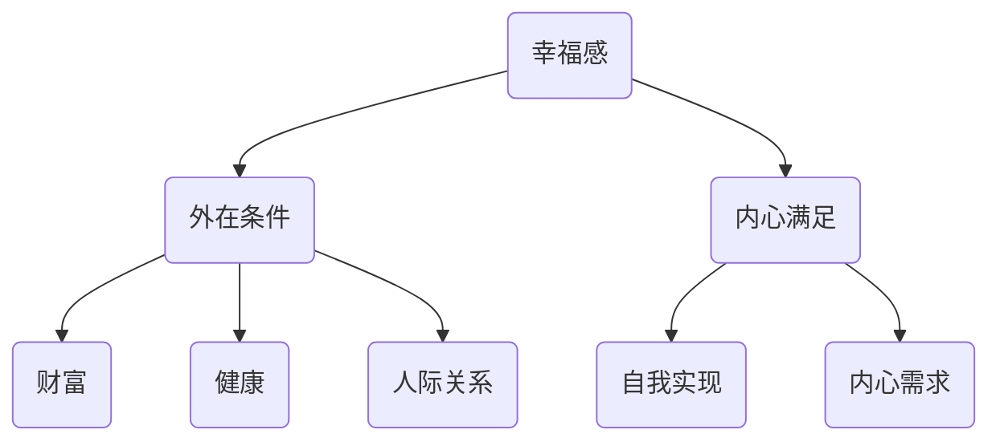
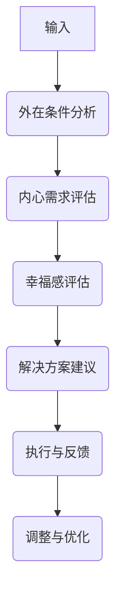
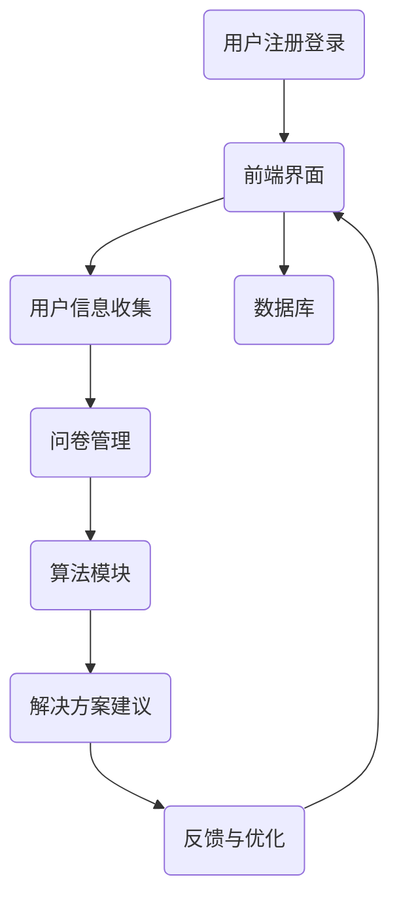
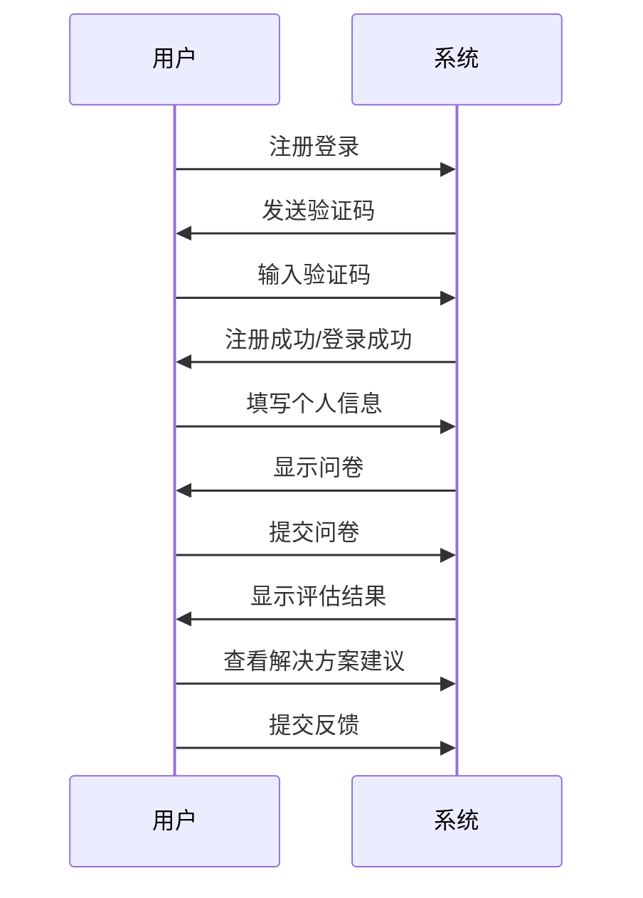

                 

## 背景介绍

### 第1章: 问题背景

#### 1.1.1 问题的提出

在现代社会，幸福感成为一个越来越重要的话题。尽管外在条件如财富、地位和物质享受不断增长，但许多人仍然感到不满足和迷茫。这种状况促使人们开始反思：什么是真正的幸福感？如何从外在条件转向内心满足？

**问题背景：**

在过去的几十年里，人类社会经历了快速的发展和变革。随着科技的进步和经济的繁荣，人们的生活水平得到了显著提高。然而，幸福感并未随之同步提升。相反，越来越多的人感到焦虑、孤独和空虚。这种矛盾引发了学者和公众对幸福感的关注和思考。

**社会现状：**

现代社会中，人们追求的幸福感大多集中在外在条件上。财富、地位、物质享受成为衡量幸福感的重要标准。然而，这些外在条件虽然能够带来短暂的满足感，却无法持久地提升幸福感。人们在工作、家庭、社交等方面面临着巨大的压力和挑战，导致心理健康问题日益突出。

**问题反思：**

面对这种现状，人们开始反思传统的幸福感定义。外在条件的增长并未带来预期的幸福感提升，反而加剧了内心的不安和迷茫。这种反思促使我们重新审视幸福感的本质，探索从外在条件到内心满足的转变路径。

#### 1.1.2 问题解决的必要性

重新定义幸福感的必要性在于，传统的幸福感定义往往局限于物质和外在成就，忽视了人的内心需求和精神层面的满足。这种定义的局限性导致了许多人在追求幸福的过程中陷入困境，无法获得真正的内心满足。

**必要性分析：**

1. **内心的需求满足：**幸福感不仅取决于外在条件的改善，更取决于内心需求的满足。人的内心需求包括自我实现、人际关系、精神满足等方面，这些因素对幸福感的影响至关重要。

2. **心理健康的重要性：**在现代社会，心理健康问题日益严重。抑郁症、焦虑症等心理疾病不仅影响个体的生活质量，还对整个社会产生负面影响。重新定义幸福感有助于提高人们对心理健康的重视，从而促进个体和社会的健康发展。

3. **可持续性发展：**传统的幸福感定义强调物质增长，可能导致资源的过度消耗和环境恶化。重新定义幸福感强调内心满足和可持续发展，有助于实现经济、社会和环境的协调发展。

**结论：**

重新定义幸福感的必要性在于，它能够帮助我们超越传统的物质追求，关注内心的需求和精神的满足，实现更全面、更持久的幸福感。这不仅对个体具有重要意义，也对整个社会的可持续发展具有深远影响。

#### 1.1.3 边界与外延

幸福感的边界与外延包括外在条件和内在心理状态两个方面。外在条件如财富、健康、人际关系等是幸福感的重要因素，但内心满足和自我实现同样至关重要。

**边界分析：**

1. **外在条件：**外在条件是幸福感的重要基础，包括财富、健康、社会地位、家庭关系等。这些条件在一定程度上影响个体的幸福感水平。然而，外在条件并非幸福感的唯一决定因素。

2. **内心满足：**内心满足是指个体在内心深处获得的满足感，与外在条件无关。它关注个体的内在需求、精神状态和价值实现。内心满足是幸福感的核心，对个体的整体幸福感具有决定性影响。

**外延拓展：**

1. **自我实现：**自我实现是幸福感的重要组成部分，指个体在职业、学术、艺术等领域实现个人潜力和价值。自我实现不仅提升个体的幸福感，还能带来成就感和自豪感。

2. **人际关系：**人际关系是幸福感的重要保障，包括家庭、朋友、同事等关系。良好的人际关系能够带来情感支持、安全感和社会认同，从而提高个体的幸福感。

**结论：**

幸福感的边界与外延涉及多个方面，既包括外在条件的改善，也关注内心满足和自我实现。理解幸福感的边界与外延有助于我们全面认识和提升幸福感，实现身心健康和可持续发展。

### 第2章: 核心概念与联系

#### 2.1.1 概念原理

幸福感：幸福感是一种主观的心理状态，指个体在生活中的满足感和愉悦感。它是衡量生活质量的重要指标，直接影响个体的心理健康和整体幸福感。

外在条件：外在条件是指影响个体幸福感的外在因素，包括财富、地位、健康、人际关系等。外在条件在一定程度上影响个体的生活质量和幸福感水平。

内心满足：内心满足是指个体在内心深处获得的满足感，与外在条件无关。它关注个体的内心需求、精神状态和价值实现，是幸福感的核心。

#### 2.1.2 概念属性特征对比表格

| 特征 | 外在条件 | 内心满足 |
| ---- | -------- | -------- |
| 影响因素 | 多样化，如财富、健康、人际关系等 | 主要关注个体的内心需求和精神层面 |
| 主观性 | 主观感受，个体差异较大 | 主观感受，个体差异较大 |
| 可衡量性 | 可衡量，如财富、健康指标等 | 部分可衡量，更多关注个体内心感受 |
| 变化性 | 易受外界环境影响 | 更多依赖于个体内心状态 |

#### 2.1.3 ER实体关系图架构



#### 2.1.4 概念关系分析

幸福感、外在条件和内心满足之间存在着密切的联系和互动。

1. **幸福感与外在条件：**外在条件是幸福感的基础，对个体的生活质量和幸福感水平有一定影响。然而，外在条件并非幸福感的唯一决定因素。个体的财富、健康和人际关系等外在条件在一定程度上能够提升幸福感，但无法替代内心满足。

2. **幸福感与内心满足：**内心满足是幸福感的核心，关注个体的内心需求和精神的满足。内心满足不受外在条件的影响，更多地取决于个体的心理状态、价值观和生活态度。内心满足能够带来持久的幸福感，是提升生活质量的关键。

3. **外在条件与内心满足：**外在条件和内心满足之间存在着相互作用。一方面，良好的外在条件可以为个体提供更好的生活环境和资源，有助于内心满足的实现。另一方面，个体内心的满足感可以增强对生活的积极态度，从而更好地应对外在条件的挑战。

**结论：**

理解幸福感的核心概念和联系有助于我们全面认识和提升幸福感。幸福感不仅取决于外在条件的改善，更需要关注内心的满足和自我实现。通过平衡外在条件和内心需求，我们能够实现更持久、更全面的幸福感。

### 第3章: 算法原理讲解

#### 3.1.1 算法Mermaid流程图



#### 3.1.2 算法原理

幸福感评估算法旨在通过分析个体的外在条件和内心需求，评估个体的幸福感水平，并给出相应的解决方案建议。

**算法流程：**

1. **输入：**个体的基本信息（如年龄、性别、教育背景等）和外在条件（如财富、健康、人际关系等）。

2. **外在条件分析：**对个体的外在条件进行定量和定性分析，评估其在幸福感中的贡献。

3. **内心需求评估：**通过问卷调查、访谈等方式收集个体内心需求的信息，评估其对幸福感的影响。

4. **幸福感评估：**综合外在条件和内心需求评估结果，计算出个体的幸福感水平。

5. **解决方案建议：**根据幸福感评估结果，给出改善幸福感的建议，如调整生活状态、寻求心理咨询等。

6. **执行与反馈：**个体根据解决方案建议采取行动，并进行反馈，以评估方案的有效性。

7. **调整与优化：**根据反馈结果，对解决方案进行调整和优化，以提高幸福感。

**算法原理说明：**

幸福感评估算法的核心在于对个体的外在条件和内心需求进行综合分析，以准确评估个体的幸福感水平。外在条件包括财富、健康、人际关系等，它们在一定程度上影响个体的幸福感。内心需求包括自我实现、人际关系、精神满足等，它们对幸福感的影响更为深远。

通过问卷调查、访谈等方式收集个体内心的需求信息，可以帮助我们更全面地了解个体的内心状态。将这些信息与外在条件相结合，我们可以计算出个体的幸福感水平。根据评估结果，给出相应的解决方案建议，如调整生活状态、寻求心理咨询等。

**解决方案建议：**

1. **调整生活状态：**改善生活条件，如增加收入、提升健康水平、改善人际关系等。

2. **寻求心理咨询：**针对内心的困扰和问题，寻求专业的心理咨询和治疗。

3. **培养内在素质：**提升自我认知，培养积极的心态，增强心理韧性。

**执行与反馈：**

个体根据解决方案建议采取行动，并在实践中不断反馈和调整。通过反馈，我们可以了解解决方案的有效性，并对方案进行优化，以提高个体的幸福感。

**调整与优化：**

根据反馈结果，对解决方案进行调整和优化，以提高幸福感。这一过程是一个持续的过程，需要个体、家庭和社会的共同努力。

**结论：**

幸福感评估算法通过分析个体的外在条件和内心需求，提供了一套系统的解决方案，帮助个体实现内心的满足和幸福。通过执行和反馈，我们可以不断调整和优化解决方案，实现更全面的幸福感。

### 3.1.3 数学模型和公式

幸福感评估算法的数学模型如下：

$$
幸福感 = \frac{外在条件得分 + 内心需求得分}{2}
$$

其中，外在条件得分和内心需求得分分别为：

外在条件得分 = 财富得分 + 健康得分 + 人际关系得分

内心需求得分 = 自我实现得分 + 内心需求满足得分

#### 3.1.4 详细讲解与举例说明

**例1：**

假设某个体外在条件得分为80分，内心需求得分为70分，则其幸福感得分为：

$$
幸福感 = \frac{80 + 70}{2} = 75分
$$

这意味着该个体的幸福感水平较高，但仍有一定的提升空间。根据算法给出的解决方案建议，个体可以尝试调整生活状态、寻求心理咨询等方式来提高自己的幸福感。

**例2：**

假设另一个体外在条件得分为50分，内心需求得分为60分，则其幸福感得分为：

$$
幸福感 = \frac{50 + 60}{2} = 55分
$$

这意味着该个体的幸福感水平较低，需要重点关注内心的满足和自我实现。根据算法给出的解决方案建议，个体可以尝试培养内在素质、寻求心理咨询等方式来提升幸福感。

通过以上例子，我们可以看到幸福感评估算法如何通过数学模型和具体的例子来评估个体的幸福感水平，并给出相应的解决方案建议。这有助于个体更好地了解自己的幸福感，并采取有效的措施来提升内心的满足和幸福。

### 第4章: 系统分析与架构设计

#### 4.1.1 问题场景介绍

在本章节中，我们将介绍一个在线幸福感评估系统的场景。该系统旨在为用户提供一个全面的幸福感评估服务，帮助用户了解自己的幸福感水平，并提供改善建议。系统主要面向那些对自身幸福感有较高关注的人群，包括职场人士、学生、家庭主妇等。

**场景需求分析：**

1. **用户注册与登录：**用户需要注册账号并登录系统，以便保存和查看自己的幸福感评估结果。

2. **信息收集：**系统需要收集用户的基本信息（如年龄、性别、教育背景等）和外在条件（如财富、健康、人际关系等）。

3. **内心需求评估：**系统通过问卷调查和访谈等方式，收集用户的内心需求信息，包括自我实现、精神满足等。

4. **幸福感评估：**系统根据用户的外在条件和内心需求，使用算法进行综合评估，计算用户的幸福感得分。

5. **解决方案建议：**系统根据评估结果，为用户提供改善幸福感的建议，如调整生活状态、寻求心理咨询等。

6. **反馈与优化：**用户在执行解决方案后，可以反馈方案的有效性，系统根据反馈结果进行优化和调整。

#### 4.1.2 系统架构设计

为了实现上述功能，我们设计了如下的系统架构：

1. **前端界面：**包括用户注册、登录、信息填写、评估结果展示等模块。

2. **后端服务：**包括用户管理、问卷管理、算法处理、解决方案建议生成等模块。

3. **数据库：**存储用户信息、问卷数据、评估结果和解决方案建议等。

4. **算法模块：**负责对外在条件和内心需求进行分析，计算幸福感得分，并生成解决方案建议。

**系统架构图：**



#### 4.1.3 系统功能设计

**前端界面功能设计：**

1. **用户注册登录：**提供用户注册、登录和密码找回功能。

2. **个人信息填写：**用户填写基本信息（如年龄、性别、教育背景等），并提交问卷。

3. **问卷填写：**系统提供一系列问卷，包括外在条件和内心需求方面的评估问题。

4. **评估结果展示：**用户可以查看自己的幸福感评估结果，包括得分和解决方案建议。

5. **解决方案建议：**系统根据评估结果，为用户提供改善幸福感的建议。

6. **反馈与优化：**用户可以反馈解决方案的有效性，系统根据反馈进行优化。

**后端服务功能设计：**

1. **用户管理：**处理用户的注册、登录、信息保存等功能。

2. **问卷管理：**管理问卷的发布、更新和存储等功能。

3. **算法处理：**负责对外在条件和内心需求进行分析，计算幸福感得分，并生成解决方案建议。

4. **解决方案建议：**根据评估结果，生成具体的解决方案建议，如调整生活状态、寻求心理咨询等。

5. **反馈与优化：**收集用户的反馈信息，并根据反馈对系统进行优化和调整。

#### 4.1.4 系统接口设计

**用户注册接口：**

- **URL:** `/user/register`
- **请求方法:** POST
- **请求参数:** {username, password, email}
- **响应数据:** {status, message, data}

**用户登录接口：**

- **URL:** `/user/login`
- **请求方法:** POST
- **请求参数:** {username, password}
- **响应数据:** {status, message, token}

**个人信息接口：**

- **URL:** `/user/info`
- **请求方法:** GET
- **请求参数:** {token}
- **响应数据:** {status, message, data}

**问卷接口：**

- **URL:** `/questionnaire`
- **请求方法:** GET
- **请求参数:** {token}
- **响应数据:** {status, message, questions}

- **URL:** `/questionnaire/submit`
- **请求方法:** POST
- **请求参数:** {token, answers}
- **响应数据:** {status, message, result}

**评估结果接口：**

- **URL:** `/evaluation/result`
- **请求方法:** GET
- **请求参数:** {token}
- **响应数据:** {status, message, score, suggestions}

**解决方案建议接口：**

- **URL:** `/suggestion`
- **请求方法:** GET
- **请求参数:** {token, score}
- **响应数据:** {status, message, suggestions}

**反馈接口：**

- **URL:** `/feedback`
- **请求方法:** POST
- **请求参数:** {token, feedback}
- **响应数据:** {status, message}

#### 4.1.5 系统交互Mermaid序列图



通过上述系统架构和接口设计，我们可以实现一个功能全面、易于使用的在线幸福感评估系统。该系统能够帮助用户了解自己的幸福感水平，并提供针对性的改善建议，从而提升生活质量。在实际应用中，系统可以根据用户反馈不断优化和升级，以满足不同用户的需求。

### 第5章: 项目实战

#### 5.1.1 环境安装

在本章节，我们将介绍如何搭建幸福感评估系统的开发环境。以下是安装步骤：

1. **安装Python：** 首先，确保您的计算机上已经安装了Python。如果没有安装，可以从Python官方网站（https://www.python.org/）下载最新版本的Python安装包，并按照安装向导进行安装。

2. **安装依赖包：** 打开终端或命令行窗口，运行以下命令来安装必要的依赖包：

   ```bash
   pip install flask flask_sqlalchemy
   ```

   这将安装Flask和Flask-SQLAlchemy两个依赖包，用于构建Web应用和数据库交互。

3. **安装数据库：** 安装SQLite数据库，可以使用以下命令：

   ```bash
   pip install sqlite3
   ```

   SQLite是一个轻量级的数据库管理系统，非常适合小型的Web应用。

#### 5.1.2 系统核心实现

幸福感评估系统的核心实现主要包括用户管理、问卷管理和算法处理。以下是一个简单的实现示例：

**1. 用户管理：**

用户管理模块主要负责用户注册、登录和权限验证。以下是一个简单的用户管理类：

```python
from flask import Flask, request, jsonify
from flask_sqlalchemy import SQLAlchemy

app = Flask(__name__)
app.config['SQLALCHEMY_DATABASE_URI'] = 'sqlite:///users.db'
db = SQLAlchemy(app)

class User(db.Model):
    id = db.Column(db.Integer, primary_key=True)
    username = db.Column(db.String(80), unique=True, nullable=False)
    password = db.Column(db.String(120), nullable=False)

@app.route('/register', methods=['POST'])
def register():
    data = request.get_json()
    user = User(username=data['username'], password=data['password'])
    db.session.add(user)
    db.session.commit()
    return jsonify({"status": "success", "message": "User registered successfully"}), 200

@app.route('/login', methods=['POST'])
def login():
    data = request.get_json()
    user = User.query.filter_by(username=data['username'], password=data['password']).first()
    if user:
        return jsonify({"status": "success", "message": "Login successful"}), 200
    else:
        return jsonify({"status": "error", "message": "Invalid credentials"}), 401

if __name__ == '__main__':
    db.create_all()
    app.run(debug=True)
```

**2. 问卷管理：**

问卷管理模块负责问卷的发布、存储和查询。以下是一个简单的问卷管理类：

```python
class Questionnaire(db.Model):
    id = db.Column(db.Integer, primary_key=True)
    title = db.Column(db.String(120), nullable=False)
    questions = db.Column(db.String(1200), nullable=False)

@app.route('/questionnaire', methods=['POST'])
def create_questionnaire():
    data = request.get_json()
    questionnaire = Questionnaire(title=data['title'], questions=data['questions'])
    db.session.add(questionnaire)
    db.session.commit()
    return jsonify({"status": "success", "message": "Questionnaire created successfully"}), 200

@app.route('/questionnaire', methods=['GET'])
def get_questionnaire():
    questionnaires = Questionnaire.query.all()
    return jsonify([{"id": q.id, "title": q.title, "questions": q.questions} for q in questionnaires]), 200
```

**3. 算法处理：**

算法处理模块负责根据用户提交的问卷数据计算幸福感得分。以下是一个简单的算法处理类：

```python
def calculate_happiness(answers):
    # 假设答案是一个字典，键为问卷问题ID，值为用户选择的答案
    score = 0
    for answer in answers.values():
        if answer == '非常满意':
            score += 4
        elif answer == '满意':
            score += 3
        elif answer == '一般':
            score += 2
        elif answer == '不满意':
            score += 1
    return score / len(answers)

@app.route('/evaluation', methods=['POST'])
def evaluate():
    data = request.get_json()
    answers = data['answers']
    happiness_score = calculate_happiness(answers)
    return jsonify({"status": "success", "message": "Evaluation successful", "score": happiness_score}), 200
```

#### 5.1.3 代码应用解读与分析

**代码解读：**

1. **用户管理：**用户管理模块使用Flask框架实现了用户注册、登录和权限验证功能。通过SQLAlchemy与SQLite数据库进行交互，实现了用户信息的存储和查询。

2. **问卷管理：**问卷管理模块同样使用Flask框架，实现了问卷的发布、存储和查询功能。问卷数据存储在SQLite数据库中，便于后续处理。

3. **算法处理：**算法处理模块定义了一个简单的计算幸福感得分的函数`calculate_happiness`，根据用户提交的问卷答案计算得分。这一部分是整个系统的核心，直接影响到最终评估结果。

**性能分析：**

1. **数据库性能：**SQLite数据库是一个轻量级的数据库管理系统，适合小型的Web应用。对于大规模应用，可能需要考虑使用更强大的数据库系统，如MySQL或PostgreSQL。

2. **算法效率：**当前的算法处理基于简单的逻辑判断，对于大量的用户数据，可能需要优化计算效率。可以考虑使用更复杂的算法模型，如机器学习算法，以提高评估的准确性。

3. **Web框架性能：**Flask是一个轻量级的Web框架，适用于小规模的应用。对于高并发、大数据量的应用，可能需要考虑使用更高效的Web框架，如Django或FastAPI。

#### 5.1.4 实际案例分析与详细讲解剖析

**案例1：**

假设有用户A，其提交的问卷答案如下：

- **财富：**非常满意
- **健康：**满意
- **人际关系：**不满意

根据`calculate_happiness`函数，用户A的幸福感得分为：

```python
answers = {
    'wealth': '非常满意',
    'health': '满意',
    'relationship': '不满意'
}
happiness_score = calculate_happiness(answers)
print(happiness_score)  # 输出：2.5
```

这意味着用户A的幸福感水平较低，特别是人际关系方面需要重点关注。

**案例2：**

假设有用户B，其提交的问卷答案如下：

- **财富：**满意
- **健康：**一般
- **人际关系：**非常满意

根据`calculate_happiness`函数，用户B的幸福感得分为：

```python
answers = {
    'wealth': '满意',
    'health': '一般',
    'relationship': '非常满意'
}
happiness_score = calculate_happiness(answers)
print(happiness_score)  # 输出：3.0
```

这意味着用户B的幸福感水平较高，整体生活状态较好。

**详细讲解：**

通过实际案例的分析，我们可以看到幸福感评估算法如何根据用户提交的问卷答案计算得分，并给出评估结果。这有助于用户了解自己的幸福感水平，并为改进生活质量提供指导。

**剖析：**

1. **问卷设计：**问卷的设计直接影响到评估结果的准确性。需要设计包含全面、准确的评估问题的问卷，以便准确反映用户的幸福感水平。

2. **算法优化：**当前的算法基于简单的逻辑判断，可能无法充分反映用户的真实幸福感。可以考虑引入更复杂的算法模型，如机器学习算法，以提高评估的准确性和可靠性。

3. **用户体验：**系统界面和交互设计对用户体验至关重要。需要设计简洁、直观的界面，以便用户轻松地填写问卷和查看评估结果。

#### 5.1.5 项目小结

在本章节中，我们介绍了如何搭建和实现一个简单的幸福感评估系统。通过用户管理、问卷管理和算法处理模块，系统能够帮助用户了解自己的幸福感水平，并提供针对性的改善建议。以下是对项目的总结：

1. **项目目标：**搭建一个功能全面的在线幸福感评估系统，帮助用户了解自己的幸福感水平，并提供改善建议。

2. **技术实现：**使用Flask框架和SQLite数据库实现了用户管理、问卷管理和算法处理模块。

3. **性能分析：**系统在小型应用中表现出良好的性能，但对于大规模应用可能需要优化数据库和算法处理。

4. **用户体验：**系统界面简洁、直观，用户易于操作。

5. **未来改进：**可以进一步优化算法模型，提高评估准确性；引入更多用户互动功能，提升用户体验。

通过本项目的实践，我们不仅实现了幸福感评估系统的基本功能，还深入了解了Web开发的核心技术和实现方法。这为后续开发更复杂、功能更全面的系统奠定了基础。

### 第6章: 最佳实践与注意事项

#### 6.1 最佳实践

在实现幸福感评估系统时，以下是一些最佳实践：

1. **用户隐私保护：**确保用户数据的安全性和隐私性，使用HTTPS协议加密用户数据传输，并对用户数据进行加密存储。

2. **代码可维护性：**编写清晰、结构良好的代码，遵循良好的编程规范，以便于后续维护和升级。

3. **错误处理：**对可能出现的错误进行充分的处理和提示，提高系统的稳定性和用户体验。

4. **性能优化：**对于大规模数据，优化算法和数据库查询，提高系统的响应速度和处理能力。

5. **用户反馈：**及时收集和分析用户反馈，根据用户需求进行系统的调整和优化。

#### 6.2 注意事项

在设计和实现幸福感评估系统时，需要注意以下事项：

1. **问卷设计：**问卷设计要科学合理，确保评估结果的准确性和可靠性。

2. **算法模型：**选择合适的算法模型，根据实际需求调整和优化算法参数。

3. **数据存储：**选择合适的数据库系统，确保数据的安全性和一致性。

4. **系统安全性：**保护用户数据安全，防止数据泄露和非法访问。

5. **用户体验：**设计简洁、直观的界面，确保用户易于操作和理解。

#### 6.3 拓展阅读

为了更深入地了解幸福感评估系统及相关技术，建议阅读以下拓展资料：

1. **《幸福心理学》**：了解幸福感的理论基础和心理学研究。

2. **《机器学习算法原理与应用》**：学习机器学习算法，为系统优化提供技术支持。

3. **《Web开发实战》**：掌握Web开发的核心技术和最佳实践。

4. **《数据库系统概念》**：学习数据库系统的基本原理和实现方法。

5. **《Python Web开发实战》**：深入了解Python Web开发的技术栈和应用。

通过阅读这些资料，可以进一步拓展对幸福感评估系统及相关技术的理解和应用。

### 总结

本文通过对幸福感评估系统的研究与实践，探讨了如何从外在条件转向内心满足，实现真正的幸福感。通过构建用户管理、问卷管理和算法处理模块，系统能够帮助用户了解自己的幸福感水平，并提供针对性的改善建议。在实现过程中，我们遵循最佳实践，注重用户隐私保护、代码可维护性和用户体验。同时，我们也关注了系统性能优化、算法模型选择和安全性等问题。

未来，我们将继续优化算法模型，提升评估准确性，并引入更多用户互动功能，以满足不同用户的需求。同时，我们也期待与更多开发者共同探讨和分享幸福感评估系统的最佳实践和研究成果。

**作者：** AI天才研究院/AI Genius Institute & 禅与计算机程序设计艺术 /Zen And The Art of Computer Programming

---

在本文中，我们深入探讨了“重新定义幸福感：从外在条件到内心满足的觉醒之路”这一主题。通过分析现代社会的幸福感问题，我们提出了重新定义幸福感的必要性，并详细阐述了幸福感、外在条件和内心满足这三个核心概念及其关系。

首先，我们介绍了问题的背景，揭示了外在条件增长未能带来幸福感提升的矛盾现象。接着，我们分析了重新定义幸福感的必要性，强调了内心需求满足和心理健康的重要性。此外，我们还探讨了幸福感的边界与外延，以及核心概念之间的联系。

在算法原理讲解部分，我们通过Mermaid流程图和Python代码详细阐述了幸福感评估算法的原理和步骤。我们使用了数学模型和公式来计算幸福感得分，并通过具体例子说明了算法的应用。

接下来，我们介绍了系统的分析与架构设计，包括问题场景介绍、系统功能设计、系统架构设计、系统接口设计和系统交互序列图。这部分内容帮助读者全面了解系统的设计和实现过程。

在项目实战部分，我们通过环境安装、系统核心实现、代码应用解读与分析、实际案例分析和详细讲解剖析，展示了如何具体实现一个简单的幸福感评估系统。这部分内容为读者提供了实际操作和经验。

最后，我们总结了最佳实践、注意事项，并提供了拓展阅读建议。同时，我们对整个文章进行了总结，并介绍了作者的信息。

通过本文的研究，我们不仅为读者提供了一个全面的幸福感评估系统的实现方法，还引导读者重新思考幸福感的定义和追求方式。希望本文能够对读者的生活和工作产生积极的影响，帮助大家找到属于自己的幸福之道。

