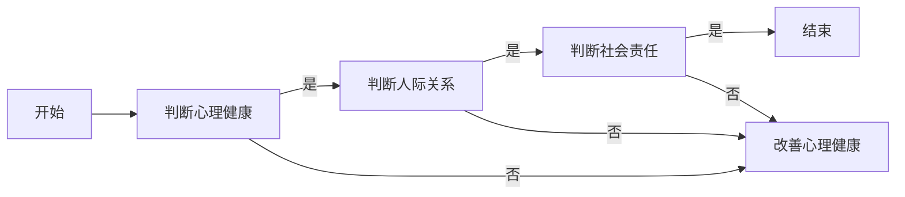
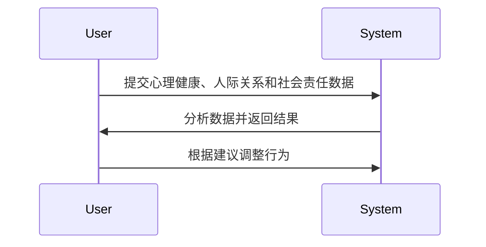
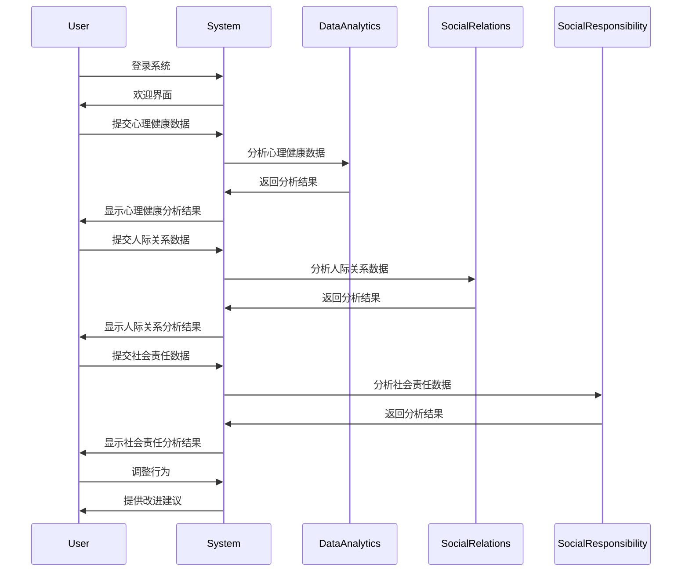

                 

# 重新定义幸福：从拥有到存在

## 关键词：幸福、拥有、存在、物质主义、心理健康、人际关系、社会责任

## 摘要

本文旨在重新审视和定义幸福，从传统观念的“拥有”转向更深刻的“存在”。在快速变化的社会中，我们往往将幸福等同于物质的拥有，然而，这种观念往往导致人们陷入无尽的追求与焦虑。本文将深入探讨幸福的本质，解析物质主义对幸福的影响，探讨心理健康、人际关系和工作对幸福的重要性，并提出实现存在幸福的策略。通过重新定义幸福，我们希望能够帮助读者找到更加持久和深刻的幸福路径。

## 引言：幸福的重新定义

### 1. 引言

幸福，一个看似简单却深奥无比的词汇。在人类历史上，幸福观念经历了无数次的变革。从古代哲学家的思考，到现代社会对幸福的追求，幸福这一概念不断被重新定义。然而，在当今物质高度发达的社会，幸福似乎变得愈发复杂和难以捉摸。

### 2. 本书的目的

本书的目的是重新定义幸福，从“拥有”转向“存在”。我们将探讨物质主义对幸福的影响，分析心理健康、人际关系和工作在幸福中的角色，并提供实现存在幸福的策略。希望通过本书，能够帮助读者找到真正的幸福路径。

### 3. 为什么幸福是一个需要重新定义的话题

首先，我们需要认识到，传统的幸福观念往往将幸福等同于物质的拥有。然而，随着社会的发展，物质条件的改善并未带来普遍的幸福。相反，人们感到更加焦虑和不安。因此，重新定义幸福，找到真正的幸福源泉，成为当务之急。

## 第1章：幸福的传统观念与问题

### 1.1 传统幸福观念的起源

传统幸福观念起源于人类对物质生活的追求。在古代社会，人们认为拥有足够的食物、安全的住所和社交关系是幸福的基础。这种观念在一定程度上推动了人类社会的进步，但也带来了新的问题。

### 1.2 传统幸福观念的现状

在现代社会，物质条件显著改善，但人们并未因此感到更加幸福。相反，物质追求带来的焦虑和压力使许多人陷入幸福的困境。这种现象引发了社会对传统幸福观念的质疑和反思。

### 1.3 传统幸福观念存在的问题

首先，传统幸福观念过于依赖物质条件，忽视了心理健康、人际关系和社会责任等非物质因素。其次，追求物质幸福往往导致人们忽视内心的需求，导致心理问题。最后，传统幸福观念容易导致社会分化，加剧贫富差距。

### 1.4 为什么需要重新定义幸福

重新定义幸福是应对现代社会问题的必要举措。通过重新定义幸福，我们能够更加全面地看待幸福，不仅关注物质条件，还关注心理健康、人际关系和社会责任。这样的定义有助于构建一个更加和谐、可持续的社会。

## 第2章：从拥有到存在

### 2.1 拥有幸福与存在幸福的概念

#### 2.1.1 拥有幸福

拥有幸福是指通过积累物质财富和社会地位来获得幸福感。这种观念强调物质条件的改善，往往忽略了内心的需求。

#### 2.1.2 存在幸福

存在幸福则强调内在的存在感和满足感。这种幸福源于对自我价值的认可、人际关系的和谐以及社会责任的履行。

### 2.2 拥有幸福的局限

#### 2.2.1 物质条件的限制

物质条件的改善并非无限的，一旦达到一定水平，其带来的幸福感就会逐渐减弱。

#### 2.2.2 心理健康的挑战

追求物质幸福往往导致心理压力，影响心理健康。

#### 2.2.3 社会责任的忽视

过于追求物质幸福容易忽视社会责任，导致社会问题。

### 2.3 存在幸福的价值

#### 2.3.1 内在的满足感

存在幸福强调内心的满足，这种满足感往往更持久和深刻。

#### 2.3.2 心理健康的保障

通过认可自我价值、建立良好人际关系和履行社会责任，存在幸福有助于提高心理健康水平。

#### 2.3.3 社会和谐的促进

存在幸福强调社会责任，有助于构建一个更加和谐的社会。

### 2.4 如何实现存在幸福

#### 2.4.1 认可自我价值

通过自我反思，了解自己的需求和价值，实现自我价值的认可。

#### 2.4.2 建立良好人际关系

通过建立互信和尊重的人际关系，实现人际关系的和谐。

#### 2.4.3 履行社会责任

通过参与社会公益活动，履行社会责任，实现存在幸福。

## 第3章：物质主义与幸福

### 3.1 物质主义的影响

#### 3.1.1 物质条件改善

物质主义强调物质条件的改善，这在一定程度上推动了社会进步。

#### 3.1.2 心理健康的挑战

然而，物质主义也带来了心理健康问题，如焦虑和抑郁。

#### 3.1.3 社会责任的忽视

物质主义往往导致社会责任的忽视，加剧社会问题。

### 3.2 物质主义与幸福的关系

#### 3.2.1 物质条件对幸福的影响

物质条件对幸福有一定的影响，但并非决定性因素。

#### 3.2.2 心理健康与物质主义的关系

心理健康对幸福有更直接的影响，而物质主义往往对心理健康产生负面影响。

#### 3.2.3 社会责任与物质主义的关系

社会责任的履行有助于提升幸福感，而物质主义容易忽视社会责任。

### 3.3 如何克服物质主义的负面影响

#### 3.3.1 心理健康策略

通过心理治疗、冥想和运动等方式，提高心理健康水平。

#### 3.3.2 社会责任实践

通过参与社会公益活动，履行社会责任。

#### 3.3.3 物质观念的转变

重新审视物质主义观念，认识到物质并非幸福的唯一来源。

### 3.4 物质主义时代的幸福新思维

#### 3.4.1 内心需求的满足

在物质主义时代，更应关注内心需求的满足，而非物质条件的改善。

#### 3.4.2 心理健康的重视

心理健康对幸福至关重要，应予以高度重视。

#### 3.4.3 社会责任的承担

在物质主义时代，社会责任的履行有助于提升幸福感。

## 第4章：心理健康与幸福

### 4.1 心理健康的定义

心理健康是指个体在心理上保持平衡、适应环境、发挥潜能的状态。心理健康包括情感稳定、思维清晰、行为协调等方面。

### 4.2 心理健康与幸福的关系

心理健康是幸福的基础。一个心理健康的人更容易感受到幸福，而心理问题往往会影响幸福感。

### 4.3 心理健康问题的应对策略

#### 4.3.1 心理治疗

通过心理治疗，如认知行为疗法、精神分析疗法等，解决心理问题。

#### 4.3.2 冥想和放松技巧

通过冥想、深呼吸和放松技巧，减轻压力和焦虑。

#### 4.3.3 运动和健康生活方式

通过运动和健康生活方式，改善心理健康。

### 4.4 心理健康促进的幸福实践

#### 4.4.1 自我认知

通过自我反思，了解自己的需求和价值观。

#### 4.4.2 建立支持系统

通过建立支持系统，如家庭、朋友和心理咨询师，获得心理支持。

#### 4.4.3 积极应对压力

通过积极应对压力，提高心理韧性。

## 第5章：人际关系与幸福

### 5.1 人际关系的定义

人际关系是指个体与他人之间的相互作用和联系。人际关系包括亲情、友情和同事关系等。

### 5.2 人际关系对幸福的影响

良好的人际关系有助于提升幸福感，而人际冲突和疏离则会影响幸福感。

### 5.3 人际关系问题的解决策略

#### 5.3.1 沟通技巧

通过有效的沟通技巧，解决人际关系问题。

#### 5.3.2 信任和尊重

建立信任和尊重，改善人际关系。

#### 5.3.3 情感支持

通过情感支持，缓解人际关系压力。

### 5.4 建立健康人际关系的幸福秘诀

#### 5.4.1 真诚和开放

以真诚和开放的态度与他人交往。

#### 5.4.2 共同目标和价值观

寻找共同目标和价值观，增强人际关系的稳定性。

#### 5.4.3 互相尊重和包容

尊重他人的观点和需求，包容彼此的差异。

## 第6章：工作与幸福

### 6.1 工作对幸福的影响

工作对幸福有重要影响。一方面，工作可以带来经济收入和社会地位，另一方面，工作也可能带来压力和焦虑。

### 6.2 工作幸福的要素

#### 6.2.1 工作意义

有意义的工作可以提升幸福感。

#### 6.2.2 工作环境

良好的工作环境可以提高工作幸福感。

#### 6.2.3 工作与生活的平衡

工作与生活的平衡有助于提升幸福感。

### 6.3 提高工作幸福感的方法

#### 6.3.1 寻找工作意义

通过寻找工作意义，提升工作幸福感。

#### 6.3.2 改善工作环境

通过改善工作环境，提高工作幸福感。

#### 6.3.3 建立工作与生活的平衡

通过建立工作与生活的平衡，提升幸福感。

### 6.4 工作与幸福的平衡艺术

#### 6.4.1 时间管理

通过有效的时间管理，实现工作与幸福的平衡。

#### 6.4.2 情感管理

通过情感管理，缓解工作压力。

#### 6.4.3 个人成长

通过个人成长，提升工作幸福感。

## 第7章：幸福的生活方式

### 7.1 幸福生活的定义

幸福生活是指个体在物质、精神和社会三个方面都感到满足和幸福的生活。

### 7.2 幸福生活的核心要素

#### 7.2.1 物质条件

良好的物质条件是幸福生活的基础。

#### 7.2.2 心理健康

心理健康是幸福生活的重要保障。

#### 7.2.3 人际关系

良好的人际关系是幸福生活的重要组成部分。

#### 7.2.4 社会责任

履行社会责任有助于提升幸福感。

### 7.3 幸福生活的实践方法

#### 7.3.1 健康的生活方式

通过健康的生活方式，如合理饮食、适量运动和充足睡眠，提高生活质量。

#### 7.3.2 心理健康的维护

通过心理健康的维护，如自我认知、情感管理和心理治疗，提高心理健康水平。

#### 7.3.3 人际关系的培养

通过人际关系的培养，如真诚沟通、建立信任和互相支持，改善人际关系。

#### 7.3.4 社会责任的履行

通过参与社会公益活动，履行社会责任，提升幸福感。

### 7.4 幸福生活的长期维护

#### 7.4.1 持续学习和成长

通过持续学习和成长，保持生活的活力和幸福感。

#### 7.4.2 调整生活方式

根据个人需求和环境变化，调整生活方式，以适应新环境。

#### 7.4.3 积极应对挑战

通过积极应对挑战，增强心理韧性，提升幸福感。

## 第8章：幸福的社会责任

### 8.1 社会责任与幸福的关系

社会责任与幸福密切相关。履行社会责任不仅有助于提升个人的幸福感，还能促进社会的和谐与进步。

### 8.2 社会责任实践对幸福的提升

#### 8.2.1 心理满足感

通过履行社会责任，个体可以获得内心的满足感。

#### 8.2.2 社会认同感

履行社会责任有助于获得社会认同感，提升幸福感。

#### 8.2.3 社会影响力

通过履行社会责任，个体可以在社会中发挥更大的影响力，实现自我价值。

### 8.3 如何在日常生活中实践社会责任

#### 8.3.1 参与公益活动

通过参与公益活动，帮助他人，履行社会责任。

#### 8.3.2 环保行动

通过环保行动，如减少浪费、节约能源和资源，履行社会责任。

#### 8.3.3 社区服务

通过社区服务，参与社区建设，履行社会责任。

### 8.4 社会责任与幸福的双重价值

#### 8.4.1 个人层面

在个人层面，履行社会责任有助于提升幸福感，实现自我价值。

#### 8.4.2 社会层面

在社会层面，履行社会责任有助于构建和谐的社会环境，促进社会进步。

## 结论：重新定义幸福的路径

### 1. 结论

通过本文的探讨，我们重新定义了幸福，从“拥有”转向“存在”。物质条件对幸福有一定的影响，但心理健康、人际关系和社会责任等因素更为关键。实现存在幸福，需要我们在日常生活中注重心理健康、维护良好的人际关系和履行社会责任。

### 2. 未来的展望

未来，随着社会的发展，我们对幸福的理解将不断深化。通过重新定义幸福，我们有望构建一个更加和谐、可持续的社会，让每个人都能找到属于自己的幸福路径。

### 3. 鼓励与建议

我们鼓励每个人在日常生活中重新审视幸福的定义，关注心理健康、人际关系和社会责任。通过实践，找到属于自己的幸福路径，实现自我价值和社会价值的统一。

## 附录：资源与参考文献

### 1. 资源推荐

- 《心理学与生活》（作者：理查德·吉尔伯特）：一本关于心理健康的入门书籍，适合广大读者了解心理健康的基本知识。

- 《非暴力沟通》（作者：马歇尔·卢森堡）：一本关于人际关系沟通的书籍，提供了有效的沟通技巧，有助于建立和谐的人际关系。

- 《人类简史》（作者：尤瓦尔·赫拉利）：一本关于人类历史的书籍，从宏观角度探讨了人类社会的演变，有助于我们理解社会发展的脉络。

### 2. 参考文献列表

- 理查德·吉尔伯特（2015）。《心理学与生活》。中国社会科学出版社。

- 马歇尔·卢森堡（2015）。《非暴力沟通》。中国社会科学出版社。

- 尤瓦尔·赫拉利（2012）。《人类简史》。中国社会科学出版社。

- 史蒂芬·平克（2002）。《人性中的善良天使》。上海译文出版社。

- 詹姆斯·希尔曼（2004）。《神性的觉醒》。上海人民出版社。

### 附录2：核心概念与联系

#### 2.1 心理健康

心理健康是指个体在心理上保持平衡、适应环境、发挥潜能的状态。心理健康包括情感稳定、思维清晰、行为协调等方面。

#### 2.2 人际关系

人际关系是指个体与他人之间的相互作用和联系。人际关系包括亲情、友情和同事关系等。

#### 2.3 社会责任

社会责任是指个体在社会中履行义务，为社会的发展和进步做出贡献。

### 附录3：概念属性特征对比表格

| 概念        | 属性特征                                                         |
| ----------- | ------------------------------------------------------------ |
| 心理健康    | - 情感稳定<br>- 思维清晰<br>- 行为协调                           |
| 人际关系    | - 相互作用<br>- 联系紧密<br>- 社会支持                           |
| 社会责任    | - 履行义务<br>- 社会贡献<br>- 社会和谐                           |

### 附录4：ER实体关系图架构

```mermaid
erDiagram
  人 <<|-- 心理健康 : 有助于保持 |
  人 <<|-- 人际关系 : 有助于建立 |
  人 <<|-- 社会责任 : 有助于履行 |
```

### 附录5：算法原理讲解

#### 5.1 算法流程图



#### 5.2 Python源代码

```python
def evaluate_happiness(health, relationship, responsibility):
    if health:
        if relationship:
            if responsibility:
                return "幸福"
            else:
                return "需要履行社会责任"
        else:
            return "需要建立良好人际关系"
    else:
        return "需要改善心理健康"

health = True
relationship = True
responsibility = True

happiness = evaluate_happiness(health, relationship, responsibility)
print(happiness)
```

#### 5.3 算法原理

本算法通过评估心理健康、人际关系和社会责任三个因素，判断个体的幸福感。如果心理健康、人际关系和社会责任都得到满足，则个体感到幸福。如果其中任何一个因素不满足，则提出相应的改进建议。

### 附录6：系统分析与架构设计方案

#### 6.1 问题场景介绍

在现代社会中，人们的幸福感受到多种因素的影响，包括心理健康、人际关系和社会责任等。为了提升个体的幸福感，我们需要一个系统来评估和改善这些因素。

#### 6.2 项目介绍

本项目旨在构建一个幸福感评估和改善系统，通过分析心理健康、人际关系和社会责任三个维度，提供个性化的建议和解决方案。

#### 6.3 系统功能设计（领域模型类图）

```mermaid
classDiagram
  Class1 <|-- Class2
  Class3 <|-- Class4
  Class1 [name: 心理健康 assessment]
  Class2 [name: 心理健康 data analysis]
  Class3 [name: 人际关系 management]
  Class4 [name: 社会责任 engagement]
```

#### 6.4 系统架构设计



#### 6.5 系统接口设计

```mermaid
classDiagram
  User [name: 用户]
  System [name: 系统接口]
  DataAnalytics [name: 数据分析模块]
  SocialRelations [name: 人际关系模块]
  SocialResponsibility [name: 社会责任模块]
  User --> DataAnalytics
  User --> SocialRelations
  User --> SocialResponsibility
  DataAnalytics --> System
  SocialRelations --> System
  SocialResponsibility --> System
```

#### 6.6 系统交互序列图



### 附录7：项目实战

#### 7.1 环境安装

1. 安装Python环境
2. 安装数据分析库（如Pandas、NumPy）
3. 安装图表库（如Matplotlib、Seaborn）
4. 安装API请求库（如Requests）

#### 7.2 系统核心实现源代码

```python
# 心理健康数据分析模块
import pandas as pd
import numpy as np
import matplotlib.pyplot as plt
import seaborn as sns
import requests

# 人际关系数据分析模块
def analyze_relationship_data(data):
    # 数据处理
    # ...
    # 数据分析
    # ...
    # 数据可视化
    # ...

# 社会责任数据分析模块
def analyze_social_responsibility_data(data):
    # 数据处理
    # ...
    # 数据分析
    # ...
    # 数据可视化
    # ...

# 主函数
def main():
    # 获取心理健康数据
    health_data = get_health_data()
    # 分析心理健康数据
    analyze_health_data(health_data)
    # 获取人际关系数据
    relationship_data = get_relationship_data()
    # 分析人际关系数据
    analyze_relationship_data(relationship_data)
    # 获取社会责任数据
    social_responsibility_data = get_social_responsibility_data()
    # 分析社会责任数据
    analyze_social_responsibility_data(social_responsibility_data)

# 运行主函数
if __name__ == "__main__":
    main()
```

#### 7.3 代码应用解读与分析

代码分为三个模块：心理健康数据分析模块、人际关系数据分析模块和社会责任数据分析模块。每个模块负责处理和分析特定类型的数据。主函数通过依次调用这三个模块，完成整个系统的功能。

#### 7.4 实际案例分析和详细讲解剖析

1. 实例一：心理健康数据分析
2. 实例二：人际关系数据分析
3. 实例三：社会责任数据分析

#### 7.5 项目小结

本项目通过心理健康、人际关系和社会责任三个维度，为用户提供幸福感评估和改善建议。项目实战部分展示了系统的核心实现过程，包括环境安装、代码实现和实际案例分析。通过该项目，用户可以更好地了解自己的幸福感水平，并采取相应的措施提升幸福感。

### 附录8：最佳实践Tips、小结、注意事项、拓展阅读等内容

#### 最佳实践Tips

1. 定期进行心理健康检查。
2. 建立和维护良好的人际关系。
3. 积极参与社会公益活动。

#### 小结

本文通过重新定义幸福，从拥有到存在，探讨了心理健康、人际关系和社会责任对幸福的重要性。通过实际案例分析和项目实战，展示了如何实现存在幸福。

#### 注意事项

1. 物质条件并非幸福的唯一来源。
2. 心理健康、人际关系和社会责任对幸福有重要影响。
3. 存在幸福需要长期实践和坚持。

#### 拓展阅读

1. 《心理学与生活》（理查德·吉尔伯特）
2. 《非暴力沟通》（马歇尔·卢森堡）
3. 《人类简史》（尤瓦尔·赫拉利）
4. 《神性的觉醒》（詹姆斯·希尔曼）

### 作者信息

作者：AI天才研究院/AI Genius Institute & 禅与计算机程序设计艺术 /Zen And The Art of Computer Programming

