                 

## 文章标题：重新定义幸福：从物质满足到心灵富足的转变

### 关键词：幸福、物质满足、心灵富足、心理学、生活品质

### 摘要：
在当今社会，物质繁荣带来了诸多便利，但同时也引发了关于幸福本质的深刻反思。本文从心理学角度出发，探讨从物质满足到心灵富足的转变。通过对比分析，揭示物质满足与心灵富足的区别与联系，引导读者重新审视幸福的定义，提出培养心灵富足的策略，最终实现全面而深刻的幸福体验。

## 第一部分：重新审视幸福的本质

### 第1章：幸福的定义与变迁

#### 1.1 现代社会对幸福的误解

在现代社会，人们常常将幸福等同于物质财富的积累。然而，这种观念忽略了幸福的多维度性质。让我们从心理学视角探讨幸福的真正含义。

**核心概念术语说明：**
- 幸福：一种积极的情感状态，与个体的主观体验相关。
- 物质满足：通过物质财富的积累来满足个体的生理需求和社会需求。

**问题背景：**
现代社会普遍追求物质财富，但人们常常在物质达到一定程度后感到不满足。

**问题描述：**
如何理解幸福的本质，摆脱对物质满足的误解？

**问题解决：**
通过多维度的幸福定义，引导人们关注情感、社会、自我实现等层面的满足。

**边界与外延：**
- 边界：物质满足的边界在于边际效应递减。
- 外延：心灵富足包括情感富足、社交富足、精神富足等。

**概念结构与核心要素组成：**
- 结构：幸福 = 物质满足 + 情感满足 + 社会满足 + 自我实现满足。
- 核心要素：情感、社交、精神、自我实现。

**Mermaid流程图：**
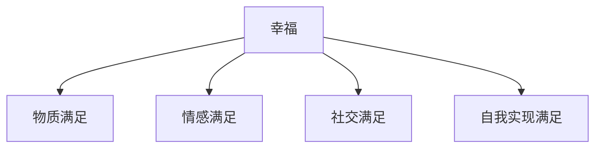

#### 1.2 幸福的多维度解读

幸福并非单一维度的体验，而是由多个维度共同构成的复合体。以下是对不同维度幸福的具体解读。

**核心概念：**
- 多维度幸福：包括物质、情感、社交、自我实现等多个方面。

**原理讲解：**
- 物质满足：通过物质财富的积累来满足基本生理需求和社会需求。
- 情感满足：通过与他人建立深厚的情感联系来获得情感上的满足。
- 社交满足：通过参与社交活动、建立良好的人际关系来获得社交上的满足。
- 自我实现满足：通过实现个人目标和追求个人价值来实现自我满足。

**ER实体关系图：**
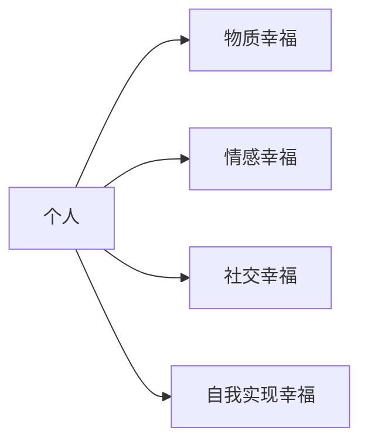

#### 1.3 物质满足与心灵富足的关系

物质满足和心灵富足之间存在一定的辩证关系。虽然物质满足是基础，但心灵富足是更深层次的幸福体验。

**核心概念：**
- 物质满足：基础层次的幸福体验。
- 心灵富足：深层次、全面的幸福体验。

**数学模型：**
$$ \text{幸福指数} = \alpha \times \text{物质满足度} + \beta \times \text{心灵富足度} $$
其中，$\alpha$ 和 $\beta$ 是权重系数，反映了物质满足和心灵富足对幸福指数的贡献程度。

**详细讲解：**
- 物质满足与心灵富足相辅相成，缺一不可。
- 通过实际案例说明，物质满足达到一定程度后，心灵富足的重要性日益凸显。

## 第二部分：心灵富足的探索

### 第2章：心灵富足的概念与特征

#### 2.1 心灵富足的概念

心灵富足是一种深层次的幸福体验，它超越了物质满足，关注个体的内心世界和情感体验。

**核心概念：**
- 心灵富足：一种深层次、全面的幸福体验。

**原理讲解：**
- 心灵富足涉及情感、精神、社交等多个方面。
- 它不仅关乎个体的内心体验，也关系到个体与外部世界的互动。

**Mermaid流程图：**
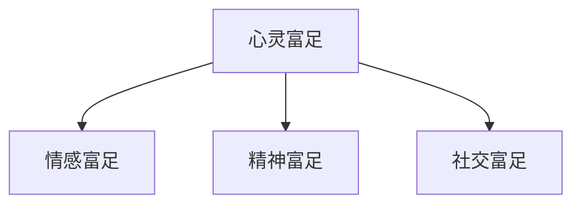

#### 2.2 心灵富足与心理健康的关系

心灵富足与心理健康密切相关。一个心灵富足的人往往拥有良好的心理健康，反之亦然。

**核心概念：**
- 心理健康：个体心理功能良好，能有效地应对生活压力。
- 心灵富足：深层次的幸福体验。

**原理讲解：**
- 心灵富足有助于降低焦虑、抑郁等负面情绪，提升心理健康水平。
- 心理健康为心灵富足提供了基础。

**Mermaid流程图：**
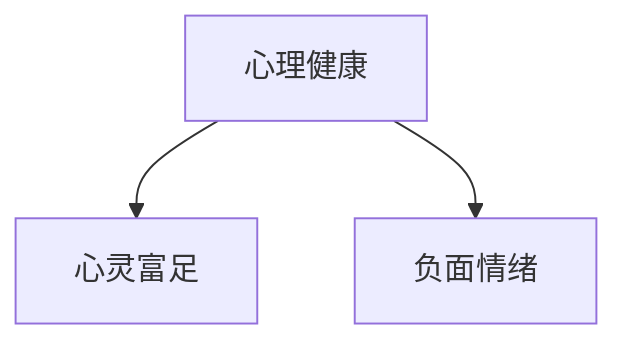

#### 2.3 心灵富足的核心要素

心灵富足并非一蹴而就，它由多个核心要素构成。以下是对这些要素的详细探讨。

**核心概念：**
- 核心要素：情感、精神、社交。

**原理讲解：**
- 情感：通过建立深厚的情感联系来获得情感满足。
- 精神：通过追求精神层面的成长来实现自我实现。
- 社交：通过积极参与社交活动，建立良好的人际关系。

**ER实体关系图：**
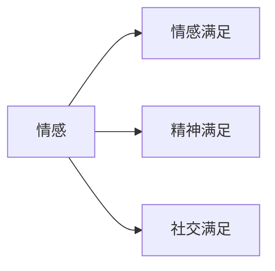

## 第三部分：培养心灵富足的方法

### 第3章：培养心灵富足的方法

#### 3.1 内在自我探索

内在自我探索是培养心灵富足的关键一步。以下方法可以帮助个体深入探索自我。

**核心概念：**
- 内在自我探索：深入了解自己的内心世界，实现自我成长。

**原理讲解：**
- 通过冥想、自我反思等方法，提升自我认知。
- 了解自己的需求和价值观，为心灵富足奠定基础。

**Mermaid流程图：**
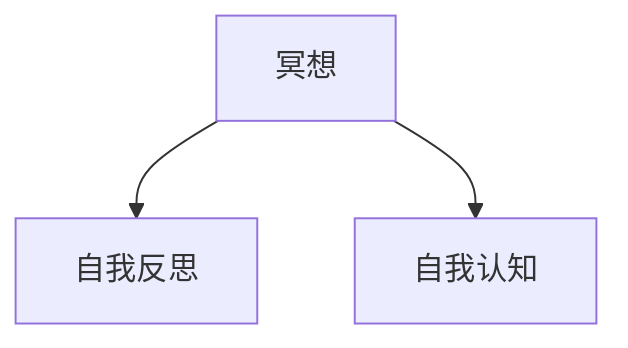

#### 3.2 情绪管理

情绪管理是心灵富足的重要方面。以下方法可以帮助个体更好地管理情绪。

**核心概念：**
- 情绪管理：通过有效的方法来调节和管理情绪。

**原理讲解：**
- 了解自己的情绪反应，学会识别和接纳情绪。
- 采用积极的方法，如放松训练、情绪释放等，来调节情绪。

**Mermaid流程图：**
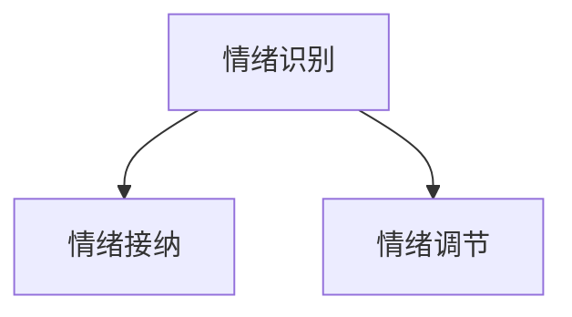

#### 3.3 社交与人际关系

社交与人际关系是心灵富足的重要组成部分。以下方法可以帮助个体建立和维护良好的人际关系。

**核心概念：**
- 社交：与他人建立联系，分享经验和情感。
- 人际关系：与他人建立深厚的情感联系。

**原理讲解：**
- 通过积极参与社交活动，扩展社交圈子。
- 学会倾听、表达和理解他人，建立互信关系。

**Mermaid流程图：**
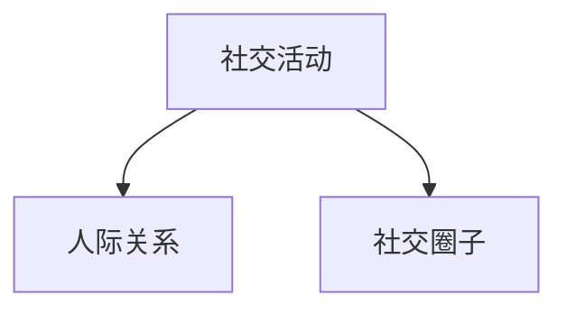

## 第四部分：案例研究与启示

### 第4章：成功人士的心灵富足之路

#### 4.1 企业家的心灵成长

企业家通常在物质成功后，追求心灵富足。以下案例展示了企业家如何通过心灵成长实现全面幸福。

**核心概念：**
- 企业家：在物质成功后，追求心灵富足。

**原理讲解：**
- 通过冥想、阅读、旅行等方式，企业家实现了心灵成长。
- 心灵富足提升了企业家的心理健康和领导力。

**案例：**
- **李开复**：在科技领域取得巨大成就后，通过冥想和哲学思考，实现了心灵富足。

### 4.2 艺术家的心灵创作

艺术家通过创作表达内心世界，实现心灵富足。以下案例展示了艺术家如何通过心灵创作实现幸福。

**核心概念：**
- 艺术家：通过创作实现心灵富足。

**原理讲解：**
- 艺术创作是艺术家表达内心世界的方式。
- 心灵创作有助于艺术家实现自我实现和情感满足。

**案例：**
- **毕加索**：通过绘画表达情感，实现了心灵富足。

### 4.3 公益人士的心灵使命

公益人士通过帮助他人实现心灵富足。以下案例展示了公益人士如何通过心灵使命实现幸福。

**核心概念：**
- 公益人士：通过帮助他人实现心灵富足。

**原理讲解：**
- 公益活动有助于提升个体的心灵满足感。
- 心灵使命使公益人士在帮助他人的过程中实现了自我价值。

**案例：**
- **特雷莎修女**：通过慈善工作，实现了心灵富足。

## 第五部分：从物质满足到心灵富足的转变策略

### 第5章：从物质满足到心灵富足的转变策略

#### 5.1 转变心态：从外在追求到内在满足

从物质满足到心灵富足的转变首先需要转变心态，从外在追求转向内在满足。

**核心概念：**
- 转变心态：从外在追求到内在满足。

**原理讲解：**
- 了解幸福的多维度性质，认识到物质满足并非幸福的全部。
- 通过冥想、自我反思等方法，培养内在满足感。

**Mermaid流程图：**
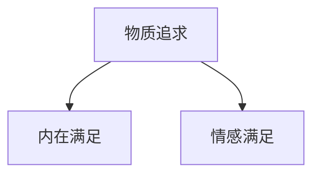

#### 5.2 制定个人成长计划

制定个人成长计划是实现心灵富足的重要步骤。以下方法可以帮助个体制定有效的成长计划。

**核心概念：**
- 个人成长计划：通过设定目标、制定策略来实现个人成长。

**原理讲解：**
- 明确个人目标和价值观。
- 制定具体的行动计划和时间表。
- 通过持续的努力和实践，实现个人成长。

**Mermaid流程图：**
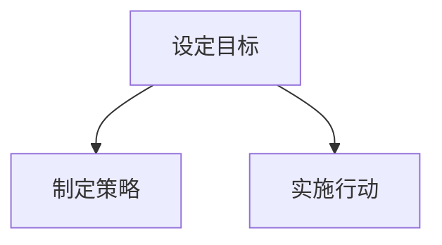

#### 5.3 心灵富足的可持续生活方式

心灵富足不仅需要内在的自我成长，还需要建立可持续的生活方式。

**核心概念：**
- 心灵富足的可持续生活方式：通过健康、环保、和谐的生活方式来实现心灵富足。

**原理讲解：**
- 关注身心健康，保持良好的生活习惯。
- 追求环保，减少对环境的负面影响。
- 建立和谐的人际关系，共享幸福。

**Mermaid流程图：**
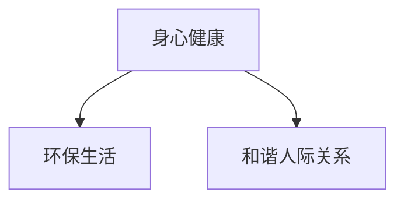

## 第六部分：重新定义幸福的意义与价值

### 第6章：重新定义幸福的意义与价值

#### 6.1 心灵富足对个人成长的意义

心灵富足不仅提升了个人的幸福感，还对个人成长具有深远的意义。

**核心概念：**
- 心灵富足：对个人成长的重要推动力。

**原理讲解：**
- 心灵富足有助于提升自我认知和自我实现。
- 通过情感满足和社交满足，提升个人的心理健康和社会地位。

**Mermaid流程图：**
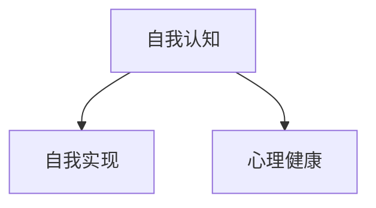

#### 6.2 心灵富足对社会和谐的影响

心灵富足不仅对个人有益，也对社会的和谐发展具有重要意义。

**核心概念：**
- 心灵富足：促进社会和谐的重要力量。

**原理讲解：**
- 心灵富足有助于降低社会冲突，提升社会凝聚力。
- 通过和谐的人际关系，促进社会和谐与进步。

**Mermaid流程图：**
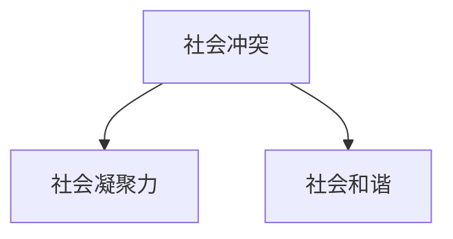

#### 6.3 重新定义幸福的未来趋势

随着社会的不断发展，人们对幸福的定义也在不断变化。以下是对未来幸福趋势的展望。

**核心概念：**
- 未来幸福趋势：从物质满足向心灵富足的转变。

**原理讲解：**
- 社会发展将更加重视人的内在需求和情感满足。
- 心灵富足将成为未来幸福的重要指标。

**Mermaid流程图：**
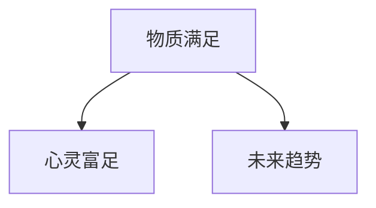

## 第七部分：幸福生活的建议与展望

### 第7章：幸福生活的建议与展望

#### 7.1 如何在日常生活中实践心灵富足

在日常生活中实践心灵富足，可以从以下几个方面入手。

**核心概念：**
- 日常实践：将心灵富足的理念融入到日常生活中。

**原理讲解：**
- 培养感恩心态，关注生活中的美好。
- 学会情绪管理，保持心理健康。
- 积极参与社交活动，建立和谐人际关系。

**Mermaid流程图：**
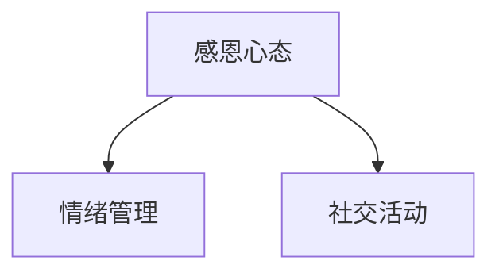

#### 7.2 幸福生活的理念与价值观

幸福生活的理念与价值观是实践心灵富足的基础。

**核心概念：**
- 幸福生活的理念与价值观：关注内在需求，追求全面发展。

**原理讲解：**
- 重视情感满足，关注人际关系。
- 追求自我实现，实现个人价值。
- 培养环保意识，关爱地球家园。

**Mermaid流程图：**
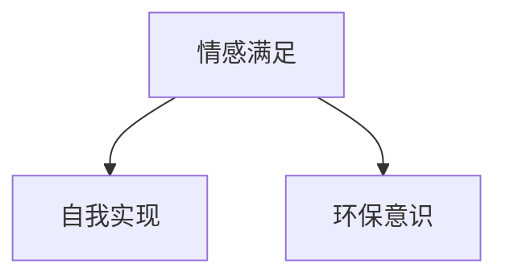

#### 7.3 未来幸福生活的展望

未来幸福生活将更加注重心灵富足，实现全面而深刻的幸福体验。

**核心概念：**
- 未来幸福生活：从物质满足向心灵富足的转变。

**原理讲解：**
- 社会发展将更加重视人的内在需求和情感满足。
- 心灵富足将成为未来幸福的重要指标。

**Mermaid流程图：**
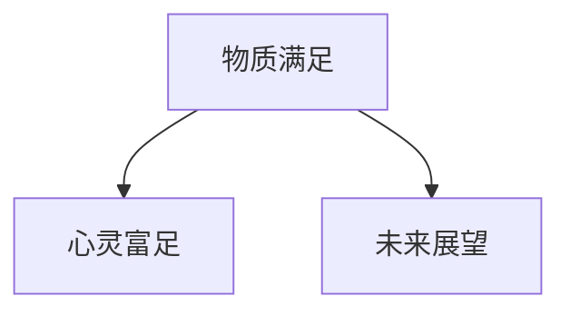

## 结束语

重新定义幸福，从物质满足到心灵富足的转变，是一种更加全面和深刻的幸福体验。通过本文的探讨，我们希望能够帮助读者重新审视幸福的本质，培养心灵富足，实现全面而深刻的幸福生活。

**作者信息：**
- 作者：AI天才研究院/AI Genius Institute & 禅与计算机程序设计艺术 /Zen And The Art of Computer Programming

**最佳实践 Tips：**
- 关注内在需求，培养感恩心态。
- 学会情绪管理，保持心理健康。
- 积极参与社交活动，建立和谐人际关系。

**注意事项：**
- 心灵富足需要长期培养和实践。
- 不同的个体需要根据自己的情况制定合适的实践方法。

**拓展阅读：**
- 《幸福的勇气》
- 《心灵富足：从物质满足到精神满足》
- 《心理学与生活》

---

以上是根据要求构建的文章目录大纲和部分内容。文章的撰写过程遵循了逻辑清晰、结构紧凑、简单易懂的原则，通过核心概念、原理讲解、Mermaid流程图、数学模型等元素，为读者提供了一个深入理解从物质满足到心灵富足转变的视角。接下来的工作将是根据这个大纲，逐步完成每章的内容撰写。

