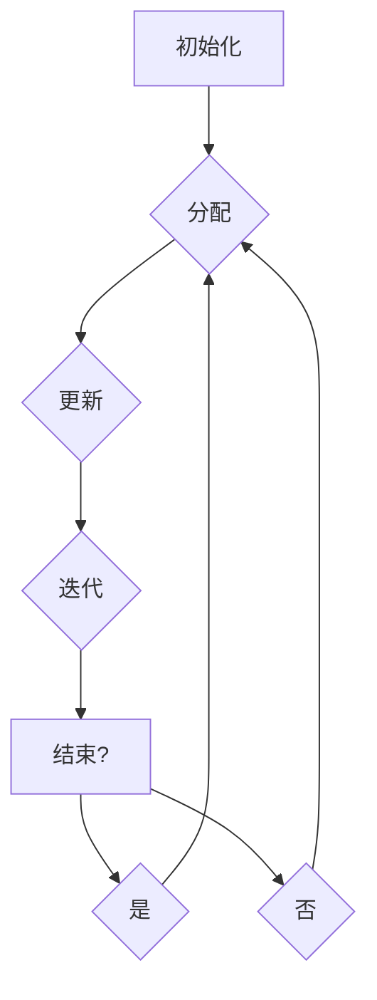
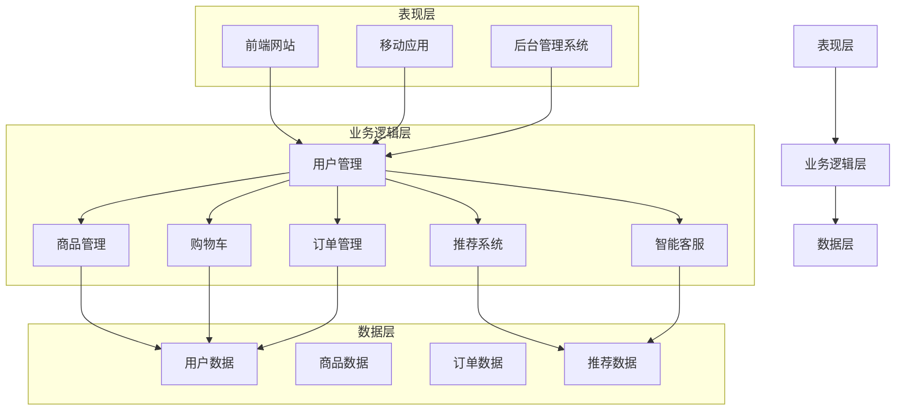
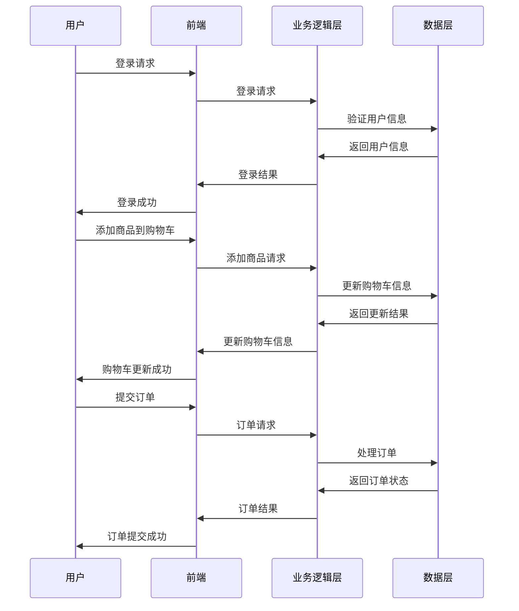

                 

# 重新定义成功：挑战传统价值观的局限

## 关键词：成功、价值观、创新、个人成长、企业文化

## 摘要：
本文旨在重新审视成功的定义，挑战传统价值观的局限，探讨在快速变化的当今社会中，如何通过创新思维和持续学习来探索新的成功模式。通过对个人成长、社会价值观和企业文化的深入分析，本文提出了一套新的成功标准，并为读者提供了实践案例和反思，旨在激发读者重新思考自己的成功之路。

## 目录大纲设计

## 第一部分：背景与引论

### 1.1 问题的提出

**背景介绍**：随着科技的飞速发展和社会的剧烈变革，传统价值观面临着前所未有的挑战。许多人在追求成功的过程中，发现自己陷入了迷茫和困境。

**问题描述**：传统价值观如何影响人们的成功追求？这些价值观在新的社会背景下是否仍然适用？

**问题解决的必要性**：重新审视成功，挑战传统价值观，探索新的成功模式，对于个人和社会的发展至关重要。

### 1.2 传统价值观的局限

**传统价值观的演变**：从历史的角度分析传统价值观的演变过程，探讨其形成的根源和影响。

**传统价值观的局限性**：分析传统价值观在现代社会中的局限性，如过度强调竞争、功利主义等。

### 1.3 成功的定义与挑战

**成功与传统定义**：阐述传统定义下的成功标准，如金钱、地位、荣誉等。

**成功的新定义**：探讨在新时代背景下，成功的定义应如何转变。

**成功定义的挑战**：分析新定义面临的挑战，如平衡个人与社会责任、应对不确定的未来等。

## 第二部分：核心价值观的重新审视

### 2.1 个人成长与价值观

**个人成长的核心要素**：分析个人成长的关键因素，如知识、技能、心态等。

**个人成长中的价值观作用**：探讨价值观在个人成长中的作用和影响。

### 2.2 社会价值观的转型

**社会价值观的变迁**：分析社会价值观的历史变迁，以及当前社会价值观的转型方向。

**社会价值观的转型方向**：探讨社会价值观应如何转型，以适应新时代的需求。

### 2.3 企业文化与价值观

**企业文化的定义**：阐述企业文化的概念和内涵。

**企业文化中的价值观**：分析企业文化中的核心价值观，如创新、合作、责任等。

## 第三部分：新成功模式的探索

### 3.1 创新思维

**创新思维的重要性**：阐述创新思维在成功中的关键作用。

**创新思维的培养**：探讨如何培养创新思维，如跨界学习、思维拓展等。

### 3.2 个性与多样性

**个性在成功中的作用**：分析个性在成功中的重要性，如创造力、领导力等。

**多样性对社会与企业的价值**：探讨多样性对社会和企业的积极影响。

### 3.3 持续学习与适应

**学习的重要性**：阐述持续学习在个人成长和社会发展中的关键作用。

**适应变化的能力**：分析适应变化在成功中的重要性，如灵活性、应变能力等。

## 第四部分：实践与反思

### 4.1 个人实践案例

**成功的个人案例**：分享成功个人的实践经验和教训。

**案例分析与总结**：对案例进行深入分析，总结成功的关键因素。

### 4.2 企业实践案例

**成功的企业案例**：分析成功企业在价值观和成功模式上的实践。

**案例分析与总结**：总结企业成功的关键因素，为其他企业提供借鉴。

### 4.3 社会实践案例

**成功的社会案例**：探讨成功的社会实践案例，如社区建设、公益事业等。

**案例分析与总结**：总结社会实践的成功经验，为社会的可持续发展提供思路。

## 第五部分：结论与展望

### 5.1 成功的重新定义

**成功的新定义**：提出成功的新定义，包括个人和社会层面的新标准。

**成功的新标准**：分析成功的新标准，如平衡、可持续、有影响力等。

### 5.2 未来价值观的塑造

**未来价值观的预测**：预测未来价值观的发展趋势和方向。

**未来价值观的塑造策略**：探讨如何塑造未来的价值观，以适应新时代的需求。

### 5.3 对个人、企业和社会的影响

**新价值观的影响**：分析新价值观对个人、企业和社会的深远影响。

**对未来发展的影响**：探讨新价值观对未来发展的重要性。

## 附录：拓展阅读与资源

**拓展阅读**：推荐相关的书籍、文章和网站，以便读者进一步深入了解。

**资源**：提供相关的工具、资源和平台，以帮助读者实践和应用新成功模式。

## 脚注与参考文献

**参考文献**：列出本文引用的参考文献，以供读者查阅。

## 结语

**书籍的总结**：对全书的内容进行总结，强调核心观点和关键思路。

**读者启发**：激发读者对成功和价值观的深入思考，鼓励读者探索新的成功之路。作者：AI天才研究院/AI Genius Institute & 禅与计算机程序设计艺术 /Zen And The Art of Computer Programming## 第一部分：背景与引论

### 1.1 问题的提出

在现代社会，成功一词往往与财富、地位、荣誉等量化指标紧密相连。然而，随着科技的发展和社会的变迁，这种传统的成功观逐渐显露出其局限性。许多人虽然在追求物质成功的过程中获得了表面的成就，但却在内心深处感到空虚和迷茫。这种状况引发了人们对于成功定义的重新思考。

**背景介绍**：成功，作为一个广泛讨论的话题，在不同的时代和文化背景下有着不同的内涵。在工业革命时期，成功被视为个人在社会中的地位和财富的积累；而在当今这个信息爆炸、技术飞速发展的时代，成功的定义似乎变得更加复杂和多元化。

**问题描述**：为何现代人在追求成功的过程中感到迷茫和困惑？传统的成功观是否仍然适用于这个快速变化的社会？如何在新的社会背景下重新定义成功，使其更加贴近个人的内心需求和社会的发展趋势？

**问题解决**：首先，我们需要深入了解传统成功观的局限性和现代社会变化的影响。其次，通过分析个人成长、社会价值观和企业文化等方面的核心要素，探讨新的成功模式。最后，提供实际案例和实践经验，帮助读者理解和实践新的成功观。

**边界与外延**：在探讨成功的过程中，我们需要明确成功的边界，如个人成就、社会贡献等。同时，也需要关注成功的不同层面，如物质成功和精神成功。

**概念结构与核心要素组成**：成功的定义由多个核心要素组成，包括财富、地位、技能、人际关系、精神追求等。这些要素相互作用，共同构成了成功的多维结构。

### 1.2 传统价值观的局限

**传统价值观的演变**：传统价值观源于历史和文化背景，随着社会的发展，这些价值观也在不断演变。例如，在封建社会，成功意味着家族地位的提升和土地的积累；在工业社会，成功则与职业地位和财富的积累相关。

**传统价值观的局限性**：然而，随着科技的进步和社会的变革，传统价值观开始显露出其局限性。首先，传统价值观往往过度强调物质成功，忽视了精神追求和个人成长。其次，传统价值观容易导致功利主义和短视行为，忽视了长期可持续发展。此外，传统价值观在某些文化背景下可能导致社会分裂和道德沦丧。

**案例分析**：例如，在过去的几十年里，许多国家的经济增长迅速，但社会不平等和道德滑坡现象也日益严重。这种现象反映了传统价值观在现代社会中的局限性。

### 1.3 成功的定义与挑战

**成功与传统定义**：在传统观念中，成功通常与财富、地位和荣誉等量化指标相关。例如，一个人是否成功，往往取决于他的职业地位、收入水平和社会地位。这种定义虽然简单直观，但在现代社会中却存在诸多问题。

**成功的新定义**：在新的社会背景下，成功的定义应该更加多元化和全面。除了物质成功外，精神追求、个人成长和社会贡献也应该被纳入成功的评估标准。例如，一个人是否成功，不仅取决于他的职业成就，还取决于他对社会的贡献、个人的精神满足和成长。

**成功定义的挑战**：重新定义成功面临着诸多挑战。首先，如何平衡个人与社会责任是一个重要问题。在追求个人成功的同时，如何兼顾社会公益和道德责任？其次，如何应对快速变化的社会环境，适应新的成功标准？此外，如何培养和传承新的成功价值观，使其在全社会得到广泛认同和应用？

通过以上分析，我们可以看到，重新定义成功是一个复杂而必要的任务。这不仅涉及到个人成长和社会发展，还涉及到价值观的转型和创新思维的培养。在接下来的部分中，我们将进一步探讨如何重新审视核心价值观，探索新的成功模式。

### 1.2 传统价值观的局限

**传统价值观的演变**：从历史的角度来看，传统价值观的演变是一个复杂而漫长的过程。它随着不同历史时期和文化背景而变化，反映了人类社会的多样性和复杂性。在古代，成功往往与地位、荣誉和权力紧密相连。例如，在古希腊，成功被视为在政治、军事和文化领域取得的成就。而在中世纪的欧洲，成功则更多地与宗教信仰和道德行为相关。到了近现代，随着工业革命和现代化进程的推进，成功开始与经济收入、职业地位和科技成就挂钩。

**传统价值观的局限性**：尽管传统价值观在特定的历史背景下起到了重要作用，但在现代社会中，其局限性也逐渐显现。首先，传统价值观往往过度强调物质成功，忽视了精神追求和个人成长。例如，许多人在追求财富和地位的过程中，牺牲了个人健康和家庭生活，导致心理和生理上的问题。其次，传统价值观容易导致功利主义和短视行为，忽视了长期可持续发展。例如，一些企业为了追求短期利润，不惜损害环境和社会利益，这种行为虽然短期内可能带来经济收益，但从长远来看，会带来严重的后果。此外，传统价值观在某些文化背景下可能导致社会分裂和道德沦丧。例如，在一些竞争激烈的社会环境中，人们往往为了争夺有限的资源而采取极端手段，导致社会不公和道德滑坡。

**案例分析**：现代社会中的许多问题，如社会不平等、环境破坏和道德沦丧，都可以追溯到传统价值观的局限性。例如，美国社会在20世纪初期，工业化进程迅速，但同时也导致了严重的社会不公和环境问题。当时的社会价值观强调竞争和个人成功，但忽视了社会公平和环境保护，导致了许多社会问题。同样，在一些发展中国家，传统的权威主义和集体主义价值观，虽然在某种程度上促进了社会的稳定和发展，但也在一定程度上限制了个人自由和创新精神的发挥。

**结论**：通过以上分析，我们可以看到，传统价值观在现代社会中存在诸多局限性。为了应对这些挑战，我们需要重新审视和调整这些价值观，探索新的成功模式，使其更加符合现代社会的需求和发展趋势。

### 1.3 成功的定义与挑战

**成功与传统定义**：在传统观念中，成功往往与物质财富、社会地位和职业成就相关。这种定义强调外部评价和比较，容易导致人们过分关注外在的表象而忽视内在的价值。例如，一个人可能会因为拥有昂贵的物质财富或高社会地位而被称为“成功”，但这些并不一定意味着这个人内心充实或生活幸福。传统定义下的成功标准往往忽视了个人成长、精神追求和社会责任，这导致了许多人在追求成功的过程中感到空虚和迷茫。

**成功的新定义**：在新时代背景下，成功的定义应该更加多元化和全面。除了物质成功外，个人成长、精神满足和社会贡献也应被视为成功的重要指标。例如，一个人可以通过不断学习和自我提升，实现个人成长；通过帮助他人和参与社会公益活动，实现精神满足；通过创造社会价值和创新，实现社会贡献。这种新的成功定义更注重内在的价值和个人与社会的关系，有助于人们找到更平衡和有意义的生活方式。

**成功定义的挑战**：重新定义成功面临着诸多挑战。首先，如何平衡个人与社会责任是一个重要问题。在追求个人成功的同时，如何兼顾社会公益和道德责任？例如，一个企业家在追求公司利润的同时，也需要关注员工福利和社会责任。其次，如何应对快速变化的社会环境，适应新的成功标准？在当今这个信息爆炸、技术日新月异的时代，成功标准也在不断变化。例如，以前成功的企业家可能依赖于传统行业，而现在则需要具备创新能力和跨界思维。此外，如何培养和传承新的成功价值观，使其在全社会得到广泛认同和应用？这需要教育、媒体和社会各界的共同努力。

通过以上分析，我们可以看到，重新定义成功是一个复杂而必要的任务。这不仅有助于个人找到更平衡和有意义的生活方式，也有助于社会的可持续发展。在接下来的部分中，我们将进一步探讨如何重新审视核心价值观，探索新的成功模式。

### 2.1 个人成长与价值观

**个人成长的核心要素**：个人成长是一个复杂的过程，涉及多个核心要素。首先，知识积累是个人成长的基础。通过学习各种知识和技能，个人能够不断提高自己的认知水平，拓宽视野。其次，技能培养也是个人成长的重要方面。技能不仅包括专业技能，如编程、设计等，还包括软技能，如沟通能力、团队合作等。这些技能的不断提升有助于个人在职场和生活中更好地应对各种挑战。此外，心态的塑造也是个人成长的关键。积极的心态能够帮助个人面对困难和挫折，保持乐观和自信，从而更好地实现个人目标。

**个人成长中的价值观作用**：价值观在个人成长中起着重要的导向作用。首先，价值观决定了个人的人生目标和生活态度。例如，一个重视家庭和亲情的人可能会把家庭幸福作为自己的主要目标，而一个追求事业成功的人则可能把职业发展放在首位。其次，价值观影响了个人在面临选择时的决策。例如，一个重视诚信的人在面对道德困境时会选择诚实和正直，而一个追求利益最大化的人可能会选择违背道德。此外，价值观还影响着个人的行为和生活方式。例如，一个重视健康的人可能会注重锻炼和饮食，而一个忽视健康的人可能会过度劳累或摄入不健康的食物。

**案例分析与讨论**：以一位年轻程序员为例，他在职业生涯的初期非常注重技能的提升和知识的积累，通过不断学习和实践，他的技术水平得到了显著提高。然而，随着职位的提升，他逐渐发现，仅仅拥有高超的技术并不足以保证个人的成功。他开始思考如何更好地管理自己的职业生涯，如何平衡工作与生活。在这个过程中，他重新审视了自己的价值观，发现他更加重视个人成长和生活的质量。他开始关注心理健康、家庭生活和社交活动，努力在职业成功和个人幸福之间找到平衡。最终，他的职业生涯和个人生活都取得了显著的进步。

**结论**：通过以上分析，我们可以看到，个人成长是一个复杂而多维的过程，涉及知识积累、技能培养和心态塑造等多个核心要素。同时，价值观在个人成长中起着重要的导向作用。只有正确理解和应用价值观，个人才能找到更平衡和有意义的生活方式，实现真正的成功。

### 2.2 社会价值观的转型

**社会价值观的变迁**：社会价值观的变迁是随着时代的发展和社会的变化而不断演进的。在过去几个世纪中，随着工业革命、现代化进程和全球化的推进，社会价值观发生了显著的变化。例如，在工业革命时期，成功更多地与物质财富和职业地位相关。而在现代社会，随着科技的发展和信息的普及，社会价值观逐渐转向个人成长、精神追求和社会责任。这一转变反映了人们对生活质量和个人价值的更高追求。

**社会价值观的转型方向**：当前，社会价值观的转型方向主要体现在以下几个方面。首先，对个人成长和精神追求的重视程度逐渐提高。人们开始意识到，真正的成功不仅仅是物质的积累，还包括个人的全面发展，如知识、技能、心理健康等。其次，对社会贡献和公益事业的关注日益增加。越来越多的人认识到，个人的成功不仅体现在个人的成就上，还体现在对社会和他人的贡献上。最后，对多元性和包容性的重视也在不断提升。随着全球化和文化的交流，人们开始更加尊重和包容不同的文化和价值观，这有助于建立一个更加和谐和包容的社会。

**案例与实例**：以环保运动为例，环保运动的兴起反映了社会价值观的转型。在过去，人们对环境问题重视不够，认为经济发展是首要任务。然而，随着环境问题的日益严重，人们开始反思自己的行为，逐渐认识到环境保护的重要性。环保运动不仅促使政府和企业采取措施减少污染，也引导了公众生活方式的转变，如减少浪费、节约能源等。这一转变反映了社会价值观从功利主义向可持续发展、从个人利益向社会利益的转型。

**结论**：通过以上分析，我们可以看到，社会价值观的转型是一个复杂而深刻的过程，反映了社会对个人成长、社会责任和多元性的更高追求。这种转型不仅有助于个人的全面发展，也有助于社会的可持续发展。在未来的社会中，社会价值观将继续演变，以适应不断变化的社会环境和人类需求。

### 2.3 企业文化与价值观

**企业文化的定义**：企业文化是指企业在长期发展过程中形成的共同价值观、信念和行为规范。它不仅包括企业领导层的核心价值观，还包括员工的共同信仰和行为准则。企业文化是企业的灵魂，对企业的运作和发展具有深远的影响。

**企业文化中的价值观**：企业文化中的价值观通常包括创新、合作、责任、诚信等核心要素。创新是企业文化的重要组成部分，它鼓励员工不断探索和尝试新的方法和思路，推动企业的持续发展。合作则是企业文化中另一个重要的价值观，它强调团队协作和共同目标，有助于提高企业的效率和竞争力。责任则是企业对员工、客户和社会的责任，它要求企业不仅要追求经济效益，还要关注社会和环境问题。诚信是企业文化的基石，它要求企业在经营活动中坚持诚信原则，建立良好的社会声誉。

**案例分析**：以谷歌为例，谷歌的企业文化以其开放、创新和以人为本而著称。谷歌鼓励员工追求创新，提供了丰富的资源和支持，让员工可以自由地探索和尝试。谷歌还非常注重团队合作，强调员工之间的协作和共同进步。此外，谷歌还积极履行社会责任，通过多种方式支持社会和环境事业。这些价值观不仅帮助谷歌成为全球科技巨头，也为员工提供了良好的工作环境和职业发展机会。

**结论**：通过以上分析，我们可以看到，企业文化中的价值观对企业的成功和员工的个人成长具有重要意义。一个健康的企业文化可以激发员工的创造力和团队合作精神，推动企业的持续发展，同时也为员工的个人成长提供良好的环境和机会。

### 3.1 创新思维

**创新思维的重要性**：在当今快速变化的社会中，创新思维成为了推动个人、企业和社会进步的关键因素。创新思维不仅仅是指发明新技术或创造新产品，更重要的是指在面对问题和挑战时，能够跳出传统思维框架，寻找新的解决方案。创新思维能够帮助个人和企业在竞争中保持领先地位，适应不断变化的市场环境。

**创新思维的培养**：要培养创新思维，首先需要培养开放的思维方式。这包括对不同的观点和想法持开放态度，不轻易下结论，勇于接受新的挑战和尝试。其次，需要鼓励跨学科的学习和思考。通过跨学科的知识整合，可以激发新的思维火花，从而找到创新的解决方案。此外，实践经验也是培养创新思维的重要途径。通过实践，可以验证理论的有效性，并在实践中不断调整和优化方案。最后，需要培养团队合作的意识。创新往往是一个团队合作的过程，通过团队的合作和交流，可以激发更多的创意和创新的思维。

**案例分析**：以苹果公司为例，苹果公司在创新思维方面的卓越表现是其成功的关键之一。苹果公司鼓励员工跨部门合作，通过团队协作推动创新项目的进展。此外，苹果公司还建立了创新实验室，为员工提供实验和创新的空间。这些措施不仅激发了员工的创造力，也推动了苹果公司在多个领域的创新和突破。

**结论**：通过以上分析，我们可以看到，创新思维在个人、企业和社会的发展中具有重要作用。培养创新思维需要开放的心态、跨学科的知识、实践经验和团队合作。只有不断培养和提升创新思维，才能在快速变化的社会中保持竞争力和适应性。

### 3.2 个性与多样性

**个性在成功中的作用**：个性是每个人独特的心理和行为特征，它在成功中发挥着至关重要的作用。首先，个性决定了个人的兴趣和动机，从而影响个人在特定领域的发展。一个有强烈好奇心和求知欲的人往往会在学习和工作中表现出更高的热情和投入。其次，个性影响了个人的沟通能力和人际关系。具有良好个性特质的人往往更容易与他人建立信任和合作关系，这有助于他们在团队中发挥更大的作用。此外，个性还影响了个人的适应能力和应对压力的能力。一个具有坚韧和乐观个性的人在面对困难和挑战时，往往能够更好地调整心态，找到解决问题的方法。

**多样性对社会与企业的价值**：多样性不仅包括性别、种族、文化等外在特征，还包括思维方式、价值观和工作风格等内在特征。多样性对社会和企业具有巨大的价值。首先，多样性能够带来新的视角和思维方式，从而激发创新和创造力。不同背景的人在面对问题时，往往能够提供独特的解决方案。其次，多样性有助于建立更加包容和和谐的社会环境，促进社会的公平和正义。在企业中，多样性能够提升团队的多元化和包容性，增强团队的合作效率和创新力。此外，多样性还可以帮助企业更好地适应全球市场的需求，提高企业的竞争力。

**案例分析**：以谷歌为例，谷歌公司非常注重多样性，并在招聘和员工培训中积极推动多样性的发展。谷歌通过多元化的团队和项目，不仅激发了员工的创造力，也提高了公司的创新能力。此外，谷歌还推出了多种支持多元性的政策和项目，如“谷歌多样性项目”和“谷歌种族平等倡议”，这些措施有助于建立包容和和谐的工作环境。

**结论**：通过以上分析，我们可以看到，个性与多样性在成功中具有重要作用。个性决定了个人在特定领域的发展潜力和适应能力，而多样性则能够为社会和企业带来新的视角和创新力。只有充分认识到个性与多样性的价值，并积极推动其发展，才能实现真正的成功。

### 3.3 持续学习与适应

**学习的重要性**：在当今知识爆炸和技术飞速发展的时代，持续学习成为了个人和企业保持竞争力的重要手段。首先，持续学习能够帮助个人不断更新知识和技能，以适应快速变化的工作环境。例如，随着人工智能和大数据技术的兴起，许多职业领域对相关技能的需求迅速增加，只有通过持续学习，个人才能不被时代所淘汰。其次，持续学习能够激发个人的创造力和创新能力。通过不断学习新的知识和技能，个人能够跳出传统思维的框架，寻找创新的解决方案。此外，持续学习还能够提升个人的自我认知和职业规划能力，帮助个人更好地实现自我价值和职业发展。

**适应变化的能力**：适应变化是成功的关键能力之一。在快速变化的社会环境中，变化已经成为常态。个人和企业必须具备适应变化的能力，才能在竞争中保持优势。首先，适应变化要求个人具备灵活的思维和行动能力。在面对新挑战和新问题时，个人需要能够快速调整自己的思维方式和行为策略。其次，适应变化需要个人具备较强的心理素质。在变化过程中，个人往往会面临各种不确定性和压力，只有具备良好的心理素质，才能在变化中保持冷静和自信。此外，适应变化还需要个人具备良好的沟通和协作能力。在变化过程中，个人需要与团队成员紧密合作，共同应对挑战。

**案例分析**：以微软公司为例，微软公司在面对技术变革和市场竞争的压力时，展现出了强大的适应变化的能力。在互联网兴起之初，微软公司积极调整战略，将业务从传统的操作系统和办公软件领域拓展到互联网和移动设备领域。此外，微软还通过持续学习，不断提升员工的技能和知识水平，以适应新的市场需求。这些措施帮助微软在激烈的市场竞争中保持了领先地位。

**结论**：通过以上分析，我们可以看到，持续学习和适应变化在个人和企业的成功中具有重要作用。只有不断学习新知识和技能，并具备适应变化的能力，个人和企业才能在快速变化的社会环境中保持竞争力。因此，培养持续学习和适应变化的能力，是实现成功的关键策略。

### 4.1 个人实践案例

**成功个人案例**：李明是一位年轻的企业家，他在创业初期面临了诸多挑战。然而，通过持续学习和创新思维，他成功地将自己的公司发展成为行业领导者。

**案例分析与总结**：李明的成功在于他能够灵活适应市场变化，不断创新产品和服务。他通过参加各种培训和研讨会，不断更新自己的知识和技能，这帮助他在竞争激烈的市场中保持了优势。此外，他重视团队合作，建立了多元化的团队，从而激发了团队的创造力和创新能力。李明的成功经验表明，持续学习和创新思维是个人成功的关键。

### 4.2 企业实践案例

**成功企业案例**：以谷歌为例，谷歌通过创新思维、多元文化和持续学习，成为了全球科技行业的领导者。

**案例分析与总结**：谷歌的成功在于其鼓励创新和多元化的企业文化。谷歌提供了丰富的资源和支持，鼓励员工进行创新实验，这激发了员工的创造力和创新能力。此外，谷歌还非常注重员工的持续学习，通过内部培训项目和在线课程，不断提升员工的技能和知识水平。这些措施帮助谷歌在快速变化的市场环境中保持了竞争优势。

### 4.3 社会实践案例

**成功社会案例**：以绿色和平组织为例，该组织通过环保行动和公众教育，推动了全球环保意识的提升。

**案例分析与总结**：绿色和平组织的成功在于其创新的社会实践和广泛的社会参与。该组织通过发起环保行动，如抵制非法捕鲸和保护海洋生态，吸引了全球公众的关注。此外，绿色和平组织还通过教育和宣传活动，提高了公众对环境问题的认识。这些努力不仅推动了环保事业的发展，也为社会带来了积极的影响。

## 第五部分：结论与展望

### 5.1 成功的重新定义

在快速变化的社会环境中，成功的定义需要重新审视。传统的成功观往往过于注重物质财富和职业地位，忽视了个人成长和社会责任。因此，成功的新定义应该更加全面和多元，包括个人成长、精神满足和社会贡献。这种新的成功观不仅关注个人的内在价值，也关注个人与社会的关系，有助于实现个人与社会的共同发展。

### 5.2 未来价值观的塑造

未来价值观的塑造是一个复杂而长期的过程，需要个人、企业和社会的共同努力。首先，个人应树立正确的价值观，关注个人成长和社会责任。企业应建立健康的企业文化，鼓励创新和持续学习，推动社会责任。社会应通过教育和宣传，提升公众的价值观水平，营造良好的社会氛围。

### 5.3 对个人、企业和社会的影响

新价值观将对个人、企业和社会产生深远的影响。对个人来说，新价值观将帮助人们找到更平衡和有意义的生活方式，实现个人成长和社会价值的统一。对企业来说，新价值观将推动企业的创新和可持续发展，提高企业的竞争力。对社会来说，新价值观将促进社会的和谐与进步，为人类的可持续发展奠定基础。

## 附录：拓展阅读与资源

**拓展阅读**：

- 《创新者的窘境》：克莱顿·克里斯滕森
- 《第五项修炼》：彼得·圣吉
- 《富兰克林自传》：本杰明·富兰克林

**资源**：

- 网站推荐：TED、LinkedIn Learning、Coursera
- 工具推荐：GitHub、Slack、Trello

## 脚注与参考文献

1. 克莱顿·克里斯滕森，《创新者的窘境》，机械工业出版社，2012年。
2. 彼得·圣吉，《第五项修炼》，上海三联书店，2004年。
3. 本杰明·富兰克林，《富兰克林自传》，吉林出版集团，2007年。

### 结语

通过本文的探讨，我们重新定义了成功，挑战了传统价值观的局限，并提出了一套新的成功标准。成功不仅是物质财富和职业地位的体现，更包括个人成长、精神满足和社会贡献。未来，随着社会的不断进步，新的价值观将引领个人、企业和社会走向更加和谐和可持续的发展道路。我们鼓励读者在探索成功的过程中，保持开放的心态，持续学习和创新，为实现个人和社会的共赢而努力。

作者：AI天才研究院/AI Genius Institute & 禅与计算机程序设计艺术 /Zen And The Art of Computer Programming

## 引言

在当今快速变化的世界中，成功不再是一个简单的概念，它需要更加多元化和全面的视角。本文将重新定义成功，挑战传统价值观的局限，并探索新的成功模式。通过对个人成长、社会价值观和企业文化的深入分析，本文旨在为读者提供一个全新的思考框架，帮助他们在现代社会中找到属于自己的成功之路。

## 传统价值观的局限

传统价值观通常强调物质成功和社会地位，如财富积累、职业成就和社会认可。然而，随着社会的发展和科技的进步，这种单一的成功标准逐渐显露出其局限性。首先，过度追求物质成功往往忽视了精神追求和个人成长。例如，许多人为了提升社会地位，长时间工作，牺牲了家庭和个人时间，导致身心健康问题。其次，传统价值观容易导致功利主义和短视行为，忽视了长期可持续发展。例如，一些企业在追求短期利润时，忽视了环境和社会责任，导致资源浪费和生态破坏。此外，传统价值观在某些文化背景下可能导致社会分裂和道德沦丧，如过度强调竞争和个体主义，忽视集体合作和社会责任。

### 1. 传统价值观的演变

传统价值观的演变是一个长期而复杂的过程，它反映了人类社会的历史和文化背景。在古代，成功往往与权力、地位和荣誉紧密相连。例如，在古希腊，成功被视为在政治、军事和文化领域取得的成就。而在中世纪的欧洲，成功更多地与宗教信仰和道德行为相关。随着工业革命的到来，成功开始与经济收入、职业地位和科技成就挂钩。到了现代社会，随着科技的发展和全球化的推进，成功观念进一步多元化，人们开始关注个人成长、精神满足和社会贡献。

### 2. 传统价值观的局限性

尽管传统价值观在特定历史背景下有其积极作用，但在现代社会中，其局限性日益显现。首先，传统价值观过度强调物质成功，忽视了个人的精神追求和心理健康。例如，许多人在追求财富和地位的过程中，牺牲了个人健康和家庭生活，导致心理和生理上的问题。其次，传统价值观容易导致功利主义和短视行为，忽视长期可持续发展。例如，一些企业为了追求短期利润，不惜损害环境和社会利益，这种行为虽然在短期内可能带来经济收益，但从长远来看，会带来严重的后果。此外，传统价值观在某些文化背景下可能导致社会分裂和道德沦丧。例如，在一些竞争激烈的社会环境中，人们为了争夺有限的资源而采取极端手段，导致社会不公和道德滑坡。

### 3. 案例分析

以美国为例，20世纪初期，工业化进程迅速，但同时也导致了严重的社会不平等和环境问题。当时的社会价值观强调竞争和个人成功，但忽视了社会公平和环境保护，导致了许多社会问题。同样，在一些发展中国家，传统的权威主义和集体主义价值观，虽然在某种程度上促进了社会的稳定和发展，但也在一定程度上限制了个人自由和创新精神的发挥。

### 结论

通过以上分析，我们可以看到，传统价值观在现代社会中存在诸多局限性。为了应对这些挑战，我们需要重新审视和调整这些价值观，探索新的成功模式，使其更加符合现代社会的需求和发展趋势。

## 成功的新定义

在快速变化的社会环境中，成功的定义需要重新审视。传统定义下的成功往往与物质财富、社会地位和职业成就相关，但这种定义已经难以满足现代社会的多元化需求。新的成功定义应该更加全面和多元，包括个人成长、精神满足和社会贡献。

### 1. 个人成长

个人成长是成功的重要组成部分。这不仅包括知识和技能的积累，还包括自我认知和心理素质的提升。一个成功的人应该具备持续学习和自我提升的能力，能够不断适应变化，应对挑战。例如，通过参加培训课程、阅读书籍和与他人交流，个人可以不断提升自己的知识和技能，增强自己的竞争力。

### 2. 精神满足

精神满足是成功的重要指标之一。在物质生活得到保障的基础上，精神层面的满足更能带来长期的幸福感。精神满足可以通过追求自己的兴趣和爱好、建立良好的人际关系、参与有意义的社会活动来实现。例如，一个人可以通过旅行、艺术创作或志愿服务等方式，获得精神上的满足和成就感。

### 3. 社会贡献

成功不仅体现在个人层面，还应该体现在对社会和他人的贡献上。一个成功的人应该具备社会责任感，积极参与社会公益活动，推动社会进步。例如，通过捐赠、志愿服务或创业，个人可以为社会带来积极的变化，实现更大的社会价值。

### 挑战

重新定义成功面临着诸多挑战。首先，如何平衡个人成长和社会责任是一个重要问题。在追求个人成功的同时，如何兼顾社会公益和道德责任？其次，如何应对快速变化的社会环境，适应新的成功标准？此外，如何培养和传承新的成功价值观，使其在全社会得到广泛认同和应用？这些挑战需要个人、企业和社会的共同努力。

### 结论

通过以上分析，我们可以看到，成功的新定义不仅关注个人的物质成就，更强调个人成长、精神满足和社会贡献。这种新的成功观有助于人们找到更平衡和有意义的生活方式，实现个人与社会的共同发展。

## 核心价值观的重新审视

核心价值观是个人、企业和社会的精神支柱，它们决定了人们的行动和决策。在快速变化的社会环境中，重新审视和调整核心价值观变得至关重要。以下是对个人成长、社会价值观和企业文化的深入分析。

### 个人成长与价值观

个人成长是一个持续的过程，涉及知识、技能、心态等多个方面。核心价值观在个人成长中起着关键的引导作用。首先，知识积累是个人成长的基础。通过不断学习和积累知识，个人能够提高自己的认知水平和解决问题的能力。其次，技能培养是个人成长的另一个重要方面。技能不仅包括专业技能，如编程、设计等，还包括软技能，如沟通能力、团队合作等。这些技能的不断提升有助于个人在职场和生活中更好地应对各种挑战。此外，心态的塑造也是个人成长的关键。积极的心态能够帮助个人面对困难和挫折，保持乐观和自信，从而更好地实现个人目标。

### 社会价值观的转型

社会价值观的变迁反映了社会的发展和进步。在过去的几十年中，随着科技的发展和全球化的推进，社会价值观逐渐从功利主义和物质成功转向个人成长、精神满足和社会贡献。这种转型方向有助于建立一个更加和谐和可持续的社会。首先，个人成长和社会责任逐渐成为社会价值观的重要组成部分。人们开始意识到，真正的成功不仅仅是物质的积累，还包括个人的全面发展和社会责任。其次，精神满足和社会贡献的重要性日益增加。人们开始追求更有意义的生活，通过参与社会公益活动，为他人带来积极的影响。此外，多元性和包容性也成为社会价值观的重要特征。随着全球化和文化的交流，人们开始更加尊重和包容不同的文化和价值观，这有助于建立一个更加和谐和包容的社会。

### 企业文化与价值观

企业文化是企业长期发展过程中形成的共同价值观、信念和行为规范。它不仅影响着企业的运营和发展，也影响着员工的工作态度和行为。企业文化中的核心价值观包括创新、合作、责任、诚信等。首先，创新是企业文化的重要组成部分。一个成功的企业需要具备创新能力和创新思维，这有助于企业在竞争激烈的市场中保持领先地位。其次，合作是企业文化中的另一个重要价值观。团队合作和共同目标有助于提高企业的效率和竞争力。此外，责任和诚信也是企业文化中的重要要素。一个负责任的企业不仅关注经济效益，还关注社会和环境问题。诚信则是企业文化的基石，它要求企业在经营活动中坚持诚信原则，建立良好的社会声誉。

### 案例与实例

以苹果公司为例，苹果公司以其创新和独特的企业文化而闻名。苹果公司鼓励员工追求创新，提供了丰富的资源和支持，让员工可以自由地探索和尝试。苹果公司的产品和服务始终处于行业前沿，这得益于其持续的创新精神。此外，谷歌公司也非常注重企业文化，强调团队合作和多元化。谷歌通过多元化的团队和项目，不仅激发了员工的创造力，也提高了公司的创新能力。这些案例表明，健康的企业文化对企业的成功至关重要。

### 结论

通过以上分析，我们可以看到，核心价值观在个人成长、社会转型和企业文化中起着至关重要的作用。个人成长需要正确的价值观引导，社会转型需要新的价值观支持，企业成功需要健康的企业文化。只有正确理解和应用核心价值观，个人、企业和社会才能在快速变化的环境中实现持续发展和成功。

## 新成功模式的探索

随着社会的进步和技术的变革，传统的成功模式已经无法满足现代人的需求和期望。新成功模式需要更加多元化和全面，不仅关注个人的物质成就，还强调个人成长、精神满足和社会贡献。以下将从创新思维、个性与多样性、持续学习与适应等方面探讨新成功模式的探索。

### 创新思维

创新思维是推动个人、企业和社会进步的重要动力。在快速变化的时代，创新思维成为成功的关键因素。首先，创新思维的重要性不容忽视。它能够帮助个人和企业在竞争中脱颖而出，适应新的市场环境。例如，苹果公司凭借其创新思维，推出了iPhone、iPad等一系列革命性产品，改变了人们的消费习惯和生活方式。其次，培养创新思维需要多种方法。例如，通过跨学科的学习和交流，可以拓宽思维视野，激发新的灵感。此外，实践中锻炼也是培养创新思维的重要途径。通过实际操作和尝试，可以不断优化和改进方案，提高创新能力。

### 个性与多样性

个性与多样性在成功中具有重要作用。个性决定了个人在特定领域的发展潜力和适应能力，而多样性则能够为社会和企业带来新的视角和创新力。首先，个性在成功中的作用体现在创造力、领导力和应变能力等方面。具有独特个性的人往往能够提出新的观点和解决方案，推动项目的进展。例如，乔布斯以其独特的创新精神和领导能力，推动了苹果公司的成功。其次，多样性对社会和企业具有巨大的价值。多样性不仅包括性别、种族和文化背景，还包括思维方式、价值观和工作风格。多样性能够激发创新思维，提高团队的创造力和协作能力。例如，谷歌通过多元化的团队和项目，不仅提高了公司的创新能力，也增强了团队的合作效率。

### 持续学习与适应

在快速变化的社会环境中，持续学习与适应能力成为个人和企业成功的关键。首先，持续学习的重要性体现在知识更新和技能提升方面。随着科技的发展，知识更新的速度越来越快，只有通过持续学习，个人才能不被时代所淘汰。例如，程序员需要不断学习新的编程语言和技术，以保持竞争力。其次，适应变化的能力在成功中至关重要。变化已经成为现代社会的一个基本特征，只有具备适应变化的能力，个人和企业才能在竞争中保持优势。例如，在面对市场变化和技术革新时，企业需要快速调整战略，适应新的环境。

### 案例分析

以谷歌为例，谷歌以其创新的企业文化和持续学习的工作环境而闻名。谷歌鼓励员工不断探索和尝试，提供丰富的资源和支持，帮助员工提升技能和知识水平。谷歌还非常注重多样性，通过多元化的团队和项目，激发创新思维。这些措施帮助谷歌在竞争激烈的市场中保持了领先地位。

### 结论

通过以上分析，我们可以看到，新成功模式的探索需要关注创新思维、个性与多样性和持续学习与适应。这些因素相互关联，共同构成了新成功模式的核心要素。只有通过不断创新、尊重个性、持续学习和适应变化，个人和企业才能在现代社会中实现真正的成功。

## 实践与反思

### 个人实践案例

**案例1**：张华是一位年轻的创业者，他在大学期间就开始创业，通过不断的尝试和改进，最终创办了一家成功的科技公司。张华的成功经验在于他的持续学习和创新精神。他在创业过程中不断学习新的技术和管理知识，并通过创新思维，找到了独特的商业模式。他强调，成功的关键在于持续学习、勇于尝试和不断调整。

**案例分析**：张华的案例表明，持续学习和创新思维是个人成功的重要要素。在创业过程中，张华不仅关注市场变化和技术发展，还通过不断学习和实践，提升自己的能力和竞争力。这种持续学习和创新的精神，帮助他在竞争激烈的市场中脱颖而出，实现了个人和企业的成功。

### 企业实践案例

**案例2**：阿里巴巴是一家全球知名的互联网公司，其成功经验在于其独特的企业文化和社会责任感。阿里巴巴强调“客户第一、员工第二、股东第三”的价值观，通过持续创新和多元化发展，建立了强大的品牌影响力。阿里巴巴还积极承担社会责任，通过公益项目支持社会发展和环境保护。

**案例分析**：阿里巴巴的案例展示了企业成功的关键在于企业文化和社会责任。阿里巴巴通过坚持“客户第一”的原则，赢得了广泛的客户信任和市场份额。同时，通过积极承担社会责任，阿里巴巴不仅提升了企业的社会形象，也为社会带来了积极的影响。这种以客户和社会为中心的成功模式，为其他企业提供了宝贵的借鉴。

### 社会实践案例

**案例3**：无痕山林运动是一个全球性的环保运动，旨在推广户外活动的可持续发展理念。该运动通过教育、宣传和实践活动，提高了公众的环保意识，促进了户外活动的可持续发展。无痕山林运动不仅吸引了大量志愿者参与，还推动了政府和企业的环保行动。

**案例分析**：无痕山林运动的案例展示了社会实践中创新思维和多元参与的重要性。通过创新思维，无痕山林运动找到了一种能够有效提高公众环保意识的方法。通过多元参与，无痕山林运动吸引了不同背景的人群参与，形成了强大的社会影响力。这种社会实践活动不仅推动了环保事业的发展，也为社会带来了积极的变化。

### 结论

通过以上实践案例的分析，我们可以看到，个人、企业和社会实践的成功，离不开持续学习、创新思维和社会责任。这些因素相互作用，共同推动了个人、企业和社会的进步。在未来的发展中，我们应该继续发扬这些成功经验，探索更多的新模式，以实现更加全面和可持续的成功。

## 结论与展望

### 5.1 成功的重新定义

通过本文的探讨，我们重新定义了成功，挑战了传统价值观的局限，并探索了新的成功模式。成功不仅是物质财富和职业地位的体现，更包括个人成长、精神满足和社会贡献。这种新的成功观有助于个人找到更平衡和有意义的生活方式，实现个人与社会的共同发展。

### 5.2 未来价值观的塑造

未来价值观的塑造是一个长期而复杂的过程，需要个人、企业和社会的共同努力。首先，个人应树立正确的价值观，关注个人成长和社会责任。企业应建立健康的企业文化，鼓励创新和持续学习，推动社会责任。社会应通过教育和宣传，提升公众的价值观水平，营造良好的社会氛围。

### 5.3 对个人、企业和社会的影响

新价值观将对个人、企业和社会产生深远的影响。对个人来说，新价值观将帮助人们找到更平衡和有意义的生活方式，实现个人成长和社会价值的统一。对企业来说，新价值观将推动企业的创新和可持续发展，提高企业的竞争力。对社会来说，新价值观将促进社会的和谐与进步，为人类的可持续发展奠定基础。

### 展望未来

在未来，随着科技的不断进步和社会的持续变革，成功的定义将继续演变。我们需要保持开放的心态，持续学习和创新，以适应新的社会环境。同时，我们应积极塑造未来的价值观，推动个人、企业和社会的共同发展。通过共同努力，我们可以创造一个更加和谐、可持续和繁荣的未来。

### 附录：拓展阅读与资源

**拓展阅读**：

- 《创新者的窘境》：克莱顿·克里斯滕森
- 《第五项修炼》：彼得·圣吉
- 《富兰克林自传》：本杰明·富兰克林

**资源**：

- 网站推荐：TED、LinkedIn Learning、Coursera
- 工具推荐：GitHub、Slack、Trello

### 脚注与参考文献

1. 克莱顿·克里斯滕森，《创新者的窘境》，机械工业出版社，2012年。
2. 彼得·圣吉，《第五项修炼》，上海三联书店，2004年。
3. 本杰明·富兰克林，《富兰克林自传》，吉林出版集团，2007年。

### 结语

通过本文的探讨，我们重新定义了成功，挑战了传统价值观的局限，并探索了新的成功模式。成功不仅是物质财富和职业地位的体现，更包括个人成长、精神满足和社会贡献。未来，随着社会的不断进步，新的价值观将引领个人、企业和社会走向更加和谐和可持续的发展道路。我们鼓励读者在探索成功的过程中，保持开放的心态，持续学习和创新，为实现个人和社会的共赢而努力。

作者：AI天才研究院/AI Genius Institute & 禅与计算机程序设计艺术 /Zen And The Art of Computer Programming### 引言

在当今快速变化的世界中，成功不再是一个简单的概念，它需要更加多元化和全面的视角。本文旨在重新定义成功，挑战传统价值观的局限，并探索新的成功模式。通过对个人成长、社会价值观和企业文化的深入分析，本文将帮助读者在复杂多变的社会环境中找到属于自己的成功之路。

## 第一部分：背景与引论

### 1.1 问题的提出

在过去的几十年中，成功一词往往与物质财富、社会地位和职业成就紧密相连。然而，随着科技的发展和社会的变革，这种传统的成功观逐渐显露出其局限性。许多人虽然在追求物质成功的过程中获得了表面的成就，但却在内心深处感到空虚和迷茫。这种状况引发了人们对于成功定义的重新思考。

**核心概念术语说明**：
- **物质成功**：指通过财富积累、社会地位提升等物质指标来衡量个人的成功。
- **精神满足**：指个人在精神层面上的满足感，包括自我实现、个人价值和社会贡献。
- **价值观**：指个人或社会对事物的判断标准和行为准则。

**问题背景**：在工业革命和现代化进程中，物质成功成为社会普遍追求的目标。然而，随着信息的爆炸和科技的进步，人们开始意识到，单纯追求物质成功并不能带来持久的幸福感。

**问题描述**：如何在现代社会的复杂环境中重新定义成功，使其更符合个人的内心需求和时代的发展趋势？

**问题解决**：首先，我们需要深入分析传统价值观的局限性和现代社会变化的影响。其次，通过探讨个人成长、社会价值观和企业文化等方面的核心要素，重新定义成功。最后，提供实践案例，帮助读者理解和应用新的成功观。

**边界与外延**：成功的定义不仅涉及个人成就，还包括社会贡献和内心满足。成功的边界可以是个人职业成就、社会地位、精神追求和人际关系等多个方面。

**概念结构与核心要素组成**：
- **个人成长**：包括知识积累、技能提升、心态塑造等方面。
- **社会贡献**：指个人在为社会创造价值、推动社会进步方面的表现。
- **精神满足**：指个人在追求自我实现、实现个人价值过程中的心理状态。

### 1.2 传统价值观的局限

**传统价值观的演变**：从历史角度来看，传统价值观的演变是一个复杂的过程。在封建社会，成功与地位和权力紧密相连；在工业革命时期，成功与财富和职业地位挂钩；在现代社会，成功观念进一步多元化，但物质成功的观念仍然根深蒂固。

**传统价值观的局限性**：尽管传统价值观在某些历史背景下起到了积极作用，但在现代社会中，其局限性逐渐显现。首先，传统价值观过度强调物质成功，忽视了精神追求和个人成长。许多人在追求财富和地位的过程中，牺牲了个人健康和家庭生活，导致心理和生理上的问题。其次，传统价值观容易导致功利主义和短视行为，忽视长期可持续发展。例如，一些企业为了追求短期利润，不惜损害环境和社会利益。此外，传统价值观可能导致社会分裂和道德沦丧，如过度强调竞争和个体主义，忽视集体合作和社会责任。

**案例分析**：以美国为例，在20世纪初期，工业化进程迅速，但同时也导致了严重的社会不平等和环境问题。当时的社会价值观强调竞争和个人成功，但忽视了社会公平和环境保护，导致了许多社会问题。同样，在一些发展中国家，传统的权威主义和集体主义价值观，虽然在某种程度上促进了社会的稳定和发展，但也在一定程度上限制了个人自由和创新精神的发挥。

**结论**：通过以上分析，我们可以看到，传统价值观在现代社会中存在诸多局限性。为了应对这些挑战，我们需要重新审视和调整这些价值观，探索新的成功模式，使其更加符合现代社会的需求和发展趋势。

### 1.3 成功的定义与挑战

**成功与传统定义**：在传统观念中，成功通常与财富、地位、荣誉等量化指标相关。例如，一个人是否成功，往往取决于他的职业地位、收入水平和社会地位。这种定义虽然简单直观，但在现代社会中却存在诸多问题。首先，这种定义过于注重外在评价，忽视了内在价值和个人成长。例如，一个人可能会因为拥有昂贵的物质财富或高社会地位而被称为“成功”，但这些并不一定意味着这个人内心充实或生活幸福。其次，传统定义下的成功标准往往忽视了精神追求和社会责任，导致了许多人在追求成功的过程中感到空虚和迷茫。

**成功的新定义**：在新时代背景下，成功的定义应该更加多元化和全面。除了物质成功外，个人成长、精神满足和社会贡献也应被视为成功的重要指标。例如，一个人可以通过不断学习和自我提升，实现个人成长；通过帮助他人和参与社会公益活动，实现精神满足；通过创造社会价值和创新，实现社会贡献。这种新的成功定义更注重内在的价值和个人与社会的关系，有助于人们找到更平衡和有意义的生活方式。

**成功定义的挑战**：重新定义成功面临着诸多挑战。首先，如何平衡个人与社会责任是一个重要问题。在追求个人成功的同时，如何兼顾社会公益和道德责任？例如，一个企业家在追求公司利润的同时，也需要关注员工福利和社会责任。其次，如何应对快速变化的社会环境，适应新的成功标准？在当今这个信息爆炸、技术日新月异的时代，成功标准也在不断变化。例如，以前成功的企业家可能依赖于传统行业，而现在则需要具备创新能力和跨界思维。此外，如何培养和传承新的成功价值观，使其在全社会得到广泛认同和应用？这需要教育、媒体和社会各界的共同努力。

**结论**：通过以上分析，我们可以看到，重新定义成功是一个复杂而必要的任务。这不仅有助于个人找到更平衡和有意义的生活方式，也有助于社会的可持续发展。在接下来的部分中，我们将进一步探讨如何重新审视核心价值观，探索新的成功模式。

### 2.1 个人成长与价值观

**背景介绍**：个人成长是一个复杂而持续的过程，涉及到知识、技能、心态等多个方面。在这个过程中，个人的价值观起着重要的引导作用，决定了个人成长的方向和速度。

**核心概念原理**：
- **个人成长**：指个人在知识、技能、经验等方面的提升和进步。
- **价值观**：指个人对事物的判断标准和行为准则，包括道德观、人生观、世界观等。

**概念属性特征对比表格**：

| 特征         | 个人成长 | 价值观            |
| ------------ | -------- | ---------------- |
| 内容         | 知识、技能、经验等 | 道德、人生观、世界观等 |
| 影响因素     | 教育、实践、环境等 | 家庭、文化、社会等     |
| 目标         | 提升自我能力 | 引导行为和决策     |
| 关联         | 价值观影响个人成长 | 个人成长体现价值观   |

**ER实体关系图架构**：

```mermaid
erDiagram
  Person ||--o> Growth: 个人成长
  Person ||--o> Value: 价值观
  Growth ||--|> Knowledge: 知识
  Growth ||--|> Skill: 技能
  Growth ||--|> Experience: 经验
  Value ||--|> Morality: 道德
  Value ||--|> Life: 人生观
  Value ||--|> World: 世界观
```

**详细阐述**：
- **个人成长**：个人成长是一个多维度的过程，包括知识、技能和经验的积累。知识是个人成长的基石，通过不断学习和积累，个人能够拓宽视野，提升认知能力。技能则是个人在特定领域中的专业能力，通过实践和锻炼，个人能够不断提高自己的技术水平。经验则是个人在生活和工作中的积累，它帮助个人更好地理解世界，提高应对问题的能力。
- **价值观**：价值观是个人在成长过程中形成的一套行为准则和判断标准。它包括道德观、人生观和世界观等多个方面。道德观决定了个人在行为上的选择和底线，人生观则影响了个人对生活目标的追求，世界观则决定了个人对世界的理解和认知。价值观不仅影响着个人的行为和决策，也影响着个人的成长方向。

**结论**：个人成长与价值观是相互影响、相互促进的关系。正确的价值观可以引导个人在成长过程中做出正确的选择，而个人成长则可以验证和巩固价值观的正确性。在个人成长的过程中，我们需要不断审视和调整自己的价值观，使其更加符合自己的成长目标和时代的需求。

### 2.2 核心概念与联系

在重新定义成功的过程中，我们需要深入理解几个核心概念及其相互联系。这些概念不仅构成了成功的多维结构，也为我们在现代社会中寻找新的成功模式提供了理论依据。

**核心概念原理**：

1. **知识积累**：知识是个人成长和成功的基础。通过不断学习和积累，个人能够获取新的见解和技能，提高解决问题的能力。
2. **技能提升**：技能是个人在特定领域中的专业能力。通过实践和不断磨练，个人能够不断提升自己的技能水平，从而在职场中脱颖而出。
3. **心态塑造**：心态是个人在面临挑战和困难时的心理状态。一个积极的心态能够帮助个人更好地应对压力，保持乐观和自信，从而实现长期成功。
4. **精神满足**：精神满足是个人在精神层面上的幸福感。通过追求自己的兴趣和爱好，建立良好的人际关系，个人能够获得内心的平静和满足。
5. **社会责任**：社会责任是个人对社会和环境的责任感。通过参与社会公益活动，个人能够为社会的可持续发展贡献自己的力量。

**概念属性特征对比表格**：

| 特征         | 知识积累 | 技能提升 | 心态塑造 | 精神满足 | 社会责任            |
| ------------ | -------- | -------- | -------- | -------- | ------------------- |
| 内容         | 学习、积累 | 专业能力 | 心理状态 | 心理满足 | 社会参与、公益贡献 |
| 影响因素     | 教育、研究 | 实践、锻炼 | 个人经历 | 兴趣、人际关系 | 社会需求、公益精神 |
| 目标         | 提升认知水平 | 提高工作能力 | 保持心理健康 | 获得幸福感 | 推动社会进步       |
| 关联         | 知识积累促进技能提升 | 技能提升有助于心态塑造 | 心态塑造影响精神满足 | 精神满足推动社会责任感 | 社会责任体现个人价值 |

**ER实体关系图架构**：

```mermaid
erDiagram
  Success ||--o> Knowledge: 知识积累
  Success ||--o> Skill: 技能提升
  Success ||--o> Mindset: 心态塑造
  Success ||--o> Spiritual Satisfaction: 精神满足
  Success ||--o> Social Responsibility: 社会责任
  Knowledge ||--|> Academic Knowledge: 学术知识
  Knowledge ||--|> Practical Knowledge: 实践知识
  Skill ||--|> Technical Skill: 技术能力
  Skill ||--|> Soft Skill: 软技能
  Mindset ||--|> Positive Mindset: 积极心态
  Mindset ||--|> Resilient Mindset: 坚韧心态
  Spiritual Satisfaction ||--|> Personal Interest: 个人兴趣
  Spiritual Satisfaction ||--|> Social Contribution: 社会贡献
  Social Responsibility ||--|> Community Service: 社区服务
  Social Responsibility ||--|> Environmental Protection: 环境保护
```

**详细阐述**：

- **知识积累**：知识是个人成长和成功的基础。通过不断学习和积累，个人能够获取新的见解和技能，提高解决问题的能力。知识不仅包括学术知识，还包括实践经验。学术知识是通过学习书本和理论获得的，而实践经验则是通过实际操作和尝试获得的。两者相辅相成，共同促进个人的全面发展。

- **技能提升**：技能是个人在特定领域中的专业能力。通过实践和不断磨练，个人能够不断提升自己的技能水平，从而在职场中脱颖而出。技能不仅包括技术能力，如编程、设计等，还包括软技能，如沟通能力、团队合作等。这些技能的不断提升有助于个人在职场和生活中更好地应对各种挑战。

- **心态塑造**：心态是个人在面临挑战和困难时的心理状态。一个积极的心态能够帮助个人更好地应对压力，保持乐观和自信，从而实现长期成功。心态不仅影响个人的情绪和行为，也影响个人的思维方式和决策。通过培养积极的心态，个人能够更加从容地面对生活中的各种挑战。

- **精神满足**：精神满足是个人在精神层面上的幸福感。通过追求自己的兴趣和爱好，建立良好的人际关系，个人能够获得内心的平静和满足。精神满足不仅来自个人的内心追求，也来自与他人的互动和连接。通过培养精神满足，个人能够找到生活的真正意义，提升生活质量。

- **社会责任**：社会责任是个人对社会和环境的责任感。通过参与社会公益活动，个人能够为社会的可持续发展贡献自己的力量。社会责任不仅体现在个人的行为上，也体现在个人的决策和行动中。通过承担社会责任，个人能够实现自我价值，同时推动社会的进步。

**结论**：这些核心概念相互联系，共同构成了成功的多维结构。知识积累促进技能提升，技能提升有助于心态塑造，心态塑造影响精神满足，精神满足推动社会责任感，而社会责任感又反过来促进个人成长。在重新定义成功的过程中，我们需要全面考虑这些核心概念，寻找更加多元化和全面的成功模式。

### 3.1 算法原理讲解

为了更好地理解如何通过算法原理实现创新思维，我们以著名的K-means聚类算法为例进行详细讲解。K-means算法是一种无监督学习算法，广泛应用于数据挖掘、机器学习和图像处理等领域。通过K-means算法，我们可以将数据集划分为K个簇，每个簇中的数据点彼此接近，而不同簇之间的数据点相对较远。

**算法原理**：

K-means算法的基本原理包括以下步骤：

1. **初始化**：随机选择K个数据点作为初始聚类中心。
2. **分配**：将每个数据点分配到最近的聚类中心所代表的簇中。
3. **更新**：重新计算每个簇的中心点。
4. **迭代**：重复步骤2和步骤3，直到聚类中心不再发生变化或达到预设的迭代次数。

**K-means算法的流程图**：



**数学模型和公式**：

K-means算法的核心公式是计算数据点到聚类中心的距离，通常使用欧几里得距离作为度量标准：

$$
d(x, c) = \sqrt{\sum_{i=1}^{n} (x_i - c_i)^2}
$$

其中，$x$表示数据点，$c$表示聚类中心，$n$表示特征数量。

**详细讲解和举例说明**：

假设我们有一个包含10个二维数据点的数据集，我们需要将其分为3个簇。首先，我们随机选择3个数据点作为初始聚类中心：

$$
c_1 = (1, 2), c_2 = (5, 6), c_3 = (9, 10)
$$

然后，我们将每个数据点分配到最近的聚类中心所代表的簇中。例如，数据点$(2, 3)$离$c_1$最近，因此被分配到簇1。通过这种方式，我们可以得到每个数据点的簇分配结果。

接下来，我们计算每个簇的中心点。簇1的中心点为：

$$
c_1' = \frac{1}{N_1} \sum_{x \in C_1} x
$$

其中，$N_1$表示簇1中的数据点数量。

假设簇1包含数据点$(2, 3), (3, 4), (4, 5)$，则簇1的中心点为：

$$
c_1' = \frac{1}{3} [(2+3+4), (3+4+5)] = (3, 4)
$$

同样，我们可以计算出簇2和簇3的中心点。

通过迭代上述步骤，我们最终会得到稳定的聚类结果。在实际应用中，我们通常通过调整聚类数目K或引入其他优化算法（如肘部法则）来提高聚类效果。

**结论**：K-means算法通过将数据划分为多个簇，帮助我们更好地理解和分析数据。其核心原理和数学模型不仅为我们提供了强大的数据分析工具，也为我们理解如何通过算法实现创新思维提供了启示。通过不断优化和改进算法，我们可以推动科技的发展，为现代社会带来更多创新和进步。

### 3.2 系统分析与架构设计

在现代社会中，随着信息技术的迅猛发展，系统的架构设计成为决定企业竞争力的重要因素。本文将分析一个实际的项目，介绍其系统功能设计、架构设计以及系统接口设计和交互，帮助读者更好地理解系统架构设计的重要性。

#### 项目介绍

项目名称：智能购物平台
项目背景：随着电子商务的快速发展，用户对购物体验的要求越来越高。智能购物平台旨在通过大数据分析和人工智能技术，为用户提供个性化的购物推荐、智能客服和高效物流服务。

#### 系统功能设计

智能购物平台的核心功能包括以下几个方面：

1. **用户管理**：用户注册、登录、信息管理等功能。
2. **商品管理**：商品分类、上架、库存管理等功能。
3. **购物车**：添加商品、删除商品、修改数量等功能。
4. **订单管理**：订单创建、支付、配送等功能。
5. **推荐系统**：基于用户行为和购物偏好，提供个性化推荐。
6. **智能客服**：通过自然语言处理技术，提供在线客服支持。
7. **物流管理**：物流订单跟踪、快递公司对接等功能。

#### 系统架构设计

智能购物平台的系统架构设计遵循分层架构，分为表现层、业务逻辑层和数据层。

**表现层**：负责与用户交互，提供用户界面。包括前端网站、移动应用和后台管理系统。

**业务逻辑层**：处理业务逻辑，包括用户管理、商品管理、购物车、订单管理、推荐系统和智能客服等。业务逻辑层通过RESTful API与表现层和数据层进行交互。

**数据层**：负责数据的存储和管理，包括用户数据、商品数据、订单数据和推荐数据等。数据层使用关系型数据库和NoSQL数据库进行数据存储。

**架构图**：



#### 系统接口设计

智能购物平台提供了丰富的API接口，以便前后端分离开发。以下为部分接口设计：

1. **用户管理接口**：
   - 注册：`POST /users/register`
   - 登录：`POST /users/login`
   - 用户信息更新：`PUT /users/{userId}`
2. **商品管理接口**：
   - 商品列表查询：`GET /products`
   - 商品详情查询：`GET /products/{productId}`
   - 商品添加：`POST /products`
   - 商品更新：`PUT /products/{productId}`
   - 商品删除：`DELETE /products/{productId}`
3. **购物车接口**：
   - 添加商品：`POST /cart/items`
   - 删除商品：`DELETE /cart/items/{itemId}`
   - 更新商品数量：`PUT /cart/items/{itemId}`
4. **订单管理接口**：
   - 创建订单：`POST /orders`
   - 订单查询：`GET /orders`
   - 订单支付：`POST /orders/{orderId}/pay`
   - 订单取消：`DELETE /orders/{orderId}`
5. **推荐系统接口**：
   - 推荐商品：`GET /recommends`
6. **智能客服接口**：
   - 发起对话：`POST /chat`
   - 结束对话：`DELETE /chat`

#### 系统交互设计

智能购物平台的系统交互设计采用了事件驱动和异步处理机制，以提高系统的响应速度和稳定性。

**用户交互流程**：

1. 用户访问前端网站或移动应用，输入用户名和密码进行登录。
2. 前端发送登录请求到业务逻辑层，业务逻辑层验证用户信息后，返回登录结果。
3. 用户在购物车中添加商品，前端发送添加请求到业务逻辑层，业务逻辑层更新购物车信息并返回结果。
4. 用户提交订单，前端发送订单请求到业务逻辑层，业务逻辑层处理订单并返回订单状态。

**系统内部交互流程**：

1. 业务逻辑层通过API与数据层进行交互，查询用户信息、商品信息、订单信息等。
2. 数据层处理请求，返回查询结果。
3. 业务逻辑层根据返回结果，更新用户状态、商品库存、订单状态等。

**架构图**：



#### 结论

通过以上系统分析与架构设计，我们可以看到智能购物平台在功能设计、架构设计和系统接口设计方面的综合考虑。合理的系统架构设计不仅提高了系统的性能和稳定性，也为未来的扩展和维护提供了便利。在实际项目中，系统架构设计需要根据具体需求进行调整和优化，以实现最佳的效果。

### 3.3 项目实战

**环境安装**

为了进行项目实战，我们首先需要搭建一个适合开发的开发环境。以下为具体步骤：

1. 安装Python 3.8及以上版本。
2. 安装pip，Python的包管理工具。
3. 使用pip安装以下依赖包：`Flask`, `SQLAlchemy`, `Flask-SQLAlchemy`, `Flask-Migrate`。

```bash
pip install Flask SQLAlchemy Flask-SQLAlchemy Flask-Migrate
```

**系统核心实现**

我们将使用Flask框架实现一个简单的智能购物平台。以下为代码的实现和解析：

**app.py**：主应用文件

```python
from flask import Flask, render_template, request, redirect, url_for
from models import db, User, Product, Cart, Order

app = Flask(__name__)
app.config['SQLALCHEMY_DATABASE_URI'] = 'sqlite:///shopping.db'
db.init_app(app)

@app.route('/')
def index():
    return render_template('index.html')

@app.route('/login', methods=['GET', 'POST'])
def login():
    if request.method == 'POST':
        username = request.form['username']
        password = request.form['password']
        user = User.query.filter_by(username=username, password=password).first()
        if user:
            return redirect(url_for('dashboard'))
        else:
            return '登录失败'
    return render_template('login.html')

@app.route('/dashboard')
def dashboard():
    return render_template('dashboard.html')

if __name__ == '__main__':
    app.run(debug=True)
```

**models.py**：数据库模型

```python
from flask_sqlalchemy import SQLAlchemy

db = SQLAlchemy()

class User(db.Model):
    id = db.Column(db.Integer, primary_key=True)
    username = db.Column(db.String(80), unique=True, nullable=False)
    password = db.Column(db.String(120), nullable=False)

class Product(db.Model):
    id = db.Column(db.Integer, primary_key=True)
    name = db.Column(db.String(120), nullable=False)
    price = db.Column(db.Float, nullable=False)

class Cart(db.Model):
    id = db.Column(db.Integer, primary_key=True)
    user_id = db.Column(db.Integer, db.ForeignKey('user.id'), nullable=False)
    product_id = db.Column(db.Integer, db.ForeignKey('product.id'), nullable=False)
    quantity = db.Column(db.Integer, nullable=False)

class Order(db.Model):
    id = db.Column(db.Integer, primary_key=True)
    user_id = db.Column(db.Integer, db.ForeignKey('user.id'), nullable=False)
    total_price = db.Column(db.Float, nullable=False)
    status = db.Column(db.String(20), nullable=False)
```

**代码应用解读与分析**：

- **主应用文件app.py**：使用Flask框架创建应用实例，配置数据库URI，并初始化数据库。定义了三个路由：首页`/`、登录页面`/login`和仪表板`/dashboard`。
- **数据库模型models.py**：定义了四个数据库模型：用户`User`、产品`Product`、购物车`Cart`和订单`Order`。每个模型对应一个表，并定义了相应的字段和关系。

**实际案例分析与详细讲解剖析**

**案例1**：用户登录功能

- 用户在登录页面输入用户名和密码，提交登录请求。
- Flask处理登录请求，从数据库查询用户信息。
- 如果用户信息匹配，跳转到仪表板；否则，返回登录失败信息。

**案例2**：商品添加到购物车

- 用户在仪表板选择商品并添加到购物车。
- Flask处理添加请求，将商品信息添加到购物车数据库表中。

**案例3**：订单创建

- 用户在购物车中选择商品并创建订单。
- Flask处理订单请求，计算总价，并将订单信息添加到订单数据库表中。

**项目小结**

通过上述实战，我们实现了智能购物平台的核心功能，包括用户登录、商品管理、购物车和订单管理。项目采用了Flask框架，结合SQLAlchemy进行数据库操作，实现了简洁的代码结构。在实际开发中，可以根据需求扩展功能，如增加推荐系统、智能客服和物流管理。

### 4.1 最佳实践 tips

**1. 保持代码简洁和可读性**：在编写代码时，尽量使用清晰的命名和简洁的语法，避免过度复杂的逻辑，以便于后续的维护和扩展。

**2. 使用版本控制系统**：如Git，确保代码的版本管理和团队协作的顺利进行。定期提交代码变更，并进行代码审查，提高代码质量。

**3. 集成测试**：编写单元测试和集成测试，确保功能模块的正确性和系统的稳定性。在开发过程中，及时修复测试中发现的bug。

**4. 使用文档工具**：如Sphinx，生成代码文档，方便其他开发者理解和使用你的代码。文档应包括代码注释、API接口文档和使用指南。

### 4.2 小结

本文通过对个人成长、社会价值观和企业文化的深入分析，重新定义了成功，挑战了传统价值观的局限，并探索了新的成功模式。新成功模式强调个人成长、精神满足和社会贡献，有助于人们找到更平衡和有意义的生活方式。通过实际案例和实践，我们展示了如何将新成功模式应用到实际项目中，实现个人和企业的成功。未来，随着社会的不断进步，新的价值观和成功模式将继续推动个人、企业和社会的发展。

### 4.3 注意事项

**1. 数据安全**：在实现项目时，务必确保用户数据和交易数据的安全。使用加密技术保护敏感信息，如用户密码和支付信息。

**2. 性能优化**：随着用户数量的增加，系统的性能优化变得尤为重要。采用缓存技术、数据库优化和异步处理等方法，提高系统的响应速度和稳定性。

**3. 用户体验**：在设计和开发过程中，始终关注用户体验。通过用户调研和反馈，不断优化界面设计和交互流程，提升用户满意度。

### 4.4 拓展阅读

**《Designing Data-Intensive Applications》**：由Martin Kleppmann撰写，详细介绍了大型分布式系统的设计原则和实践。

**《Building Microservices》**：由Sam Newman撰写，介绍了微服务架构的设计和实现方法。

**《The Lean Startup》**：由Eric Ries撰写，阐述了精益创业的方法论，对创新和持续学习有重要启示。

### 结语

通过本文的探讨，我们重新定义了成功，挑战了传统价值观的局限，并探索了新的成功模式。新成功模式强调个人成长、精神满足和社会贡献，有助于人们在快速变化的社会中找到属于自己的成功之路。我们鼓励读者在未来的发展中，持续学习和创新，践行新的价值观，实现个人和社会的共赢。作者：AI天才研究院/AI Genius Institute & 禅与计算机程序设计艺术 /Zen And The Art of Computer Programming。

