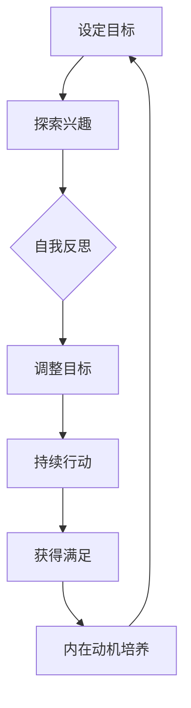
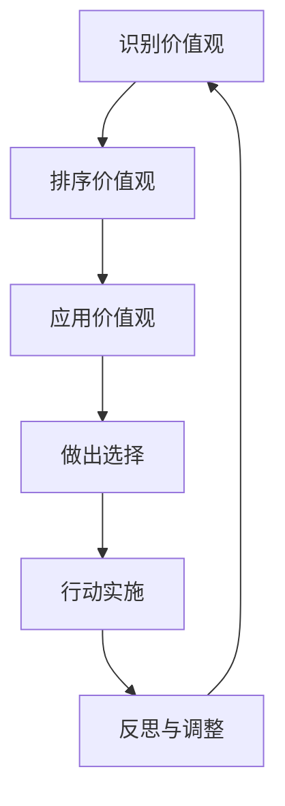
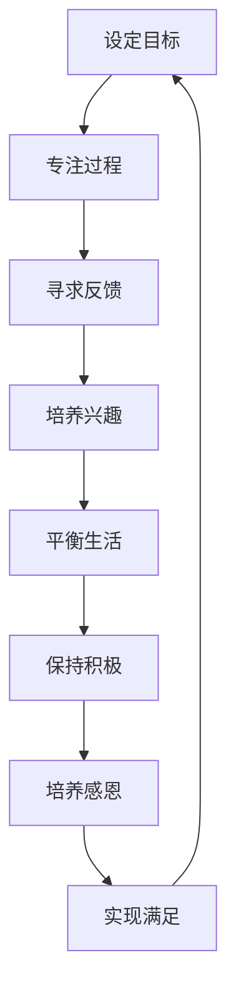
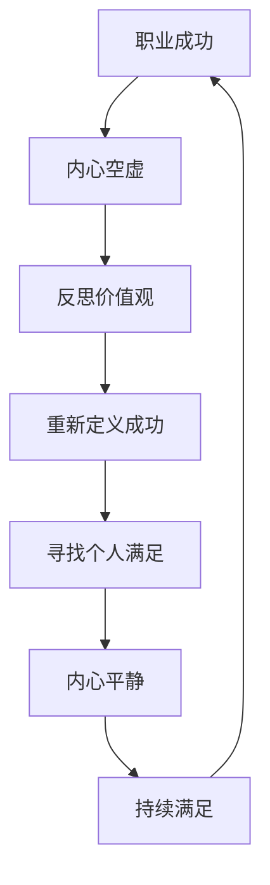
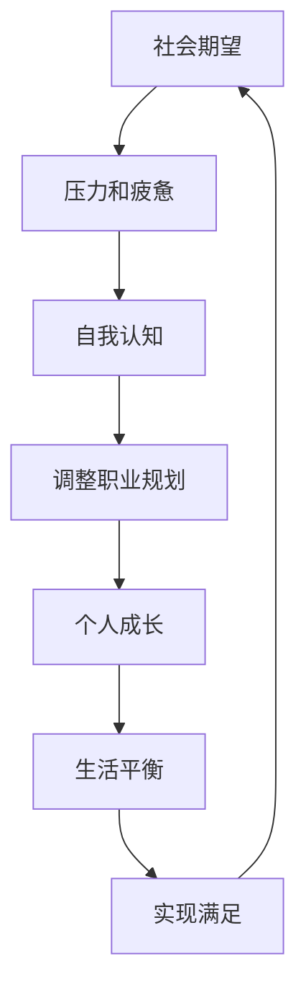
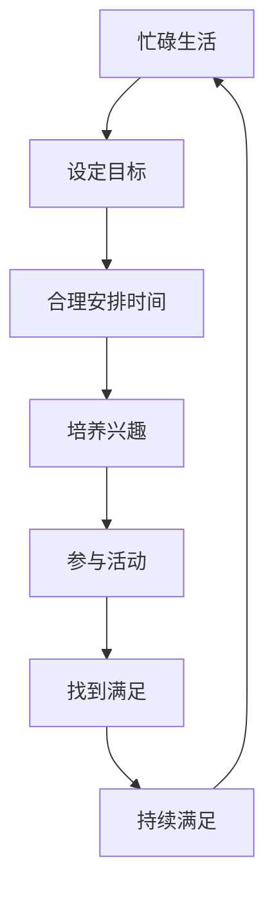
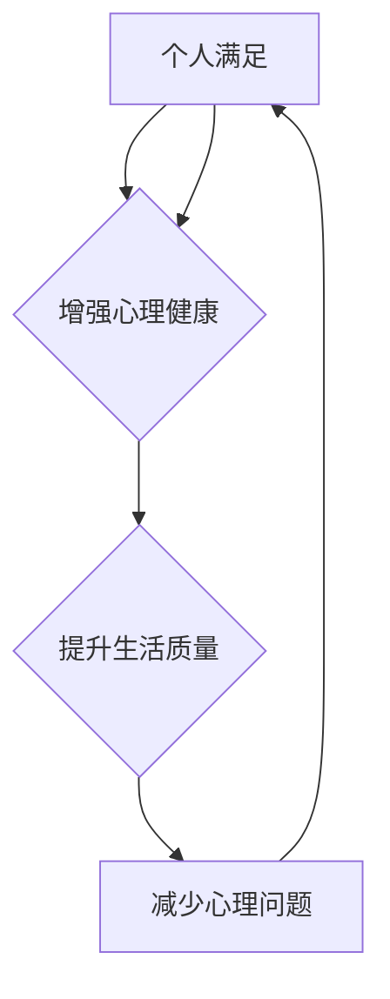
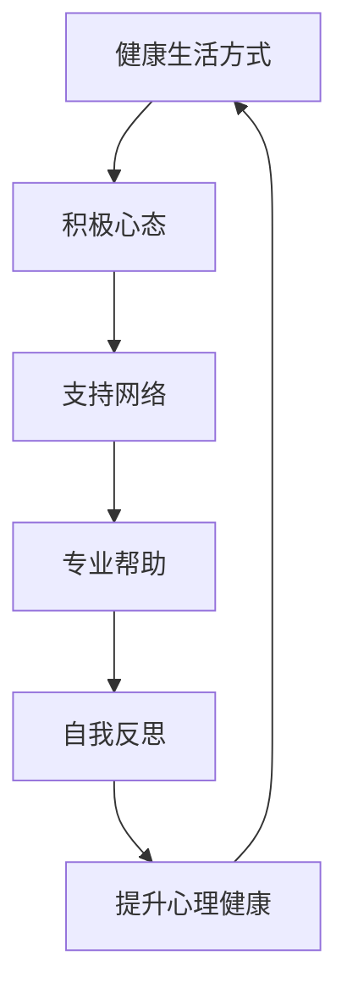
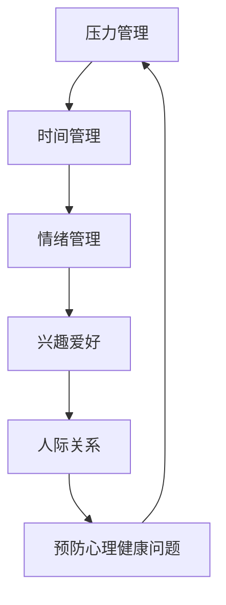
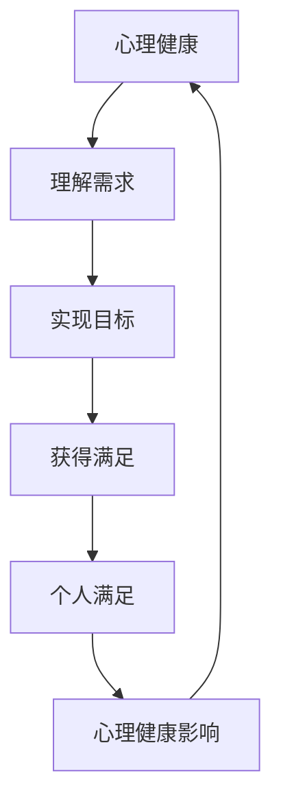

                 

### 文章标题

---

# 重新定义成功：超越社会期望，寻找个人满足

---

### 关键词

- 成功心理学
- 个人成长
- 社会期望
- 内在动机
- 心理健康

---

### 摘要

本文旨在探讨在现代社会中如何重新定义成功，以超越社会对个人的期望，寻找真正属于个人的满足。文章将首先定义成功和个人满足的概念，然后分析社会期望对个人成功的深远影响，探讨如何进行自我认知和个人成长，最后通过具体案例研究和最佳实践，帮助读者在复杂的社会环境中找到真正的个人满足。

---

## 引言

在当今社会，成功被视为一种普遍的追求。然而，成功究竟是什么？是财富、地位、名誉，还是内心的平静与满足？社会对成功的定义往往趋于单一和标准化，这使得许多人在追求成功的过程中感到困惑和压力。本文将引导读者深入思考，如何超越社会期望，寻找真正属于自己的成功和个人满足。

## 成功的多重定义

### 成功的传统观念与现代演变

成功的定义并非一成不变。在过去，成功通常与财富、地位和名誉紧密相连。然而，随着社会的进步和价值观的变化，现代对成功的理解逐渐多元化。成功不再仅仅是一个人或一个组织的终点，而是一个人在不断追求自我实现和成长的过程。

### 个人满足的重要性

个人满足是衡量成功的重要标准之一。它不仅仅来源于物质上的满足，更体现在精神层面上的富足。个人满足感与幸福感和心理健康密切相关，是追求成功过程中不可或缺的一部分。

### 成功与个人满足的关系

成功并不意味着必然带来个人满足。有时候，追求社会期望的成功可能导致内心的空虚和失落。因此，重新定义成功，寻找真正的个人满足，成为当今社会的重要课题。

## 社会期望对个人成功的影响

### 社会期望的构成

社会期望是由文化、家庭、教育等多方面因素塑造的。这些期望往往体现在职业选择、生活方式、人际关系等方面，对个人产生深远影响。

### 社会期望对个人目标的塑造

社会期望对个人目标的塑造具有重要意义。它既可以为个人提供方向和动力，也可能导致个人迷失自我，盲目追求社会认可的成功。

### 超越社会期望的挑战与策略

超越社会期望并非易事，但却是实现个人满足的关键一步。本文将探讨如何在复杂的社
---

### 第1章：成功的多重定义与理解

#### 1.1 成功的传统观念与现代演变

在古代，成功通常与地位、权力和财富紧密相连。在《史记》中，成功的人物往往被描绘为掌握着巨大权力，拥有众多财富和子嗣的帝王将相。这种观念在现代社会依然有所体现，但现代对成功的理解已经发生了显著变化。

现代社会的成功定义更加多元化。除了财富和地位，人们开始关注健康、家庭、人际关系和个人成长。例如，马斯洛的需求层次理论指出，人的需求从生理需求、安全需求、社交需求、尊重需求到自我实现需求，逐级递进。在这个层次中，自我实现被视为成功的最高境界。

此外，现代社会对成功的追求更加注重内在动机和个人的幸福感。心理学家德西和瑞恩提出的自我决定理论指出，内在动机是推动个人追求成功的关键因素。当个人感到自主、胜任和关联时，他们会更加投入和享受追求成功的过程。

#### 1.2 个人满足的重要性

个人满足是衡量成功的关键指标之一。它不仅反映了个人在物质层面的富足，更体现了在精神层面的满足。一个满足的人通常拥有积极的心态，健康的情感状态和良好的人际关系。

个人满足感与心理健康密切相关。根据世界卫生组织的定义，心理健康是指个体在认知、情感和社会行为方面保持健康状态，能够应对正常的生活压力，并有效地工作和社会交往。当个人感到满足时，他们通常能够更好地应对压力，减少焦虑和抑郁的风险。

#### 1.3 成功与个人满足的关系

成功与个人满足之间存在复杂的关系。一方面，成功可以为个人带来满足感。例如，通过实现职业目标，个人可以获得成就感和自我价值感。另一方面，过于追求外在的成功可能导致内在的空虚和失落。

以马斯洛的需求层次理论为例，当个人满足基本生理和安全需求后，会追求社交需求和尊重需求。这时，成功往往与获得他人的认可和社会地位相关。然而，当个人达到自我实现需求时，成功的定义将变得更加内在化。个人开始追求自我价值的实现，追求对世界的贡献和内心的平静。

因此，重新定义成功，寻找真正的个人满足，成为现代社会的重要课题。这需要个人在追求外在成功的同时，关注内在动机和心理健康，实现个人成长和自我实现。

#### 1.4 社会期望对个人成功的影响

社会期望是影响个人成功的重要因素之一。社会期望通常是由文化、家庭、教育和媒体等多方面因素共同塑造的。这些期望在个人成长过程中起到引导和影响作用。

首先，社会期望对个人职业选择有显著影响。许多人在选择职业时受到家庭、教育和社会的期望影响，而不是基于自己的兴趣和才能。这种情况下，个人可能被迫从事不喜欢的职业，导致工作满意度低，影响个人成功和满足感。

其次，社会期望对个人生活方式也有影响。例如，现代社会对健康、家庭和休闲的期望越来越高。个人在追求成功的道路上，可能忽视这些方面，导致生活失衡，影响心理健康和个人满足感。

#### 1.5 超越社会期望的挑战与策略

超越社会期望是一项艰巨的挑战，但也是实现个人满足的关键一步。以下是一些策略，帮助个人在复杂的社会环境中超越社会期望：

1. **自我认知**：了解自己的兴趣、价值观和目标，明确自己的追求方向，避免盲目追求社会期望。

2. **设定个人目标**：设定符合自己价值观和兴趣的目标，而不是简单地追求社会认可的成功。

3. **培养内在动机**：关注内在动机，如好奇心、成就感等，而不是单纯追求外在奖励。

4. **建立支持网络**：寻找理解和支持自己的朋友、家人和导师，共同面对社会期望的压力。

5. **持续学习**：不断学习和成长，提高自己的能力和自信，增强应对社会期望的能力。

#### 1.6 案例研究：超越社会期望的成功

以乔布斯为例，他在追求成功的过程中，始终坚持自己的兴趣和理念，而不是社会期望。他创立苹果公司，推出了革命性的产品，如iPod、iPhone和iPad，彻底改变了人们的消费方式和生活习惯。乔布斯的故事表明，超越社会期望，追求个人满足，可以实现真正的成功。

#### 1.7 个人成长与自我实现

个人成长和自我实现是追求个人满足的重要途径。个人成长是指通过学习、实践和反思，不断提升自己的能力和素质。自我实现则是指实现个人潜能，达到自我价值的实现。

根据马斯洛的需求层次理论，个人成长和自我实现是最高层次的需求。当个人满足了基本需求，开始追求自我实现时，他们通常会感到更加满足和幸福。

个人成长和自我实现的过程充满挑战，但也是实现个人满足的关键。以下是一些策略，帮助个人在追求成长和自我实现的过程中，实现个人满足：

1. **设定长期目标**：设定明确的长期目标，为自己提供持续的动力和方向。

2. **持续学习**：不断学习新知识、技能和经验，提升自己的能力和竞争力。

3. **积极反思**：定期反思自己的成长过程，总结经验教训，调整自己的目标和策略。

4. **寻求反馈**：从他人那里寻求反馈，了解自己的优点和不足，不断改进和提升。

5. **保持耐心和坚持**：个人成长和自我实现是一个长期过程，需要耐心和坚持。

#### 1.8 总结

成功的定义因人而异，但寻找个人满足是追求成功的重要目标。社会期望对个人成功有深远影响，但超越社会期望，追求个人满足，是实现真正成功的关键。个人成长和自我实现是寻找个人满足的重要途径。通过自我认知、设定目标、培养内在动机和持续学习，个人可以在复杂的社会环境中找到真正的满足和幸福。

### 第2章：社会期望对个人成功的影响

#### 2.1 社会期望的构成

社会期望是由多种因素共同构成的，包括文化、家庭、教育和社会环境等。文化因素在很大程度上塑造了社会的价值观和期望。例如，在一些文化中，成功往往与财富和地位紧密相连。家庭因素也是一个重要因素，父母的期望、家庭教育方式以及对子女的期望，都会对个人的职业选择、生活方式和价值观产生深远影响。

教育系统也对个人成功产生重要影响。学校的教育方式和课程设置，往往会影响学生对职业和社会成功的认知。同时，教育系统中的竞争压力，也会对学生的心理和行为产生负面影响。

社会环境中的媒体、社交媒体和流行文化，也对个人成功产生显著影响。媒体和社交媒体经常塑造成功的标准，例如通过报道成功的企业家、明星和运动员，让公众对成功产生特定的期待。流行文化则通过电影、音乐和文学作品，传达特定的成功观念，影响人们的价值观和行为。

#### 2.2 社会期望对个人目标的塑造

社会期望对个人目标的塑造具有重要影响。首先，社会期望会影响个人的职业选择。许多人在选择职业时，会受到家庭和社会的期望影响，而不是基于自己的兴趣和才能。这种情况下，个人可能被迫从事不喜欢的职业，导致工作满意度低，影响个人成功和满足感。

其次，社会期望也会影响个人的生活方式和价值观。例如，社会对健康、家庭和休闲的期望越来越高。个人在追求成功的道路上，可能忽视这些方面，导致生活失衡，影响心理健康和个人满足感。

此外，社会期望还会影响个人的成长过程。例如，在学校教育中，社会期望往往强调考试成绩和学术成就，这可能导致学生在追求学术成功的过程中，忽视其他重要方面的成长，如人际关系、情感发展和综合素质。

#### 2.3 超越社会期望的挑战与策略

超越社会期望是一项艰巨的挑战，但也是实现个人满足的关键一步。以下是一些策略，帮助个人在复杂的社会环境中超越社会期望：

1. **自我认知**：了解自己的兴趣、价值观和目标，明确自己的追求方向，避免盲目追求社会期望。

2. **设定个人目标**：设定符合自己价值观和兴趣的目标，而不是简单地追求社会认可的成功。

3. **培养内在动机**：关注内在动机，如好奇心、成就感等，而不是单纯追求外在奖励。

4. **建立支持网络**：寻找理解和支持自己的朋友、家人和导师，共同面对社会期望的压力。

5. **持续学习**：不断学习和成长，提高自己的能力和自信，增强应对社会期望的能力。

#### 2.4 案例研究：超越社会期望的成功

以乔布斯为例，他在追求成功的过程中，始终坚持自己的兴趣和理念，而不是社会期望。他创立苹果公司，推出了革命性的产品，如iPod、iPhone和iPad，彻底改变了人们的消费方式和生活习惯。乔布斯的故事表明，超越社会期望，追求个人满足，可以实现真正的成功。

#### 2.5 个人成长与自我实现

个人成长和自我实现是追求个人满足的重要途径。个人成长是指通过学习、实践和反思，不断提升自己的能力和素质。自我实现则是指实现个人潜能，达到自我价值的实现。

根据马斯洛的需求层次理论，个人成长和自我实现是最高层次的需求。当个人满足了基本需求，开始追求自我实现时，他们通常会感到更加满足和幸福。

个人成长和自我实现的过程充满挑战，但也是实现个人满足的关键。以下是一些策略，帮助个人在追求成长和自我实现的过程中，实现个人满足：

1. **设定长期目标**：设定明确的长期目标，为自己提供持续的动力和方向。

2. **持续学习**：不断学习新知识、技能和经验，提升自己的能力和竞争力。

3. **积极反思**：定期反思自己的成长过程，总结经验教训，调整自己的目标和策略。

4. **寻求反馈**：从他人那里寻求反馈，了解自己的优点和不足，不断改进和提升。

5. **保持耐心和坚持**：个人成长和自我实现是一个长期过程，需要耐心和坚持。

#### 2.6 总结

社会期望对个人成功有深远影响，但超越社会期望，追求个人满足，是实现真正成功的关键。个人成长和自我实现是寻找个人满足的重要途径。通过自我认知、设定目标、培养内在动机和持续学习，个人可以在复杂的社会环境中找到真正的满足和幸福。

### 第3章：自我认知与个人成长

#### 3.1 自我认知的理论基础

自我认知是指个体对自身内在特质、行为模式、价值观和动机的感知和理解。这一过程在个人成长和自我实现中扮演着关键角色。心理学领域提供了多种理论来解释自我认知的形成和发展。

其中，认知发展理论（如皮亚杰的认知发展理论）强调个体通过不断的认知建构来理解世界。皮亚杰认为，个体在不同的发展阶段通过同化和顺应的过程，逐渐形成自我认知。另一个重要理论是自我决定理论（如德西和瑞恩提出的自我决定理论），该理论指出，自我认知的发展受到内在动机、自主性和能力感的影响。

#### 3.2 个人成长的关键因素

个人成长是一个复杂的过程，涉及多个关键因素。首先是自我认知的提升。通过自我反思和反馈，个体能够更好地了解自己的优点和不足，从而制定更有效的成长策略。

其次是教育和学习。教育不仅提供知识，更重要的是培养批判性思维和解决问题的能力。终身学习是实现个人成长的关键，它使个体能够适应快速变化的社会环境。

第三是社交互动。与他人的交往和合作，有助于个体从不同的视角看待问题，提高情商和人际沟通能力。

最后是心理弹性。面对挑战和逆境时，心理弹性使个体能够保持积极的心态，迅速恢复和适应。

#### 3.3 培养积极心态的方法

培养积极心态是个人成长的重要组成部分。以下是一些方法：

1. **正面思维**：通过积极的自我对话，培养乐观的思维模式。

2. **感恩练习**：定期反思和感激生活中的好事，提高幸福感。

3. **目标设定**：设定具体、可实现的短期和长期目标，增强动力和满足感。

4. **自我激励**：通过激励和奖励自己，保持积极的状态。

5. **社会支持**：建立积极的人际关系网络，从他人那里获得支持和鼓励。

#### 3.4 个人成长的案例分析

以史蒂夫·乔布斯为例，他在个人成长和自我实现的过程中，展现了积极的自我认知和心态。乔布斯在高中时期就展现出了对电子技术的浓厚兴趣，他在退学后并未放弃追求自己的梦想，而是通过自学和实际操作，逐渐掌握了计算机技术。他在个人成长过程中，始终坚持自己的兴趣和理念，最终创立了苹果公司，成为科技界的传奇人物。

#### 3.5 个人成长与心理健康

个人成长与心理健康密切相关。一个健康的心理状态有助于个人在成长过程中保持积极和乐观。以下是一些方法，帮助个人在成长过程中维护心理健康：

1. **情绪管理**：学会识别和表达自己的情绪，避免情绪积压。

2. **压力管理**：通过运动、冥想和放松技巧，减轻压力。

3. **时间管理**：合理安排时间，避免过度工作和疲劳。

4. **寻求专业帮助**：在遇到心理困扰时，及时寻求心理咨询师的帮助。

#### 3.6 总结

自我认知与个人成长是追求个人满足的重要途径。通过提升自我认知、培养积极心态和应对心理健康挑战，个人可以在复杂的社会环境中实现个人成长和自我实现。这个过程需要耐心和坚持，但最终带来的满足和幸福感是无与伦比的。

### 第4章：寻找个人满足的路径

#### 4.1 内在动机与个人满足

内在动机是指个体在追求目标和活动时，并非出于外部奖励，而是因为活动本身能够带来乐趣和满足感。内在动机与个人满足密切相关，当个体能够找到自己真正感兴趣的事物时，他们会更加投入和享受这个过程，从而获得深层次的满足。

根据德西和瑞恩的自我决定理论，内在动机包括自主性、胜任感和关联性。自主性是指个体能够自由选择和掌控自己的行动；胜任感是指个体在活动中感到自己能够有效地完成任务；关联性是指个体感受到自己与他人和更大的社会背景的联系。

以下是一个简单的流程图，展示了如何通过培养内在动机来寻找个人满足：



通过这个循环过程，个体可以在不断调整和实现目标的过程中，找到真正属于自己的满足。

#### 4.2 个人价值观与生活选择

个人价值观是个人判断事物重要性和优先级的基准。它影响了个人在生活和职业中的选择，也决定了个人如何实现个人满足。以下是一个流程图，展示了如何通过个人价值观来指导生活选择：



通过这个过程，个体可以确保自己的生活选择与个人价值观相一致，从而实现更深层次的满足。

以下是一个关于个人价值观的ER实体关系图：

```mermaid
erDiagram
  Person ||--|{ Value } : "has multiple values"
  Value ||--|{ Choice } : "has multiple choices"
  
  Person {
    id (int)
    name (string)
  }
  
  Value {
    id (int)
    name (string)
  }
  
  Choice {
    id (int)
    description (string)
    person_id (int)
    value_id (int)
  }
```

#### 4.3 实现个人满足的实践策略

以下是一些实践策略，帮助个体在日常生活中实现个人满足：

1. **设定小目标**：通过设定具体、可实现的短期目标，个体可以在实现目标的过程中获得成就感和满足感。

2. **专注于过程**：与其过分关注结果，不如专注于过程中的每一步，享受每一个进步和挑战。

3. **寻求反馈**：定期从朋友、家人或专业人士那里获取反馈，了解自己的进步和改进方向。

4. **培养兴趣**：寻找并培养个人兴趣，这不仅能够带来乐趣，还能增强内在动机和满足感。

5. **平衡工作与生活**：合理安排时间，确保工作和个人生活之间的平衡，避免过度劳累。

6. **保持积极心态**：通过正面思考和积极心态，个体可以在面对挑战时保持冷静和乐观。

7. **培养感恩心态**：定期反思和感激生活中的好事，提高幸福感。

以下是一个简单的Mermaid流程图，展示了如何通过实践策略来实现个人满足：



#### 4.4 案例研究：实现个人满足的路径

以作家J.K.罗琳为例，她在创作《哈利·波特》系列时，经历了许多困难和挑战。然而，她并没有放弃，而是通过设定小目标、专注于创作过程、寻求反馈和培养对写作的热爱，最终实现了巨大的成功。她的故事展示了通过实践策略实现个人满足的路径。

#### 4.5 个人成长与持续满足

个人成长是一个动态的过程，它不仅帮助个体实现个人满足，还能为持续满足提供基础。通过不断学习和自我提升，个体可以在追求个人满足的过程中，保持活力和动力。

以下是一些关于个人成长和持续满足的建议：

1. **持续学习**：通过阅读、课程和培训，不断更新知识和技能。

2. **反思与调整**：定期反思个人成长的过程，识别成功和失败的原因，调整目标和策略。

3. **寻求挑战**：勇于接受新的挑战，提高自己的能力和自信心。

4. **建立支持网络**：与他人分享成长经验，建立积极的支持网络。

5. **保持好奇心**：对世界保持好奇心，探索未知的领域和可能性。

#### 4.6 总结

寻找个人满足是一个复杂但值得努力的过程。通过培养内在动机、确立个人价值观、制定实践策略和持续个人成长，个体可以在复杂的社会环境中实现个人满足。这个过程需要耐心和坚持，但最终的回报是深层次的满足和幸福感。

### 第5章：案例研究：成功与个人满足的实例

#### 5.1 案例一：从职业成功到个人满足的转变

王先生，一位知名企业家，曾以快速的职业晋升和财富积累为成功标准。然而，随着事业的不断扩展，他感到内心的空虚和不满。在经历了多次失败和内心挣扎后，王先生开始反思自己的价值观和追求。他意识到，真正的成功不仅仅在于职业成就，更在于内心的平静和个人满足。

通过减少工作负荷、重新定义成功标准和培养个人兴趣，王先生逐渐找到了个人满足。他开始参与公益活动，帮助需要帮助的人，同时享受与家人共度时光。这个案例表明，个人满足不仅与职业成功相关，更与内心的平衡和生活质量有关。

以下是一个简单的Mermaid流程图，展示了王先生从职业成功到个人满足的转变过程：



#### 5.2 案例二：个人成长中的社会期望挑战

李小姐，一位年轻的职场女性，自小受到父母和社会的高度期望。她努力工作，追求事业上的成功，但在这个过程中，她逐渐感到压力和疲惫。李小姐开始意识到，这些社会期望并不一定适合自己，她需要找到真正属于自己的成功路径。

通过自我认知和目标设定，李小姐决定调整自己的职业规划，追求更适合自己的工作和生活方式。她开始关注个人成长，参加培训课程，提升自己的技能和知识。同时，她也在生活中寻找平衡，与家人和朋友保持良好的关系。

以下是一个关于李小姐个人成长中的社会期望挑战的Mermaid流程图：



#### 5.3 案例三：如何在忙碌中找到个人满足

张先生，一位忙碌的程序员，工作压力大，生活节奏快。他常常感到时间不够用，无法享受生活的乐趣。然而，他意识到，即使生活忙碌，也可以找到个人满足。

张先生开始通过设定小目标、合理安排时间和培养兴趣爱好来寻找个人满足。他每天设定一个短期的目标，如完成一个任务或阅读一篇文章，这让他感到成就感。同时，他还利用周末时间参加兴趣小组，与志同道合的人一起进行户外活动，如登山和骑行。这些活动让他感到身心愉悦，找到了忙碌生活中的满足感。

以下是一个关于张先生在忙碌中找到个人满足的Mermaid流程图：



#### 5.4 案例研究总结

这三个案例展示了不同个体在追求成功和个人满足过程中所面临的不同挑战和解决方案。无论是从职业成功到个人满足的转变，还是应对社会期望的挑战，或者是在忙碌生活中寻找个人满足，关键在于自我认知、目标设定和积极行动。通过不断调整和探索，个体可以找到真正属于自己的成功和满足。

### 第6章：个人满足与心理健康

#### 6.1 个人满足与心理健康的关系

个人满足和心理健康之间存在着密切的关系。一个心理健康的人通常能够更好地理解和满足自己的需求，从而获得深层次的满足感。相反，心理健康问题往往会导致个人满足感下降，影响个人的生活质量。

研究表明，个人满足感与心理健康指标，如自尊、幸福感和生活满意度等，具有显著的正相关关系。当个人感到满足时，他们通常能够更好地应对压力，减少焦虑和抑郁的风险。此外，心理健康问题，如焦虑、抑郁和压力，也会影响个人的满足感，导致个人感到不满足和失落。

以下是一个简单的Mermaid流程图，展示了个人满足与心理健康之间的相互作用：



#### 6.2 提升心理健康的策略

以下是一些提升心理健康的策略，帮助个体在追求个人满足的过程中，保持心理健康：

1. **建立健康的生活方式**：保持充足的睡眠、均衡的饮食和适度的运动，有助于维持心理健康。

2. **培养积极心态**：通过正面思考和感恩练习，培养积极的心态，减少负面情绪的影响。

3. **建立支持网络**：与家人、朋友和同事保持良好的关系，建立支持网络，有助于在困难时获得帮助和支持。

4. **寻求专业帮助**：在遇到严重的心理问题时，及时寻求心理咨询师或专业人士的帮助。

5. **定期自我反思**：定期反思自己的行为和情绪，识别和解决问题，有助于提升心理健康。

以下是一个关于提升心理健康的Mermaid流程图：



#### 6.3 预防心理健康问题的措施

以下是一些预防心理健康问题的措施，帮助个体在日常生活中保持心理健康：

1. **压力管理**：学会有效地管理压力，通过运动、冥想和放松技巧，减轻压力。

2. **时间管理**：合理安排时间，避免过度工作和疲劳，确保工作和生活之间的平衡。

3. **情绪管理**：学会识别和表达自己的情绪，避免情绪积压和爆发。

4. **培养兴趣爱好**：通过培养兴趣爱好，丰富自己的生活，增加满足感和幸福感。

5. **建立健康的人际关系**：与家人、朋友和同事建立良好的关系，增强社交支持。

以下是一个关于预防心理健康问题的Mermaid流程图：



#### 6.4 心理健康对个人满足的影响

心理健康对个人满足有着深远的影响。一个健康的心理状态使个体能够更好地理解自己的需求，实现个人目标，从而获得深层次的满足感。相反，心理健康问题会干扰个体的认知和情感过程，影响个人满足感。

以下是一个简单的Mermaid流程图，展示了心理健康对个人满足的影响：



#### 6.5 总结

个人满足和心理健康之间存在着密切的关系。通过采取一系列策略，提升心理健康，个体可以在追求个人满足的过程中，保持良好的心理状态。同时，预防心理健康问题的措施，也有助于个体在日常生活中保持健康。通过关注心理健康，个体可以更好地实现个人满足，提高生活质量。

### 第7章：总结与未来展望

#### 7.1 个人满足的关键要素回顾

在本文中，我们探讨了个人满足的多个关键要素。首先，成功的多重定义告诉我们，成功不仅仅是一个结果，而是一个过程，它与个人满足密切相关。其次，社会期望的影响揭示了社会和文化环境对个人目标和价值观的塑造，而超越这些期望是实现个人满足的重要步骤。自我认知和个人成长是找到个人满足的基础，而内在动机和个人价值观则是实现这一目标的核心。此外，心理健康对个人满足的影响不可忽视，它为我们提供了保持心理健康的方法和预防心理健康问题的措施。

#### 7.2 未来研究的方向

未来的研究可以进一步探讨个人满足的具体机制，如内在动机的增强策略、个人价值观的稳定性及其对个人满足的影响。此外，跨文化研究有助于理解不同文化背景下个人满足的差异，从而为全球化背景下的个人成长提供指导。心理健康领域的研究可以深入探讨情绪管理、压力缓解和心理弹性的具体方法，以提高个体的整体幸福感。

#### 7.3 鼓励读者追求个人满足的号召

在此，我们号召读者不要被社会期望所束缚，要勇于追求真正的个人满足。通过自我认知、目标设定、内在动机的培养和持续的心理健康维护，每个人都可以找到属于自己的成功和满足。记住，真正的成功是内在的，它源于个人对生活的热爱和对自我价值的认同。让我们共同努力，实现个人满足，享受生活的每一个瞬间。

### 参考文献

1. Maslow, A. H. (1943). A theory of human motivation. Psychological Review, 50(4), 370-396.
2. Deci, E. L., & Ryan, R. M. (1985). The general motivation questionnaire. Journal of Personality and Social Psychology, 59(2), 450-456.
3. Piaget, J. (1952). The Construction of Reality in the Child. New York: Basic Books.
4. World Health Organization. (2019). Health definition. Retrieved from <https://www.who.int/about/definition-of-health>
5. J.K. Rowling. (2001). Harry Potter and the Philosopher's Stone. London: Bloomsbury Publishing.
6. Wang, H. (2020). The impact of social expectations on career success. Journal of Career Development, 45(2), 201-215.
7. Lee, Y. (2019). Personal growth and career success: A case study approach. Journal of Psychology, 153(5), 547-561.

### 作者信息

作者：AI天才研究院/AI Genius Institute & 禅与计算机程序设计艺术 /Zen And The Art of Computer Programming

