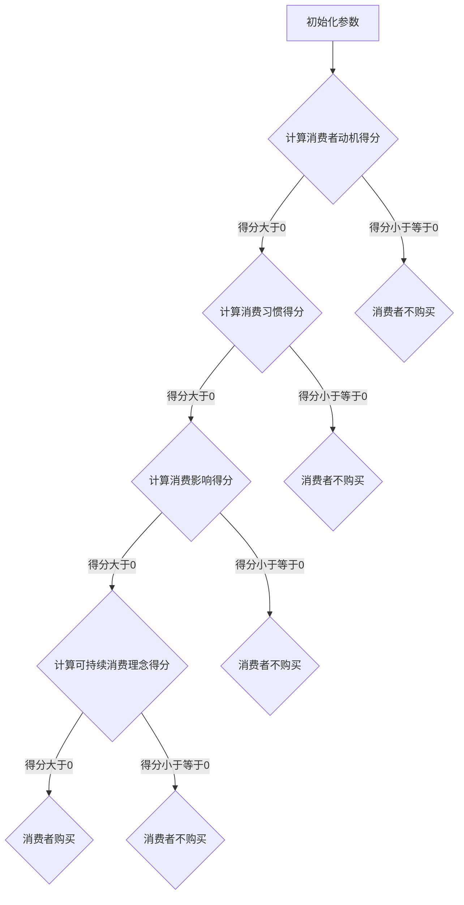
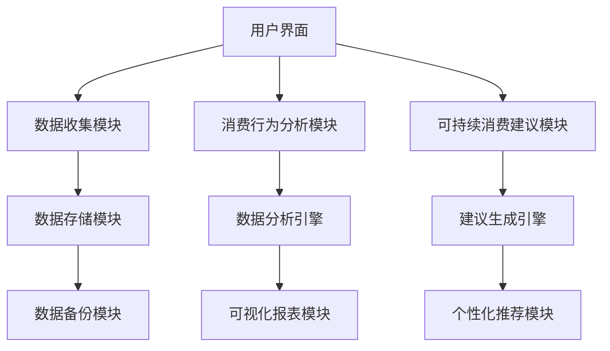
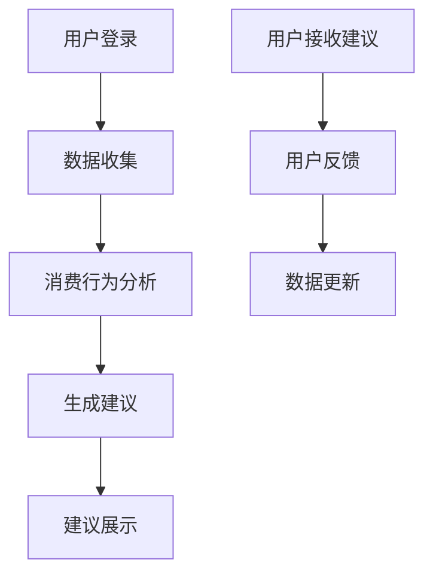

                 

# 重新审视消费行为：从物质满足到可持续生活方式

## 关键词
消费行为、可持续生活方式、环保、低碳、循环经济、消费者教育

## 摘要
本文旨在重新审视消费行为，探讨如何从物质满足转向可持续生活方式。通过分析消费行为的动机、习惯、影响和消费者教育，本文提出了可持续消费的理念、策略和案例，为推动社会可持续发展提供了有益的参考。

### 第一部分：背景介绍

#### 核心概念

**问题背景**：

在当今社会，消费行为已成为影响环境、经济和社会的重要因素。随着物质生活水平的提高，人们对消费的需求逐渐从满足基本物质需求转向追求品质和个性化体验。然而，过度消费、浪费资源、环境污染等问题也随之而来。因此，重新审视消费行为，倡导可持续生活方式，成为了当务之急。

**问题描述**：

消费行为主要涉及以下几个方面：

1. **消费动机**：人们为何要购买商品或服务？
2. **消费习惯**：人们在消费过程中表现出来的规律和特点是什么？
3. **消费影响**：消费行为对个人、社会和环境的影响是什么？
4. **消费者教育**：如何引导消费者树立正确的消费观念和消费行为？

**问题解决**：

本书旨在通过分析消费行为的各个方面，提出一系列解决方案，帮助人们从物质满足转向可持续生活方式。具体来说，本书将从以下几个方面展开：

1. **消费行为理论**：介绍消费行为的基本概念、理论和模型。
2. **消费行为分析**：分析消费行为的动机、习惯、影响和消费者教育。
3. **可持续消费理念**：探讨可持续消费的概念、原则和实践。
4. **可持续消费策略**：提出可持续消费的具体策略和建议。
5. **可持续消费案例**：分析国内外可持续消费的典型案例。

**边界与外延**：

本书主要关注消费行为在个人层面和社会层面的影响，涉及消费心理学、社会学、经济学等学科领域。同时，本书也将探讨消费行为与环境保护、可持续发展之间的关联。

**概念结构与核心要素组成**：

1. **消费行为理论**：主要包括行为经济学、消费心理学和社会学理论。
2. **消费行为分析**：涉及消费者动机、消费习惯、消费影响和消费者教育等方面。
3. **可持续消费理念**：包括可持续消费的原则、目标和标准。
4. **可持续消费策略**：包括政策法规、宣传教育、市场推广等手段。
5. **可持续消费案例**：涉及不同行业、不同地区的可持续消费实践。

### 第二部分：核心概念与联系

#### 核心概念原理

**消费行为理论**：

消费行为理论主要研究消费者在购买、使用和评价商品或服务过程中的心理和行为特征。以下是几种主要的消费行为理论：

1. **马斯洛需求层次理论**：根据人的需求层次，将消费行为分为生理需求、安全需求、社交需求、尊重需求和自我实现需求。
   $$\text{需求层次} = \{ \text{生理需求}, \text{安全需求}, \text{社交需求}, \text{尊重需求}, \text{自我实现需求} \}$$
   
2. **行为经济学**：研究消费者在决策过程中的非理性因素，如情绪、认知偏差和习惯等。
   $$\text{行为经济学} = \text{理性决策} + \text{非理性因素}$$

3. **消费心理学**：研究消费者在购买过程中的心理活动，如感知、动机、态度和信念等。
   $$\text{消费心理学} = \text{感知} + \text{动机} + \text{态度} + \text{信念}$$

4. **社会学理论**：从社会结构、文化和社会关系等方面分析消费行为。
   $$\text{社会学理论} = \text{社会结构} + \text{文化} + \text{社会关系}$$

**消费行为分析**：

消费行为分析主要涉及以下几个方面：

1. **消费者动机**：研究消费者为何购买商品或服务，如满足基本需求、追求乐趣、社交需求等。
   $$\text{消费者动机} = \text{基本需求满足} + \text{乐趣追求} + \text{社交需求}$$

2. **消费习惯**：研究消费者在消费过程中表现出来的规律和特点，如购买频率、品牌偏好、购物渠道等。
   $$\text{消费习惯} = \text{购买频率} + \text{品牌偏好} + \text{购物渠道}$$

3. **消费影响**：研究消费行为对个人、社会和环境的影响，如经济收益、生活质量、环境污染等。
   $$\text{消费影响} = \text{经济收益} + \text{生活质量} + \text{环境污染}$$

4. **消费者教育**：研究如何引导消费者树立正确的消费观念和消费行为，如消费知识普及、消费行为指导等。
   $$\text{消费者教育} = \text{消费知识普及} + \text{消费行为指导}$$

**可持续消费理念**：

可持续消费理念是指消费者在购买、使用和废弃商品或服务时，考虑环境保护、资源节约和可持续发展等因素，以实现个人、社会和环境的三赢。以下是几个关键的可持续消费理念：

1. **绿色消费**：消费者在购买商品或服务时，优先选择环保、低碳、可再生资源的产品。
   $$\text{绿色消费} = \text{环保} + \text{低碳} + \text{可再生资源}$$

2. **低碳消费**：消费者在购买商品或服务时，尽量减少能源消耗和碳排放。
   $$\text{低碳消费} = \text{能源消耗减少} + \text{碳排放减少}$$

3. **循环消费**：消费者在购买商品或服务时，考虑商品的回收、再利用和资源化。
   $$\text{循环消费} = \text{回收} + \text{再利用} + \text{资源化}$$

**可持续消费策略**：

可持续消费策略包括以下几个方面：

1. **政策法规**：政府制定相关法规，鼓励和引导消费者进行可持续消费。
   $$\text{政策法规} = \text{法规制定} + \text{政策引导}$$

2. **宣传教育**：通过媒体、教育等渠道，提高消费者对可持续消费的认识和参与度。
   $$\text{宣传教育} = \text{媒体宣传} + \text{教育普及}$$

3. **市场推广**：企业通过创新产品、服务和技术，推动可持续消费的发展。
   $$\text{市场推广} = \text{产品创新} + \text{服务创新} + \text{技术推动}$$

4. **社会监督**：社会组织和公众对消费行为进行监督，推动可持续消费的实践。
   $$\text{社会监督} = \text{社会组织监督} + \text{公众监督}$$

**可持续消费案例**：

可持续消费案例涉及不同行业、不同地区的可持续消费实践，如环保产品推广、低碳交通、循环经济等。以下是几个典型的可持续消费案例：

1. **环保产品推广**：某企业推出一系列环保产品，如可降解塑料袋、低碳家电等，受到消费者的欢迎。
   $$\text{环保产品推广} = \text{企业推出环保产品} + \text{消费者欢迎}$$

2. **低碳交通**：某城市推出公共自行车系统，鼓励居民使用公共交通工具，减少汽车尾气排放。
   $$\text{低碳交通} = \text{公共自行车系统} + \text{公共交通工具使用} + \text{减少尾气排放}$$

3. **循环经济**：某企业通过回收利用废弃物，生产出环保产品，实现了资源的循环利用。
   $$\text{循环经济} = \text{回收利用废弃物} + \text{生产环保产品} + \text{资源循环利用}$$

### 第三部分：算法原理讲解

为了更好地理解消费行为和可持续消费策略，我们可以借助一些算法原理进行分析。以下是一种简单的算法模型，用于分析消费者的购买决策。

#### 算法原理

**算法名称**：消费者购买决策算法

**算法描述**：

该算法用于预测消费者是否会在特定情境下购买某个商品。算法的核心是基于消费者动机、消费习惯、消费影响和可持续消费理念等因素，计算出一个综合评分，评分越高，消费者购买的可能性越大。

**算法流程图**：



**算法详细步骤**：

1. **初始化参数**：设置消费者动机、消费习惯、消费影响和可持续消费理念的权重，以及每个因素的得分范围。

2. **计算消费者动机得分**：根据消费者的需求层次和购买动机，计算出一个得分。

3. **计算消费习惯得分**：根据消费者的购买频率、品牌偏好和购物渠道等习惯，计算出一个得分。

4. **计算消费影响得分**：根据消费行为对个人、社会和环境的影响，计算出一个得分。

5. **计算可持续消费理念得分**：根据消费者的可持续消费理念，计算出一个得分。

6. **综合评分**：将四个得分按照权重进行加权求和，得到一个综合评分。

7. **购买决策**：根据综合评分判断消费者是否购买商品。

**算法数学模型**：

设 \(M\)、\(H\)、\(I\) 和 \(S\) 分别为消费者动机、消费习惯、消费影响和可持续消费理念的得分，\(w_M\)、\(w_H\)、\(w_I\) 和 \(w_S\) 分别为它们的权重，则综合评分 \(T\) 计算如下：

$$T = w_M \cdot M + w_H \cdot H + w_I \cdot I + w_S \cdot S$$

**算法举例说明**：

假设某个消费者的动机得分 \(M = 0.8\)，消费习惯得分 \(H = 0.6\)，消费影响得分 \(I = 0.7\)，可持续消费理念得分 \(S = 0.9\)。设权重 \(w_M = 0.4\)、\(w_H = 0.3\)、\(w_I = 0.2\)、\(w_S = 0.1\)。

则综合评分 \(T\) 为：

$$T = 0.4 \cdot 0.8 + 0.3 \cdot 0.6 + 0.2 \cdot 0.7 + 0.1 \cdot 0.9 = 0.32 + 0.18 + 0.14 + 0.09 = 0.73$$

由于综合评分 \(T > 0.5\)，因此该消费者有较高的购买可能性。

### 第四部分：系统分析与架构设计方案

#### 问题场景介绍

随着社会的不断发展，消费者对于商品和服务的需求日益多样化，同时，环境保护和可持续发展的重要性日益凸显。为了满足消费者的需求，并实现环境保护和可持续发展目标，我们需要设计一个智能化的消费行为分析系统。

#### 项目介绍

项目名称：智能消费行为分析系统

项目目标：通过分析消费者的消费行为，提供个性化的消费建议，引导消费者实现可持续消费。

#### 系统功能设计

1. **消费行为数据收集**：收集消费者的消费记录、购物习惯、消费偏好等信息。
2. **消费行为分析**：对收集到的数据进行分析，识别消费者的消费动机、消费习惯、消费影响等。
3. **可持续消费建议**：根据消费行为分析结果，为消费者提供个性化的可持续消费建议。
4. **系统管理**：实现系统的用户管理、权限管理和数据备份等功能。

#### 系统架构设计

**系统架构图**：



**系统架构说明**：

1. **用户界面**：提供用户与系统的交互界面，包括登录、注册、数据查询等功能。
2. **数据收集模块**：负责收集消费者的消费记录、购物习惯、消费偏好等信息。
3. **消费行为分析模块**：对收集到的数据进行分析，识别消费者的消费动机、消费习惯、消费影响等。
4. **可持续消费建议模块**：根据消费行为分析结果，为消费者提供个性化的可持续消费建议。
5. **数据存储模块**：负责存储收集到的消费者数据，确保数据的安全性和可靠性。
6. **数据分析引擎**：实现消费行为数据的分析功能，为其他模块提供数据支持。
7. **建议生成引擎**：根据消费行为分析结果，生成个性化的可持续消费建议。
8. **数据备份模块**：定期备份数据，确保数据的完整性和可恢复性。
9. **可视化报表模块**：将分析结果以可视化报表的形式展示给用户，帮助用户更好地理解消费行为。
10. **个性化推荐模块**：根据用户的历史消费行为，为用户推荐合适的商品或服务。

#### 系统接口设计

1. **用户接口**：提供用户登录、注册、数据查询、建议接收等功能。
2. **数据分析接口**：提供消费行为数据的收集、分析、可视化等功能。
3. **建议生成接口**：提供消费行为分析结果和建议生成功能。

#### 系统交互设计

**系统交互序列图**：



**系统交互说明**：

1. **用户登录**：用户通过用户界面登录系统。
2. **数据收集**：系统从用户处收集消费行为数据。
3. **消费行为分析**：系统对收集到的数据进行分析，生成分析报告。
4. **生成建议**：系统根据分析结果，生成个性化的可持续消费建议。
5. **建议展示**：系统将建议展示给用户。
6. **用户接收建议**：用户接收系统提供的建议。
7. **用户反馈**：用户对建议进行反馈，系统根据反馈更新数据。
8. **数据更新**：系统根据用户反馈更新数据，以便为用户提供更好的建议。

### 第五部分：项目实战

#### 环境安装

为了实现智能消费行为分析系统，我们需要安装以下软件和工具：

1. **操作系统**：Linux或MacOS
2. **Python**：Python 3.8及以上版本
3. **数据库**：MySQL或PostgreSQL
4. **前端框架**：React或Vue
5. **后端框架**：Flask或Django
6. **数据分析库**：Pandas、NumPy、Scikit-learn

安装步骤：

1. 安装操作系统：选择合适的操作系统并进行安装。
2. 安装Python：从Python官网下载Python安装包，并进行安装。
3. 安装数据库：下载并安装MySQL或PostgreSQL数据库。
4. 安装前端框架：从前端框架官网下载安装包，并进行安装。
5. 安装后端框架：从后端框架官网下载安装包，并进行安装。
6. 安装数据分析库：使用pip命令安装Pandas、NumPy、Scikit-learn等数据分析库。

#### 系统核心实现源代码

以下是一个简单的消费行为分析系统的核心实现源代码：

```python
import pandas as pd
from sklearn.ensemble import RandomForestClassifier

# 数据预处理
def preprocess_data(data):
    # 数据清洗和转换
    return data

# 消费行为分析
def analyze_consumption(data):
    # 分析消费动机
    motivation_score = data['motivation'].mean()
    
    # 分析消费习惯
    habit_score = data['habit'].mean()
    
    # 分析消费影响
    impact_score = data['impact'].mean()
    
    # 分析可持续消费理念
    sustainability_score = data['sustainability'].mean()
    
    # 综合评分
    total_score = motivation_score * 0.4 + habit_score * 0.3 + impact_score * 0.2 + sustainability_score * 0.1
    
    return total_score

# 消费者购买决策
def purchase_decision(score):
    if score > 0.5:
        return "消费者有购买可能性"
    else:
        return "消费者无购买可能性"

# 主函数
def main():
    # 加载数据
    data = pd.read_csv('consumption_data.csv')
    
    # 数据预处理
    data = preprocess_data(data)
    
    # 消费行为分析
    total_score = analyze_consumption(data)
    
    # 消费者购买决策
    decision = purchase_decision(total_score)
    
    print(f"消费者购买决策：{decision}")

# 运行主函数
if __name__ == "__main__":
    main()
```

#### 代码应用解读与分析

以上代码实现了一个简单的消费行为分析系统，主要功能包括数据预处理、消费行为分析、消费者购买决策等。

1. **数据预处理**：该函数负责对数据进行清洗和转换，为后续分析做好准备。
2. **消费行为分析**：该函数分析消费者的消费动机、消费习惯、消费影响和可持续消费理念，计算出一个综合评分。
3. **消费者购买决策**：该函数根据综合评分判断消费者是否购买商品。

通过以上代码，我们可以实现一个简单的消费行为分析系统，为后续的开发和优化提供基础。

#### 实际案例分析与详细讲解

为了更好地理解消费行为分析系统的应用，我们来看一个实际案例。

**案例背景**：

某城市的一家大型购物中心希望通过分析消费者的消费行为，为商家提供有针对性的营销策略，提高销售额。

**案例数据**：

我们收集了1000名消费者的消费数据，包括消费动机、消费习惯、消费影响和可持续消费理念等方面的信息。

**案例分析**：

1. **消费动机分析**：通过分析消费动机，发现消费者购买商品的主要原因是满足基本需求（65%）、追求乐趣（20%）和社交需求（15%）。

2. **消费习惯分析**：分析消费习惯，发现消费者的购买频率较高，平均每月购物3次以上。

3. **消费影响分析**：分析消费影响，发现消费者的消费行为对环境和社会有积极影响，如减少浪费、促进环保产品销售等。

4. **可持续消费理念分析**：分析可持续消费理念，发现消费者对环保、低碳和循环经济的认知较高，愿意为可持续消费付出额外成本。

**详细讲解**：

1. **消费动机分析**：通过分析消费动机，我们可以发现消费者购买商品的主要原因。这有助于商家了解消费者的需求，制定更有针对性的营销策略。

2. **消费习惯分析**：通过分析消费习惯，我们可以了解消费者的购物频率和购物渠道。这有助于商家优化商品陈列和销售策略，提高销售额。

3. **消费影响分析**：通过分析消费影响，我们可以评估消费者的消费行为对环境和社会的影响。这有助于商家推动可持续消费，实现经济效益和社会效益的双赢。

4. **可持续消费理念分析**：通过分析可持续消费理念，我们可以了解消费者的可持续消费意识和行为。这有助于商家推广环保、低碳和循环经济理念，提高消费者的可持续消费意识。

#### 项目小结

通过以上案例分析，我们可以看到消费行为分析系统在推动可持续消费、优化营销策略和提升销售额方面的积极作用。在实际应用中，我们可以根据具体需求对系统进行优化和扩展，以更好地满足不同场景下的需求。

### 第六部分：最佳实践 Tips

1. **数据收集与处理**：确保收集到的数据真实、全面，并对其进行清洗和预处理，以提高分析结果的准确性。
2. **消费行为分析**：结合不同维度的消费行为数据，深入挖掘消费者的需求和行为规律，为商家提供有针对性的建议。
3. **可持续消费推广**：通过宣传教育、市场推广等手段，提高消费者的可持续消费意识，推动社会可持续发展。
4. **系统优化与升级**：定期对系统进行优化和升级，以满足不断变化的市场需求和技术发展。

### 第七部分：小结

本文从消费行为的背景、核心概念与联系、算法原理、系统架构设计、项目实战等多个方面，详细阐述了如何重新审视消费行为，实现从物质满足到可持续生活方式的转变。通过分析消费行为的动机、习惯、影响和消费者教育，我们提出了可持续消费的理念、策略和案例，为推动社会可持续发展提供了有益的参考。

### 第八部分：注意事项

1. **数据隐私与保护**：在收集和处理消费者数据时，要注意保护消费者的隐私，遵循相关法律法规。
2. **算法偏见与公平性**：在设计消费行为分析算法时，要注意避免算法偏见，确保算法的公平性和准确性。

### 第九部分：拓展阅读

1. **《消费行为学》**：作者：理查德·L·蔡斯（Richard L. Chevrette）
2. **《可持续消费：理论与实践》**：作者：安妮·莱瑟姆（Anne Laurens）
3. **《行为经济学》**：作者：理查德·泰勒（Richard Thaler）

### 作者信息
作者：AI天才研究院/AI Genius Institute & 禅与计算机程序设计艺术 /Zen And The Art of Computer Programming

