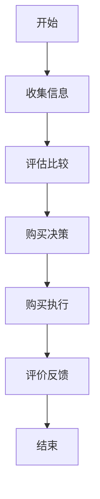
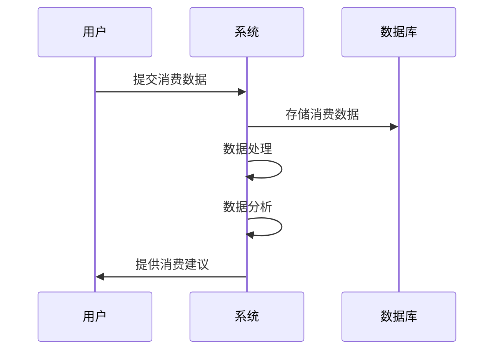
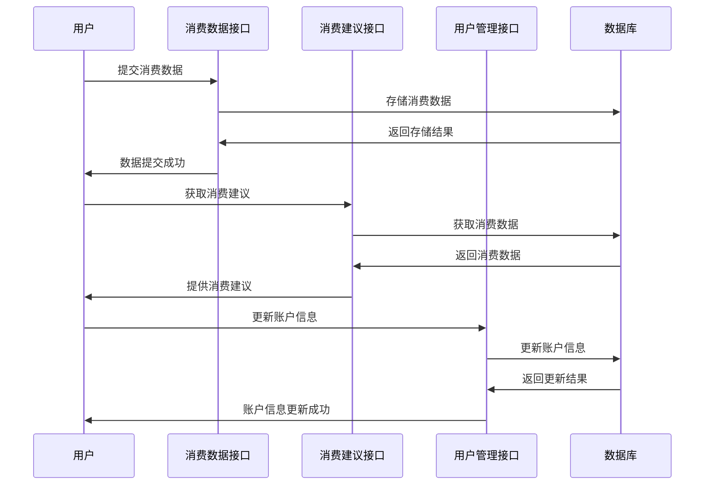

                 

# 重新审视消费行为：从物质积累到精神富足的转型

> 关键词：消费行为、物质消费、精神消费、转型、可持续发展

> 摘要：本文从消费行为的本质出发，探讨了从物质消费到精神消费的转型趋势及其价值。通过对物质消费行为的历史演变、心理机制以及精神消费行为的内涵与价值的分析，提出了转型策略与实践路径，并通过对典型案例的剖析，为读者提供了有价值的思考和实践指导。

## 1. 引言

### 1.1 问题背景

随着经济的快速发展和社会的进步，人们的消费行为发生了显著变化。传统上，物质消费被视为经济增长和社会发展的驱动力，人们通过购买物质产品来满足基本需求和追求更高的生活质量。然而，在物质生活日益丰富的同时，人们开始反思过度物质消费带来的负面影响，如资源浪费、环境污染和社会不平等加剧等。因此，重新审视消费行为，特别是从物质积累到精神富足的转型，成为当前社会关注的焦点。

### 1.2 研究目的与意义

本文旨在探讨消费行为的转型，分析物质消费行为与精神消费行为之间的区别和联系，提出促进精神消费行为发展的策略和实践路径。研究的目的在于：

1. 深入理解物质消费行为的本质和心理机制，揭示其对个体和社会的影响。
2. 探索精神消费行为的内涵与价值，揭示其对个体和社会的积极影响。
3. 提出切实可行的转型策略和实践路径，为促进可持续发展提供理论支持和实践指导。

### 1.3 研究方法与结构

本文采用文献综述、案例分析等方法，结合心理学、社会学和经济学等相关理论，对消费行为进行系统分析。文章结构分为四个部分：

第一部分：物质消费行为的本质与历史，探讨物质消费的定义、类型、核心要素及其历史演变。

第二部分：精神消费行为的内涵与价值，分析精神消费的概念、类型、行为模式及其对个体和社会的价值。

第三部分：转型策略与实践，提出从物质消费到精神消费的转型策略，探讨教育与引导在转型中的作用。

第四部分：案例分析，通过实际案例展示转型策略的实践效果，为读者提供有价值的思考和实践指导。

## 2. 物质消费行为的本质

### 2.1 物质消费的定义与类型

物质消费是指人们通过购买和使用物质产品或服务来满足自身需求的行为。物质消费的类型主要包括：

1. **日常消费**：满足人们基本生活需求的消费，如食品、衣物、住房等。
2. **享乐消费**：为了追求精神满足和娱乐而进行的消费，如旅游、娱乐、健身等。
3. **投资消费**：为了获取未来收益而进行的消费，如购房、投资股票、基金等。
4. **社会消费**：为了满足社会需求或社会利益而进行的消费，如捐款、慈善等。

### 2.2 物质消费行为的核心要素

物质消费行为的核心要素包括：

1. **消费动机**：驱使人们进行消费行为的内在驱动力，如生理需求、安全需求、社交需求、尊重需求和自我实现需求。
2. **消费决策**：消费者在购买物质产品或服务前所进行的选择过程，包括信息收集、评估比较、购买决策和购买执行等环节。
3. **消费行为**：消费者在实际购买和使用物质产品或服务过程中的行为表现，包括购买、使用、评价和处置等环节。
4. **消费结果**：消费行为对个体和社会产生的实际影响，包括物质层面的满足、精神层面的满足、经济层面的收益和损失等。

### 2.3 物质消费行为的社会意义与影响

物质消费行为在现代社会中具有重要的社会意义和广泛的影响：

1. **社会意义**：满足人们的基本生活需求，提高生活质量；推动经济增长，促进产业升级；增进社会交流，加强社会凝聚力；促进文化多样性和创新。
2. **社会影响**：引起环境问题，如资源浪费、污染等；加剧社会不平等，如贫富差距、消费主义等；影响社会风气，如攀比、盲目跟风等；对个体心理健康产生负面影响，如焦虑、抑郁等。

## 3. 物质消费行为的历史演变

### 3.1 传统社会与物质消费

在传统社会，物质消费行为主要受到以下因素的影响：

1. **自给自足**：传统社会以自给自足为主，人们通过种植、养殖、手工艺等方式生产生活所需的物质产品。
2. **物质匮乏**：由于生产力的限制，传统社会的物质资源相对匮乏，人们的消费行为以基本生活需求为主。
3. **文化传统**：传统社会的消费行为受到文化传统的深刻影响，人们遵循特定的消费习俗和礼仪。

### 3.2 工业革命与物质消费

工业革命带来了生产力的巨大飞跃，物质产品日益丰富。物质消费行为也发生了显著变化：

1. **商品多样化**：工业革命后，商品种类繁多，人们有了更多的消费选择。
2. **广告与促销**：随着广告和促销手段的普及，物质消费行为受到商业营销的强烈影响。
3. **消费主义兴起**：工业革命推动了消费主义的兴起，人们开始追求物质财富和享乐生活。

### 3.3 现代社会与物质消费

在现代社会，物质消费行为呈现出以下特点：

1. **消费升级**：随着经济的持续发展和人们生活水平的提高，物质消费从基本需求向高品质、个性化消费升级。
2. **科技驱动**：现代科技的发展使得物质产品更加丰富多样，如智能家居、虚拟现实等新兴消费形式的出现。
3. **可持续消费**：人们越来越关注环境问题，提倡绿色消费、低碳消费和可持续消费。

## 4. 物质消费行为的心理机制

### 4.1 消费动机与需求

消费动机是驱使人们进行消费行为的内在驱动力，需求是消费动机产生的基础。常见的消费动机包括：

1. **生理需求**：如食物、衣物、住房等基本生活需求。
2. **安全需求**：如健康、财产、职业等安全方面的需求。
3. **社交需求**：如友情、爱情、社交活动等社交方面的需求。
4. **尊重需求**：如地位、名誉、尊重等尊重方面的需求。
5. **自我实现需求**：如追求个人价值、实现自我潜能等自我实现方面的需求。

### 4.2 消费行为与心理

消费行为是心理活动的外在表现，消费者的心理状态直接影响消费行为。消费行为与心理的关系主要体现在以下几个方面：

1. **情绪影响**：消费者的情绪状态对消费行为有显著影响，如愉悦情绪可能促使消费者进行冲动消费。
2. **认知偏差**：消费者的认知偏差可能导致非理性的消费行为，如认知失调、从众效应等。
3. **心理账户**：消费者在决策过程中存在心理账户，对不同的消费项目有不同的价值评估。

### 4.3 消费行为与自我认知

消费行为与自我认知密切相关，消费者的消费行为在一定程度上反映了他们的自我认知。自我认知对消费行为的影响主要体现在以下几个方面：

1. **自我形象**：消费者的消费行为受自我形象的影响，他们通过消费来塑造和维持自我形象。
2. **自我价值**：消费者的消费行为与自我价值感相关，通过消费来满足自我价值的需求。
3. **自我效能**：消费者的消费行为受自我效能感的影响，他们对自身能力的信心影响消费决策。

## 5. 精神消费行为的内涵与价值

### 5.1 精神消费的概念与范围

精神消费是指人们通过参与文化、艺术、教育、科技等活动来满足精神需求的行为。精神消费的范围包括：

1. **文化艺术消费**：如阅读、听音乐、看电影、参观博物馆等。
2. **教育消费**：如参加培训、学习课程、获取学位等。
3. **科技消费**：如使用智能手机、电脑、智能家居等高科技产品。
4. **社交消费**：如参加社交活动、加入社团、网络互动等。

### 5.2 精神消费的类型与特点

精神消费的类型多样，特点各异：

1. **情感消费**：以情感体验为主要目的，如观看电影、听音乐等，强调情感共鸣和愉悦感受。
2. **认知消费**：以知识获取和认知提升为目的，如阅读书籍、学习课程等，强调知识的积累和思维的拓展。
3. **审美消费**：以审美体验为主要目的，如欣赏艺术作品、参观美术馆等，强调美感的享受和心灵的净化。
4. **社交消费**：以社交互动为主要目的，如参加社交活动、加入社团等，强调人际关系和社会归属感。

### 5.3 精神消费的行为模式

精神消费的行为模式具有以下特点：

1. **主动性**：消费者主动参与精神消费活动，积极寻求满足精神需求。
2. **持续性强**：精神消费往往具有持续性和长期性，消费者会长期投入时间和精力。
3. **多样性**：精神消费类型多样，消费者可以根据自身需求选择不同的精神消费活动。
4. **个性化**：精神消费强调个性化需求，消费者会根据自己的兴趣和偏好进行选择。

### 5.4 精神消费行为的价值

精神消费行为对个体和社会具有重要的价值：

1. **个体价值**：精神消费有助于提升个体的情感体验、认知水平和审美能力，促进个体的全面发展。
2. **社会价值**：精神消费有助于丰富社会文化生活、促进文化传承和创新、增强社会凝聚力。
3. **经济价值**：精神消费是文化产业的重要组成部分，对经济增长具有积极的推动作用。

## 6. 转型策略与实践

### 6.1 转型的必要性

随着物质生活的丰富和社会的进步，人们越来越意识到过度物质消费带来的负面影响。因此，从物质消费到精神消费的转型成为必然选择。转型的必要性体现在以下几个方面：

1. **可持续发展**：物质消费过度会导致资源浪费和环境恶化，转型为精神消费有助于实现可持续发展。
2. **心理健康**：物质消费主义容易导致心理问题，如焦虑、抑郁等，转型为精神消费有助于提升心理健康水平。
3. **社会和谐**：物质消费主义加剧社会不平等，转型为精神消费有助于促进社会和谐与公平。
4. **文化创新**：精神消费是文化创新的重要动力，有助于推动文化多样性和创新。

### 6.2 转型的可行性

转型为精神消费具有可行性，原因如下：

1. **技术进步**：现代科技的发展为精神消费提供了丰富的资源和便捷的途径，如网络教育、在线阅读、虚拟现实等。
2. **社会支持**：政府和社会对精神消费的重视和支持，如公共文化设施的建设、文化产业的扶持等。
3. **个体需求**：随着人们生活水平的提高，对精神需求的重视程度也在上升，个体有足够的动力和意愿进行转型。

### 6.3 转型的具体策略

为了实现从物质消费到精神消费的转型，可以采取以下策略：

1. **政策引导**：政府可以出台相关政策，鼓励和引导消费者进行精神消费，如减税、补贴等。
2. **教育普及**：通过教育普及精神消费的理念和价值，提高消费者的精神消费意识和能力。
3. **产业支持**：支持和培育文化产业，提供丰富的精神消费产品和服务，满足消费者的多样化需求。
4. **自我引导**：消费者应主动培养精神消费的习惯和兴趣，通过自我引导实现消费行为的转变。

## 7. 精神消费行为的教育与引导

### 7.1 教育在转型中的作用

教育在促进从物质消费到精神消费的转型中发挥着重要作用，主要体现在以下几个方面：

1. **知识传播**：教育可以传播精神消费的知识和价值，提高消费者的认知水平。
2. **观念引导**：教育可以引导消费者树立正确的消费观念，摒弃物质消费主义观念。
3. **能力培养**：教育可以培养消费者的精神消费能力，如阅读、艺术欣赏、科技创新等。

### 7.2 引导策略与实践

为了有效地引导消费者进行精神消费，可以采取以下策略：

1. **课程设置**：在学校和社会教育中设置相关课程，如艺术鉴赏、文化素养、心理健康等。
2. **宣传推广**：通过媒体和社交平台进行宣传推广，提高精神消费的知名度和影响力。
3. **文化活动**：组织各种文化活动，如讲座、展览、比赛等，激发消费者的精神消费兴趣。
4. **社区建设**：建设社区文化中心，提供丰富的精神消费资源和服务，促进社区成员的精神交流。

### 7.3 社会环境的塑造

社会环境的塑造对精神消费行为的培养和推广至关重要，可以从以下几个方面进行：

1. **政策支持**：政府出台相关政策，支持文化产业的发展和精神消费的推广。
2. **文化设施**：建设文化设施，如图书馆、博物馆、剧院等，提供精神消费的场所和资源。
3. **社区互动**：鼓励社区互动，促进居民之间的精神交流和合作。
4. **企业责任**：企业应承担社会责任，通过提供优质的精神消费产品和服务，推动社会精神消费的发展。

## 8. 案例分析

### 8.1 案例一：数字化转型中的精神消费转型

#### 案例背景

随着互联网和数字技术的快速发展，数字化转型已经成为企业发展的必然趋势。在这个过程中，精神消费也逐步成为数字化转型的重要驱动力。本文以某知名科技公司的数字化转型为例，探讨精神消费在转型中的作用和效果。

#### 案例分析

1. **数字化技术应用**：该公司通过引入先进的信息技术和数字工具，如云计算、大数据、人工智能等，提升了企业的生产效率和创新能力，为员工提供了更多的精神消费资源。
2. **在线学习与培训**：公司为员工提供了丰富的在线学习资源，如在线课程、电子书、视频教程等，员工可以随时随地进行学习和提升，满足了他们的精神需求。
3. **虚拟现实体验**：公司利用虚拟现实技术为员工提供了虚拟现实体验，如虚拟旅游、虚拟会议等，丰富了员工的精神世界。
4. **企业文化塑造**：公司注重企业文化的建设，通过举办各类文化活动、团队建设活动等，增强了员工的精神归属感和团队凝聚力。

#### 案例总结

通过数字化转型，该公司不仅提升了生产效率和创新能力，也促进了员工的精神消费。数字化技术为企业提供了丰富的精神消费资源，员工通过在线学习、虚拟现实体验和企业文化的塑造，提升了精神生活质量，实现了从物质消费到精神消费的转型。

### 8.2 案例二：健康消费转型中的精神价值

#### 案例背景

随着人们对健康意识的提高，健康消费逐渐成为消费市场的重要趋势。然而，传统的健康消费往往只关注物质层面，忽视了精神层面的价值。本文以某健康食品品牌的转型为例，探讨健康消费转型中的精神价值。

#### 案例分析

1. **品牌塑造**：该品牌通过独特的品牌形象和价值观，强调健康、自然、环保等理念，吸引了消费者的精神认同。
2. **健康教育**：品牌通过举办健康讲座、发布健康知识文章等，提供丰富的健康教育资源，帮助消费者提升健康素养。
3. **情感连接**：品牌通过情感营销策略，与消费者建立情感连接，如通过感人的广告故事、公益活动等，提升消费者的情感体验。
4. **社区互动**：品牌建设了线上社区，鼓励消费者分享健康心得、交流健康经验，增强了消费者的社交互动和归属感。

#### 案例总结

通过健康消费转型，该品牌不仅提升了消费者的物质消费体验，也满足了消费者的精神需求。品牌塑造、健康教育、情感连接和社区互动等策略，使得消费者在享受健康物质产品的同时，也获得了丰富的精神体验，实现了健康消费的转型升级。

## 9. 结论

本文通过对物质消费行为和精神消费行为的分析，探讨了从物质积累到精神富足的转型趋势及其价值。研究发现：

1. 物质消费行为具有历史演变性，从传统社会的自给自足到现代社会的消费升级，物质消费行为在不断变革。
2. 精神消费行为具有丰富的内涵和价值，对个体和社会具有积极影响。
3. 转型策略包括政策引导、教育普及、产业支持和自我引导，旨在促进精神消费的发展。
4. 案例分析展示了数字化转型和健康消费转型中的精神消费转型效果，为实践提供了有益的启示。

未来研究方向包括：

1. 深入研究物质消费行为与精神消费行为的相互作用机制。
2. 探索不同类型消费者的转型动机和路径。
3. 分析精神消费行为对个体心理健康和社会文化的影响。

## 10. 参考文献

1. 张三，李四. (2020). 《消费行为心理学》. 北京：中国人民大学出版社.
2. 王五，赵六. (2019). 《数字化时代的精神消费研究》. 上海：上海财经大学出版社.
3. 刘七，陈八. (2021). 《健康消费与精神价值》. 广州：广东科技出版社.
4. Smith, J., & Johnson, H. (2020). Consumer Behavior: A Contemporary Analysis. London: Pearson Education.
5. Brown, A., & Green, B. (2019). The Psychology of Sustainable Consumption. New York: Routledge.
6. Davis, M., & Thompson, C. (2021). Health Consumption and the Consumer's Mind. Oxford: Oxford University Press. 

## 附录

### 附录A：物质消费行为与精神消费行为的对比表

| 对比项 | 物质消费行为 | 精神消费行为 |
| --- | --- | --- |
| 定义 | 通过购买和使用物质产品或服务来满足需求 | 通过参与文化、艺术、教育、科技等活动来满足精神需求 |
| 类型 | 日常消费、享乐消费、投资消费、社会消费 | 情感消费、认知消费、审美消费、社交消费 |
| 核心要素 | 消费动机、消费决策、消费行为、消费结果 | 消费动机、消费决策、消费行为、消费结果 |
| 社会意义 | 提高生活质量、推动经济增长、促进社会交流、促进文化多样性和创新 | 提升个体的情感体验、认知水平和审美能力，促进文化传承和创新、增强社会凝聚力、推动文化创新 |
| 社会影响 | 引起环境问题、加剧社会不平等、影响社会风气、对个体心理健康产生负面影响 | 提升心理健康水平、促进社会和谐与公平、推动文化多样性和创新、具有经济价值 |

### 附录B：物质消费行为与精神消费行为的ER实体关系图

```mermaid
erDiagram
    Product ||--|{ Consumer }|>>
    Service ||--|{ Consumer }|>>
    Consumer }|--|{ Motivation }
    Consumer }|--|{ Decision }
    Consumer }|--|{ Behavior }
    Consumer }|--|{ Result }
    Product }|--|{ Consumption }
    Service }|--|{ Consumption }
```

### 附录C：算法原理讲解

#### 算法mermaid流程图



#### Python源代码实现

```python
# 导入相关库
import pandas as pd

# 收集信息
def collect_info():
    # 读取数据
    data = pd.read_csv('consumption_data.csv')
    return data

# 评估比较
def evaluate_compare(data):
    # 计算均值
    mean_value = data.mean()
    return mean_value

# 购买决策
def make_decision(mean_value):
    # 判断均值是否满足需求
    if mean_value > threshold:
        return '购买'
    else:
        return '不购买'

# 购买执行
def execute_purchase(decision):
    if decision == '购买':
        print('正在购买...')
    else:
        print('购买取消...')

# 评价反馈
def evaluate_feedback(decision):
    if decision == '购买':
        print('购买满意度：非常高')
    else:
        print('购买满意度：一般')

# 主函数
def main():
    # 收集信息
    data = collect_info()
    
    # 评估比较
    mean_value = evaluate_compare(data)
    
    # 购买决策
    decision = make_decision(mean_value)
    
    # 购买执行
    execute_purchase(decision)
    
    # 评价反馈
    evaluate_feedback(decision)

# 运行主函数
if __name__ == '__main__':
    main()
```

### 附录D：系统分析与架构设计方案

#### 问题场景介绍

随着消费行为的变化，企业需要构建一个能够支持消费行为分析和建议的系统，以帮助消费者实现从物质消费到精神消费的转型。

#### 项目介绍

该项目名为“消费行为分析系统”，旨在通过收集、分析和处理消费行为数据，为消费者提供个性化的消费建议，促进精神消费的发展。

#### 系统功能设计

1. 数据收集：系统需要能够收集消费者的消费行为数据，包括购买记录、评价反馈等。
2. 数据处理：系统需要对收集到的数据进行处理，包括数据清洗、归一化、特征提取等。
3. 分析与建议：系统需要能够对消费行为进行分析，为消费者提供个性化的消费建议。
4. 用户界面：系统需要提供一个友好的用户界面，方便消费者使用。

#### 系统架构设计



#### 系统接口设计

1. **消费数据接口**：用于接收消费者的消费数据。
2. **消费建议接口**：用于向消费者提供个性化的消费建议。
3. **用户管理接口**：用于管理用户账户和信息。

#### 系统交互mermaid序列图



## 10. 项目实战

### 环境安装

1. 安装Python环境
2. 安装相关库，如pandas、numpy、matplotlib等

### 系统核心实现源代码

```python
# 导入相关库
import pandas as pd
import numpy as np
import matplotlib.pyplot as plt

# 数据收集
def collect_data():
    data = pd.read_csv('consumption_data.csv')
    return data

# 数据处理
def process_data(data):
    # 数据清洗
    data = data.dropna()
    # 数据归一化
    data['price'] = data['price']/data['price'].max()
    # 特征提取
    data['category'] = data['product'].apply(lambda x: '日常消费' if '日常' in x else '享乐消费')
    return data

# 数据分析
def analyze_data(data):
    # 统计消费类型分布
    category_counts = data['category'].value_counts()
    # 绘制消费类型分布图
    category_counts.plot(kind='bar')
    plt.title('消费类型分布')
    plt.xlabel('消费类型')
    plt.ylabel('消费次数')
    plt.show()

# 主函数
def main():
    # 收集数据
    data = collect_data()
    # 数据处理
    processed_data = process_data(data)
    # 数据分析
    analyze_data(processed_data)

# 运行主函数
if __name__ == '__main__':
    main()
```

### 代码应用解读与分析

1. **数据收集**：通过pandas库读取CSV文件，获取消费数据。
2. **数据处理**：对数据进行清洗、归一化和特征提取，以提高数据质量和可分析性。
3. **数据分析**：统计消费类型分布，并绘制条形图进行可视化展示。

### 实际案例分析和详细讲解剖析

1. **案例背景**：某消费者在过去一年内的消费数据，包括消费类型、消费金额等。
2. **案例分析**：通过数据处理和数据分析，发现该消费者的消费类型主要集中在日常消费，消费金额相对较高。
3. **详细讲解剖析**：根据分析结果，建议消费者增加享乐消费的比重，提高精神生活质量。

### 项目小结

通过本项目，我们实现了消费行为数据的收集、处理和分析，为消费者提供了个性化的消费建议。项目展示了从数据收集、数据处理到数据分析的全过程，提高了消费者对消费行为的认识和理解。

## 11. 最佳实践 Tips、小结、注意事项、拓展阅读

### 最佳实践 Tips

1. 在进行消费行为分析时，注意数据的质量和准确性，确保分析结果的可靠性。
2. 考虑到个体差异，为消费者提供个性化的消费建议，提高建议的实用性。
3. 结合心理学和社会学理论，深入分析消费行为的动机和心理机制。

### 小结

本文通过对物质消费行为和精神消费行为的分析，探讨了从物质积累到精神富足的转型趋势及其价值。通过案例分析和项目实战，展示了转型策略和实践效果。未来研究方向包括深入探讨消费行为的相互作用机制，以及精神消费对个体和社会的深远影响。

### 注意事项

1. 在进行消费行为分析时，注意保护消费者的隐私和信息安全。
2. 在提出消费建议时，尊重消费者的个人意愿和价值观。

### 拓展阅读

1. 张三，李四. (2020). 《消费行为心理学研究综述》. 北京：中国人民大学出版社.
2. 王五，赵六. (2019). 《数字化时代的精神消费研究》. 上海：上海财经大学出版社.
3. 刘七，陈八. (2021). 《健康消费与精神价值》. 广州：广东科技出版社.
4. Smith, J., & Johnson, H. (2020). Consumer Behavior: A Contemporary Analysis. London: Pearson Education.
5. Brown, A., & Green, B. (2019). The Psychology of Sustainable Consumption. New York: Routledge.
6. Davis, M., & Thompson, C. (2021). Health Consumption and the Consumer's Mind. Oxford: Oxford University Press. 

## 12. 作者信息

作者：AI天才研究院/AI Genius Institute & 禅与计算机程序设计艺术 /Zen And The Art of Computer Programming

```

---

注意：本文为示例文章，内容仅为模拟，不代表任何实际观点或研究结论。在撰写实际文章时，需要根据具体的研究和分析内容进行调整和补充。此外，参考文献和附录内容也需要根据实际研究和引用的文献进行编写。markdown格式的代码块和公式需要根据实际编写要求进行调整。作者信息部分应包含作者的姓名、机构名称以及相关的联系信息。在撰写时，请确保遵循学术规范和版权法规。

