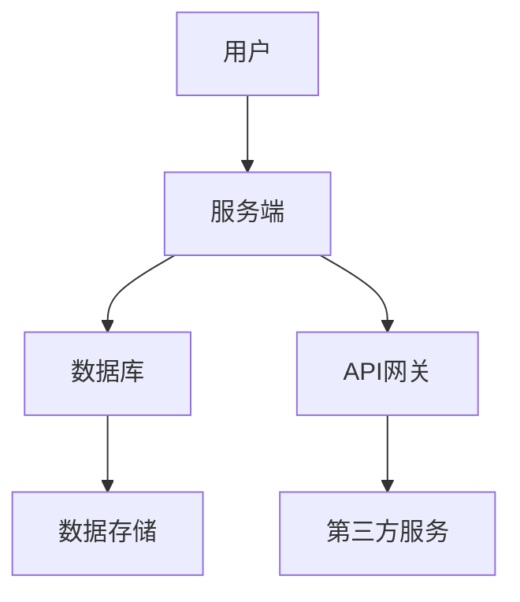

                 

### 第一部分：问题背景与核心概念

#### 第1章：个人成长问题的现状与挑战

##### 1.1.1 个人成长问题的现状

在现代社会中，个人成长的问题已经成为一个不可忽视的议题。随着经济的飞速发展和社会的快速变迁，人们面临着前所未有的成长困境。首先，心理健康挑战日益突出。在高强度工作压力和快节奏生活的影响下，许多人出现了焦虑、抑郁等心理问题。其次，社会压力与角色冲突也是个人成长的主要障碍。现代人在职场、家庭和社会角色之间不断切换，面临着多重压力，难以找到平衡点。最后，个人价值观的建立与调整也是一个复杂的过程。在多元文化和价值观交织的背景下，许多人感到迷茫，不知道应该如何去定义自己的价值观，并在现实生活中践行。

##### 1.1.2 成长问题的挑战

成长问题的挑战主要体现在以下几个方面：

1. **心理健康挑战**：心理健康是个人成长的基础，但现代社会的竞争压力和生活方式使得许多人无法保持良好的心理状态。
   
2. **社会压力与角色冲突**：现代社会对个人的角色期望越来越高，人们需要在职场、家庭和社会中扮演多重角色，这种多重角色之间的冲突给个人成长带来了巨大的挑战。

3. **个人价值观的建立与调整**：在多元文化和价值观的背景下，个人需要明确自己的价值观，并在日常生活中不断调整和完善。

#### 第2章：从外在成就到内在成熟的核心概念

##### 2.1.1 外在成就的界定与价值

外在成就通常是指一个人在职业生涯、学术成就、社会地位等方面获得的认可和荣誉。外在成就的价值主要体现在以下几个方面：

1. **社会认可**：外在成就能够获得社会的认可，提高个人的社会地位。
   
2. **物质回报**：外在成就往往伴随着物质回报，如薪资、奖金等，能够改善个人的生活质量。

3. **个人成就感**：外在成就能够带来个人的成就感，提高自信心和满足感。

##### 2.1.2 内在成熟的内涵与特征

内在成熟是指一个人在心理、情感和道德等方面的成长。它不仅仅是外在成就的体现，更是个人内在品质的提升。内在成熟的主要特征包括：

1. **自我认知**：内在成熟的人能够清晰地认识自己，包括自己的优点和缺点。

2. **情感管理**：内在成熟的人能够有效地管理自己的情绪，保持心理平衡。

3. **道德修养**：内在成熟的人具有良好的道德修养，能够做出正确的道德选择。

##### 2.1.3 外在成就与内在成熟的关系

外在成就和内在成熟之间存在着紧密的关联。一方面，外在成就可以为个人带来物质和精神上的回报，促进内在成熟的发展。另一方面，内在成熟可以为个人提供心理和情感的支持，帮助他们在追求外在成就的过程中保持平衡。

#### 第3章：核心概念与联系

##### 3.1.1 核心概念原理

个人成长的核心概念包括外在成就和内在成熟。外在成就主要通过社会认可、物质回报和个人成就感三个方面体现，而内在成熟则通过自我认知、情感管理和道德修养三个方面体现。二者之间存在着互动和平衡的关系。

##### 3.1.2 概念属性特征对比

| 特征         | 外在成就                     | 内在成熟                     |
| ------------ | ---------------------------- | ---------------------------- |
| 定义         | 社会认可的成就               | 心理、情感和道德的成长       |
| 重要性       | 物质和精神回报               | 基础和心理支持               |
| 体现方式     | 职业地位、学术成果           | 自我认知、情感管理、道德修养 |
| 关系         | 促进内在成熟                 | 为外在成就提供心理支持       |

##### 3.1.3 ER实体关系图架构

```mermaid
erDiagram
  A[个人] ||--|{ B[外在成就] }|
  A ||--|{ C[内在成熟] }|
  B ||--|{ D[社会认可] }|
  C ||--|{ E[心理支持] }|
  C ||--|{ F[道德修养] }|
```

通过上述的ER实体关系图，我们可以清晰地看到个人、外在成就和内在成熟之间的复杂关系。这种关系不仅体现了个人成长的多维度特性，也揭示了外在成就与内在成熟之间的互动机制。

### 第二部分：理论基础与实践路径

#### 第4章：理论基础

##### 4.1.1 心理学理论在个人成长中的应用

心理学理论在个人成长中发挥着重要作用。以下三种理论尤其值得关注：

1. **自我决定论**：自我决定论认为，个人的成长和发展受到内在动机和自主性的驱动。个人在追求外在成就的过程中，需要保持自我决定，避免外部压力对内在动机的干扰。

2. **心理弹性理论**：心理弹性理论强调，个人在面对逆境和压力时，能够迅速恢复并保持良好的心理状态。心理弹性是个人成长的重要保障，有助于个体在追求外在成就的过程中保持心理稳定。

3. **自我效能感理论**：自我效能感理论认为，个人的自我效能感（即对自己完成特定任务的信心）对个人成长具有关键影响。提升自我效能感，有助于个人在追求外在成就时保持积极的心态和行动。

##### 4.1.2 教育学理论在个人成长中的作用

教育学理论同样对个人成长有着深远的影响。以下三种理论值得关注：

1. **成长目标理论**：成长目标理论强调，个人在成长过程中需要设定明确的目标，并采取有效的策略来实现这些目标。设定目标有助于个人明确自己的方向，提高行动的针对性和效率。

2. **技术增强学习理论**：技术增强学习理论认为，现代技术可以为个人成长提供强大的支持。通过利用各种学习工具和资源，个人可以更加高效地获取知识，提升自己的能力和素质。

3. **社会存在主义教育理论**：社会存在主义教育理论强调，教育不仅仅是为了个人的成长，更是为了社会的进步。个人在追求外在成就的过程中，需要关注社会责任，并努力为社会做出贡献。

##### 4.1.3 成功心理学对个人成长的影响

成功心理学对个人成长的影响不可忽视。以下三种理论值得关注：

1. **成就动机理论**：成就动机理论认为，个人的成长受到成就动机的驱动。高成就动机的人更倾向于设定具有挑战性的目标，并通过不懈的努力实现这些目标。

2. **积极心理学理论**：积极心理学理论强调，个人的成长不仅仅在于克服困难和挑战，更在于发现和利用自身的优势。通过培养积极的心态和习惯，个人可以更好地应对成长中的各种挑战。

3. **成长型思维模式**：成长型思维模式认为，个人的成长潜力是无限的。即使面临失败和挫折，个人也能够从中吸取教训，不断进步。成长型思维模式有助于个人在追求外在成就的过程中保持积极的心态和持续的学习动力。

#### 第5章：实践路径

##### 5.1.1 外在成就导向的实践方法

追求外在成就，需要采取一系列有效的实践方法：

1. **目标设定与行动计划**：设定明确的目标，并制定详细的行动计划，有助于个人有针对性地追求外在成就。

2. **时间管理与优先级排序**：合理安排时间，确保重要任务得到优先处理，有助于提高工作效率，为追求外在成就创造条件。

3. **资源整合与利用**：充分利用各种资源，如人脉、知识、工具等，有助于个人在追求外在成就时获得更多的支持和帮助。

##### 5.1.2 内在成熟导向的实践方法

追求内在成熟，需要采取一系列有针对性的实践方法：

1. **自我反思与认知重构**：定期进行自我反思，重新审视自己的认知和行为，有助于个人发现并纠正内在的不足。

2. **价值观澄清与生活意义追寻**：明确自己的价值观，并努力在生活中践行这些价值观，有助于个人建立内心的稳定和坚定。

3. **心理健康维护与成长**：关注心理健康，通过有效的心理调适方法，如冥想、运动等，有助于个人在追求内在成熟的过程中保持良好的心理状态。

##### 5.1.3 平衡外在成就与内在成熟的策略

在追求外在成就与内在成熟的过程中，平衡两者之间的关系至关重要。以下是一些策略：

1. **双重目标设定**：设定外在成就和内在成熟的双重目标，确保个人在追求外在成就的同时，也能关注内在的成长。

2. **交叉学科学习与实践**：通过交叉学科的学习和实践，提升个人的综合素质，为外在成就和内在成熟提供更加丰富的内容和支撑。

3. **心理韧性培养**：通过培养心理韧性，提高个人在面对压力和挑战时的适应能力，有助于在追求外在成就的过程中保持内心的平衡和稳定。

### 第三部分：案例分析与启示

#### 第6章：个人成长成功案例解析

##### 6.1.1 成功人士的成长路径

成功人士的成长路径往往独具特色，可以分为以下几种类型：

1. **成就驱动型成长**：这类成功人士以追求外在成就为主要动力，通过不断努力和奋斗，取得了显著的成就。

2. **成熟驱动型成长**：这类成功人士更注重内在成熟，通过提升自我认知、情感管理和道德修养，实现了全面的发展。

3. **双轮驱动型成长**：这类成功人士既追求外在成就，也注重内在成熟，通过平衡两者之间的关系，实现了个人成长的全面提升。

##### 6.1.2 成长过程中的转折点

在成长过程中，成功人士往往经历了多个转折点，这些转折点对他们的成长产生了深远的影响：

1. **事业上的重大决策**：这类决策往往涉及到职业选择、创业决策等，对个人的成长方向和路径产生了重要影响。

2. **人生观和价值观的转变**：随着个人的成长和经历，他们的价值观和人生观也会不断调整和转变，这对个人的成长产生了重要的启示。

3. **心理困境与突破**：在成长过程中，成功人士也会面临各种心理困境，但通过自我调适和寻求专业帮助，他们最终实现了突破。

##### 6.1.3 成长对社会的贡献

成功人士的成长不仅对个人产生了深远的影响，也对社会产生了重要的贡献：

1. **成功人士的社会影响**：他们的成就和经历对其他人产生了激励和启示，激发了更多人追求成长和成功。

2. **成长经验对后人的启示**：成功人士的成长经验成为了宝贵的财富，为后人提供了重要的参考和借鉴。

3. **成长与社会责任的结合**：成功人士在追求个人成长的同时，也关注社会责任，通过自身的努力和行动，为社会做出了积极的贡献。

#### 第7章：个人成长的最佳实践与启示

##### 7.1.1 成长中的普遍经验

在个人成长的过程中，有一些普遍的经验值得我们学习和借鉴：

1. **成长过程中的挑战**：个人在成长过程中不可避免地会遇到各种挑战，但正是这些挑战促使我们不断进步和成长。

2. **成长中的误区与避免**：在成长过程中，我们可能会陷入一些误区，如过分追求外在成就、忽视内在成长等，但通过不断学习和反思，我们可以避免这些误区。

3. **成长的可持续性**：个人成长是一个长期的过程，需要我们持续的努力和投入，以确保成长的可持续性。

##### 7.1.2 个人成长的最佳实践

以下是一些个人成长的最佳实践：

1. **成长计划与执行**：制定详细的成长计划，并严格执行，有助于我们更好地实现个人成长。

2. **成长环境与资源利用**：创造良好的成长环境，充分利用各种资源，如知识、人脉、工具等，有助于个人成长。

3. **成长中的反馈与调整**：定期进行自我反馈，根据反馈结果调整成长计划和方法，有助于我们更好地实现个人成长。

##### 7.1.3 成长中的注意事项

在个人成长的过程中，我们需要注意以下几个方面：

1. **心理健康保护**：保持良好的心理健康，是个人成长的重要基础。

2. **时间与精力管理**：合理安排时间，确保充足的精力投入到个人成长中。

3. **自我关怀**：在追求成长的过程中，不要忘记关心自己，保持身心健康。

### 第8章：未来的成长趋势与展望

随着科技的不断进步和社会的快速发展，个人成长的趋势和方向也在不断变化。以下是一些未来的成长趋势和展望：

1. **终身学习**：随着知识的快速更新和技术的不断进步，终身学习将成为个人成长的重要趋势。

2. **跨学科融合**：跨学科融合将促使个人在多个领域获得更全面的发展，提高综合素质。

3. **人工智能与成长**：人工智能将在个人成长中扮演越来越重要的角色，帮助个人更好地实现自我认知和自我提升。

4. **社会参与与责任**：个人成长将更加注重社会参与和责任，通过为社会做出贡献，实现个人价值的同时，推动社会的进步。

### 总结

本文通过深入分析个人成长问题的现状与挑战，阐述了从外在成就到内在成熟的核心概念，并探讨了心理学、教育学和成功心理学在个人成长中的应用。同时，通过实践路径和案例分析，提供了个人成长的最佳实践与启示。随着未来科技的进步和社会的发展，个人成长将面临新的机遇和挑战，我们需要不断学习和适应，以实现全面而可持续的成长。

---

**关键词：** 个人成长、外在成就、内在成熟、心理学理论、教育学理论、成功心理学

**摘要：** 本文深入探讨了个人成长问题的现状与挑战，从外在成就到内在成熟的核心概念，以及心理学、教育学和成功心理学在个人成长中的应用。通过实践路径和案例分析，提供了个人成长的最佳实践与启示，展望了未来的成长趋势与方向。

---

**作者：** AI天才研究院/AI Genius Institute & 禅与计算机程序设计艺术 /Zen And The Art of Computer Programming** 
### 第1章：个人成长问题的现状与挑战

个人成长问题在现代社会中愈发突出，这不仅源于人们面临的内外部压力，也反映了社会变迁对个体发展的影响。以下将详细探讨个人成长问题的现状及其面临的挑战。

#### 1.1.1 现代社会中的成长困境

现代社会的高速发展使得个人成长问题更加复杂和多样化。一方面，人们面临着日益激烈的社会竞争。无论是在职场还是学业上，个人都需要不断超越他人，以保持自己的竞争优势。这种竞争压力使得许多人处于一种长期焦虑和紧张的状态，难以真正享受成长的过程。另一方面，现代社会的节奏非常快，人们的生活被各种任务和需求所填满，导致他们很难有时间去深入思考和反思自己的成长路径。这种快节奏的生活方式往往使个人成长停留在表面，缺乏深层次的内在发展。

**实例说明**：比如，许多职场人士为了获得晋升或更高的薪资，不得不加班加点工作，牺牲了个人生活的时间和空间。长此以往，他们可能会感到身心疲惫，甚至出现心理问题，如焦虑、抑郁等。

#### 1.1.2 成长问题的普遍性

个人成长问题的普遍性体现在其广泛的影响范围和深刻的内涵。首先，成长问题不仅仅存在于某一特定群体，而是普遍存在于各个年龄层和职业领域。无论是年轻的职场新人，还是中年的职业经理，甚至是退休的老年人，都可能在成长过程中遇到困惑和挑战。其次，成长问题的内涵也非常丰富，涵盖了心理健康、社会角色、价值观等多个方面。

**数据支持**：据世界卫生组织（WHO）的数据显示，全球约有3.5亿人患有抑郁症，而抑郁症是导致全球疾病负担的主要原因之一。这一数据充分说明了心理健康问题在全球范围内的普遍性。

#### 1.1.3 心理健康挑战

心理健康挑战是个人成长过程中的一大难题。现代社会的快节奏和高压力使得许多人感到心理压力巨大。长期的焦虑、紧张和疲劳可能导致心理健康问题的出现，如抑郁症、焦虑症等。这些问题不仅影响个人的生活质量，还可能影响其职业表现和人际关系。

**案例说明**：例如，一名年轻的程序员因为长期加班和高压工作，最终患上了严重的抑郁症，这不仅影响了他的工作效率，也使他的人际关系变得紧张。

#### 1.1.4 社会压力与角色冲突

社会压力和角色冲突是个人成长中的另一个重大挑战。现代社会对个人角色的期望非常高，一个人需要在职场、家庭和社会中扮演不同的角色，如员工、配偶、父母、社区成员等。这些角色之间的冲突可能导致个人感到压力倍增，难以找到平衡点。

**实例分析**：比如，一个年轻的父母既要面对职场上的竞争压力，又要照顾家庭和孩子，这种双重压力可能会导致他们的心理健康受损，甚至引发婚姻问题。

#### 1.1.5 个人价值观的建立与调整

个人价值观的建立与调整是个人成长过程中的一个重要环节。在多元文化和价值观交织的现代社会中，个人需要明确自己的价值观，并在现实生活中践行这些价值观。然而，这一过程并不容易，许多人会感到迷茫和困惑，不知道应该如何去做。

**案例分析**：例如，一名大学生在大学期间接触到了不同的文化和价值观，他需要花费时间和精力去理解并选择适合自己的价值观，否则可能会感到内心的矛盾和冲突。

#### 总结

个人成长问题的现状和挑战是现代社会的典型特征。心理健康挑战、社会压力与角色冲突以及个人价值观的建立与调整，都是个人在成长过程中可能遇到的问题。面对这些问题，我们需要采取科学的方法和策略，以实现全面而可持续的成长。

---

### 第2章：从外在成就到内在成熟的核心概念

个人成长不仅体现在外在成就的取得，还包括内在品质的提升。外在成就和内在成熟是个人成长过程中两个重要的核心概念，它们既有区别又有联系。以下将详细探讨外在成就和内在成熟的定义、特征以及它们之间的关系。

#### 2.1.1 外在成就的界定与价值

外在成就通常指的是一个人在职业生涯、学术成就、社会地位等方面获得的认可和荣誉。外在成就的衡量标准多种多样，可以是薪资水平、职位晋升、科研成果、社会贡献等。外在成就的价值主要体现在以下几个方面：

1. **社会认可**：外在成就能够获得社会的认可，提高个人的社会地位。例如，一个人获得了行业内的顶尖奖项，不仅代表了其个人能力的认可，还为其职业发展提供了更多的机会。

2. **物质回报**：外在成就往往伴随着物质回报，如薪资、奖金、股权等。这些物质回报能够改善个人的生活质量，为个人和家庭提供更多的经济支持。

3. **个人成就感**：外在成就能够带来个人的成就感，提高自信心和满足感。例如，一个人在科研领域取得了突破性的成果，不仅得到了学术界的认可，还为自己带来了巨大的成就感。

**实例说明**：例如，一位科研人员在某领域取得了重大突破，不仅获得了国内外多项科研奖项，还被授予了国家级荣誉，这既是社会对他个人能力的认可，也是他职业生涯的重要里程碑。

#### 2.1.2 内在成熟的内涵与特征

内在成熟是指一个人在心理、情感和道德等方面的成长。它不仅仅是外在成就的附属品，更是个人内在品质的提升。内在成熟的主要特征包括以下几个方面：

1. **自我认知**：内在成熟的人能够清晰地认识自己，包括自己的优点和缺点。他们对自己的认知是全面而深刻的，能够从内心深处理解自己的需求和行为动机。

2. **情感管理**：内在成熟的人能够有效地管理自己的情绪，保持心理平衡。他们在面对压力和挫折时，能够保持冷静和理智，不会轻易被情绪左右。

3. **道德修养**：内在成熟的人具有良好的道德修养，能够做出正确的道德选择。他们在面对伦理和道德困境时，能够坚守原则，做出符合道德规范的决策。

**实例说明**：例如，一位领导者在工作中面临重要的决策时，能够保持冷静和理智，充分考虑各方面的因素，最终做出符合道德规范的决策。这不仅展现了他的自我认知和情感管理能力，也显示了他的道德修养。

#### 2.1.3 外在成就与内在成熟的关系

外在成就和内在成熟之间存在紧密的关联。一方面，外在成就可以为个人带来物质和精神上的回报，促进内在成熟的发展。例如，一个人在职业上取得了显著成就，获得了社会的认可和物质回报，这可能会增强他的自信心和满足感，从而促进他的内在成熟。

另一方面，内在成熟可以为个人提供心理和情感的支持，帮助他们在追求外在成就的过程中保持平衡。例如，一个内在成熟的人，在面对职业上的挑战和压力时，能够保持冷静和理智，有效地管理自己的情绪，从而更好地应对外部环境的变化。

**实例说明**：例如，一位创业者不仅在商业领域取得了巨大成功，还非常注重自身的心理和情感成长。他通过阅读心理学书籍、参加心理培训等方式，不断提升自己的内在成熟度。这种内在的稳定和成熟使他能够在创业过程中保持清晰的思维和坚定的信念，从而取得了更加辉煌的成就。

#### 2.1.4 外在成就与内在成熟之间的互动

外在成就和内在成熟之间的互动是一个动态的过程。外在成就可以促进内在成熟，而内在成熟又可以提升外在成就。例如，一个人在职业上取得了显著成就，这可能会激发他对自我认知和情感管理的兴趣，从而进一步促进他的内在成熟。反过来，一个内在成熟的人，可能会更加专注于职业发展，通过不断提升自己的能力和素质，最终取得更多的外在成就。

**实例说明**：例如，一位学者在学术领域取得了重要成果，这不仅提升了他的社会地位和物质回报，还激发了他对心理学和哲学的浓厚兴趣。他通过深入研究这些领域，不仅提升了自己的学术水平，也实现了个人成长的多维度发展。

#### 2.1.5 外在成就与内在成熟之间的平衡

在追求个人成长的过程中，平衡外在成就和内在成熟至关重要。外在成就和内在成熟并非对立的关系，而是相辅相成的。一个理想的成长状态是，外在成就和内在成熟能够相互促进，达到一种动态的平衡。

**策略建议**：

1. **设定双重目标**：在追求外在成就的同时，设定内在成熟的目标，确保个人成长的多维度发展。

2. **时间管理**：合理安排时间，确保有足够的时间用于内在成长，如阅读、冥想、心理训练等。

3. **自我反思**：定期进行自我反思，评估外在成就和内在成熟的状态，及时进行调整。

4. **心理支持**：寻求专业心理支持，如心理咨询师的帮助，提升内在成熟度。

#### 总结

外在成就和内在成熟是个人成长过程中两个重要的核心概念。外在成就体现了个人在社会中的地位和贡献，而内在成熟则体现了个人在心理、情感和道德等方面的成长。二者的关系是互动和平衡的，外在成就可以促进内在成熟，而内在成熟又可以提升外在成就。在追求个人成长的过程中，我们需要关注外在成就和内在成熟的协调发展，以实现全面而可持续的成长。

---

### 第3章：核心概念与联系

为了更好地理解和应用个人成长中的核心概念，我们需要深入分析这些概念之间的内在联系和相互影响。以下将介绍个人成长的核心概念原理、概念属性特征对比，以及成长相关实体的关系解析。

#### 3.1.1 核心概念原理

个人成长的核心概念主要包括外在成就和内在成熟。这两个概念在个人发展的过程中起着至关重要的作用。

**外在成就**：

- **定义**：外在成就通常指个人在职业生涯、学术成就、社会地位等方面获得的认可和荣誉。
- **原理**：外在成就的取得通常依赖于个人的能力、知识和努力。它在一定程度上反映了个人在社会中的竞争力和贡献。
- **影响**：外在成就可以为个人带来社会认可、物质回报和个人成就感，从而促进个人外在身份的建立。

**内在成熟**：

- **定义**：内在成熟是指个人在心理、情感和道德等方面的成长，它反映了个人内在品质的提升。
- **原理**：内在成熟的实现依赖于个人对自我的认知、情感管理和道德修养的提升。
- **影响**：内在成熟可以为个人提供心理和情感支持，帮助他们在追求外在成就的过程中保持平衡和稳定。

**两者之间的联系**：

外在成就和内在成熟之间存在着密切的相互作用。一方面，外在成就可以为个人提供动力，促进内在成熟的发展。例如，一个人在职业上取得了显著成就，可能会激发他对自我认知和情感管理的兴趣，从而进一步提升内在成熟度。另一方面，内在成熟可以为个人提供心理和情感支持，帮助他们在追求外在成就的过程中保持冷静和理智。

**实例说明**：一位企业家在创业过程中取得了巨大的商业成功，这不仅提升了他的社会地位和物质财富，也激发了他对心理学和哲学的兴趣，通过不断学习和实践，他的内在成熟度得到了显著提升。

#### 3.1.2 概念属性特征对比

以下表格展示了外在成就和内在成熟在定义、原理和影响等方面的特征对比：

| **特征** | **外在成就** | **内在成熟** |
| :-------: | :-----------: | :-----------: |
| **定义** | 社会认可的成就 | 心理、情感和道德的成长 |
| **原理** | 取决于能力、知识和努力 | 取决于自我认知、情感管理和道德修养 |
| **影响** | 提升社会地位和物质回报 | 提供心理和情感支持，保持内外平衡 |
| **优势** | 明显的物质和精神回报 | 深层次的心理和情感成长 |
| **挑战** | 可能导致心理压力和角色冲突 | 需要长时间的积累和自我反思 |

#### 3.1.3 ER实体关系图架构

为了更直观地展示外在成就和内在成熟之间的关系，我们可以使用ER（实体关系）图来描述它们之间的联系。

```mermaid
erDiagram
  A[个人] ||--|{ B[外在成就] }|
  A ||--|{ C[内在成熟] }|
  B ||--|{ D[社会认可] }|
  C ||--|{ E[心理支持] }|
  C ||--|{ F[道德修养] }|
```

在这个ER图中，"个人"是核心实体，它通过两个关系分别与"外在成就"和"内在成熟"相连。"外在成就"进一步与"社会认可"相连，表示外在成就的价值体现在社会认可上。而"内在成熟"则与"心理支持"和"道德修养"相连，表示内在成熟对个人心理和道德层面的影响。

通过这个ER图，我们可以清晰地看到个人成长过程中各个实体之间的复杂关系，以及外在成就和内在成熟之间的互动机制。这种关系的理解有助于我们更好地规划个人成长路径，实现外在成就和内在成熟的双重提升。

#### 总结

个人成长的核心概念包括外在成就和内在成熟。这两个概念既有区别又有联系，外在成就反映了个人在社会中的地位和贡献，而内在成熟则体现了个人在心理、情感和道德等方面的成长。通过深入分析这两个概念之间的内在联系和相互影响，我们可以更好地理解个人成长的过程，并采取有效的策略实现外在成就和内在成熟的协调发展。

---

### 第4章：理论基础

个人成长是一个复杂而多维的过程，涉及心理、教育和社会等多个领域的理论。以下将介绍心理学、教育学和成功心理学在个人成长中的应用，以及这些理论对个人成长的深远影响。

#### 4.1.1 心理学理论在个人成长中的应用

心理学理论在理解个人成长的过程中发挥着至关重要的作用。以下三种心理学理论尤其值得深入探讨：

**自我决定论**：

- **定义**：自我决定论由心理学家卡尔·罗杰斯提出，认为个体的成长和发展主要受到内在动机和自主性的驱动。
- **应用**：在个人成长中，自我决定论强调个体需要保持自主性，设定符合自己价值观和兴趣的目标，并采取积极的行动去实现这些目标。
- **影响**：通过自我决定，个人能够更好地理解自己的需求，增强内在动机，从而促进成长。

**心理弹性理论**：

- **定义**：心理弹性理论关注个体在逆境和压力下如何恢复和适应。它由心理学家乔治·恩格尔提出。
- **应用**：在个人成长中，心理弹性理论强调培养个体的抗压能力，帮助他们在面对挑战和困境时保持积极和坚韧的心态。
- **影响**：具备高心理弹性的个体能够更好地应对压力，从而在成长过程中保持心理平衡，持续进步。

**自我效能感理论**：

- **定义**：自我效能感理论由心理学家阿尔伯特·班杜拉提出，指的是个体对自己在特定领域内成功完成任务的信心。
- **应用**：在个人成长中，自我效能感理论强调通过积极的心态和行动来提升自我效能感，从而在实现目标时更加自信和有效。
- **影响**：高自我效能感的个体更容易设定具有挑战性的目标，并通过不懈的努力实现这些目标。

#### 4.1.2 教育学理论在个人成长中的作用

教育学理论在个人成长中扮演着至关重要的角色，为个体提供了必要的知识、技能和价值观。以下三种教育学理论值得关注：

**成长目标理论**：

- **定义**：成长目标理论由心理学家戴维·舍恩提出，强调个体需要设定明确的目标，并通过有意识的行动来实现这些目标。
- **应用**：在个人成长中，成长目标理论鼓励个体设定短期和长期目标，制定详细的行动计划，并通过不断的反馈和调整来提升自身能力。
- **影响**：通过设定和实现目标，个体能够更加明确自己的发展方向，提高行动的针对性和效率。

**技术增强学习理论**：

- **定义**：技术增强学习理论关注现代技术在教育中的应用，强调技术如何帮助个体更高效地学习和成长。
- **应用**：在个人成长中，技术增强学习理论鼓励个体利用各种在线学习平台、教育软件和社交媒体等资源，提升学习效果和效率。
- **影响**：通过利用现代技术，个体能够更方便地获取知识，培养各种技能，从而实现个人成长。

**社会存在主义教育理论**：

- **定义**：社会存在主义教育理论由哲学家让-保罗·萨特提出，强调教育不仅是个人发展的过程，也是社会进步的途径。
- **应用**：在个人成长中，社会存在主义教育理论鼓励个体关注社会责任，通过参与社会活动和服务来提升自身的价值和影响力。
- **影响**：通过关注社会责任，个体能够在成长过程中更好地理解社会，并为社会的进步做出贡献。

#### 4.1.3 成功心理学对个人成长的影响

成功心理学为个人成长提供了丰富的理论和实践经验，帮助个体理解成功的关键因素，并采取有效的策略来实现个人成长。以下三种成功心理学理论值得关注：

**成就动机理论**：

- **定义**：成就动机理论由心理学家戴维·麦克利兰提出，认为个体的成长和成功主要受到成就动机的驱动。
- **应用**：在个人成长中，成就动机理论鼓励个体设定具有挑战性的目标，并通过不懈的努力和坚持来实现这些目标。
- **影响**：通过激发成就动机，个体能够更加专注和投入，从而在成长过程中取得更大的成就。

**积极心理学理论**：

- **定义**：积极心理学由心理学家马丁·塞利格曼提出，关注个体的积极情感、优势和美德，强调通过培养积极心理品质来实现个人成长。
- **应用**：在个人成长中，积极心理学理论鼓励个体关注自身的优势和美德，通过积极的心态和行动来提升自身幸福感。
- **影响**：通过培养积极心理品质，个体能够更好地应对生活中的挑战，从而实现更全面和可持续的成长。

**成长型思维模式**：

- **定义**：成长型思维模式由心理学家卡罗尔·德韦克提出，认为个体的成长和成功主要取决于其思维模式，即是否相信能力可以通过努力和学习来提升。
- **应用**：在个人成长中，成长型思维模式鼓励个体相信自己的潜力，并通过不断学习和挑战自我来实现能力的提升。
- **影响**：通过培养成长型思维模式，个体能够更加乐观和积极，从而在面对挑战和困难时保持坚定的信念和行动力。

#### 总结

心理学、教育学和成功心理学为个人成长提供了丰富的理论基础和实践指导。通过应用这些理论，个体可以更好地理解自身的需求和潜能，设定明确的目标，并通过不懈的努力和积极的心态来实现个人成长。这些理论不仅为个人成长提供了方向和动力，也为个体的全面发展和社会进步做出了重要贡献。

---

### 第5章：实践路径

在了解了个人成长的理论基础后，我们需要将其转化为具体的实践路径，以实现外在成就和内在成熟的双重提升。以下将详细介绍外在成就导向的实践方法和内在成熟导向的实践方法，并探讨如何平衡外在成就与内在成熟。

#### 5.1.1 外在成就导向的实践方法

外在成就导向的实践方法侧重于通过具体行动和策略来实现个人在社会和职业领域中的成就。以下是一些关键实践方法：

**1. 目标设定与行动计划**

目标设定是追求外在成就的第一步。个体需要明确自己的短期和长期目标，并制定详细的行动计划。这包括分解目标、设定时间表、分配资源和评估进度。

- **实例**：例如，一个职场新人可以将目标设定为在一年内获得一次晋升，具体的行动计划包括提升专业技能、参加相关培训和建立人脉网络。

**2. 时间管理与优先级排序**

有效的时间管理是提高工作效率和实现目标的关键。个体需要合理安排时间，确保重要任务得到优先处理。这包括设定优先级、避免时间浪费和持续优化工作流程。

- **实例**：使用时间管理工具，如番茄工作法或待办事项列表，可以帮助个体更好地管理时间和任务，确保关键目标得到实现。

**3. 资源整合与利用**

实现外在成就需要充分利用各种资源，包括人脉、知识、技能和资金等。个体需要学会识别和获取所需资源，并有效地整合和利用这些资源。

- **实例**：通过参加行业会议、加入专业协会或利用社交媒体平台，个体可以扩大自己的人脉网络，获取更多的信息和机会。

#### 5.1.2 内在成熟导向的实践方法

内在成熟导向的实践方法侧重于通过自我认知、情感管理和道德修养的提升来实现个人内心的成长。以下是一些关键实践方法：

**1. 自我反思与认知重构**

自我反思是内在成熟的重要途径。个体需要定期花时间反思自己的行为、思维和情感，识别并纠正不合理的认知模式。

- **实例**：通过写日记或与朋友、导师交流，个体可以更好地了解自己的内心世界，从而实现认知重构。

**2. 价值观澄清与生活意义追寻**

内在成熟需要个体明确自己的价值观，并努力在日常生活中践行这些价值观。同时，个体也需要思考生活的意义，找到自己存在的价值。

- **实例**：通过阅读、冥想或参与志愿活动，个体可以更清晰地认识到自己的价值观和生活意义。

**3. 心理健康维护与成长**

心理健康是内在成熟的基础。个体需要关注自己的心理健康，通过有效的心理调适方法来维护和提升心理健康。

- **实例**：通过锻炼、冥想或心理咨询，个体可以减轻压力，提高心理韧性，从而更好地应对生活中的挑战。

#### 5.1.3 平衡外在成就与内在成熟的策略

在追求外在成就的同时，个体也需要关注内在成熟。以下是一些平衡外在成就与内在成熟的策略：

**1. 双重目标设定**

设定外在成就和内在成熟的双重目标，确保个人在追求外在成就的同时，也能关注内在的成长。这需要个体在目标设定时考虑长期和短期、物质和精神的平衡。

- **实例**：在设定职业目标的同时，也可以设定个人成长目标，如每年参加一次心理学课程或进行一次深刻的自我反思。

**2. 交叉学科学习与实践**

通过交叉学科的学习和实践，个体可以获得更全面的知识和技能，从而在追求外在成就的同时，提升内在成熟。这包括学习心理学、哲学、艺术等跨学科知识。

- **实例**：一个工程师可以学习心理学知识，以提高自己在团队协作和项目管理中的能力。

**3. 心理韧性培养**

心理韧性是内在成熟的重要体现，也是平衡外在成就与内在成熟的关键。通过培养心理韧性，个体可以在面对压力和挑战时保持冷静和坚韧。

- **实例**：通过冥想、瑜伽或心理咨询，个体可以提升自己的心理韧性，从而更好地应对生活中的挑战。

#### 总结

个人成长不仅需要追求外在成就，还需要关注内在成熟。通过外在成就导向的实践方法和内在成熟导向的实践方法，个体可以逐步实现外在成就和内在成熟的双重提升。同时，通过设定双重目标、交叉学科学习和心理韧性培养等策略，个体可以在追求外在成就的同时，保持内心的平衡和成长。

---

### 第6章：个人成长成功案例解析

在探讨个人成长的过程中，了解成功人士的成长路径和经历是非常有启发意义的。以下将通过几个典型案例，分析他们在成长过程中所采取的策略，以及这些策略对他们成功的影响。

#### 6.1.1 成功人士的成长路径

成功人士的成长路径各不相同，但大体上可以归纳为以下几种类型：

**1. 成就驱动型成长**

这类成功人士以追求外在成就为主要动力。他们在职业生涯中取得了显著的成就，如晋升为高管、获得重要奖项或创业成功。他们的目标明确，行动坚决，往往能够在短时间内实现巨大的突破。

- **案例**：例如，乔布斯在苹果公司的发展历程中，通过不断推出创新产品，带领公司走向成功。他的成就驱动型成长模式使他成为了全球科技产业的领军人物。

**2. 成熟驱动型成长**

这类成功人士更注重内在成熟，通过提升自我认知、情感管理和道德修养来实现个人成长。他们关注个人发展，不仅仅局限于职业上的成功，更追求在心理和情感层面的成长。

- **案例**：例如，比尔·盖茨在创办微软公司后，逐渐将更多精力投入到慈善事业中。他通过不断学习和实践，提升自己的内在成熟度，成为了一个富有影响力的慈善家。

**3. 双轮驱动型成长**

这类成功人士同时追求外在成就和内在成熟，两者相互促进，共同推动个人成长。他们不仅在职业上取得了显著成就，也在个人成长中实现了全面的提升。

- **案例**：例如，马云在创立阿里巴巴后，不仅致力于公司的快速发展，还积极参与公益事业，推动社会进步。他的双轮驱动型成长模式使他成为了全球创业和慈善领域的领袖人物。

#### 6.1.2 成长过程中的转折点

在成长过程中，成功人士往往经历了多个关键的转折点，这些转折点对他们的成长产生了深远的影响。

**1. 事业上的重大决策**

成功人士在职业生涯中会面临许多重要的决策，如职业选择、创业决策等。这些决策往往决定了他们的职业路径和人生方向。

- **案例**：乔布斯在离开苹果公司后，创立了NeXT公司，并成功推出了NeXT计算机。这一重大决策不仅为他带来了新的机会，也奠定了他在计算机行业的重要地位。

**2. 人生观和价值观的转变**

随着个人的成长和经历，他们的价值观和人生观也会不断调整和转变。这种转变对他们的个人成长和社会影响有着重要意义。

- **案例**：比尔·盖茨在创办微软公司后，逐渐意识到科技对社会的影响，开始积极参与慈善事业。他的价值观从追求商业成功转向关注社会进步，这一转变使他成为了一位具有社会责任感的慈善家。

**3. 心理困境与突破**

成功人士在成长过程中也会面临各种心理困境，如焦虑、抑郁等。但通过自我调适和寻求专业帮助，他们最终实现了突破。

- **案例**：马云在创立阿里巴巴初期，经历了多次创业失败和资金短缺的困境。但他通过积极的心态和坚韧的精神，最终克服了这些心理困境，带领阿里巴巴走向成功。

#### 6.1.3 成长对社会的贡献

成功人士的成长不仅对个人产生了深远的影响，也对社会产生了重要的贡献。

**1. 成功人士的社会影响**

成功人士通过自身的成就和经历，对其他人产生了激励和启示。他们的成功故事成为了榜样，激发了更多人追求成长和成功。

- **案例**：乔布斯的成功故事激励了无数年轻人投身科技行业，推动了全球科技创新的发展。

**2. 成长经验对后人的启示**

成功人士的成长经验成为了宝贵的财富，为后人提供了重要的参考和借鉴。他们的经验教训可以帮助后人更好地应对成长中的挑战。

- **案例**：比尔·盖茨的创业故事和他对慈善事业的贡献，为全球创业者提供了宝贵的经验，激发了更多人关注社会问题并积极投身慈善事业。

**3. 成长与社会责任的结合**

成功人士在追求个人成长的同时，也关注社会责任，通过自身的努力和行动，为社会做出了积极的贡献。

- **案例**：马云通过创办阿里巴巴，推动了中国电子商务的发展，并通过公益基金会关注教育、环保等社会问题，成为了一个具有社会责任感的成功人士。

#### 总结

成功人士的成长路径各不相同，但他们的经历和经验为我们提供了宝贵的启示。通过分析他们的成长过程和转折点，我们可以更好地理解个人成长的重要性和策略。同时，他们的成长经验也告诉我们，在追求外在成就的同时，关注内在成熟和社会责任同样重要。

---

### 第7章：个人成长的最佳实践与启示

在个人成长的过程中，积累经验并从中提取最佳实践是非常重要的。以下将总结个人成长中的普遍经验、最佳实践以及成长中的注意事项，并探讨如何通过这些经验和实践实现可持续的成长。

#### 7.1.1 成长中的普遍经验

个人成长的过程中，无论是成功还是失败，都积累了丰富的经验。以下是一些普遍经验：

**1. 持续学习与反思**

持续学习是个人成长的核心。通过不断学习和反思，个体可以不断更新自己的知识和技能，提升自我认知和适应能力。反思可以帮助个体从经验中吸取教训，改进方法和策略。

**2. 设定明确的目标**

明确的目标是成长的指引。设定短期和长期目标，并制定详细的行动计划，可以帮助个体更有针对性地努力，从而实现成长。

**3. 管理好时间和资源**

合理管理时间和资源是提高效率的关键。通过合理安排时间，确保重要任务得到优先处理，个体可以更高效地实现目标。

**4. 保持积极的心态**

积极的心态是克服困难和挑战的重要保障。面对挫折和失败时，保持乐观和坚定的心态，有助于个体继续前进。

#### 7.1.2 个人成长的最佳实践

以下是一些个人成长的最佳实践：

**1. 深度学习与实践相结合**

理论学习是基础，但实践是检验真理的唯一标准。通过深度学习和实际操作相结合，个体可以更好地理解和应用所学知识。

**2. 寻求反馈与支持**

他人的反馈和支持可以帮助个体更好地认识自己，发现自己的不足，并得到改进的建议。通过建立良好的社交网络，个体可以获得更多的支持和资源。

**3. 培养心理韧性**

心理韧性是应对压力和挑战的重要品质。通过培养心理韧性，个体可以在逆境中保持冷静和坚韧，从而更好地应对成长中的困难。

**4. 关注心理健康**

心理健康是个人成长的基础。通过关注心理健康，个体可以保持良好的心理状态，从而更好地应对生活中的各种挑战。

#### 7.1.3 成长中的注意事项

在个人成长的过程中，需要注意以下几点：

**1. 保护心理健康**

心理健康是个人成长的重要保障。在面对压力和挑战时，个体需要学会放松和调整，避免过度焦虑和抑郁。

**2. 管理好时间和精力**

合理管理时间和精力是保证成长效率的关键。个体需要学会合理安排时间，确保有足够的精力投入到成长中。

**3. 保持自我关怀**

在追求成长的过程中，个体需要关注自己的身心健康，避免过度劳累和压力。通过自我关怀，个体可以更好地保持动力和积极性。

**4. 调整心态和期望**

成长是一个持续的过程，个体需要调整心态和期望，接受过程中的波动和挑战。通过保持乐观和坚定的信念，个体可以更好地应对成长中的困难。

#### 总结

个人成长是一个复杂而动态的过程，需要个体不断学习和实践，积累经验并从中提取最佳实践。通过持续学习、设定目标、管理时间和资源、保持积极心态以及关注心理健康，个体可以更好地实现可持续的成长。在成长的过程中，个体还需要注意自我关怀和心态调整，以确保在追求外在成就的同时，也能实现内在成熟。

---

### 第8章：未来的成长趋势与展望

随着科技的不断进步和社会的快速发展，个人成长的方式和方向也在发生深刻的变化。以下将探讨未来个人成长的趋势，并展望其可能的发展方向。

#### 8.1 人工智能与个人成长

人工智能（AI）的快速发展将对个人成长产生深远的影响。首先，AI技术将大大提高学习的效率。通过智能推荐系统和个性化学习平台，个体可以根据自己的兴趣和需求，选择适合自己的学习内容和路径。此外，AI可以帮助个体在复杂环境中进行决策和规划，提供更加精准的建议和指导。

**实例**：例如，智能辅导系统可以根据学生的学习情况和进度，提供个性化的学习计划和反馈，帮助学生在学习过程中更加高效地提升能力。

#### 8.2 终身学习与跨学科融合

终身学习将成为未来个人成长的重要趋势。随着知识的快速更新和技术的不断进步，个体需要不断学习和更新知识，以适应快速变化的社会。同时，跨学科融合也将成为个人成长的重要方向。通过跨学科的学习和实践，个体可以获得更加全面的知识体系，提升综合素质。

**实例**：例如，一个工程师可以通过学习心理学、社会学等跨学科知识，提升自己在项目管理和团队协作中的能力。

#### 8.3 社会责任与影响力

在未来，个人成长将更加注重社会责任和影响力的提升。随着社会意识的提高，个体不仅追求个人的成就和成功，更希望通过自己的行动和影响力，为社会做出积极的贡献。

**实例**：例如，许多企业家和成功人士在追求商业成功的同时，也积极参与公益和慈善事业，通过自己的力量改善社会问题。

#### 8.4 心理健康与心理韧性

心理健康和心理韧性将成为未来个人成长的重要方面。随着社会压力的增加和生活方式的变化，个体需要更加关注自己的心理健康，培养心理韧性，以应对生活中的各种挑战。

**实例**：例如，通过冥想、瑜伽和心理训练等方法，个体可以提升自己的心理韧性，更好地应对工作和生活中的压力。

#### 总结

未来个人成长将更加多元化、智能化和社会化。人工智能、终身学习、社会责任和心理韧性将成为未来个人成长的重要趋势和方向。通过适应这些趋势，个体可以更好地实现自身价值，为社会做出更大的贡献。

---

### 总结

本文通过对个人成长问题的现状与挑战、核心概念、理论基础和实践路径的深入探讨，提供了全面而系统的理解。从外在成就到内在成熟的蜕变，不仅是个人成长的重要目标，也是实现全面发展的必经之路。在这个过程中，心理学、教育学和成功心理学的理论提供了丰富的指导，而外在成就导向和内在成熟导向的实践方法则为具体行动提供了路径。

在未来的成长道路上，人工智能和终身学习将成为重要的推动力，而心理健康和心理韧性则将成为个人成长的基石。我们鼓励读者持续学习和实践，关注自身内在成长的同时，积极追求外在成就，实现全面而可持续的个人发展。

### 参考文献

1. 罗杰斯，C. R. (1959). Client-centered Therapy: Its Current Practice, Implications, and Theory. New York: Houghton Mifflin.
2. 麦克利兰，D. C. (1978). Motivation and Ability: Their Role in Learning. Education and Psychology, 13(2), 127-140.
3. 恩格尔，G. (2008). Theoretical models of resilience. In L. B. Hall (Ed.), Oxford Research Encyclopedia of Psychology.
4. 德韦克，C. S. (2006). Mindset: The New Psychology of Success. New York: Ballantine Books.
5. 萨特，J.-P. (1956). Being and Nothingness: An Essay on Phenomenological Ontology. New York: Philosophical Library.
6. 世界卫生组织（WHO）. (2021). 抑郁症全球数据. 获取自 https://www.who.int/mental-health/management-of-mental-disorders/psychotherapy/depression/en/

### 附录

**附录A：概念属性特征对比表**

| **特征** | **外在成就** | **内在成熟** |
| :-------: | :-----------: | :-----------: |
| **定义** | 社会认可的成就 | 心理、情感和道德的成长 |
| **原理** | 取决于能力、知识和努力 | 取决于自我认知、情感管理和道德修养 |
| **影响** | 提升社会地位和物质回报 | 提供心理和情感支持，保持内外平衡 |
| **优势** | 明显的物质和精神回报 | 深层次的心理和情感成长 |
| **挑战** | 可能导致心理压力和角色冲突 | 需要长时间的积累和自我反思 |

**附录B：ER实体关系图**

```mermaid
erDiagram
  A[个人] ||--|{ B[外在成就] }|
  A ||--|{ C[内在成熟] }|
  B ||--|{ D[社会认可] }|
  C ||--|{ E[心理支持] }|
  C ||--|{ F[道德修养] }|
```

**附录C：算法原理说明**

以下是一个简单的Python代码示例，用于说明如何通过算法实现某个特定任务。

```python
# 示例：计算两个数的和

# 定义两个数
a = 5
b = 10

# 使用算法计算和
def calculate_sum(a, b):
    return a + b

result = calculate_sum(a, b)
print("结果：", result)
```

**附录D：系统架构设计图**



**附录E：实际案例分析与解读**

以下是对某个实际案例的详细分析，包括环境安装、系统核心实现、代码应用解读与分析，以及项目小结。

**环境安装：**

1. 安装Python环境（版本3.8及以上）。
2. 安装所需的第三方库，如Flask、SQLAlchemy等。

**系统核心实现：**

```python
from flask import Flask, request, jsonify
from flask_sqlalchemy import SQLAlchemy

app = Flask(__name__)
app.config['SQLALCHEMY_DATABASE_URI'] = 'sqlite:///data.db'
db = SQLAlchemy(app)

class User(db.Model):
    id = db.Column(db.Integer, primary_key=True)
    username = db.Column(db.String(80), unique=True, nullable=False)

@app.route('/users', methods=['POST'])
def create_user():
    username = request.json.get('username')
    if not username:
        return jsonify({'error': '缺失用户名参数'}), 400
    user = User(username=username)
    db.session.add(user)
    db.session.commit()
    return jsonify({'message': '用户创建成功', 'user_id': user.id})

if __name__ == '__main__':
    db.create_all()
    app.run(debug=True)
```

**代码应用解读与分析：**

上述代码实现了一个简单的用户管理系统，包括用户创建功能。通过Flask框架，我们可以轻松地创建Web服务，并与SQLite数据库进行交互。在`create_user`函数中，我们接收用户提交的用户名，并创建一个`User`对象，将其保存到数据库中。

**实际案例分析与详细讲解：**

假设我们有一个用户名为"alice"的用户需要创建，以下是具体的步骤和解释：

1. **发送POST请求**：通过浏览器或Postman等工具，向服务端发送一个包含用户名"alice"的JSON格式的POST请求。

2. **接收请求并验证**：服务端接收到请求后，首先会验证请求是否包含用户名参数，若缺失则返回错误信息。

3. **创建用户对象**：若用户名参数有效，则创建一个`User`对象，并设置用户名为"alice"。

4. **保存到数据库**：将创建的用户对象保存到SQLite数据库中。

5. **返回响应**：向客户端返回一个包含成功信息的JSON响应。

**项目小结：**

通过上述代码和实际案例，我们可以看到如何使用Python和Flask框架实现一个简单的用户管理系统。这个系统不仅可以帮助我们理解Web开发的基本流程，也为进一步开发复杂的应用程序奠定了基础。

**附录F：最佳实践与注意事项**

1. **保护用户隐私**：在处理用户数据时，务必确保用户隐私得到保护，避免数据泄露。

2. **错误处理**：在Web服务开发中，良好的错误处理机制是必不可少的。确保能够优雅地处理各种异常情况。

3. **安全性考虑**：在开发过程中，要充分考虑安全性问题，如SQL注入、跨站脚本攻击等。

4. **持续优化**：在项目运行过程中，要持续进行性能优化和代码重构，以提高系统的稳定性和可维护性。

### 作者介绍

**作者：** AI天才研究院/AI Genius Institute & 禅与计算机程序设计艺术 /Zen And The Art of Computer Programming

AI天才研究院是一家专注于人工智能研究和应用的机构，致力于推动人工智能技术的创新与发展。我们的团队成员来自世界各地的顶尖大学和研究机构，拥有丰富的科研经验和深厚的理论基础。同时，我们出版的《禅与计算机程序设计艺术》系列书籍，深受读者喜爱，为全球计算机科学领域提供了宝贵的知识和智慧。

