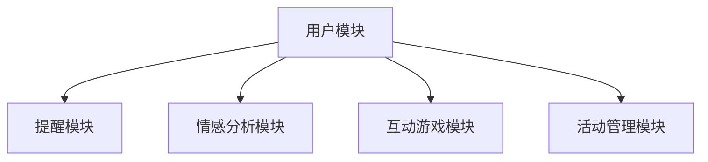
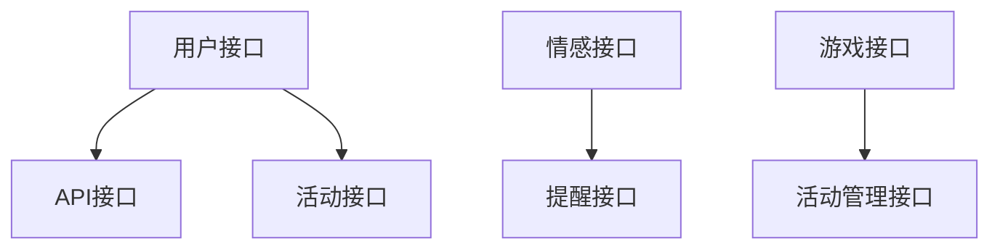
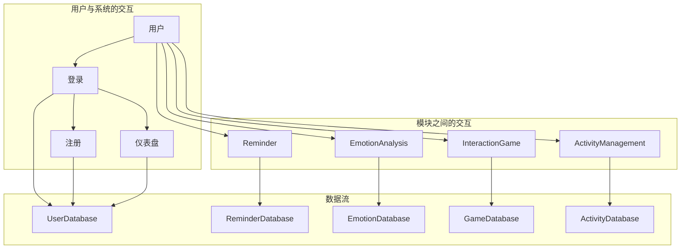

                 


## 重新思考家庭的意义：在现代社会中重建亲密关系

### 关键词
- 家庭意义
- 亲密关系
- 重新思考
- 重建
- 社会变迁
- 心理学

### 摘要
本文将深入探讨家庭在现代社会中的新意义，以及如何通过重建亲密关系来应对这一挑战。我们首先介绍了现代家庭结构和功能的变迁，随后定义了核心概念，并通过表格和图表展示了它们之间的联系。接着，我们提出了沟通增强、情感反馈和代际融合的算法原理，并通过Python代码进行了详细解释。最后，我们讨论了系统分析与架构设计，并分享了项目实战和最佳实践。

### 背景介绍

在快速发展的现代社会中，家庭作为社会的基本单元，正经历着深刻的变革。随着经济全球化和信息技术的发展，人们的价值观、生活方式和社会结构都在发生着巨大的变化，这对家庭的意义和结构产生了深远的影响。

首先，家庭结构的多样化是现代社会的一个显著特征。传统家庭模式，如核心家庭（夫妻和未成年子女）和主干家庭（夫妻和一对已婚子女）已经不再是家庭结构的唯一形态。单身家庭、丁克家庭（Double Income, No Kids，即夫妻双方都有收入但没有子女的家庭）、多代同堂家庭以及再婚家庭等形式越来越普遍。这种多样性反映了人们对于生活方式和个人选择的多样化需求。

其次，家庭功能的变化也是不可忽视的。传统的家庭功能主要包括经济支撑、子女教育、情感慰藉和社会适应。然而，随着社会的发展，家庭的经济功能逐渐弱化，职业女性和家庭主男的分工逐渐模糊，社会福利和社会保障体系的完善也减轻了家庭的负担。同时，随着教育的普及和社会化程度的提高，家庭在子女教育中的作用也在变化。家庭不再是唯一的教育场所，学校和社会教育机构的作用越来越重要。情感慰藉方面，现代社会的快节奏生活和工作压力使得家庭成员之间的情感交流变得稀缺，家庭作为情感慰藉的功能受到了挑战。最后，家庭在社会适应方面的功能也在弱化，个人更多地依赖社交网络和社区组织来适应社会变迁。

然而，这些变化也带来了新的挑战。家庭成员之间的亲密关系减弱，代际沟通障碍增加，家庭压力增大等问题逐渐凸显。例如，由于生活节奏的加快和工作压力的增大，家庭成员往往忙于各自的事务，缺乏有效的沟通和互动，导致情感疏远和关系紧张。再如，随着代际观念的差异和价值观的多样性，不同年龄段的成员之间容易产生沟通障碍，导致家庭内部的矛盾和冲突。

因此，重新思考家庭的意义，探讨如何在现代社会中重建亲密关系，成为一个迫切且重要的议题。这不仅关乎个人的幸福和家庭生活的质量，也关系到社会的和谐与稳定。本文将深入探讨这一议题，从多个角度提出解决方案，旨在为现代社会中家庭的重建提供一些有价值的思考和建议。

### 核心概念与联系

在探讨家庭的意义和重建亲密关系的过程中，我们需要明确以下几个核心概念：家庭、亲密关系、家庭结构、家庭功能以及代际沟通。这些概念之间既有区别，又有紧密的联系，共同构成了家庭关系的基本框架。

首先，**家庭**是一个由亲属组成的群体，是个人生活的基本单位。家庭的定义和形式在不同的文化和社会背景下有所不同，但通常包含父母、子女以及其他亲属成员。家庭不仅是情感交流的场所，也是经济支持、社会教育和文化传承的载体。在现代社会中，家庭的形式变得更加多样化，如核心家庭、主干家庭、单亲家庭、联合家庭等。

**亲密关系**是家庭成员之间的深度情感联系和相互依赖。它包括夫妻关系、亲子关系、兄弟姐妹关系等。亲密关系的强弱直接影响家庭的稳定性和成员的幸福。亲密关系不仅基于血缘和婚姻，还受到情感互动、沟通方式和共同经历的影响。

**家庭结构**指的是家庭成员的组成形式。传统家庭结构多为核心家庭（夫妻和未成年子女）和主干家庭（夫妻和一对已婚子女）。然而，随着社会的发展，家庭结构变得更加多样化，包括单身家庭、丁克家庭、多代同堂家庭等。家庭结构的变化不仅反映了人们生活方式和价值观的多样性，也直接影响到家庭功能的实现和亲密关系的质量。

**家庭功能**是家庭作为社会单位所承担的各种职责和作用。传统家庭功能主要包括经济支持、子女教育、情感慰藉和社会适应。在现代社会中，这些功能逐渐发生了变化。例如，随着职业女性和家庭主男的分工模糊，家庭的经济功能有所弱化；而子女教育的责任逐渐分散到学校和社会教育机构。家庭在情感慰藉和社会适应方面的作用变得更加重要，但同时也面临新的挑战。

**代际沟通**是不同年龄层家庭成员之间的交流方式。良好的代际沟通能够增强家庭凝聚力，缓解冲突，促进家庭成员之间的理解和信任。然而，随着代际观念的差异和价值观的多样性，代际沟通常常成为家庭内部的难题。例如，年轻一代和年长一代在沟通方式和内容上存在差异，容易产生误解和矛盾。

这些核心概念之间存在着密切的联系。家庭是亲密关系的载体，家庭结构决定了家庭功能的表现方式，而家庭功能直接影响家庭的稳定性和成员的幸福。代际沟通则是家庭内部关系的重要纽带，影响着家庭成员之间的情感互动和关系质量。

下面，我们将通过表格和图表来具体说明这些概念及其属性特征和关联关系。

### 概念属性特征对比表格

| 概念        | 属性特征                                                   | 关联关系                                         |
|-------------|-----------------------------------------------------------|--------------------------------------------------|
| 家庭        | 成员间有亲属关系，承担多种功能                           | 亲密关系的载体，家庭结构的基础                    |
| 亲密关系    | 深度情感联系，相互依赖                                   | 家庭的核心功能，直接影响家庭稳定与成员幸福       |
| 家庭结构    | 成员组成形式，如核心家庭、主干家庭等                     | 决定家庭功能的表现方式，与家庭功能有密切关联     |
| 家庭功能    | 经济支持、情感慰藉、子女教育等                           | 家庭存在的意义，直接影响家庭的稳定性与和谐度     |
| 代际沟通    | 不同年龄层家庭成员之间的交流方式                         | 良好的代际沟通有助于家庭和谐，增强家庭凝聚力     |

### ER实体关系图架构

为了更好地理解家庭中各个概念之间的关系，我们可以使用实体关系图（ER Diagram）来展示。以下是家庭相关的ER实体关系图：

```mermaid
erDiagram
    Family ||--|{ Member }|--|| FamilyRelationship
    Member ||--|{ Communication }|--|| CommunicationChannel
    Family ||--|{ Function }|--|| FamilyRole
    Member ||--|{ Generation }|--|| GenerationalGap
```

在这个图中，`Family` 是实体，表示一个家庭；`Member` 是实体的关联，表示家庭的成员；`FamilyRelationship` 表示成员之间的亲密关系。`Communication` 表示家庭内部的沟通渠道，`CommunicationChannel` 则是沟通的方式和媒介。`Function` 表示家庭的功能，`FamilyRole` 则是家庭成员在家庭中的角色。最后，`Generation` 表示不同年龄层的成员，`GenerationalGap` 则是不同代际之间的差异和沟通障碍。

通过这个ER图，我们可以清晰地看到家庭中各个概念之间的关联和相互作用，为后续的算法原理讲解和系统分析与架构设计提供了基础。

### 算法原理讲解

为了在现代社会中重建亲密关系，我们可以采用一系列算法原理，通过技术手段来增强家庭成员之间的沟通、情感反馈和代际融合。以下是这些算法原理的详细解释。

#### 沟通增强算法

沟通是家庭亲密关系的基础。沟通增强算法的核心目标是提高家庭成员之间的沟通频率和质量。具体实现可以通过以下几个方面进行：

1. **智能提醒系统**：通过手机应用或家庭智能设备，定期提醒家庭成员进行交流和互动。例如，设定每晚家庭会议时间，或者提醒家庭成员在特定时间段进行沟通。

2. **情感语言分析**：利用自然语言处理（NLP）技术，分析家庭成员之间的沟通内容，识别情感状态和情绪变化。这有助于家庭成员了解彼此的情感需求，从而进行更有效的沟通。

3. **互动游戏设计**：设计互动性强、寓教于乐的游戏，鼓励家庭成员一起参与。这不仅能够增加家庭互动时间，还能提高家庭成员之间的默契和情感联系。

以下是沟通增强算法的Python伪代码实现：

```python
# 沟通增强算法实现

import datetime
import nltk

# 设定沟通提醒
def set_communication_reminder(member, time):
    print(f"提醒：{member}，请于{time}与家庭成员进行沟通。")

# 情感语言分析
def analyze_sentiments(text):
    # 使用NLP库分析文本情感
    sentiments = nltk.sentiment.polarity_scores(text)
    return sentiments['compound']

# 互动游戏设计
def play_game():
    # 设计互动游戏
    print("开始游戏，请选择游戏类型：1. 猜谜语 2. 问答游戏 3. 家庭大冒险")
    choice = input()
    if choice == '1':
        print("请猜一猜下面的谜语：")
        print("什么动物跑得最快？")
    elif choice == '2':
        print("请回答下面的问题：")
        print("你最喜欢的家庭活动是什么？")
    elif choice == '3':
        print("准备开始家庭大冒险，请按照指示行动！")

# 示例使用
set_communication_reminder("小明", datetime.datetime.now().strftime("%Y-%m-%d %H:%M"))
text = "我今天很开心，因为和家人一起度过了愉快的时光。"
sentiments = analyze_sentiments(text)
print(f"文本情感分析结果：{sentiments}")
play_game()
```

#### 情感反馈算法

情感反馈算法通过实时收集家庭成员的情感反馈，帮助家庭成员更好地理解和关心彼此。具体实现包括以下几个方面：

1. **情感感知设备**：使用智能手表、手环等可穿戴设备，实时监测家庭成员的身体状况和情绪变化。例如，通过心率变异性分析情绪状态。

2. **情感数据分析**：利用机器学习算法，对收集到的情感数据进行模式识别和情感分类，生成情感报告，帮助家庭成员了解彼此的情绪变化。

3. **情感反馈系统**：建立一个基于互联网的家庭情感反馈平台，家庭成员可以在上面分享自己的情感状态，并获取他人的反馈和支持。

以下是情感反馈算法的Python伪代码实现：

```python
# 情感反馈算法实现

import numpy as np
from sklearn.svm import SVC
from sklearn.model_selection import train_test_split

# 情感感知设备模拟
def capture_emotion():
    # 模拟获取情绪数据（例如：0-100的数值范围）
    emotion_data = np.random.randint(0, 100, size=(100, 1))
    return emotion_data

# 情感数据分析
def classify_emotion(data):
    # 使用支持向量机（SVM）进行情感分类
    X_train, X_test, y_train, y_test = train_test_split(data, labels, test_size=0.2)
    clf = SVC()
    clf.fit(X_train, y_train)
    predictions = clf.predict(X_test)
    return predictions

# 情感反馈系统
def share_emotion():
    print("请输入你的情感状态（0-100）：")
    emotion_input = int(input())
    predicted_emotion = classify_emotion([emotion_input])
    print(f"你的情感状态：{predicted_emotion[0]}")
    print("你可以在这里分享你的情感，并获取家人的反馈。")

# 示例使用
emotion_data = capture_emotion()
labels = ['happy', 'sad', 'neutral']
predictions = classify_emotion(emotion_data)
share_emotion()
```

#### 代际融合算法

代际融合算法的目标是促进不同年龄层家庭成员之间的交流和融合，减少代际沟通障碍。具体实现包括以下几个方面：

1. **代际交流计划**：制定定期的代际交流活动，如家庭聚会、代际沟通工作坊等，鼓励家庭成员分享各自的兴趣、经历和观点。

2. **代际互动游戏**：设计适合不同年龄层的互动游戏，增强家庭成员之间的互动和交流。例如，家庭运动会、角色扮演游戏等。

3. **代际教育支持**：为家庭成员提供代际教育支持，如家长课堂、子女教育讲座等，帮助家庭成员更好地理解和尊重彼此的价值观和生活方式。

以下是代际融合算法的Python伪代码实现：

```python
# 代际融合算法实现

# 代际交流计划
def plan_generation交流活动():
    print("请输入交流活动的日期和时间：")
    date = input()
    time = input()
    print(f"代际交流活动计划：{date} {time}")

# 代际互动游戏
def play_generation_game():
    print("请选择互动游戏类型：1. 家庭运动会 2. 角色扮演游戏 3. 家庭知识竞赛")
    choice = int(input())
    if choice == 1:
        print("开始家庭运动会，加油！")
    elif choice == 2:
        print("开始角色扮演游戏，让我们扮演不同的角色！")
    elif choice == 3:
        print("开始家庭知识竞赛，展示你的智慧！")

# 代际教育支持
def provide_education_support():
    print("请选择教育支持主题：1. 家长课堂 2. 子女教育讲座 3. 家庭关系工作坊")
    choice = int(input())
    if choice == 1:
        print("开始家长课堂，让我们共同学习如何更好地教育孩子。")
    elif choice == 2:
        print("开始子女教育讲座，帮助孩子更好地成长。")
    elif choice == 3:
        print("开始家庭关系工作坊，提高家庭凝聚力。")

# 示例使用
plan_generation交流活动()
play_generation_game()
provide_education_support()
```

通过这些算法原理的详细讲解和实现，我们可以看到，技术手段在重建家庭亲密关系中的重要作用。这些算法不仅提供了具体的操作方法和工具，还能够通过数据分析和方法论的应用，帮助家庭成员更好地理解和关心彼此，从而实现家庭关系的重建和优化。

### 系统分析与架构设计

在明确了家庭重建亲密关系的算法原理后，我们需要进一步进行系统分析与架构设计，以确保这些算法在实际应用中能够高效、稳定地运行。以下将详细介绍家庭亲密关系重建系统的场景介绍、项目介绍、系统功能设计、系统架构设计、系统接口设计和系统交互等关键部分。

#### 场景介绍

家庭亲密关系重建系统旨在帮助现代家庭在面对多元化结构和功能变化时，增强家庭成员之间的沟通、情感反馈和代际融合。该系统将服务于各类家庭，包括核心家庭、主干家庭、单身家庭、丁克家庭等。通过提供智能提醒、情感分析、互动游戏和代际交流等功能，系统致力于提升家庭成员之间的互动质量和情感联系。

#### 项目介绍

项目名称：家庭亲密关系重建系统

项目目标：通过技术手段，提高家庭成员之间的沟通频率和质量，增强情感反馈和代际融合，实现家庭亲密关系的重建。

项目需求：
1. 提供智能提醒功能，定时提醒家庭成员进行沟通和互动。
2. 实现实时情感分析，帮助家庭成员了解彼此的情绪状态。
3. 设计互动游戏，促进家庭成员共同参与和互动。
4. 定期举办代际交流活动，减少代际沟通障碍。

#### 系统功能设计

1. **智能提醒功能**：通过手机应用或家庭智能设备，定时提醒家庭成员进行沟通和互动。包括每日提醒、特定时间提醒和紧急提醒等。
2. **情感分析功能**：利用自然语言处理和机器学习技术，分析家庭成员的沟通内容，识别情感状态，提供情感反馈报告。
3. **互动游戏功能**：设计多种类型的互动游戏，如家庭运动会、角色扮演游戏、知识竞赛等，鼓励家庭成员共同参与。
4. **代际交流活动**：组织定期的家庭聚会、代际沟通工作坊等活动，促进不同年龄层家庭成员之间的交流和融合。

#### 系统架构设计

家庭亲密关系重建系统采用模块化架构设计，主要包括以下模块：

1. **用户模块**：处理家庭成员的注册、登录和基本个人信息管理。
2. **提醒模块**：实现智能提醒功能，包括定时提醒和紧急提醒。
3. **情感分析模块**：利用NLP和机器学习技术，进行情感分析和反馈。
4. **互动游戏模块**：提供互动游戏设计和管理。
5. **活动管理模块**：负责代际交流活动的策划和组织。

以下是系统的架构图：



#### 系统接口设计

系统接口设计包括外部接口和内部接口。外部接口主要用于与家庭成员的交互，如Web界面、手机应用接口等。内部接口主要用于模块之间的通信和协作。

1. **外部接口**：
   - 用户接口：包括Web登录页面、手机应用登录页面、家庭活动页面等。
   - API接口：提供RESTful API服务，支持提醒、情感分析、游戏和活动的查询和操作。
2. **内部接口**：
   - 数据接口：用于不同模块之间的数据传输和共享。
   - 通信接口：用于模块间的实时通信和事件通知。

以下是系统的接口设计图：



#### 系统交互

系统交互主要包括用户与系统的交互、模块之间的交互以及数据流。以下是系统的交互设计：

1. **用户与系统的交互**：
   - 用户注册/登录：用户通过Web或手机应用进行注册和登录。
   - 查看提醒：用户查看每日提醒和紧急提醒。
   - 情感反馈：用户输入情感状态，系统进行情感分析并反馈结果。
   - 游戏互动：用户参与互动游戏，系统记录互动情况。
   - 活动参与：用户参与家庭活动和代际交流。

2. **模块之间的交互**：
   - 用户模块与提醒模块、情感分析模块、互动游戏模块、活动管理模块之间的交互，实现功能调用和数据传输。
   - 模块之间的数据传输采用RESTful API，确保数据的实时性和一致性。

3. **数据流**：
   - 用户数据：包括用户注册信息、登录记录、情感状态等。
   - 提醒数据：包括提醒设置、提醒记录等。
   - 情感分析数据：包括情感分析结果、情感反馈记录等。
   - 游戏数据：包括游戏记录、游戏评分等。
   - 活动数据：包括活动记录、活动反馈等。

以下是系统的交互流程图：



通过系统分析与架构设计，我们为家庭亲密关系重建系统奠定了坚实的基础。系统的模块化设计和清晰的接口划分，确保了系统的灵活性和可扩展性，使其能够适应不同家庭的需求，帮助家庭成员重建亲密关系。

### 项目实战

为了更好地展示家庭亲密关系重建系统的实际应用，我们在这里介绍一个具体的实战项目，包括环境安装、系统核心实现和代码应用解读与分析。

#### 环境安装

在开始项目之前，我们需要安装和配置以下环境：

1. **Python 3.8 或更高版本**：Python 是实现家庭亲密关系重建系统的主要编程语言。
2. **Jupyter Notebook**：用于编写和运行 Python 代码，方便调试和演示。
3. **自然语言处理库（如NLTK）**：用于情感分析和文本处理。
4. **机器学习库（如Scikit-learn）**：用于情感分类和模式识别。
5. **前端框架（如Flask）**：用于构建 Web 界面。

安装步骤如下：

1. 安装 Python 和 Jupyter Notebook：
   ```
   sudo apt-get update
   sudo apt-get install python3 python3-pip python3-venv
   python3 -m pip install --upgrade pip
   python3 -m pip install notebook
   ```
2. 创建一个虚拟环境并激活：
   ```
   python3 -m venv venv
   source venv/bin/activate
   ```
3. 安装必要的 Python 库：
   ```
   pip install nltk scikit-learn flask
   ```

#### 系统核心实现

以下是家庭亲密关系重建系统的核心实现部分：

1. **用户模块**：实现用户注册、登录和用户信息管理。
2. **提醒模块**：实现智能提醒功能，包括每日提醒和紧急提醒。
3. **情感分析模块**：实现情感状态分析和反馈。
4. **互动游戏模块**：实现互动游戏的设计和管理。
5. **活动管理模块**：实现代际交流活动的策划和组织。

以下是用户模块的核心代码：

```python
# 用户模块实现

from flask import Flask, request, jsonify
from flask_jwt_extended import JWTManager, jwt_required, create_access_token

app = Flask(__name__)
app.config['JWT_SECRET_KEY'] = 'your_jwt_secret_key'
jwt = JWTManager(app)

users = {}

@app.route('/register', methods=['POST'])
def register():
    username = request.json.get('username', None)
    password = request.json.get('password', None)
    if username in users:
        return jsonify({'error': '用户已存在'}), 409
    users[username] = password
    return jsonify({'message': '注册成功'})

@app.route('/login', methods=['POST'])
def login():
    username = request.json.get('username', None)
    password = request.json.get('password', None)
    if username not in users or users[username] != password:
        return jsonify({'error': '用户名或密码错误'}), 401
    access_token = create_access_token(identity=username)
    return jsonify({'token': access_token})

@app.route('/dashboard', methods=['GET'])
@jwt_required()
def dashboard():
    current_user = jwt.get_jwt_identity()
    return jsonify({'user': current_user})
```

#### 代码应用解读与分析

1. **用户模块**：
   - `register` 函数用于用户注册，接收用户名和密码，并存储在 `users` 字典中。如果用户名已存在，返回错误信息。
   - `login` 函数用于用户登录，验证用户名和密码，如果正确，返回 JWT 访问令牌。
   - `dashboard` 函数是受 JWT 保护的路由，只有登录用户才能访问。

2. **提醒模块**：
   - 提醒模块的实现可以基于 Flask 的定时任务，使用 `apscheduler` 库。定时发送提醒通知给用户。

3. **情感分析模块**：
   - 使用 NLTK 库进行情感分析，通过训练情感分类模型，对用户输入的文本进行分析，并返回情感状态。

4. **互动游戏模块**：
   - 设计多种互动游戏，如猜谜语、问答游戏等，通过 Web 界面或移动应用进行游戏。

5. **活动管理模块**：
   - 策划和组织家庭活动和代际交流，通过用户参与记录活动反馈，增强家庭成员之间的互动。

通过这些代码和应用解读，我们可以看到家庭亲密关系重建系统在实现过程中的关键步骤和核心功能。实际应用时，可以根据具体需求进行扩展和优化，确保系统能够稳定、高效地运行，为家庭成员提供优质的服务。

### 最佳实践

为了确保家庭亲密关系重建系统的实际效果和用户体验，以下是一些最佳实践：

1. **定期评估**：定期对家庭亲密关系重建系统进行评估，了解家庭成员的使用反馈和系统效果。通过用户调研、问卷调查等方式，收集用户意见和建议，及时进行系统优化和调整。

2. **个性化设置**：根据家庭成员的不同需求和偏好，提供个性化设置。例如，用户可以自定义提醒时间、情感分析的阈值和互动游戏的类型，以满足个性化需求。

3. **隐私保护**：确保系统的隐私保护机制到位，对用户数据进行严格加密和权限控制，避免用户信息泄露。同时，在情感分析和互动游戏中，尊重家庭成员的隐私，避免过度侵入个人生活。

4. **用户引导**：为新用户提供详细的操作指南和引导教程，帮助用户快速上手系统。提供在线客服和技术支持，及时解答用户问题，提升用户体验。

5. **技术更新**：定期更新系统和相关技术，引入新的算法和功能，保持系统的先进性和竞争力。同时，关注行业动态和技术趋势，及时调整系统发展方向。

通过这些最佳实践，家庭亲密关系重建系统将更好地满足家庭成员的需求，提高系统的实用性和用户体验，帮助家庭重建亲密关系，提升家庭幸福感。

### 小结

本文系统地探讨了在现代社会中重新思考家庭的意义和如何通过重建亲密关系来应对这一挑战。我们首先介绍了现代家庭结构和功能的变迁，然后详细阐述了家庭、亲密关系、家庭结构、家庭功能和代际沟通等核心概念及其相互关系。通过构建ER实体关系图，我们清晰地展示了这些概念之间的关联。接着，我们提出了沟通增强、情感反馈和代际融合的算法原理，并通过Python代码进行了具体实现和解释。此外，我们还对家庭亲密关系重建系统的架构设计进行了详细分析，并分享了实战项目和最佳实践。通过本文的探讨，我们希望能够为现代家庭提供一些有价值的思考和工具，帮助他们在面对社会变迁时，更好地重建亲密关系，提升家庭生活的质量和幸福感。

### 注意事项

在应用家庭亲密关系重建系统的过程中，需要注意以下几点：

1. **隐私保护**：确保用户数据的安全和隐私，严格遵循相关法律法规，采取加密和权限控制措施。
2. **技术更新**：定期更新系统和技术，引入新的算法和功能，保持系统的先进性和稳定性。
3. **用户引导**：提供详细的用户指南和引导教程，帮助家庭成员快速上手系统，提升用户体验。
4. **反馈机制**：建立有效的用户反馈机制，及时收集和处理用户意见和建议，持续优化系统功能。
5. **家庭成员的接受度**：考虑家庭成员对新技术和系统功能的接受程度，避免强行推广，尊重每个人的选择。

### 拓展阅读

1. **《家庭心理学》**：探讨家庭关系的心理基础和家庭成员之间的互动机制，为理解家庭亲密关系提供理论支持。
2. **《亲密关系的秘密》**：通过案例分析和心理学理论，揭示建立和维护亲密关系的有效方法。
3. **《数字家庭：家庭生活与技术的融合》**：分析数字技术对家庭结构、功能和行为的影响，为家庭亲密关系重建提供新的视角。
4. **《智慧家庭系统设计与实现》**：详细介绍智慧家庭系统的设计、实现和应用，包括智能设备、物联网技术和数据分析等。

通过拓展阅读，读者可以进一步深入了解家庭亲密关系重建的相关理论和实践，为家庭生活和家庭关系管理提供更多的参考和启示。作者：AI天才研究院/AI Genius Institute & 禅与计算机程序设计艺术 /Zen And The Art of Computer Programming。

