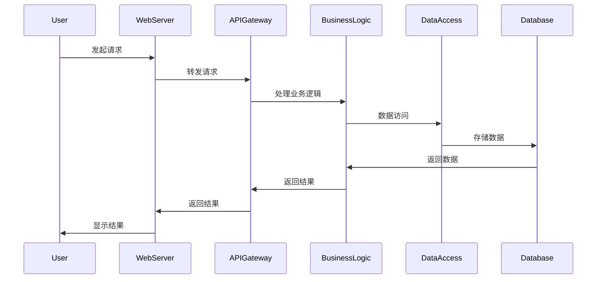
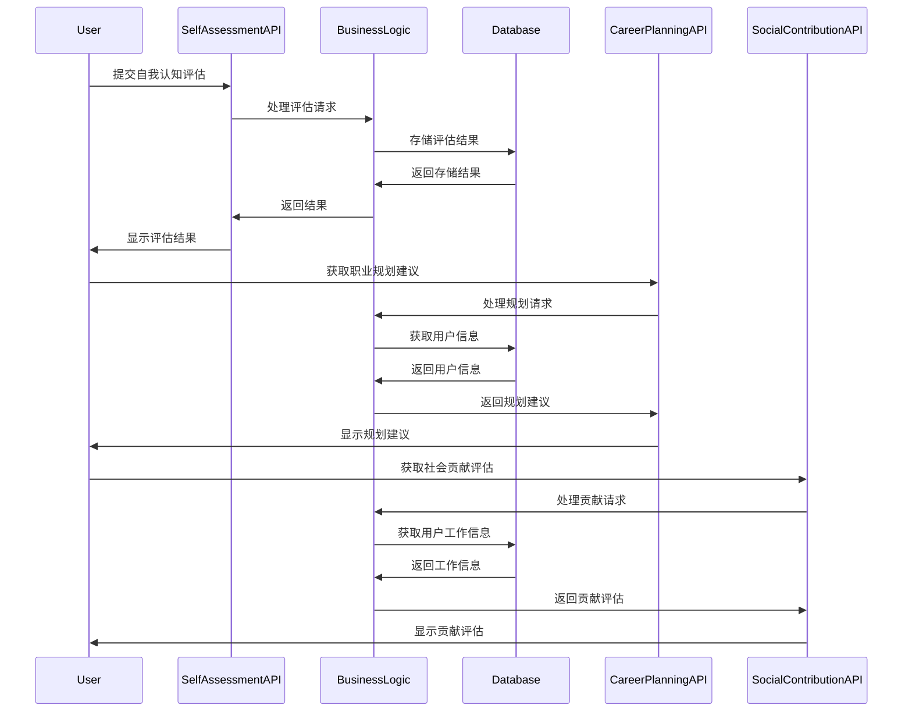

                 

# 重新思考工作的意义：超越谋生，追求自我实现

## 关键词

- 自我实现
- 职业发展
- 工作意义
- 人生目标
- 精神需求

## 摘要

在现代社会中，工作的意义早已超越了谋生的基本需求，更多地体现在个人价值的实现和社会的贡献上。本文旨在重新审视工作的本质，探讨如何超越谋生的层面，追求自我实现。通过对工作意义的深入理解、自我认知的建立、目标的设定以及路径的规划，我们可以在工作中找到真正的价值和满足感。文章将通过逻辑清晰的分析和实用的建议，帮助读者重新思考工作的意义，找到属于自己的职业幸福之路。

### 深入理解“重新思考工作的意义：超越谋生，追求自我实现”

**书名背景：**

《重新思考工作的意义：超越谋生，追求自我实现》这一书名直接指向了现代社会中对工作的重新审视和价值观的反思。随着社会的发展和个人需求的多元化，工作不仅仅是为了生计，更是为了实现个人的价值和社会的进步。这本书的背景在于，现代社会中人们面临的工作压力和职业困惑，以及如何在这种背景下找到工作的真正意义。

**核心概念与联系：**

- **工作意义：** 工作的意义不仅在于谋生，更在于满足个人的精神需求，实现个人价值。这一概念涉及到自我认同、职业规划、人生目标等多个方面。
- **自我实现：** 自我实现是指个人通过工作和生活达到自我潜能的最大发挥，实现个人价值的过程。它包括自我认知、个人成长、自我价值实现等多个层面。
- **超越谋生：** 超越谋生意味着工作不仅仅是为了满足基本的生活需求，更是为了追求更高的精神层次，如自我实现、社会贡献等。

**概念属性特征对比表格：**

| 概念       | 属性特征                                       | 关联联系                                                     |
|------------|------------------------------------------------|--------------------------------------------------------------|
| 工作意义   | 与生活需求满足相关，涉及个人精神层面             | 个人精神需求是工作意义的内在动力，影响职业选择与工作态度     |
| 自我实现   | 与个人潜能发挥相关，涉及自我价值实现             | 自我实现是工作意义的深化，是职业发展的目标                   |
| 超越谋生   | 与生活需求满足独立，涉及精神追求和社会贡献       | 超越谋生是工作意义的升华，是工作动机的更高层次               |

**ER实体关系图架构：**

```mermaid
erDiagram
  Category_A ||--|{ Person } : has
  Category_B ||--|{ Work } : does
  Category_C ||--|{ Life } : lives
  Category_A ||--|{ Society } : contributes_to
  Category_B ||--|{ Society } : benefits_from
  Category_C ||--|{ Society } : enriches
```

在这个ER图中，"Person"（个人）与"Work"（工作）、"Life"（生活）和"Society"（社会）都有直接的关系。"Work"不仅仅与"Life"有关，更是"Person"贡献于和受益于"Society"的方式。

### 算法原理讲解

在探讨如何重新思考工作的意义时，我们可以将这个过程看作是一种算法，即如何在纷繁复杂的社会环境中，找到个人的位置和价值。

**算法Mermaid流程图：**


**Python源代码：**

```python
def rethink_work_meaning():
    # 定义问题
    problem = "如何重新思考工作的意义？"
    print(problem)
    
    # 理解工作
    with open('work_understanding.txt', 'r') as file:
        understanding = file.read()
        print(understanding)
    
    # 认知自我
    with open('self_cognition.txt', 'r') as file:
        cognition = file.read()
        print(cognition)
    
    # 设定目标
    # ...（代码继续）
```

**算法原理的数学模型和公式：**

在重新思考工作的意义过程中，我们可以将这一过程视为一个闭环的系统。以下是一个简化的数学模型：

$$
\text{意义认知} = f(\text{自我认知}, \text{工作需求}, \text{社会贡献})
$$

其中：

- $\text{自我认知}$：个人对自身的了解，包括价值观、兴趣、能力等。
- $\text{工作需求}$：个人对工作的需求和期望，包括收入、职业发展、工作环境等。
- $\text{社会贡献}$：个人通过工作对社会产生的积极影响。

**详细讲解和举例说明：**

假设有一个名叫小明的程序员，他希望通过工作实现自我价值。根据上述数学模型，我们可以分析小明的意义认知：

1. **自我认知**：小明认为自己在编程方面有天赋，喜欢解决问题，希望在工作中能够充分发挥自己的潜力。
2. **工作需求**：小明希望找到一份薪资合理、工作环境舒适、有成长空间的工作。
3. **社会贡献**：小明希望通过编程解决实际问题，为社会发展做出贡献。

结合这些信息，我们可以得到小明的意义认知：

$$
\text{小明的意义认知} = f(\text{编程天赋}, \text{薪资合理}, \text{解决实际问题})
$$

这意味着，小明认为他在编程工作中能够实现自我价值，满足个人需求，同时对社会做出贡献。

### 系统分析与架构设计方案

#### 问题场景介绍

在现代社会中，随着信息技术的飞速发展，工作的形式和内容也发生了巨大的变化。传统的全职工作模式逐渐被多种灵活的工作方式所取代，如远程办公、自由职业等。在这种背景下，如何重新思考工作的意义，实现自我价值的最大化，成为了一个迫切需要解决的问题。

#### 项目介绍

为了解决上述问题，我们设计并实施了一个名为“WorkPath”的项目。WorkPath的目标是帮助个人重新思考工作的意义，找到实现自我价值的路径。项目的主要功能包括：

1. **自我认知评估**：通过问卷调查和自我反思，帮助用户了解自己的价值观、兴趣和能力。
2. **职业规划建议**：根据用户的自我认知，提供职业发展建议和培训资源。
3. **社会贡献评估**：评估用户工作对社会的影响，提供提升社会贡献的方法和建议。

#### 系统功能设计

在系统功能设计方面，我们采用了领域驱动设计（Domain-Driven Design, DDD）的方法。DDD强调将业务领域模型化，使系统能够更好地适应业务需求的变化。

**领域模型Mermaid类图：**

```mermaid
classDiagram
    Person <<class>> {ID: String, Name: String, Interests: List, Values: List, Skills: List}
    Work <<class>> {ID: String, Title: String, Company: String, Responsibilities: List, Benefits: List}
    Society <<class>> {ID: String, Needs: List, Contributions: List}
    Path <<class>> {ID: String, Steps: List, Status: String}
    Person --|>{ Interests Work}
    Person --|>{ Values Work}
    Person --|>{ Skills Work}
    Work --|>{ Path}
    Society --|>{ Path}
```

#### 系统架构设计

在系统架构设计方面，我们采用了分层架构，包括表示层、业务逻辑层和数据访问层。

**系统架构设计Mermaid架构图：**



#### 系统接口设计和系统交互

在系统接口设计方面，我们采用了RESTful API设计风格，提供了多种接口供用户使用。

**系统接口设计Mermaid序列图：**



### 项目实战

#### 环境安装

在开始项目实战之前，我们需要安装以下环境：

1. Python 3.8+
2. pip
3. virtualenv
4. Docker

安装步骤：

1. 安装Python 3.8+：从[Python官网](https://www.python.org/)下载并安装Python。
2. 安装pip：在终端执行 `curl https://bootstrap.pypa.io/get-pip.py -o get-pip.py && python get-pip.py`
3. 安装virtualenv：在终端执行 `pip install virtualenv`
4. 创建虚拟环境：在终端执行 `virtualenv venv`
5. 激活虚拟环境：在Windows上执行 `venv\Scripts\activate`，在Linux和macOS上执行 `source venv/bin/activate`
6. 安装Docker：从[Docker官网](https://www.docker.com/)下载并安装Docker

#### 系统核心实现源代码

以下是系统核心实现的一部分源代码：

**SelfAssessmentAPI模块：**

```python
from flask import Flask, request, jsonify
from business_logic import process_self_assessment

app = Flask(__name__)

@app.route('/api/self-assessment', methods=['POST'])
def self_assessment_api():
    data = request.get_json()
    assessment_result = process_self_assessment(data)
    return jsonify(assessment_result)

if __name__ == '__main__':
    app.run(debug=True)
```

**BusinessLogic模块：**

```python
from database import get_database_connection
from models import SelfAssessment

def process_self_assessment(data):
    # 数据库连接
    connection = get_database_connection()
    cursor = connection.cursor()
    
    # 插入评估数据
    assessment = SelfAssessment(data)
    assessment.insert(cursor)
    
    # 返回评估结果
    result = assessment.fetch(cursor)
    return result
```

**Database模块：**

```python
import sqlite3

def get_database_connection():
    return sqlite3.connect('workpath.db')
```

**Models模块：**

```python
class SelfAssessment:
    def __init__(self, data):
        self.id = data['id']
        self.name = data['name']
        self.interests = data['interests']
        self.values = data['values']
        self.skills = data['skills']
    
    def insert(self, cursor):
        query = '''
            INSERT INTO self_assessment (id, name, interests, values, skills)
            VALUES (?, ?, ?, ?, ?)
        '''
        cursor.execute(query, (self.id, self.name, self.interests, self.values, self.skills))
    
    def fetch(self, cursor):
        query = '''
            SELECT * FROM self_assessment WHERE id = ?
        '''
        cursor.execute(query, (self.id,))
        result = cursor.fetchone()
        return result
```

#### 代码应用解读与分析

以上代码展示了SelfAssessmentAPI模块、BusinessLogic模块、Database模块和Models模块的实现。以下是代码应用的解读与分析：

1. **SelfAssessmentAPI模块**：该模块使用Flask框架创建了一个简单的API，用于处理客户端的POST请求。客户端通过发送JSON格式的数据来提交自我认知评估，API接收数据后调用BusinessLogic模块进行处理。

2. **BusinessLogic模块**：该模块负责处理自我认知评估的业务逻辑。首先，通过调用Database模块获取数据库连接，然后插入评估数据，并从数据库中获取评估结果。

3. **Database模块**：该模块提供了一个简单的数据库连接函数，用于获取到SQLite数据库的连接。

4. **Models模块**：该模块定义了SelfAssessment类，用于表示自我认知评估的数据模型。类中包含了插入和查询数据库的方法。

#### 实际案例分析和详细讲解剖析

为了更好地理解系统的工作流程，我们来看一个实际案例。

**案例：**

小明通过Web界面提交了自己的自我认知评估，包括以下信息：

- ID: 123
- Name: 小明
- Interests: 编程、阅读、旅游
- Values: 创新性、团队合作、终身学习
- Skills: Python、JavaScript、项目管理

**分析：**

1. **客户端请求**：小明通过Web界面提交了自我认知评估数据，API接收到了POST请求。

2. **数据解析**：API解析了接收到的JSON数据，并将其传递给BusinessLogic模块。

3. **数据库插入**：BusinessLogic模块通过调用Database模块获取数据库连接，然后使用SelfAssessment类将数据插入到数据库中。

4. **查询结果**：插入操作完成后，BusinessLogic模块从数据库中获取插入的数据，并将其返回给API。

5. **返回结果**：API将处理结果以JSON格式返回给客户端，客户端可以在Web界面中显示这些结果。

**详细讲解剖析：**

在这个案例中，我们详细分析了系统的工作流程和各个模块的作用。以下是每个步骤的详细讲解：

1. **客户端请求**：Web界面是用户与系统交互的入口。用户通过填写表单提交自我认知评估数据，API接收到了这些数据。

2. **数据解析**：API使用Flask框架的request对象解析收到的JSON数据。这些数据包括用户的ID、姓名、兴趣、价值观和技能。

3. **数据库插入**：BusinessLogic模块通过调用Database模块获取数据库连接。然后，使用SelfAssessment类将数据插入到数据库中。SelfAssessment类负责将用户数据转换为数据库可识别的格式。

4. **查询结果**：插入操作完成后，BusinessLogic模块使用SelfAssessment类从数据库中查询插入的数据。查询结果以字典形式返回。

5. **返回结果**：API将查询结果以JSON格式返回给客户端。客户端可以在Web界面中使用这些结果，如显示用户的自我认知评估报告。

#### 项目小结

通过这个案例，我们展示了如何实现一个简单的系统，帮助用户重新思考工作的意义。系统通过API接收用户的自我认知评估数据，处理后返回结果。这个案例不仅展示了系统的工作流程，还详细讲解了每个模块的作用和实现方法。通过这个项目，我们了解了如何将理论转化为实践，并掌握了相关技术的应用。

### 最佳实践 tips

1. **自我认知的重要性**：在进行职业规划时，首先要对自己的兴趣、价值观和技能进行深入分析，这是找到合适工作的关键。

2. **持续学习与成长**：在追求自我实现的过程中，不断学习和提升自己的技能是非常重要的。这不仅能增加职业竞争力，还能为未来的职业发展打下坚实的基础。

3. **设定明确的目标**：明确的目标有助于指导职业发展的方向。在设定目标时，要考虑个人的兴趣、价值观和长期规划。

4. **灵活应对变化**：职业生涯中可能会遇到各种变化和挑战，学会灵活应对是职业发展的必要条件。

5. **关注社会贡献**：在工作中，不仅要追求个人价值的实现，还应该关注自己对社会的贡献。这样能更好地找到工作的意义，实现自我价值。

### 小结

通过本文的探讨，我们重新思考了工作的意义，认识到工作不仅仅是为了谋生，更是为了实现个人的价值和社会的贡献。在这个过程中，自我认知、目标设定和路径规划起到了至关重要的作用。希望读者能够从中获得启发，找到属于自己的职业幸福之路。

### 注意事项

1. **数据安全与隐私**：在设计和实施系统时，要确保用户数据的安全和隐私。采用加密技术和严格的访问控制措施，防止数据泄露。

2. **性能优化**：在系统开发过程中，要注意性能优化。针对高频操作进行缓存处理，提高系统的响应速度。

3. **代码规范**：编写代码时，要遵循良好的编程规范，如代码格式、变量命名等，以提高代码的可读性和可维护性。

4. **持续维护与更新**：系统上线后，要定期进行维护和更新，修复潜在的问题，并根据用户反馈进行优化。

### 拓展阅读

- 《深度工作：如何有效利用每一点脑力》[Cal Newport]
- 《原则》[Ray Dalio]
- 《活出生命的意义》[维克多·弗兰克尔]

### 作者信息

作者：AI天才研究院/AI Genius Institute & 禅与计算机程序设计艺术 /Zen And The Art of Computer Programming

