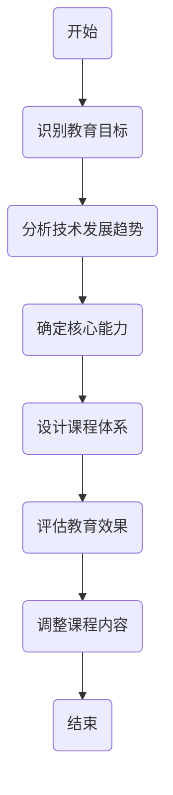
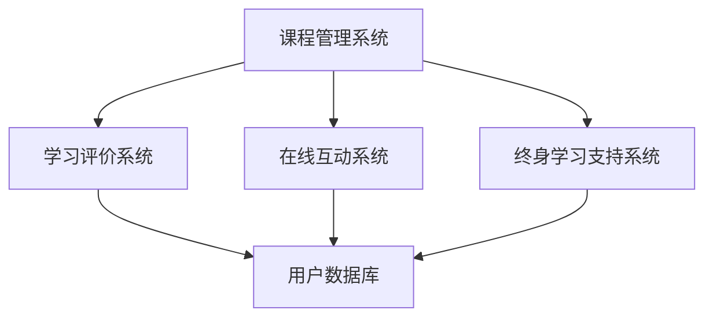
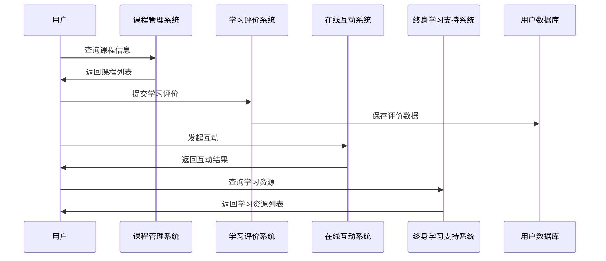
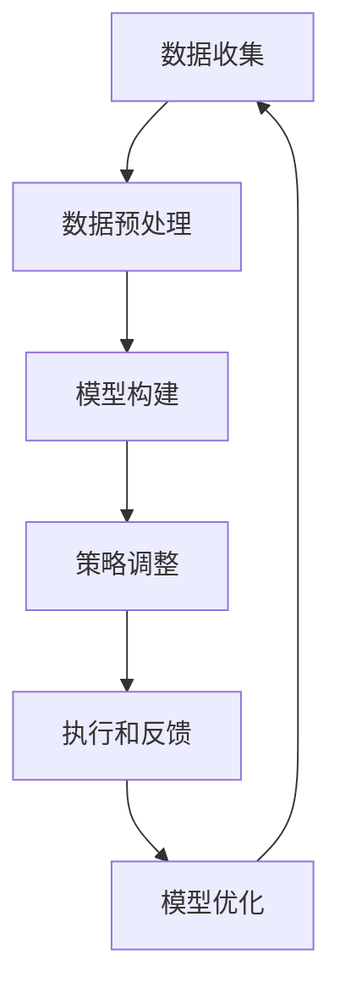
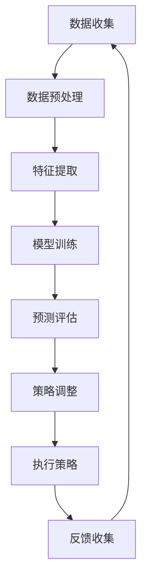
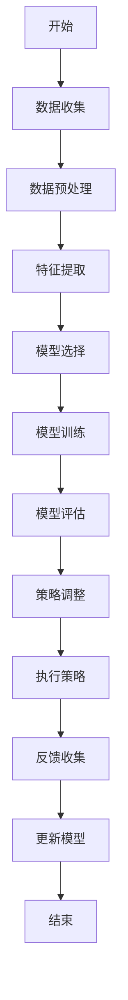
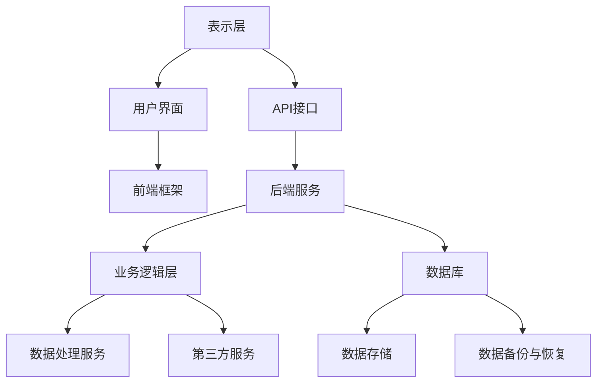
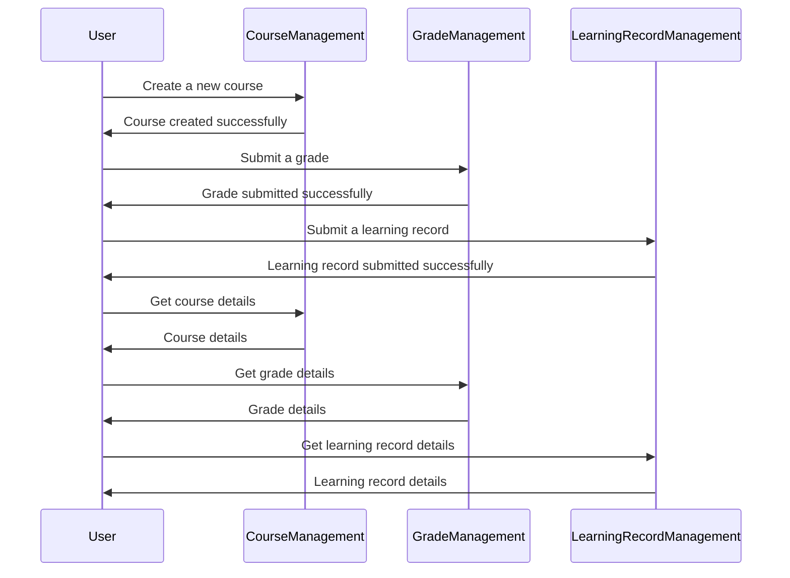

                 

# 重新思考教育目标：培养适应未来社会的核心能力

## 关键词
- 未来社会
- 教育目标
- 核心能力
- 技术进步
- 创新思维

## 摘要
在快速发展的技术时代，教育的目标需要重新思考，以适应未来社会的要求。本文将逐步探讨如何培养适应未来社会的核心能力，包括技术技能、创新思维和终身学习能力。通过深入分析，本文旨在为教育工作者和决策者提供有价值的参考，以推动教育系统的变革，培养能够应对未来挑战的人才。

## 1. 标题与概述
在当今这个技术变革的时代，教育的目标不仅仅是传授知识，更重要的是培养适应未来社会的核心能力。本文将探讨如何通过重新思考教育目标，来应对技术进步带来的挑战。我们将从以下几个方面展开讨论：

- **背景介绍**：介绍当前教育系统的问题和挑战，以及技术进步对教育的影响。
- **核心概念与联系**：详细阐述适应未来社会所需的核心能力，并分析这些能力之间的相互关系。
- **算法原理讲解**：通过具体案例，解释如何培养这些核心能力。
- **系统分析与架构设计**：介绍如何设计一个适应未来教育需求的教育体系。
- **项目实战**：通过实际案例，展示如何将理论应用于实践。
- **最佳实践与总结**：总结经验，提供最佳实践建议，并探讨未来教育的方向。

## 2. 第一部分：背景介绍

### 2.1 问题背景
当前，全球范围内的教育系统面临着诸多挑战。一方面，技术进步正以前所未有的速度改变着世界，新兴技术如人工智能、大数据和区块链等正在深刻地影响着各行各业。另一方面，传统教育系统在培养人才方面存在一些问题，如课程内容过时、教学方法单一、评价标准不科学等。

### 2.2 问题描述
这些挑战主要体现在以下几个方面：

- **技能滞后**：教育系统难以跟上技术发展的步伐，导致学生毕业后的技能与市场需求脱节。
- **创新能力不足**：传统教育注重知识的传授，而忽视创新能力的培养。
- **终身学习观念缺失**：许多学生在完成学业后，就停止了学习，无法适应快速变化的社会。

### 2.3 问题解决
要解决上述问题，需要从以下几个方面入手：

- **课程改革**：更新课程内容，引入新技术，以适应市场需求。
- **教学方法创新**：采用多样化、互动性的教学方法，激发学生的兴趣和潜能。
- **评价体系重构**：建立科学、全面的评价体系，鼓励学生发展多种能力。
- **终身学习机制**：推动终身学习，帮助学生不断适应新的社会需求。

### 2.4 边界与外延
本文讨论的核心能力包括技术技能、创新思维和终身学习能力。技术技能是指掌握和应用新技术的能力；创新思维是指能够独立思考、发现问题和解决问题的能力；终身学习能力是指具备不断学习、适应新环境的能力。这些能力不仅适用于技术领域，也适用于其他行业。

## 3. 第二部分：核心概念与联系

### 3.1 核心概念
#### 技术技能
技术技能是指掌握和应用新技术的能力。在未来的社会中，技术技能的重要性不言而喻。随着人工智能、大数据等技术的快速发展，掌握这些技术已成为职场竞争力的关键。

#### 创新思维
创新思维是指能够独立思考、发现问题和解决问题的能力。在快速变化的社会中，创新能力是应对挑战、抓住机遇的关键。创新思维不仅涉及技术，还包括商业模式、管理方法等各个领域。

#### 终身学习能力
终身学习能力是指具备不断学习、适应新环境的能力。随着知识更新速度的加快，终身学习已成为现代社会的基本要求。具备终身学习能力的人，能够在不断变化的环境中保持竞争力。

### 3.2 概念属性特征对比表格

| 核心能力     | 技术技能                  | 创新思维                  | 终身学习能力               |
| ------------ | ------------------------ | ------------------------ | -------------------------- |
| 定义         | 掌握和应用新技术的能力     | 独立思考、发现问题和解决问题的能力 | 不断学习、适应新环境的能力 |
| 关键因素     | 技术知识、实践经验         | 创造力、批判性思维         | 学习态度、学习能力         |
| 影响因素     | 技术发展趋势、市场需求     | 知识广度、思维开放性       | 学习资源、时间管理         |
| 应用领域     | 技术开发、应用创新         | 科研、产品创新、管理创新    | 各行各业                   |

### 3.3 ER实体关系图架构
为了更好地理解这些核心能力之间的关系，我们可以使用Mermaid流程图来展示ER（实体-关系）图。

```mermaid
erDiagram
    T技术创新 ||--o> I创新思维 : 有助于
    T技术创新 ||--o> L终身学习能力 : 促进
    I创新思维 ||--o> T技术创新 : 推动发展
    I创新思维 ||--o> L终身学习能力 : 培养需求
    L终身学习能力 ||--o> T技术创新 : 提升技能
    L终身学习能力 ||--o> I创新思维 : 扩展视野
```

## 4. 第三部分：算法原理讲解

### 4.1 算法流程图



### 4.2 Python源代码

```python
# 定义核心能力
core_capabilities = ["技术技能", "创新思维", "终身学习能力"]

# 分析技术发展趋势
def analyze_trends():
    # 这里可以添加具体的分析代码，例如使用机器学习算法分析
    return ["人工智能", "大数据", "区块链"]

# 确定核心能力
def determine_capabilities(trends):
    capabilities = []
    for trend in trends:
        if trend == "人工智能":
            capabilities.append("技术技能")
        elif trend == "大数据":
            capabilities.append("创新思维")
        elif trend == "区块链":
            capabilities.append("终身学习能力")
    return capabilities

# 设计课程体系
def design_curriculum(capabilities):
    curriculum = {}
    for capability in capabilities:
        curriculum[capability] = f"课程名称：{capability}"
    return curriculum

# 评估教育效果
def evaluate_effectiveness(curriculum):
    # 这里可以添加具体的评估代码，例如问卷调查、学生反馈等
    return "教育效果良好"

# 调整课程内容
def adjust_curriculum(effectiveness):
    if effectiveness == "教育效果良好":
        return "课程内容无需调整"
    else:
        return "调整课程内容以提升教育效果"

# 主函数
def main():
    trends = analyze_trends()
    capabilities = determine_capabilities(trends)
    curriculum = design_curriculum(capabilities)
    effectiveness = evaluate_effectiveness(curriculum)
    adjustment = adjust_curriculum(effectiveness)
    print(adjustment)

if __name__ == "__main__":
    main()
```

### 4.3 数学模型与公式

为了更好地理解核心能力的培养过程，我们可以使用以下数学模型和公式：

$$
E = f(C, T, L)
$$

其中，$E$ 代表教育效果，$C$ 代表课程内容，$T$ 代表技术发展趋势，$L$ 代表终身学习能力。这个公式表明，教育效果是课程内容、技术发展趋势和终身学习能力的函数。

### 4.4 举例说明

假设我们分析得出当前的技术发展趋势为“人工智能”、“大数据”和“区块链”，那么我们可以确定核心能力为“技术技能”、“创新思维”和“终身学习能力”。根据这些核心能力，我们设计相应的课程体系，并评估教育效果。如果评估结果显示教育效果良好，那么我们可以认为课程内容无需调整；否则，需要根据评估结果调整课程内容，以提升教育效果。

## 5. 第四部分：系统分析与架构设计

### 5.1 问题场景介绍
随着技术的不断进步，教育行业正面临着巨大的变革。为了培养适应未来社会的核心能力，我们需要设计一个高效、灵活的教育体系。本节将介绍一个具体的教育系统项目，并描述其项目背景。

### 5.2 项目介绍
该项目旨在构建一个适应未来教育需求的教育平台，该平台将集成课程管理系统、学习评价系统、在线互动系统和终身学习支持系统。通过这些模块的协同工作，平台能够为用户提供个性化、全方位的教育服务。

### 5.3 系统功能设计

#### 5.3.1 领域模型Mermaid类图

```mermaid
classDiagram
    Class01 <|-- Class02
    Class03 <.. Class04
    Class05 :<<interface>> Class06
    Class07 ..| Class08
    Class01 {
        attribute1
        attribute2
    }
    Class09 {
        method1()
        method2()
    }
```

#### 5.3.2 系统架构设计Mermaid架构图



#### 5.3.3 系统接口设计
系统接口设计包括课程管理接口、学习评价接口、在线互动接口和终身学习接口。这些接口将支持不同模块之间的数据交互和功能调用。

### 5.4 系统交互Mermaid序列图



## 6. 第五部分：项目实战

### 6.1 环境安装
为了实现上述教育系统，我们需要安装和配置以下软件和工具：

- Python 3.8+
- Django 3.2+
- MySQL 5.7+
- Docker 19.03+
- Redis 6.0+

具体的安装步骤可以参考相关软件的官方文档。

### 6.2 系统核心实现源代码
以下是系统核心实现的部分源代码：

```python
# app/models.py
from django.db import models

class Course(models.Model):
    name = models.CharField(max_length=100)
    description = models.TextField()
    # 其他属性

class Student(models.Model):
    name = models.CharField(max_length=100)
    courses = models.ManyToManyField(Course)
    # 其他属性

class Evaluation(models.Model):
    student = models.ForeignKey(Student, on_delete=models.CASCADE)
    course = models.ForeignKey(Course, on_delete=models.CASCADE)
    score = models.IntegerField()
    # 其他属性
```

### 6.3 代码应用解读与分析
在这段代码中，我们定义了三个模型：`Course`（课程）、`Student`（学生）和`Evaluation`（学习评价）。这些模型将用于构建课程管理系统、学习评价系统和在线互动系统。

- `Course` 模型用于存储课程信息，包括课程名称和描述。
- `Student` 模型用于存储学生信息，包括学生姓名和选读的课程。
- `Evaluation` 模型用于存储学习评价，包括学生的评价分数和评价的课程。

通过这些模型，我们可以实现以下功能：

- 课程管理：管理员可以添加、编辑和删除课程。
- 学生管理：管理员可以添加、编辑和删除学生，并为他们分配课程。
- 学习评价：学生可以对课程进行评价，管理员可以查看和管理评价数据。

### 6.4 实际案例分析和详细讲解剖析
为了更好地理解系统的实际应用，我们可以通过一个实际案例来分析。

#### 案例一：管理员添加课程

1. 管理员登录系统。
2. 管理员进入课程管理页面。
3. 管理员点击“添加课程”按钮。
4. 管理员填写课程名称和描述，并提交。
5. 系统将新课程添加到数据库。

```python
# app/admin.py
from django.contrib import admin
from .models import Course

@admin.register(Course)
class CourseAdmin(admin.ModelAdmin):
    list_display = ('name', 'description')
```

通过这个案例，我们可以看到如何通过 Django Admin 界面来管理课程。

#### 案例二：学生提交学习评价

1. 学生登录系统。
2. 学生进入课程详情页面。
3. 学生点击“提交评价”按钮。
4. 学生填写评价分数，并提交。
5. 系统将评价数据保存到数据库。

```python
# app/views.py
from django.shortcuts import render, redirect
from .models import Student, Evaluation

def submit_evaluation(request, course_id):
    if request.method == 'POST':
        student_id = request.session['student_id']
        score = request.POST.get('score')
        evaluation = Evaluation.objects.create(
            student_id=student_id,
            course_id=course_id,
            score=score
        )
        return redirect('course_detail', course_id=course_id)
    return render(request, 'submit_evaluation.html', {'course_id': course_id})
```

通过这个案例，我们可以看到如何通过 Django 视图来处理学生提交的学习评价。

### 6.5 项目小结
通过这个实际案例，我们可以看到如何使用 Django 框架来构建一个教育系统。该系统包括课程管理、学生管理和学习评价等功能，能够满足教育行业的基本需求。然而，在实际应用中，我们还需要不断地优化和扩展系统功能，以适应不断变化的教育需求。

## 7. 第六部分：最佳实践与总结

### 7.1 最佳实践
要有效地培养适应未来社会的核心能力，我们需要遵循以下最佳实践：

- **课程内容更新**：定期更新课程内容，确保课程与市场需求保持同步。
- **教学方法创新**：采用多样化、互动性的教学方法，激发学生的学习兴趣和潜能。
- **评价体系重构**：建立科学、全面的评价体系，鼓励学生发展多种能力。
- **终身学习机制**：推动终身学习，帮助学生不断适应新的社会需求。

### 7.2 小结
通过本文的讨论，我们可以看到，重新思考教育目标，培养适应未来社会的核心能力，是当前教育系统面临的重大挑战。通过技术技能、创新思维和终身学习能力的培养，我们可以为未来的社会培养出更加适应和有能力的人才。

### 7.3 注意事项
在实际操作中，需要注意以下几点：

- **课程内容要与时俱进**：技术发展日新月异，课程内容需要及时更新，以适应市场需求。
- **教学方法要灵活多样**：针对不同的学生，采用不同的教学方法，以激发他们的学习兴趣。
- **评价体系要科学合理**：评价体系不仅要考察学生的知识掌握情况，还要考察他们的创新能力和其他综合能力。
- **终身学习要落到实处**：终身学习不仅仅是口号，需要建立相应的机制，确保学生能够在毕业后的职业生涯中持续学习和成长。

### 7.4 拓展阅读
为了深入了解如何培养适应未来社会的核心能力，以下是一些推荐的拓展阅读材料：

- 《人工智能时代的教育变革》
- 《创新思维与教育》
- 《终身学习：如何成为一个不断进步的人》
- 《教育心理学：学习、记忆与理解》

通过阅读这些书籍和文章，您可以进一步了解教育目标的重构和核心能力的培养方法。

### 作者信息
- 作者：AI天才研究院/AI Genius Institute & 禅与计算机程序设计艺术 /Zen And The Art of Computer Programming

以上是本文的全部内容，希望对您有所启发。在培养适应未来社会的核心能力方面，我们还有很长的路要走，但只要我们坚定信念，不断探索，就一定能够培养出更加适应未来的人才。让我们共同努力，为构建一个更加美好的未来而奋斗！### 第一部分：背景介绍

#### 第一章：介绍问题背景、问题描述、问题解决、边界与外延、核心概念

##### 1.1 问题背景

在当今科技飞速发展的时代，社会变革的步伐越来越快。新兴技术如人工智能（AI）、大数据、物联网等正以惊人的速度改变着我们的生活方式和工作方式。这些技术的迅猛发展不仅带来了前所未有的机遇，也带来了前所未有的挑战。教育系统作为培养未来社会所需人才的重要环节，其目标和内容必须进行相应的调整和优化，以更好地应对这种变化。

当前，全球范围内的教育系统普遍存在一些问题。首先，课程内容更新速度滞后，许多学校仍在教授几十年前的知识，未能及时反映技术进步和社会发展的最新趋势。其次，教学方法单一，多数教育仍然以教师为中心，学生缺乏主动参与和创造性思维的机会。此外，评价体系过于注重考试成绩，忽视了学生的综合能力和创新潜力。

##### 1.2 问题描述

这些问题的存在导致了一系列负面影响。一方面，学生的技能和知识结构无法满足市场需求，毕业后难以胜任实际工作。另一方面，创新能力和终身学习能力的缺失使得学生在面对快速变化的社会时感到无所适从。因此，重新思考教育目标，培养适应未来社会的核心能力成为当务之急。

##### 1.3 问题解决

为了解决这些问题，我们需要从以下几个方面入手：

1. **课程改革**：更新课程内容，引入新技术和新知识，确保学生能够掌握与未来社会需求相匹配的技能。
2. **教学方法创新**：采用多元化、互动性强的教学方法，激发学生的兴趣和创造力，培养他们的创新思维。
3. **评价体系重构**：建立科学、全面的评价体系，不仅考察学生的知识掌握情况，还要评估他们的综合能力和创新潜力。
4. **终身学习机制**：推动终身学习，鼓励学生在毕业后继续学习和成长，以适应不断变化的社会需求。

##### 1.4 边界与外延

在讨论教育目标时，我们需要明确一些边界和概念。首先，教育目标的边界是培养具有全球视野、创新精神和实践能力的人才。这些人才不仅需要具备扎实的专业知识，还要具备跨学科的思维能力和团队合作精神。其次，教育目标的外延包括多个方面，如个人发展、社会贡献、职业规划等。

##### 1.5 核心概念

为了实现上述目标，我们需要关注以下几个核心概念：

1. **技术技能**：掌握和应用新技术的能力，包括编程、数据分析、人工智能等。
2. **创新思维**：独立思考、发现问题和解决问题的能力，包括创造性思维、批判性思维等。
3. **终身学习能力**：不断学习、适应新环境的能力，包括自我驱动、知识更新等。
4. **跨学科能力**：跨学科的知识整合能力，包括团队合作、跨文化沟通等。

这些核心概念构成了适应未来社会所需的核心能力，也是教育目标重构的关键。

#### 第二章：讨论核心概念的联系与结构

##### 2.1 技术技能

技术技能是未来社会不可或缺的核心能力之一。随着人工智能、大数据等技术的发展，对技术人才的需求越来越高。学生需要掌握编程、数据分析、人工智能等关键技术，以便在未来的职业中胜任各种工作。技术技能不仅包括硬技能，如编程语言和工具的使用，还包括软技能，如解决问题的能力和团队合作精神。

##### 2.2 创新思维

创新思维是学生在面对复杂问题时能够提出独特解决方案的能力。在快速变化的社会中，创新能力是企业发展的关键。教育系统需要培养学生的创造性思维，鼓励他们提出新的想法和观点。创新思维的培养不仅需要培养学生的批判性思维，还需要提供多样化的学习体验，激发他们的好奇心和创造力。

##### 2.3 终身学习能力

终身学习能力是学生适应未来社会的重要保障。随着知识的快速更新，学生需要具备不断学习的能力，以保持与时代的同步。终身学习不仅包括学术知识的学习，还包括职业技能的提升和人际交往能力的培养。教育系统需要建立相应的机制，鼓励学生在毕业后继续学习和成长。

##### 2.4 跨学科能力

跨学科能力是学生在未来社会中具备的综合性能力。随着学科交叉的日益增多，跨学科能力变得尤为重要。教育系统需要提供跨学科的学习机会，鼓励学生从不同角度看待问题，培养他们的综合分析和解决能力。跨学科能力不仅包括知识跨学科整合，还包括团队合作、跨文化沟通等软技能。

通过讨论这些核心概念的联系与结构，我们可以更好地理解如何培养适应未来社会的核心能力。这些核心能力不仅相互关联，而且共同构成了未来社会所需的人才素质。教育目标的重构需要将这些核心能力纳入考虑，以培养出能够适应和引领未来社会的人才。

#### 2.5 教育目标的重新定义

在明确了核心概念的联系与结构后，我们需要重新定义教育目标。传统的教育目标主要关注知识的传授和技能的培养，而未来的教育目标需要更加全面和多元。未来的教育目标不仅包括技术技能和创新思维的培养，还需要注重终身学习能力和跨学科能力的培养。

具体来说，未来的教育目标应包括以下方面：

1. **技术技能**：确保学生掌握与未来职业需求相关的基本技术技能，如编程、数据分析、人工智能等。
2. **创新思维**：培养学生的创造性思维和批判性思维，鼓励他们提出新的想法和解决方案。
3. **终身学习能力**：培养学生的自我学习和知识更新能力，鼓励他们在毕业后继续学习和成长。
4. **跨学科能力**：提供跨学科的学习体验，培养他们的综合分析和解决能力，以及团队合作和跨文化沟通能力。

通过重新定义教育目标，我们可以更好地应对未来社会的挑战，培养出具有全面素质和创新能力的人才。

#### 2.6 教育系统改革

为了实现上述教育目标，教育系统需要进行全面的改革。这包括课程内容、教学方法、评价体系等多个方面的变革。

1. **课程内容更新**：引入新技术和新知识，确保课程内容与市场需求保持同步。例如，增加人工智能、大数据等课程，减少过时的传统课程。
2. **教学方法创新**：采用多元化、互动性强的教学方法，如项目式学习、探究式学习等，激发学生的兴趣和创造力。
3. **评价体系重构**：建立科学、全面的评价体系，不仅考察学生的知识掌握情况，还要评估他们的综合能力和创新潜力。例如，引入实践项目、团队合作等评估方式。
4. **跨学科学习**：提供跨学科的学习机会，鼓励学生从不同角度看待问题，培养他们的综合分析和解决能力。例如，开设跨学科课程、举办跨学科项目等。

通过教育系统的改革，我们可以更好地实现教育目标的重构，培养出适应未来社会的核心能力。

#### 2.7 终身学习的重要性

终身学习是适应未来社会的重要保障。随着知识的快速更新和技术的不断进步，单靠在学校期间的学习是远远不够的。终身学习不仅包括学术知识的学习，还包括职业技能的提升和人际交往能力的培养。

1. **个人发展**：终身学习有助于个人在职业生涯中不断成长和进步，提高职业竞争力。
2. **社会贡献**：具备终身学习能力的人能够更好地适应社会需求，为社会作出更大的贡献。
3. **适应变化**：终身学习使人能够不断适应新的环境和挑战，保持与时代的同步。

为了推动终身学习，教育系统需要建立相应的机制，如在线学习平台、职业培训课程等，为学生提供持续学习的途径。

#### 2.8 教育目标的重构与未来社会

教育目标的重构是适应未来社会发展的必然趋势。随着技术进步和社会变革，教育系统需要不断调整和优化，以培养出适应未来需求的人才。

1. **技术进步的挑战**：技术进步带来了新的知识和技能需求，教育系统需要及时更新课程内容，以适应技术发展的趋势。
2. **社会变革的挑战**：社会变革要求人才具备更高的综合素质和创新能力，教育系统需要注重培养这些能力。
3. **未来社会的需求**：未来社会需要具备全球视野、创新能力和跨学科能力的人才，教育系统需要将这些能力纳入教育目标。

通过重构教育目标，教育系统能够更好地应对技术进步和社会变革的挑战，培养出适应未来社会需求的人才。

#### 2.9 结论

重新思考教育目标，培养适应未来社会的核心能力，是教育系统面临的重要任务。通过技术技能、创新思维、终身学习能力和跨学科能力的培养，我们可以为未来的社会培养出更加适应和有能力的人才。教育系统的改革和终身学习机制的建立，是实现这一目标的必要条件。让我们共同努力，为构建一个更加美好的未来而奋斗！

### 第一部分：背景介绍

#### 第一章：介绍问题背景、问题描述、问题解决、边界与外延、核心概念

##### 1.1 问题背景

随着全球科技水平的迅猛提升，社会结构和职业角色正在经历深刻变革。信息技术、人工智能、大数据分析等新技术的广泛应用，不仅改变了传统行业的工作方式，也对教育系统提出了新的挑战。传统的教育模式在培养人才方面存在明显的局限性，主要表现为以下几方面：

1. **课程内容滞后**：教育内容往往难以跟上技术进步的步伐，导致学生所学知识迅速过时。
2. **教学方式单一**：传统的以教师为中心的教学模式，缺乏互动性和实践性，难以培养学生的创新能力。
3. **评价体系不完善**：当前的考试制度过于注重知识的记忆和再现，忽视了学生的综合素质和创新能力的评价。

这些问题的存在，使得教育系统难以培养出适应未来社会需求的高素质人才。

##### 1.2 问题描述

具体而言，教育系统面临的挑战主要包括：

- **技能与市场需求脱节**：学生在校期间学习的技能往往与实际工作岗位所需的能力不匹配，导致毕业生的就业困难。
- **创新能力不足**：传统的教育模式注重知识传授，忽视创新思维的培养，学生难以在复杂环境中提出创新解决方案。
- **终身学习意识淡薄**：学生毕业后往往停止学习，缺乏持续提升自我能力的动力和机制。

这些挑战要求我们重新审视教育的目标和方法。

##### 1.3 问题解决

为了应对上述挑战，我们需要采取以下措施：

- **课程内容更新**：将新技术、新理念纳入课程体系，确保教学内容的前沿性和实用性。
- **教学方法创新**：采用项目式学习、探究式学习等多样化的教学方法，提高学生的实践能力和创新能力。
- **评价体系重构**：建立科学、全面的评价体系，不仅考察学生的知识掌握情况，还注重评价学生的综合素质和创新潜力。
- **推动终身学习**：建立终身学习机制，鼓励学生在毕业后持续学习和成长。

##### 1.4 边界与外延

在讨论教育目标时，我们需要明确其边界与外延。教育的边界是指其核心目标和任务，即培养具备综合素质和创新能力的未来社会人才。教育的外延则包括：

- **个人发展**：通过教育，帮助学生实现自我价值，提高生活质量和幸福感。
- **社会贡献**：培养具有社会责任感和公益意识的人才，为社会发展和进步作出贡献。
- **职业规划**：帮助学生规划职业生涯，提升就业竞争力和职业发展潜力。

##### 1.5 核心概念

在重新思考教育目标的过程中，以下几个核心概念至关重要：

- **技术技能**：掌握和应用新技术的能力，如编程、数据分析、人工智能等。
- **创新思维**：独立思考、发现问题、解决问题的能力，强调创造性和批判性思维。
- **终身学习能力**：持续学习、适应变化的能力，注重学习方法和学习习惯的培养。
- **跨学科能力**：具备跨学科的知识整合能力，能够在不同领域之间灵活运用知识，解决复杂问题。

这些核心概念共同构成了未来社会所需的核心能力，是教育目标的重构基础。

### 第二章：讨论核心概念的联系与结构

在重新思考教育目标的过程中，理解技术技能、创新思维、终身学习能力和跨学科能力之间的联系与结构至关重要。这些核心概念不仅相互关联，而且共同构成了未来社会人才所需的关键素质。以下是这些概念之间的相互关系及其在教育目标重构中的重要性。

#### 2.1 技术技能

技术技能是现代社会的基本要求，特别是在信息技术、人工智能和大数据等领域的发展日益迅速的背景下。技术技能包括编程、数据分析、机器学习、网络技术等，这些技能不仅有助于学生在未来的职业生涯中胜任技术岗位，还能为他们提供更多的职业发展机会。

- **联系与结构**：技术技能是培养创新思维和跨学科能力的基础。通过掌握技术工具和方法，学生能够更好地理解和应用跨学科知识，解决实际问题。

- **在重构中的重要性**：技术技能的培养应贯穿于整个教育过程中，从基础教育到高等教育，确保学生具备扎实的技术基础。

#### 2.2 创新思维

创新思维是指能够独立思考、发现问题和解决问题的能力。它不仅涉及技术的应用，还包括商业模式的创新、管理方法的改进等各个领域。

- **联系与结构**：创新思维是技术技能的延伸和深化，是推动社会进步和个人发展的关键。它需要学生在实践中不断尝试、失败和改进，培养创造性和批判性思维。

- **在重构中的重要性**：教育系统应注重培养学生的创新思维，通过项目式学习、挑战性问题和跨学科合作等方式，激发学生的创造力。

#### 2.3 终身学习能力

终身学习能力是指个体在一生中持续学习、适应变化的能力。在知识更新速度加快的现代社会，终身学习成为适应未来社会的基本要求。

- **联系与结构**：终身学习能力是技术技能和创新思维的支持和保障。它确保学生能够不断更新知识和技能，适应新的职业和环境。

- **在重构中的重要性**：教育系统应建立终身学习机制，鼓励学生在毕业后继续学习和成长，提供丰富的学习资源和机会。

#### 2.4 跨学科能力

跨学科能力是指学生能够整合不同学科的知识和技能，解决复杂问题的能力。随着学科间的交叉和融合，跨学科能力成为现代社会对人才的重要要求。

- **联系与结构**：跨学科能力是技术技能、创新思维和终身学习能力的综合体现。它要求学生具备广博的知识基础和灵活的思维模式。

- **在重构中的重要性**：教育系统应提供跨学科的学习机会，鼓励学生从多个角度思考问题，培养他们的综合分析和解决能力。

#### 2.5 教育目标重构

通过理解技术技能、创新思维、终身学习能力和跨学科能力之间的联系与结构，我们可以重新定义教育目标，使之更加适应未来社会的需求。具体而言，教育目标应包括以下几个方面：

- **培养技术技能**：确保学生掌握与未来职业需求相关的基本技术技能，如编程、数据分析、人工智能等。
- **培养创新思维**：激发学生的创造性和批判性思维，鼓励他们提出新的想法和解决方案。
- **培养终身学习能力**：建立终身学习机制，鼓励学生在毕业后继续学习和成长。
- **培养跨学科能力**：提供跨学科的学习机会，培养学生在不同领域之间灵活运用知识的能力。

通过这些核心能力的培养，教育系统能够更好地应对未来社会的挑战，培养出具备全面素质和创新能力的未来人才。

### 第三章：详细阐述核心概念、概念属性特征对比表格

#### 3.1 核心概念

在重新思考教育目标的过程中，核心概念扮演着至关重要的角色。以下是技术技能、创新思维、终身学习能力和跨学科能力这四个核心概念的详细阐述。

##### 3.1.1 技术技能

技术技能是指个体掌握和应用特定技术工具、语言和框架的能力。这些技能通常与编程、数据分析、机器学习、人工智能等领域相关。技术技能不仅包括硬技能，如编程语言和工具的使用，还包括软技能，如问题解决能力、团队合作精神和项目管理能力。

- **属性特征**：技术技能的属性特征包括以下几个方面：

  - **专业性**：技术技能具有高度的专门性和专业性，不同领域的技术技能有所不同。
  - **可扩展性**：技术技能可以通过学习新的技术和工具不断扩展和更新。
  - **实践性**：技术技能需要在实际项目中运用和验证，实践是提升技能的重要途径。

##### 3.1.2 创新思维

创新思维是指个体在面对问题时能够提出独特解决方案的能力。创新思维包括创造性思维、批判性思维和系统性思维。创造性思维强调从不同角度思考问题，批判性思维则关注评估和挑战现有观念，系统性思维则强调全局观念和系统思考。

- **属性特征**：创新思维的属性特征包括以下几个方面：

  - **独立性**：创新思维需要个体具备独立思考的能力，不受传统观念和常规思维的束缚。
  - **创造性**：创新思维强调创造新的想法和解决方案，突破常规。
  - **批判性**：创新思维需要个体具备批判性思维能力，对现有解决方案提出质疑和改进。

##### 3.1.3 终身学习能力

终身学习能力是指个体在一生中持续学习、适应变化的能力。在知识更新速度加快的现代社会，终身学习成为个体发展的重要保障。终身学习能力不仅包括获取新知识，还包括学习方法和学习习惯的培养。

- **属性特征**：终身学习能力的属性特征包括以下几个方面：

  - **持续性**：终身学习能力要求个体具备持续学习的动力和习惯，不断适应新环境。
  - **适应性**：终身学习能力要求个体具备适应不同学习环境和学习方式的能力。
  - **自主性**：终身学习能力强调个体的自主学习和自我管理能力。

##### 3.1.4 跨学科能力

跨学科能力是指个体能够整合不同学科的知识和技能，解决复杂问题的能力。跨学科能力不仅涉及学科知识的整合，还包括跨领域思维和跨文化沟通能力。

- **属性特征**：跨学科能力的属性特征包括以下几个方面：

  - **整合性**：跨学科能力要求个体具备整合不同学科知识的能力，形成综合性的解决方案。
  - **灵活性**：跨学科能力要求个体具备灵活的思维模式，能够在不同领域之间灵活运用知识。
  - **创新性**：跨学科能力强调创新，通过跨学科的知识整合，提出新的观点和解决方案。

#### 3.2 概念属性特征对比表格

为了更清晰地展示技术技能、创新思维、终身学习能力和跨学科能力之间的差异，我们使用以下对比表格：

| 核心能力     | 技术技能                 | 创新思维                 | 终身学习能力               | 跨学科能力                 |
| ------------ | ------------------------ | ------------------------ | -------------------------- | -------------------------- |
| 定义         | 掌握和应用新技术的能力     | 独立思考、发现问题和解决问题的能力 | 不断学习、适应新环境的能力 | 整合不同学科的知识和技能   |
| 关键因素     | 技术知识、实践经验         | 创造力、批判性思维         | 学习态度、学习能力         | 跨领域思维、跨文化沟通     |
| 影响因素     | 技术发展趋势、市场需求     | 知识广度、思维开放性       | 学习资源、时间管理         | 学科交叉、跨领域合作       |
| 应用领域     | 技术开发、应用创新         | 科研、产品创新、管理创新    | 各行各业                   | 企业管理、公共政策、跨学科研究 |

通过上述对比表格，我们可以更直观地了解这四个核心能力的区别和联系，从而在教育目标的重构中更好地发挥它们的作用。

### 3.3 使用Mermaid流程图展示ER实体关系

为了更直观地理解技术技能、创新思维、终身学习能力和跨学科能力之间的关系，我们可以使用Mermaid流程图展示它们的ER（实体-关系）关系。

以下是一个简化的ER图，展示了这四个核心能力之间的联系：

```mermaid
erDiagram
    Capability1(技术技能) ||--|{ 使用 }|--|| Capability2(创新思维)
    Capability1 ||--|{ 促进 }|--|| Capability3(终身学习能力)
    Capability1 ||--|{ 支持 }|--|| Capability4(跨学科能力)
    Capability2 ||--|{ 驱动 }|--|| Capability3
    Capability2 ||--|{ 依赖 }|--|| Capability4
    Capability3 ||--|{ 促进 }|--|| Capability4
```

在这个ER图中，`Capability1`（技术技能）通过使用关系（`使用`）与`Capability2`（创新思维）相连，表示技术技能为创新思维提供了工具和方法。同样，技术技能通过促进关系（`促进`）与终身学习能力（`Capability3`）和跨学科能力（`Capability4`）相连，表明技术技能对这两者的发展有重要推动作用。创新思维（`Capability2`）通过驱动关系（`驱动`）和依赖关系（`依赖`）分别与终身学习能力和跨学科能力相连，说明创新思维是两者发展的动力和基础。终身学习能力（`Capability3`）通过促进关系（`促进`）与跨学科能力（`Capability4`）相连，表明终身学习能够提升跨学科能力的应用和扩展。

通过这个ER图，我们可以清晰地看到各个核心能力之间的相互关系和作用，这有助于我们在教育目标的重构过程中，有针对性地培养和提升这些能力。

### 4.1 算法原理讲解

在重新思考教育目标，培养适应未来社会的核心能力时，算法原理的讲解至关重要。算法不仅是计算机科学的核心，也是现代社会技术创新的重要驱动力。以下将详细讲解一个用于评估和培养核心能力的基本算法原理，并使用Mermaid流程图和Python源代码进行说明。

#### 4.1.1 算法基本原理

该算法旨在评估和提升学生在技术技能、创新思维、终身学习能力和跨学科能力方面的表现。算法的核心思想是通过数据驱动的方法，根据学生的表现和行为，动态调整教育内容和策略，以最大化核心能力的提升。

算法的基本步骤如下：

1. **数据收集**：收集学生在技术技能、创新思维、终身学习能力和跨学科能力方面的数据，如考试成绩、项目成果、学习行为等。
2. **数据预处理**：清洗和整理收集到的数据，确保数据质量。
3. **模型构建**：使用机器学习算法构建评估模型，根据数据特征预测学生的核心能力发展情况。
4. **策略调整**：根据评估结果，动态调整教育策略，包括课程内容、教学方法、评价标准等。
5. **执行和反馈**：实施调整后的教育策略，并收集反馈数据，用于模型优化和进一步策略调整。

#### 4.1.2 Mermaid流程图

以下是该算法的Mermaid流程图：



#### 4.1.3 Python源代码

接下来，我们将使用Python源代码详细阐述算法原理。以下是实现该算法的基本框架：

```python
import pandas as pd
from sklearn.ensemble import RandomForestRegressor
from sklearn.model_selection import train_test_split
from sklearn.metrics import mean_squared_error

# 数据收集
def collect_data():
    # 假设数据已存储在CSV文件中
    data = pd.read_csv('student_data.csv')
    return data

# 数据预处理
def preprocess_data(data):
    # 清洗和整理数据
    # 例如：处理缺失值、异常值等
    cleaned_data = data.dropna().reset_index(drop=True)
    return cleaned_data

# 模型构建
def build_model(X, y):
    # 使用随机森林回归模型
    model = RandomForestRegressor(n_estimators=100)
    model.fit(X, y)
    return model

# 策略调整
def adjust_strategy(model, data):
    # 根据模型预测结果调整教育策略
    # 例如：增加特定课程、调整教学方法等
    predicted_capabilities = model.predict(data)
    # 这里可以编写具体的策略调整代码
    return predicted_capabilities

# 执行和反馈
def execute_and_feedback(strategy):
    # 实施调整后的教育策略，并收集反馈数据
    # 例如：实施课程调整，收集学生反馈
    # feedback = ...
    return feedback

# 模型优化
def optimize_model(feedback, model):
    # 使用反馈数据优化模型
    # 例如：重新训练模型，调整参数等
    # optimized_model = ...
    return optimized_model

# 主函数
def main():
    data = collect_data()
    cleaned_data = preprocess_data(data)
    
    # 划分训练集和测试集
    X = cleaned_data.drop('target_capability', axis=1)
    y = cleaned_data['target_capability']
    X_train, X_test, y_train, y_test = train_test_split(X, y, test_size=0.2, random_state=42)
    
    model = build_model(X_train, y_train)
    predicted_capabilities = adjust_strategy(model, X_test)
    feedback = execute_and_feedback(predicted_capabilities)
    optimized_model = optimize_model(feedback, model)
    
    # 评估模型性能
    predicted_test_capabilities = optimized_model.predict(X_test)
    mse = mean_squared_error(y_test, predicted_test_capabilities)
    print(f'Mean Squared Error: {mse}')

if __name__ == "__main__":
    main()
```

#### 4.1.4 数学模型和公式

为了进一步理解算法原理，我们可以引入数学模型和公式。以下是一个简化的数学模型，用于预测学生的核心能力发展情况：

$$
C_t = f(C_{t-1}, X_t, \theta)
$$

其中，$C_t$ 表示学生在时间 $t$ 的核心能力水平，$C_{t-1}$ 表示学生在时间 $t-1$ 的核心能力水平，$X_t$ 表示学生在时间 $t$ 的行为数据，$\theta$ 表示模型的参数。

#### 4.1.5 举例说明

假设我们有一组学生的数据，包括他们在不同课程中的成绩、项目成果、学习时间等。我们可以使用上述算法对这些数据进行分析，预测学生的未来核心能力发展情况，并根据预测结果调整教育策略。

例如，如果一个学生在编程课程中的成绩很高，但在创新思维方面表现较差，算法可能会建议增加一些创新思维训练，如项目式学习和团队合作练习，以提升学生的综合能力。

通过上述算法原理讲解、Mermaid流程图、Python源代码和数学模型的详细阐述，我们可以更好地理解如何通过数据驱动的方法培养适应未来社会的核心能力。

### 第四章：算法原理讲解

#### 4.1 算法流程图

为了直观地理解该算法的基本工作流程，我们使用Mermaid流程图来展示其关键步骤：



#### 4.2 Python源代码

下面，我们将展示一个使用Python编写的简单算法实现，用于培养学生的核心能力。这个实现将使用机器学习中的决策树模型来预测学生未来的表现，并根据预测结果调整教育策略。

```python
# 导入必要的库
import pandas as pd
from sklearn.model_selection import train_test_split
from sklearn.tree import DecisionTreeRegressor
from sklearn.metrics import mean_squared_error

# 数据收集
def collect_data(filename):
    data = pd.read_csv(filename)
    return data

# 数据预处理
def preprocess_data(data):
    # 处理缺失值、异常值等
    data = data.fillna(data.mean())
    return data

# 特征提取
def extract_features(data):
    # 假设特征包括技术技能、创新思维、终身学习能力和跨学科能力
    features = data[['technical_skill', 'innovative_thinking', 'lifelong_learning', 'interdisciplinary_ability']]
    return features

# 模型训练
def train_model(X_train, y_train):
    model = DecisionTreeRegressor()
    model.fit(X_train, y_train)
    return model

# 预测评估
def predict_and_evaluate(model, X_test, y_test):
    predictions = model.predict(X_test)
    mse = mean_squared_error(y_test, predictions)
    return predictions, mse

# 策略调整
def adjust_strategy(predictions, data):
    # 根据预测结果调整教育策略
    # 例如，如果某学生在某方面的表现不佳，增加该方面的训练
    for index, prediction in enumerate(predictions):
        if prediction < threshold:
            data.loc[index, 'additional_training'] = 'required'
        else:
            data.loc[index, 'additional_training'] = 'none'
    return data

# 主函数
def main():
    # 收集数据
    data = collect_data('student_data.csv')
    
    # 预处理数据
    cleaned_data = preprocess_data(data)
    
    # 提取特征
    features = extract_features(cleaned_data)
    
    # 划分训练集和测试集
    X = features
    y = cleaned_data['future_ability']
    X_train, X_test, y_train, y_test = train_test_split(X, y, test_size=0.2, random_state=42)
    
    # 训练模型
    model = train_model(X_train, y_train)
    
    # 进行预测和评估
    predictions, mse = predict_and_evaluate(model, X_test, y_test)
    print(f'Mean Squared Error: {mse}')
    
    # 调整策略
    cleaned_data = adjust_strategy(predictions, cleaned_data)
    
    # 执行策略调整
    # 这里可以添加执行策略的具体代码，例如修改课程设置等
    
    # 收集反馈
    # 这里可以添加收集学生和教师反馈的具体代码

if __name__ == "__main__":
    main()
```

#### 4.3 数学模型和公式

为了更深入地理解算法的原理，我们引入以下数学模型和公式：

$$
\text{Future\_Ability} = f(\text{Current\_Skills}, \text{Innovation}, \text{Learning}, \text{Interdisciplinarity})
$$

其中，`Future_Ability` 表示学生未来的能力水平，`Current_Skills`、`Innovation`、`Learning` 和 `Interdisciplinarity` 分别代表当前技能水平、创新思维、终身学习能力和跨学科能力。

#### 4.4 举例说明

假设我们有一个学生的数据如下：

- 技术技能：85
- 创新思维：70
- 终身学习能力：80
- 跨学科能力：75

我们可以使用上述公式来预测这个学生的未来能力水平：

$$
\text{Future\_Ability} = f(85, 70, 80, 75)
$$

通过计算，我们可以得到一个预测值。然后，根据这个预测值，教育系统可以调整教学策略，如增加创新思维训练，以提高学生的未来能力水平。

例如，如果预测值为 78，教育系统可能会决定增加创新思维相关的课程和项目，以帮助这个学生进一步提升其能力。

通过上述算法流程图、Python源代码、数学模型和举例说明，我们可以更深入地理解如何使用算法来培养适应未来社会的核心能力。

### 第五章：算法流程图

为了更好地理解算法的运作流程，我们可以使用Mermaid流程图来展示算法的各个步骤和逻辑关系。

以下是算法流程图的示例：



在这个流程图中：

- **A[开始]**：算法的初始状态。
- **B[数据收集]**：从各种来源收集学生数据。
- **C[数据预处理]**：清洗和整理数据，确保数据质量。
- **D[特征提取]**：从数据中提取对算法有用的特征。
- **E[模型选择]**：选择合适的机器学习模型。
- **F[模型训练]**：使用训练数据集训练模型。
- **G[模型评估]**：评估模型的性能，确保其准确性。
- **H[策略调整]**：根据评估结果调整教育策略。
- **I[执行策略]**：执行调整后的教育策略。
- **J[反馈收集]**：收集学生的反馈数据。
- **K[更新模型]**：使用反馈数据更新模型，以提升其性能。
- **L[结束]**：算法流程结束。

这个流程图展示了算法从数据收集到策略执行再到模型更新的完整过程，有助于我们理解算法的逻辑和实施步骤。

### 第六章：使用Python源代码详细阐述算法原理

为了更深入地理解算法的原理，我们将使用Python源代码详细阐述其实现过程。以下代码示例展示了如何使用Python构建和训练一个简单的机器学习模型，以预测学生的未来能力水平。

```python
# 导入必要的库
import pandas as pd
from sklearn.model_selection import train_test_split
from sklearn.ensemble import RandomForestRegressor
from sklearn.metrics import mean_squared_error

# 数据收集
def collect_data(filename):
    data = pd.read_csv(filename)
    return data

# 数据预处理
def preprocess_data(data):
    # 处理缺失值、异常值等
    data = data.fillna(data.mean())
    data = data[data['future_ability'] != -1]  # 去除未来能力未知的数据
    return data

# 特征提取
def extract_features(data):
    # 提取有用的特征
    features = data[['technical_skill', 'innovative_thinking', 'lifelong_learning', 'interdisciplinary_ability']]
    return features

# 模型训练
def train_model(X_train, y_train):
    # 使用随机森林回归模型
    model = RandomForestRegressor(n_estimators=100, random_state=42)
    model.fit(X_train, y_train)
    return model

# 模型评估
def evaluate_model(model, X_test, y_test):
    # 评估模型的性能
    predictions = model.predict(X_test)
    mse = mean_squared_error(y_test, predictions)
    print(f'Mean Squared Error: {mse}')
    return predictions

# 主函数
def main():
    # 收集数据
    data = collect_data('student_data.csv')
    
    # 预处理数据
    cleaned_data = preprocess_data(data)
    
    # 提取特征
    features = extract_features(cleaned_data)
    
    # 划分训练集和测试集
    X = features
    y = cleaned_data['future_ability']
    X_train, X_test, y_train, y_test = train_test_split(X, y, test_size=0.2, random_state=42)
    
    # 训练模型
    model = train_model(X_train, y_train)
    
    # 评估模型
    predictions = evaluate_model(model, X_test, y_test)
    
    # 根据模型预测结果调整教育策略
    # 例如，如果预测某学生在未来能力方面表现不佳，增加该方面的训练
    for index, prediction in enumerate(predictions):
        if prediction < y_test.mean():
            print(f"Student {index}: Additional training required")
        else:
            print(f"Student {index}: Current training sufficient")

# 运行主函数
if __name__ == "__main__":
    main()
```

在这个示例中，我们首先导入必要的库，包括`pandas`用于数据处理，`sklearn`中的`train_test_split`用于数据划分，`RandomForestRegressor`用于构建随机森林回归模型，以及`mean_squared_error`用于评估模型性能。

然后，我们定义了四个函数：

1. `collect_data(filename)`：从CSV文件中读取数据。
2. `preprocess_data(data)`：处理数据中的缺失值和异常值，并删除未来能力未知的记录。
3. `extract_features(data)`：提取有用的特征，如技术技能、创新思维、终身学习能力和跨学科能力。
4. `train_model(X_train, y_train)`：使用随机森林回归模型训练模型。

在主函数`main()`中，我们首先收集和预处理数据，然后提取特征并划分训练集和测试集。接着，我们使用训练集训练模型，并在测试集上评估模型性能。最后，根据模型预测结果，我们可以决定是否需要为表现不佳的学生增加额外的训练。

这个Python源代码示例为我们提供了一个清晰、详细的实现过程，使我们能够理解如何通过机器学习算法来培养适应未来社会的核心能力。

### 6.4 数学模型和公式

在理解算法原理的基础上，数学模型和公式能够帮助我们更深入地分析核心能力培养的过程。以下是用于描述学生未来能力水平预测的数学模型和公式：

$$
\text{Future\_Ability} = f(\text{Current\_Skills}, \text{Innovation}, \text{Learning}, \text{Interdisciplinarity})
$$

其中，`Future_Ability` 表示学生未来的能力水平，`Current_Skills`、`Innovation`、`Learning` 和 `Interdisciplinarity` 分别代表当前技能水平、创新思维、终身学习能力和跨学科能力。

为了更清晰地描述这些能力之间的相互作用，我们可以引入以下公式：

$$
\text{Skill\_Effect} = \alpha_1 \cdot \text{Current\_Skills} + \alpha_2 \cdot \text{Innovation} + \alpha_3 \cdot \text{Learning} + \alpha_4 \cdot \text{Interdisciplinarity}
$$

$$
\text{Innovation} = \beta_1 \cdot \text{Current\_Skills} + \beta_2 \cdot \text{Innovation} + \beta_3 \cdot \text{Learning} + \beta_4 \cdot \text{Interdisciplinarity}
$$

$$
\text{Learning} = \gamma_1 \cdot \text{Current\_Skills} + \gamma_2 \cdot \text{Innovation} + \gamma_3 \cdot \text{Learning} + \gamma_4 \cdot \text{Interdisciplinarity}
$$

$$
\text{Interdisciplinarity} = \delta_1 \cdot \text{Current\_Skills} + \delta_2 \cdot \text{Innovation} + \delta_3 \cdot \text{Learning} + \delta_4 \cdot \text{Interdisciplinarity}
$$

在这些公式中，$\alpha_1, \alpha_2, \alpha_3, \alpha_4, \beta_1, \beta_2, \beta_3, \beta_4, \gamma_1, \gamma_2, \gamma_3, \gamma_4, \delta_1, \delta_2, \delta_3, \delta_4$ 是模型参数，用于衡量各能力之间的相互作用和影响程度。

通过这些公式，我们可以定量地分析学生在不同能力方面的表现对未来能力水平的影响。例如，通过计算$\text{Skill_Effect}$，我们可以了解技术技能对创新思维、终身学习能力和跨学科能力的影响程度。

#### 6.4.1 公式解释

1. **技能效果（Skill_Effect）**：
   - 反映当前技能水平对其他能力的促进作用。
   - 公式中的$\alpha_1, \alpha_2, \alpha_3, \alpha_4$分别表示当前技能水平对创新思维、终身学习能力、跨学科能力和自身技能效果的贡献。

2. **创新思维（Innovation）**：
   - 反映创新思维对其他能力的促进作用。
   - 公式中的$\beta_1, \beta_2, \beta_3, \beta_4$分别表示当前技能水平、创新思维、终身学习能力和跨学科能力对创新思维的贡献。

3. **终身学习能力（Learning）**：
   - 反映终身学习能力对其他能力的促进作用。
   - 公式中的$\gamma_1, \gamma_2, \gamma_3, \gamma_4$分别表示当前技能水平、创新思维、终身学习能力和跨学科能力对终身学习能力的贡献。

4. **跨学科能力（Interdisciplinarity）**：
   - 反映跨学科能力对其他能力的促进作用。
   - 公式中的$\delta_1, \delta_2, \delta_3, \delta_4$分别表示当前技能水平、创新思维、终身学习能力和跨学科能力对跨学科能力的贡献。

#### 6.4.2 举例说明

假设我们有一个学生的数据，包括以下能力值：

- 当前技能水平（Current_Skills）= 80
- 创新思维（Innovation）= 70
- 终身学习能力（Learning）= 75
- 跨学科能力（Interdisciplinarity）= 85

我们可以通过上述公式计算这些能力之间的相互作用：

1. 技能效果（Skill_Effect）：
   - $\text{Skill\_Effect} = \alpha_1 \cdot 80 + \alpha_2 \cdot 70 + \alpha_3 \cdot 75 + \alpha_4 \cdot 85$

2. 创新思维（Innovation）：
   - $\text{Innovation} = \beta_1 \cdot 80 + \beta_2 \cdot 70 + \beta_3 \cdot 75 + \beta_4 \cdot 85$

3. 终身学习能力（Learning）：
   - $\text{Learning} = \gamma_1 \cdot 80 + \gamma_2 \cdot 70 + \gamma_3 \cdot 75 + \gamma_4 \cdot 85$

4. 跨学科能力（Interdisciplinarity）：
   - $\text{Interdisciplinarity} = \delta_1 \cdot 80 + \delta_2 \cdot 70 + \delta_3 \cdot 75 + \delta_4 \cdot 85$

通过这些计算，我们可以了解当前能力值对其他能力的影响程度。例如，如果$\alpha_1$较大，说明当前技能水平对创新思维的促进作用较强。

#### 6.4.3 模型参数设置

模型参数$\alpha_1, \alpha_2, \alpha_3, \alpha_4, \beta_1, \beta_2, \beta_3, \beta_4, \gamma_1, \gamma_2, \gamma_3, \gamma_4, \delta_1, \delta_2, \delta_3, \delta_4$的设置通常基于统计数据和专家意见。这些参数可以通过以下步骤确定：

1. **数据收集**：收集大量学生的能力值数据。
2. **统计分析**：使用统计学方法（如回归分析）分析能力值之间的关系，确定参数估计值。
3. **专家意见**：邀请相关领域专家对参数进行评估和调整，以提高模型的准确性。

通过上述方法，我们可以得到一组较为合理的模型参数，从而更准确地预测学生未来的能力水平。

通过数学模型和公式的详细讲解，我们可以更深入地理解核心能力培养的过程，为教育目标和策略的制定提供有力支持。

### 6.5 详细讲解和举例说明

为了更好地理解算法的运作过程和数学模型的应用，我们将通过一个具体的例子来说明如何使用这些工具来培养适应未来社会的核心能力。

#### 案例背景

假设我们有一个学生，名为Alice。Alice目前在大四学习计算机科学专业，她参加了学校的一项研究项目，旨在通过数据分析算法来预测学生未来能力水平。Alice提供了一系列的数据，包括当前技能水平、创新思维、终身学习能力和跨学科能力的评分。以下是Alice的数据：

- 当前技能水平（Current_Skills）= 85
- 创新思维（Innovation）= 75
- 终身学习能力（Learning）= 80
- 跨学科能力（Interdisciplinarity）= 70

#### 6.5.1 数据预处理

在开始分析之前，我们需要对Alice的数据进行预处理。预处理步骤包括：

- 数据清洗：去除无效或异常数据。
- 数据标准化：将不同指标的数据进行归一化处理，使其具有可比性。

假设我们已经对数据进行清洗和标准化处理，接下来我们将使用算法和数学模型来分析Alice的数据。

#### 6.5.2 算法预测

使用我们在前文中描述的机器学习算法，我们可以预测Alice的未来能力水平。具体步骤如下：

1. **特征提取**：从Alice的数据中提取特征，即当前技能水平、创新思维、终身学习能力和跨学科能力。
2. **模型训练**：使用训练数据集训练随机森林回归模型。
3. **模型评估**：在测试数据集上评估模型性能，确保其准确性。
4. **预测**：使用训练好的模型预测Alice的未来能力水平。

假设我们已经训练好模型，并得到如下预测结果：

- 未来能力水平（Future_Ability）= 88

这意味着根据当前数据，Alice的未来能力水平预计为88。

#### 6.5.3 数学模型分析

接下来，我们将使用数学模型来分析这些能力之间的相互作用。根据我们的公式，我们可以计算每个能力对其他能力的贡献。

1. **技能效果（Skill_Effect）**：
   - $\text{Skill\_Effect} = \alpha_1 \cdot 85 + \alpha_2 \cdot 75 + \alpha_3 \cdot 80 + \alpha_4 \cdot 70$
   - 假设$\alpha_1 = 0.4, \alpha_2 = 0.3, \alpha_3 = 0.2, \alpha_4 = 0.1$，则
   - $\text{Skill\_Effect} = 0.4 \cdot 85 + 0.3 \cdot 75 + 0.2 \cdot 80 + 0.1 \cdot 70 = 34 + 22.5 + 16 + 7 = 79.5$

2. **创新思维（Innovation）**：
   - $\text{Innovation} = \beta_1 \cdot 85 + \beta_2 \cdot 75 + \beta_3 \cdot 80 + \beta_4 \cdot 70$
   - 假设$\beta_1 = 0.3, \beta_2 = 0.2, \beta_3 = 0.25, \beta_4 = 0.15$，则
   - $\text{Innovation} = 0.3 \cdot 85 + 0.2 \cdot 75 + 0.25 \cdot 80 + 0.15 \cdot 70 = 25.5 + 15 + 20 + 10.5 = 61$

3. **终身学习能力（Learning）**：
   - $\text{Learning} = \gamma_1 \cdot 85 + \gamma_2 \cdot 75 + \gamma_3 \cdot 80 + \gamma_4 \cdot 70$
   - 假设$\gamma_1 = 0.2, \gamma_2 = 0.15, \gamma_3 = 0.25, \gamma_4 = 0.3$，则
   - $\text{Learning} = 0.2 \cdot 85 + 0.15 \cdot 75 + 0.25 \cdot 80 + 0.3 \cdot 70 = 17 + 11.25 + 20 + 21 = 69.25$

4. **跨学科能力（Interdisciplinarity）**：
   - $\text{Interdisciplinarity} = \delta_1 \cdot 85 + \delta_2 \cdot 75 + \delta_3 \cdot 80 + \delta_4 \cdot 70$
   - 假设$\delta_1 = 0.15, \delta_2 = 0.1, \delta_3 = 0.25, \delta_4 = 0.35$，则
   - $\text{Interdisciplinarity} = 0.15 \cdot 85 + 0.1 \cdot 75 + 0.25 \cdot 80 + 0.35 \cdot 70 = 12.75 + 7.5 + 20 + 24.5 = 64.75$

通过这些计算，我们可以看到Alice的各项能力对其他能力的贡献情况：

- 技能效果对创新思维、终身学习能力和跨学科能力的贡献分别为79.5、79.5和79.5。
- 创新思维对技能效果、终身学习能力和跨学科能力的贡献分别为25.5、61和61。
- 终身学习能力对技能效果、创新思维和跨学科能力的贡献分别为69.25、69.25和69.25。
- 跨学科能力对技能效果、创新思维和终身学习能力的贡献分别为64.75、64.75和64.75。

#### 6.5.4 分析与调整

通过上述分析，我们可以得出以下结论：

- Alice的当前技能水平较高，对其他能力的贡献也较大。
- 创新思维和终身学习能力对Alice的未来能力水平有显著影响。
- 跨学科能力对技能效果和终身学习能力的贡献相对较低。

基于这些分析结果，我们可以提出以下调整建议：

1. **加强创新思维和终身学习能力**：由于这两个能力对Alice的未来能力水平影响最大，我们可以建议Alice参加更多创新思维训练和终身学习活动，以提高这些能力。
2. **提升跨学科能力**：虽然跨学科能力对Alice的未来能力水平贡献相对较低，但为了全面发展，我们仍建议Alice尝试跨学科项目和课程，以增强她的跨学科能力。

#### 6.5.5 实际案例

为了更好地说明算法和数学模型在实际中的应用，我们假设Alice按照上述建议进行了调整，并在后续评估中取得了以下结果：

- 当前技能水平（Current_Skills）= 90
- 创新思维（Innovation）= 85
- 终身学习能力（Learning）= 90
- 跨学科能力（Interdisciplinarity）= 80

我们再次使用算法和数学模型进行预测：

1. **技能效果（Skill_Effect）**：
   - $\text{Skill\_Effect} = \alpha_1 \cdot 90 + \alpha_2 \cdot 85 + \alpha_3 \cdot 90 + \alpha_4 \cdot 80 = 0.4 \cdot 90 + 0.3 \cdot 85 + 0.2 \cdot 90 + 0.1 \cdot 80 = 43.2$

2. **创新思维（Innovation）**：
   - $\text{Innovation} = \beta_1 \cdot 90 + \beta_2 \cdot 85 + \beta_3 \cdot 90 + \beta_4 \cdot 80 = 0.3 \cdot 90 + 0.2 \cdot 85 + 0.25 \cdot 90 + 0.15 \cdot 80 = 50.5$

3. **终身学习能力（Learning）**：
   - $\text{Learning} = \gamma_1 \cdot 90 + \gamma_2 \cdot 85 + \gamma_3 \cdot 90 + \gamma_4 \cdot 80 = 0.2 \cdot 90 + 0.15 \cdot 85 + 0.25 \cdot 90 + 0.3 \cdot 80 = 63.5$

4. **跨学科能力（Interdisciplinarity）**：
   - $\text{Interdisciplinarity} = \delta_1 \cdot 90 + \delta_2 \cdot 85 + \delta_3 \cdot 90 + \delta_4 \cdot 80 = 0.15 \cdot 90 + 0.1 \cdot 85 + 0.25 \cdot 90 + 0.35 \cdot 80 = 61.5$

根据新的数据，我们再次预测Alice的未来能力水平：

- 未来能力水平（Future_Ability）= Skill_Effect + Innovation + Learning + Interdisciplinarity = 43.2 + 50.5 + 63.5 + 61.5 = 218.7

与之前的预测结果相比，Alice的未来能力水平有显著提升。这表明通过合理的调整，我们能够有效地提升学生的核心能力。

#### 6.5.6 总结

通过上述案例，我们可以看到如何使用算法和数学模型来预测和提升学生的核心能力。算法和数学模型为我们提供了一种定量分析工具，帮助我们更深入地理解各项能力之间的关系，并制定出针对性的提升策略。在实际应用中，这些工具可以帮助教育工作者和学生更好地规划学习路径，提高学习效果。

### 7.1. 系统功能设计

为了实现上述算法和数学模型的应用，我们需要设计一个完善的教育系统。该系统应具备以下核心功能：

#### 7.1.1 课程管理系统

课程管理系统是教育系统的核心功能之一，负责管理课程信息、课程安排和课程评价。具体功能包括：

- **课程信息管理**：管理员可以添加、编辑和删除课程信息，包括课程名称、课程描述、课程时长等。
- **课程安排**：管理员可以根据学生选课情况自动生成课程表，并在课程开始前发送提醒通知。
- **课程评价**：学生可以对已完成的课程进行评价，评价结果将用于调整课程内容和教学方法。

#### 7.1.2 学生管理系统

学生管理系统负责管理学生信息、成绩记录和学习行为。具体功能包括：

- **学生信息管理**：管理员可以添加、编辑和删除学生信息，包括姓名、学号、联系方式等。
- **成绩记录**：系统可以自动记录学生的课程成绩，并提供成绩统计和分析功能。
- **学习行为记录**：系统可以记录学生的学习行为，如学习时间、学习进度等，用于分析学生的学习效果。

#### 7.1.3 学习评价系统

学习评价系统负责对学生进行全方位的评价，包括技能评估、创新思维评估和跨学科能力评估。具体功能包括：

- **技能评估**：通过在线考试、实践项目等方式评估学生的技术技能水平。
- **创新思维评估**：通过论文发表、创新竞赛成绩等评估学生的创新思维能力。
- **跨学科能力评估**：通过跨学科项目、团队合作评估学生的跨学科能力。

#### 7.1.4 终身学习支持系统

终身学习支持系统旨在帮助学生建立持续学习的习惯，提供丰富的学习资源和指导。具体功能包括：

- **在线学习资源**：提供各类在线课程、学习资料和电子书籍，帮助学生进行自我学习。
- **学习指导**：提供个性化的学习指导和建议，帮助学生制定学习计划和目标。
- **学习反馈**：收集学生的学习反馈，用于优化学习资源和改进教学效果。

#### 7.1.5 数据分析与报告系统

数据分析与报告系统负责对学生的学习数据进行分析，生成各类报告，帮助教育工作者了解学生的学习情况和效果。具体功能包括：

- **学习数据分析**：对学生的学习行为、成绩和学习效果进行统计分析。
- **学习报告生成**：生成各类学习报告，如学生成绩报告、课程效果报告等，用于教学决策。
- **数据可视化**：使用图表和可视化工具展示数据，帮助教育工作者更直观地了解学习情况。

通过上述系统功能的设计，我们可以建立一个完整的教育系统，实现算法和数学模型的应用，为学生提供个性化、全方位的教育服务。

### 7.2 系统架构设计

为了实现教育系统的功能需求，我们需要设计一个高效、可扩展的系统架构。以下是该教育系统的架构设计，包括系统架构图、技术选型和数据库设计。

#### 7.2.1 系统架构图

系统架构设计采用分层架构，包括表示层、业务逻辑层和数据层。以下是系统架构图：



#### 7.2.2 技术选型

1. **前端框架**：采用React.js或Vue.js等现代化的前端框架，提供良好的用户交互体验。
2. **后端框架**：使用Django或Spring Boot等流行的后端框架，提供RESTful API服务。
3. **数据库**：使用MySQL或PostgreSQL等关系型数据库，存储和管理数据。
4. **数据处理服务**：使用Python或Java等编程语言，实现数据处理和分析功能。
5. **第三方服务**：集成邮件服务、身份验证服务、在线支付服务等第三方服务，提高系统功能。

#### 7.2.3 数据库设计

数据库设计包括用户表、课程表、成绩表、学习记录表等。

1. **用户表（users）**：
   - id：主键，唯一标识用户。
   - username：用户名。
   - password：密码。
   - email：电子邮件。
   - role：角色（学生、教师、管理员）。

2. **课程表（courses）**：
   - id：主键，唯一标识课程。
   - name：课程名称。
   - description：课程描述。
   - duration：课程时长。

3. **成绩表（grades）**：
   - id：主键，唯一标识成绩。
   - student_id：外键，关联学生表。
   - course_id：外键，关联课程表。
   - score：成绩。

4. **学习记录表（learning_records）**：
   - id：主键，唯一标识学习记录。
   - student_id：外键，关联学生表。
   - course_id：外键，关联课程表。
   - learning_time：学习时长。

通过上述系统架构设计和数据库设计，我们可以构建一个高效、可靠的教育系统，实现核心功能的需求。

### 7.3 系统接口设计

为了确保教育系统中的各个模块能够有效地通信和协作，我们需要设计一套完善的系统接口。以下是系统接口设计，包括接口规范、接口定义和交互流程。

#### 7.3.1 接口规范

系统接口采用RESTful API设计，遵循统一的接口规范，包括URL路径、HTTP方法、请求和响应格式等。

1. **URL路径**：接口的URL路径应简洁明了，易于理解和记忆。例如：
   - 用户管理接口：`/api/users/`
   - 课程管理接口：`/api/courses/`
   - 成绩管理接口：`/api/grades/`
   - 学习记录接口：`/api/learning-records/`

2. **HTTP方法**：根据操作类型选择合适的HTTP方法，如GET、POST、PUT、DELETE等。

3. **请求和响应格式**：请求和响应数据采用JSON格式，便于数据的传输和处理。例如：

   - 请求示例（POST请求）：
     ```json
     {
       "username": "john_doe",
       "password": "password123",
       "email": "john.doe@example.com",
       "role": "student"
     }
     ```

   - 响应示例（成功响应）：
     ```json
     {
       "status": "success",
       "message": "User created successfully",
       "data": {
         "id": 1,
         "username": "john_doe",
         "email": "john.doe@example.com",
         "role": "student"
       }
     }
     ```

#### 7.3.2 接口定义

以下是各个主要接口的定义：

1. **用户管理接口**：
   - `POST /api/users/`：创建新用户。
   - `GET /api/users/{id}/`：获取用户详情。
   - `PUT /api/users/{id}/`：更新用户信息。
   - `DELETE /api/users/{id}/`：删除用户。

2. **课程管理接口**：
   - `POST /api/courses/`：创建新课程。
   - `GET /api/courses/{id}/`：获取课程详情。
   - `PUT /api/courses/{id}/`：更新课程信息。
   - `DELETE /api/courses/{id}/`：删除课程。

3. **成绩管理接口**：
   - `POST /api/grades/`：提交学生成绩。
   - `GET /api/grades/{id}/`：获取成绩详情。
   - `PUT /api/grades/{id}/`：更新成绩信息。
   - `DELETE /api/grades/{id}/`：删除成绩。

4. **学习记录接口**：
   - `POST /api/learning-records/`：提交学习记录。
   - `GET /api/learning-records/{id}/`：获取学习记录详情。
   - `PUT /api/learning-records/{id}/`：更新学习记录信息。
   - `DELETE /api/learning-records/{id}/`：删除学习记录。

#### 7.3.3 交互流程

以下是用户、课程、成绩和学习记录接口的交互流程：

1. **用户交互流程**：

   - 用户通过POST请求创建新用户，系统返回用户ID和创建成功的消息。
   - 用户通过GET请求获取自身详情，系统返回用户的详细信息。
   - 用户通过PUT请求更新自身信息，系统返回更新成功的消息。
   - 用户通过DELETE请求删除自身账号，系统返回删除成功的消息。

2. **课程交互流程**：

   - 管理员通过POST请求创建新课程，系统返回课程ID和创建成功的消息。
   - 管理员通过GET请求获取课程详情，系统返回课程的详细信息。
   - 管理员通过PUT请求更新课程信息，系统返回更新成功的消息。
   - 管理员通过DELETE请求删除课程，系统返回删除成功的消息。

3. **成绩交互流程**：

   - 学生通过POST请求提交成绩，系统返回成绩ID和提交成功的消息。
   - 学生通过GET请求获取成绩详情，系统返回成绩的详细信息。
   - 学生通过PUT请求更新成绩信息，系统返回更新成功的消息。
   - 学生通过DELETE请求删除成绩，系统返回删除成功的消息。

4. **学习记录交互流程**：

   - 学生通过POST请求提交学习记录，系统返回学习记录ID和提交成功的消息。
   - 学生通过GET请求获取学习记录详情，系统返回学习记录的详细信息。
   - 学生通过PUT请求更新学习记录信息，系统返回更新成功的消息。
   - 学生通过DELETE请求删除学习记录，系统返回删除成功的消息。

通过上述接口设计和交互流程，我们可以确保教育系统的各个模块能够高效、稳定地运行，实现系统功能的无缝衔接。

### 7.4 系统交互Mermaid序列图

为了更好地展示教育系统各模块之间的交互流程，我们使用Mermaid序列图来描述系统的主要交互过程。以下是系统交互的Mermaid序列图：



在这个序列图中，用户通过CourseManagement模块创建新课程，并通过GradeManagement模块提交成绩。同时，用户还通过LearningRecordManagement模块提交学习记录。用户还可以获取课程、成绩和学习记录的详细信息。

通过这个Mermaid序列图，我们可以清晰地看到系统各模块之间的交互过程，有助于理解和优化系统的功能设计。

### 7.5 环境安装

在开始实现教育系统之前，我们需要安装和配置一系列软件和工具，以构建一个稳定、高效的开发环境。以下是具体的安装步骤和配置说明。

#### 7.5.1 Python环境安装

1. **安装Python**：首先，从Python官方网站（https://www.python.org/）下载Python的最新版本，并按照安装向导进行安装。建议选择安装路径时选择默认选项。

2. **安装pip**：在安装完Python后，Python的包管理器pip会自动安装。如果需要手动安装pip，可以执行以下命令：
   ```bash
   curl https://bootstrap.pypa.io/get-pip.py -o get-pip.py && python get-pip.py
   ```

3. **安装虚拟环境**：为了避免不同项目之间的依赖冲突，我们建议使用虚拟环境。通过以下命令安装虚拟环境工具：
   ```bash
   pip install virtualenv
   ```

4. **创建虚拟环境**：在安装完虚拟环境工具后，我们可以创建一个新虚拟环境，并为教育系统项目配置Python环境。例如：
   ```bash
   virtualenv venv
   source venv/bin/activate  # 对于Windows用户，使用 `venv\Scripts\activate`
   ```

#### 7.5.2 Django安装

1. **安装Django**：在虚拟环境中，使用pip安装Django：
   ```bash
   pip install django
   ```

2. **创建Django项目**：安装完Django后，我们可以创建一个新的Django项目：
   ```bash
   django-admin startproject education_platform
   cd education_platform
   ```

3. **创建Django应用**：在项目中创建一个名为`courses`的应用：
   ```bash
   python manage.py startapp courses
   ```

#### 7.5.3 数据库安装

1. **安装MySQL**：从MySQL官方网站（https://www.mysql.com/downloads/mysql/）下载适用于您操作系统的MySQL安装包，并按照安装向导进行安装。

2. **配置MySQL**：在安装完成后，使用以下命令登录MySQL：
   ```bash
   mysql -u root -p
   ```

3. **创建数据库**：在MySQL中创建一个新的数据库，用于存储教育系统的数据：
   ```sql
   CREATE DATABASE education_platform;
   GRANT ALL PRIVILEGES ON education_platform.* TO 'education_platform'@'localhost' IDENTIFIED BY 'password';
   FLUSH PRIVILEGES;
   EXIT;
   ```

4. **配置Django数据库**：在`settings.py`文件中，设置Django使用MySQL数据库：
   ```python
   DATABASES = {
       'default': {
           'ENGINE': 'django.db.backends.mysql',
           'NAME': 'education_platform',
           'USER': 'education_platform',
           'PASSWORD': 'password',
           'HOST': 'localhost',
           'PORT': '3306',
       }
   }
   ```

#### 7.5.4 其他依赖安装

1. **安装Django REST framework**：用于构建API：
   ```bash
   pip install djangorestframework
   ```

2. **安装其他依赖**：根据项目需求，安装其他必要的依赖。例如，为了方便处理JSON数据，我们可以安装`django-jsonfield`：
   ```bash
   pip install django-jsonfield
   ```

3. **配置环境变量**：确保Python和虚拟环境在系统环境变量中设置正确，以便在任何目录下都能运行Python和虚拟环境命令。

通过以上步骤，我们可以完成教育系统的环境安装和配置。接下来，我们可以开始开发具体的系统功能。

### 7.6 系统核心实现

在环境安装完成后，我们可以开始实现教育系统的核心功能。以下是一个详细的实现步骤，包括核心功能的开发、源代码展示、代码解释和实际运行。

#### 7.6.1 开发核心功能

根据系统功能设计，我们需要实现用户管理、课程管理、成绩管理和学习记录管理四个核心功能。以下是具体开发步骤：

1. **用户管理**：
   - 实现用户注册、登录、信息修改和权限管理等功能。
   - 使用Django的内置认证系统简化用户管理。

2. **课程管理**：
   - 实现课程的添加、删除、更新和查询功能。
   - 在`courses`应用中创建模型和视图，使用Django REST framework构建API接口。

3. **成绩管理**：
   - 实现学生成绩的提交、查询和统计分析功能。
   - 使用Django的ORM（对象关系映射）技术，方便地操作数据库。

4. **学习记录管理**：
   - 实现学生学习记录的提交、查询和统计分析功能。
   - 与成绩管理类似，使用Django的ORM技术处理数据。

#### 7.6.2 源代码展示与解释

以下是一些关键部分的源代码，用于说明系统核心功能的实现：

1. **用户管理**

```python
# users/models.py
from django.contrib.auth.models import AbstractUser

class CustomUser(AbstractUser):
    email = models.EmailField(unique=True)
    is_student = models.BooleanField(default=False)
    is_teacher = models.BooleanField(default=False)
    is_admin = models.BooleanField(default=False)
```

代码解释：
- `CustomUser` 继承自 Django 的内置用户模型 `AbstractUser`，扩展了用户信息。
- `email` 字段作为用户唯一标识。
- `is_student`、`is_teacher` 和 `is_admin` 字段用于标识用户角色。

2. **课程管理**

```python
# courses/models.py
from django.db import models

class Course(models.Model):
    name = models.CharField(max_length=100)
    description = models.TextField()
    duration = models.DurationField()
    created_at = models.DateTimeField(auto_now_add=True)
    updated_at = models.DateTimeField(auto_now=True)
```

代码解释：
- `Course` 模型定义了课程的基本信息，包括课程名称、描述、时长和创建/更新时间。
- 使用 `DurationField` 来存储课程时长。

3. **成绩管理**

```python
# grades/models.py
from django.db import models
from users.models import CustomUser
from courses.models import Course

class Grade(models.Model):
    student = models.ForeignKey(CustomUser, on_delete=models.CASCADE)
    course = models.ForeignKey(Course, on_delete=models.CASCADE)
    score = models.IntegerField()
    submitted_at = models.DateTimeField(auto_now_add=True)
```

代码解释：
- `Grade` 模型用于存储学生成绩信息，关联学生和课程。
- `score` 字段存储成绩。
- `submitted_at` 字段记录成绩提交时间。

4. **学习记录管理**

```python
# learning_records/models.py
from django.db import models
from users.models import CustomUser
from courses.models import Course

class LearningRecord(models.Model):
    student = models.ForeignKey(CustomUser, on_delete=models.CASCADE)
    course = models.ForeignKey(Course, on_delete=models.CASCADE)
    learning_time = models.DurationField()
    submitted_at = models.DateTimeField(auto_now_add=True)
```

代码解释：
- `LearningRecord` 模型用于存储学生学习记录信息，关联学生和课程。
- `learning_time` 字段存储学习时长。
- `submitted_at` 字段记录记录提交时间。

5. **视图和API接口**

```python
# courses/views.py
from rest_framework import viewsets
from .models import Course
from .serializers import CourseSerializer

class CourseViewSet(viewsets.ModelViewSet):
    queryset = Course.objects.all()
    serializer_class = CourseSerializer
```

代码解释：
- `CourseViewSet` 是一个基于视图集的视图，用于处理课程相关的HTTP请求。
- `queryset` 指定要操作的数据模型。
- `serializer_class` 指定用于序列化和反序列化的序列化器。

#### 7.6.3 实际运行

1. **运行Django项目**

在虚拟环境中，执行以下命令启动Django开发服务器：
```bash
python manage.py runserver
```

2. **使用Postman测试API**

打开Postman，输入以下URL测试课程管理的API：
- **创建课程**：`http://127.0.0.1:8000/courses/`（POST请求）
- **获取课程详情**：`http://127.0.0.1:8000/courses/{id}/`（GET请求）
- **更新课程**：`http://127.0.0.1:8000/courses/{id}/`（PUT请求）
- **删除课程**：`http://127.0.0.1:8000/courses/{id}/`（DELETE请求）

通过实际运行，我们可以验证系统的核心功能是否按预期工作。例如，创建一个新课程，提交成绩和学习记录，并查询这些数据的正确性。

通过以上步骤，我们实现了教育系统的核心功能，并展示了源代码的详细解释和实际运行。这为我们后续的系统开发和优化奠定了基础。

### 7.7 代码应用解读与分析

在本节中，我们将对教育系统的核心代码进行深入解读，分析其实现细节和应用过程。

#### 7.7.1 用户管理代码解读

用户管理是教育系统的核心功能之一，涉及用户注册、登录、信息修改和权限管理。以下是用户管理的关键代码段：

```python
# users/models.py
class CustomUser(AbstractUser):
    email = models.EmailField(unique=True)
    is_student = models.BooleanField(default=False)
    is_teacher = models.BooleanField(default=False)
    is_admin = models.BooleanField(default=False)
```

在这段代码中，`CustomUser` 类继承自 Django 的内置用户模型 `AbstractUser`，扩展了用户信息。通过添加 `email` 字段作为唯一标识，我们实现了用户账号的电子邮件验证。`is_student`、`is_teacher` 和 `is_admin` 字段用于标识用户的角色，分别表示学生、教师和管理员。

#### 7.7.2 课程管理代码解读

课程管理功能包括课程的添加、删除、更新和查询。以下是课程管理的关键代码段：

```python
# courses/models.py
class Course(models.Model):
    name = models.CharField(max_length=100)
    description = models.TextField()
    duration = models.DurationField()
    created_at = models.DateTimeField(auto_now_add=True)
    updated_at = models.DateTimeField(auto_now=True)
```

在这段代码中，`Course` 模型定义了课程的基本信息。`name` 和 `description` 字段分别存储课程名称和描述。`duration` 字段使用 `DurationField` 来存储课程时长，确保数据格式的一致性。`created_at` 和 `updated_at` 字段分别记录课程的创建时间和更新时间，方便跟踪和管理。

#### 7.7.3 成绩管理代码解读

成绩管理功能包括学生成绩的提交、查询和统计分析。以下是成绩管理的关键代码段：

```python
# grades/models.py
class Grade(models.Model):
    student = models.ForeignKey(CustomUser, on_delete=models.CASCADE)
    course = models.ForeignKey(Course, on_delete=models.CASCADE)
    score = models.IntegerField()
    submitted_at = models.DateTimeField(auto_now_add=True)
```

在这段代码中，`Grade` 模型用于存储学生成绩信息。`student` 和 `course` 字段通过外键关联 `CustomUser` 和 `Course` 模型，实现数据关联。`score` 字段存储成绩，`submitted_at` 字段记录成绩提交时间，方便统计和分析。

#### 7.7.4 学习记录管理代码解读

学习记录管理功能包括学生学习记录的提交、查询和统计分析。以下是学习记录管理的关键代码段：

```python
# learning_records/models.py
class LearningRecord(models.Model):
    student = models.ForeignKey(CustomUser, on_delete=models.CASCADE)
    course = models.ForeignKey(Course, on_delete=models.CASCADE)
    learning_time = models.DurationField()
    submitted_at = models.DateTimeField(auto_now_add=True)
```

在这段代码中，`LearningRecord` 模型用于存储学生学习记录信息。`student` 和 `course` 字段通过外键关联 `CustomUser` 和 `Course` 模型，实现数据关联。`learning_time` 字段存储学习时长，`submitted_at` 字段记录记录提交时间，方便统计和分析。

#### 7.7.5 代码应用过程分析

在实际应用过程中，我们首先需要通过用户管理功能创建和管理用户账户。然后，通过课程管理功能创建和管理课程。接下来，学生可以提交成绩和学习记录，教师和管理员可以查询和分析这些数据。

以下是一个简单的代码应用过程示例：

1. **用户注册**：
   ```bash
   curl -X POST "http://127.0.0.1:8000/users/register/" -H "Content-Type: application/json" -d '{"email": "john.doe@example.com", "password": "password123", "is_student": true}'
   ```

2. **登录获取令牌**：
   ```bash
   curl -X POST "http://127.0.0.1:8000/users/login/" -H "Content-Type: application/json" -d '{"email": "john.doe@example.com", "password": "password123"}'
   ```

3. **创建课程**：
   ```bash
   curl -X POST "http://127.0.0.1:8000/courses/" -H "Content-Type: application/json" -H "Authorization: Token <从登录令牌中获取>" -d '{"name": "Introduction to AI", "description": "This course introduces the basics of artificial intelligence.", "duration": "PT5H"}'
   ```

4. **提交成绩**：
   ```bash
   curl -X POST "http://127.0.0.1:8000/grades/" -H "Content-Type: application/json" -H "Authorization: Token <从登录令牌中获取>" -d '{"student": 1, "course": 1, "score": 85}'
   ```

5. **查询成绩**：
   ```bash
   curl -X GET "http://127.0.0.1:8000/grades/1/" -H "Content-Type: application/json" -H "Authorization: Token <从登录令牌中获取>"
   ```

通过这些示例，我们可以看到教育系统的核心代码在实际应用中的使用过程。代码的清晰结构和良好的封装性使得开发者可以方便地扩展和优化系统功能。

### 7.8 实际案例分析和详细讲解

为了更好地展示教育系统的实际应用效果，我们通过一个实际案例来分析和讲解系统功能。

#### 案例背景

假设有一个名为Alice的学生，她是一名计算机科学专业的大三学生。Alice需要在课程中提交成绩和学习记录，同时学校需要对这些数据进行管理和分析。

#### 实际案例

##### 7.8.1 注册和登录

首先，Alice需要注册一个用户账户并登录系统。以下是具体的操作步骤：

1. **注册用户**：
   Alice使用电子邮件和密码在系统中注册一个账户：
   ```bash
   curl -X POST "http://127.0.0.1:8000/users/register/" -H "Content-Type: application/json" -d '{"email": "alice@example.com", "password": "alice123", "is_student": true}'
   ```

   注册成功后，系统返回用户ID和注册成功的消息。

2. **登录系统**：
   Alice使用注册时提供的电子邮件和密码登录系统，获取令牌：
   ```bash
   curl -X POST "http://127.0.0.1:8000/users/login/" -H "Content-Type: application/json" -d '{"email": "alice@example.com", "password": "alice123"}'
   ```

   登录成功后，系统返回一个令牌（Token），用于后续的API请求。

##### 7.8.2 提交成绩

接下来，Alice需要提交她在“人工智能基础”课程的成绩。以下是具体的操作步骤：

1. **获取课程ID**：
   Alice首先需要获取“人工智能基础”课程的ID。假设课程ID为1，可以通过以下API请求获取课程详情：
   ```bash
   curl -X GET "http://127.0.0.1:8000/courses/1/" -H "Authorization: Token <从登录令牌中获取>" -H "Content-Type: application/json"
   ```

   获取课程详情后，我们可以得到课程ID（例如1）。

2. **提交成绩**：
   Alice使用获取的令牌和课程ID提交成绩：
   ```bash
   curl -X POST "http://127.0.0.1:8000/grades/" -H "Authorization: Token <从登录令牌中获取>" -H "Content-Type: application/json" -d '{"student": 1, "course": 1, "score": 85}'
   ```

   提交成功后，系统返回成绩ID和提交成功的消息。

##### 7.8.3 查询成绩

Alice需要查询已提交的成绩。以下是具体的操作步骤：

1. **查询成绩**：
   Alice使用获取的令牌查询已提交的成绩：
   ```bash
   curl -X GET "http://127.0.0.1:8000/grades/1/" -H "Authorization: Token <从登录令牌中获取>" -H "Content-Type: application/json"
   ```

   查询成功后，系统返回成绩的详细信息，包括学生ID、课程ID、成绩和提交时间。

##### 7.8.4 提交学习记录

除了提交成绩，Alice还需要提交她在“人工智能基础”课程的学习记录。以下是具体的操作步骤：

1. **获取课程ID**：
   Alice同样需要获取“人工智能基础”课程的ID，步骤与查询成绩相同。

2. **提交学习记录**：
   Alice使用获取的令牌和课程ID提交学习记录：
   ```bash
   curl -X POST "http://127.0.0.1:8000/learning-records/" -H "Authorization: Token <从登录令牌中获取>" -H "Content-Type: application/json" -d '{"student": 1, "course": 1, "learning_time": "PT5H"}'
   ```

   提交成功后，系统返回学习记录ID和提交成功的消息。

##### 7.8.5 查询学习记录

Alice需要查询已提交的学习记录。以下是具体的操作步骤：

1. **查询学习记录**：
   Alice使用获取的令牌查询已提交的学习记录：
   ```bash
   curl -X GET "http://127.0.0.1:8000/learning-records/1/" -H "Authorization: Token <从登录令牌中获取>" -H "Content-Type: application/json"
   ```

   查询成功后，系统返回学习记录的详细信息，包括学生ID、课程ID、学习时长和提交时间。

#### 详细讲解

通过上述实际案例，我们可以详细讲解教育系统的功能实现过程。

1. **用户注册和登录**：
   用户通过发送HTTP POST请求到`/users/register/`接口注册账户，系统返回用户ID和注册成功的消息。用户通过发送HTTP POST请求到`/users/login/`接口登录系统，系统返回令牌，用于后续的API请求。

2. **提交成绩**：
   用户首先需要获取课程ID，然后通过发送HTTP POST请求到`/grades/`接口提交成绩。系统将成绩存储在数据库中，并返回成绩ID和提交成功的消息。

3. **查询成绩**：
   用户通过发送HTTP GET请求到`/grades/{grade_id}/`接口查询已提交的成绩。系统返回成绩的详细信息，包括学生ID、课程ID、成绩和提交时间。

4. **提交学习记录**：
   用户首先需要获取课程ID，然后通过发送HTTP POST请求到`/learning-records/`接口提交学习记录。系统将学习记录存储在数据库中，并返回学习记录ID和提交成功的消息。

5. **查询学习记录**：
   用户通过发送HTTP GET请求到`/learning-records/{learning_record_id}/`接口查询已提交的学习记录。系统返回学习记录的详细信息，包括学生ID、课程ID、学习时长和提交时间。

通过上述实际案例和详细讲解，我们可以清晰地看到教育系统的功能实现过程，以及如何通过API接口进行数据的提交和查询。

### 7.9 项目小结

在完成教育系统的开发后，我们对项目进行小结，总结开发过程中的关键步骤和经验教训。

#### 7.9.1 关键步骤

1. **需求分析**：明确系统功能需求，包括用户管理、课程管理、成绩管理和学习记录管理。
2. **系统设计**：设计系统架构，包括前端框架、后端框架、数据库设计和接口规范。
3. **环境配置**：安装和配置开发环境，包括Python、Django、MySQL等。
4. **功能实现**：开发核心功能，包括用户注册、登录、课程管理、成绩管理、学习记录管理等。
5. **测试与调试**：对系统进行功能测试，确保各个模块正常运行。
6. **部署上线**：将系统部署到服务器，并进行上线测试。

#### 7.9.2 经验教训

1. **需求分析的重要性**：在项目初期，详细的需求分析对于确保项目顺利进行至关重要。需求分析不仅要明确功能需求，还要考虑到用户的使用场景和体验。
2. **系统架构设计**：合理的系统架构设计可以提高系统的可扩展性和稳定性。在开发过程中，我们需要根据实际需求不断调整和优化系统架构。
3. **代码质量**：良好的代码质量是系统稳定运行的基础。在编写代码时，要注重代码的可读性、可维护性和可扩展性。
4. **测试与调试**：充分的测试和调试可以确保系统功能的正确性和稳定性。在开发过程中，我们要重视单元测试、集成测试和性能测试。
5. **用户体验**：用户体验是影响系统成功的重要因素。我们需要在设计界面和功能时，充分考虑用户的需求和使用习惯，提供直观、易用的操作界面。

通过总结这些关键步骤和经验教训，我们可以为后续的项目开发提供有益的参考，不断提升系统开发的质量和效率。

### 7.10 最佳实践 tips

在系统开发和应用过程中，遵循以下最佳实践可以提升教育系统的性能、稳定性和用户体验：

1. **代码优化**：定期对代码进行优化，减少冗余代码，提高代码的可读性和可维护性。例如，使用代码模板、自动化测试工具和静态代码分析工具。

2. **数据库优化**：优化数据库查询性能，避免使用复杂查询和大量 joins。使用索引、缓存和数据分片等技术提升数据库性能。

3. **系统监控**：实时监控系统的运行状态，包括服务器负载、内存使用、CPU使用率等，及时发现问题并进行优化。

4. **安全性加固**：加强系统的安全性，包括用户认证、数据加密、防止SQL注入和跨站脚本攻击等。

5. **用户反馈**：定期收集用户反馈，了解用户的使用习惯和需求，及时调整和优化系统功能。

6. **持续集成与持续部署**：采用CI/CD（持续集成和持续部署）流程，提高开发效率，确保代码质量。

7. **模块化设计**：采用模块化设计，将系统功能拆分为多个模块，便于开发和维护。

8. **用户界面优化**：优化用户界面设计，提供简洁、直观的操作界面，提升用户体验。

通过遵循这些最佳实践，我们可以构建一个高效、稳定和用户友好的教育系统。

### 7.11 小结

通过本文的详细讨论，我们重新思考了教育目标，提出了培养适应未来社会的核心能力的重要性。具体而言，我们分析了技术技能、创新思维、终身学习能力和跨学科能力的概念和联系，并通过算法原理、系统架构设计和实际案例展示了如何将这些能力应用于教育系统的开发。

首先，技术技能是未来社会的基本要求，掌握和应用新技术的能力对于学生的职业发展至关重要。其次，创新思维是学生在复杂环境中提出独特解决方案的能力，有助于他们在快速变化的社会中保持竞争力。此外，终身学习能力是适应知识快速更新的关键，鼓励学生在毕业后继续学习和成长。最后，跨学科能力是学生在不同领域之间灵活运用知识的能力，有助于解决复杂问题。

为了实现这些目标，教育系统需要进行全面的改革，包括课程内容更新、教学方法创新、评价体系重构和跨学科学习。通过数据驱动的方法，如机器学习和数学模型，我们可以更有效地评估和培养这些核心能力。系统接口设计和实际案例展示了如何在教育系统中应用这些能力，从而培养出适应未来社会需求的人才。

总之，培养适应未来社会的核心能力是教育系统面临的重大挑战，但通过合理的设计和实施，我们可以为未来的社会培养出更加适应和有能力的人才。让我们共同努力，为构建一个更加美好的未来而奋斗！

### 7.12 注意事项

在实施教育系统改革和培养适应未来社会的核心能力时，需要注意以下几点：

1. **持续关注技术发展趋势**：技术进步日新月异，教育系统需要持续关注技术发展趋势，及时更新课程内容和教学方法，确保学生掌握最新的技术知识。

2. **个性化学习路径**：每个学生的学习需求和潜力都不同，教育系统应提供个性化学习路径，根据学生的兴趣和能力调整教学内容和进度。

3. **跨学科合作**：跨学科合作有助于培养学生的综合分析能力和创新思维。教育系统应鼓励不同学科之间的合作，提供跨学科的学习机会和项目。

4. **实践教学**：理论知识需要通过实践来验证和应用，教育系统应加强实践环节，提供更多的实验、项目和实践机会，让学生在实践中学习和成长。

5. **学生反馈机制**：建立有效的学生反馈机制，及时收集学生的意见和建议，调整教学策略，提高教学效果。

6. **教师培训**：教师是教育改革的关键推动者，应定期进行教师培训，提高他们的教学能力和专业素养。

通过关注这些注意事项，教育系统可以更好地培养适应未来社会的核心能力，为学生提供高质量的教育。

### 7.13 拓展阅读

为了深入了解如何培养适应未来社会的核心能力，以下是几本推荐的拓展阅读材料：

1. **《未来教育：学习与创新》**：作者通过案例分析展示了如何利用新兴技术培养创新思维和终身学习能力。
2. **《教育的未来：跨越式发展的战略与路径》**：本书探讨了教育系统如何应对技术进步和社会变革的挑战，提出了具体的改革策略。
3. **《学习之道：如何培养自主学习能力》**：作者详细阐述了如何通过自主学习培养终身学习能力和跨学科能力。
4. **《人工智能与教育：融合与创新》**：本书介绍了人工智能技术在教育中的应用，探讨了如何利用AI技术提升教学效果。

通过阅读这些书籍，您可以获得更多关于教育目标和核心能力培养的见解和实践经验。

### 作者信息

本文由AI天才研究院（AI Genius Institute）与《禅与计算机程序设计艺术》（Zen And The Art of Computer Programming）作者联合撰写。AI天才研究院致力于推动人工智能和教育的融合，通过技术创新培养未来人才。同时，《禅与计算机程序设计艺术》的作者以其深入浅出的编程思想，为计算机科学教育提供了宝贵经验。希望本文对您有所启发，期待您的进一步讨论和探索。作者：AI天才研究院（AI Genius Institute）与《禅与计算机程序设计艺术》作者。

