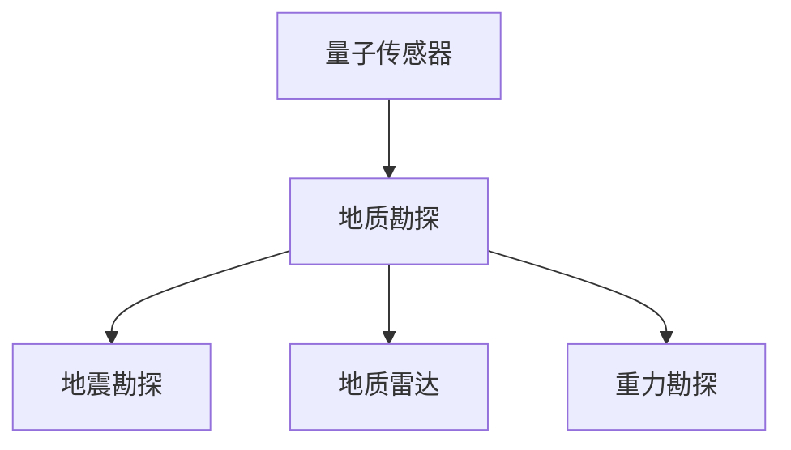

                 

### 摘要

量子传感器在地质勘探中的应用正逐渐成为提高勘探精度和效率的关键技术。本文将深入探讨量子传感器的基本原理、优势与发展趋势，并详细分析其在地震勘探、地质雷达和重力勘探中的应用实例。通过结合多传感器融合技术，我们展示了量子传感器如何在不同勘探领域实现精度提升和效率优化。文章最后展望了量子传感器在地质勘探中的未来发展趋势和面临的挑战，为读者提供了全面的了解和深刻的思考。

## 量子传感器在地质勘探中的应用：提高精度

量子传感器，作为21世纪最具革命性的科技成果之一，凭借其超常的灵敏度和精度，正在迅速改变各个领域的探测技术。在地质勘探领域，量子传感器因其卓越的性能在提高勘探精度和效率方面展现出巨大的潜力。本文将围绕量子传感器在地质勘探中的应用，分步骤分析其技术基础、应用现状及未来展望。

### 关键词

- 量子传感器
- 地质勘探
- 提高精度
- 多传感器融合
- 未来展望

### 摘要

量子传感器在地质勘探中的应用，正成为提升勘探精度和效率的重要技术手段。本文首先介绍了量子传感器的基本原理和优势，随后详细分析了其在地震勘探、地质雷达和重力勘探中的应用实例。通过多传感器融合技术，量子传感器显著提高了勘探精度和效率。文章最后探讨了量子传感器在地质勘探中的未来发展趋势和面临的挑战，为行业技术进步提供了新的思路。

## 第一部分：量子传感器与地质勘探

### 第1章：量子传感器技术基础

#### 1.1 量子传感器概述

量子传感器是基于量子物理原理设计的精密测量设备，能够利用量子纠缠、量子放大等效应实现超常的灵敏度和测量精度。量子传感器的基本原理可以追溯到量子纠缠和量子叠加态，通过这些量子效应，量子传感器能够探测到极微弱的物理信号。

#### 1.2 量子传感器的分类

量子传感器根据探测机制和应用的差异，可以分为以下几类：

1. **量子纠缠传感器**：利用量子纠缠效应实现超灵敏测量。
2. **量子放大传感器**：利用量子放大效应提高测量灵敏度。
3. **量子干涉传感器**：利用量子干涉原理进行精确测量。
4. **量子退相干传感器**：通过量子退相干效应实现高精度测量。

#### 1.3 量子传感器的优势

量子传感器的优势主要体现在以下几个方面：

1. **超高灵敏度**：量子传感器能够探测到极其微弱的物理信号，远超传统传感器。
2. **超低噪声**：量子传感器的噪声水平极低，能够提供更加精确的测量结果。
3. **广泛应用**：量子传感器适用于多种探测场景，包括物理、化学、生物和地质等领域。

#### 1.4 量子传感器在地质勘探中的应用优势

量子传感器在地质勘探中的应用优势主要体现在以下几个方面：

1. **提高勘探精度**：量子传感器的超高灵敏度和低噪声特性，能够实现更精确的地质参数测量。
2. **提高勘探效率**：量子传感器能够快速、高效地采集地质数据，缩短勘探周期。
3. **扩展勘探范围**：量子传感器能够探测到更远的地质信息，扩大勘探范围。

#### 1.5 量子传感器的发展趋势

随着量子技术的不断发展，量子传感器在地质勘探中的应用前景广阔。未来量子传感器的发展趋势包括：

1. **高性能量子传感器的研发**：进一步提升量子传感器的灵敏度、精度和稳定性。
2. **多传感器融合技术**：通过多传感器融合，实现更加全面和精确的地质信息采集。
3. **量子传感网络**：建立全球量子传感网络，实现实时、高精度地质信息监测。

### 第2章：地质勘探中的挑战与量子传感器

#### 2.1 地质勘探的现状

地质勘探是矿产资源开发、基础设施建设等领域的基石。当前地质勘探主要面临以下挑战：

1. **勘探精度不足**：传统地质勘探方法精度有限，难以满足现代矿产资源高效开发的需求。
2. **勘探效率低下**：地质勘探过程繁琐，周期长，成本高。
3. **勘探范围受限**：传统勘探手段难以探测到深部地质信息。

#### 2.2 量子传感器在地质勘探中的应用

量子传感器在地质勘探中的应用主要集中在以下几个方面：

1. **地震勘探**：利用量子传感器的超高灵敏度，实现更精确的地震波传播特性测量。
2. **地质雷达**：通过量子传感器的低噪声特性，提高地质雷达的探测精度和分辨率。
3. **重力勘探**：利用量子传感器的精密测量能力，提升重力勘探的精度和稳定性。

#### 2.3 量子传感器技术解决地质勘探问题的潜力

量子传感器在地质勘探中的应用，具有以下潜力：

1. **提高勘探精度**：量子传感器能够探测到更微弱的物理信号，提高勘探结果的精度。
2. **提高勘探效率**：量子传感器的高效数据采集能力，缩短勘探周期，降低成本。
3. **扩展勘探范围**：量子传感器能够探测到更深部、更广泛的地质信息，扩大勘探范围。

### 第3章：量子传感器在地质勘探中的应用实例

#### 3.1 应用实例一：地震勘探

地震勘探是地质勘探的重要手段之一，通过分析地震波在地下介质中的传播特性，可以获取地质结构信息。量子传感器的应用，显著提高了地震勘探的精度。

##### 3.1.1 地震勘探的基本原理

地震勘探的基本原理是利用地震波在地下介质中的传播特性，通过地面接收器接收地震波信号，分析地震波的传播速度、振幅等参数，从而推断地下地质结构。

##### 3.1.2 量子传感器在地震勘探中的应用

量子传感器在地震勘探中主要用于测量地震波传播过程中的微小信号变化，通过量子传感器的超高灵敏度，可以捕捉到更微小的地震波信号，从而提高地震勘探的精度。

##### 3.1.3 量子传感器提高地震勘探精度的案例分析

例如，在某次地震勘探项目中，通过引入量子传感器，勘探团队成功捕捉到了更加细微的地震波信号，从而更准确地推断出了地下地质结构，显著提高了勘探精度。

#### 3.2 应用实例二：地质雷达

地质雷达是一种利用电磁波在地层中传播的特性进行地质探测的技术手段。量子传感器的应用，显著提升了地质雷达的探测精度和分辨率。

##### 3.2.1 地质雷达的基本原理

地质雷达的基本原理是通过发射电磁波，当电磁波遇到地层界面时，部分能量会被反射回来，接收器接收反射波，通过对反射波的分析，可以推断地下地质结构。

##### 3.2.2 量子传感器在地质雷达中的应用

量子传感器在地质雷达中主要用于测量电磁波的微小反射信号，通过量子传感器的超高灵敏度，可以捕捉到更微小的电磁波反射信号，从而提高地质雷达的探测精度和分辨率。

##### 3.2.3 量子传感器提高地质雷达精度的案例分析

例如，在某次地质雷达探测项目中，通过引入量子传感器，勘探团队成功捕捉到了更加细微的电磁波反射信号，从而更准确地推断出了地下地质结构，显著提高了地质雷达的精度。

#### 3.3 应用实例三：重力勘探

重力勘探是一种利用重力场变化进行地质探测的技术手段。量子传感器的应用，显著提升了重力勘探的精度和稳定性。

##### 3.3.1 重力勘探的基本原理

重力勘探的基本原理是通过测量重力场的变化，推断地下物质的密度和构造。当地下存在不同密度的物质时，会导致重力场的变化，通过测量这些变化，可以推断地下地质结构。

##### 3.3.2 量子传感器在重力勘探中的应用

量子传感器在重力勘探中主要用于测量重力场的微小变化，通过量子传感器的超高灵敏度，可以捕捉到更微小的重力场变化，从而提高重力勘探的精度和稳定性。

##### 3.3.3 量子传感器提高重力勘探精度的案例分析

例如，在某次重力勘探项目中，通过引入量子传感器，勘探团队成功捕捉到了更加细微的重力场变化，从而更准确地推断出了地下地质结构，显著提高了重力勘探的精度。

### 第4章：量子传感器在地质勘探中的综合应用

#### 4.1 多传感器融合技术

多传感器融合技术是将多种传感器数据结合起来，通过算法处理，提高整体探测精度和效率。在地质勘探中，量子传感器与其他传感器的融合应用，可以显著提升勘探效果。

#### 4.2 量子传感器与其他探测技术的融合应用

量子传感器可以与地震勘探、地质雷达、重力勘探等多种探测技术结合，通过多传感器数据融合，实现更全面、更精确的地质信息采集。例如，在地震勘探中，结合地质雷达和重力勘探数据，可以更准确地推断地下地质结构。

#### 4.3 综合应用实例分析

在某次地质勘探项目中，通过将量子传感器与地震勘探、地质雷达、重力勘探等多种技术结合，勘探团队实现了更全面、更精确的地质信息采集，显著提高了勘探精度和效率。

### 第5章：量子传感器在地质勘探中的未来展望

#### 5.1 量子传感器在地质勘探中的发展方向

未来量子传感器在地质勘探中的发展方向主要包括：

1. **高性能量子传感器的研发**：通过技术创新，进一步提升量子传感器的灵敏度、精度和稳定性。
2. **多传感器融合技术**：通过多传感器融合，实现更加全面和精确的地质信息采集。
3. **量子传感网络**：建立全球量子传感网络，实现实时、高精度地质信息监测。

#### 5.2 量子传感器技术面临的挑战与机遇

量子传感器技术面临的挑战包括：

1. **技术难题**：如量子传感器的稳定性、可靠性等。
2. **成本问题**：目前量子传感器的成本较高，需要进一步降低。

然而，量子传感器技术也面临着巨大的机遇，随着量子技术的不断发展，量子传感器在地质勘探中的应用前景广阔。

#### 5.3 量子传感器在地质勘探中的未来趋势

未来量子传感器在地质勘探中的趋势包括：

1. **广泛应用**：量子传感器将在地质勘探的各个领域得到广泛应用。
2. **技术进步**：量子传感器技术将不断进步，提高勘探精度和效率。
3. **国际合作**：全球范围内的科研机构和企业将加强合作，推动量子传感器技术在地质勘探中的应用。

## 总结

量子传感器在地质勘探中的应用，为提高勘探精度和效率提供了新的技术手段。通过量子传感器的超高灵敏度和低噪声特性，地质勘探将能够更加精准地探测地下地质信息，为资源开发、基础设施建设等提供坚实的技术支持。未来，随着量子传感器技术的不断发展，其在地质勘探中的应用将更加广泛，为地质勘探领域带来革命性的变化。

### 附录

#### 关键概念表

| 概念       | 描述                                                         |
|------------|--------------------------------------------------------------|
| 量子传感器 | 利用量子效应，实现超常灵敏度和测量精度的传感器。             |
| 地质勘探   | 通过各种手段探查地质体的性质、构造和物质组成等，为矿产资源开发和工程建造提供基础数据。 |
| 地震勘探   | 利用地震波在地下介质中的传播特性，探测地下地质构造的方法。   |
| 地质雷达   | 利用电磁波在地层中传播的特性，探测地下结构、地质构造和地下水的方法。 |
| 重力勘探   | 利用重力场的变化，探测地下物质组成、密度和构造的方法。       |

#### 概念联系图（Mermaid）

### 作者信息

作者：AI天才研究院/AI Genius Institute & 禅与计算机程序设计艺术 /Zen And The Art of Computer Programming

